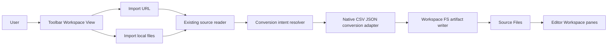
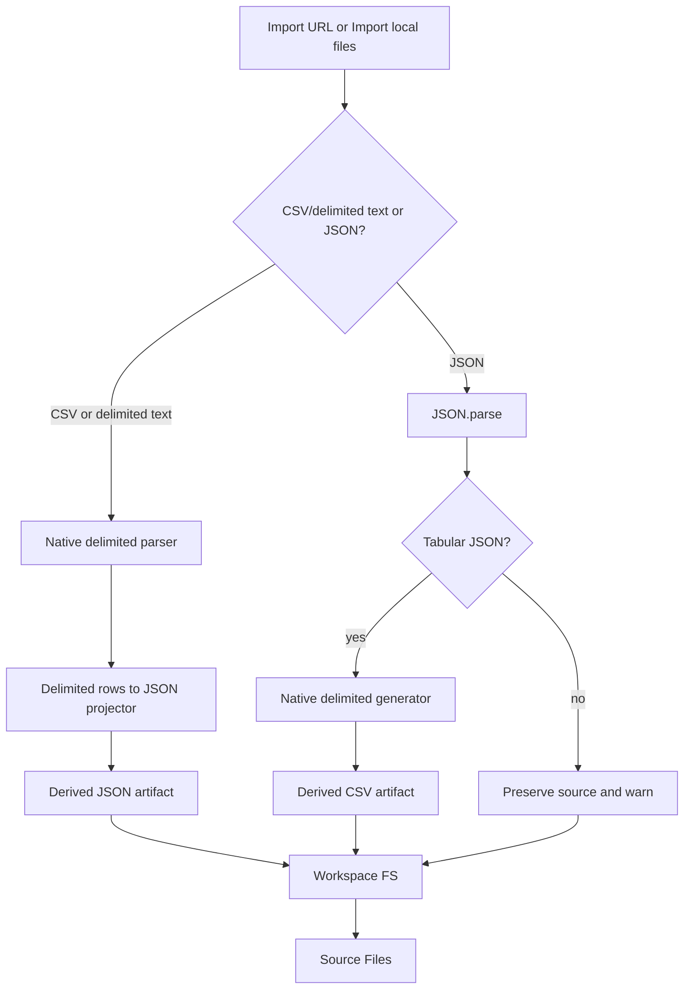
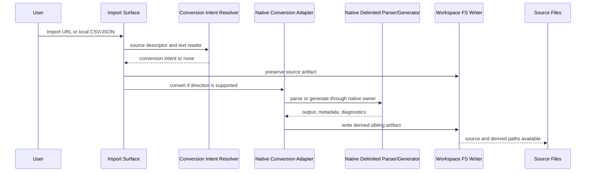

# Knowgrph CSV JSON Import Conversion - PRD and TAD

## Executive Summary

Knowgrph should support bidirectional conversion between CSV or delimited text and JSON at the existing import surfaces:

- Toolbar -> Workspace View -> Import URL
- Toolbar -> Workspace View -> Import local files

The implementation target is a native in-repo conversion owner inspired by the public capabilities of [mholt/PapaParse](https://github.com/mholt/PapaParse), not a PapaParse dependency, not vendored PapaParse source, and not a compatibility alias around a copied parser. PapaParse is used only as a high-level reference for feature categories that a robust browser CSV or delimited-text system is expected to handle: local and remote input, delimiter and header handling, bidirectional parse/generate behavior, chunked large-file processing, worker-friendly execution, structured diagnostics, and spreadsheet formula safety.

JSON parsing and formatting remain native runtime responsibilities through `JSON.parse` and `JSON.stringify`. No AI harness is required for the Must scope; token cost is zero. If future AI-assisted schema inference is added, it must enter through the existing chat harness contract and remain outside the required deterministic conversion path.

## Governing Directives

| Principle | Product Directive | Technical Directive |
|---|---|---|
| Universal | Any CSV, TSV, compatible delimited text, or JSON file imported by URL or local selection can produce the opposite representation when structurally valid. | Infer behavior from content type, extension, parser result, and user intent, not from project names, fixture paths, or repo-local hardcodes. |
| Neutral | Conversion is a source-owned data operation, not a view-specific effect. | Keep conversion output format-neutral and UI-neutral; do not bind parser behavior to one pane, panel, workspace, or demo file. |
| File-agnostic | CSV and JSON enter the same import provenance model as other text formats. | Preserve original source text and write derived output with explicit metadata. |
| Native in-repo | Knowgrph owns the parser, generator, metadata, diagnostics, and tests. | Develop a shared native module in the repo; FORBID external parser dependency installation, vendoring, wrapper aliases, or copied implementation structure. |
| No-copy reference | PapaParse is a public inspiration source only. | FORBID copying code, docs wording, API names, tests, fixtures, examples, issue text, comments, parser states, or bundled assets from PapaParse. |
| Large-file ready | Users can import large delimited files without freezing the workspace. | Use bounded memory, chunked scanning, progress reporting, abort support, and worker-compatible ownership where the platform supports it. |
| Malformed-input ready | Bad CSV does not become silent data corruption. | Emit structured diagnostics with row, column, byte or character range where available; preserve source and avoid inventing repaired data as truth. |
| TCO-zero | The feature runs in browser/local runtime with no recurring infrastructure cost. | No remote conversion service, no Cloudflare-only conversion dependency, and no paid parser service. |
| Cleanup-first | Existing ad hoc CSV parsing should be neutralized at the root when implementation follows. | Replace scattered line splitting with a shared native delimited-text owner; do not add compatibility shims for stale behavior. |

## Reference Evidence and No-Copy Boundary

### Public Capability Reference

Context7 resolves PapaParse as `/mholt/papaparse`, and the public GitHub project describes a JavaScript CSV or delimited-text parser with support for bidirectional conversion, local and remote input, large-file streaming, delimiter detection, worker execution, header rows, pause/resume/abort behavior, type conversion options, and quote/line-break handling.

Those capabilities establish a benchmark for what a robust import conversion feature should consider. They do not establish a license to copy source, examples, tests, docs language, naming, or internal design.

### Allowed Inspiration

The implementation may use PapaParse only as capability-level inspiration for:

- CSV and delimited-text parsing.
- JSON-shaped row projection from header-bearing delimited text.
- CSV or delimited-text generation from tabular JSON shapes.
- Delimiter, quote, escape, newline, and header policy configuration.
- Structured diagnostics for malformed rows, unclosed quotes, field-count mismatch, bad delimiters, and unsupported input.
- Chunked or streaming parse progress for large local files and fetched URL bodies.
- Worker-compatible execution boundaries that keep the editor workspace responsive.
- Formula-prefix escaping for generated spreadsheet-oriented output.

### Forbidden Copying

Implementation and tests must not copy from PapaParse:

- Source files or minified bundles.
- Parser state machine structure, variable names, comments, or control-flow layout.
- Public method names, public option names, result object names, or exported constants as Knowgrph API contracts.
- Documentation prose, examples, demo data, README fragments, or website content.
- Test cases, fixtures, issue reproductions, edge-case examples, benchmarks, or generated snapshots.
- Packaging structure, build scripts, worker bootstrapping code, or browser integration patterns.

When the implementation needs an edge-case fixture, author a new neutral fixture from the CSV and JSON rules this PRD/TAD defines. When the implementation needs an API shape, name it around Knowgrph semantics, not PapaParse semantics.

### Native JSON Evidence

Native JSON handling remains the runtime standard:

- `JSON.parse(text)` converts JSON text to JavaScript values and throws on invalid JSON.
- `JSON.stringify(value, null, 2)` serializes valid JSON-compatible values with readable deterministic indentation.

## Current Implementation Baseline

| Concern | Current owner | Existing behavior | CSV/JSON conversion target |
|---|---|---|---|
| Toolbar JSON/CSV import | `canvas/src/features/toolbar/jsonImportAction.ts` | Imports URL/local JSON and local CSV, then calls the import flow. | Route CSV/JSON conversion intent through the same flow and cover URL CSV/delimited text. |
| Import side effects | `canvas/src/features/toolbar/importSideEffects.ts` | Wraps CSV in a Markdown fence and converts JSON to Markdown when possible. | Preserve source and add derived sibling JSON/CSV artifacts through a shared conversion owner. |
| Workspace FS writes | `canvas/src/features/markdown-workspace/workspaceFs.ts` and import helpers | Owns workspace file creation and path conflict handling. | Write original and derived artifacts through the existing source-file/workspace path authority. |
| Format allowlist | `canvas/src/lib/config-copy/importExportCopy.ts` | Includes `.csv`, `.json`, `.jsonc`, `.jsonld`, `.geojson`. | Keep allowlist centralized; no format-specific UI forks. |
| Legacy graph CSV parser | `canvas/src/lib/graph/csv.ts` | Has hand-rolled CSV row parsing for graph import. | Replace or isolate behind the native shared delimited-text parser during implementation; do not expand the legacy parser. |
| Source Files provenance | Workspace file records and metadata helpers | Existing imports create workspace artifacts. | Store source hash, derived path, conversion direction, parser version, diagnostics, and safety settings with the derived artifact. |

## PRD

### Problem Statement

Users import data as CSV from spreadsheets, APIs, logs, exports, and datasets, then need JSON for structured editing, graph parsing, chat context, or downstream automation. They also import JSON from APIs or local files, then need CSV or another delimited text form for tabular inspection, export, spreadsheet review, or graph-table workflows.

Today CSV and JSON import paths exist, but conversion ownership is not explicit and older CSV parsing logic can drift into ad hoc line splitting. That creates correctness risk around quoted delimiters, embedded newlines, duplicate headers, formula-like values, very large files, and malformed input.

The desired behavior is a source-owned conversion contract: importing a CSV/delimited-text or JSON file by URL or local file can create the original source artifact and a derived sibling artifact in the opposite format, with errors, metadata, and provenance preserved. Conversion must remain generic, local, native in-repo, dependency-free for CSV, and easy to validate.

### Personas and Jobs To Be Done

| Persona | Job To Be Done | Need |
|---|---|---|
| Solo founder | Import a data file and immediately inspect it as both a table and structured JSON. | Minimum build scope, zero recurring cost, and no service setup. |
| AI-native developer | Give agents a stable JSON representation of CSV without rereading raw spreadsheet text. | Provenance and deterministic conversion before token spend. |
| Data operator | Convert JSON API responses to CSV for review and CSV files to JSON for schema inspection. | Predictable headers, diagnostics, and formula-injection safety. |
| Maintainer | Keep parsing behavior reusable across import, graph parsing, and future table panes. | One neutral parser/generator owner and no stale downstream patches. |

### User Journey

| Stage | Action | Touchpoint | Pain Point | Opportunity |
|---|---|---|---|---|
| Trigger | User has a CSV/delimited-text or JSON URL/local file. | Toolbar -> Workspace View | Current import parses some data but does not consistently materialize the opposite format. | Add conversion as a source-owned import artifact. |
| Discover | User chooses Import URL or Import local files. | Existing toolbar action | A separate converter would fragment the workflow. | Reuse import affordances and avoid a second entry point. |
| Convert | System detects CSV/delimited text or JSON and creates derived output. | Workspace FS / Source Files | Ad hoc parsing can lose metadata or mishandle quoting, line breaks, or malformed rows. | Use the native shared delimited-text owner and native JSON APIs. |
| Inspect | User opens source or derived artifact. | Editor Workspace / Source Files | The user needs trust in what was transformed. | Show source and derived artifacts as sibling files with conversion metadata. |
| Recover | Input is malformed or unsupported. | Import toast / Source metadata | Silent partial data is worse than a visible warning. | Preserve source, write only safe derived output, and surface structured diagnostics. |

### Epics, Stories, and Acceptance Criteria

#### PRD-CJ-01: Import CSV or Delimited Text and Generate JSON

**PRD-CJ-01-S01: Local CSV to JSON**

As a data operator, I want Import local files to convert a selected CSV file into JSON so that I can inspect and edit structured data without leaving Knowgrph.

Acceptance criteria:

- Given a local `.csv` file with a header row, when the user imports it through Import local files, then Knowgrph preserves the `.csv` source and writes a sibling `.json` artifact containing row objects, parse metadata, and normalized diagnostics when present.
- Given quoted fields with delimiters, escaped quotes, and embedded line breaks, when conversion runs, then the resulting JSON preserves cell text exactly except for documented newline normalization.
- Given duplicate or missing headers, when conversion runs, then the parser records deterministic header diagnostics and uses a documented neutral header policy rather than silently overwriting data.
- `/goal` translation: local CSV import writes original and derived JSON workspace artifacts, verified by focused import tests, with no external CSV parser dependency and no hardcoded fixture path.

**PRD-CJ-01-S02: URL CSV to JSON**

As a developer, I want Import URL to convert a remote CSV URL into JSON so that API-provided CSV can become structured workspace data.

Acceptance criteria:

- Given a URL whose normalized path, content disposition, content type, or response name resolves to `.csv`, `.tsv`, or supported delimited text, when Import URL fetches it successfully, then the same CSV-to-JSON adapter runs and writes original plus derived artifacts through Workspace FS.
- Given a URL response body that is large, when conversion runs, then progress and abort behavior are available through the shared import runtime and parsing does not monopolize the UI thread.
- `/goal` translation: URL CSV import uses the same conversion adapter as local CSV, verified by stubbed fetch tests and no external network dependency.

**PRD-CJ-01-S03: Configurable Delimited Text**

As a data operator, I want tab-delimited or semicolon-delimited files to use the same conversion owner so that common delimited exports are not implemented as special cases.

Acceptance criteria:

- Given `.tsv`, `.tab`, or content that clearly uses tab, semicolon, pipe, or comma delimiters, when conversion runs, then delimiter resolution comes from shared options and deterministic sniffing.
- Given ambiguous delimiter evidence, when conversion cannot choose safely, then the source is preserved and a structured diagnostic asks for explicit delimiter selection in a future UI rather than guessing destructively.
- `/goal` translation: delimiter tests prove comma, tab, semicolon, and pipe handling without branch-specific import bridges.

#### PRD-CJ-02: Import JSON and Generate CSV or Delimited Text

**PRD-CJ-02-S01: Local JSON to CSV**

As a data operator, I want Import local files to convert valid JSON arrays into CSV so that structured API data can be reviewed as rows.

Acceptance criteria:

- Given a local `.json` file containing an array of objects, array of arrays, or `{ "fields": [...], "data": [...] }`, when the user imports it through Import local files, then Knowgrph preserves the `.json` source and writes a sibling `.csv` artifact using the native delimited-text generator.
- Given scalar JSON, nested non-tabular objects, or mixed roots that cannot be represented as a stable table, when conversion runs, then the source JSON remains imported and a structured conversion warning is recorded without inventing columns.
- `/goal` translation: local JSON import writes a derived CSV artifact for supported tabular JSON shapes, verified by focused tests, with scalar/root-object JSON rejected or deferred unless single-row mode is explicitly implemented.

**PRD-CJ-02-S02: URL JSON to CSV**

As a developer, I want Import URL to convert remote JSON into CSV when it has a tabular shape so that fetched API data can become reviewable table output.

Acceptance criteria:

- Given a URL that resolves to `.json`, `.geojson`, or `.jsonld` and returns valid JSON, when Import URL imports it, then a derived CSV is written only if the root has a supported tabular shape.
- Given invalid JSON from a URL, when native parsing fails, then the source is preserved when possible and the conversion error records the JSON parse failure without retry loops or alternate parser guessing.
- `/goal` translation: URL JSON import keeps source JSON and creates CSV only for supported tabular roots, verified by stubbed URL import tests and conversion warning assertions.

#### PRD-CJ-03: Provenance, Safety, Large Files, and Malformed Input

**PRD-CJ-03-S01: Derived Artifact Provenance**

As a user, I want the original import and derived conversion to remain linked so that I can trust which file came from which source.

Acceptance criteria:

- Given any generated CSV or JSON artifact, when it is written, then metadata records source path, source hash, conversion direction, parser owner, parser version, row count, field names, delimiter, newline policy, diagnostics count, and safety options.
- Given a source file already exists, when the derived path conflicts, then existing workspace path conflict handling chooses a deterministic sibling path without overwriting user content.
- `/goal` translation: conversion metadata is asserted in unit tests and path conflicts reuse existing workspace file naming behavior.

**PRD-CJ-03-S02: CSV Output Safety and Validation**

As a data operator, I want generated CSV to avoid spreadsheet formula injection and malformed output so that exported data is safer to open in spreadsheet tools.

Acceptance criteria:

- Given JSON values that begin with spreadsheet formula prefixes, when JSON-to-CSV conversion runs, then the native generator escapes those cells by default and records that safety policy in metadata.
- Given generated cell values with delimiters, quotes, carriage returns, or line feeds, when generation runs, then output quoting and escaping are deterministic and reversible by the native parser.
- `/goal` translation: JSON-to-CSV tests prove formula-like cells are escaped by default and no external CSV serializer is used.

**PRD-CJ-03-S03: Large File Handling**

As a user importing large CSV files, I want the workspace to remain responsive so that one import does not block editing.

Acceptance criteria:

- Given a large local CSV file, when conversion runs, then the parser scans in bounded chunks or an equivalent streaming mode rather than duplicating the full file multiple times in memory.
- Given a long-running parse, when the user cancels the import or the import runtime aborts, then parser state stops without writing a partial derived artifact as complete.
- Given the browser supports worker execution for this owner, when large parsing is enabled, then parser work can move off the main thread through a repo-owned worker boundary without relying on an external library worker.
- `/goal` translation: large-file tests or smoke fixtures verify progress callbacks, abort behavior, bounded chunk ownership, and no infinite parse loop.

**PRD-CJ-03-S04: Malformed Input Diagnostics**

As a user importing imperfect CSV files, I want malformed input to produce actionable diagnostics rather than silent corruption.

Acceptance criteria:

- Given unclosed quotes, uneven field counts, illegal delimiter configuration, invalid escape sequences, or row-length mismatch, when parsing runs, then diagnostics identify the problem type and best available row, column, and character range.
- Given diagnostics that are warnings rather than fatal errors, when conversion proceeds, then the derived JSON records diagnostics and metadata so consumers can inspect risk.
- Given diagnostics that make output unsafe, when conversion fails, then the source artifact remains and no derived artifact is written as if successful.
- `/goal` translation: malformed-input tests verify structured diagnostics, source preservation, no stale derived file, and no retry loop.

#### PRD-CJ-04: Import Surface Reuse and Cleanup

**PRD-CJ-04-S01: Reuse Existing Import Surfaces**

As a maintainer, I want CSV/JSON conversion to reuse Import URL and Import local files so that users do not learn another data entry point.

Acceptance criteria:

- Given the implementation, when code search runs, then there is no new Launch-level CSV/JSON converter entry point and no duplicate import bridge for conversion.
- Given CSV or JSON import is disabled or fails upstream, when conversion is requested, then existing import error surfaces handle the failure.
- `/goal` translation: import tests call existing toolbar/import owners and no new top-level import command is created.

**PRD-CJ-04-S02: Neutralize Ad Hoc CSV Parsing**

As a maintainer, I want the native delimited-text owner to be the only parser/generator path so that quoting, delimiters, headers, streaming, malformed input, and formula safety are not implemented repeatedly.

Acceptance criteria:

- Given current CSV graph parsing utilities, when implementation lands, then shared CSV parsing delegates to the native delimited-text owner or the older parser is replaced.
- Given code search for new CSV line-splitting parsers, when validation runs, then only the shared native parser owns delimited-text tokenization.
- Given any tests added for CSV conversion, when review runs, then fixtures are authored in-repo from this spec and not copied from PapaParse.
- `/goal` translation: focused parser guard asserts the native owner is reused and forbids new manual CSV line parsing outside that owner.

### Success Metrics

| Metric | Baseline | Target | Validation Phase |
|---|---|---|---|
| CSV-to-JSON local conversion success | Existing CSV import only | Source CSV plus derived JSON artifact in one import | Phase 1 |
| JSON-to-CSV local conversion success | JSON import only | Source JSON plus derived CSV artifact for tabular roots | Phase 1 |
| URL conversion parity | URL JSON exists; URL CSV path not explicit | URL and local use the same adapter contracts | Phase 1 |
| Delimited-text correctness | Older manual parser risk | Native parser/generator fixtures cover quotes, escapes, newlines, delimiters, headers, and round trip | Phase 1 |
| Malformed-input visibility | Parse failures may be import-local or silent | Structured diagnostics with source preservation | Phase 1 |
| Large-file responsiveness | No explicit owner | Chunk/progress/abort path with worker-compatible boundary | Phase 2 |
| Token cost | Not applicable | `0` tokens in Must scope | Ongoing |
| Monthly TCO | `$0` | `$0`; no new parser dependency | Ongoing |

### ROI and TCO Estimate

```
ROI Score = (User Impact x Reach) / (Build Hours + Monthly TCO + Token Cost / Month)

User Impact : 4
Reach       : 4
Build Hours : 0.75 doc + 1.5 native parser MVP + 1.0 import integration + 1.0 focused tests
Monthly TCO : 0
Token Cost  : 0

ROI Score = (4 x 4) / (4.25 + 0 + 0) = 3.76
```

This clears the minimum scope threshold because it upgrades an existing import path, preserves source artifacts, and avoids recurring TCO. Large-file worker execution can phase after the parser's chunk/progress contract exists, but the parser interface must not block that future path.

### MoSCoW

| Priority | Capability | ROI Weight | Rationale |
|---|---:|---:|---|
| Must | Native in-repo CSV/delimited-text to JSON parser | 30 | Removes manual parsing drift and unlocks structured inspection without dependency cost. |
| Must | Native in-repo JSON to CSV/delimited-text generator | 27 | Covers common API/spreadsheet workflow at zero token cost. |
| Must | Existing Import URL and Import local files reuse | 25 | Prevents UI duplication and keeps provenance centralized. |
| Must | Malformed-input diagnostics | 24 | Prevents silent corruption for real-world CSV. |
| Must | Formula escaping for generated CSV output | 18 | Low effort and high safety value. |
| Must | No-copy PapaParse reference boundary | 18 | Keeps implementation native, clean, reviewable, and dependency-free. |
| Should | Chunk/progress/abort path for large files | 16 | Required for large files; can land incrementally behind the same parser interface. |
| Should | Worker-compatible parser execution | 12 | Keeps UI responsive for large inputs; implementation can follow chunking. |
| Could | Single-object JSON to one-row CSV mode | 5 | Useful but risks implicit schema choices. |
| Could | JSON Lines support | 5 | Adjacent format, not requested. |
| Won't | AI schema inference for ambiguous CSV/JSON | 0 | Outside deterministic Must scope and would add token cost. |
| Won't | External PapaParse dependency, vendored bundle, or wrapper alias | 0 | Explicitly forbidden by this PRD/TAD. |
| Won't | Legacy compatibility aliases for older ad hoc CSV parser behavior | 0 | Cleanup should happen at the source owner. |
| Won't | Server-side conversion service | 0 | Adds TCO and deployment coupling without need. |

### Minimum Viable Scope

Implementation should:

- Add one shared native conversion module under the existing import/parser owner tree.
- Add one shared native delimited-text parser/generator owner in repo code.
- Keep JSON parse/format behavior on `JSON.parse` and `JSON.stringify`.
- Preserve source artifacts before writing derived artifacts.
- Write derived artifacts only when conversion succeeds or succeeds with non-fatal diagnostics.
- Record structured diagnostics, metadata, and provenance.
- Support CSV defaults plus tab, semicolon, and pipe delimiters through shared options.
- Provide a parser interface with chunk/progress/abort support from the first implementation, even if worker execution is a later implementation detail.
- Add static guards against importing, vendoring, or copying PapaParse.
- Add focused tests for quoted delimiters, escaped quotes, embedded newlines, duplicate headers, uneven rows, formula escaping, URL/local parity, and unsupported JSON roots.

Implementation should not:

- Add `papaparse` or any external CSV parser package.
- Copy, paste, translate, adapt line-by-line, vendor, or minify PapaParse code.
- Copy PapaParse tests, fixtures, docs text, examples, API naming, or worker bootstrap.
- Add a standalone converter overlay, separate toolbar command, server route, or Cloudflare-only behavior.
- Backfill legacy parser aliases or remap stale behavior.

### Dependencies

| Dependency | Type | TCO | Role | Decision |
|---|---|---:|---|---|
| Native in-repo delimited-text parser/generator | Repo module | `$0` | CSV/delimited-text parse and generate | Required owner. |
| Native `JSON.parse` / `JSON.stringify` | Runtime API | `$0` | JSON parse and formatting | Required owner. |
| `mholt/PapaParse` public project | Reference only | `$0` | Capability-level inspiration | No dependency, no copy, no API compatibility target. |
| Existing Workspace FS / Source Files owners | Repo module | `$0` | Source and derived artifact persistence | Reuse. |

### Scope Boundaries

In scope:

- Import URL CSV/delimited-text to JSON.
- Import local CSV/delimited-text to JSON.
- Import URL JSON to CSV.
- Import local JSON to CSV.
- Source plus derived sibling artifacts.
- Native parser/generator metadata, diagnostics, and provenance.
- Large-file chunk/progress/abort contract.
- Formula escaping for generated CSV output.
- Focused tests and static guards.

Out of scope:

- Production mirror deployment.
- Cloudflare deployment.
- AI schema inference.
- Spreadsheet formula evaluation.
- Spreadsheet UI replacement.
- JSONC comment-preserving conversion.
- JSON Lines conversion.
- Automatic repair that mutates malformed CSV without diagnostics.
- Backward compatibility with stale ad hoc parser behavior.
- PapaParse dependency, vendoring, copy, or API compatibility.

### Open Questions

| Question | Proposed Default | Owner |
|---|---|---|
| Should CSV conversion infer header absence? | No. Header row is required for object JSON; array-of-arrays mode can be explicit future scope. | Import/parser owner |
| Should duplicate headers be renamed, rejected, or represented as arrays? | Default to deterministic neutral renaming with diagnostics, then validate with graph/table consumers. | Native parser owner |
| Should generated CSV include all object keys or only first-row keys? | Default to union of keys in first-seen order unless an explicit `fields` shape is provided. | Native generator owner |
| Should URL CSV parse from fetched text or streams? | Reuse existing URL fetch owner. Prefer stream/chunk input where available; do not delegate downloading to an external parser. | Workspace URL import owner |
| What maximum file size should first UI expose? | Use existing import max-byte policy if present; otherwise document a guard before implementation. | Import owner |

## TAD

### System Context

From CSV/JSON import to derived sibling artifact:



### Data Flow: CSV or Delimited Text to JSON

| Stage | Component | Input Format | Output Format | Persistence | Error Handling |
|---|---|---|---|---|---|
| Ingest | Import URL / local file owner | `.csv`, `.tsv`, `.tab`, or fetched delimited text | Source workspace file | Workspace FS | Fetch/read failures become import failures. |
| Parse | Native delimited-text parser | Text stream, chunk iterator, string, or file text | `{ rows, diagnostics, metadata }` | None | Fatal diagnostics stop derived write; non-fatal diagnostics are preserved. |
| Transform | CSV-to-JSON projector | Header row plus parsed row cells | JSON artifact `{ rows, metadata, diagnostics, conversion }` | None | Missing headers, duplicate headers, or field mismatch follow documented policy. |
| Store | Workspace FS artifact writer | JSON string | Derived `.json` workspace file | Workspace FS / Source Files | Write failure surfaces import error and preserves source. |
| Serve | Editor Workspace / Source Files | Source and derived paths | Editable JSON / graph parse input | Existing workspace state | Existing parser warnings apply. |

### Data Flow: JSON to CSV or Delimited Text

| Stage | Component | Input Format | Output Format | Persistence | Error Handling |
|---|---|---|---|---|---|
| Ingest | Import URL / local file owner | `.json`, `.geojson`, `.jsonld`, or fetched JSON text | Source workspace file | Workspace FS | Fetch/read failures become import failures. |
| Parse | Native JSON adapter | JSON string | JavaScript value | None | `JSON.parse` throw becomes structured conversion error. |
| Validate | Tabular JSON shape resolver | Unknown JSON value | Row model | None | Unsupported roots emit warning and skip derived CSV. |
| Generate | Native delimited-text generator | Row model | CSV/delimited-text string | None | Formula-like cells escaped; invalid columns fail fast. |
| Store | Workspace FS artifact writer | CSV string | Derived `.csv` workspace file | Workspace FS / Source Files | Write failure surfaces import error and preserves source. |
| Serve | Editor Workspace / Source Files | Derived path | CSV fence/viewer/parser input | Existing workspace state | Existing parser warnings apply. |

### Component Specifications

#### TAD-CJ-C01: Conversion Intent Resolver

**Responsibility**: Detect whether an imported source can produce a derived CSV or JSON artifact.

**Inputs**:

- Source path.
- MIME/content type when available.
- URL path or local filename.
- Raw text preview or source reader metadata.
- User import action context.

**Outputs**:

```ts
type CsvJsonConversionDirection = "delimited-to-json" | "json-to-delimited";

interface CsvJsonConversionIntent {
  direction: CsvJsonConversionDirection;
  sourcePath: string;
  sourceKind: "url" | "local-file";
  sourceFormat: "csv" | "tsv" | "delimited-text" | "json" | "geojson" | "jsonld";
  targetExtension: ".json" | ".csv";
  options: CsvJsonConversionOptions;
}
```

**Configuration**: Extension allowlist, optional user conversion toggle, max bytes, default delimited-text options.

**Goal conditions**:

- Local and URL `.csv`/`.tsv` imports produce `delimited-to-json` intent.
- Local and URL `.json` imports produce `json-to-delimited` intent when source text is valid tabular JSON.
- Unsupported formats do not enter conversion.

#### TAD-CJ-C02: Native Delimited Text Parser and Generator

**Responsibility**: Parse CSV/delimited text and generate CSV/delimited text using repo-owned code only.

**Inputs**:

```ts
interface DelimitedTextParseOptions {
  delimiter?: "," | "\t" | ";" | "|" | string;
  delimiterCandidates?: string[];
  quote?: string;
  escape?: string;
  newline?: "\n" | "\r\n" | "\r" | "auto";
  header?: boolean;
  trimEmptyTrailingRows?: boolean;
  maxBytes?: number;
  chunkSizeBytes?: number;
  signal?: AbortSignal;
  onProgress?: (progress: DelimitedTextProgress) => void;
}

interface DelimitedTextGenerateOptions {
  delimiter?: "," | "\t" | ";" | "|" | string;
  quote?: string;
  escape?: string;
  newline?: "\n" | "\r\n";
  fields?: string[];
  escapeFormulaCells?: boolean;
}
```

**Outputs**:

```ts
interface DelimitedTextParseResult {
  rows: string[][];
  headers?: string[];
  diagnostics: DelimitedTextDiagnostic[];
  metadata: {
    delimiter: string;
    newline: "\n" | "\r\n" | "\r" | "mixed" | "unknown";
    rowCount: number;
    fieldCount?: number;
    parserOwner: "knowgrph-native-delimited-text";
    parserVersion: string;
    aborted: boolean;
  };
}

interface DelimitedTextDiagnostic {
  severity: "warning" | "error";
  code:
    | "ambiguous-delimiter"
    | "bad-delimiter"
    | "duplicate-header"
    | "empty-header"
    | "field-count-mismatch"
    | "invalid-escape"
    | "max-bytes-exceeded"
    | "unclosed-quote"
    | "unsupported-input";
  message: string;
  row?: number;
  column?: number;
  characterStart?: number;
  characterEnd?: number;
}
```

**Design directives**:

- Implement as a small deterministic scanner with explicit states owned by Knowgrph.
- Keep public API naming neutral and Knowgrph-specific.
- Keep parser pure where possible; file reading and URL fetching remain upstream.
- Allow chunked input from file streams, fetched streams, or text slices.
- Report progress monotonically and avoid re-parsing completed chunks.
- Abort promptly and do not write partial results as complete.
- Preserve source text; diagnostics explain risk instead of mutating truth silently.
- Generate output through the same delimiter, quote, escape, newline, and formula-safety policy used by parse tests.
- Do not copy PapaParse state names, option names, fixtures, examples, or implementation structure.

**Dependencies**: Native repo code only.

**TCO / Vendor**: `$0`; no npm parser dependency.

**Goal conditions**:

- Quoted delimiters, escaped quotes, embedded line breaks, and mixed newlines parse correctly.
- JSON-to-CSV generation round-trips through the native parser for supported cells.
- Formula-like values are escaped by default when generating CSV.
- Large input supports chunk/progress/abort behavior without infinite loops.
- Malformed input emits structured diagnostics.
- Static guards forbid PapaParse imports, vendored bundles, copied fixtures, and new manual line splitting outside this owner.

#### TAD-CJ-C03: Native JSON Adapter and Tabular Shape Resolver

**Responsibility**: Parse, validate, and format JSON with native runtime APIs, then resolve whether the value can become delimited text.

**Supported tabular roots**:

- Array of objects.
- Array of arrays.
- Object shaped as `{ "fields": string[], "data": unknown[][] }`.
- GeoJSON FeatureCollection can be future scope unless implementation explicitly flattens `features[*].properties`.

**Unsupported roots**:

- Scalar values.
- Single object without explicit one-row mode.
- Deep nested heterogeneous structures without flattening policy.
- JSONC comments for standard JSON conversion.

**Outputs**:

```ts
interface JsonTabularModel {
  fields: string[];
  rows: unknown[][];
  sourceShape: "array-of-objects" | "array-of-arrays" | "fields-data";
  diagnostics: CsvJsonConversionDiagnostic[];
}
```

**Dependencies**: native `JSON.parse`, native `JSON.stringify`.

**Goal conditions**:

- Invalid JSON preserves source artifact and surfaces a structured error.
- Supported tabular JSON roots convert to CSV.
- Unsupported roots do not silently invent columns.

#### TAD-CJ-C04: Derived Artifact Writer

**Responsibility**: Persist source and derived artifacts through existing workspace file ownership.

**Inputs**:

```ts
interface CsvJsonDerivedArtifact {
  sourcePath: string;
  targetPathHint: string;
  targetText: string;
  targetFormat: "json" | "csv";
  metadata: CsvJsonConversionMetadata;
  diagnostics: CsvJsonConversionDiagnostic[];
}
```

**Metadata schema**:

```ts
interface CsvJsonConversionMetadata {
  conversionId: string;
  sourcePath: string;
  sourceHash: string;
  direction: CsvJsonConversionDirection;
  sourceFormat: string;
  targetFormat: string;
  rowCount?: number;
  fieldNames?: string[];
  delimiter?: string;
  newline?: string;
  parserOwner: "knowgrph-native-delimited-text" | "native-json";
  parserVersion: string;
  safety: {
    formulaEscaping?: boolean;
  };
  diagnosticsSummary: {
    warnings: number;
    errors: number;
  };
  createdAt: string;
}
```

**Goal conditions**:

- Source artifact is not overwritten by derived artifact.
- Derived artifact path conflict uses existing workspace naming behavior.
- Metadata can be inspected in Source Files or test assertions.

#### TAD-CJ-C05: Import Error and Diagnostics Presenter

**Responsibility**: Surface conversion diagnostics through existing import and Source Files affordances without creating a separate converter UI.

**Rules**:

- Fatal conversion failure still imports source when source read succeeded.
- Non-fatal warnings can write derived output with diagnostics attached.
- Diagnostics are deterministic and testable.
- User-visible wording avoids library-specific names unless explicitly showing the no-copy reference in docs.

### Integration Contracts

| Interface | Caller | Callee | Contract | Error Policy |
|---|---|---|---|---|
| Conversion intent | Import action | Intent resolver | Source descriptor -> optional intent | Unsupported source returns `null`. |
| Delimited parse | Conversion adapter | Native parser | Text/chunk source + options -> parse result | Fatal diagnostics fail derived artifact. |
| JSON parse | Conversion adapter | Native JSON adapter | Text -> unknown | Throw becomes structured error with source preserved. |
| CSV generation | Conversion adapter | Native generator | Tabular model + options -> delimited text | Unsupported cells stringify deterministically or fail by policy. |
| Artifact write | Conversion adapter | Workspace FS | Source plus derived artifact descriptors | Existing workspace errors surface through import UI. |
| Diagnostics | Converter | Import presenter | Structured diagnostics | Fatal vs warning severity preserved. |

### Workflow



### Sequence Diagram



### Architectural Decisions

#### ADR-CJ-01: Develop a Native In-Repo Delimited-Text Owner

**Status**: Accepted for implementation planning.

**Context**: CSV and delimited-text parsing is deceptively complex because of quoted delimiters, escaped quotes, embedded newlines, header rows, delimiter ambiguity, malformed input, large files, and spreadsheet safety. PapaParse publicly demonstrates the capability categories users expect, but this project explicitly requires native in-repo development and forbids copy.

**Decision**: Develop a native Knowgrph delimited-text parser and generator. Refer to PapaParse only as public capability inspiration. Do not install PapaParse, vendor it, wrap it, copy its APIs, or copy its tests/fixtures/docs/implementation.

**Alternatives considered**:

1. Native in-repo parser/generator: zero dependency, full ownership, clean no-copy boundary, more test work.
2. PapaParse dependency: mature FOSS package, but violates the requested native in-repo and no-dependency direction.
3. Existing local CSV parser expansion: zero dependency, but risks growing stale ad hoc behavior in the wrong owner.
4. Server-side CSV conversion: unnecessary recurring operational path and deployment coupling.

**TCO comparison**:

| Option | Build Cost | Runtime TCO | Maintenance Risk | Decision |
|---|---:|---:|---|---|
| Native in-repo owner | Medium | `$0` | Medium, mitigated by focused fixtures and static guards | Accept |
| PapaParse package | Low | `$0` | Low, but violates requirement | Reject |
| Legacy parser expansion | Low now | `$0` | High duplicate/churn risk | Reject |
| Server converter | Medium | Non-zero ops risk | Medium deployment coupling | Reject |

**Consequences**:

- Positive: deterministic in-repo ownership, no external parser dependency, no copy risk when guarded.
- Positive: shared owner can serve import, graph parsing, and future table panes.
- Negative: more focused edge-case tests are required.
- Neutral: PapaParse remains a public reference link in docs only.

#### ADR-CJ-02: Use Native JSON APIs as the JSON Owner

**Status**: Accepted.

**Context**: JSON parsing and formatting do not require a third-party dependency for standard JSON.

**Decision**: Use `JSON.parse` for parsing and `JSON.stringify(value, null, 2)` for formatted output. Reject unsupported tabular conversion shapes with structured warnings.

**Alternatives considered**:

1. Native JSON APIs: zero dependency, standard behavior.
2. JSON5/JSONC parser: useful for non-standard inputs but outside requested scope.
3. AI schema inference: high flexibility but token cost and non-determinism.

**TCO comparison**:

| Option | Build Cost | Runtime TCO | Token Cost | Decision |
|---|---:|---:|---:|---|
| Native JSON APIs | Low | `$0` | `0` | Accept |
| JSON5/JSONC parser | Medium | `$0` | `0` | Defer |
| AI inference | Medium | API cost | Non-zero | Reject for Must scope |

**Consequences**:

- Positive: deterministic behavior and no dependency churn.
- Negative: JSONC/JSON Lines are not covered in MVP.
- Neutral: `.jsonc` can remain an import format, but conversion must not treat comments as standard JSON unless a future parser is explicitly selected.

#### ADR-CJ-03: Preserve Source and Write Derived Sibling Artifacts

**Status**: Accepted.

**Context**: Users need provenance and trust. Replacing source CSV with derived JSON, or source JSON with derived CSV, hides the imported truth.

**Decision**: Always preserve the imported source artifact when read succeeds. Write derived output as a sibling artifact with metadata linking back to the source.

**Alternatives considered**:

1. Replace source with converted output: simpler but destroys provenance.
2. Write derived sibling: slightly more storage but transparent.
3. Only show conversion preview: avoids writes but loses workspace utility.

**TCO comparison**:

| Option | Build Cost | Runtime TCO | User Trust | Decision |
|---|---:|---:|---|---|
| Replace source | Low | `$0` | Low | Reject |
| Derived sibling | Medium | `$0` | High | Accept |
| Preview only | Medium | `$0` | Medium | Reject for Must |

**Consequences**:

- Positive: source remains auditable.
- Positive: derived artifacts can feed existing editor, graph, and source workflows.
- Negative: imports can create more files, so metadata and path naming must be clear.

### Quality Attributes

| Attribute | Scenario | Target | Validation |
|---|---|---|---|
| Correctness | Quoted cells, escaped quotes, embedded line breaks, duplicate headers, and delimiters parse deterministically. | Focused native fixtures cover each behavior. | Parser and adapter tests. |
| Safety | Spreadsheet formula-like values are generated to CSV safely. | Formula escaping enabled by default for generated CSV. | JSON-to-CSV formula tests. |
| Malformed input | Unclosed quotes and field-count mismatches are visible. | Structured diagnostics with row/column/range when available. | Malformed fixture tests. |
| Performance | Large CSV files do not freeze the UI. | Chunk/progress/abort path with worker-compatible boundary. | Large fixture smoke or chunk callback tests. |
| Observability | Conversion metadata records provenance. | Source hash, direction, parser owner, options, and diagnostics counts exist. | Metadata assertions. |
| Universality | No project-specific behavior. | No path/name hardcodes or demo fixtures in runtime. | Static search and focused tests. |
| Token Cost | Conversion runs without LLM. | No AI harness in Must tier. | Static guard: no chat/model dependency in adapter. |
| TCO | Feature has no recurring cost. | Native parser plus runtime JSON APIs only. | ADR review and package guard. |
| No-copy | PapaParse remains reference-only. | No imports, vendored source, copied fixtures, copied docs, copied API naming, or copied implementation shape. | Static guard plus review checklist. |

### Security and Privacy

- Conversion runs locally in the browser/runtime path used by import.
- URL import reuses existing fetch/proxy policy; no new remote parser endpoint.
- Source text and derived data are not sent to AI services in Must scope.
- Formula-like cell escaping is enabled by default for generated CSV.
- Diagnostics must not log full file content by default; use row/column/range metadata and short excerpts only when existing logging policy permits.

### Deployment Strategy

- Development repo only: `$GITHUB_ROOT/knowgrph`.
- Do not update `$GITHUB_ROOT/huijoohwee/content/knowgrph`.
- Do not deploy to Cloudflare.
- Implementation can be validated with focused tests and static guards before any publish step.

### Component Inventory

| Surface | Component | Path | Status |
|---|---|---|---|
| Toolbar import | JSON/CSV import action | `canvas/src/features/toolbar/jsonImportAction.ts` | Existing, extend |
| Import effects | Import side effects | `canvas/src/features/toolbar/importSideEffects.ts` | Existing, extend or neutralize |
| Workspace persistence | Workspace FS | `canvas/src/features/markdown-workspace/workspaceFs.ts` | Existing, reuse |
| Format policy | Import extension allowlist | `canvas/src/lib/config-copy/importExportCopy.ts` | Existing, reuse |
| Conversion | CSV/JSON conversion adapter | `canvas/src/features/markdown-workspace/workspaceImport/csvJsonConversion.ts` | Planned |
| Native parser | Delimited text parser/generator | `canvas/src/features/markdown-workspace/workspaceImport/delimitedTextConversion.ts` | Planned |
| Parser consumers | CSV/JSON graph parser specs | `canvas/src/features/parsers/default.ts` | Existing, consume |
| Legacy parser | Graph CSV parser | `canvas/src/lib/graph/csv.ts` | Existing, replace or route through native owner |

### Traceability Matrix

| PRD Story | TAD Components | Validation | /goal Condition |
|---|---|---|---|
| PRD-CJ-01-S01 | TAD-CJ-C01, C02, C04 | Local CSV intent, native parse, artifact write | Local CSV import writes source and derived JSON. |
| PRD-CJ-01-S02 | TAD-CJ-C01, C02, C04 | URL CSV intent, fetched text/stream parse, artifact write | URL CSV import uses same adapter as local. |
| PRD-CJ-01-S03 | TAD-CJ-C02 | Delimiter fixtures | Comma, tab, semicolon, and pipe use one parser owner. |
| PRD-CJ-02-S01 | TAD-CJ-C03, C02, C04 | JSON parse, tabular validation, native generation | Local JSON import writes source and derived CSV. |
| PRD-CJ-02-S02 | TAD-CJ-C03, C02, C04 | URL JSON parse, tabular validation, artifact write | URL JSON import warns on unsupported roots. |
| PRD-CJ-03-S01 | TAD-CJ-C04 | Metadata assertions | Derived artifact records source hash and direction. |
| PRD-CJ-03-S02 | TAD-CJ-C02 | Formula safety fixtures | Formula-like values are escaped by default. |
| PRD-CJ-03-S03 | TAD-CJ-C02 | Chunk/progress/abort tests | Large input can be parsed without full reparse or infinite loop. |
| PRD-CJ-03-S04 | TAD-CJ-C02, C05 | Malformed fixture tests | Diagnostics are structured and source is preserved. |
| PRD-CJ-04-S01 | TAD-CJ-C01, C04 | Import path static search | No duplicate import entry point. |
| PRD-CJ-04-S02 | TAD-CJ-C02 | Parser static guard | No new parser path outside native owner. |

### Validation Plan

| Test Area | Test Shape | Owner |
|---|---|---|
| CSV-to-JSON local | Focused import test with quoted cells, headers, and embedded newlines | Conversion adapter and local import |
| CSV-to-JSON URL | Stubbed URL import test for `.csv` and `.tsv` | URL import and conversion adapter |
| JSON-to-CSV local | Focused import test for array-of-objects and `{ fields, data }` | JSON adapter and native generator |
| JSON-to-CSV safety | Formula-prefix fixture | Native generator safety policy |
| Malformed CSV | Unclosed quote, duplicate header, uneven rows, bad delimiter | Native parser diagnostics |
| Large CSV | Chunk/progress/abort fixture or smoke | Native parser owner |
| No-copy guard | Static search for PapaParse imports, vendored bundles, copied docs/examples, copied fixtures, and external dependency entries | Repo hygiene |
| No duplicate surface | Static search for new toolbar converter entry point | Toolbar/import owner |
| Frontmatter | YAML parse and required metadata assertions | Docs validation |

Static guards should include:

- No package dependency named `papaparse`.
- No source import from `papaparse`.
- No vendored files whose names or headers identify PapaParse.
- No runtime references to PapaParse exported API names.
- No copied fixture files or copied docs/examples from the public project.
- No new CSV tokenization outside the native parser owner.

### Risks and Mitigations

| Risk | Impact | Mitigation |
|---|---|---|
| Native parser under-handles CSV edge cases. | Data loss or failed imports. | Keep scope explicit, add round-trip fixtures, and route all consumers through one owner. |
| No-copy boundary becomes fuzzy. | Legal, maintenance, and review risk. | Static guards plus review checklist; author new neutral tests from this PRD/TAD only. |
| Duplicate parser paths persist. | Stale behavior and conflicting diagnostics. | Replace or route legacy graph CSV parsing through the native owner. |
| Headers are missing or duplicated. | JSON output can be ambiguous. | Deterministic header policy plus diagnostics; no silent overwrite. |
| Large CSV blocks UI. | Poor UX. | Chunk/progress/abort contract first; worker-compatible execution next. |
| Remote URL cannot be fetched directly. | Import URL fails. | Reuse existing URL fetch/proxy owner; parser consumes fetched text or stream only. |
| JSON root is not tabular. | CSV output would invent schema. | Preserve source and emit warning instead of forcing conversion. |

### Implementation Notes for Future Work

- Start at import owner and conversion adapter, not UI overlays.
- Keep parser/generator unopinionated and shared.
- Keep URL fetching upstream of the parser.
- Keep source artifact writes first; derived writes second.
- Version parser metadata with a Knowgrph-owned parser version string.
- Add focused fixtures that are small, neutral, and authored from the rules above.
- Remove stale parser behavior rather than layering compatibility aliases.
- Do not deploy beyond the dev repo until explicitly instructed.
