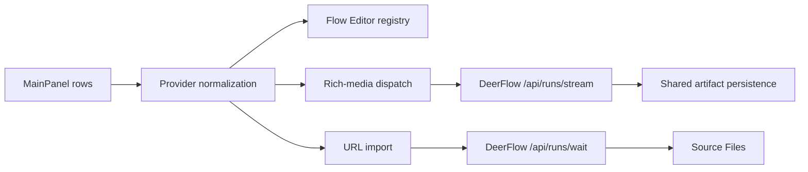
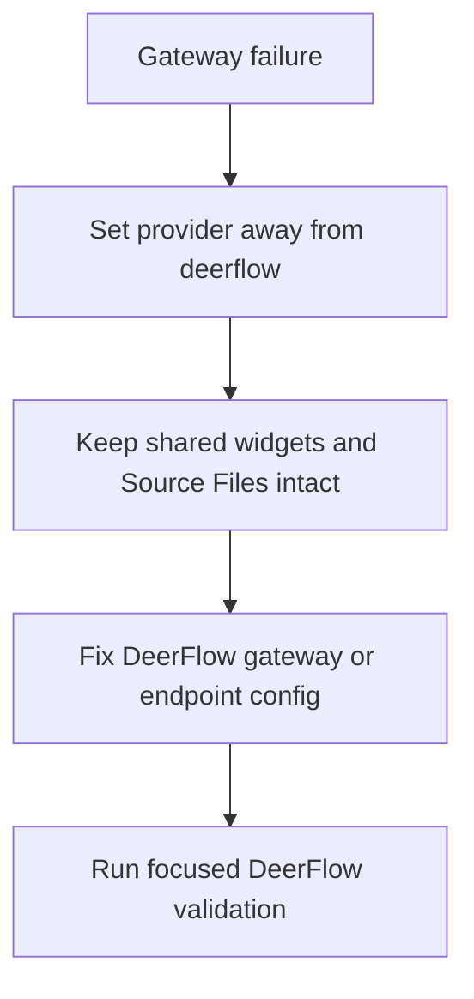

# Knowgrph DeerFlow Delivery and Validation

**Document Version**: 1.2.0  
**Date**: 2026-05-29  
**Status**: Accepted and implemented baseline  
**Companion To**: `knowgrph-deerflow-prd-tad.md`, `knowgrph-deerflow-prd-tad-integration-contracts-and-patterns.md`

---

## Document Purpose

**Context**: DeerFlow delivery now has an implemented local-gateway baseline across MainPanel settings, Flow Editor text widgets, rich-media generation, URL import, and setup documentation.

**Intent**: Keep validation tied to source owners and focused tests so stale planning language cannot drift back into implementation-owned docs.

**Directive**: Validate the active gateway path. Do not use broad proposed phase gates or unimplemented MCP assumptions as evidence.

**SuperAgent boundary**: DeerFlow validates as an optional provider/gateway. Knowgrph's native long-horizon SuperAgent harness validates through `knowgrph_parser`, `npm run goal:run`, local MCP `knowgrph.superagent.run`, and the source-side contract in `knowgrph-superagent-harness.md`. DeerFlow-inspired docs must not copy DeerFlow code or claim a DeerFlow-owned parser, renderer, memory, or graph-apply stack.

---

## Implemented Delivery Map



| Delivery ID | Surface | Owner | Implemented Evidence |
|---|---|---|---|
| DFD-001 | MainPanel rows | `deerflowApiDocs.ts` | `DEERFLOW_API_REQUEST_DOC_ENTRIES` |
| DFD-002 | Provider normalization | `chatEndpoint.ts` | `CHAT_PROVIDER_DEERFLOW`, `CHAT_DEERFLOW_ENDPOINT_URL` |
| DFD-003 | Flow Editor text widget helpers | `registryTemplates.ts` | DeerFlow provider-family fields and links |
| DFD-003A | Flow Editor seeded registry entry | `flowEditorManagerRegistryPersistence.ts` | `textGeneration.deerflow` |
| DFD-004 | Image/video dispatch | `richMediaRun.ts` | `generateRunImageWithDeerFlow()`, `generateRunVideoWithDeerFlow()` |
| DFD-005 | Gateway adapter | `deerflowRunGeneration.ts` | `/api/runs/stream`, `parseSseEvents()` |
| DFD-006 | URL import | `deerflowUrlImport.ts` | `/api/runs/wait`, manifest-to-workspace write |
| DFD-007 | Operator setup | `knowgrph-deerflow-setup-guide.md` | Active Dev/Prod/Cloudflare Tunnel guide |
| DFD-008 | Native SuperAgent distinction | `knowgrph-superagent-harness.md` | DeerFlow remains optional provider/inspiration, not the owner of Knowgrph's local harness |

## Focused Test Matrix

| Test ID | Layer | Scenario | Evidence |
|---|---|---|---|
| DFV-001 | Docs guard | PRD/TAD names implemented gateway owners | `deerflowPrdTadDocs.test.ts` |
| DFV-002 | MainPanel | DeerFlow rows visible and searchable | `mainPanelIntegrations.test.tsx` |
| DFV-003 | Registry | DeerFlow text widget seeded and linked | `flowEditorManagerRegistry.test.ts` |
| DFV-004 | Runtime | DeerFlow image/video dispatch uses shared rich-media runtime | `byteplusRunGeneration.test.ts`, `flowWidgetOutputRichMediaReuse.test.ts` |
| DFV-005 | Import | DeerFlow URL import uses manifest and Source Files | `deerflowUrlImport.ts` contract plus import tests |
| DFV-006 | Hygiene | No stale proposed mode docs return | `hygiene:check` plus docs guard |

## Acceptance Criteria by Requirement

| Requirement | Pass Condition |
|---|---|
| DeerFlow MainPanel discovery | `DEERFLOW_API_REQUEST_DOC_ENTRIES` exists and docs name `deerflowApiDocs.ts` as the shipped row owner |
| Provider normalization | `CHAT_PROVIDER_DEERFLOW` and `CHAT_DEERFLOW_ENDPOINT_URL` exist in `chatEndpoint.ts` |
| Flow Editor registry | `textGeneration.deerflow` exists and maps to DeerFlow anchors |
| Rich-media generation | `richMediaRun.ts` dispatches image/video through DeerFlow functions after provider normalization |
| Gateway run adapter | `deerflowRunGeneration.ts` derives `/api/runs/stream` and returns `GeneratedBinaryAsset` |
| URL import | `deerflowUrlImport.ts` derives `/api/runs/wait` and writes sanitized files through workspace FS |
| SuperAgent inspiration boundary | DeerFlow references stay conceptual-reference-only and point to the native Knowgrph harness owner |
| Stale-doc cleanup | PRD/TAD family no longer uses proposed status or unshipped adapter claims |

## Validation Commands

```bash
npm --prefix canvas run test:ci:unit -- "deerflow.prdTad"
npm --prefix canvas run test:ci:unit -- "mainPanelIntegrations"
npm --prefix canvas run test:ci:unit -- "flowEditorManagerRegistry"
npm run hygiene:check
npm --prefix canvas exec tsc -- -p canvas/tsconfig.json --noEmit --pretty false
```

## Rollback and Recovery



Rules:
- Rollback is operator configuration, not source-code aliasing.
- Existing OpenAI, BytePlus, Gemini, PixVerse, and non-DeerFlow paths remain independent.
- Source Files created by DeerFlow import remain ordinary workspace files.

## Release Checklist

- [x] PRD/TAD status reflects implemented baseline.
- [x] Direct/MCP proposed language is removed from implementation-owned docs.
- [x] DeerFlow-inspired SuperAgent language is marked conceptual-reference-only and points to the native Knowgrph harness owner.
- [x] Source owners are named explicitly.
- [x] Focused docs guard is registered.
- [x] Validation commands are source-owned and repeatable.

## Known Limits

- DeerFlow is optional; Knowgrph must operate fully when no DeerFlow gateway is running.
- The implemented baseline is local HTTP gateway based.
- A future DeerFlow MCP bridge requires source owners and tests before docs can mark it implemented.
- A copied DeerFlow SuperAgent stack is out of scope; native long-horizon harness work belongs to `knowgrph_parser` and local MCP owners.

---

## Revision History

| Version | Date | Author | Summary |
|---|---|---|---|
| 1.0.0 | 2026-05-07 | joohwee | Initial delivery phases and validation matrix |
| 1.1.0 | 2026-05-07 | joohwee | Added Mermaid diagrams |
| 1.2.0 | 2026-05-29 | joohwee | Promoted to implemented baseline and aligned validation with shipped gateway path |
