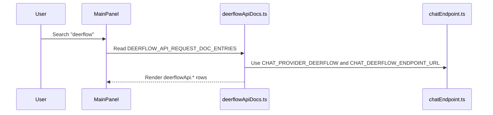
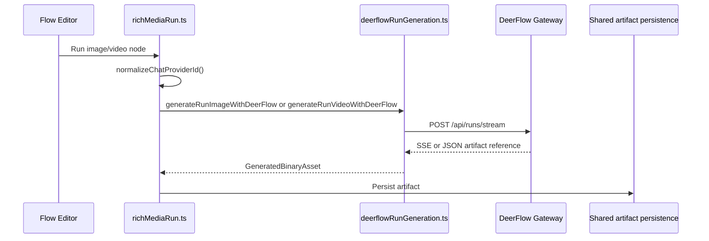
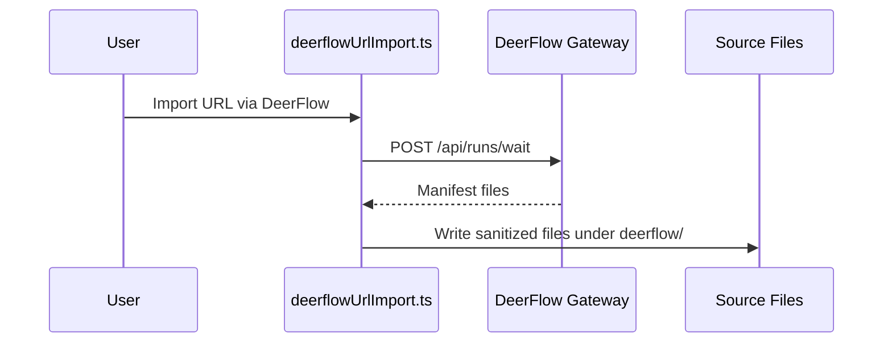

# Knowgrph DeerFlow Integration Contracts and Patterns

**Document Version**: 1.2.0  
**Date**: 2026-05-29  
**Status**: Accepted and implemented baseline  
**Companion To**: `knowgrph-deerflow-prd-tad.md`

---

## Document Purpose

**Context**: DeerFlow integration spans MainPanel settings, Flow Editor templates, rich-media runtime dispatch, gateway artifact handling, and workspace URL import.

**Intent**: Keep all DeerFlow behavior rooted in shared owners and prevent provider-specific UI forks, renderer branches, local path hardcoding, or stale unshipped-mode contract claims.

**Directive**: New DeerFlow capability must extend a listed source owner or introduce a new guarded owner before docs describe it as implemented.

---

## Contract Catalog

| Contract ID | Name | Producer | Consumer | Status |
|---|---|---|---|---|
| DFI-C001 | Settings Row Contract | `deerflowApiDocs.ts` | MainPanel Settings | Shipped |
| DFI-C002 | Anchor Link Contract | `getDeerFlowApiRowAnchorId()` | Flow Editor links, MainPanel search | Shipped |
| DFI-C003 | Provider Normalization Contract | `chatEndpoint.ts` | chat, Flow Editor, rich-media runtime | Shipped |
| DFI-C004 | Text Widget Registry Contract | `registryTemplates.ts` | Flow Editor Manager | Shipped |
| DFI-C005 | Rich-Media Dispatch Contract | `richMediaRun.ts` | image/video generation nodes | Shipped |
| DFI-C006 | Gateway Run Adapter Contract | `deerflowRunGeneration.ts` | DeerFlow `/api/runs/stream` | Shipped |
| DFI-C007 | URL Import Manifest Contract | `deerflowUrlImport.ts` | Source Files workspace | Shipped |

## DFI-C001: Settings Row Contract

```ts
type DeerFlowSettingsRowKey = `deerflowApi.${string}`;
```

Rules:
- Rows are generated from `OPENAI_RESPONSES_API_DOC_ROWS`.
- Provider defaults to `CHAT_PROVIDER_DEERFLOW`.
- Endpoint defaults to `CHAT_DEERFLOW_ENDPOINT_URL`.
- Row metadata lives in `DEERFLOW_API_REQUEST_DOC_ENTRIES`.
- No second DeerFlow settings registry is allowed.

## DFI-C002: Anchor Link Contract

```ts
type DeerFlowAnchorId = `deerflow-api-row-${string}`;
```

Rules:
- Anchor ids are produced by `getDeerFlowApiRowAnchorId(rowKey)`.
- Flow Editor links resolve row keys through `mapOpenAiRowKeyToDeerFlowRowKey()`.
- Links must target MainPanel Integrations, not a DeerFlow-only panel.

## DFI-C003: Provider Normalization Contract

```ts
const provider = normalizeChatProviderId(rawProvider);
```

Rules:
- DeerFlow execution requires normalized `CHAT_PROVIDER_DEERFLOW`.
- Provider labels and defaults come from `chatEndpoint.ts`.
- Proxy headers use `buildChatProxyHeaders()`.
- Binary artifacts use `resolveBinaryDownloadProxyUrl()` when needed.

## DFI-C004: Text Widget Registry Contract

Rules:
- Default registry includes `formId: "textGeneration.deerflow"`.
- DeerFlow text widget labels and field mappings are generated in `registryTemplates.ts`.
- DeerFlow row links reuse the same MainPanel anchor contract.
- Registry normalization sets provider family and endpoint consistently.

## DFI-C005: Rich-Media Dispatch Contract

Rules:
- `runRichMediaWidgetGeneration()` is the only DeerFlow image/video runtime entrypoint.
- Provider selection happens after `normalizeChatProviderId()`.
- Image requests call `generateRunImageWithDeerFlow()`.
- Video requests call `generateRunVideoWithDeerFlow()`.
- Shared artifact persistence runs after the provider returns a `GeneratedBinaryAsset`.

## DFI-C006: Gateway Run Adapter Contract

```ts
type DeerFlowRunGatewayPath = "/api/runs/stream";
```

Rules:
- `/api/runs/stream` is derived from the configured chat endpoint.
- The request body includes `kind`, `mode`, `prompt`, and normalized `options`.
- SSE responses are parsed through `parseSseEvents()`.
- JSON responses and SSE payloads both pass through the same artifact candidate resolver.
- Local relative artifact paths are absolutized against the active proxy prefix.

## DFI-C007: URL Import Manifest Contract

```ts
type DeerFlowImportGatewayPath = "/api/runs/wait";
```

Rules:
- Import uses `resolveDeerFlowRunsWaitEndpoint()`.
- DeerFlow must return a manifest containing file names and text.
- File names are sanitized before writing.
- Source Files remain the persistence boundary.
- Failures return structured `failed` entries.

---

## Integration Patterns

## Pattern P001: Reuse MainPanel Settings Owners

- Add settings rows to `deerflowApiDocs.ts`.
- Render through `useSettingsView.ts`.
- Link through the shared anchor id helper.

## Pattern P002: Normalize Before Dispatch

- Normalize provider ids in `chatEndpoint.ts`.
- Keep provider branching at runtime owner boundaries.
- Do not branch inside Canvas renderer code.

## Pattern P003: Derive Gateway Paths

- Start from the configured endpoint.
- Derive `/api/runs/stream` or `/api/runs/wait`.
- Preserve query-free path derivation; do not hardcode local absolute origins.

## Pattern P004: Artifact-First Rendering

- Convert DeerFlow responses to `GeneratedBinaryAsset`.
- Persist artifacts through shared rich-media persistence.
- Patch graph node properties through existing output patch helpers.

## Pattern P005: Source Files for Import

- Convert DeerFlow manifests to workspace files.
- Keep import outputs in Source Files.
- Avoid generated prod/downstream path writes.

---

## Anti-Pattern Guards

- Do not add a DeerFlow-only MainPanel tab.
- Do not duplicate `deerflowApi.*` rows outside `deerflowApiDocs.ts`.
- Do not hardcode `/Users/...`, repo-local paths, or Cloudflare URLs in runtime source.
- Do not document a DeerFlow MCP bridge as implemented until source owners exist.
- Do not introduce provider-specific renderer branches.
- Do not silently fallback from DeerFlow to another provider.

---

## Sequence Patterns

### Sequence S001: MainPanel Configuration



### Sequence S002: Rich-Media Runtime



### Sequence S003: URL Import



---

## Review Checklist

- [x] Contract IDs map to shipped owners.
- [x] Direct/MCP proposed contracts are not described as implemented.
- [x] Renderer depends on shared artifact output.
- [x] Transport details stay in DeerFlow adapter modules.
- [x] MainPanel rows are generated from one source.

---

## Revision History

| Version | Date | Author | Summary |
|---|---|---|---|
| 1.0.0 | 2026-05-07 | joohwee | Initial integration contracts and architecture patterns |
| 1.1.0 | 2026-05-07 | joohwee | Added Mermaid sequence diagrams |
| 1.2.0 | 2026-05-29 | joohwee | Replaced unshipped mode contracts with implemented gateway contracts |
