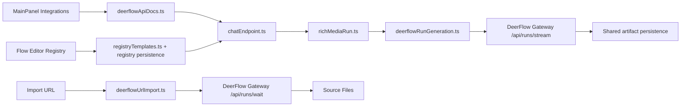

# Knowgrph DeerFlow Integration - TAD Companion

Continuation of [knowgrph-deerflow-prd-tad.md](knowgrph-deerflow-prd-tad.md). Contains Part II: Technical Architecture Documentation.

**Document Version**: 1.2.0  
**Date**: 2026-05-29  
**Status**: Accepted and implemented baseline

---

# Part II: Technical Architecture Documentation (TAD)

## Architecture Overview

Knowgrph's implemented DeerFlow baseline is a local-gateway integration. UI surfaces remain provider-neutral; DeerFlow-specific transport stays in DeerFlow gateway owners. DeerFlow may inform long-horizon harness concepts, but Knowgrph's native SuperAgent implementation remains source-owned in `docs/documents/knowgrph-superagent-harness.md`, `knowgrph_parser/*`, and the local MCP tool contract.

## Component Inventory

| ID | Component | Responsibility | Module | Status |
|---|---|---|---|---|
| TAD-DF-C001 | DeerFlow settings rows | Build `deerflowApi.*` settings rows from OpenAI-compatible row semantics | `canvas/src/features/panels/views/deerflowApiDocs.ts` | Shipped |
| TAD-DF-C002 | Settings renderer | Search, filter, and render DeerFlow rows in MainPanel Integrations | `canvas/src/features/panels/views/useSettingsView.ts` | Shipped |
| TAD-DF-C003 | Provider SSOT | Define `CHAT_PROVIDER_DEERFLOW`, default endpoint, provider labels, proxy headers, and endpoint resolution | `canvas/src/lib/chatEndpoint.ts` | Shipped |
| TAD-DF-C004 | Registry templates | Build DeerFlow text widget fields and deep links | `canvas/src/features/flow-editor-manager/registryTemplates.ts` | Shipped |
| TAD-DF-C004A | Registry persistence seed | Seed `textGeneration.deerflow` default widget entries | `canvas/src/hooks/store/flowEditorManagerRegistryPersistence.ts` | Shipped |
| TAD-DF-C005 | Rich-media dispatcher | Select DeerFlow image/video generation by normalized provider | `canvas/src/features/chat/richMediaRun.ts` | Shipped |
| TAD-DF-C006 | Gateway adapter | Derive `/api/runs/stream`, parse SSE/JSON, fetch artifacts, return `GeneratedBinaryAsset` | `canvas/src/features/chat/deerflowRunGeneration.ts` | Shipped |
| TAD-DF-C007 | URL import adapter | Derive `/api/runs/wait`, parse manifest output, write workspace files | `canvas/src/features/markdown-workspace/workspaceImport/deerflowUrlImport.ts` | Shipped |
| TAD-DF-C008 | Setup guide | Dev/Prod/Cloudflare Tunnel operator setup | `docs/documents/knowgrph-deerflow/knowgrph-deerflow-setup-guide.md` | Active |

## Data Flows

### MainPanel Configuration

| Stage | Owner | Input | Output |
|---|---|---|---|
| Generate | `deerflowApiDocs.ts` | `OPENAI_RESPONSES_API_DOC_ROWS` | `DEERFLOW_API_REQUEST_DOC_ENTRIES` |
| Normalize | `mapOpenAiRowKeyToDeerFlowRowKey()` | `openaiApi.*` keys | `deerflowApi.*` keys |
| Anchor | `getDeerFlowApiRowAnchorId()` | row key | stable `deerflow-api-row-*` id |
| Render | `useSettingsView.ts` | virtual settings entries | searchable MainPanel rows |

### Flow Editor Text Widget

| Stage | Owner | Input | Output |
|---|---|---|---|
| Seed | `registryTemplates.ts` | default registry templates | `textGeneration.deerflow` entry |
| Link | `resolveWidgetRegistryMainPanelLink()` | widget metadata | MainPanel Integrations link and anchor |
| Normalize | `normalizeTextGenerationRegistryEntry()` | provider/form id | `providerFamily: "deerflow"` and DeerFlow endpoint |

### Rich-Media Runtime

| Stage | Owner | Input | Output |
|---|---|---|---|
| Request build | `buildRichMediaWidgetRunRequest()` | graph node and connected values | provider-neutral image/video request |
| Dispatch | `runRichMediaWidgetGeneration()` | request plus `RunGenerationConfig` | selected provider adapter call |
| DeerFlow transport | `deerflowRunGeneration.ts` | prompt/options/config | `/api/runs/stream` gateway request |
| Artifact normalize | `deerflowRunGeneration.ts` | SSE/JSON response | `GeneratedBinaryAsset` |
| Persist | `persistGeneratedAsset()` | blob and workspace path | workspace artifact path or browser download |

### URL Import

| Stage | Owner | Input | Output |
|---|---|---|---|
| Resolve endpoint | `resolveDeerFlowRunsWaitEndpoint()` | configured endpoint | `/api/runs/wait` gateway URL |
| Prompt | `buildDeerFlowIngestPrompt()` | normalized URL | manifest-generation prompt |
| Parse | `findFirstJsonManifest()` | DeerFlow response | file manifest |
| Write | `importWorkspaceUrlViaDeerFlow()` | manifest files | workspace `deerflow/` files |

## Integration Contracts

### TAD-DF-I001: Settings Row Contract

- Rows are generated once as `DEERFLOW_API_REQUEST_DOC_ENTRIES`.
- Row keys use `deerflowApi.*`.
- Provider row default is `CHAT_PROVIDER_DEERFLOW`.
- Endpoint row default is `CHAT_DEERFLOW_ENDPOINT_URL`.
- Anchors are generated by `getDeerFlowApiRowAnchorId()`.

### TAD-DF-I002: Provider Normalization Contract

- Provider ids normalize through `normalizeChatProviderId()`.
- DeerFlow may be selected only by normalized `CHAT_PROVIDER_DEERFLOW`.
- Endpoint routing uses `resolveChatEndpointForRequest()` and `buildChatProxyHeaders()`.
- Source code must not hardcode absolute local repo paths.

### TAD-DF-I003: Rich-Media Adapter Contract

- DeerFlow image/video calls are entered only through `runRichMediaWidgetGeneration()`.
- The DeerFlow adapter derives gateway run paths from the configured endpoint.
- SSE and JSON responses normalize before reaching Canvas node patching.
- UI renderer code must not branch on DeerFlow-specific payload shapes.

### TAD-DF-I004: URL Import Contract

- URL import remains a workspace Source Files operation.
- DeerFlow returns a manifest; Knowgrph writes sanitized file names and text.
- Failed import attempts return structured failure entries.
- Import does not bypass Source Files or write to generated downstream mirrors.

### TAD-DF-I005: SuperAgent Inspiration Boundary

- DeerFlow may be cited only as a conceptual reference for message gateway, memory, tools, skills, subagents, sandboxed workspace execution, and long-horizon run management.
- Knowgrph must not copy DeerFlow code, duplicate its architecture, or add DeerFlow-specific parser, renderer, memory, or graph-apply owners.
- Native SuperAgent work extends `knowgrph_parser` and local MCP owners first, then documents the shipped source owner.

## Architectural Decisions

### ADR-DF-001: Reuse OpenAI-Compatible Rows for DeerFlow

**Status**: Accepted and implemented.  
**Decision**: DeerFlow rows are generated from OpenAI-compatible response rows with `deerflowApi.*` keys.  
**Reasoning**: DeerFlow Gateway exposes an OpenAI-compatible LLM surface, so one row model prevents duplicated setting definitions.

### ADR-DF-002: Keep DeerFlow Transport Inside Gateway Adapters

**Status**: Accepted and implemented.  
**Decision**: Image/video DeerFlow transport lives in `deerflowRunGeneration.ts`; URL import transport lives in `deerflowUrlImport.ts`.  
**Reasoning**: Canvas and MainPanel continue to consume provider-neutral requests and artifacts.

### ADR-DF-003: Treat MCP Bridge as Outside the Implemented Baseline

**Status**: Accepted and implemented.  
**Decision**: The shipped DeerFlow baseline documents the local HTTP gateway, not a DeerFlow MCP bridge.  
**Reasoning**: No DeerFlow MCP adapter exists in the current source owners; documenting one as shipped would create stale architecture.

## Quality Attributes

| Attribute | Implemented Pattern | Evidence |
|---|---|---|
| Maintainability | One settings row generator and one provider normalization path | `deerflowApiDocs.ts`, `chatEndpoint.ts` |
| Neutrality | Shared rich-media request and artifact contracts | `richMediaRun.ts` |
| Reliability | Explicit failure details from gateway responses | `parseErrorBody()` usage in `deerflowRunGeneration.ts` |
| Portability | Endpoint-derived run paths and Cloudflare Tunnel setup | setup guide and `resolveDeerFlowRunsStreamEndpoint()` |
| Testability | Focused docs guard plus existing MainPanel/runtime tests | `deerflowPrdTadDocs.test.ts` |

## Deployment Strategy

- Dev: run the Knowgrph dev server and, when DeerFlow is needed, the local DeerFlow gateway.
- Prod mirror: propagate source-owned assets through the normal build/sync path.
- Cloudflare: expose the DeerFlow gateway through Cloudflare Tunnel when the operator opts into DeerFlow in production.
- No downstream patching: prod and Cloudflare artifacts must remain generated from dev source owners.

## Migration Path

- Remove stale unshipped mode language from implementation-owned docs.
- Keep `deerflowApi.*` keys stable.
- Extend future gateway features inside `deerflowRunGeneration.ts` or `deerflowUrlImport.ts` first.
- Add any future MCP bridge as a new source-backed owner and guard before documenting it as implemented.
- Keep future SuperAgent work on Knowgrph's native harness owners; DeerFlow remains optional provider/inspiration rather than a copied runtime stack.

## Revision History

| Version | Date | Author | Summary |
|---|---|---|---|
| 1.0.0 | 2026-05-07 | joohwee | Initial architecture companion |
| 1.1.0 | 2026-05-07 | joohwee | Added diagrams and PRD/TAD guideline sections |
| 1.2.0 | 2026-05-29 | joohwee | Replaced unshipped mode architecture with implemented local-gateway owners |
