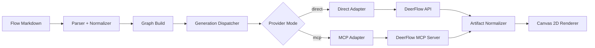

# Knowgrph DeerFlow Integration — TAD Companion

Continuation of [knowgrph-deerflow-prd-tad.md](knowgrph-deerflow-prd-tad.md). Contains Part II: Technical Architecture Documentation.

**Document Version**: 1.1.0
**Date**: 2026-05-07
**Status**: Proposed

---

# PART II: TECHNICAL ARCHITECTURE DOCUMENTATION (TAD)

## Architecture Overview

**From markdown flow input to rendered media artifacts**:  
Knowgrph Ingest/Parser -> Provider Metadata Normalizer -> Graph Build -> Generation Dispatcher -> DeerFlow Adapter (Direct or MCP) -> Artifact Normalizer -> Canvas 2D Renderer.

---

## Component Inventory

| ID | Component | Responsibility | Module | Input | Output |
|----|-----------|---------------|--------|-------|--------|
| TAD-C001 | Integration SSOT | Single source of truth for DeerFlow provider configuration rows | `features/integrations/config.ts` | `DeerFlowIntegrationRow[]` | `IntegrationRow[]` |
| TAD-C002 | Provider Metadata Normalizer | Normalizes raw markdown frontmatter into typed provider metadata for graph nodes | `features/parsers/agenticRag.ts` | Raw frontmatter | `ParsedProviderMetadata` |
| TAD-C003 | Generation Dispatcher | Routes generation requests to the correct adapter by provider+mode; manages retry and cancellation | `features/chat/richMediaRun.ts` | `RunGenerationRequest` | Adapter call result |
| TAD-C004 | DeerFlow Adapter | Calls DeerFlow API (direct) or MCP server; handles auth, streaming, and error mapping | `features/integrations/deer-flow/deerFlowAdapter.ts` | HTTP/MCP payload | Raw provider response |
| TAD-C005 | Artifact Normalizer | Transforms raw provider responses into canonical artifacts consumed by Canvas renderer | `features/integrations/deer-flow/artifactNormalizer.ts` | Raw response | `CanonicalArtifact` |

---

## Journey → System Mapping

| Journey Stage | Workflow        | Data Flow       | Component        |
|---------------|-----------------|-----------------|------------------|
| Trigger       | Configure Provider | —               | TAD-C001 (SSOT)  |
| Discover       | Configure Provider | —               | TAD-C001 (SSOT)  |
| Engage        | Configure Provider | Config persist  | TAD-C001 (SSOT)  |
| Complete       | Run Generation   | Config → Dispatch | TAD-C003 (Dispatch) |
| Trigger       | Ingest & Parse   | Markdown → Metadata | TAD-C002 (Parse) |
| Discover       | Ingest & Parse   | Raw → Normalized | TAD-C002 (Parse) |
| Engage        | Ingest & Parse   | Metadata → Graph | TAD-C002 (Parse) |
| Complete       | Run Generation   | Graph → Dispatch | TAD-C003 (Dispatch) |
| Engage        | Run Generation   | Request → Adapter | TAD-C004 (Adapter) |
| Complete       | Run Generation   | Raw → Canonical  | TAD-C005 (Normalizer) |
| Complete       | Run Generation   | Artifact → Render | TAD-C005 (Normalizer) |
| Return         | Failure & Retry  | Error → Category | TAD-C003 (Dispatch) |

---

## Data Flows

### Data Flow: Provider Configuration

| Stage     | Component        | Input Format     | Output Format    | Persistence       | Error Handling    |
|-----------|------------------|------------------|------------------|-------------------|-------------------|
| Ingest    | MainPanel UI     | User form input  | `DeerFlowIntegrationRow[]` | IndexedDB (uiSettings) | Validation error toast |
| Transform | Mode Gator      | Raw row values   | Mode-filtered required set | None | Block save with message |
| Store     | Settings Store   | Validated rows   | Persisted config | IndexedDB | Rollback on failure |
| Serve     | SSOT Module      | Config read      | `IntegrationRow[]` | None | Fail closed on schema error |

### Data Flow: Flow Markdown to Graph Metadata

| Stage     | Component        | Input Format     | Output Format    | Persistence       | Error Handling    |
|-----------|------------------|------------------|------------------|-------------------|-------------------|
| Ingest    | Parser           | Markdown frontmatter | Raw node config | None | Syntax error |
| Transform | Normalizer       | Raw node config  | `ParsedProviderMetadata` | None | Warning for unknown optional fields |
| Store     | Graph Store      | Normalized metadata | Graph node properties | IndexedDB | Reject on missing required fields |
| Serve     | Graph Compiler   | Graph nodes      | Compiled graph | None | Compilation error |

### Data Flow: Generation Request to Rendered Artifact

| Stage     | Component        | Input Format     | Output Format    | Persistence       | Error Handling    |
|-----------|------------------|------------------|------------------|-------------------|-------------------|
| Ingest    | Dispatcher       | `RunGenerationRequest` | Adapter call | None | Queue state |
| Transform | Adapter          | HTTP/MCP payload | Raw provider response | None | Retry or terminal error |
| Transform | Normalizer       | Raw response     | `CanonicalArtifact` | None | Fallback degradation |
| Store     | Node State       | Artifact + state | Updated node properties | IndexedDB | State transition error |
| Serve     | Renderer         | `CanonicalArtifact` | Rendered text/image/video | None | Fallback UI for missing optional fields |

---

## Component Specifications

### Component TAD-C001: DeerFlow Integration SSOT

**Responsibility**: Provides single-source integration definitions consumed by MainPanel Integrations, Flow Editor manager, and node overlay.

**Interfaces**:
- `IntegrationRow[]`: canonical rows for endpoint, auth, mode, model/skill, timeout, retry
- `resolveWidgetApiRowKey(args)`: field-to-row mapping for deep links and docs

**Dependencies**: Settings view ownership filters, widget schema mappings  
**Configuration**: Provider mode (`direct|mcp`), endpoint URLs, auth references, model defaults

**From configuration to UI parity**: SSOT rows -> filtered by settings mode -> reused by all integration surfaces -> eliminates duplicate row definitions.

---

### Component TAD-C002: DeerFlow Parse Extension

**Responsibility**: Normalizes DeerFlow provider metadata during frontmatter flow parsing.

**Interfaces**:
- `parseProviderMetadata(rawNodeConfig) -> ProviderMetadata`
- `validateProviderMetadata(metadata) -> warnings[]`

**Dependencies**: Existing markdown frontmatter graph parser and compose pipeline  
**Configuration**: Allowed fields, defaults, required-by-mode rules

**From text to typed graph metadata**: parser reads node config -> normalizer maps fields to canonical schema -> warnings emitted for unsupported keys -> graph remains compilable.

---

### Component TAD-C003: Provider Dispatch Runtime

**Responsibility**: Routes generation nodes to DeerFlow through one runtime contract for text/image/video.

**Interfaces**:
- `runGenerationWithProvider(config, kind, prompt, options) -> GeneratedArtifact|Error`
- `mapRuntimeState(status) -> NodeExecutionState`

**Dependencies**: Existing generation runtime, node execution lifecycle, flow dataflow computation  
**Configuration**: timeout, retry, cancellation, mode routing

**From node execution to provider call**: generation node starts -> dispatcher selects adapter by provider+mode -> executes request -> returns normalized artifact and typed status.

---

### Component TAD-C004: DeerFlow Adapter Layer

**Responsibility**: Implements protocol-specific communication to DeerFlow in direct API mode or MCP bridge mode.

**Interfaces**:
- `DeerFlowDirectAdapter.generateText/Image/Video(...)`
- `DeerFlowMcpAdapter.invokeTool(...)`
- `normalizeDeerFlowResponse(raw) -> CanonicalArtifact`

**Dependencies**: HTTP client, MCP client, secure credential resolution  
**Configuration**: base URLs, headers, tool names, OAuth/token refresh policy

**From provider response to stable contract**: adapter receives provider payload -> validates and transforms output -> returns canonical artifact schema to renderer.

---

### Component TAD-C005: Artifact Normalizer and Renderer Contract

**Responsibility**: Enforces canonical output schema used by Canvas 2D renderer and rich media panels.

**Interfaces**:
- `normalizeTextArtifact(raw) -> {type:'text', content, meta}`
- `normalizeImageArtifact(raw) -> {type:'image', uri, width, height, mime, meta}`
- `normalizeVideoArtifact(raw) -> {type:'video', uri, duration, previewUri, mime, meta}`

**Dependencies**: Flow node output schema, rich media rendering components  
**Configuration**: required fields, fallback display policy, validation strictness

**From artifacts to renderable outputs**: runtime outputs are normalized -> schema validated -> renderer consumes uniform objects with no provider branching in UI layer.

---

## Integration Contracts

### Contract TAD-I001: MainPanel Integration Contract
- **Protocol**: Internal TypeScript contract
- **Data Format**: Typed SSOT rows
- **Error Handling**: Fail closed on invalid row schema, report explicit validation errors

### Contract TAD-I002: Parser Metadata Contract
- **Protocol**: Frontmatter flow node config
- **Data Format**: Provider metadata object with mode-aware required fields
- **Error Handling**: Emit warnings for unsupported fields; reject only missing required fields

### Contract TAD-I003: Runtime Generation Contract
- **Protocol**: Internal dispatcher interface
- **Data Format**: `kind + prompt + options -> canonical artifact`
- **Error Handling**: Typed errors (`auth`, `timeout`, `rate_limit`, `invalid_request`, `provider_unavailable`)

### Contract TAD-I004: DeerFlow Bridge Contract
- **Protocol**: HTTP REST (direct) and MCP (bridge)
- **Data Format**: JSON request/response with adapter normalization
- **Error Handling**: retry strategy for transient failures; no silent fallback between modes

---

## Architectural Decisions (ADR)

### ADR-001: Use SSOT-First Integration Rows
**Status**: Accepted  
**Decision**: Add DeerFlow via one integrations SSOT model reused by all settings/editor surfaces.  
**Rationale**: Preserves consistency and minimizes duplicate wiring.  
**Alternatives Considered**:
1. Separate per-surface row definitions: faster local edits, high drift risk.
2. Runtime-generated rows from provider schema: flexible, higher complexity.
**Trade-offs**: Requires initial schema discipline, reduces long-term maintenance cost.

### ADR-002: Keep Provider Execution Behind One Dispatcher
**Status**: Accepted  
**Decision**: Route all text/image/video generation through one provider dispatcher.  
**Rationale**: Enforces uniform lifecycle states and error semantics.  
**Alternatives Considered**:
1. Per-node provider execution: low initial effort, duplicates logic.
2. Plugin-level node executors: flexible, fragmented observability.
**Trade-offs**: Dispatcher abstraction upfront, lower regression risk over time.

### ADR-003: Parse-Phase Normalization with Warning-First Policy
**Status**: Accepted  
**Decision**: Normalize DeerFlow metadata during parse and warn on unsupported optional fields.  
**Rationale**: Keeps pipeline resilient while preserving author feedback.  
**Alternatives Considered**:
1. Strict reject on any unknown key: safer, harms author iteration speed.
2. Late normalization at runtime: parser simplicity, delayed failures.
**Trade-offs**: Warning management needed, better ingest resilience.

---

## Quality Attributes

| Attribute     | Scenario                           | Pattern             | Validation         |
|---------------|------------------------------------|---------------------|--------------------|
| Performance   | Dispatch overhead <=50ms median over current path | Adapter selection before provider call | Latency benchmark in CI |
| Scalability   | Bounded concurrent generation nodes | Deterministic cancellation and retry limits | Concurrency stress test |
| Security      | Credentials externalized from graph documents | Secure credential resolution in adapter | Secret-scan on graph snapshots |
| Reliability    | Transient failure recovery | Bounded retry with jittered backoff | Error-path test matrix |
| Observability | Structured logs for every generation run | Provider mode, node kind, latency, error category | Log assertion tests |
| Maintainability | Provider protocol logic isolated | Adapter isolation pattern | Module dependency audit |

---

## Deployment Strategy

- **Phase 1**: Ship MainPanel SSOT integration rows and parser metadata support behind feature flag.
- **Phase 2**: Enable unified dispatcher and direct DeerFlow adapter in controlled environment.
- **Phase 3**: Add MCP bridge mode and full validation matrix.
- **Phase 4**: Enable by default after fixture and regression gates pass.

---

## Migration Path

- Preserve existing provider contracts; DeerFlow is additive.
- Maintain canonical artifact schema so renderer does not branch by provider.
- Migrate node/provider mappings via registry templates, not ad hoc node rewrites.
- Remove temporary compatibility toggles after default enablement validation.

---

## Requirement Traceability Matrix

| PRD ID | Requirement Summary | TAD Component/Contract | Validation |
|--------|----------------------|------------------------|------------|
| PRD-E001-S001 | DeerFlow visible/configurable in Integrations | TAD-C001, TAD-I001 | MainPanel integration tests |
| PRD-E001-S002 | Direct vs MCP mode configuration | TAD-C001, TAD-C004, TAD-I004 | Settings validation tests |
| PRD-E002-S001 | Parse DeerFlow metadata | TAD-C002, TAD-I002 | Parser fixture tests |
| PRD-E002-S002 | Render canonical artifacts | TAD-C005, TAD-I003 | Render contract tests |
| PRD-E003-S001 | Unified text/image/video runtime | TAD-C003, TAD-I003 | Flow runtime tests |
| PRD-E003-S002 | Retry/failure semantics | TAD-C003, TAD-I003 | Runtime error-path tests |
| PRD-E004-S001 | End-to-end fixture validation | TAD-C002/C003/C005 | Fixture pipeline test suite |

---

## Validation Plan

### Fixture
- `knowgrph-video-demo.md` (path-agnostic workspace seed)

### Focused Validation Scope
- Integrations tab discoverability and anchor/deep-link behavior for DeerFlow rows.
- Parser normalization and warning behavior for DeerFlow metadata.
- Unified runtime dispatch for text/image/video with deterministic state transitions.
- Renderer contract compliance for text/image/video canonical artifacts.

### Exit Criteria
- All Must-Have stories pass acceptance criteria.
- No critical regressions in existing non-DeerFlow provider flows.
- Traceability matrix entries have corresponding passing tests.

---

## Risks and Mitigations

- **Risk**: Provider payload variation across DeerFlow modes.  
  **Mitigation**: enforce adapter-level normalization and strict contract tests.

- **Risk**: Increased runtime complexity from mode branching.  
  **Mitigation**: isolate branching in adapter selection only; keep dispatcher contract stable.

- **Risk**: Hidden parse-field drift over time.  
  **Mitigation**: parser schema snapshots and warning coverage tests.

- **Risk**: User confusion with advanced provider fields.  
  **Mitigation**: progressive disclosure in integration settings with sane defaults.

---

## Revision History

| Version | Date | Author | Summary |
|---------|------|--------|---------|
| 1.0.0 | 2026-05-07 | joohwee | Initial PRD-TAD for DeerFlow integration |
| 1.1.0 | 2026-05-07 | joohwee | Added User Journeys, Workflow Flows, Data Flows, Mermaid architecture diagram, Component Inventory, Journey→System Mapping, Quality Attributes table per PRD-TAD guidelines |
