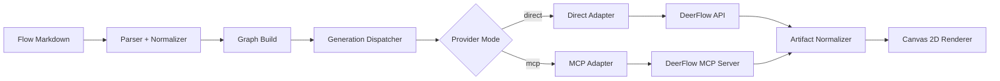

# Knowgrph DeerFlow Integration - PRD & TAD

**Document Version**: 1.1.0  
**Date**: 2026-05-07  
**Status**: Proposed  
**Scope**: MainPanel Integrations, Ingest->Parse->Render, Canvas 2D Flow Editor generation

---

## Document Purpose

**Context**: Knowgrph requires a provider-neutral way to add DeerFlow capabilities into integrations, parsing, and flow execution.  
**Intent**: Enable text, image, and video generation workflows in Canvas 2D with consistent UX, contracts, and validation.  
**Directive**: This document defines product requirements and architecture contracts; PRD states WHAT/WHY, TAD states HOW; implementation details remain in code tasks.

---

# PART I: PRODUCT REQUIREMENTS DOCUMENTATION (PRD)

## Problem Statement

### Current User Pain Points

**Problem 1: Integration Fragmentation**  
MainPanel Integrations do not expose DeerFlow as a first-class provider, forcing manual external setup and reducing discoverability.

**Problem 2: Pipeline Inconsistency**  
Ingest->Parse->Render can parse flow documents, but provider-specific metadata for DeerFlow is not standardized across generation nodes.

**Problem 3: Incomplete Generation Surface in Canvas 2D**  
Flow Editor users need consistent text/image/video generation in one run pipeline, but provider routing and artifacts are not unified for DeerFlow.

### Quantified Impact

- Integration onboarding time is high due to manual provider wiring and missing in-app setup guidance.
- Validation confidence is low because the same scenario is not verified end-to-end for ingest, parse, run, and render.
- Media-generation workflows risk drift when each node type uses custom provider logic instead of shared contracts.

---

## Personas

### Persona 1: Workflow Builder
**Role**: Analyst building multi-step knowledge workflows in Canvas  
**Goal**: Configure providers once and run generation nodes reliably  
**Pain Point**: Repeated setup and inconsistent node behavior

### Persona 2: Product Integrator
**Role**: Developer integrating external agent/runtime providers  
**Goal**: Add provider support with SSOT and minimal duplication  
**Pain Point**: Multiple configuration surfaces and missing traceability

### Persona 3: QA Engineer
**Role**: Reviewer validating pipeline correctness  
**Goal**: Verify ingest->parse->render with stable fixtures  
**Pain Point**: No single canonical fixture-driven acceptance suite for DeerFlow

---

## User Journey Flows

### Journey: Workflow Builder — Configure and Run DeerFlow Provider

| Stage    | Action               | Touchpoint        | Pain Point      | Opportunity      |
|----------|----------------------|-------------------|-----------------|------------------|
| Trigger  | Needs text/image/video generation in Canvas flow | Flow Editor toolbar | No DeerFlow option in provider dropdown | Add DeerFlow as first-class provider |
| Discover  | Opens MainPanel Integrations | Integrations tab | DeerFlow not listed; must configure externally | Show DeerFlow section with searchable rows |
| Engage   | Configures endpoint, auth, mode | Integration settings | Unclear which fields are required per mode | Mode-gated validation with progressive disclosure |
| Complete | Runs flow with DeerFlow-backed nodes | Canvas 2D renderer | Artifacts render inconsistently across providers | Canonical artifact schema for all providers |
| Return   | Adjusts prompt or retries failed node | Node overlay + retry button | No retry semantics; must rebuild graph | Typed error categories with one-click retry |

### Journey: Product Integrator — Add DeerFlow Provider Support

| Stage    | Action               | Touchpoint        | Pain Point      | Opportunity      |
|----------|----------------------|-------------------|-----------------|------------------|
| Trigger  | New provider integration requested | GitHub issue / planning | No integration template or contract guide | SSOT-first integration pattern with contract catalog |
| Discover  | Reviews existing integration code | Codebase search | Multiple config surfaces with no single source | One SSOT module consumed by all surfaces |
| Engage   | Implements adapter and parser extension | Adapter + parser modules | Protocol quirks leak into UI and dispatcher | Adapter isolation pattern with canonical normalization |
| Complete  | Validates with fixture test suite | CI pipeline | No canonical fixture for DeerFlow | `knowgrph-video-demo.md` fixture with focused test matrix |
| Return   | Adds new generation mode or skill | Adapter layer only | Requires UI changes for each new mode | Add modes via adapter, not UI forks |

### Journey: QA Engineer — Validate Pipeline Correctness

| Stage    | Action               | Touchpoint        | Pain Point      | Opportunity      |
|----------|----------------------|-------------------|-----------------|------------------|
| Trigger  | New DeerFlow feature merged | PR review | No focused test scope; full-suite runs are slow | Focused diff testing with contract coverage |
| Discover  | Reviews PRD acceptance criteria | PRD document | Criteria not mapped to test IDs | Traceability matrix linking stories to test IDs |
| Engage   | Runs fixture-driven test matrix | CI pipeline | Missing end-to-end coverage for ingest->render | Canonical fixture with per-layer assertions |
| Complete  | All gates pass with evidence | Quality gate dashboard | No gate definitions or rollback plan | Quality gate definitions with rollback runbook |
| Return   | Monitors regression suite on subsequent changes | CI | No baseline snapshots for comparison | Baseline fixture snapshots for regression detection |

---

## Workflow Flows

### Workflow: Configure DeerFlow Provider

**Trigger**: User opens MainPanel Integrations and selects DeerFlow section  
**Actors**: Workflow Builder, MainPanel Settings, Integration SSOT

**Happy Path**:
1. User opens Integrations mode → MainPanel displays provider sections
2. User selects DeerFlow → SSOT rows render with mode selector
3. User chooses mode (direct/MCP) → mode-gated fields appear
4. User fills required fields → validation passes on save
5. System persists config → provider ready for flow nodes

**Alternate Paths**:
- User switches mode after partial input: previously entered fields are preserved if applicable to new mode; incompatible fields are cleared with notice
- User provides invalid endpoint: validation blocks save with explicit error message

**Error Paths**:
- Network unreachable during validation: save succeeds with deferred validation status; runtime validates on first use
- Credential format invalid: immediate validation error with format hint

**Postconditions**: DeerFlow provider config persisted with stable keys; all integration surfaces reflect updated config

### Workflow: Ingest and Parse DeerFlow Flow

**Trigger**: User imports or opens a markdown flow file containing DeerFlow generation nodes  
**Actors**: Workflow Builder, Parser, Provider Metadata Normalizer

**Happy Path**:
1. User opens flow markdown → parser reads frontmatter
2. Parser encounters DeerFlow provider metadata → normalizer maps to canonical schema
3. Normalizer emits typed `ParsedProviderMetadata` → graph compiler consumes
4. Graph builds successfully → generation nodes carry provider intent

**Alternate Paths**:
- Flow contains unknown optional DeerFlow fields: normalizer emits warnings, parse succeeds
- Flow contains no provider metadata: nodes default to existing provider behavior

**Error Paths**:
- Missing required-by-mode fields: parse fails with actionable message identifying missing field and mode
- Invalid field type coercion: parse fails with type mismatch error

**Postconditions**: Graph contains typed provider metadata; no secret values in graph snapshot

### Workflow: Run Generation and Render Artifacts

**Trigger**: User clicks Run on a flow containing DeerFlow-backed generation nodes  
**Actors**: Workflow Builder, Generation Dispatcher, DeerFlow Adapter, Artifact Normalizer, Canvas 2D Renderer

**Happy Path**:
1. Dispatcher receives generation request → selects adapter by provider+mode
2. Adapter calls DeerFlow API or MCP tool → receives raw response
3. Normalizer transforms raw response → emits canonical artifact
4. Renderer consumes canonical artifact → displays text/image/video in Canvas
5. Node state transitions: queued → running → succeeded

**Alternate Paths**:
- User cancels during generation: node state transitions to cancelled; adapter aborts in-flight request
- Provider returns partial result: adapter returns partial artifact with degradation metadata

**Error Paths**:
- Timeout: dispatcher retries with bounded backoff → fails after max attempts with retryable error
- Auth failure: dispatcher returns terminal auth error → no retry; user must update credentials
- Rate limit: dispatcher retries after backoff → succeeds or fails with retryable error

**Postconditions**: Canvas displays rendered artifacts; node states are monotonic; structured logs include provider mode, latency, and error category

---

## Epic PRD-E001: MainPanel DeerFlow Integration

### Story PRD-E001-S001: Discover and Configure DeerFlow in Integrations
**As a** workflow builder  
**I want** DeerFlow listed in MainPanel Integrations with clear setup controls  
**So that** I can enable and configure the provider without leaving Knowgrph

**Acceptance Criteria**:
- **Given** MainPanel opens in Integrations mode  
- **When** user searches for "DeerFlow"  
- **Then** a DeerFlow section and rows are visible with provider status, endpoint, and auth fields
- **And** row anchors deep-link correctly from Flow Editor manager and node overlay

### Story PRD-E001-S002: Provider Mode Selection
**As a** product integrator  
**I want** DeerFlow configuration to support direct API mode and MCP bridge mode  
**So that** I can choose deployment topology without changing node contracts

**Acceptance Criteria**:
- **Given** DeerFlow integration settings  
- **When** user switches mode between direct and MCP  
- **Then** only mode-relevant fields are required and persisted
- **And** invalid mixed-mode configuration is blocked with explicit validation messaging

---

## Epic PRD-E002: Ingest->Parse->Render Enhancement

### Story PRD-E002-S001: Parse DeerFlow Metadata from Flow Markdown
**As a** workflow builder  
**I want** DeerFlow metadata parsed from frontmatter flow content  
**So that** generation nodes carry provider intent through graph compilation

**Acceptance Criteria**:
- **Given** markdown flow content containing generation nodes with DeerFlow metadata  
- **When** parser processes the content  
- **Then** graph nodes include normalized provider fields for text/image/video generation
- **And** parser warnings are emitted for unsupported fields without hard failure

### Story PRD-E002-S002: Render Provider-Neutral Generation Artifacts
**As a** workflow builder  
**I want** generated artifacts rendered consistently regardless of provider mode  
**So that** text/image/video outputs appear in the same Canvas UX contracts

**Acceptance Criteria**:
- **Given** a successful flow run with DeerFlow-backed generation nodes  
- **When** render phase completes  
- **Then** text outputs render as markdown/text blocks
- **And** image outputs render with uri, dimensions, and mime metadata
- **And** video outputs render with uri, duration, and preview metadata

---

## Epic PRD-E003: Canvas 2D Flow Editor Generation

### Story PRD-E003-S001: Unified Text/Image/Video Node Runtime
**As a** workflow builder  
**I want** text, image, and video nodes to use one provider dispatch contract  
**So that** node behavior is predictable and easier to maintain

**Acceptance Criteria**:
- **Given** a flow containing text, image, and video generation nodes  
- **When** user runs the flow  
- **Then** all generation nodes route through one provider dispatcher
- **And** node states expose queued, running, succeeded, failed, cancelled

### Story PRD-E003-S002: Failure and Retry UX
**As a** workflow builder  
**I want** clear retry and failure semantics for generation nodes  
**So that** I can recover from transient provider failures without rebuilding the graph

**Acceptance Criteria**:
- **Given** a provider timeout or transient API error  
- **When** node execution fails  
- **Then** failure state includes category, message, and retry hint
- **And** retry action reuses prior node inputs and preserves graph state

---

## Epic PRD-E004: Validation with Canonical Fixture

### Story PRD-E004-S001: End-to-End Validation on Video Demo Fixture
**As a** QA engineer  
**I want** DeerFlow coverage validated against a canonical fixture document  
**So that** regressions are detected in ingest, parse, run, and render

**Acceptance Criteria**:
- **Given** fixture file `knowgrph-video-demo.md` (workspace seed basename)  
- **When** targeted parser and flow tests run  
- **Then** ingest->parse->build-graph->run->render completes with expected artifacts
- **And** test suite verifies provider metadata mapping and artifact schema contracts

---

## Success Metrics

| Metric | Baseline | Target | Timeline | Measurement Method |
|--------|----------|--------|----------|--------------------|
| Integration discovery success | No DeerFlow row | DeerFlow visible in Integrations and searchable | Release +2 weeks | UI integration tests |
| Parser compatibility | Provider fields partially unsupported | 100% required DeerFlow fields parsed or warned | Release +2 weeks | Parser fixture tests |
| Generation run reliability | No DeerFlow execution path | >=95% success in controlled test runs | Release +4 weeks | Runtime test logs |
| Render artifact parity | Provider-specific variance | One canonical text/image/video artifact schema | Release +4 weeks | Snapshot and contract tests |
| Regression escape rate | No DeerFlow baseline | 0 critical regressions on fixture in release cycle | Continuous | CI focused tests |

---

## MoSCoW Prioritization

### Must Have
- [PRD-E001-S001] DeerFlow section in MainPanel Integrations with searchable rows
- [PRD-E002-S001] Parser support for DeerFlow metadata in frontmatter flow
- [PRD-E003-S001] Unified generation dispatcher for text/image/video
- [PRD-E004-S001] Fixture-based end-to-end validation using `knowgrph-video-demo.md`

### Should Have
- [PRD-E001-S002] Direct vs MCP mode toggle with strict validation
- [PRD-E003-S002] Retry/failure UX with typed error categories
- Provider observability metrics and per-run diagnostics in logs

### Could Have
- Provider profile presets for common DeerFlow deployment modes
- Advanced cancellation and resume controls for long-running generation
- Comparative provider benchmarking dashboard

### Won't Have (This Release)
- Full workflow orchestration migration into DeerFlow for all non-generation nodes
- Multi-provider auto-routing policy optimization
- Cross-tenant enterprise policy engine

---

## Out of Scope

- Replacing Knowgrph parser framework with external parser engines
- Rewriting existing BytePlus provider support
- Introducing backend services that break current local-first assumptions without explicit opt-in
- Large-scale refactor of unrelated panel modes

---

## Dependencies

### Product Dependencies
- MainPanel Integrations mode and settings row ownership contracts
- Flow Editor node registry templates and provider-linking conventions
- Existing run-generation capability for text/image/video

### Technical Dependencies
- DeerFlow reachable endpoint(s) and credentials
- Optional MCP server configuration where bridge mode is used
- Stable artifact schema contract for rich media rendering

### Validation Dependencies
- Fixture: `knowgrph-video-demo.md` (path-agnostic workspace seed)
- Focused parser, integration, and flow runtime tests

---

## Open Questions

**Q1**: Should direct mode and MCP mode share one credential envelope or separate field groups?  
**Owner**: Product + Architecture  
**Decision Date**: Sprint 1

**Q2**: Which DeerFlow error categories should map to retryable vs terminal in Canvas UX?  
**Owner**: QA + Engineering  
**Decision Date**: Sprint 1

**Q3**: Should provider-specific advanced fields be exposed in default UI or gated under advanced settings?  
**Owner**: Product  
**Decision Date**: Sprint 2

**Q4**: What timeout and concurrency defaults best fit local-first runs?  
**Owner**: Engineering  
**Decision Date**: Sprint 2

---

# PART II: TECHNICAL ARCHITECTURE DOCUMENTATION (TAD)

## Architecture Overview

**From markdown flow input to rendered media artifacts**:  
Knowgrph Ingest/Parser -> Provider Metadata Normalizer -> Graph Build -> Generation Dispatcher -> DeerFlow Adapter (Direct or MCP) -> Artifact Normalizer -> Canvas 2D Renderer.

---

## Component Inventory

| ID | Component | Responsibility | Module | Input | Output |
|----|-----------|---------------|--------|-------|--------|
| TAD-C001 | Integration SSOT | Single source of truth for DeerFlow provider configuration rows | `features/integrations/config.ts` | `DeerFlowIntegrationRow[]` | `IntegrationRow[]` |
| TAD-C002 | Provider Metadata Normalizer | Normalizes raw markdown frontmatter into typed provider metadata for graph nodes | `features/parsers/agenticRag.ts` | Raw frontmatter | `ParsedProviderMetadata` |
| TAD-C003 | Generation Dispatcher | Routes generation requests to the correct adapter by provider+mode; manages retry and cancellation | `features/chat/richMediaRun.ts` | `RunGenerationRequest` | Adapter call result |
| TAD-C004 | DeerFlow Adapter | Calls DeerFlow API (direct) or MCP server; handles auth, streaming, and error mapping | `features/integrations/deer-flow/deerFlowAdapter.ts` | HTTP/MCP payload | Raw provider response |
| TAD-C005 | Artifact Normalizer | Transforms raw provider responses into canonical artifacts consumed by Canvas renderer | `features/integrations/deer-flow/artifactNormalizer.ts` | Raw response | `CanonicalArtifact` |

---

## Journey → System Mapping

| Journey Stage | Workflow        | Data Flow       | Component        |
|---------------|-----------------|-----------------|------------------|
| Trigger       | Configure Provider | —               | TAD-C001 (SSOT)  |
| Discover       | Configure Provider | —               | TAD-C001 (SSOT)  |
| Engage        | Configure Provider | Config persist  | TAD-C001 (SSOT)  |
| Complete       | Run Generation   | Config → Dispatch | TAD-C003 (Dispatch) |
| Trigger       | Ingest & Parse   | Markdown → Metadata | TAD-C002 (Parse) |
| Discover       | Ingest & Parse   | Raw → Normalized | TAD-C002 (Parse) |
| Engage        | Ingest & Parse   | Metadata → Graph | TAD-C002 (Parse) |
| Complete       | Run Generation   | Graph → Dispatch | TAD-C003 (Dispatch) |
| Engage        | Run Generation   | Request → Adapter | TAD-C004 (Adapter) |
| Complete       | Run Generation   | Raw → Canonical  | TAD-C005 (Normalizer) |
| Complete       | Run Generation   | Artifact → Render | TAD-C005 (Normalizer) |
| Return         | Failure & Retry  | Error → Category | TAD-C003 (Dispatch) |

---

## Data Flows

### Data Flow: Provider Configuration

| Stage     | Component        | Input Format     | Output Format    | Persistence       | Error Handling    |
|-----------|------------------|------------------|------------------|-------------------|-------------------|
| Ingest    | MainPanel UI     | User form input  | `DeerFlowIntegrationRow[]` | IndexedDB (uiSettings) | Validation error toast |
| Transform | Mode Gator      | Raw row values   | Mode-filtered required set | None | Block save with message |
| Store     | Settings Store   | Validated rows   | Persisted config | IndexedDB | Rollback on failure |
| Serve     | SSOT Module      | Config read      | `IntegrationRow[]` | None | Fail closed on schema error |

### Data Flow: Flow Markdown to Graph Metadata

| Stage     | Component        | Input Format     | Output Format    | Persistence       | Error Handling    |
|-----------|------------------|------------------|------------------|-------------------|-------------------|
| Ingest    | Parser           | Markdown frontmatter | Raw node config | None | Syntax error |
| Transform | Normalizer       | Raw node config  | `ParsedProviderMetadata` | None | Warning for unknown optional fields |
| Store     | Graph Store      | Normalized metadata | Graph node properties | IndexedDB | Reject on missing required fields |
| Serve     | Graph Compiler   | Graph nodes      | Compiled graph | None | Compilation error |

### Data Flow: Generation Request to Rendered Artifact

| Stage     | Component        | Input Format     | Output Format    | Persistence       | Error Handling    |
|-----------|------------------|------------------|------------------|-------------------|-------------------|
| Ingest    | Dispatcher       | `RunGenerationRequest` | Adapter call | None | Queue state |
| Transform | Adapter          | HTTP/MCP payload | Raw provider response | None | Retry or terminal error |
| Transform | Normalizer       | Raw response     | `CanonicalArtifact` | None | Fallback degradation |
| Store     | Node State       | Artifact + state | Updated node properties | IndexedDB | State transition error |
| Serve     | Renderer         | `CanonicalArtifact` | Rendered text/image/video | None | Fallback UI for missing optional fields |

---

## Component Specifications

### Component TAD-C001: DeerFlow Integration SSOT

**Responsibility**: Provides single-source integration definitions consumed by MainPanel Integrations, Flow Editor manager, and node overlay.

**Interfaces**:
- `IntegrationRow[]`: canonical rows for endpoint, auth, mode, model/skill, timeout, retry
- `resolveWidgetApiRowKey(args)`: field-to-row mapping for deep links and docs

**Dependencies**: Settings view ownership filters, widget schema mappings  
**Configuration**: Provider mode (`direct|mcp`), endpoint URLs, auth references, model defaults

**From configuration to UI parity**: SSOT rows -> filtered by settings mode -> reused by all integration surfaces -> eliminates duplicate row definitions.

---

### Component TAD-C002: DeerFlow Parse Extension

**Responsibility**: Normalizes DeerFlow provider metadata during frontmatter flow parsing.

**Interfaces**:
- `parseProviderMetadata(rawNodeConfig) -> ProviderMetadata`
- `validateProviderMetadata(metadata) -> warnings[]`

**Dependencies**: Existing markdown frontmatter graph parser and compose pipeline  
**Configuration**: Allowed fields, defaults, required-by-mode rules

**From text to typed graph metadata**: parser reads node config -> normalizer maps fields to canonical schema -> warnings emitted for unsupported keys -> graph remains compilable.

---

### Component TAD-C003: Provider Dispatch Runtime

**Responsibility**: Routes generation nodes to DeerFlow through one runtime contract for text/image/video.

**Interfaces**:
- `runGenerationWithProvider(config, kind, prompt, options) -> GeneratedArtifact|Error`
- `mapRuntimeState(status) -> NodeExecutionState`

**Dependencies**: Existing generation runtime, node execution lifecycle, flow dataflow computation  
**Configuration**: timeout, retry, cancellation, mode routing

**From node execution to provider call**: generation node starts -> dispatcher selects adapter by provider+mode -> executes request -> returns normalized artifact and typed status.

---

### Component TAD-C004: DeerFlow Adapter Layer

**Responsibility**: Implements protocol-specific communication to DeerFlow in direct API mode or MCP bridge mode.

**Interfaces**:
- `DeerFlowDirectAdapter.generateText/Image/Video(...)`
- `DeerFlowMcpAdapter.invokeTool(...)`
- `normalizeDeerFlowResponse(raw) -> CanonicalArtifact`

**Dependencies**: HTTP client, MCP client, secure credential resolution  
**Configuration**: base URLs, headers, tool names, OAuth/token refresh policy

**From provider response to stable contract**: adapter receives provider payload -> validates and transforms output -> returns canonical artifact schema to renderer.

---

### Component TAD-C005: Artifact Normalizer and Renderer Contract

**Responsibility**: Enforces canonical output schema used by Canvas 2D renderer and rich media panels.

**Interfaces**:
- `normalizeTextArtifact(raw) -> {type:'text', content, meta}`
- `normalizeImageArtifact(raw) -> {type:'image', uri, width, height, mime, meta}`
- `normalizeVideoArtifact(raw) -> {type:'video', uri, duration, previewUri, mime, meta}`

**Dependencies**: Flow node output schema, rich media rendering components  
**Configuration**: required fields, fallback display policy, validation strictness

**From artifacts to renderable outputs**: runtime outputs are normalized -> schema validated -> renderer consumes uniform objects with no provider branching in UI layer.

---

## Integration Contracts

### Contract TAD-I001: MainPanel Integration Contract
- **Protocol**: Internal TypeScript contract
- **Data Format**: Typed SSOT rows
- **Error Handling**: Fail closed on invalid row schema, report explicit validation errors

### Contract TAD-I002: Parser Metadata Contract
- **Protocol**: Frontmatter flow node config
- **Data Format**: Provider metadata object with mode-aware required fields
- **Error Handling**: Emit warnings for unsupported fields; reject only missing required fields

### Contract TAD-I003: Runtime Generation Contract
- **Protocol**: Internal dispatcher interface
- **Data Format**: `kind + prompt + options -> canonical artifact`
- **Error Handling**: Typed errors (`auth`, `timeout`, `rate_limit`, `invalid_request`, `provider_unavailable`)

### Contract TAD-I004: DeerFlow Bridge Contract
- **Protocol**: HTTP REST (direct) and MCP (bridge)
- **Data Format**: JSON request/response with adapter normalization
- **Error Handling**: retry strategy for transient failures; no silent fallback between modes

---

## Architectural Decisions (ADR)

### ADR-001: Use SSOT-First Integration Rows
**Status**: Accepted  
**Decision**: Add DeerFlow via one integrations SSOT model reused by all settings/editor surfaces.  
**Rationale**: Preserves consistency and minimizes duplicate wiring.  
**Alternatives Considered**:
1. Separate per-surface row definitions: faster local edits, high drift risk.
2. Runtime-generated rows from provider schema: flexible, higher complexity.
**Trade-offs**: Requires initial schema discipline, reduces long-term maintenance cost.

### ADR-002: Keep Provider Execution Behind One Dispatcher
**Status**: Accepted  
**Decision**: Route all text/image/video generation through one provider dispatcher.  
**Rationale**: Enforces uniform lifecycle states and error semantics.  
**Alternatives Considered**:
1. Per-node provider execution: low initial effort, duplicates logic.
2. Plugin-level node executors: flexible, fragmented observability.
**Trade-offs**: Dispatcher abstraction upfront, lower regression risk over time.

### ADR-003: Parse-Phase Normalization with Warning-First Policy
**Status**: Accepted  
**Decision**: Normalize DeerFlow metadata during parse and warn on unsupported optional fields.  
**Rationale**: Keeps pipeline resilient while preserving author feedback.  
**Alternatives Considered**:
1. Strict reject on any unknown key: safer, harms author iteration speed.
2. Late normalization at runtime: parser simplicity, delayed failures.
**Trade-offs**: Warning management needed, better ingest resilience.

---

## Quality Attributes

| Attribute     | Scenario                           | Pattern             | Validation         |
|---------------|------------------------------------|---------------------|--------------------|
| Performance   | Dispatch overhead <=50ms median over current path | Adapter selection before provider call | Latency benchmark in CI |
| Scalability   | Bounded concurrent generation nodes | Deterministic cancellation and retry limits | Concurrency stress test |
| Security      | Credentials externalized from graph documents | Secure credential resolution in adapter | Secret-scan on graph snapshots |
| Reliability    | Transient failure recovery | Bounded retry with jittered backoff | Error-path test matrix |
| Observability | Structured logs for every generation run | Provider mode, node kind, latency, error category | Log assertion tests |
| Maintainability | Provider protocol logic isolated | Adapter isolation pattern | Module dependency audit |

---

## Deployment Strategy

- **Phase 1**: Ship MainPanel SSOT integration rows and parser metadata support behind feature flag.
- **Phase 2**: Enable unified dispatcher and direct DeerFlow adapter in controlled environment.
- **Phase 3**: Add MCP bridge mode and full validation matrix.
- **Phase 4**: Enable by default after fixture and regression gates pass.

---

## Migration Path

- Preserve existing provider contracts; DeerFlow is additive.
- Maintain canonical artifact schema so renderer does not branch by provider.
- Migrate node/provider mappings via registry templates, not ad hoc node rewrites.
- Remove temporary compatibility toggles after default enablement validation.

---

## Requirement Traceability Matrix

| PRD ID | Requirement Summary | TAD Component/Contract | Validation |
|--------|----------------------|------------------------|------------|
| PRD-E001-S001 | DeerFlow visible/configurable in Integrations | TAD-C001, TAD-I001 | MainPanel integration tests |
| PRD-E001-S002 | Direct vs MCP mode configuration | TAD-C001, TAD-C004, TAD-I004 | Settings validation tests |
| PRD-E002-S001 | Parse DeerFlow metadata | TAD-C002, TAD-I002 | Parser fixture tests |
| PRD-E002-S002 | Render canonical artifacts | TAD-C005, TAD-I003 | Render contract tests |
| PRD-E003-S001 | Unified text/image/video runtime | TAD-C003, TAD-I003 | Flow runtime tests |
| PRD-E003-S002 | Retry/failure semantics | TAD-C003, TAD-I003 | Runtime error-path tests |
| PRD-E004-S001 | End-to-end fixture validation | TAD-C002/C003/C005 | Fixture pipeline test suite |

---

## Validation Plan

### Fixture
- `knowgrph-video-demo.md` (path-agnostic workspace seed)

### Focused Validation Scope
- Integrations tab discoverability and anchor/deep-link behavior for DeerFlow rows.
- Parser normalization and warning behavior for DeerFlow metadata.
- Unified runtime dispatch for text/image/video with deterministic state transitions.
- Renderer contract compliance for text/image/video canonical artifacts.

### Exit Criteria
- All Must-Have stories pass acceptance criteria.
- No critical regressions in existing non-DeerFlow provider flows.
- Traceability matrix entries have corresponding passing tests.

---

## Risks and Mitigations

- **Risk**: Provider payload variation across DeerFlow modes.  
  **Mitigation**: enforce adapter-level normalization and strict contract tests.

- **Risk**: Increased runtime complexity from mode branching.  
  **Mitigation**: isolate branching in adapter selection only; keep dispatcher contract stable.

- **Risk**: Hidden parse-field drift over time.  
  **Mitigation**: parser schema snapshots and warning coverage tests.

- **Risk**: User confusion with advanced provider fields.  
  **Mitigation**: progressive disclosure in integration settings with sane defaults.

---

## Revision History

| Version | Date | Author | Summary |
|---------|------|--------|---------|
| 1.0.0 | 2026-05-07 | joohwee | Initial PRD-TAD for DeerFlow integration |
| 1.1.0 | 2026-05-07 | joohwee | Added User Journeys, Workflow Flows, Data Flows, Mermaid architecture diagram, Component Inventory, Journey→System Mapping, Quality Attributes table per PRD-TAD guidelines |
