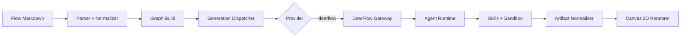
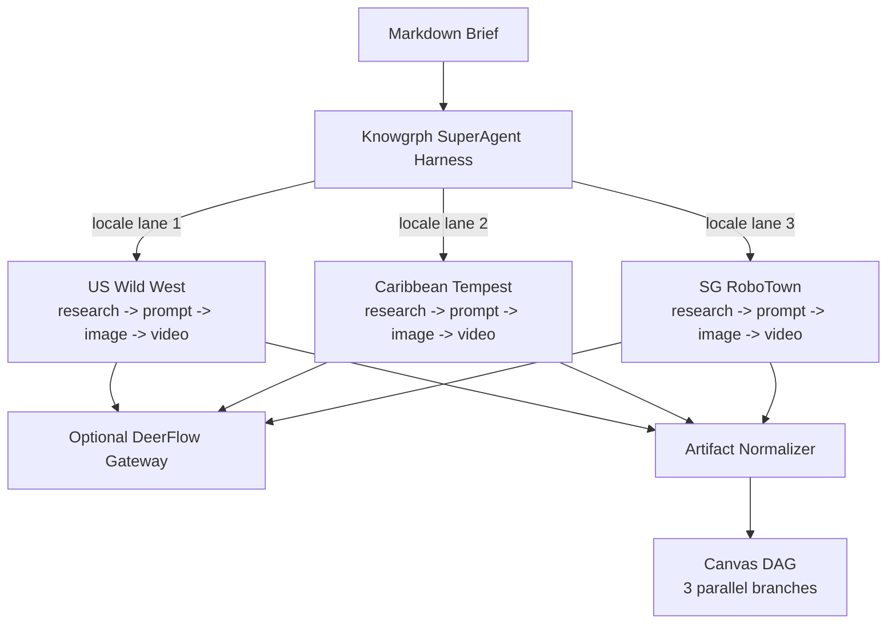

# Knowgrph DeerFlow Setup Guide — From 0 to 1

**Document Version**: 4.0.0
**Date**: 2026-05-09
**Status**: Active
**Companion To**: `knowgrph-deerflow-prd-tad.md`, `knowgrph-deerflow-prd-tad-integration-contracts-and-patterns.md`, `knowgrph-deerflow-prd-tad-delivery-validation.md`

---

## Document Purpose

**Context**: DeerFlow is an optional local gateway and conceptual SuperAgent reference. Knowgrph's native long-horizon harness is source-owned in `docs/documents/knowgrph-superagent-harness.md` and `knowgrph_parser/*`; Canvas Flow Editor still consumes provider-neutral graph/media fields through existing widget, chat, and rich-media owners.
**Intent**: Provide a step-by-step guide to go from zero to a working optional DeerFlow provider path on Canvas, covering Dev (local Vite) and opt-in Prod/Cloudflare Tunnel environments without making DeerFlow a required runtime.
**Copy boundary**: Use DeerFlow only as conceptual inspiration for message gateway, memory, tools, skills, subagents, sandboxed workspace execution, and long-horizon run management. Do not copy DeerFlow code, clone its architecture, or introduce a DeerFlow-only parser, renderer, memory stack, or graph apply path.
**Directive**: All configuration is declarative and fixture-driven; no hardcoded paths or provider constants in source.

---

## DeerFlow Is Optional

DeerFlow is a **first-class optional provider**, not a required dependency. Knowgrph works fully without DeerFlow installed or running.

| Feature | Without DeerFlow | With DeerFlow |
|---------|-----------------|---------------|
| Canvas Flow Editor | Full | Full |
| Text generation (OpenAI) | Full (default provider) | Full |
| Text generation (BytePlus) | Full | Full |
| Image generation | Full (BytePlus) | Full |
| Video generation | Full (BytePlus) | Full |
| MainPanel Integrations | Full (all sections visible) | Full |
| Floating panel chat | Full | Full |
| Text generation (DeerFlow agent) | N/A | Full |
| `npm run dev` | Full | Full |
| `npm run dev:all` | Full (prints warning, skips DeerFlow) | Full |
| Prod (`airvio.co`) | Full | Full |

Knowgrph's default experience remains provider-neutral. DeerFlow only activates when explicitly selected as `chatProvider = 'deerflow'` in Integrations settings. No DeerFlow gateway running = no impact on any other feature. The `dev:all` script gracefully skips DeerFlow startup if the repo is not found.

The native Knowgrph SuperAgent harness can still run locally through
`python3 -m knowgrph_parser superagent`, `npm run goal:run`, or the local MCP
tool `knowgrph.superagent.run` without a DeerFlow gateway.

---

## Prerequisites

| Requirement | Minimum | Required? |
|-------------|---------|-----------|
| Node.js | >= 18 | Yes |
| Knowgrph dev server | `npm -C canvas run dev` | Yes |
| DeerFlow gateway | Running at `http://localhost:8001` (default) | Only for DeerFlow provider |
| DeerFlow skills installed | `deep-research`, `image-generation`, `video-generation` | Only for DeerFlow provider |
| Workspace docs root | Env var `VITE_WORKSPACE_INITIALIZATION_DOCS_ABS_ROOT` pointing to docs folder containing `knowgrph-video-demo.md` | Only for demo fixture |
| Cloudflare Pages project | `airvio.co/knowgrph` with env vars configured (see Step 1.5) | Only for prod deployment |

---

## Architecture Overview



### Data Flow Summary

| Stage | Component | Input | Output |
|-------|-----------|-------|--------|
| 1. Ingest | Parser | Markdown frontmatter | Raw node config |
| 2. Normalize | Provider Metadata Normalizer | Raw node config | `ParsedProviderMetadata` |
| 3. Build | Graph Compiler | Normalized metadata | Compiled graph |
| 4. Dispatch | Generation Dispatcher | `RunGenerationRequest` | Adapter call |
| 5. Execute | DeerFlow Adapter | HTTP payload | Raw provider response |
| 6. Normalize | Artifact Normalizer | Raw response | `CanonicalArtifact` |
| 7. Render | Canvas 2D Renderer | `CanonicalArtifact` | Text/Image/Video in Canvas |

---

## Step 0: Start DeerFlow Gateway

DeerFlow runs as a local gateway that proxies to underlying model providers. It must be running somewhere accessible to the Knowgrph proxy (Vite middleware in dev, Cloudflare Pages Function in prod).

### Dev Mode: Run DeerFlow Locally

#### Option A: One-command startup (Knowgrph + DeerFlow)

```bash
# Starts both Vite dev server AND DeerFlow gateway in one terminal
npm run dev:all
```

The `dev:all` script:
- Checks if DeerFlow gateway is already running on port 8001 (skips if so)
- Starts DeerFlow gateway from `../deer-flow` (or `DEERFLOW_REPO_PATH`)
- Starts the Knowgrph Vite dev server
- Kills DeerFlow gateway on exit (Ctrl+C)

**Environment variables**:

| Variable | Default | Purpose |
|----------|---------|---------|
| `DEERFLOW_PORT` | `8001` | DeerFlow gateway port |
| `DEERFLOW_REPO_PATH` | `../deer-flow` | Path to deer-flow repo |

#### Option B: Start DeerFlow gateway separately

```bash
# Terminal 1: Start DeerFlow gateway (default port 8001)
cd /path/to/deer-flow
python -m deer_flow.server --port 8001

# Terminal 2: Start Knowgrph dev server
npm run dev
```

### Prod Mode: Run DeerFlow via Cloudflare Tunnel (Free)

Cloudflare Tunnel exposes your local DeerFlow gateway to the internet with a public HTTPS URL — no VPS or cloud server needed. The tunnel runs from your machine.

#### Step 0.1: Install Cloudflare Tunnel

```bash
# Install cloudflared (macOS)
brew install cloudflared

# Or download from https://developers.cloudflare.com/cloudflare-one/connections/connect-networks/downloads/
```

#### Step 0.2: Start DeerFlow + Tunnel

```bash
# Terminal 1: Start DeerFlow gateway locally
cd /path/to/deer-flow
python -m deer_flow.server --port 8001

# Terminal 2: Expose via Cloudflare Tunnel
cloudflared tunnel --url http://localhost:8001
```

Cloudflared outputs a public URL like:

```
https://abcxyz-trycloudflare-com.trycloudflare.com
```

This URL is your **production DeerFlow endpoint**.

#### Step 0.3: Configure Knowgrph endpoint for Prod

In Knowgrph Integrations, set the DeerFlow endpoint URL to the tunnel URL:

```ts
store.chatEndpointUrl = 'https://abcxyz-trycloudflare-com.trycloudflare.com/api/llm/chat/completions'
```

Or configure it in the Cloudflare Pages Function so all prod users get it by default:

1. Go to **Cloudflare Dashboard > Pages > joohwee > Settings > Production > Variables**
2. Add: `KNOWGRPH_CHAT_PROXY_UPSTREAM` = `https://abcxyz-trycloudflare-com.trycloudflare.com`

#### Step 0.4: (Optional) Run tunnel as a named tunnel for a stable URL

Quick tunnels generate a random URL each time. For a stable URL, create a named tunnel:

```bash
# Login first (one-time)
cloudflared tunnel login

# Create a named tunnel
cloudflared tunnel create knowgrph-deerflow

# Route your domain to the tunnel
cloudflared tunnel route dns knowgrph-deerflow deerflow.yourdomain.com

# Run the tunnel
cloudflared tunnel run knowgrph-deerflow --url http://localhost:8001
```

Now your DeerFlow endpoint is permanently `https://deerflow.yourdomain.com`.

#### Step 0.5: Keep tunnel alive

Cloudflare Tunnel must stay running for DeerFlow to be reachable. Options:

| Method | How | Persistence |
|--------|-----|-------------|
| **Screen/tmux** | `tmux new -s deerflow && cloudflared tunnel run ...` | Survives terminal close, dies on reboot |
| **LaunchAgent** (macOS) | Create `~/Library/LaunchAgents/com.knowgrph.deerflow.plist` | Auto-starts on login |
| **systemd** (Linux) | Create `/etc/systemd/system/deerflow-tunnel.service` | Auto-starts on boot |

**macOS LaunchAgent example** (`~/Library/LaunchAgents/com.knowgrph.deerflow.plist`):

```xml
<?xml version="1.0" encoding="UTF-8"?>
<!DOCTYPE plist PUBLIC "-//Apple//DTD PLIST 1.0//EN" "http://www.apple.com/DTDs/PropertyList-1.0.dtd">
<plist version="1.0">
<dict>
  <key>Label</key>
  <string>com.knowgrph.deerflow</string>
  <key>ProgramArguments</key>
  <array>
    <string>/opt/homebrew/bin/cloudflared</string>
    <string>tunnel</string>
    <string>run</string>
    <string>knowgrph-deerflow</string>
    <string>--url</string>
    <string>http://localhost:8001</string>
  </array>
  <key>RunAtLoad</key>
  <true/>
  <key>KeepAlive</key>
  <true/>
</dict>
</plist>
```

```bash
# Load the LaunchAgent
launchctl load ~/Library/LaunchAgents/com.knowgrph.deerflow.plist
```

### Verify the gateway is reachable

```bash
# Dev
curl -s http://localhost:8001/api/llm/chat/completions \
  -H "Content-Type: application/json" \
  -d '{"model":"test","messages":[{"role":"user","content":"ping"}]}' \
  | head -c 200

# Prod (replace with your tunnel URL)
curl -s https://abcxyz-trycloudflare-com.trycloudflare.com/api/llm/chat/completions \
  -H "Content-Type: application/json" \
  -d '{"model":"test","messages":[{"role":"user","content":"ping"}]}' \
  | head -c 200
```

Expected: a JSON response (even if it returns an error about model config, the gateway is alive).

---

## Step 1: Configure Provider Settings and API Key Management

### 1.1 Auth Modes

Knowgrph supports two authentication modes. The mode is shared globally across all providers (BytePlus, OpenAI, DeerFlow).

| Mode | Behavior | API Key Required? |
|------|----------|-------------------|
| **`serverManaged`** (default) | The proxy server injects its own API key from environment bindings. The browser never sends a key. | **No** (server provides it) |
| **`byok`** (Bring Your Own Key) | The browser sends your personal API key via `X-KG-Chat-Api-Key` header on every request. | **Yes** (user provides it) |

**Auto-switching rules**:
- Typing an API key while in `serverManaged` mode automatically switches to `byok`
- Switching to `serverManaged` automatically clears the stored API key
- The `auth_mode` and `api_key` fields in every provider section (BytePlus, OpenAI, DeerFlow) read/write the same global state

### 1.2 Open Integrations

1. Launch the Knowgrph Canvas dev server: `npm -C canvas run dev`
2. Open the application in your browser
3. Navigate to **MainPanel** -> **Integrations** tab

### 1.3 Set DeerFlow as Active Provider

In the Integrations view, locate the **DeerFlow Gateway API** section. The SSOT rows are derived from OpenAI-compatible schema with DeerFlow-specific defaults:

| Row Key | Default Value | Description |
|---------|--------------|-------------|
| `deerflowApi.provider` | `deerflow` | Provider routing identifier |
| `deerflowApi.endpoint_url` | `http://localhost:8001/api/llm/chat/completions` | DeerFlow Gateway OpenAI-compatible endpoint |
| `deerflowApi.model` | (from global settings) | Text generation model |
| `deerflowApi.chatModel` | (from global settings) | Chat model selector |
| `deerflowApi.auth_mode` | `serverManaged` | Auth mode (shared global) |
| `deerflowApi.api_key` | (empty in serverManaged) | API key (shared global) |

### 1.4 Configure via Settings Store

The provider settings are persisted in IndexedDB via the settings store. Key fields:

```ts
store.chatProvider = 'deerflow'
store.chatEndpointUrl = 'http://localhost:8001/api/llm/chat/completions'
store.chatModel = 'seed-2-0-lite-260228'
store.chatAuthMode = 'serverManaged'
```

### 1.5 API Key Management: Dev vs Prod

The client uses the **same `/__chat_proxy` path** in both environments. The difference is which server-side handler processes the request and where it reads API keys from.

#### Dev Mode (Local Vite Dev Server)

The Vite dev server middleware in `vite.config.ts` intercepts `/__chat_proxy/*` requests. API keys come from your local shell environment.

Set these in your shell or a `.env` file before starting the dev server:

```bash
# OpenAI provider (used by DeerFlow LLM surface at /api/llm/*)
export KNOWGRPH_CHAT_PROXY_OPENAI_API_KEY="sk-..."
# or fallback
export OPENAI_API_KEY="sk-..."

# BytePlus provider (used for image/video generation)
export KNOWGRPH_CHAT_PROXY_BYTEPLUS_API_KEY="..."
# or fallback
export BYTEPLUS_API_KEY="..."

# DeerFlow local gateway upstream (optional, client header takes priority)
export KNOWGRPH_CHAT_PROXY_UPSTREAM="http://localhost:8001"

# Proxy timeout (optional, 5000-180000 ms, default 90000)
export KNOWGRPH_CHAT_PROXY_TIMEOUT_MS="120000"
```

#### Prod Mode (Cloudflare Pages at `airvio.co/knowgrph`)

The production proxy is a **Cloudflare Pages Function** at `functions/__chat_proxy/[[path]].js` in the `huijoohwee` repo. API keys come from Cloudflare Pages environment bindings.

Configure these at **Cloudflare Dashboard > Pages > joohwee > Settings > Production > Variables and Secrets**:

| Variable | Type | Purpose | Required? |
|----------|------|---------|-----------|
| `KNOWGRPH_CHAT_PROXY_OPENAI_API_KEY` | **Secret** | OpenAI key for `serverManaged` mode | Yes (if using OpenAI/DeerFlow LLM) |
| `OPENAI_API_KEY` | **Secret** | Fallback OpenAI key | Fallback |
| `KNOWGRPH_CHAT_PROXY_BYTEPLUS_API_KEY` | **Secret** | BytePlus ModelArk key for `serverManaged` mode | Yes (if using BytePlus image/video) |
| `BYTEPLUS_API_KEY` | **Secret** | Fallback BytePlus key | Fallback |
| `KNOWGRPH_CHAT_PROXY_UPSTREAM` | Variable | Default upstream URL fallback | Optional |
| `KNOWGRPH_CHAT_PROXY_TIMEOUT_MS` | Variable | Proxy timeout (5,000-180,000; default 90,000) | Optional |
| `KNOWGRPH_INTEGRATION_ALLOWED_HOSTS` | Variable | CSV of allowed upstream hostnames | Optional |

**Key fallback chain** (identical in both environments):

```javascript
const envOpenAiApiKey = env.KNOWGRPH_CHAT_PROXY_OPENAI_API_KEY || env.OPENAI_API_KEY || ''
const envBytePlusApiKey = env.KNOWGRPH_CHAT_PROXY_BYTEPLUS_API_KEY || env.BYTEPLUS_API_KEY || ''
```

Provider-specific key takes priority; generic key is the fallback.

#### DeerFlow-Specific Key Behavior

For the DeerFlow provider (`providerHeader === 'deerflow'`), the proxy treats it as a **local gateway**:

- `requiresOpenAiKey` = **false** (provider is not `'openai'`)
- `requiresBytePlusKey` = **false** (provider is not `'byteplus-modelark'`)
- **No `Authorization` header is attached** by the proxy
- The DeerFlow gateway itself handles authentication internally via its own `config.yaml` or env vars

This means: in `serverManaged` mode, **no API key is needed for DeerFlow** at the Knowgrph level. The DeerFlow gateway manages its own credentials for upstream LLM providers.

### 1.6 Recommended: Use the Production Proxy Everywhere

The production Cloudflare Pages Function and the Vite dev server middleware implement **identical proxy logic** with the same `/__chat_proxy` path. You can simplify your setup by using the production proxy for both environments:

**Option A: Dev server points to production proxy**

Configure the Vite dev server to forward `/__chat_proxy` to the Cloudflare Pages Function:

```bash
# In your local .env or shell
export KNOWGRPH_CHAT_PROXY_UPSTREAM="https://airvio.co"
```

Then all requests from your local dev server route through the production proxy, using the Cloudflare env vars you already configured. No local API keys needed.

**Option B: Keep separate (current default)**

- Dev: Vite middleware reads `process.env` from your local shell
- Prod: Cloudflare Pages Function reads from Cloudflare env bindings
- Same client code, same `/__chat_proxy` path, different server-side handlers

### 1.7 Verify Provider Configuration

The DeerFlow section is discoverable via MainPanel search. Deep-link anchors follow the pattern `deerflow-api-row-{normalized-key}` and are stable across surfaces.

---

## Step 2: Load the Canonical Demo Fixture

The canonical fixture `knowgrph-video-demo.md` is a path-agnostic workspace seed. It defines a 3-node DAG pipeline (Text -> Image -> Video) that exercises the full DeerFlow harness.

### 2.1 Set Workspace Docs Root

```bash
export VITE_WORKSPACE_INITIALIZATION_DOCS_ABS_ROOT=/path/to/your/docs
```

The docs folder must contain `knowgrph-video-demo.md` (or `workspace-seeds/knowgrph-video-demo.md`).

### 2.2 Open the Fixture in Canvas

1. In the Knowgrph Workspace, open the file browser
2. Navigate to `knowgrph-video-demo.md`
3. The parser reads the YAML frontmatter and builds the flow graph

### 2.3 Verify Graph Topology

After parsing, the Canvas should display a DAG with these nodes:

| Node ID | Type | Label |
|---------|------|-------|
| `w-text-script` | TextGeneration | Text Script Widget |
| `p-text-script` | RichMediaPanel | Rich Media Panel - Text (Script) |
| `w-img-scene` | ImageGeneration | Image Widget - Scene Reference |
| `p-img-scene` | RichMediaPanel | Rich Media Panel - Image (Scene) |
| `w-video-scene` | VideoGeneration | Video Widget - Scene |
| `p-video-scene` | RichMediaPanel | Rich Media Panel - Video (Scene) |

Edges connect: `w-text-script -> p-text-script`, `w-img-scene -> p-img-scene`, `w-img-scene -> w-video-scene`, `w-video-scene -> p-video-scene`.

---

## Step 3: Run Text Generation (W01)

### 3.1 What Happens

When you click **Run** on the Text Script Widget (`w-text-script`):

1. **Dispatcher** reads `chatProvider = 'deerflow'` from the store
2. **Provider normalization** resolves `deerflow` via `normalizeChatProviderId()`
3. **Endpoint resolution** uses `store.chatEndpointUrl` or falls back to `getChatDefaultEndpointUrlForProvider('deerflow')` which returns `http://localhost:8001/api/llm/chat/completions`
4. **Client builds proxy headers**: `X-KG-Chat-Provider: deerflow`, `X-KG-Chat-Upstream: http://localhost:8001`, **no** `X-KG-Chat-Api-Key` (serverManaged mode)
5. **Client rewrites** the absolute endpoint URL to `/__chat_proxy/api/llm/chat/completions` (same-origin proxy path)
6. **Proxy handler** (Vite middleware in dev, Cloudflare Function in prod) receives the request, sees `provider = 'deerflow'`, attaches no Authorization header, forwards to `http://localhost:8001/api/llm/chat/completions`
7. **DeerFlow agent** invokes the `deep-research` skill, performs web search for locale context, and returns structured prompt JSON
8. **Response** is written to `w-text-script.properties.output` and `w-text-script.properties.outputSrcDoc`

### 3.2 User Action

1. Select the `w-text-script` node on the Canvas
2. Click the **Run** button in the node overlay or toolbar
3. Wait for the loading state to complete
4. The Rich Media Panel (`p-text-script`) displays the generated markdown output

### 3.3 Data Flow

```
Canvas Run -> useFlowEditorWorkflowActions.ts
  -> normalizeChatProviderId(store.chatProvider) = 'deerflow'
  -> runEndpointUrl = store.chatEndpointUrl || getChatDefaultEndpointUrlForProvider('deerflow')
  -> buildChatProxyHeaders({ provider: 'deerflow', apiKey: null })  // serverManaged
  -> resolveChatEndpointForRequest() rewrites to /__chat_proxy/api/llm/chat/completions
  -> POST /__chat_proxy/api/llm/chat/completions
     Headers: X-KG-Chat-Provider: deerflow, X-KG-Chat-Upstream: http://localhost:8001
  -> [Proxy: Vite middleware (dev) OR Cloudflare Function (prod)]
     -> No Authorization header (DeerFlow = local gateway)
     -> Forwards to http://localhost:8001/api/llm/chat/completions
  -> DeerFlow agent -> deep-research skill -> structured prompt
  -> Write node.properties.output + node.properties.outputSrcDoc
```

### 3.4 Dev vs Prod Request Flow Comparison

```
DEV MODE:
  Browser -> POST localhost:5173/__chat_proxy/api/llm/chat/completions
          -> Vite middleware -> forwards to localhost:8001
          -> DeerFlow gateway -> upstream LLM

PROD MODE (Cloudflare Tunnel):
  Browser -> POST airvio.co/__chat_proxy/api/llm/chat/completions
          -> Cloudflare Pages Function -> forwards to tunnel URL
          -> Cloudflare Tunnel -> localhost:8001
          -> DeerFlow gateway -> upstream LLM
```

---

## Step 4: Run Image Generation (W02)

### 4.1 What Happens

When you click **Run** on the Image Widget (`w-img-scene`):

1. **Dispatcher** resolves the active provider (`deerflow` or `byteplus-modelark`) for image generation
2. **Request builder** (`buildRichMediaWidgetRunRequest`) assembles the prompt from node properties, connected values, and workspace context
3. **Adapter routing**:
   - DeerFlow provider -> DeerFlow runs endpoint (`/api/runs/stream`) with artifact normalization
   - BytePlus provider -> BytePlus image generation endpoint
4. **Proxy auth behavior**:
   - DeerFlow provider: no Authorization header injected (gateway handles upstream auth)
   - BytePlus provider: injects `Authorization: Bearer <env-byteplus-key>`
5. **Response** is normalized and written as `imageUrl` to the node properties
6. **Rich Media Panel** (`p-img-scene`) renders the generated image

### 4.2 User Action

1. Select the `w-img-scene` node
2. Click **Run**
3. The generated scene reference image appears in the connected Rich Media Panel

### 4.3 Data Flow

```
Canvas Run -> useFlowEditorWorkflowActions.ts
  -> resolveRichMediaWidgetKind(node) = 'image'
  -> runRichMediaWidgetGeneration(node, connectedValues, markdownText, config)
  -> buildRichMediaWidgetRunRequest(node, connectedValues, markdownText)
  -> runGenerationWithProvider(kind='image')
  -> deerflow: POST /__chat_proxy/api/runs/stream -> artifact URL -> GET /__chat_proxy/api/threads/{id}/artifacts/*
     or byteplus-modelark: POST /__chat_proxy/api/v3/image/generation
  -> proxy auth per provider policy
  -> normalized image URL
  -> Write node.properties.imageUrl
```

---

## Step 5: Run Video Generation (W03)

### 5.1 What Happens

When you click **Run** on the Video Widget (`w-video-scene`):

1. **Dispatcher** resolves the active provider (`deerflow` or `byteplus-modelark`)
2. **Request builder** assembles the video prompt, including the reference image from `w-img-scene` via the connected edge
3. **Adapter routing**:
   - DeerFlow provider -> DeerFlow runs endpoint (`/api/runs/stream`) with artifact normalization
   - BytePlus provider -> BytePlus video task create/poll endpoints
4. **Proxy auth behavior** follows provider policy (DeerFlow no injected auth; BytePlus server-managed injects key)
5. **Response** is normalized and written as `videoUrl` to the node properties
6. **Rich Media Panel** (`p-video-scene`) renders the generated video

### 5.2 User Action

1. Ensure `w-img-scene` has a generated `imageUrl` (from Step 4)
2. Select the `w-video-scene` node
3. Click **Run**
4. The generated video clip appears in the connected Rich Media Panel

### 5.3 Data Flow

```
Canvas Run -> useFlowEditorWorkflowActions.ts
  -> resolveRichMediaWidgetKind(node) = 'video'
  -> runRichMediaWidgetGeneration(node, connectedValues, markdownText, config)
  -> buildRichMediaWidgetRunRequest(node, connectedValues, markdownText)
  -> runGenerationWithProvider(kind='video')
  -> deerflow: POST /__chat_proxy/api/runs/stream -> artifact URL -> GET /__chat_proxy/api/threads/{id}/artifacts/*
     or byteplus-modelark: POST /__chat_proxy/api/v3/contents/generations/tasks -> poll task status
  -> proxy auth per provider policy
  -> normalized video URL
  -> Write node.properties.videoUrl
```

---

## Step 6: End-to-End Pipeline Execution

### 6.1 Full DAG Run

Run all nodes in sequence:

1. **W01** (Text) -> generates structured prompts for all locales
2. **W02** (Image) -> generates scene reference image from the text output
3. **W03** (Video) -> generates video clip using the reference image

The DAG topology ensures correct execution order: text feeds image, image feeds video.

### 6.2 Multi-Locale Parallel Execution (Optional DeerFlow Gateway)

When an operator opts into DeerFlow gateway support for rich-media generation, parallel locale lanes remain Knowgrph-authored Flow Editor branches and DeerFlow stays provider-side. Native long-horizon coordination belongs to the Knowgrph SuperAgent harness; this setup guide does not make DeerFlow a parser, renderer, memory, or graph-apply owner.



---

## Continuation

Step 7 (Verify and Validate), Troubleshooting, Proxy Architecture Reference, and Revision History continue in [knowgrph-deerflow-setup-guide.companion.md](knowgrph-deerflow-setup-guide.companion.md).
