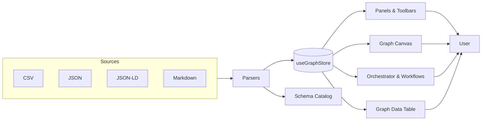
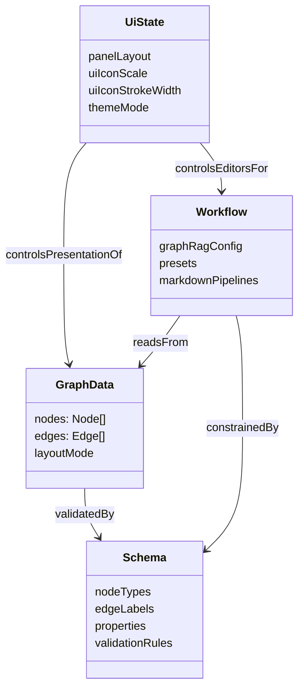
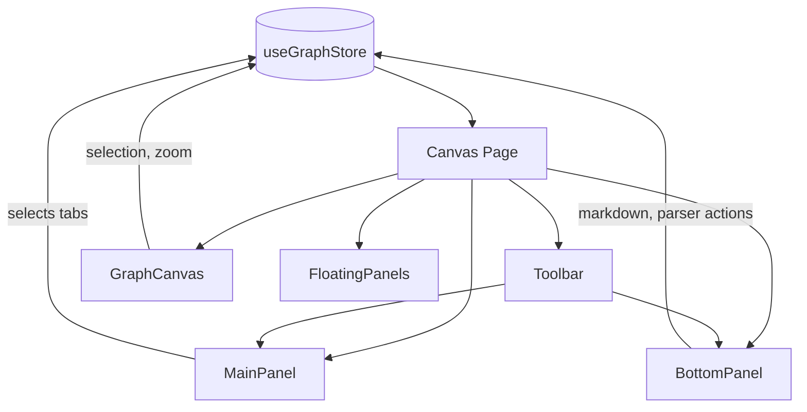
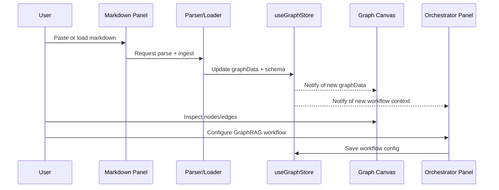

# Knowgrph Design Document

## Audience

This document is primarily written for:
- New engineers joining the Knowgrph canvas/frontend codebase.
- Contributors extending panels, workflows, or parsers.
- Product and design partners who need a mental model of how features hang together.

If you are completely new, start with the “Quick mental model” diagrams, then circle back to the detailed sections.

## Overview

Knowgrph is an interactive graph workspace for exploring, validating, and orchestrating knowledge graphs and graph-derived workflows. It combines:
- A canvas-based graph visualizer
- Schema-aware configuration and validation tools
- A panel system for orchestration, markdown pipelines, and data table operations

The primary goal is to make schema-driven graph work observable, reproducible, and easy to iterate on.

### Quick mental model (product view)

At a product level, you can think of Knowgrph as:
- A “graph IDE” where:
  - The graph canvas is your code editor.
  - Panels are debuggers, inspectors, and consoles.
  - Workflows (GraphRAG, markdown ingestion) are runnable pipelines attached to the graph.

The rest of this document explains how that mental model maps to the code.

## High-Level Architecture Diagram

From a high level, the canvas app looks like this:

Key ideas:
- All UI reads and writes flow through `useGraphStore`.
- Panels are just different projections of the same underlying graph + schema + workflow state.

## Core Domain Model

- Graph data
  - Nodes and edges with typed properties
  - Layout modes for semantic, document-structure, and property-centric views
  - Derived layers (e.g. communities, graph layers, paths) computed from base graph data

- Schema
  - Catalog of node types, edge labels, and property definitions
  - Validation rules for duplicates, dangling references, and required fields
  - UI schema describing how fields are presented in panels and tables

- Workflows
  - GraphRAG workflow configuration and presets
  - Markdown ingestion and transformation pipelines
  - Orchestrator views for inspecting agentic steps, context, and tool invocations

### Domain relationships (engineer view)

## Frontend Architecture (Canvas App)

- Technology stack
  - React + TypeScript for UI
  - Zustand store for application state (`useGraphStore`)
  - Tailwind-style utility classes for layout and density
  - Lucide for iconography

- Major feature areas
  - Graph canvas for visualization and selection
  - Panels (main/right/bottom) for schema, graph fields, workflow, and help
  - Bottom panel for markdown, parsers, curated tables, and stats
  - Toolbars and floating panels for quick access to views and actions

### React layout and data flow

At a very coarse level:

Rules of thumb for new engineers:
- Read state via `useGraphStore` selectors.
- Write state via store actions, not local React state, unless it is purely local UI (e.g. a dropdown open/close).

## State Management

The `useGraphStore` state is the single source of truth for:
- Graph data and selection (nodes, edges, hover, focus)
- Schema and schema UI editor state
- Panel layout and open/closed state
- UI density and icon configuration
- Parser, orchestrator, and workflow configuration

Key characteristics:
- Shallow selectors are used aggressively to avoid unnecessary re-renders.
- Configuration that needs to be persisted (e.g. layout mode, markdown sync scroll) is wired through localStorage helper utilities.

## Panels and Layout

- Main panel
  - Hosts tabs for workflow, graph fields, help, and settings.
  - Uses header components to configure UI density and panel behavior.

- Bottom panel
  - Markdown section with editor/viewer/split modes.
  - Parser and schema toolbars.
  - Curation toolbar and graph data table tools.

- Floating panels
  - Props panel that follows selection context.
  - Orchestrator floating panel for workflow execution/inspection.

## UI Density and Icons

Icon rendering is centrally configured via the UI settings slice:
- `uiIconScale` controls size (e.g. compact vs default) and maps to Tailwind classes via `getIconSizeClass`.
- `uiIconStrokeWidth` is the global stroke weight applied to Lucide icons.
- Additional classes (color, padding, pill styling) are also stored in the UI slice.

Implementation principles:
- Lucide icons use `getIconSizeClass(uiIconScale)` for consistent sizing.
- Stroke width is taken from `uiIconStrokeWidth` whenever a Lucide icon specifies `strokeWidth`.
- Settings previews reuse the same utilities so changes in UI density are immediately visible.

## Data Flows (High Level)

1. Ingestion
   - Graph and schema data are imported from CSV, JSON, JSON-LD, or markdown-derived flows.
   - Parsers normalize source formats into the internal graph representation.

2. Configuration
   - Schema editor updates field definitions and validation rules.
   - Graph fields UI configures derived fields and table views.
   - UI density and icon settings customize the visual presentation.

3. Orchestration
   - GraphRAG workflows are authored and edited via panel editors.
   - Orchestrator panel surfaces agentic steps, context, and tooling.

4. Validation and Export
   - Schema linting and graph validation surface issues.
   - Export paths include CSV, GraphML, Cypher, and JSON-LD.
   - Workflow and schema configurations are serializable for reuse.

### End-to-end flow (sequence)

The typical “markdown to graph to workflow” path can be visualized as:

For new contributors, this sequence is a good starting point when deciding where a new feature belongs (panel, parser, or store).

For details on how markdown provenance drives Canvas↔Markdown panel sync and selection behavior, see:
- `docs/documents/knowgrph-parser-document.md` (Markdown Rendering, Canvas UI)
- `docs/documents/knowgrph-renderer-document.md` (Canvas ↔ Markdown selection sync)
- `docs/documents/knowgrph-ui-ux-design-document.md` (Canvas ↔ Markdown panel UX)

## Testing and Quality

The canvas app is covered by a mix of unit and integration tests:
- Schema CRUD and validation
- Graph selection, zoom, and minimap behavior
- UI persistence (theme, layout, markdown settings, launch spotlight)
- Graph fields synchronization with graph mutations
- Orchestrator tooltips and workflow presets
- Markdown ingestion and media workflows

- New features should:
- Reuse existing store slices and configuration patterns.
- Respect UI density and icon settings.
- Include tests when touching core flows (schema, graph, workflow, or panels).

### What different audiences should focus on

- New engineers
  - Read: “High-Level Architecture Diagram”, “Frontend Architecture”, “State Management”.
  - Practice: add a small panel-level feature that:
    - Reads from `useGraphStore`.
    - Persists a simple preference to localStorage.
    - Includes a UI test or store-level assertion.

- Product and design
  - Read: “Overview”, “Quick mental model (product view)”, “Data Flows (High Level)”.
  - Use the sequence diagram to reason about where a feature fits:
    - New ingestion path → Parsers and Store.
    - New surface area → Panel or Canvas.

- External contributors
  - Read: “Domain relationships (engineer view)”, “Testing and Quality”.
  - Look for extension points:
    - New parser, new schema rule, new orchestrator panel section.

## How to Add a New Panel

This is a lightweight recipe for adding a new main-panel view. The exact implementation details may evolve, but the steps and file shapes are stable.

1. Create a panel body component
   - Add a new React component under the panels views tree, for example:
     - `canvas/src/features/panels/views/MyNewPanel.tsx`
   - Keep this component focused on layout and data projection:
     - Read from `useGraphStore` as needed.
     - Accept props for anything that should stay in the parent.

2. Register the panel in the main panel switch
   - Open the main panel container:
     - [MainPanel.tsx](file:///Users/huijoohwee/Documents/GitHub/knowgrph/canvas/src/features/panels/MainPanel.tsx)
   - Locate the structure that:
     - Defines available tabs (e.g. `'workflow' | 'help' | 'graphFields' | 'settings'`).
     - Renders different bodies based on the active tab.
   - Add:
     - A new tab key for your panel (e.g. `'myPanel'`).
     - A `case`/branch in the render logic that returns `MyNewPanel`.

3. Expose a way to open the panel
   - If the panel should be accessible from the main toolbar:
     - Open [Toolbar.tsx](file:///Users/huijoohwee/Documents/GitHub/knowgrph/canvas/src/components/Toolbar.tsx).
     - Find the buttons that open existing main panel tabs.
     - Add a new button that:
       - Calls the same “open main panel with tab key” helper.
       - Uses a Lucide icon wired to `uiIconScale` and `uiIconStrokeWidth`.
   - If it should be opened via another panel or shortcut:
     - Reuse the same underlying event or store action used by other tabs (for consistency).

4. Wire any new state into `useGraphStore`
   - If your panel needs persistent state (filters, options, toggles):
     - Add fields and actions to the relevant slice in the store, for example:
       - `canvas/src/hooks/store/uiSettingsSlice.ts`
       - or another domain slice already responsible for that area.
     - Prefer:
       - Single-responsibility slices.
       - LocalStorage-backed helpers for anything user-configurable (using existing `LS_KEYS` patterns).

5. Add tests
   - Add or extend tests that assert:
     - The new tab key is recognized by any routing/open-panel helpers.
     - The panel renders when the tab is active.
     - Any store-backed state changes behave as expected.
   - Use existing UI tests as references, especially those around:
     - Panel open/close behavior.
     - Settings persistence.

If you are unsure where to place a new panel, prefer:
- `MainPanel` for schema/graph/workflow-related inspectors.
- `BottomPanel` for flows anchored in markdown, parsers, tables, or stats.

## Non-Goals (Current Scope)

- Full backend orchestration or job scheduling is out of scope; the focus is on client-side orchestration, configuration, and visualization.
- Arbitrary graph database management; Knowgrph assumes data is provided via supported import/export formats rather than directly managing databases.

## Troubleshooting (Canvas and Panels)

This section collects common failure modes and how to debug them.

### Panel does not update when state changes

Possible causes:
- The component is not reading from `useGraphStore`.
- The selector is too broad and hides changes.
- The component is rendering from stale local state instead of the store.

What to check:
- Ensure the panel uses a selector that includes the field you expect to change:
  - `const value = useGraphStore(s => s.someField)`
- If you need multiple fields, prefer a selector that returns an object and `useShallow` where appropriate:
  - This avoids re-renders on unrelated fields and makes changes easier to reason about.

### Panel never appears

Possible causes:
- The tab key was added to a component but not to the main panel switch.
- The toolbar or caller is passing the wrong tab key.

What to check:
- In [MainPanel.tsx](file:///Users/huijoohwee/Documents/GitHub/knowgrph/canvas/src/features/panels/MainPanel.tsx):
  - Confirm the new tab key is listed wherever valid tabs are enumerated.
  - Confirm there is a branch that actually returns your panel component.
- In [Toolbar.tsx](file:///Users/huijoohwee/Documents/GitHub/knowgrph/canvas/src/components/Toolbar.tsx) or the caller:
  - Confirm the button or shortcut uses the same tab key string.

### Settings do not persist across reloads

Possible causes:
- The field is not wired to localStorage.
- The `LS_KEYS` entry or key string does not match between read and write.

What to check:
- In the relevant store slice (for example `uiSettingsSlice`):
  - Confirm there is a read path from localStorage, and a write path that updates both store and localStorage.
- Search for the relevant `LS_KEYS` entry and ensure:
  - The key name is consistent everywhere.
  - The initial value matches what the feature expects.

### Icon sizing or stroke width looks inconsistent

Possible causes:
- A Lucide icon is using hardcoded classes or stroke width instead of shared utilities.

What to check:
- Ensure the icon uses:
  - `getIconSizeClass(uiIconScale)` for size.
  - `uiIconStrokeWidth` for `strokeWidth` when explicitly set.
- For previews in settings:
  - Ensure they reuse the same utilities so what users see matches what the UI does elsewhere.
