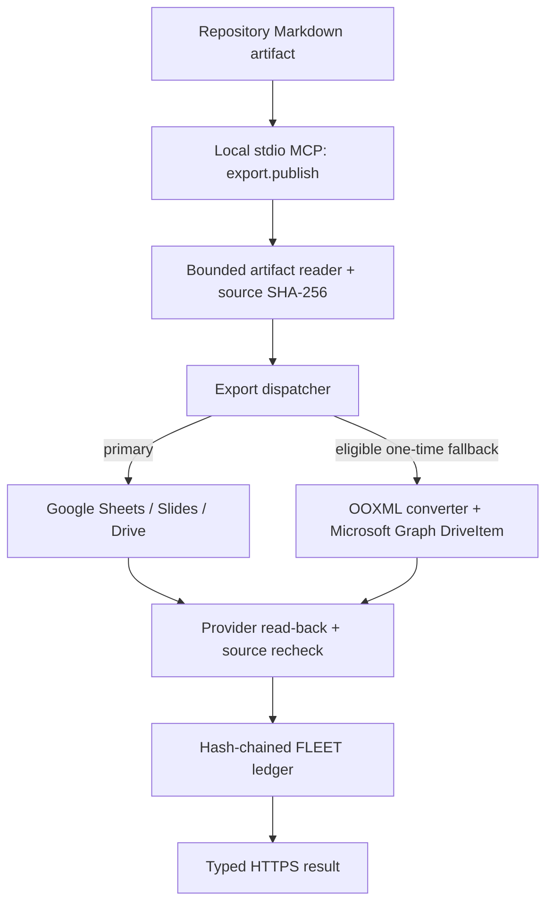

# Knowgrph Docs/Sheets/Slides Export — Combined PRD/TAD

## Overview

Knowgrph now exposes a typed local stdio MCP operation,
`export.publish(artifact_id, kind, target_provider?)`, that reads a bounded,
repository-relative Markdown artifact and publishes it as a Google Sheet or
Slides presentation, or as a native `.xlsx` or `.pptx` file in Microsoft
OneDrive. Markdown remains authoritative: publication verifies the source SHA-256
before and after the provider call and never writes into the source artifact.

The deterministic runtime and mocked provider acceptance paths are implemented.
Real-account Google and Microsoft execution, the live 5-second p95 objective,
recipient permissions, and provider quota behavior remain **unproven** until a
bounded run is completed with operator-owned credentials. See
`knowgrph-docs-sheets-slides-runtime-readiness.md`.

## User journey and workflow

### Journey: share an investor- or client-ready artifact

| Stage | User action | System behavior | End state |
|---|---|---|---|
| Trigger | Complete a Markdown KGC artifact | Git remains the artifact SSOT | Auditable source exists |
| Engage | Call `export.publish` | Validate request, path, frontmatter, content bounds, provider configuration, and ledger | Invalid work fails before mutation |
| Complete | Open the returned HTTPS URL | Create or update one provider artifact for the typed identity | Familiar Google or Microsoft surface |
| Return | Publish the same identity again | Resolve the latest successful ledger entry and update in place | No create-per-refresh clutter |

The export identity is exactly `(artifact_id, provider, kind)`. A spreadsheet
and a slide deck from the same Markdown file are distinct identities. Google
and Microsoft publications are also distinct identities.

### Product workflow

1. A caller invokes `export.publish` with a repository-relative `.md` or
   `.markdown` `artifact_id`, `kind="spreadsheet" | "slides"`, and an optional
   provider.
2. The local Node MCP server validates the request and reads at most the bounded
   artifact limit from inside `KNOWGRPH_ROOT`. The artifact must begin with
   closed YAML frontmatter containing a non-empty `title`.
3. With the default `target_provider="google"`, the dispatcher attempts Google
   first. It may attempt Microsoft once only when Microsoft fallback is enabled,
   configured, and the Google failure is explicitly retryable/transient.
4. With explicit `target_provider="microsoft"`, only Microsoft is attempted and
   `fallback_used` remains `false`.
5. The adapter creates or updates one provider object, performs provider
   read-back verification, and returns its ID and HTTPS URL.
6. The dispatcher verifies that the source SHA-256 is unchanged, appends a
   hash-chained ledger entry, validates the result, and returns it to the MCP
   caller.

There is no same-provider retry. The hard maximum is two provider attempts:
Google once, then Microsoft once. A non-retryable Google error stops without
fallback. Partial provider objects created during a failed call are deleted on
a best-effort basis; a failure never records a `doc_id` or URL in the ledger.

## PRD

### Problem statement

Knowgrph analysis and financial-model outputs are source-visible Markdown, but
many investors and SME recipients work in Google Workspace or Microsoft Office.
Manual reformatting is repetitive and can detach a presentation or workbook
from its auditable source.

### User stories

- As a founder, I can publish a Markdown table to Google Sheets and Markdown
  slides to Google Slides with one typed MCP call.
- As a founder, I can explicitly request native Excel or PowerPoint output in
  my personal OneDrive.
- As an operator, I get a bounded Microsoft fallback only for an eligible Google
  failure, with `fallback_used` describing what actually happened.
- As an auditor, I can verify source immutability and the append-only identity
  chain without placing credentials in Markdown or Git.
- As a Canvas user, I retain separate connected Slide Deck and Financial Model
  Rich Media panels. Running the downstream deliverables Widget does not
  overwrite its source card, persists a reusable XLSX companion, and can invoke
  arbitrary approval-gated Slides/Sheets MCP profiles.

### Acceptance criteria and current proof state

| ID | Acceptance criterion | Current state |
|---|---|---|
| AC1 | Default publication creates/updates a real Google Sheet or Slides presentation, returns a resolvable URL within 5 seconds at p95, and does not modify the source KGC | Deterministic and mocked adapter coverage implemented; real account, URL, sharing, and p95 proof pending |
| AC2 | Eligible Google failure or explicit Microsoft selection creates/updates a native `.xlsx`/`.pptx` DriveItem and reports `fallback_used` accurately | Deterministic OOXML and mocked Graph coverage implemented; real OneDrive read-back and Office-open proof pending |
| AC3 | With no configured provider, return `PROVIDER_NOT_CONFIGURED` before outbound provider calls and write no provider ID to the ledger | Implemented and locally testable; current credential audit found no configured Google or Microsoft credentials |
| AC4 | Publishing the same `(artifact_id, provider, kind)` updates the same external object | Implemented through the verified ledger plus provider-side identity lookup; real-account repeat-run proof pending |
| AC5 | A corrupt or unwritable ledger cannot return an untracked success | Implemented fail-closed with hash-chain validation, an exclusive lock, and typed ledger errors |

Live-provider readiness must remain false until AC1 and AC2 each have a bounded
authenticated acceptance receipt. A unit or mock result must never be relabeled
as live proof.

### Success metrics

| Metric | Target | Evidence owner |
|---|---:|---|
| Calls per user export | 1 MCP call | MCP receipt |
| Provider attempts | ≤ 2, with no same-provider retry | Dispatcher tests and sanitized error details |
| Source modifications | 0 | Pre/post source SHA-256 |
| Incremental model/token cost | $0 | No model call in the export path |
| Google live latency | p95 ≤ 5 seconds | Bounded real-account acceptance run; currently unproven |
| Duplicate artifacts per identity | 0 | Ledger identity plus provider lookup/read-back |

### Scope

**Implemented in this increment**

- local stdio MCP registration and typed schemas for `export.publish`
- repository-safe Markdown ingest and source hash verification
- Google Sheets, Slides, and Drive REST adapters
- Google human OAuth refresh, direct access token, and constrained service-account auth
- deterministic Markdown table → XLSX and Markdown slides → PPTX conversion
- Microsoft personal-account delegated OAuth and Graph DriveItem upload/read-back
- Google-primary, Microsoft-fallback dispatch with a hard two-attempt cap
- hash-chained, append-only `FLEET.md` identity ledger and verification CLI
- sanitized provider failures and fail-closed ledger behavior
- existing Canvas Rich Media deliverables integration, separate output panels,
  source-card preservation, XLSX persistence, and arbitrary approval-gated MCP
  invocation

**Out of scope**

- Prod or Cloudflare deployment; this increment is Dev/local stdio only
- Lark/Feishu publication
- bidirectional editing or provider-to-Markdown reconciliation
- provider account creation, recipient sharing-policy automation, or secret storage
- formula generation beyond the source Markdown values represented by the
  deterministic converter
- claiming real-account or p95 readiness without authenticated receipts

### Dependencies and credentials

The implementation uses the existing Node MCP SDK server in `mcp/server.js`; it
does not introduce FastMCP or a separate export harness. The ledger and its CLI
are new components in this increment, not pre-existing infrastructure.

Google personal accounts use human OAuth (`access_token` or refresh-token
credentials). A service account is accepted only with an impersonated Workspace
user or `KNOWGRPH_GOOGLE_SHARED_DRIVE_FOLDER_ID`; a generic My Drive folder ID
and a bare service-account key are not considered configured. Microsoft personal
accounts use delegated `Files.ReadWrite`
authorization and native OOXML generation followed by Graph DriveItem upload;
the runtime does not depend on a Graph workbook or PowerPoint editing API.

Credential values remain host-owned environment data. Canonical variable names
and setup modes are listed in the runtime-readiness runbook and `mcp/README.md`.

## TAD

### Architecture



All network calls are direct provider HTTPS REST calls made by the local Node
runtime. The external providers remain their own systems of record. The ledger
stores only identity and outcome metadata needed for auditing and stable
in-place target reuse. Because every call can create a provider revision and a
new ledger entry, the MCP tool correctly advertises `idempotentHint=false` and
`destructiveHint=true` even though the external object ID remains stable.

### Typed MCP contract

Input:

```json
{
  "artifact_id": "docs/example-financial-plan.md",
  "kind": "spreadsheet",
  "target_provider": "google"
}
```

`target_provider` defaults to `google`. Unknown fields fail validation.

Success:

```json
{
  "schema": "knowgrph-export-publish/v1",
  "artifact_id": "docs/example-financial-plan.md",
  "kind": "spreadsheet",
  "provider": "google",
  "doc_id": "provider-object-id",
  "url": "https://provider.example/object",
  "url_or_file_id": "https://provider.example/object",
  "fallback_used": false,
  "source_sha256": "64-lowercase-hex-characters"
}
```

Errors are structured and provider details are sanitized and bounded. Provider
tokens, credential query parameters, response stacks, and raw secret-bearing
payloads are not returned. Important codes include `INVALID_EXPORT_REQUEST`,
`ARTIFACT_NOT_FOUND`, `ARTIFACT_INVALID`, `PROVIDER_NOT_CONFIGURED`,
`EXPORT_FAILED`, `LEDGER_CORRUPT`, `LEDGER_LOCK_TIMEOUT`, and
`LEDGER_WRITE_FAILED`.

### Provider behavior

#### Google

- Resolve a prior ledger ID, then fall back to a Drive `appProperties`
  identity lookup.
- Create at most one Google-native file for a missing identity.
- Sheets: parse the first bounded, non-fenced Markdown pipe table; update title,
  grid bounds, frozen header row, typed values, formats, and column widths.
- Slides: parse bounded Markdown slides; create the replacement slides in one
  `batchUpdate`, then delete the old slides in that same atomic request and
  update the Drive filename.
- Verify the final Drive file ID, MIME type, and non-trashed state.

#### Microsoft

- Parse bounded Markdown into deterministic native OOXML bytes.
- Spreadsheet output is one formatted worksheet with a frozen header, filter,
  typed numbers, percentages, and common currencies.
- Presentation output is a deterministic widescreen deck with title and body
  text derived from Markdown slides.
- Upload or replace the stable `.xlsx`/`.pptx` path through
  `PUT /me/drive/.../content`, then read the DriveItem back and verify its ID,
  MIME type, size, and non-deleted state.

### Ledger and stable identity

`FLEET.md` and `scripts/fleet.js` were introduced with this implementation.
Every machine entry includes its canonical payload hash and the previous entry
hash. Before a provider mutation, the dispatcher verifies the entire chain and
uses the most recent successful entry matching `(artifact_id, provider, kind)`.

Success entries contain the provider ID and HTTPS URL. Failure entries contain
an error code and must not contain a provider ID or URL. Missing credentials
return before a ledger entry is appended. A corrupt ledger, lock timeout, or
write failure is a typed failure rather than a silent observability gap. Both
publication-identity and ledger locks are cross-process, bounded, and recover
only a stale owner whose same-host process is demonstrably dead.

Chain corruption is detected before provider mutation. If an append fails after
an existing provider object was updated, the call still returns an error but
cannot roll that provider object back. A newly created object is eligible for
best-effort cleanup. Operators must resolve the ledger failure before retrying.

Real-account proof should set `KNOWGRPH_EXPORT_FLEET_PATH` to a private temporary
ledger. This keeps account-specific IDs and URLs out of the committed repository
while preserving the same hash-chain verification path.

### Component inventory

| Layer | Component | Canonical owner | Status |
|---|---|---|---|
| Contract | MCP schemas, result/error validation, identity | `mcp/export-publish-contract.js` | Implemented |
| Ingest | Safe Markdown reader and source digest | `mcp/export-artifact-reader.js` | Implemented |
| Dispatch | Bounded primary/fallback orchestration | `mcp/export-publish-runtime.js` | Implemented |
| Auth | Google and Microsoft token resolution | `mcp/export-provider-auth.js` | Implemented |
| HTTP | Provider request/error sanitization | `mcp/export-provider-http.js` | Implemented |
| Adapter | Google Sheets/Slides/Drive | `mcp/export-google-adapter.js` | Implemented; live unproven |
| Adapter | Microsoft Graph DriveItem upload | `mcp/export-microsoft-adapter.js` | Implemented; live unproven |
| Conversion | Markdown table/slides and XLSX/PPTX OOXML | `grph-shared/src/office/` | Implemented |
| Ledger | Hash chain, lock, append, identity lookup | `mcp/export-ledger.js` | Implemented |
| CLI | Ledger verify/list commands | `scripts/fleet.js` | Implemented |
| CLI | Single publication and bounded live verifier | `scripts/export-publish.mjs`, `scripts/verify-export-live.mjs` | Implemented; live blocked without credentials |
| MCP registry | Tool metadata and stdio execution route | `mcp/local-tool-contract.js`, `mcp/server.js` | Implemented |
| Canvas | Separate Rich Media deliverables + optional external MCP | `canvas/src/components/StoryboardWidgetCanvas/runtime/storyboardWidgetWorkflowRichMediaDeliverablesRun.ts` | Existing integration retained and hardened |
| Proof | Real Google/Microsoft account receipts and p95 sample | Private proof ledger + operator evidence | Pending credentials |

### Quality and security invariants

- Markdown and YAML frontmatter are data, never a credential store.
- The reader rejects traversal, absolute paths, external symlinks, oversized
  artifacts, malformed frontmatter, and sensitive credential-like frontmatter
  keys.
- Provider configuration is checked before outbound provider calls.
- Every token and provider response, including its body, has a finite timeout.
- No provider call or ledger write may change the source Markdown.
- Google-to-Microsoft fallback is bounded and eligibility-based; there is no
  loop and no same-provider retry.
- Provider messages are redacted and bounded before they reach the MCP result.
- A newly created partial provider object is cleaned up on a failed verification
  path when the provider permits it.
- The ledger is fail-closed and append-only. Operators verify it rather than
  hand-editing machine entries.
- Export is local/Dev functionality. This PRD authorizes no Prod or Cloudflare
  deployment.

### Deployment and rollback

The implementation ships on the local stdio MCP surface. Runtime activation is
by environment-provided credentials; source code contains no account secrets.
Microsoft fallback can be disabled with
`KNOWGRPH_EXPORT_MICROSOFT_FALLBACK_ENABLED=false`. Removing credentials disables
the corresponding provider without a data migration. Existing external files
remain provider-owned.

No Prod, Pages, Worker, or Cloudflare deployment is part of this increment.

## Architectural decisions

### ADR-1 — Google-native primary

**Status:** Accepted.

Use direct Google Drive, Sheets, and Slides APIs as the default link-oriented
recipient surface. Personal-account use requires human OAuth. Service-account
execution is limited to delegated-user or explicit shared-drive-folder setups;
it is not presented as a frictionless substitute for personal account consent.

### ADR-2 — Native Office fallback through DriveItem upload

**Status:** Accepted.

Generate deterministic OOXML locally and upload it to personal OneDrive using
Microsoft Graph. This produces real `.xlsx` and `.pptx` files without assuming
a general-purpose Graph PowerPoint editor or relying on a workbook API for file
creation.

### ADR-3 — File ledger instead of a new datastore

**Status:** Accepted.

Use a hash-chained append-only Markdown ledger for low-volume local operation.
Keep live account proof in an isolated ledger path so account IDs and URLs are
not committed. A future multi-writer service would require a transactional
store and is outside this increment.

## Traceability

```text
AC1 -> export-publish-runtime + Google adapter -> mocked tests + pending live Google receipt
AC2 -> shared OOXML + Microsoft adapter -> archive/Graph tests + pending live Microsoft receipt
AC3 -> provider configuration gate -> zero-outbound-call test
AC4 -> typed identity + ledger/provider lookup -> repeat-publication tests
AC5 -> ledger parser/lock/append -> tamper and write-failure tests
```

## References

- `mcp/README.md`
- `docs/documents/knowgrph-api-document.md`
- `docs/documents/knowgrph-docs-sheets-slides-runtime-readiness.md`
- [Google Sheets API](https://developers.google.com/workspace/sheets/api/reference/rest)
- [Google Slides API](https://developers.google.com/workspace/slides/api/reference/rest)
- [Google Drive files](https://developers.google.com/workspace/drive/api/reference/rest/v3/files)
- [Google OAuth for web-server applications](https://developers.google.com/identity/protocols/oauth2/web-server)
- [Microsoft Graph upload or replace file contents](https://learn.microsoft.com/en-us/graph/api/driveitem-put-content?view=graph-rest-1.0)
- [Microsoft Graph DriveItem](https://learn.microsoft.com/en-us/graph/api/resources/driveitem?view=graph-rest-1.0)
