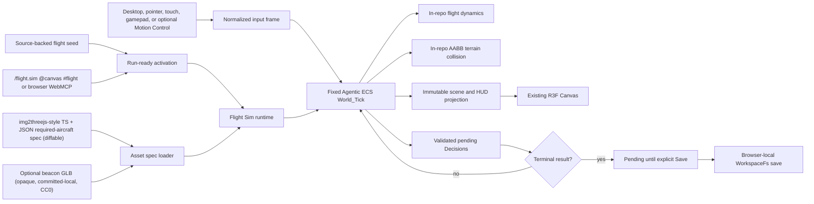

# Knowgrph Game Flight Sim PRD/TAD

Governed by the same solo-dev AI-native orientation as the sibling `knowgrph-game-fps-prd-tad.md`: every decision is evaluated through the four compounding lenses (min-viable-max-value, TCO-zero, token economics, harness-first). Repository-owned focused and browser proof gates are registered and must bind the unchanged exact candidate at handoff. Protected integration, production, and Cloudflare deployment remain separate and unauthorized here.

## Status boundary

This extensioned `.md` PRD/TAD is a derived implementation/proof projection of the normative repository-tracked Kiro source of truth at `.kiro/specs/knowgrph-game-flight-sim`. The tracked package inventory and hashes are readiness-gated; any optional root-workspace Kiro copy must remain byte-identical and is not an independent authority. `canvas/src/features/game-flight-sim/`, its Flight Sim panel, strict invocation, two browser WebMCP tools, asset admission, and Decisions-only WorkspaceFs adapter are source-owned in Knowgrph. Local proof is not protected integration, production, or deployment proof; those states remain explicit below.

## Outcome

Knowgrph gains one browser-local FloatingPanel **Flight Sim** mode that runs a bounded single-player flight mission inside the existing React Three Fiber Canvas, over the same authored XR terrain catalog the physics playground already ships (procedural Singapore waterfront, airplane/helicopter subjects). It opens from a source-backed run-ready document, the shared XR surface catalog, browser WebMCP, or the strict `/flight.sim @canvas #flight` invocation. Desktop keyboard/pointer, mobile touch, standard gamepad, and optional Motion Control input arm one deterministic native Agentic ECS flight mission with in-repo flight dynamics, AABB terrain collision, a visible HUD, selectable camera source, and Decisions-only WorkspaceFs persistence.

Core gameplay requires no camera, account, passkey, model, remote asset, gameplay network call, or Cloudflare service. The required aircraft is admitted through an **img2threejs-style TypeScript module plus a small JSON scene spec** containing identity, procedural renderer shape, dimensions, collision size, color, and zero-call metadata. It is git-diffable, human-auditable, offline-loadable, rejects non-null `opaqueBinaryFallback`, and records a required-aircraft GLB fallback count of zero. The distinct optional beacon proves the Kiro opaque-fallback boundary with one self-contained, committed-local, CC0-1.0 GLB; remote references and missing/unreadable local bytes fail closed without a fetch. FlightGear and `Arnie016/flight-simulator-fable5` inform concepts only. The build fence detects named identity, path, content, binary/asset, and dependency contamination; a separate repository-authorship provenance attestation states that this implementation copies or derives no source from either reference. The scanner is not represented as a universal code-similarity proof.

## Product Requirements

### Problem

Knowgrph has a native Three.js renderer, a deterministic Agentic ECS, a procedural XR terrain catalog with airplane/helicopter subjects, and browser-local Source Files persistence — but no bounded flight loop proving those owners compose into a playable simulator, and no disciplined, git-diffable admission contract for the Must aircraft. A first increment must be playable offline without a second engine, a speculative AI stack, a network service, or an authentication flow, and must keep the aircraft as a small, reviewable, local artifact while inherited scene props remain owned by the shared XR source.

### Primary user

Mei is a mobile-first player who wants to open a source-backed browser workspace and fly a short mission immediately. Her completion signal is a playable first frame with no sign-in, camera request, or gameplay network dependency, followed by an explicit local Save of validated mission Decisions.

A secondary user, the solo maintainer, wants the Must aircraft to use a small, diffable TypeScript + JSON spec that reviews cleanly in a pull request and loads offline, keeping asset TCO and audit cost near zero.

### Primary journey

| Stage | Player action | Runtime owner | Durable effect |
|---|---|---|---|
| Enter | Apply the source-backed flight seed or invoke `/flight.sim @canvas #flight operation=open` | Run-ready activation | Flight Sim mounts on the shared XR Canvas |
| Launch | Start and take off with keyboard/pointer/touch/gamepad (optional Motion Control) | Deterministic Agentic ECS `World_Tick` | Airborne aircraft under in-repo flight dynamics |
| Fly | Pitch, roll, yaw, throttle; pass waypoints; observe HUD | Flight systems + camera source | Waypoint/altitude/attitude state |
| Complete | Capture exactly three ordered waypoints, then the marked landing pad | Objective evaluator | Terminal result pending explicit Save |
| Save | Explicitly Save | WorkspaceFs Decision adapter | Decisions-only KGC `@node` write |
| Return | Reopen the same browser workspace | Hydration/resume adapter | Reconstructed mission progress |

### Must scope

- One selected authored XR terrain/environment and collider profile from the existing local catalog; Flight Sim owns no replacement environment, manifest, R2, CDN, or runtime asset download.
- One local single-player flight mission: one flyable aircraft, exactly three ordered 50 m-radius waypoints followed by one marked 50 m-radius landing pad, and one retry/reset path. Entering a later objective early does not advance progress.
- One FloatingPanel Flight Sim lifecycle: `open`, `start`, `stop`, `restart`, `throttle`, `save`, and `exit`.
- Desktop keyboard/pointer, mobile touch, and standard gamepad controls, plus optional reuse of the existing Motion Control pose adapter (input only, never the flight policy).
- One exact `1 / 60` second (approximately 16.667 ms) fixed-step deterministic simulation using the native Agentic ECS with ephemeral runtime state, no more than five catch-up ticks per rendered frame, canonical replay comparison, and explicit divergence failure.
- In-repo flight dynamics (thrust, pitch/roll/yaw, lift/drag/gravity approximation) and axis-aligned bounding-box terrain/collision — no external physics engine.
- One img2threejs-style, diffable TypeScript + JSON required-aircraft spec that resolves the existing procedural airplane renderer; non-null aircraft fallback metadata fails closed and the required-aircraft fallback count is zero.
- One optional beacon fallback admitted only from the committed local `optional-beacon.glb`, recorded as opaque with CC0-1.0 license and exact SHA-256 `be41f87bb745ba35c439336d932dd69c34223d26e117443a3c8556e44fce70cd`; remote, missing, unreadable, malformed, or hash-drifted data fails closed.
- A HUD that reports airspeed, altitude, heading/attitude, throttle, waypoint/objective state, save state, and explicit errors.
- Browser-local, Decisions-only KGC persistence through an explicit, idempotent Save; terminal results remain pending until that action succeeds.
- Strict native `/flight.sim @canvas #flight` invocation with typed `errorCode` plus offending `field`/`token` diagnostics, and browser-local `knowgrph.inspect_local_flight_sim` / `knowgrph.control_local_flight_sim` WebMCP with a 2,000 ms deadline and explicit timeout/unavailable results.
- Stop followed by Start resumes the exact in-memory tick and aircraft state; Restart is the explicit fresh-run action.
- Synchronous WebGL admission, one existing Canvas, XR pause/restore ownership, entry/restoration transaction failure reporting, Exit disposal of the ephemeral ECS World, and visible fail-closed runtime errors.
- Source-authored `run_ready_demo.id` activation through the known registry, independent of an imported path and fail-closed on identity conflict.

### Deferred scope

- WebAuthn/passkeys, identity, accounts, cloud sync, and cross-device saves.
- QR pairing, multiplayer, shared airspace, leaderboards, and matchmaking. Existing optional Motion Control keeps its explicit local camera boundary.
- Hosted or local LLMs, agent reasoning, narrative generation, model escalation, edge-ML policy models, ONNX Runtime, and token budgets.
- Rapier, Yuka, `behaviortree.js`, recastnavigation, bitECS, or another game/ECS/physics engine.
- Runtime image-to-3D generation, streaming asset generation, or any remote model call to produce assets during play.
- Any copy of, asset/binary from, or runtime/build dependency on FlightGear or `Arnie016/flight-simulator-fable5` (inspiration only).
- Remote assets, D1, R2, KV, Durable Objects, Workers, Pages, or production routes; automatic Git commits, pushes, pull requests, or deployments from the browser runtime.

### User stories

1. As Mei, I can start and fly the mission with no account, camera prompt, or network dependency.
2. As Mei, throttle, pitch, roll, yaw, and HUD feedback remain one coherent local loop.
3. As Mei, the same input sequence reproduces the same flight path.
4. As Mei, a malformed save is never silently replaced; I can inspect the error and explicitly reset it.
5. As Mei, explicitly saving a completed mission writes only validated Decisions to my browser-local workspace.
6. As the maintainer, the required aircraft is a small, diffable TypeScript + JSON spec, while any eligible optional opaque fallback is committed-local, licensed, hash-locked, and never fetched remotely.
7. As an operator or agent, I can inspect and control the same local Flight Sim through one strict invocation grammar and browser WebMCP contract.
8. As a maintainer, I can prove the core runtime is model-free, adds no runtime package, remains deterministic, and is Dev-only.

### Acceptance criteria

#### AC-1: open and fly

Given a clean browser-local workspace, when the flight seed is applied, then the bounded mission reaches a playable airborne-capable frame within 3 seconds in the canonical authored XR scene without sign-in, camera permission, passkey API access, remote asset fetch, or Cloudflare request.

#### AC-2: deterministic mission

Given the same mission seed and normalized input frames, when two fresh runtimes advance on the exact `1 / 60` second step with at most five catch-up ticks per rendered frame, then aircraft state, flight dynamics integration, collision, waypoint/objective progress, Decisions, and HUD projection are byte-equivalent after canonical serialization. Replay validates schema, source key, seed, input count/order, and canonical capture bytes; it stops at the last matching tick with `FLIGHT_SIM_REPLAY_DIVERGENCE` rather than adopting a divergent candidate.

#### AC-3: in-repo flight dynamics and terrain collision

Given control input, when a tick advances, then in-repo flight integration updates attitude and velocity within bounded stable limits, and the AABB resolver returns a bounded non-penetrating position with at least `0.001` mission-meter separation against the authored terrain slabs, zeroes normal velocity within `0.0001` m/s, and preserves tangential velocity — without a second renderer, physics engine, or floating dependency fallback.

#### AC-4: primary aircraft spec and optional committed-local GLB boundary

Given the required aircraft, when its spec is admitted, then its exact TypeScript + JSON fields resolve the canonical in-repo procedural airplane renderer and its GLB fallback count remains zero. A non-null `opaqueBinaryFallback`, unknown field, or mismatched scene-library identity fails closed. Given the optional beacon has no spec, the loader may admit only the hash-locked committed-local opaque GLB and reports a total fallback count of one; a remote URL is rejected without fetch, while a missing, unreadable, malformed, unlicensed, or hash-drifted local fallback leaves that subject unloaded and excluded from the count. No image-to-3D model, asset-network fetch, or Cloudflare resource is invoked.

> **VCC translation** (AC-4): `Verify the required aircraft resolves through the committed TypeScript+JSON spec with opaqueBinaryFallback null and aircraft fallback count 0; verify the optional beacon is the one committed-local CC0 GLB with the declared SHA-256, total eligible fallback count 1, and remote/missing/unreadable cases fail closed without a fetch or model call.`

#### AC-5: canonical zero cost

Given a successful flight `World_Tick`, when no reasoning request exists, then it returns exactly one canonical zero Cost_Log (`model: "none"`, all token fields `0`, `estimated_cost_usd: 0`, `incomplete: false`). If inference is attempted, the harness blocks the executor, preserves mission state, emits no gameplay Decision, and returns exactly one record with `model: "none"`, token fields `"unknown"`, `estimated_cost_usd: 0`, `incomplete: true`, and `error: "blocked_inference"`.

#### AC-6: decision-only local save

Given mission completion, when Mei explicitly selects **Save** and persistence succeeds, then browser-local WorkspaceFs contains only canonical `EcsDecision` additions using the supported `dialogue_outcome`, `quest_flag`, or `world_tick_result` types. Component arrays, world snapshots, cost logs, credentials, and raw input history are not written.

#### AC-7: fail-closed hydration and retry

Given no save document, the runtime may create a fresh mission. Given an existing malformed KGC save, hydration blocks before a World is created, names the unreadable local path, preserves the original bytes, and exposes an explicit **Reset local save** action. Given a write failure, pending Decisions remain in memory, prior bytes are unchanged, and the HUD exposes **Retry save**. No silent drop, fabricated success, or automatic reset is allowed.

#### AC-8: strict invocation and browser WebMCP

Given an invocation, exactly one `/flight.sim`, one `@canvas`, and one `#flight` token is accepted. Missing/mismatched/duplicate sigils, malformed or duplicate pairs, unknown keys, mixed structured/native input, invalid throttle, and unsupported lifecycle operations fail closed with stable `errorCode` and applicable `field`/`token` diagnostics. Browser agent-ready registration exposes only `knowgrph.inspect_local_flight_sim` and `knowgrph.control_local_flight_sim` for this surface; each completes or returns `FLIGHT_SIM_WEB_MCP_TIMEOUT` within 2,000 ms, and inactive inspection returns `FLIGHT_SIM_STATE_UNAVAILABLE` without mutation. It adds no stdio tool, HTTP mutation route, remote gateway, or deployment authority. The private Agentic ECS stdio lane remains exactly three tools.

#### AC-9: shared Canvas and XR ownership

Given a running XR surface, entering Flight Sim keeps the authored atmosphere, terrain, and scene graph visibly mounted inside the same Canvas and overlays the aircraft and waypoint/objective actors plus the HUD. No fallback scene, second renderer, alternate rendered XR world, renderer branch, or Flight-owned camera is introduced. The shared Camera catalog supplies exactly `fixed-follow` / `free-orbit`, the canonical Physics-controller camera hook consumes the pure aircraft follow/framing descriptor and alone mutates the camera and OrbitControls, and Timeline camera-marks may temporarily take framing ownership before returning to the last selected option; immersive first-person entry is not required to fly.

#### AC-10: synchronous admission and resumable lifecycle

WebGL support is resolved synchronously before mission start; unsupported WebGL or unreadable Decisions keeps the mission stopped with a local error. Start prepares a healthy ready frame at tick zero and waits for normalized desktop, pointer, touch, gamepad, Motion Control, or MCP input before fixed ticks begin. Blur and document hide always pause the clock without changing state. Fixed-follow pointer release pauses; free-orbit exits pointer lock without pausing. Stop then Start resumes the exact in-memory mission; malformed hydration blocks Start and Restart until **Reset local save** succeeds. Entry failure restores the previously captured surface/controller state without presenting an active Flight surface; restoration failure is reported and never presented as successful. Exit disposes the Flight mission’s ECS World, clears pending ephemeral run state, and restores prior ownership.

### Success metrics

| Metric | Must target |
|---|---|
| First value | Playable airborne-capable first frame from the source-backed demo within 3 seconds |
| Deterministic replay | Two identical input traces yield identical canonical results |
| Runtime model calls | 0 (including 0 runtime image-to-3D asset calls) |
| Gameplay network calls | 0 required |
| Token and inference cost | 0 tokens; USD 0 |
| Asset admission | Required aircraft is TypeScript+JSON with fallback count 0; the optional beacon is one committed-local opaque CC0 GLB, so the eligible mixed load reports total fallback count 1 |
| Persistent data | Validated Decisions only |
| New runtime dependencies | 0 |
| Production mutation | 0 |

## Technical Architecture

### Four-lens overview

| Lens | Applied constraint (this module) | Key decision |
|---|---|---|
| **Min-viable-max-value** | One flyable aircraft, exactly three ordered waypoints followed by one landing pad, reusing the existing Canvas, ECS, terrain catalog, and camera source | No new engine; add only flight systems and the bounded asset-admission owner |
| **TCO-zero** | The required aircraft is a small, diffable TS+JSON spec; the optional beacon fallback is a 724-byte, self-contained, generated-local CC0 GLB; zero infrastructure and egress | Text-first admission plus one hash-locked local fallback keeps storage, review, and egress cost near zero |
| **Token economics** | The flight `World_Tick` performs zero model calls; asset generation is offline, not a runtime path | Every tick emits a canonical `$0` Cost_Log; no runtime image-to-3D call |
| **Harness-first** | No ad-hoc model calls; deterministic flight systems in-tick; any future narrative reuses the existing kernel offline | Flight dynamics and NPC/traffic (if added later) stay deterministic, not LLM-driven |

### Implemented ownership

| Concern | Canonical owner | Rule |
|---|---|---|
| Flight domain | `canvas/src/features/game-flight-sim/` | Mission config, flight systems, input normalization, HUD projection, local save adapter |
| Surface lifecycle | `canvas/src/features/game-flight-sim/flightSimRuntime.ts` | Own open/start/stop/restart/throttle/save/exit state and previous-surface restoration |
| Invocation/WebMCP | `canvas/src/features/game-flight-sim/flightSimMcpRuntime.ts` plus browser agent-ready registration | Enforce the strict native tuple and browser-local inspect/control schema |
| Entity simulation | `ecs/` | Reuse the native Agentic ECS API and its transactional `worldTick`; ephemeral runtime state |
| Flight dynamics & collision | `canvas/src/features/game-flight-sim/flightModel.ts` | In-repo deterministic integration and AABB terrain resolution; no external physics engine |
| Asset representation | `canvas/src/features/game-flight-sim/assetSpec/` and `scripts/generate-game-flight-sim-optional-prop-glb.mjs` | Prefer/validate the TypeScript+JSON required-aircraft spec; admit only the generated, hash-locked committed-local optional beacon GLB when no spec exists; reject remote/missing/unreadable fallback references |
| Rendering | `canvas/src/lib/three/ThreeGraph.impl.tsx` plus the canonical XR stage owners | Reuse the single React Three Fiber Canvas, authored XR world, Camera catalog, and Physics controller camera; add the aircraft and waypoint/objective actors plus the HUD |
| Camera/input arbitration | `xrNativeControllerCameraCatalog.ts`, `xrNativeControllerCameraRuntime.ts`, `useXrNativeControllerDemoCamera.ts`, Timeline camera-marks, and Motion Control adapter | Flight supplies a pure aircraft follow/framing descriptor; the shared Physics controller hook alone mutates the camera and OrbitControls for Fixed Follow / Free Orbit, Timeline playback may temporarily override it, and Motion Control contributes normalized input only |
| Browser persistence | `canvas/src/features/workspace-fs/` | Use WorkspaceFs and its existing source-file bridge; add no storage or Git owner |
| Cost truth | Agentic ECS `worldTick` post-systems harness plus `contracts/cost-log.schema.js` | Emit/validate one canonical zero record for a model-free tick or one `incomplete: true`, `error: "blocked_inference"` record for a blocked attempt |
| Activation | `docs/workspace-seeds/knowgrph-game-flight-sim-demo.md` with Physics as `shared_xr_scene.source_authority` | Source-backed run-ready activation; overlay-only world ownership |

### Runtime topology



No node in this topology is a model, remote service, Cloudflare resource, Git operation, deployment step, or runtime image-to-3D call. The asset loader reads only committed local files; the required aircraft never falls back to the optional beacon’s GLB path.

### Flight model

Flight dynamics are constant and source-controlled: throttle drives thrust; control input drives pitch/roll/yaw within bounded stable limits; lift, drag, and gravity are approximated deterministically. The simulation advances from normalized input frames on the exact `1 / 60` second step (approximately 16.667 ms), not raw DOM events, and the bounded accumulator executes no more than five catch-up ticks per rendered frame. This mathematically reconciles the Kiro shorthand “16 ms / 60 Hz”: `1 / 60` second is the normative source value because literal 16 ms would be 62.5 Hz.

Each sampled control field is normalized independently: `pitch`, `roll`, `yaw`, and per-tick `throttleDelta` use `[-1, 1]`, while aircraft throttle state and the explicit absolute throttle operation use `[0, 1]`. Finite outliers clamp, infinities map to signed bounds, and NaN reuses only the corresponding last valid input field while recording internal out-of-range metadata; integration then continues. With no input, every sampled field is zero, so aircraft throttle state is held. Simultaneous device conflicts select the candidate with the largest absolute magnitude on that field rather than summing values. Replay records contiguous normalized input frames and canonical captures; schema/source/seed/input mismatches fail before adoption, while a capture-byte mismatch returns the last matching mission with explicit divergence evidence.

### World_Tick ordering and Kiro structural reconciliation

The implemented ECS transaction contains four meaningful construction-time-ordered systems:

| Order | Transactional system | Committed responsibility |
|---|---|---|
| 1 | `InputIntegrationSystem` | Validate/normalize one `{ pitch, roll, yaw, throttleDelta }` frame, write tick/input components, and record internal out-of-range metadata |
| 2 | `FlightModelSystem` | Integrate deterministic thrust, attitude, lift, drag, and gravity |
| 3 | `CollisionResolverSystem` | Resolve swept/de-penetrating AABB contact against the authored profile |
| 4 | `ObjectiveSystem` | Advance only the next ordered objective and emit pending mission Decisions |

The native ECS journal commits systems in order; if system *k* fails, prior systems remain committed, the failing system is rolled back and identified by name/cause, and later systems do not execute. The tracked Kiro topology names the same four meaningful journaled systems: Cost_Log creation is owned by the Agentic ECS `worldTick` post-systems harness, and `captureFlightSimMission` produces the immutable renderer/HUD projection only after a committed tick. Neither post-step owner is represented as a transactional flight system.

### Collision

Terrain and obstacle collision uses the authored XR AABB slab catalog plus explicit perimeter and ceiling blockers. The resolver sweeps the previous-to-proposed aircraft cuboid against canonical blockers, chooses the earliest hit with stable blocker-ID tie-breaking, and returns at least `0.001` mission-meter separation. It zeroes velocity along the hit normal within `0.0001` m/s while preserving tangential velocity; a start-overlap de-penetrates along the shallowest axis. There are no mesh colliders, navmesh, or generated collision geometry.

### Mission coordinate system

The shared Physics playground remains the sole authored XR scene owner. Flight maps its compact authored coordinates into mission meters with the source-controlled transform `20 m / authored world unit` and identifies the profile with `flight-meters-20`. Perimeter, authored colliders, ground, boundaries, ceiling, spawn, exactly three route waypoints, and the landing pad are transformed once into mission meters. Only the Flight overlay and shared camera descriptor apply the inverse render scale; Physics/Game FPS coordinates and the authored scene stay unchanged. This prevents a 50 m capture radius from collapsing the compact scene into an immediate tick-zero objective completion.

### Asset admission (required TS+JSON primary plus optional committed-local GLB)

The asset contract has two deliberately separate implemented paths:

1. **Implemented — img2threejs-style TypeScript + JSON admission spec.** `vehicle-airplane.scene.json` contains bounded identity, renderer/shape, dimensions, collision size, color, and zero-call metadata. The TypeScript owner validates exact fields and canonical scene-library parity before resolving the existing procedural airplane renderer. The text artifacts are committed, reviewable, deterministic, and offline.
2. **Implemented — optional beacon committed-local GLB fallback.** `assetSpec/fallbacks/optional-beacon.glb` is a 724-byte self-contained GLB 2.0 generated from repository-owned offline geometry, licensed CC0-1.0, declared opaque, and locked to SHA-256 `be41f87bb745ba35c439336d932dd69c34223d26e117443a3c8556e44fce70cd`. It is eligible only when that optional subject has no `Asset_Spec`; the loader prefers a valid spec when both exist. Remote URLs are rejected without fetch, and missing/unreadable/malformed/hash-drifted local bytes produce a local error and do not increment the fallback count.

The required aircraft therefore retains fallback count zero, while the admitted mixed required-aircraft + optional-beacon load reports one fallback. Readiness gates require all text asset sources to be tracked regular non-symlink UTF-8 files no larger than 1 MB, require exact generated GLB bytes/path/hash/license, and lock the four direct external imports to an audited 21-package runtime dependency closure with the declared MIT/ISC/BSD licenses. The feature adds no new runtime package. The implemented paths invoke no image-to-3D model, network fetch, or Cloudflare resource.

The build begins with a bounded scan over every tracked repository file and fails on named FlightGear or `Arnie016/flight-simulator-fable5`/Fable identity, content marker, binary/asset, path, or declared-dependency contamination. A repository-authorship provenance attestation separately declares that those projects remain inspiration only and that this implementation copies or derives none of their source and takes no dependency on either. The scanner does not claim to prove the absence of arbitrary derived code.

### Persistence and resume

The local save path is owned by the flight adapter under WorkspaceFs. A terminal result leaves canonical Decisions pending; only explicit **Save** merges gameplay Decisions idempotently by `decisionId`. Admission accepts the three canonical types `dialogue_outcome`, `quest_flag`, and `world_tick_result`; generic `dialogue_outcome` records persist but do not fabricate mission replay progress. Existing authored bytes remain untouched except for supported KGC Decision insertion. Resume derives mission progress, the validated active run identifier, and ordered waypoint history from the Decision index before the first tick; Start continues that hydrated run, and only explicit Restart mints a fresh run. Malformed existing KGC is not equivalent to an absent save: the runtime reports the precise local path and error, creates no partial World, and waits for explicit Reset, which is a separate recovery write of the canonical empty KGC document.

### Error model

| Failure | Required result |
|---|---|
| Invalid mission/flight config | Block activation with a typed local error |
| Invalid input value | Reject or normalize to a bounded neutral value before tick |
| Tick/system failure | Preserve prior system commits, roll back/name the failing system, skip later systems and post-commit projection, expose failure, and do not claim a successful frame |
| Blocked inference attempt | Preserve the original mission, execute no inference, emit no gameplay Decision, and return one `incomplete: true`, `error: "blocked_inference"` Cost_Log |
| Missing/invalid required-aircraft spec or non-null aircraft fallback metadata | Fail closed with a local error naming the asset; never fetch remotely, select the optional binary fallback, or call a model |
| Remote/missing/unreadable optional GLB | Reject a remote URL before fetch; otherwise leave the optional subject unloaded, exclude it from the fallback count, and surface a local error |
| Malformed existing save | Preserve bytes, block hydration, expose explicit reset |
| Local write failure | Preserve prior bytes and pending Decisions, expose retry |
| WebGL unavailable | Fail the synchronous admission probe, keep the mission stopped, show a local unsupported state without a remote or second renderer |
| Surface entry failure | Dispose any provisional mission, restore the captured Canvas/controller ownership, and report a local entry error |
| Surface restoration failure | Report the failed owner restoration and never return a successful Exit result |
| WebMCP deadline or inactive inspection | Return `FLIGHT_SIM_WEB_MCP_TIMEOUT` by 2,000 ms or `FLIGHT_SIM_STATE_UNAVAILABLE`; leave mission state unchanged |

## Architecture Decisions

### ADR-1: Reuse the existing renderer and native ECS

**Status:** Accepted for this increment.

Flight Sim mounts a dedicated stage inside the existing `ThreeGraph` React Three Fiber Canvas and uses the native Agentic ECS for ephemeral runtime state. A second renderer, second camera owner, bitECS, Babylon.js, or another ECS is rejected because it duplicates an existing repository owner.

### ADR-2: Own minimal flight dynamics and collision in-repo

**Status:** Accepted for this increment.

The bounded mission needs only deterministic flight integration and AABB terrain collision, so those functions remain in the flight feature cluster consuming the shared authored XR collider profile. Rapier, mesh physics, and general aerodynamics solvers are not installed or claimed.

### ADR-3: Deterministic flight and (future) traffic, not LLM-driven

**Status:** Accepted for this increment.

Flight control and any future ambient traffic use deterministic rules and stable tie-breaking. Hosted/local LLMs and edge-ML policies are rejected for the Must scope; they add weight without improving the bounded mission acceptance criteria and would threaten deterministic replay (AC-2).

### ADR-4: TypeScript + JSON required-aircraft primary; one optional local GLB fallback

**Status:** Accepted for this increment.

The required aircraft is represented by one **img2threejs-style, diffable TypeScript + JSON scene spec** that resolves the canonical procedural airplane renderer and rejects opaque fallback metadata. Separately, the optional beacon exercises the Kiro opaque-fallback contract with one committed-local, generated, licensed, hash-locked GLB. The two subjects do not share fallback eligibility.

**Alternatives considered:**
1. GLB-only output as the required-aircraft primary: opaque, non-diffable, larger, and harder to audit or edit — rejected because it violates the diffability/TCO-zero lens.
2. Runtime image-to-3D generation: rejected — reintroduces a model call, network, latency, and cost on the hot path, and breaks offline-first.
3. **Chosen — TS+JSON required aircraft plus a confined optional GLB**: the primary remains small, diffable, git-friendly, offline editable text with aircraft fallback count zero; the optional beacon proves local opaque fallback/rejection behavior without becoming a required gameplay asset.

**Rationale:** a text spec is the git-diffable, low-TCO, auditable representation for the required aircraft. A tiny deterministic local GLB is sufficient to exercise the separately required opaque-fallback boundary while keeping the runtime model-free, network-free, licensed, reproducible, and evidence-backed (AC-4, AC-5).

**Consequences:**
- **Positive:** diffable/auditable required asset, deterministic optional fallback, offline loading, explicit remote/missing rejection, and no runtime model/network dependency.
- **Negative:** the optional GLB is opaque and therefore requires generator, byte, hash, license, path, and dependency-closure gates.
- **Neutral:** FlightGear and `Arnie016/flight-simulator-fable5` remain inspiration only; the required aircraft fallback count is zero and the admitted mixed-load total is one.

### ADR-5: Persist Decisions through browser-local WorkspaceFs; Dev-only readiness

**Status:** Accepted for this increment.

The runtime writes canonical KGC Decisions through the existing browser-local filesystem owner; component state and raw World snapshots remain ephemeral. Runtime readiness means focused source proof plus a local browser smoke bound to an exact commit; production and Cloudflare lanes require a separate operator-authorized release workflow. No automatic Git commit is performed or implied.

## Runtime Readiness Gate

The repository registers finite local proof commands. Final handoff requires both commands on one clean exact HEAD. Each command clones that exact candidate into a child-owned local verification workspace with copy-on-write dependency bytes, so tracked or untracked verifier mutations are named and discarded without touching the caller checkout. The browser wrapper rejects a responsive pre-existing server, starts two fresh serial servers, and binds each evidence record to the candidate branch, HEAD, tree, runtime revision, authored source path, and seed SHA-256. Browser evidence is staged separately, the child workspace must clean up successfully before publication, and a publication failure restores every prior evidence byte:

```bash
npm run game-flight-sim:runtime-ready
npm run game-flight-sim:browser-smoke
```

| Evidence | Result | Boundary |
|---|---|---|
| `node scripts/check-game-flight-sim-readiness.mjs` | Mandatory exact-candidate gate | Tracked Kiro authority, source contract, canonical Cost_Log, exact `1/60`, system topology, lifecycle/persistence, asset UTF-8/size/hash/license and 21-package closure, 45-property/4,500-case registration, bounded named-contamination scan, and provenance attestation |
| `npm -C canvas run test:smoke:game-flight-sim:source` | Mandatory exact-candidate gate | Focused source suite, including 45 uniquely named fast-check properties at at least 100 runs each (4,500 generated cases) |
| `npx tsc -b --noEmit` from `canvas/` | Mandatory exact-candidate gate | Focused TypeScript project proof |
| `npm run game-flight-sim:runtime-ready` | Mandatory final aggregate | Child-isolated `smoke:prepare`, readiness authority, full ECS tests, focused source suite, crafted negative gates, failure/no-mutation orchestration contracts, Canvas check, and production build |
| `npm run game-flight-sim:browser-smoke` | Mandatory two-run exact-HEAD proof | Child-isolated retained authored XR Canvas, first frame under 3 s, desktop/WebMCP input, trusted Chromium-emulated touch at 375x812, ordered three-waypoint plus landing-pad completion through public production runtime APIs, lifecycle/failure/Exit disposal, fixed-follow/free-orbit plus Timeline round-trip, zero blocked/non-local requests, and cleanup-before-transactional-evidence publication |
| `data/outputs/game-flight-sim-browser-smoke*.{json,png}` | Ignored local artifacts | Exact branch/HEAD/tree/source evidence only; not source, integration, or release artifacts |
| Protected PR `#369` | Pending | No protected integration claim |
| Agentic workspace-seed projection | Absent | Release-gated until a separate authorized change |
| Production / Cloudflare | Not authorized | No deployment or remote storage mutation |

Each `knowgrph-flight-sim-browser-run/v3` record carries `runIndex` 1/2 or 2/2, exact candidate/source identity, first-frame timing, trusted Chromium-emulated touch provenance, ordered route transitions and terminal Decision, camera ownership, lifecycle/failure evidence, and network/error inventories. The aggregate v3 record requires both runs to share the same identity. Native Pointer Lock is attempted first; only the exact automation-host `WrongDocumentError` may activate the browser-interface contract harness, while production code retains native request and rejection diagnostics. The final handoff reports the exact evidence-bound SHA and source hash without embedding a self-invalidating commit hash in this tracked document.

Both commands are finite and local apart from ordinary build/test artifacts, access no paid model or runtime image-to-3D service, and do not deploy or mutate Cloudflare. The physics-playground seed (`docs/workspace-seeds/knowgrph-physics-playground-demo.md`) is the canonical shared XR source authority: it provides the shared Canvas, procedural Singapore terrain, selectable airplane/helicopter subjects, the Physics-controller camera with exactly fixed-follow/free-orbit, Motion Control boundary, and `/ @ #` MCP grammar.

## Agent-Platform Readiness

| Dimension | Scope |
|---|---|
| Agentic OS-ready | `/flight.sim @canvas #flight` uses direct command/binding/semantic metadata; the separate Agentic workspace-seed projection remains release-gated and absent. |
| AI Agent-ready | Browser agent-ready registration exposes read-only inspection and explicit lifecycle control without a model, prompt, reasoning path, or autonomous persistence. |
| MCP-ready | Exactly `knowgrph.inspect_local_flight_sim` and `knowgrph.control_local_flight_sim` are browser-local WebMCP tools with a 2,000 ms deadline, explicit timeout/unavailable results, and no stdio, HTTP mutation route, remote gateway, or deployment authority. |

## Release Boundary

This module is implementation-ready; its runtime-ready claim is established only by the externally reported exact-HEAD handoff proof, and protected integration remains pending. No Pages build upload, Worker deployment, D1/R2/KV/DO mutation, production route change, merge, or release claim belongs to this scope. The optional opaque fallback is a committed-local runtime input, not an asset-generation service or deployment dependency. A future release must begin from a protected integrated SHA and explicit operator authorization.
