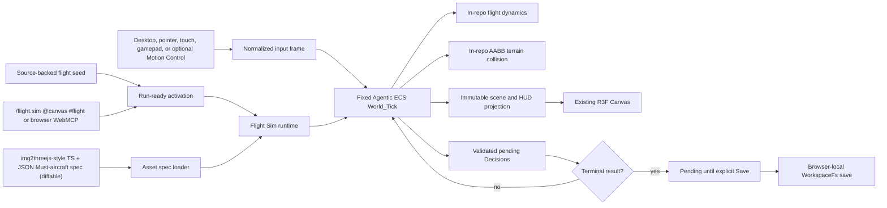

# Knowgrph Game Flight Sim PRD/TAD

Governed by the same solo-dev AI-native orientation as the sibling `knowgrph-game-fps-prd-tad.md`: every decision is evaluated through the four compounding lenses (min-viable-max-value, TCO-zero, token economics, harness-first). The local runtime-ready candidate has repository-owned focused and browser proof. Protected integration, production, and Cloudflare deployment remain separate and unauthorized here.

## Status boundary

This PRD/TAD is the normative contract and implementation map for the local runtime-ready Flight Sim candidate. `canvas/src/features/game-flight-sim/`, its Flight Sim panel, strict invocation, two browser WebMCP tools, Must-aircraft spec admission, and Decisions-only WorkspaceFs adapter are source-owned in Knowgrph. Local proof is not protected integration, production, or deployment proof; those states remain explicit below.

## Outcome

Knowgrph gains one browser-local FloatingPanel **Flight Sim** mode that runs a bounded single-player flight mission inside the existing React Three Fiber Canvas, over the same authored XR terrain catalog the physics playground already ships (procedural Singapore waterfront, airplane/helicopter subjects). It opens from a source-backed run-ready document, the shared XR surface catalog, browser WebMCP, or the strict `/flight.sim @canvas #flight` invocation. Desktop keyboard/pointer, mobile touch, standard gamepad, and optional Motion Control input arm one deterministic native Agentic ECS flight mission with in-repo flight dynamics, AABB terrain collision, a visible HUD, selectable camera source, and Decisions-only WorkspaceFs persistence.

Core gameplay requires no camera, account, passkey, model, remote asset, gameplay network call, or Cloudflare service. The Must aircraft is admitted through an **img2threejs-style TypeScript module plus a small JSON scene spec** containing identity, procedural renderer shape, dimensions, collision size, color, and zero-call metadata. It is git-diffable, human-auditable, and offline-loadable. This increment rejects non-null opaque-binary fallback metadata, contains no Flight Sim GLB, and records a fallback count of zero. A future local GLB exception would require separate admission, implementation, and proof. The effect and feature framing are inspired by `Arnie016/flight-simulator-fable5`, but this module copies none of its source and takes no dependency on it.

## Product Requirements

### Problem

Knowgrph has a native Three.js renderer, a deterministic Agentic ECS, a procedural XR terrain catalog with airplane/helicopter subjects, and browser-local Source Files persistence — but no bounded flight loop proving those owners compose into a playable simulator, and no disciplined, git-diffable admission contract for the Must aircraft. A first increment must be playable offline without a second engine, a speculative AI stack, a network service, or an authentication flow, and must keep the aircraft as a small, reviewable, local artifact while inherited scene props remain owned by the shared XR source.

### Primary user

Mei is a mobile-first player who wants to open a source-backed browser workspace and fly a short mission immediately. Her completion signal is a playable first frame with no sign-in, camera request, or gameplay network dependency, followed by an explicit local Save of validated mission Decisions.

A secondary user, the solo maintainer, wants the Must aircraft to use a small, diffable TypeScript + JSON spec that reviews cleanly in a pull request and loads offline, keeping asset TCO and audit cost near zero.

### Primary journey

| Stage | Player action | Runtime owner | Durable effect |
|---|---|---|---|
| Enter | Apply the source-backed flight seed or invoke `/flight.sim @canvas #flight operation=open` | Run-ready activation | Flight Sim mounts on the shared XR Canvas |
| Launch | Start and take off with keyboard/pointer/touch/gamepad (optional Motion Control) | Deterministic Agentic ECS `World_Tick` | Airborne aircraft under in-repo flight dynamics |
| Fly | Pitch, roll, yaw, throttle; pass waypoints; observe HUD | Flight systems + camera source | Waypoint/altitude/attitude state |
| Complete | Reach the final point in the ordered three-waypoint route | Objective evaluator | Terminal result pending explicit Save |
| Save | Explicitly Save | WorkspaceFs Decision adapter | Decisions-only KGC `@node` write |
| Return | Reopen the same browser workspace | Hydration/resume adapter | Reconstructed mission progress |

### Must scope

- One selected authored XR terrain/environment and collider profile from the existing local catalog; Flight Sim owns no replacement environment, manifest, R2, CDN, or runtime asset download.
- One local single-player flight mission: one flyable aircraft, one ordered three-waypoint route, and one retry/reset path.
- One FloatingPanel Flight Sim lifecycle: `open`, `start`, `stop`, `restart`, `throttle`, `save`, and `exit`.
- Desktop keyboard/pointer, mobile touch, and standard gamepad controls, plus optional reuse of the existing Motion Control pose adapter (input only, never the flight policy).
- One fixed-step deterministic simulation using the native Agentic ECS with ephemeral runtime state.
- In-repo flight dynamics (thrust, pitch/roll/yaw, lift/drag/gravity approximation) and axis-aligned bounding-box terrain/collision — no external physics engine.
- One img2threejs-style, diffable TypeScript + JSON Must-aircraft spec that resolves the existing procedural airplane renderer; non-null opaque fallback metadata fails closed and the current GLB fallback count is zero.
- A HUD that reports airspeed, altitude, heading/attitude, throttle, waypoint/objective state, save state, and explicit errors.
- Browser-local, Decisions-only KGC persistence through an explicit, idempotent Save; terminal results remain pending until that action succeeds.
- Strict native `/flight.sim @canvas #flight` invocation and browser-local `knowgrph.inspect_local_flight_sim` / `knowgrph.control_local_flight_sim` WebMCP.
- Stop followed by Start resumes the exact in-memory tick and aircraft state; Restart is the explicit fresh-run action.
- Synchronous WebGL admission, one existing Canvas, XR pause/restore ownership, and visible fail-closed runtime errors.
- Source-authored `run_ready_demo.id` activation through the known registry, independent of an imported path and fail-closed on identity conflict.

### Deferred scope

- WebAuthn/passkeys, identity, accounts, cloud sync, and cross-device saves.
- QR pairing, multiplayer, shared airspace, leaderboards, and matchmaking. Existing optional Motion Control keeps its explicit local camera boundary.
- Hosted or local LLMs, agent reasoning, narrative generation, model escalation, edge-ML policy models, ONNX Runtime, and token budgets.
- Rapier, Yuka, `behaviortree.js`, recastnavigation, bitECS, or another game/ECS/physics engine.
- Runtime image-to-3D generation, streaming asset generation, or any remote model call to produce assets during play.
- Any copy of, or runtime/build dependency on, `Arnie016/flight-simulator-fable5` (inspiration only).
- Remote assets, D1, R2, KV, Durable Objects, Workers, Pages, or production routes; automatic Git commits, pushes, pull requests, or deployments from the browser runtime.

### User stories

1. As Mei, I can start and fly the mission with no account, camera prompt, or network dependency.
2. As Mei, throttle, pitch, roll, yaw, and HUD feedback remain one coherent local loop.
3. As Mei, the same input sequence reproduces the same flight path.
4. As Mei, a malformed save is never silently replaced; I can inspect the error and explicitly reset it.
5. As Mei, explicitly saving a completed mission writes only validated Decisions to my browser-local workspace.
6. As the maintainer, the Must aircraft is a small, diffable TypeScript + JSON spec that reviews cleanly, loads offline, and rejects opaque fallback metadata.
7. As an operator or agent, I can inspect and control the same local Flight Sim through one strict invocation grammar and browser WebMCP contract.
8. As a maintainer, I can prove the core runtime is model-free, dependency-free, deterministic, and Dev-only.

### Acceptance criteria

#### AC-1: open and fly

Given a clean browser-local workspace, when the flight seed is applied, then the bounded mission reaches a playable airborne-capable frame in the canonical authored XR scene without sign-in, camera permission, passkey API access, remote asset fetch, or Cloudflare request.

#### AC-2: deterministic mission

Given the same mission seed and normalized input frames, when two fresh runtimes advance the same fixed number of ticks, then aircraft state, flight dynamics integration, collision, waypoint/objective progress, Decisions, and HUD projection are byte-equivalent after canonical serialization.

#### AC-3: in-repo flight dynamics and terrain collision

Given control input, when a tick advances, then in-repo flight integration updates attitude and velocity within bounded stable limits, and the AABB resolver returns a bounded non-penetrating position against the authored terrain slabs — without a second renderer, physics engine, or floating dependency fallback.

#### AC-4: Must-aircraft spec and zero opaque fallback

Given the Must aircraft, when its spec is admitted, then its exact TypeScript + JSON fields resolve the canonical in-repo procedural airplane renderer. A non-null `opaqueBinaryFallback`, a Flight Sim `.glb`, an unknown field, or mismatched scene-library identity fails closed. No image-to-3D model, network fetch, or Cloudflare resource is invoked at runtime to obtain the aircraft.

> **VCC translation** (AC-4): `Verify the Must aircraft resolves through the committed TypeScript+JSON spec, opaqueBinaryFallback is null, the Flight feature contains no .glb, fallback count is zero, and source scans find no runtime model or network asset call.`

#### AC-5: canonical zero cost

Given a successful flight `World_Tick`, when no reasoning request exists, then it returns exactly one canonical zero Cost_Log (`model: "none"`, all token fields `0`, `estimated_cost_usd: 0`, `incomplete: false`). No token ceiling, escalation, retry, fallback model, or synthetic non-zero cost record exists in this increment.

#### AC-6: decision-only local save

Given mission completion, when Mei explicitly selects **Save** and persistence succeeds, then browser-local WorkspaceFs contains only canonical `EcsDecision` additions using the supported `dialogue_outcome`, `quest_flag`, or `world_tick_result` types. Component arrays, world snapshots, cost logs, credentials, and raw input history are not written.

#### AC-7: fail-closed hydration and retry

Given no save document, the runtime may create a fresh mission. Given an existing malformed KGC save, hydration blocks before a World is created, names the unreadable local path, preserves the original bytes, and exposes an explicit **Reset local save** action. Given a write failure, pending Decisions remain in memory, prior bytes are unchanged, and the HUD exposes **Retry save**. No silent drop, fabricated success, or automatic reset is allowed.

#### AC-8: strict invocation and browser WebMCP

Given an invocation, exactly one `/flight.sim`, one `@canvas`, and one `#flight` token is accepted. Duplicate sigils, unknown keys, mixed structured/native input, and invalid lifecycle operations fail closed. Browser agent-ready registration exposes only `knowgrph.inspect_local_flight_sim` and `knowgrph.control_local_flight_sim` for this surface; it adds no stdio tool, HTTP mutation route, remote gateway, or deployment authority. The private Agentic ECS stdio lane remains exactly three tools.

#### AC-9: shared Canvas and XR ownership

Given a running XR surface, entering Flight Sim keeps the authored atmosphere, terrain, and scene graph visibly mounted inside the same Canvas and overlays the aircraft and waypoint/objective actors plus the HUD. No fallback scene, second renderer, alternate rendered XR world, renderer branch, or Flight-owned camera is introduced. The shared Camera catalog supplies Fixed Follow / Free Orbit, the canonical Physics controller hook consumes the pure aircraft follow/framing descriptor and alone mutates the camera and OrbitControls, and Timeline camera-marks may temporarily take framing ownership; immersive first-person entry is not required to fly.

#### AC-10: synchronous admission and resumable lifecycle

WebGL support is resolved synchronously before mission start; unsupported WebGL or unreadable Decisions keeps the mission stopped with a local error. Start prepares a healthy ready frame at tick zero and waits for normalized desktop, pointer, touch, gamepad, Motion Control, or MCP input before fixed ticks begin. Blur and document hide always pause the clock without changing state. Fixed-follow pointer release pauses; free-orbit exits pointer lock without pausing. Stop then Start resumes the exact in-memory mission; malformed hydration blocks Start and Restart until **Reset local save** succeeds.

### Success metrics

| Metric | Must target |
|---|---|
| First value | Playable airborne-capable first frame from the source-backed demo |
| Deterministic replay | Two identical input traces yield identical canonical results |
| Runtime model calls | 0 (including 0 runtime image-to-3D asset calls) |
| Gameplay network calls | 0 required |
| Token and inference cost | 0 tokens; USD 0 |
| Asset diffability | The Must aircraft is TypeScript+JSON; opaque-binary fallback count is exactly 0 |
| Persistent data | Validated Decisions only |
| New runtime dependencies | 0 |
| Production mutation | 0 |

## Technical Architecture

### Four-lens overview

| Lens | Applied constraint (this module) | Key decision |
|---|---|---|
| **Min-viable-max-value** | One flyable aircraft, one ordered three-waypoint route, reusing the existing Canvas, ECS, terrain catalog, and camera source | No new engine; add only flight systems and one Must-aircraft spec admission owner |
| **TCO-zero** | The Must aircraft is a small, diffable TS+JSON spec committed in-repo; opaque fallback count is zero; zero infra, browser/local/offline | Text admission keeps asset storage, review, and egress cost near zero |
| **Token economics** | The flight `World_Tick` performs zero model calls; asset generation is offline, not a runtime path | Every tick emits a canonical `$0` Cost_Log; no runtime image-to-3D call |
| **Harness-first** | No ad-hoc model calls; deterministic flight systems in-tick; any future narrative reuses the existing kernel offline | Flight dynamics and NPC/traffic (if added later) stay deterministic, not LLM-driven |

### Implemented ownership

| Concern | Canonical owner | Rule |
|---|---|---|
| Flight domain | `canvas/src/features/game-flight-sim/` | Mission config, flight systems, input normalization, HUD projection, local save adapter |
| Surface lifecycle | `canvas/src/features/game-flight-sim/flightSimRuntime.ts` | Own open/start/stop/restart/throttle/save/exit state and previous-surface restoration |
| Invocation/WebMCP | `canvas/src/features/game-flight-sim/flightSimMcpRuntime.ts` plus browser agent-ready registration | Enforce the strict native tuple and browser-local inspect/control schema |
| Entity simulation | `ecs/` | Reuse the native Agentic ECS API and its transactional `worldTick`; ephemeral runtime state |
| Flight dynamics & collision | `canvas/src/features/game-flight-sim/flightModel.ts` | In-repo deterministic integration and AABB terrain resolution; no external physics engine |
| Asset representation | `canvas/src/features/game-flight-sim/assetSpec/` | Validate the current TypeScript+JSON aircraft spec, resolve the canonical procedural renderer, and reject non-null opaque fallback metadata |
| Rendering | `canvas/src/lib/three/ThreeGraph.impl.tsx` plus the canonical XR stage owners | Reuse the single React Three Fiber Canvas, authored XR world, Camera catalog, and Physics controller camera; add the aircraft and waypoint/objective actors plus the HUD |
| Camera/input arbitration | `xrNativeControllerCameraCatalog.ts`, `xrNativeControllerCameraRuntime.ts`, `useXrNativeControllerDemoCamera.ts`, Timeline camera-marks, and Motion Control adapter | Flight supplies a pure aircraft follow/framing descriptor; the shared Physics controller hook alone mutates the camera and OrbitControls for Fixed Follow / Free Orbit, Timeline playback may temporarily override it, and Motion Control contributes normalized input only |
| Browser persistence | `canvas/src/features/workspace-fs/` | Use WorkspaceFs and its existing source-file bridge; add no storage or Git owner |
| Cost truth | `contracts/cost-log.schema.js` | Accept only the canonical model-free zero record for the no-reasoning tick |
| Activation | `docs/workspace-seeds/knowgrph-game-flight-sim-demo.md` with Physics as `shared_xr_scene.source_authority` | Source-backed run-ready activation; overlay-only world ownership |

### Runtime topology



No node in this topology is a model, remote service, Cloudflare resource, Git operation, deployment step, or runtime image-to-3D call. The asset spec loader reads only committed local files.

### Flight model

Flight dynamics are constant and source-controlled: throttle drives thrust; control input drives pitch/roll/yaw within bounded stable limits; lift, drag, and gravity are approximated deterministically. The simulation advances from normalized input frames on a fixed timestep, not from DOM events; a bounded accumulator caps catch-up work so results never depend on display refresh rate. Rendering reads an immutable projection after a committed tick. Runtime component storage is ephemeral; only Decisions persist.

### Collision

Terrain and obstacle collision uses the authored XR AABB slab catalog plus explicit perimeter and ceiling blockers. The resolver sweeps the previous-to-proposed aircraft cuboid against canonical blockers, chooses the earliest hit with stable blocker-ID tie-breaking, backs off from impact, and zeros velocity along the hit normal. There are no mesh colliders, navmesh, or generated collision geometry.

### Asset admission (TypeScript + JSON Must scope; GLB policy deferred)

The Must-aircraft contract has one implemented path and one explicitly deferred policy:

1. **Implemented — img2threejs-style TypeScript + JSON admission spec.** `vehicle-airplane.scene.json` contains bounded identity, renderer/shape, dimensions, collision size, color, and zero-call metadata. The TypeScript owner validates exact fields and canonical scene-library parity before resolving the existing procedural airplane renderer. The text artifacts are committed, reviewable, deterministic, and offline.
2. **Deferred policy — local opaque GLB exception.** A future asset that cannot be represented by the text contract may propose a separately admitted local GLB. This increment has no Flight Sim GLB, GLB selection path, malformed-GLB recovery path, or TRELLIS artifact; non-null fallback metadata is rejected and the fallback count is zero.

The implemented path invokes no image-to-3D model, network fetch, or Cloudflare resource at runtime. Any future exception must preserve that boundary and obtain its own source and browser proof. The feature framing is inspired by `Arnie016/flight-simulator-fable5` but copies none of its source and takes no dependency on it.

### Persistence and resume

The local save path is owned by the flight adapter under WorkspaceFs. A terminal result leaves canonical Decisions pending; only explicit **Save** merges them idempotently by `decisionId`. Existing authored bytes remain untouched except for supported KGC Decision insertion. Resume derives mission progress from the validated Decision index before the first tick. Malformed existing KGC is not equivalent to an absent save: the runtime reports the precise local path and error, creates no partial World, and waits for explicit reset.

### Error model

| Failure | Required result |
|---|---|
| Invalid mission/flight config | Block activation with a typed local error |
| Invalid input value | Reject or normalize to a bounded neutral value before tick |
| Tick/system failure | Keep prior committed systems, expose failure, do not claim a successful frame |
| Missing/invalid Must-aircraft spec or non-null opaque fallback metadata | Fail closed with a local error naming the asset; never fetch remotely, select a binary fallback, or call a model |
| Malformed existing save | Preserve bytes, block hydration, expose explicit reset |
| Local write failure | Preserve prior bytes and pending Decisions, expose retry |
| WebGL unavailable | Fail the synchronous admission probe, keep the mission stopped, show a local unsupported state without a remote or second renderer |

## Architecture Decisions

### ADR-1: Reuse the existing renderer and native ECS

**Status:** Accepted for this increment.

Flight Sim mounts a dedicated stage inside the existing `ThreeGraph` React Three Fiber Canvas and uses the native Agentic ECS for ephemeral runtime state. A second renderer, second camera owner, bitECS, Babylon.js, or another ECS is rejected because it duplicates an existing repository owner.

### ADR-2: Own minimal flight dynamics and collision in-repo

**Status:** Accepted for this increment.

The bounded mission needs only deterministic flight integration and AABB terrain collision, so those functions remain in the flight feature cluster consuming the shared authored XR collider profile. Rapier, mesh physics, and general aerodynamics solvers are not installed or claimed.

### ADR-3: Deterministic flight and (future) traffic, not LLM-driven

**Status:** Accepted for this increment.

Flight control and any future ambient traffic use deterministic rules and stable tie-breaking. Hosted/local LLMs and edge-ML policies are rejected for the Must scope; they add weight without improving the bounded mission acceptance criteria and would threaten deterministic replay (AC-2).

### ADR-4: TypeScript + JSON Must-aircraft spec; opaque GLB policy deferred

**Status:** Accepted for this increment.

The Must aircraft is represented by one **img2threejs-style, diffable TypeScript + JSON scene spec** that resolves the canonical procedural airplane renderer. This increment rejects opaque fallback metadata and contains no Flight Sim GLB.

**Alternatives considered:**
1. GLB-only output as the primary: opaque, non-diffable, larger, and harder to audit or edit — rejected because it violates the diffability/TCO-zero lens.
2. Runtime image-to-3D generation: rejected — reintroduces a model call, network, latency, and cost on the hot path, and breaks offline-first.
3. **Chosen — TS+JSON-only Must scope**: small, diffable, git-friendly, offline, editable text with fallback count zero. A future local GLB exception is a separate decision, not an implemented branch.

**Rationale:** a text spec is the git-diffable, low-TCO, auditable representation that fits KGC's local-first ethos and keeps asset review cost near zero. Rejecting an unimplemented fallback keeps the current runtime model-free, network-free, and evidence-backed (AC-4, AC-5).

**Consequences:**
- **Positive:** diffable, auditable, editable, offline, TCO-near-zero assets; deterministic loading; no runtime model/network dependency.
- **Negative:** a future complex asset may need a separately scoped admission path; the current contract intentionally cannot load it.
- **Neutral:** `Arnie016/flight-simulator-fable5` remains inspiration only; the current opaque fallback count is zero.

### ADR-5: Persist Decisions through browser-local WorkspaceFs; Dev-only readiness

**Status:** Accepted for this increment.

The runtime writes canonical KGC Decisions through the existing browser-local filesystem owner; component state and raw World snapshots remain ephemeral. Runtime readiness means focused source proof plus a local browser smoke bound to an exact commit; production and Cloudflare lanes require a separate operator-authorized release workflow. No automatic Git commit is performed or implied.

## Runtime Readiness Gate

The repository registers finite local proof commands. Both pass for this local candidate:

```bash
npm run game-flight-sim:runtime-ready
npm run game-flight-sim:browser-smoke
```

| Evidence | Result | Boundary |
|---|---|---|
| `npm run game-flight-sim:runtime-ready` | Passed | Source authority, native ECS, 45 focused tests, TypeScript, and production build |
| `npm run game-flight-sim:browser-smoke` | Passed twice consecutively after harness stabilization | Exact Source Files apply, one retained authored XR Canvas, playable input, strict WebMCP, lifecycle, Timeline camera round-trip, and 375x812 HUD |
| `data/outputs/game-flight-sim-browser-smoke.{json,png}` | Ignored local artifacts | Evidence only; not source or release artifacts |
| Protected PR `#369` | Pending | No protected integration claim |
| Agentic workspace-seed projection | Absent | Release-gated until a separate authorized change |
| Production / Cloudflare | Not authorized | No deployment or remote storage mutation |

Both commands are finite and local apart from ordinary build/test artifacts, access no paid model or runtime image-to-3D service, and do not deploy or mutate Cloudflare. The physics-playground seed (`docs/workspace-seeds/knowgrph-physics-playground-demo.md`) is the canonical shared XR source authority: it provides the shared Canvas, procedural Singapore terrain, selectable airplane/helicopter subjects, camera source, Motion Control boundary, and `/ @ #` MCP grammar.

## Agent-Platform Readiness

| Dimension | Scope |
|---|---|
| Agentic OS-ready | `/flight.sim @canvas #flight` uses direct command/binding/semantic metadata; the separate Agentic workspace-seed projection remains release-gated and absent. |
| AI Agent-ready | Browser agent-ready registration exposes read-only inspection and explicit lifecycle control without a model, prompt, reasoning path, or autonomous persistence. |
| MCP-ready | Exactly `knowgrph.inspect_local_flight_sim` and `knowgrph.control_local_flight_sim` are browser-local WebMCP tools; no stdio, HTTP mutation route, remote gateway, or deployment authority is added. |

## Release Boundary

This module is a local runtime-ready candidate with protected integration still pending. No Pages build upload, Worker deployment, D1/R2/KV/DO mutation, production route change, or release claim belongs to this scope. Any future asset-generation or opaque-binary admission work remains offline and separately scoped; it is not a runtime or deployment dependency here. A future release must begin from a protected integrated SHA and explicit operator authorization.
