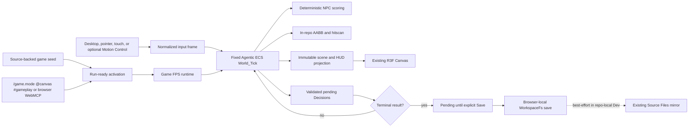

# Knowgrph Game FPS PRD/TAD

## Outcome

Knowgrph gains one browser-local FloatingPanel **Game Mode** that runs a bounded first-person mission inside the existing React Three Fiber Canvas. It opens from a source-backed run-ready document, Motion Control's shared target catalog, browser WebMCP, or the strict `/game.mode @canvas #gameplay` invocation. Desktop, pointer, touch, and optional Motion Control input feed one deterministic native Agentic ECS mission with four scored NPC actions, normalized slab AABB hitscan, visible HUD/runtime errors, and Decisions-only WorkspaceFs persistence.

Core gameplay requires no camera, account, passkey, model, remote asset, gameplay network call, or Cloudflare service. Optional Motion Control retains its existing explicit camera-permission and LiteRT pose-inference boundary and contributes normalized controller input only; it does not choose NPC actions. The focused, core-browser, and opt-in external-source gates passed at candidate commit `067ed16d0a8c77d1c612d6f63aa791ae02fba19c`; protected integration remains pending, and no production or Cloudflare deployment is authorized.

## Product Requirements

### Problem

Knowgrph has a native Three.js renderer, a deterministic Agentic ECS, and browser-local Source Files persistence, but no bounded playable game loop proving those owners can compose. A first increment must be useful without importing a second engine, speculative AI stack, network service, or authentication flow.

### Primary user

Mei is a mobile-first player who wants to open a source-backed browser workspace and play a short FPS mission immediately. Her completion signal is a playable first frame with no sign-in, camera request, or gameplay network dependency, followed by an explicit local Save of validated mission Decisions.

### Primary journey

| Stage | Player action | Runtime owner | Durable effect |
|---|---|---|---|
| Open | Apply a known source-authored run-ready document, choose **Game Mode**, or invoke `/game.mode @canvas #gameplay` | Run-ready registry plus central Game Mode owner | None |
| Play | Move, look, aim, and fire with desktop, pointer, touch, or optional Motion Control input | `canvas/src/features/game-fps/` plus the existing Three renderer | None |
| React | Observe NPCs choose hold, alert, engage, or flee | Deterministic ECS systems | Pending Decisions only |
| Complete | Resolve the mission objective | Mission runtime | Validated pending Decisions |
| Save | Select **Save** after a terminal result; retry explicitly if needed | Browser-local WorkspaceFs adapter | KGC `EcsDecision` nodes only |
| Return | Reopen the same browser workspace | Hydration/resume adapter | Reconstructed mission progress |

### Must scope

- One procedural map built from in-repo primitives; no manifest, GLB, texture, R2, CDN, or runtime asset download.
- One local single-player mission, one weapon, four NPCs, one completion objective, and one retry/reset path.
- One FloatingPanel Game Mode lifecycle: `open`, `start`, `stop`, `restart`, `fire`, `reload`, `save`, and `exit`.
- Desktop keyboard/pointer and mobile touch controls, plus optional reuse of the existing Motion Control pose adapter.
- One fixed-step deterministic simulation using the native Agentic ECS.
- In-repo axis-aligned bounding-box collision and ray-versus-AABB hitscan.
- Deterministic NPC utility scoring with a closed action set: `hold`, `alert`, `engage`, `flee`.
- A HUD that reports health, ammo, NPC count, mission state, save state, and explicit errors.
- Browser-local, Decisions-only KGC persistence through an explicit, idempotent Save; terminal results remain pending until that action succeeds.
- Strict native `/game.mode @canvas #gameplay` invocation and browser-local `knowgrph.inspect_local_game_mode` / `knowgrph.control_local_game_mode` WebMCP.
- Stop followed by Start resumes the exact in-memory tick and player state; Restart is the explicit fresh-run action.
- Synchronous WebGL admission, one existing Canvas, XR pause/restore ownership, and visible fail-closed runtime errors.
- Source-authored `run_ready_demo.id` activation through the known registry, independent of an imported path and fail-closed on identity conflict.
- Source tests, focused runtime proof, core browser smoke, and opt-in external-source browser acceptance.

### Deferred scope

- WebAuthn/passkeys, identity, accounts, cloud sync, and cross-device saves.
- New camera flows, QR pairing, multiplayer, server-authoritative hit checks, leaderboards, and matchmaking. Existing optional Motion Control keeps its explicit local camera boundary.
- Hosted or local LLMs, agent reasoning, narrative generation, model escalation, edge-ML policy models, ONNX Runtime, and token budgets. Existing Motion Control LiteRT pose inference is input only, not NPC policy.
- Rapier, Yuka, `behaviortree.js`, recastnavigation, bitECS, or another game/ECS engine.
- Remote assets, service workers added specifically for this demo, D1, R2, KV, Durable Objects, Workers, Pages, or production routes.
- Automatic Git commits, pushes, pull requests, or deployments from the browser runtime.

### User stories

1. As Mei, I can start the mission with no account, camera prompt, or network dependency.
2. As Mei, movement, aim, fire, and HUD feedback remain one coherent local loop.
3. As Mei, four NPCs react consistently to the same input sequence.
4. As Mei, a malformed save is never silently replaced; I can inspect the error and explicitly reset it.
5. As Mei, explicitly saving a completed mission writes only validated Decisions to my browser-local workspace.
6. As an operator or agent, I can inspect and control the same local Game Mode through one strict invocation grammar and browser WebMCP contract.
7. As a maintainer, I can prove the core runtime is model-free, dependency-free, deterministic, and Dev-only.

### Acceptance criteria

#### AC-1: open and play

Given a clean browser-local workspace, when the game seed is applied, then the procedural mission reaches a playable frame without sign-in, camera permission, passkey API access, remote asset fetch, or Cloudflare request.

#### AC-2: deterministic mission

Given the same mission seed and normalized input frames, when two fresh runtimes advance the same fixed number of ticks, then player, NPC, projectile-free hitscan, mission, Decisions, and HUD projection are byte-equivalent after canonical serialization.

#### AC-3: local collision and weapon result

Given a player or NPC intersects authored world bounds, when the tick advances, then the in-repo AABB resolver returns a bounded non-penetrating position. Given a fire input, the nearest ray/AABB intersection resolves once in that tick and the HUD exposes the hit or miss without a second renderer or physics owner.

#### AC-4: deterministic NPC decisions

Given an NPC state and player observation, when its decision interval fires, then exactly one action from `hold | alert | engage | flee` is selected by deterministic scoring and stable tie-breaking. The system makes no reasoning request and cannot fall through to a model or network path.

#### AC-5: canonical zero cost

Given a successful game `World_Tick`, when no reasoning request exists, then it returns exactly one canonical zero Cost_Log:

```json
{
  "model": "none",
  "prompt_tokens": 0,
  "completion_tokens": 0,
  "cache_hits": 0,
  "estimated_cost_usd": 0,
  "incomplete": false
}
```

No token ceiling, escalation, retry, fallback model, or synthetic non-zero cost record exists in this increment.

#### AC-6: decision-only local save

Given mission completion, when Mei explicitly selects **Save** and persistence succeeds, then browser-local WorkspaceFs contains only canonical `EcsDecision` additions using the supported `dialogue_outcome`, `quest_flag`, or `world_tick_result` types. Component arrays, world snapshots, cost logs, credentials, and raw input history are not written.

In repo-local Dev mode, the existing Source Files bridge may attempt its normal best-effort mirror. A mirror failure does not convert a local success into a Git claim, and the game never launches a Git process or creates a commit automatically.

#### AC-7: fail-closed hydration and retry

Given no save document, the runtime may create a fresh mission. Given an existing malformed KGC save, hydration blocks before a World is created, names the unreadable local path, preserves the original bytes, and exposes an explicit **Reset local save** action. Only that user action may replace the malformed document with the canonical empty mission save.

Given a write failure, pending Decisions remain in memory, the previous document bytes remain unchanged, and the HUD exposes **Retry save**. No silent drop, fabricated success, or automatic reset is allowed.

#### AC-8: Dev-only readiness

Given the candidate source, when `npm run game-fps:runtime-ready` passes, then its evidence covers focused game tests, Agentic ECS tests, Canvas type checking, a production-format local build, and the source-backed seed contract. A separate local browser smoke proves visible play and save/reset behavior. Neither command deploys or performs a remote mutation.

#### AC-9: strict invocation and browser WebMCP

Given an invocation, exactly one `/game.mode`, one `@canvas`, and one `#gameplay` token is accepted. Duplicate sigils, unknown keys, mixed structured/native input, and invalid lifecycle operations fail closed. Browser agent-ready registration exposes only `knowgrph.inspect_local_game_mode` and `knowgrph.control_local_game_mode` for this surface; it adds no stdio tool, HTTP mutation route, remote gateway, or deployment authority.

#### AC-10: XR, Motion Control, and Canvas ownership

Given a running XR controller document, entering Game Mode pauses its current frame and mounts the game stage inside the same Canvas. Opening Motion Control exits to the shared XR owner, preserves the stopped Game Mode mission, and lets XR resume. Reopening Game Mode pauses a fresh XR frame; exiting restores that exact frame and resumes only the owner Game Mode paused.

#### AC-11: synchronous admission and resumable lifecycle

WebGL support is resolved synchronously before mission start. Unsupported WebGL or unreadable Decisions keeps the mission stopped and exposes a local error. Stop followed by Start resumes the same in-memory mission; malformed hydration blocks Start and Restart until **Reset local save** succeeds.

### Success metrics

| Metric | Must target |
|---|---|
| First value | Playable first frame and first shot from the source-backed demo |
| NPC count | Exactly four reactive NPCs |
| Deterministic replay | Two identical input traces yield identical canonical results |
| Runtime model calls | 0 |
| Gameplay network calls | 0 required; opt-in acceptance performs one verifier preflight read plus one exact product/browser source fetch |
| Token and inference cost | 0 tokens; USD 0 |
| Persistent data | Validated Decisions only |
| New runtime dependencies | 0 |
| Production mutation | 0 |

## Technical Architecture

### Ownership

| Concern | Canonical owner | Rule |
|---|---|---|
| Game domain | `canvas/src/features/game-fps/` | Mission config, systems, input normalization, HUD projection, local save adapter |
| Surface lifecycle | `canvas/src/features/game-fps/gameModeRuntime.ts` | Own open/start/stop/restart/save/exit state and previous-surface restoration |
| FloatingPanel | `canvas/src/features/game-fps/GameModeFloatingPanelView.tsx` | Project shared runtime state and actions; never create a second world or renderer |
| Invocation/WebMCP | `canvas/src/features/game-fps/gameModeMcpRuntime.ts` plus browser agent-ready registration | Enforce the strict native tuple and browser-local inspect/control schema |
| Entity simulation | `ecs/` | Reuse the five-function native ECS API and its transactional `worldTick` |
| Rendering | `canvas/src/lib/three/ThreeGraph.impl.tsx` | Reuse the single React Three Fiber Canvas; do not mount a second WebGL renderer |
| Camera/input arbitration | Existing Three controls, game stage, and Motion Control adapter | Game Mode owns first-person framing while active; Motion Control contributes normalized input only |
| XR lifecycle | Existing XR controller runtime and shared surface catalog | Pause, resume, and restore the existing owner without replacing its Canvas or world |
| Browser persistence | `canvas/src/features/workspace-fs/` | Use WorkspaceFs and its existing source-file bridge; do not add storage or Git owners |
| Cost truth | `contracts/cost-log.schema.js` | Accept only the canonical model-free zero record for the no-reasoning tick |
| Activation | `docs/workspace-seeds/knowgrph-game-fps-demo.md` | Source-backed `game-fps` run-ready demo |
| Proof | `docs/documents/knowgrph-game-fps-runtime-readiness.md` | Exact commands and evidence state |

### Runtime topology



No node in this topology is a model, remote service, Cloudflare resource, Git operation, or deployment step.

### Mission model

The mission configuration is constant and source-controlled. It defines world bounds, collision boxes, player spawn, four NPC spawns, weapon range/damage/cooldown/ammo, fixed tick duration, and objective thresholds. Runtime component storage remains ephemeral.

The simulation advances from normalized input frames rather than DOM events. A bounded accumulator may run more than one fixed tick per render frame, but it must cap catch-up work and never make the simulation result depend on display refresh rate. Rendering reads an immutable projection after a committed tick.

### Collision and hitscan

World obstacles and actors use source-authored AABBs. Movement resolves one axis at a time in a stable order and clamps to the world boundary. Hitscan uses a normalized camera ray, slab intersection, positive distance, weapon range, and stable `(distance, entityRef)` ordering to choose at most one target. There are no projectile entities, mesh-collider generation, navmesh, or floating dependency fallbacks.

### NPC system

NPC utility scores derive only from canonical numeric observations such as health, player distance, line-of-sight, alert state, and deterministic tick counters. Stable action priority resolves equal scores. Pathing is bounded steering around the procedural AABBs; it does not claim general navigation.

Only meaningful transitions emit a Decision. Per-frame transforms, aim vectors, and intermediate utility scores remain ephemeral. The game systems never call `requestReasoning`.

### Persistence and resume

The local save path is owned by the game adapter under WorkspaceFs. A terminal result leaves canonical Decisions pending; only explicit **Save** merges them idempotently by `decisionId`. Existing authored bytes remain untouched except for supported KGC Decision insertion. Resume derives mission progress from the validated Decision index before the first tick.

Malformed existing KGC is not equivalent to an absent save. The runtime reports the precise local path and error, does not create a partial World, and waits for explicit reset. Reset and retry are user actions, not recovery side effects.

### Error model

| Failure | Required result |
|---|---|
| Invalid mission config | Block activation with typed local error |
| Invalid input value | Reject or normalize to a bounded neutral value before tick |
| Tick/system failure | Keep prior committed systems, expose failure, do not claim a successful frame |
| Malformed existing save | Preserve bytes, block hydration, expose explicit reset |
| Local write failure | Preserve prior bytes and pending Decisions, expose retry |
| Repo-local mirror failure | Keep truthful browser-local save status and report mirror as best-effort failure |
| WebGL unavailable | Fail the synchronous admission probe, keep the mission stopped, and show a local unsupported state without a remote or second renderer |

## Architecture Decisions

### ADR-1: Reuse the existing renderer and native ECS

**Status:** Accepted for this increment.

The game mounts a dedicated stage inside the existing `ThreeGraph` React Three Fiber Canvas and uses the native Agentic ECS for runtime state. A second renderer, a second camera owner, bitECS, Babylon.js, or another ECS is rejected because it duplicates an existing repository owner.

### ADR-2: Own minimal physics and weapon math in-repo

**Status:** Accepted for this increment.

The procedural mission needs only bounded movement collision and one hitscan weapon, so deterministic AABB and ray/AABB functions remain in the game feature cluster. Rapier and mesh physics are not installed or claimed. General rigid-body physics is outside this increment.

### ADR-3: Use deterministic authored NPC scoring

**Status:** Accepted for this increment.

Reactive combat uses a small closed action set and stable utility rules. Yuka, behavior-tree packages, recastnavigation, local/hosted LLMs, and edge-ML policies are rejected for the Must scope because they add weight without improving the bounded mission acceptance criteria.

### ADR-4: Persist Decisions through browser-local WorkspaceFs

**Status:** Accepted for this increment.

The runtime writes canonical KGC Decisions through the existing browser-local filesystem owner. The existing repo-local Source Files bridge may mirror the document best-effort during Dev, but no automatic Git commit is performed or implied. Component state and raw World snapshots remain ephemeral.

### ADR-5: Defer identity and multiplayer

**Status:** Accepted for this increment.

Open-and-play is the only onboarding path. Passkeys, new QR/camera flows, accounts, multiplayer, and cloud profiles are explicitly deferred. Core Game Mode must not touch `navigator.credentials` or `getUserMedia`; only the existing optional Motion Control Start flow may request local camera access.

### ADR-6: Keep readiness local and Dev-only

**Status:** Accepted for this increment.

Runtime readiness means focused source proof plus a local browser smoke bound to the candidate commit. It does not mean merged, deployed, publicly reachable, or production-ready. Production and Cloudflare lanes require a separate operator-authorized release workflow.

### ADR-7: Reuse shared XR/Motion owners and expose browser-local control

**Status:** Accepted for this increment.

Game Mode uses the existing Canvas View Mode → Surface Mode → XR Mode owner and the existing Motion Control target catalog. It pauses and restores the shared XR controller rather than copying physics state or remounting a renderer. Agent access is limited to the strict native invocation tuple and two browser WebMCP contracts; the private Agentic ECS stdio lane remains exactly three tools, and no new gateway or deployment surface is added.

## Runtime Readiness Gate

The single source of truth for evidence is `docs/documents/knowgrph-game-fps-runtime-readiness.md`. Its local runtime-readiness checklist passed at candidate commit `067ed16d0a8c77d1c612d6f63aa791ae02fba19c`, so this PRD and the workspace seeds are `runtime-ready`. Protected integration and release remain separate gates.

The expected focused command is:

```bash
npm run game-fps:runtime-ready
npm run game-fps:browser-smoke
KG_GAME_MODE_VALIDATION_SHARE_URL='<operator-supplied share URL>' npm -C canvas run test:smoke:game-mode-xr-share:browser
```

The first two commands are finite and local apart from ordinary build/test artifacts. The opt-in third command reads only the operator-supplied public Markdown into localhost candidate code and applies a local/supplied-origin allowlist. No command accesses a paid model, writes the supplied URL/token into repository bytes or evidence, deploys, mutates the public source, or mutates Cloudflare.

## Agent-Platform Readiness

| Dimension | Scope |
|---|---|
| Agentic OS-ready | Canonical `/game.mode @canvas #gameplay` metadata is projected through the pinned Agentic OS invocation dictionary; protected cross-repo integration remains separately evidenced. |
| AI Agent-ready | Existing browser agent-ready registration exposes read-only inspection and mutating lifecycle control without adding a model, prompt, reasoning path, or autonomous persistence. |
| MCP-ready | `knowgrph.inspect_local_game_mode` and `knowgrph.control_local_game_mode` are browser-local WebMCP only. No stdio, HTTP mutation route, remote gateway, or deployment authority is added; the private Agentic ECS lane remains exactly three tools. |

## Release Boundary

The deliverable is a Dev/local runtime-readiness candidate. No Pages build upload, Worker deployment, D1/R2/KV/DO mutation, production route change, or release claim belongs to this scope. The opt-in acceptance read exact operator-supplied public Markdown bytes and exercised them against localhost candidate code; it does not prove the public document contains the new Game Mode metadata or that candidate code is publicly deployed. A future release must begin from a protected integrated SHA and explicit operator authorization.
