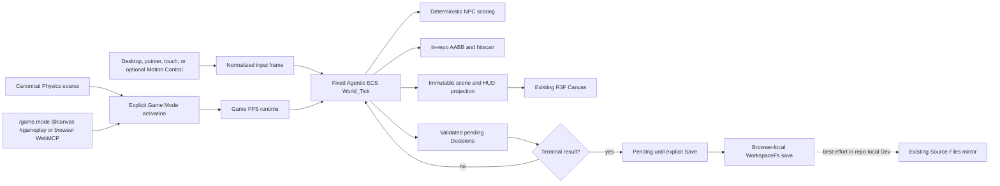

# Knowgrph Game FPS PRD/TAD

## Outcome

Knowgrph gains one browser-local FloatingPanel **Game Mode** that runs a bounded first-person mission inside the existing React Three Fiber Canvas. The canonical Physics Playground document owns the only source-backed XR world; Game Mode opens explicitly from FloatingPanel, Motion Control's shared target catalog, browser WebMCP, or the strict `/game.mode @canvas #gameplay` invocation. It never owns a second run-ready document or automatic startup route. The authored XR atmosphere, world, props, and paused frame remain visibly mounted while Game Mode supplies only its first-person camera and actor overlay. Toolbar **Canvas View Mode → Surface Mode → XR Mode** and FloatingPanel **Media**, **Animation**, **Motion Control**, **Game Mode**, and **Camera** project the same Canvas and authored scene rather than creating scene variants. Desktop, pointer, touch, optional Motion Control, and MCP input arm one deterministic native Agentic ECS mission with four scored NPC actions, normalized slab AABB hitscan, visible HUD/runtime errors, and Decisions-only WorkspaceFs persistence.

Core gameplay requires no camera, account, passkey, model, remote asset, gameplay network call, or Cloudflare service. Optional Motion Control retains its existing explicit camera-permission and LiteRT pose-inference boundary and contributes normalized controller input only; it does not choose NPC actions. The pre-follow-up baseline gates passed at protected main commit `fbb615be92ea58e6e4cfc981feb2122ea81e79b2` after PR #263 merged. The authored-XR composition and ready-clock follow-up passed PR #273's protected Integration Gate and exact-main acceptance at `0b0e70787edb80e71d368d56c1478ffd9655ce0d`; no production or Cloudflare deployment is authorized.

An optional **AR Tabletop Broadcast** companion may, on explicit opt-in, project the same authored ECS scene as a miniature anchored on a real-world surface and frame it for a live "tabletop broadcast" capture. It is browser-based, mobile-first, local-first, and offline-first, and requests the camera only on the same explicit boundary as Motion Control. It is a read-only projection that never gates core gameplay, never mounts a second renderer or Canvas, never mutates Component_Store, never drives NPC decisions, and adds no network, Supabase, or Cloudflare dependency. The effect is inspired by the AR-World-Cup miniature-on-a-table demo but copies none of its source and takes no dependency on it (Supabase and any remote realtime backend are forbidden). See ADR-8.

## Product Requirements

### Problem

Knowgrph has a native Three.js renderer, a deterministic Agentic ECS, and browser-local Source Files persistence, but no bounded playable game loop proving those owners can compose. A first increment must be useful without importing a second engine, speculative AI stack, network service, or authentication flow.

### Primary user

Mei is a mobile-first player who wants to open a source-backed browser workspace and play a short FPS mission immediately. Her completion signal is a playable first frame with no sign-in, camera request, or gameplay network dependency, followed by an explicit local Save of validated mission Decisions.

### Primary journey

| Stage | Player action | Runtime owner | Durable effect |
|---|---|---|---|
| Open | Apply the canonical Physics Playground source, then choose **Game Mode** or invoke `/game.mode @canvas #gameplay` | Physics source registry plus central Game Mode owner | None |
| Play | Move, look, aim, and fire with desktop, pointer, touch, or optional Motion Control input | `canvas/src/features/game-fps/` plus the existing Three renderer | None |
| React | Observe NPCs choose hold, alert, engage, or flee | Deterministic ECS systems | Pending Decisions only |
| Complete | Resolve the mission objective | Mission runtime | Validated pending Decisions |
| Save | Select **Save** after a terminal result; retry explicitly if needed | Browser-local WorkspaceFs adapter | KGC `EcsDecision` nodes only |
| Return | Reopen the same browser workspace | Hydration/resume adapter | Reconstructed mission progress |

### Must scope

- One selected authored XR terrain/environment and collider profile from the existing local catalog; Game Mode owns no replacement environment, manifest, GLB, texture, R2, CDN, or runtime asset download.
- One local single-player mission, one weapon, four NPCs, one completion objective, and one retry/reset path.
- One FloatingPanel Game Mode lifecycle: `open`, `start`, `stop`, `restart`, `fire`, `reload`, `save`, and `exit`.
- Desktop keyboard/pointer and mobile touch controls, plus optional reuse of the existing Motion Control pose adapter.
- One fixed-step deterministic simulation using the native Agentic ECS.
- In-repo axis-aligned bounding-box collision and ray-versus-AABB hitscan.
- Deterministic NPC utility scoring with a closed action set: `hold`, `alert`, `engage`, `flee`.
- A HUD that reports health, ammo, NPC count, mission state, save state, and explicit errors.
- Browser-local, Decisions-only KGC persistence through an explicit, idempotent Save; terminal results remain pending until that action succeeds.
- Strict native `/game.mode @canvas #gameplay` invocation and browser-local `knowgrph.inspect_local_game_mode` / `knowgrph.control_local_game_mode` WebMCP.
- Stop followed by Start resumes the exact in-memory tick and player state; Restart is the explicit fresh-run action.
- Synchronous WebGL admission, one existing Canvas, XR pause/restore ownership, and visible fail-closed runtime errors.
- A ready simulation clock that does not advance or damage an unattended player until normalized player engagement.
- One XR scene composition owner that retains the authored world and atmosphere; the former fallback scene/environment source is deleted, and renamed, conditional, or alternate variants are forbidden.
- Exactly one source-authored `run_ready_demo.id`: `xr-physics`; Game Mode is an explicit overlay and never a document-driven or environment-selected startup variant.
- Source tests, focused runtime proof, core browser smoke, and opt-in external-source browser acceptance.

### Deferred scope

- WebAuthn/passkeys, identity, accounts, cloud sync, and cross-device saves.
- QR pairing, multiplayer, AR multiplayer spectating, server-authoritative hit checks, leaderboards, and matchmaking. The optional AR Tabletop Broadcast (specified below) and the existing Motion Control keep their explicit opt-in local camera boundary; no other new camera flow is added.
- Any copy of, or runtime/build dependency on, `ar-world-cup` (inspiration only), and any Supabase or remote realtime backend for AR or game state — AR and mission state stay local in the native Agentic ECS and KGC.
- Hosted or local LLMs, agent reasoning, narrative generation, model escalation, edge-ML policy models, ONNX Runtime, and token budgets. Existing Motion Control LiteRT pose inference is input only, not NPC policy.
- Any external physics runtime, Yuka, `behaviortree.js`, recastnavigation, bitECS, or another game/ECS engine. The independent native physics cores are available to separately scoped callers, but migration of this mission's bounded geometry is not part of this increment.
- Remote assets, service workers added specifically for this demo, D1, R2, KV, Durable Objects, Workers, Pages, or production routes.
- Automatic Git commits, pushes, pull requests, or deployments from the browser runtime.

### Optional AR Tabletop Broadcast (opt-in companion)

A bounded, optional companion that films the live authored ECS scene as a miniature "tabletop broadcast" — inspired by the AR miniature-on-a-table effect, sharing none of its source and taking no dependency on it (Supabase and any remote realtime backend are forbidden). Scope:

- **Opt-in and non-gating.** Core gameplay never requires it; it activates only on an explicit Start that requests local camera access on the same boundary as Motion Control (no frame upload, no frame persistence). Declining leaves the mission fully playable and unchanged.
- **Browser-based, mobile-first, local-first, offline-first.** The primary anchor path is the **WebXR immersive-ar** device API (surface hit-test + anchors) on capable mobile browsers; the fallback for browsers without WebXR-AR (e.g. iOS Safari) is a **lazily loaded, FOSS image-target tracker (MindAR.js or AR.js)** cached in the PWA. No network, Supabase, or Cloudflare call is required to anchor, project, or film.
- **Read-only projection.** It renders the existing authored XR/ECS scene, read from the immutable post-`World_Tick` projection, as a miniature anchored on the detected surface, composited over the live camera feed. It never mounts a second renderer or Canvas, never mutates Component_Store, and never becomes the NPC decision policy; the deterministic `World_Tick` and replay (AC-2) stay unaffected.
- **Broadcast framing reuses existing owners.** Filming and framing reuse the existing camera source (fixed-follow / free-orbit), Timeline camera-marks, and the existing capture/export path — no new renderer or recorder.
- **MCP-invocable.** Strict native `/ar.broadcast @canvas #broadcast` with exactly one supported operation from `open`, `start`, `anchor`, `record`, `stop`, `exit`; browser-local WebMCP exposes only `knowgrph.inspect_local_ar_broadcast` and `knowgrph.control_local_ar_broadcast` — no stdio, HTTP, gateway, or deployment surface.
- **No new Must-scope dependency.** The WebXR path is a browser standard (no dependency); the image-target fallback is an optional module loaded only when AR broadcast is opted into on a non-WebXR browser, so the Must-scope "zero new runtime dependencies" holds.
- **Validation surface.** Exercised against the native XR physics-playground seed (`docs/workspace-seeds/knowgrph-physics-playground-demo.md`), which already provides the shared XR Canvas, selectable camera source, the Motion Control camera boundary, and the `/ @ #` MCP grammar — all local-only with no external calls.

### User stories

1. As Mei, I can start the mission with no account, camera prompt, or network dependency.
2. As Mei, movement, aim, fire, and HUD feedback remain one coherent local loop.
3. As Mei, four NPCs react consistently to the same input sequence.
4. As Mei, a malformed save is never silently replaced; I can inspect the error and explicitly reset it.
5. As Mei, explicitly saving a completed mission writes only validated Decisions to my browser-local workspace.
6. As an operator or agent, I can inspect and control the same local Game Mode through one strict invocation grammar and browser WebMCP contract.
7. As a maintainer, I can prove the core runtime is model-free, dependency-free, deterministic, and Dev-only.
8. As Mei, I can optionally point my phone at a table and film the mission as a live miniature "tabletop broadcast," entirely offline and camera-opt-in, without changing how the mission plays, ticks, or saves.

### Acceptance criteria

#### AC-1: open and play

Given a clean browser-local workspace with the canonical Physics Playground source applied, when Game Mode is opened explicitly, then the bounded mission reaches a playable frame in that authored XR scene without sign-in, camera permission, passkey API access, remote asset fetch, or Cloudflare request.

#### AC-2: deterministic mission

Given the same mission seed and normalized input frames, when two fresh runtimes advance the same fixed number of ticks, then player, NPC, projectile-free hitscan, mission, Decisions, and HUD projection are byte-equivalent after canonical serialization.

#### AC-3: local collision and weapon result

Given a player or NPC intersects authored world bounds, when the tick advances, then the in-repo AABB resolver returns a bounded non-penetrating position. Given a fire input, the nearest ray/AABB intersection resolves once in that tick and the HUD exposes the hit or miss without a second renderer or physics owner.

#### AC-4: deterministic NPC decisions

Given an NPC state and player observation, when its decision interval fires, then exactly one action from `hold | alert | engage | flee` is selected by deterministic scoring and stable tie-breaking. The system makes no reasoning request and cannot fall through to a model or network path.

#### AC-5: canonical zero cost

Given a successful game `World_Tick`, when no reasoning request exists, then it returns exactly one canonical zero Cost_Log:

```json
{
  "model": "none",
  "prompt_tokens": 0,
  "completion_tokens": 0,
  "cache_hits": 0,
  "estimated_cost_usd": 0,
  "incomplete": false
}
```

No token ceiling, escalation, retry, fallback model, or synthetic non-zero cost record exists in this increment.

#### AC-6: decision-only local save

Given mission completion, when Mei explicitly selects **Save** and persistence succeeds, then browser-local WorkspaceFs contains only canonical `EcsDecision` additions using the supported `dialogue_outcome`, `quest_flag`, or `world_tick_result` types. Component arrays, world snapshots, cost logs, credentials, and raw input history are not written.

In repo-local Dev mode, the existing Source Files bridge may attempt its normal best-effort mirror. A mirror failure does not convert a local success into a Git claim, and the game never launches a Git process or creates a commit automatically.

#### AC-7: fail-closed hydration and retry

Given no save document, the runtime may create a fresh mission. Given an existing malformed KGC save, hydration blocks before a World is created, names the unreadable local path, preserves the original bytes, and exposes an explicit **Reset local save** action. Only that user action may replace the malformed document with the canonical empty mission save.

Given a write failure, pending Decisions remain in memory, the previous document bytes remain unchanged, and the HUD exposes **Retry save**. No silent drop, fabricated success, or automatic reset is allowed.

#### AC-8: Dev-only readiness

Given an exact runtime source revision, when `npm run game-fps:runtime-ready` passes, then its evidence covers focused game tests, Agentic ECS tests, Canvas type checking, a production-format local build, and the source-backed seed contract. A separate local browser smoke proves visible play and save/reset behavior. Neither command deploys or performs a remote mutation.

#### AC-9: strict invocation and browser WebMCP

Given an invocation, exactly one `/game.mode`, one `@canvas`, and one `#gameplay` token is accepted. Duplicate sigils, unknown keys, mixed structured/native input, and invalid lifecycle operations fail closed. Browser agent-ready registration exposes only `knowgrph.inspect_local_game_mode` and `knowgrph.control_local_game_mode` for this surface; it adds no stdio tool, HTTP mutation route, remote gateway, or deployment authority.

#### AC-10: XR, Motion Control, and Canvas ownership

Given a running XR controller document, entering Game Mode pauses its current frame and input while keeping its authored atmosphere, terrain, props, and scene graph visibly mounted inside the same Canvas. Game Mode overlays its first-person camera and actors. No fallback scene/environment implementation remains to mount, and renamed, conditional, or alternate replacement geometry, lights, clear-color owner, collision profile, or renderer branch is forbidden. Opening Motion Control exits to the shared XR owner, preserves the stopped Game Mode mission, and lets XR resume. Reopening Game Mode pauses a fresh XR frame; exiting restores that exact frame and resumes only the owner Game Mode paused. Switching among FloatingPanel Media, Animation, Motion Control, Game Mode, and Camera preserves the same Canvas DOM identity and authored XR world.

Every catalogued XR terrain/environment derives one 3D collision profile from the authored static catalog. All non-boundary slabs remain available to ray occlusion; only slabs intersecting the ground-actor vertical band constrain spawn admission, movement, and NPC line of sight. Deterministic admission places the player and four NPCs clear of those ground blockers. An authored-terrain geometry change replaces an incompatible stopped or live mission with a healthy tick-zero mission on the new spatial profile; invisible stale colliders and non-XR profile variants are forbidden.

#### AC-11: synchronous admission and resumable lifecycle

WebGL support is resolved synchronously before mission start. Unsupported WebGL or unreadable Decisions keeps the mission stopped and exposes a local error. Start prepares a healthy ready frame at tick zero; only accepted desktop, pointer, touch, Motion Control, or MCP gameplay input arms fixed ticks. Blur, document hiding, or pointer-control release pauses the clock without changing mission state. Stop followed by Start resumes the same in-memory mission when its spatial profile still matches; an authored-terrain profile mismatch restarts on the current XR profile. Malformed hydration blocks Start and Restart until **Reset local save** succeeds.

#### AC-12: opt-in offline AR tabletop broadcast

Given core gameplay running, when the operator explicitly starts AR Tabletop Broadcast via `/ar.broadcast @canvas #broadcast operation=start`, then local camera access is requested on the same boundary as Motion Control (no frame upload, no frame persistence), the authored ECS scene is projected as a miniature anchored on a detected real-world surface over the live camera feed, and no sign-in, network, Supabase, or Cloudflare call occurs. Declining, or never starting AR broadcast, leaves the mission fully playable, tickable, and savable without change.

#### AC-13: read-only projection, deterministic, dependency-bounded

Given AR Tabletop Broadcast active, when the mission ticks, then AR reads only the immutable post-tick scene and HUD projection: two identical input traces still yield byte-equivalent canonical results (AC-2 holds), Component_Store is not mutated, and AR never selects an NPC action. The primary anchor path is WebXR immersive-ar; where unavailable, a lazily loaded FOSS image-target tracker (MindAR.js or AR.js) is used. Neither path copies from or depends externally, and neither introduces Supabase, a remote realtime backend, or a new Must-scope runtime dependency. Camera-permission denial, missing surface/anchor, and absence of both WebXR-AR and the fallback fail closed with a visible local error and leave the mission running.

### Success metrics

| Metric | Must target |
|---|---|
| First value | Playable first frame and first shot from the source-backed demo |
| NPC count | Exactly four reactive NPCs |
| Deterministic replay | Two identical input traces yield identical canonical results |
| Runtime model calls | 0 |
| Gameplay network calls | 0 required; opt-in acceptance performs one verifier preflight read plus one exact product/browser source fetch |
| Token and inference cost | 0 tokens; USD 0 |
| Persistent data | Validated Decisions only |
| New runtime dependencies | 0 |
| Production mutation | 0 |

## Technical Architecture

### Ownership

| Concern | Canonical owner | Rule |
|---|---|---|
| Game domain | `canvas/src/features/game-fps/` | Mission config, systems, input normalization, HUD projection, local save adapter |
| Surface lifecycle | `canvas/src/features/game-fps/gameModeRuntime.ts` | Own open/start/stop/restart/save/exit state and previous-surface restoration |
| Canvas departure | `canvas/src/lib/canvas/canvasSurfaceOwnershipRuntime.ts` plus the canonical store transitions | Exit and stop active Game Mode synchronously when the root Canvas leaves XR; retain the requested 2D, 3D, voxel, or schema-coerced destination and suppress only intermediate states inside the central XR activation transaction |
| FloatingPanel | `canvas/src/features/game-fps/GameModeFloatingPanelView.tsx` | Project shared runtime state and actions; never create a second world or renderer |
| Invocation/WebMCP | `canvas/src/features/game-fps/gameModeMcpRuntime.ts` plus browser agent-ready registration | Enforce the strict native tuple and browser-local inspect/control schema |
| Entity simulation | `ecs/` | Reuse the five-function native ECS API and its transactional `worldTick` |
| Rendering | `canvas/src/lib/three/ThreeGraph.impl.tsx` plus the canonical XR stage owners | Reuse the single React Three Fiber Canvas and authored XR world; Game Mode may add only actors and first-person framing, never an alternate environment, clear owner, world, or renderer |
| Camera/input arbitration | Existing Three controls, authored-stage placement, game stage, and Motion Control adapter | Game Mode owns first-person framing in the authored coordinate space while active; Motion Control contributes normalized input only; immersive entry is unavailable during first-person gameplay |
| AR Tabletop Broadcast (optional) | `canvas/src/features/game-fps/arBroadcastRuntime.ts` | Opt-in, camera-permissioned WebXR immersive-ar projection (lazily loaded MindAR.js/AR.js image-target fallback) that reads the immutable post-tick scene projection and reuses the existing camera source and capture/export path; a broadcast/spectator projection distinct from first-person gameplay; never a second renderer/Canvas, never mutates Component_Store or NPC policy, never adds network/Supabase/Cloudflare |
| Collision profile | `canvas/src/features/three/xrCanonicalSceneSpatialSource.ts` | Project the active authored or native-controller XR stage through one canonical 3D spatial source, retain every non-boundary slab for ray occlusion, filter ground interactions by actor-height overlap, and admit clear deterministic spawns; alternate Game-owned collision-profile variants are forbidden |
| XR lifecycle | `canvas/src/features/three/xrSceneSurfaceRuntime.ts`, existing XR controller runtime, and shared surface catalog | Route Media, Animation, Motion Control, Game Mode, and Camera through one XR activation owner; pause, resume, and restore without replacing the Canvas or world |
| Browser persistence | `canvas/src/features/workspace-fs/` | Use WorkspaceFs and its existing source-file bridge; do not add storage or Git owners |
| Cost truth | `contracts/cost-log.schema.js` | Accept only the canonical model-free zero record for the no-reasoning tick |
| Activation | `docs/workspace-seeds/knowgrph-physics-playground-demo.md` plus `/game.mode @canvas #gameplay` | One source-backed `xr-physics` world plus explicit Game Mode overlay; no standalone game seed or auto-start route |
| Proof | `docs/documents/knowgrph-game-fps-runtime-readiness.md` | Exact commands and evidence state |

### Runtime topology



No node in this topology is a model, remote service, Cloudflare resource, Git operation, or deployment step.

### Mission model

The mission rules are constant and source-controlled. The selected authored XR profile supplies world bounds, collision boxes, and admitted player/four-NPC spawns; the mission supplies weapon range/damage/cooldown/ammo, fixed tick duration, and objective thresholds. Runtime component storage remains ephemeral.

The simulation advances from normalized input frames rather than DOM events. A bounded accumulator may run more than one fixed tick per render frame, but it must cap catch-up work and never make the simulation result depend on display refresh rate. Rendering reads an immutable projection after a committed tick.

### Collision and hitscan

World obstacles and actors use source-authored AABBs. Movement resolves one axis at a time in a stable order and clamps to the world boundary. XR projection retains every authored non-boundary collider as a 3D slab; spawn admission, movement, and NPC line of sight consider only slabs whose vertical span obstructs a ground actor. A deterministic bounded grid admits non-overlapping player/NPC spawns for every catalogued terrain/environment. Hitscan considers the full 3D slab catalog and actors using a normalized camera ray, slab intersection, positive distance, weapon range, and stable `(distance, entityRef)` ordering to choose at most one target. There are no projectile entities, mesh-collider generation, navmesh, or floating dependency fallbacks.

### NPC system

NPC utility scores derive only from canonical numeric observations such as health, player distance, line-of-sight, alert state, and deterministic tick counters. Stable action priority resolves equal scores. Pathing is bounded steering around the authored XR AABBs; it does not claim general navigation.

Only meaningful transitions emit a Decision. Per-frame transforms, aim vectors, and intermediate utility scores remain ephemeral. The game systems never call `requestReasoning`.

### Persistence and resume

The local save path is owned by the game adapter under WorkspaceFs. A terminal result leaves canonical Decisions pending; only explicit **Save** merges them idempotently by `decisionId`. Existing authored bytes remain untouched except for supported KGC Decision insertion. Resume derives mission progress from the validated Decision index before the first tick.

Malformed existing KGC is not equivalent to an absent save. The runtime reports the precise local path and error, does not create a partial World, and waits for explicit reset. Reset and retry are user actions, not recovery side effects.

### AR Tabletop Broadcast projection

AR Tabletop Broadcast is an optional, opt-in projection layer over the same React Three Fiber Canvas. It consumes the immutable post-`World_Tick` scene projection (the same projection the HUD and scene reads use) and renders it as a miniature anchored on a detected real-world surface, composited over the live camera feed. It is a read-only consumer: it never advances the tick, mutates Component_Store, or influences NPC scoring, so deterministic replay (AC-2) is unaffected.

Anchoring uses the **WebXR immersive-ar** device API (surface hit-test + anchors) where available; otherwise a lazily loaded, PWA-cached FOSS image-target tracker (**MindAR.js** or **AR.js**) provides a marker-anchored fallback. Both run fully on-device and offline. Camera access is requested only on explicit Start, on the same boundary as Motion Control — no frame upload, no frame persistence. Broadcast framing reuses the existing camera source (fixed-follow / free-orbit), Timeline camera-marks, and the existing capture/export path; it introduces no second renderer, recorder, or Canvas. No AR state is sent to Supabase, a remote realtime backend, or any Cloudflare resource; mission state remains in the native Agentic ECS and KGC. The effect is inspired by the AR miniature-on-a-table demo but shares none of its source and takes no dependency on it.

### Error model

| Failure | Required result |
|---|---|
| Invalid mission config | Block activation with typed local error |
| Invalid input value | Reject or normalize to a bounded neutral value before tick |
| Tick/system failure | Keep prior committed systems, expose failure, do not claim a successful frame |
| Malformed existing save | Preserve bytes, block hydration, expose explicit reset |
| Local write failure | Preserve prior bytes and pending Decisions, expose retry |
| Repo-local mirror failure | Keep truthful browser-local save status and report mirror as best-effort failure |
| WebGL unavailable | Fail the synchronous admission probe, keep the mission stopped, and show a local unsupported state without a remote or second renderer |
| AR camera permission denied | Keep the mission running, do not start AR broadcast, and show a local opt-in-declined state; never block or alter gameplay |
| No AR surface/anchor found | Keep the mission running, expose a local "no surface detected" state, and allow retry; never fabricate an anchor |
| WebXR-AR and image-target fallback both unavailable | Fail AR broadcast closed with a visible local unsupported state; the mission and its save path are unaffected |

## Architecture Decisions

### ADR-1: Reuse the existing renderer and native ECS

**Status:** Accepted for this increment.

The game mounts a dedicated stage inside the existing `ThreeGraph` React Three Fiber Canvas and uses the native Agentic ECS for runtime state. A second renderer, a second camera owner, bitECS, Babylon.js, or another ECS is rejected because it duplicates an existing repository owner.

### ADR-2: Own minimal physics and weapon math in-repo

**Status:** Accepted for this increment.

The bounded mission needs only ground-actor movement collision and one hitscan weapon, so deterministic AABB and ray/AABB functions remain in the game feature cluster while consuming the shared authored XR collider profile. The independent native physics cores are specified separately in `knowgrph-native-physics-engines-prd-tad.md`; this mission has not migrated to them and must not imply that it has. No external physics runtime, compatibility layer, mesh physics, or Rapier-compatible API is installed or claimed.

### ADR-3: Use deterministic authored NPC scoring

**Status:** Accepted for this increment.

Reactive combat uses a small closed action set and stable utility rules. Yuka, behavior-tree packages, recastnavigation, local/hosted LLMs, and edge-ML policies are rejected for the Must scope because they add weight without improving the bounded mission acceptance criteria.

### ADR-4: Persist Decisions through browser-local WorkspaceFs

**Status:** Accepted for this increment.

The runtime writes canonical KGC Decisions through the existing browser-local filesystem owner. The existing repo-local Source Files bridge may mirror the document best-effort during Dev, but no automatic Git commit is performed or implied. Component state and raw World snapshots remain ephemeral.

### ADR-5: Defer identity and multiplayer

**Status:** Accepted for this increment.

Open-and-play is the only onboarding path. Passkeys, new QR/camera flows, accounts, multiplayer, and cloud profiles are explicitly deferred. Core Game Mode must not touch `navigator.credentials` or `getUserMedia`; only the existing optional Motion Control Start flow may request local camera access.

### ADR-6: Keep readiness local and Dev-only

**Status:** Accepted for this increment.

Runtime readiness means focused source proof plus a local browser smoke bound to an exact commit. Protected integration is recorded as a separate repository gate; neither result means deployed, publicly reachable, or production-ready. Production and Cloudflare lanes require a separate operator-authorized release workflow.

### ADR-7: Reuse shared XR/Motion owners and expose browser-local control

**Status:** Accepted for this increment.

Game Mode uses the existing Canvas View Mode → Surface Mode → XR Mode owner and the existing Motion Control target catalog. FloatingPanel Media, Animation, Motion Control, Game Mode, and Camera are projections over that same surface. Game Mode keeps the authored XR scene mounted, pauses its controller input/simulation, and overlays gameplay without copying geometry, physics state, lights, clear-color state, collision profiles, or renderer ownership. The deleted fallback scene/environment must not return under another name or condition. The Game clock remains ready until normalized player engagement, preventing an obscured or unattended workspace from reaching a terminal state. Agent access is limited to the strict native invocation tuple and two browser WebMCP contracts; the private Agentic ECS stdio lane remains exactly three tools, and no new gateway or deployment surface is added.

### ADR-8: Optional AR Tabletop Broadcast via WebXR with a FOSS image-target fallback

**Status:** Accepted for this increment (optional, opt-in; outside the Must-scope dependency budget).

An optional companion films the authored ECS scene as a live miniature "tabletop broadcast." The primary anchor runtime is the **WebXR immersive-ar** device API (browser standard, no dependency); the fallback for browsers without WebXR-AR is a **lazily loaded FOSS image-target tracker (MindAR.js, MIT, or AR.js, MIT)**, cached in the PWA and loaded only when AR broadcast is opted into on a non-WebXR browser, so the Must-scope zero-new-dependency guarantee holds. The effect is inspired externally, but **no source is copied and no dependency is taken on it, and Supabase (its realtime/state backend) and any remote realtime backend are forbidden** — AR state stays local in the native Agentic ECS and KGC. AR broadcast is a read-only projection over the immutable post-tick scene (never a second renderer/Canvas, never a Component_Store mutation, never the NPC policy), reuses the existing camera source, Timeline camera-marks, and capture/export path, and requests camera access only on explicit Start on the same boundary as Motion Control. 8th Wall and other proprietary AR SDKs are rejected on the FOSS-first gate. It is validated against the native XR physics-playground seed and adds no stdio, HTTP, gateway, or deployment surface — only the browser-local `knowgrph.inspect_local_ar_broadcast` / `knowgrph.control_local_ar_broadcast` WebMCP tools.

## Runtime Readiness Gate

The single source of truth for evidence is `docs/documents/knowgrph-game-fps-runtime-readiness.md`. Its baseline local runtime-readiness checklist passed at protected main commit `fbb615be92ea58e6e4cfc981feb2122ea81e79b2`, and PR #263 passed the separate protected-integration gate. The XR visual-fidelity and ready-clock follow-up passed PR #273's protected gate plus focused source, TypeScript, build, core-browser, and operator-supplied external-share acceptance on exact main commit `0b0e70787edb80e71d368d56c1478ffd9655ce0d`. That historical run proved authored-scene retention and non-mounting of the then-named fallback; it is not evidence that fallback source or renamed variants were deleted. The current scene-authority follow-up requires its own source, browser, and protected proof. Release remains unauthorized.

The expected focused command is:

```bash
npm run game-fps:runtime-ready
npm run game-fps:browser-smoke
KG_GAME_MODE_VALIDATION_SHARE_URL='<operator-supplied share URL>' npm -C canvas run test:smoke:game-mode-xr-share:browser
```

The first two commands are finite and local apart from ordinary build/test artifacts. The opt-in third command reads only the operator-supplied public Markdown into the local exact-main runtime and applies a local/supplied-origin allowlist. No command accesses a paid model, writes the supplied URL/token into repository bytes or evidence, deploys, mutates the public source, or mutates Cloudflare.

## Agent-Platform Readiness

| Dimension | Scope |
|---|---|
| Agentic OS-ready | Canonical `/game.mode @canvas #gameplay` metadata is projected through the pinned Agentic OS invocation dictionary; protected cross-repo integration remains separately evidenced. |
| AI Agent-ready | Existing browser agent-ready registration exposes read-only inspection and mutating lifecycle control without adding a model, prompt, reasoning path, or autonomous persistence. |
| MCP-ready | `knowgrph.inspect_local_game_mode` / `knowgrph.control_local_game_mode`, and the optional AR broadcast pair `knowgrph.inspect_local_ar_broadcast` / `knowgrph.control_local_ar_broadcast`, are browser-local WebMCP only. No stdio, HTTP mutation route, remote gateway, or deployment authority is added; the private Agentic ECS stdio lane remains exactly three tools. |

## Release Boundary

The historical baseline and XR visual-fidelity follow-up are protected and exact-main ready for Dev/local runtime use. The current scene-authority cleanup remains a local candidate until its dedicated protected and exact-main rows pass. No Pages build upload, Worker deployment, D1/R2/KV/DO mutation, production route change, or release claim belongs to this scope. The opt-in acceptance reads exact operator-supplied public Markdown bytes and exercises them against the local candidate runtime; it does not prove the public document contains the new Game Mode metadata or that the runtime is publicly deployed. A future release must begin from a protected integrated SHA and explicit operator authorization.
