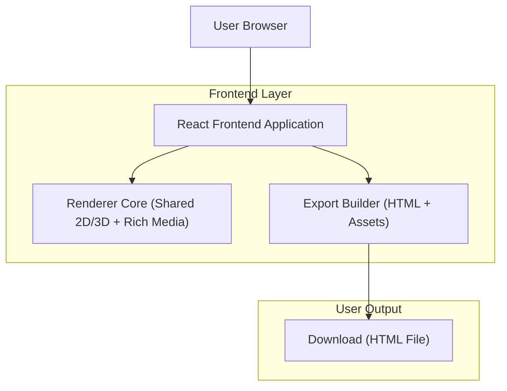

# Knowgrph HTML Canvas Export Document

## 1. Product Overview

- Goal: enable one-click export of the current Canvas workspace to a standalone HTML file that looks and feels identical to the in-app graph workspace.
- Scope: export uses the same renderer matrix (2D D3/Flow/Design/Flow Editor, 3D) and Rich Media/frontmatter behavior as Canvas, with correct centering on an infinite canvas and mobile-friendly viewing.
- Output: a self-contained HTML document (no required backend) that renders the graph on a `<canvas>` (or SVG snapshot) with the same nodes, edges, labels, groups, and Rich Media overlays as the workspace at export time.

## 2. Core Features

### 2.1 Workspace → Export Flow

- Infinite canvas:
  - Pan/zoom on an unbounded workspace.
  - Use Center/Fit to keep the full visible graph reachable at any time.
- Export:
  - Open the Export panel from the Canvas toolbar.
  - Choose scope and quality options.
  - Preview the export using the same renderer and fit rules.
  - Download an HTML file that reproduces the current Canvas view (desktop + mobile).

### 2.2 Export Options

- Scope:
  - Current viewport: capture exactly what is currently visible (including zoom and pan).
  - Fit to content: recompute viewport transform from the graph’s collective bounds and center the content on the canvas.
- Background:
  - Transparent or solid color (using the same design tokens as Canvas).
- Quality:
  - Pixel ratio (1x/2x/3x) for hi-DPI correctness.
  - Canvas sizing derived from viewport and devicePixelRatio.
- UI chrome:
  - Export only the graph surface and HUD; omit host-side panels and toolbars.

### 2.3 Viewer HUD (Exported HTML)

- The exported HTML Canvas viewer exposes a compact HUD that mirrors key Canvas toggles:
  - 2D/3D: switch between 2D SVG-based and 3D views when 3D data is available.
  - Rich: turn Rich Media overlays On/Off without changing GraphData.
  - Media: gate media interaction (e.g. iframe focus) without affecting layout or fit.
  - Frontmatter: toggle Frontmatter Mode On/Off to pick frontmatter graph vs Markdown→JSON-LD pipeline when available.
- All HUD toggles are strictly view-only:
  - They do not mutate GraphData or schema.
  - They reuse the same SSOT visibility, collective-fit, and zoom semantics as Canvas mode.

## 3. Architecture and Data Model

### 3.1 High-Level Architecture

### 3.2 Technology

- Frontend: React 18 + TypeScript + Vite (Canvas app).
- Backend: none required for export; HTML is built fully client-side.

### 3.3 Routes

- `/`: main Graph workspace with infinite canvas + export panel.

### 3.4 Data Model (Export Snapshot)

- GraphDocument:
  - `id`, `title`, `nodes[]`, `edges[]`, theme, viewport (world→screen transform).
- Node:
  - `id`, `position { x, y }`, size, style, label.
- Edge:
  - `id`, `sourceNodeId`, `targetNodeId`, style, label (optional).
- Viewport:
  - `center { x, y }`, `zoom` (used to reconstruct canvas transform).
- Media nodes:
  - Export includes a serialized `mediaNodes` list (id, url, kind, interactive flag) so Rich Media overlays can be reinstated in the viewer.

### 3.5 Centering Algorithm (SSOT)

- Compute world-space bounds for all drawable graph elements (nodes, labels, group envelopes).
- Calculate content centroid from min/max bounds.
- Update viewport transform so the centroid maps to the canvas center, with padding that effectively yields a fit-to-content result.
- Use the same bounds/centroid logic for:
  - Center/Fit in Canvas.
  - Fit-to-content export scope.
  - Initial framing in the exported HTML viewer when using fit-based modes.

### 3.6 Export Fidelity Strategy (SSOT)

- Single render pipeline:
  - Workspace and export call the same renderer entrypoints with the same scene model and style tokens.
  - 2D Flow-based export re-renders via an off-screen SVG using GraphCanvas fit rules and group membership.
- Deterministic layout snapshot:
  - Export uses the current graph state (positions, styles, zoom, visibility) without re-running layout engines.
  - Layout and fit use display-derived graph bounds so exports stay aligned with Canvas.
- HiDPI correctness:
  - Export canvas uses devicePixelRatio-aware scaling.
  - Font metrics and stroke/label scaling follow the same zoom policies as Canvas.
- Packaging:
  - Serialize GraphDocument JSON and media metadata into the HTML payload.
  - Embed a small runtime script that hydrates the viewer and renders the graph and overlays from the serialized snapshot.
  - Inline critical CSS and resolve theme tokens to concrete colors; avoid external network dependencies where possible.

## 4. UI Design and Interaction

### 4.1 Global Styles

- Palette:
  - Workspace background uses the Canvas token background; export background is configurable (transparent or solid).
  - Surface, border, text, accent, and danger colors reuse the shared UI design tokens.
- Typography:
  - Base font 14px, headings 16/18/22.
  - Monospace font used for coordinates and export size readouts when needed.
- Controls:
  - Primary buttons use accent fill; secondary buttons use surface + border.
  - Minimum hit target 40px for mobile-friendly usage.

### 4.2 Graph Workspace Layout

- Desktop:
  - CSS Grid layout with top bar + content rows.
  - Left panel (optional), main Canvas stage, and right inspector (optional) in columns.
- Mobile:
  - Single-column layout.
  - Top bar remains; panels become slide-over drawers.
  - Canvas stage takes the remaining vertical space.

### 4.3 Export Panel

- Container:
  - Desktop: right-side drawer or centered modal.
  - Mobile: full-height bottom sheet with sticky Download action.
- Sections:
  - Export Scope: current viewport vs fit to content.
  - Output: background mode and pixel ratio.
  - Preview: embedded preview canvas that reflects final sizing and fit behavior.
  - Actions: Download HTML (primary) and optional Copy HTML (secondary).
- Responsive behavior:
  - Preview canvas auto-fits the panel width and uses DPR scaling to keep content crisp.

### 4.4 Exported HTML Viewer

- Layout:
  - Full-viewport canvas (100vw × 100vh).
  - HUD overlay anchored in a corner with minimal footprint.
- Desktop interactions:
  - Pointer pan (drag).
  - Wheel/trackpad zoom using the same zoom curves as Canvas.
  - HUD buttons toggle renderer and Rich Media/frontmatter modes without resetting layout.
- Mobile interactions:
  - One-finger pan.
  - Pinch zoom (and optional double-tap zoom) mapped to the same zoom policies as Canvas.
  - Touch drag on nodes, groups, and Rich Media headers when enabled.
- Centering expectations:
  - After Center/Fit or fit-based initialization, all graph elements appear centered with consistent padding.
  - No element should appear offset due to stale viewport origin or export-only transforms.

## 5. Implementation Pointers

- Canvas host and renderer matrix:
  - [knowgrph-canvas-document.md](./knowgrph-canvas-document.md)
  - [knowgrph-renderer-document.md](./knowgrph-renderer-document.md)
- Export builder and viewer:
  - Export entrypoint wiring and HTML generation lives in the Canvas app under:
    - `canvas/src/components/BottomPanel/markdownWorkspace/main/exports/`
    - `canvas/src/lib/graph/htmlCanvasSvgExport.ts`
    - `canvas/src/lib/graph/htmlViewer/buildGraphHtmlViewerMarkup.ts`
    - `canvas/src/lib/graph/htmlViewer/runtimeScript.ts`
- Schema and cross-repo contract:
  - AgenticRAG Canvas directives for renderer matrix, Rich Media overlays, and HTML Canvas export:
    - `huijoohwee.github.io/schema/AgenticRAG/canvas.jsonld`

