# Knowgrph - LLM Prompt Contract PRD-TAD (Implementation-Aligned E2E)

> Scope: MainPanel integrations -> FloatingPanel chat UI -> LLM output -> Markdown YAML frontmatter output -> canvas nodes / subgraphs / groups / clusters / edges.
>
> This revision is implementation-accurate first, enhancement-oriented second. It forbids speculative or conflicting architecture that does not exist in-repo.

---

## 1. Executive Summary

The current repo already has a working upstream path for chat-generated structured Markdown to become live canvas state. That path is not a future standalone orchestrator, a separate JSONB-to-Markdown bridge, or a direct downstream `graphDataSlice` patch. The canonical path today is:

1. MainPanel `SettingsView` and `useSettingsChatAssist` shape chat provider, model, auth, endpoint, and context-scope configuration.
2. FloatingPanel mounts `SidePanelChat` when `floatingPanelView === 'chat'`.
3. `useSidePanelChatSubmit` is a thin submit shell: it resolves the request URL, initializes optimistic UI state, and delegates the async runtime to `executeSidePanelChatSubmitCoordinator()`.
4. `sidePanelChatSubmitCoordinator.ts` owns the async submit lifecycle by composing dedicated helpers for draft bootstrap, request assembly, provider transport fallback, streaming draft writes, and KGC retry/validation.
5. `useFinalizeAssistantSuccess` writes the canonical workspace KGC document and calls `applyChatKgcWorkspaceDocumentToCanvas()`.
6. `applyChatKgcWorkspaceDocumentToCanvas()` loads the saved Markdown into `setActiveMarkdownDocument({ applyViewPreset: true, applyToGraph: true, forceApplyToGraph: true })`.
7. The Markdown parser prefers `tryParseMarkdownFrontmatterFlowGraph()` before generic Markdown or JSON-LD parsing.
8. Frontmatter-flow metadata becomes `GraphData` with `context: 'frontmatter-flow'`.
9. `flow.subgraphs` are normalized into `kg:subgraphs`, then `readSubgraphs()` and `deriveGraphGroups()` project them into rendered groups and cluster underlays.

This document enhances that existing path. It does not invent a second one.

---

## 2. Architecture Truths

### 2.1 Canonical E2E Owners

| Stage | Canonical owner | Current file(s) | Implementation truth |
|---|---|---|---|
| MainPanel chat configuration | MainPanel Settings + settings assist | `canvas/src/features/panels/MainPanel.tsx`, `canvas/src/features/panels/views/SettingsView.tsx`, `canvas/src/features/panels/views/useSettingsChatAssist.tsx` | MainPanel owns chat settings and model discovery, not chat rendering. |
| Floating chat mount | FloatingPanel toolbar view switch | `canvas/src/lib/toolbar/ToolbarToolMenu.impl.tsx`, `canvas/src/components/ui/FloatingPanel.tsx` | FloatingPanel mounts `SidePanelChatLazy` when the chat panel is selected. |
| Chat UI | Side panel chat feature | `canvas/src/features/chat/SidePanelChat.tsx` | SidePanelChat is the active runtime owner for LLM chat UI state and graph/workspace context reads. |
| System prompt contract | Base chat response contracts | `canvas/src/features/chat/chatResponseBaseContract.ts` | `CHAT_BASE_KGC_RESPONSE_CONTRACT_PROMPT` is the current chatKnowgrph KGC contract owner. |
| Submit hook shell | Submit hook shell | `canvas/src/features/chat/sidePanelChat/useSidePanelChatSubmit.ts` | Thin hook shell that resolves endpoint guards, initializes optimistic state, and delegates the async submit lifecycle. |
| Submit preflight | Preflight helpers | `canvas/src/features/chat/sidePanelChat/sidePanelChatSubmitPreflight.ts` | Owns endpoint/model guards, optimistic message setup, cache updates, and trace-draft bootstrap. |
| Submit coordinator | Submit coordinator | `canvas/src/features/chat/sidePanelChat/sidePanelChatSubmitCoordinator.ts` | Owns the async submit lifecycle and composes request-build, transport, streaming, KGC retry/validation, and terminal state helpers. |
| Request build and transport | Submit request and transport helpers | `canvas/src/features/chat/sidePanelChat/sidePanelChatSubmitRequest.ts`, `canvas/src/features/chat/sidePanelChat/sidePanelChatSubmitTransport.ts` | Builds packed context and payload messages, resolves token-limit strategy, retries transport safely, and falls back models upstream. |
| Streaming and KGC retry | Streaming, recovery, and validation helpers | `canvas/src/features/chat/sidePanelChat/sidePanelChatStreaming.ts`, `canvas/src/features/chat/sidePanelChat/sidePanelChatKgcAttempt.ts`, `canvas/src/features/chat/chatMarkdownValidation.ts`, `canvas/src/features/chat/chatHistoryWorkspace.kgc.recovery.ts` | Streams assistant text into live drafts, recovers canonical KGC candidates, validates them, and drives correction-prompt retries without downstream reinterpretation. |
| Final persistence and apply | Finalize success runtime | `canvas/src/features/chat/sidePanelChat/useFinalizeAssistantSuccess.ts` | Writes the canonical KGC workspace file and applies it to canvas through the workspace-document path. |
| Workspace KGC apply | Chat KGC canvas bridge | `canvas/src/features/chat/chatKgcCanvasApply.ts` | Applies saved Markdown by reusing `setActiveMarkdownDocument`, not by local graph patching. |
| Markdown parse priority | Default parser pipeline | `canvas/src/features/parsers/default.ts` | `tryParseMarkdownFrontmatterFlowGraph()` runs before generic Markdown/JSON-LD parsing. |
| Frontmatter-flow parse | Frontmatter-flow parser core | `canvas/src/features/parsers/markdownFrontmatterFlowGraph.core.ts` plus supporting parser modules | Parses YAML frontmatter or body `flow:` blocks, nodes, edges, subgraphs, clusters, and metadata. |
| Interactive import replay | Workspace import path | `canvas/src/features/workspace-fs/applyWorkspaceImportToCanvas.ts`, `canvas/src/features/parsers/frontmatterFlowImportMode.ts`, `canvas/src/features/parsers/applyGraphDataCanonicalBootstrap.ts` | Applies graph data and view presets through canonical import helpers. |
| Group and cluster render | Group derivation and rendering | `canvas/src/lib/graph/subgraphs.ts`, `canvas/src/components/GraphCanvas/layout/graphGroups.ts` | `kg:subgraphs` is the group SSOT; rendered group IDs are `subgraph:${id}`. |
| Graph cache identity | Shared semantic-key helpers | `canvas/src/lib/graph/semanticKey.ts`, `canvas/src/lib/graph/lookupCache.ts` | `buildScopedGraphSemanticKey()` is the upstream semantic signature helper reused across MainPanel, chat, preview, workspace, and canvas flows. |

### 2.2 Current End-to-End Sequence

```mermaid
flowchart LR
  A[MainPanel Settings] --> B[FloatingPanel chat]
  B --> C[SidePanelChat]
  C --> D[useSidePanelChatSubmit shell]
  D --> E[submit preflight]
  D --> F[submit coordinator]
  F --> G[CHAT_BASE_KGC_RESPONSE_CONTRACT_PROMPT]
  F --> H[request build plus provider transport]
  H --> I[streamed assistant text]
  I --> J[upsertChatHistoryWorkspaceDraft]
  I --> K[KGC recovery plus validateChatMarkdown retry]
  K --> L[useFinalizeAssistantSuccess]
  L --> M[appendChatHistoryWorkspaceFile]
  L --> N[applyChatKgcWorkspaceDocumentToCanvas]
  N --> O[setActiveMarkdownDocument]
  O --> P[default markdown parser]
  P --> Q[tryParseMarkdownFrontmatterFlowGraph]
  Q --> R[GraphData context=frontmatter-flow]
  R --> S[applyFrontmatterFlowImportModes]
  R --> T[kg:subgraphs metadata]
  T --> U[readSubgraphs + deriveGraphGroups]
  U --> V[GraphCanvas groups and clusters]
```

### 2.3 Frontmatter Output Reality

The import layer already accepts Markdown with YAML frontmatter presets. The current chatKnowgrph contract, however, is richer than a minimal four-key frontmatter document. The canonical chat path today is a KGC structured Markdown document that contains:

- identity fields such as `title`, `graphId`, `doc_type`, `date`, `ai_model`, and `lang`
- structural blocks such as `$schema`, `spec`, `runner`, `links`, `canvas`, `graph_meta`, `pipeline`, `mermaid`, and `flow`
- `flow.subgraphs` as the grouping source of truth

Therefore:

- Minimal canvas preset keys remain a supported import surface.
- Rich chatKnowgrph output remains the canonical chat contract.
- The PRD must not downgrade chat-generated KGC output into a thinner, lossy frontmatter-only format that drops `flow`, `pipeline`, or `subgraph` semantics.

---

## 3. Stale And Conflicting Architecture Is Forbidden

### 3.1 Hard Prohibitions

The implementation and all future changes under this scope MUST NOT introduce any of the following:

1. A parallel chat orchestrator that bypasses `SidePanelChat` or `useSidePanelChatSubmit`.
2. A separate chat-path JSONB-to-Markdown bridge for canvas apply. The chat path already persists Markdown directly.
3. A Mermaid-only fast path that bypasses `tryParseMarkdownFrontmatterFlowGraph()` as the first Markdown graph parser.
4. A direct downstream `graphDataSlice` merge from assistant text that skips workspace document persistence and `setActiveMarkdownDocument()`.
5. A second grouping model separate from `flow.subgraphs -> kg:subgraphs -> readSubgraphs() -> deriveGraphGroups()`.
6. Local ad hoc graph signature helpers when `buildScopedGraphSemanticKey()` already exists.
7. Legacy alias remaps such as duplicate `clusters` or duplicate grouping payloads when `flow.subgraphs` already owns grouping semantics.
8. Request boilerplate or copied fixture prose that causes duplicate sections, stale labels, hardcoded actors, hardcoded model IDs, or hardcoded retry counts.
9. Passive import-mode seepage that mutates canvas view state during passive source switching.
10. Backward-compatibility shims that preserve stale conflicting owners instead of deleting them.

### 3.2 Upstream SSOT Rules

- Chat contract SSOT: `CHAT_BASE_KGC_RESPONSE_CONTRACT_PROMPT`.
- Chat submit shell SSOT: `useSidePanelChatSubmit`.
- Chat submit lifecycle SSOT: `sidePanelChatSubmitCoordinator.ts` plus its dedicated helper modules.
- Chat finalize/apply SSOT: `useFinalizeAssistantSuccess` plus `applyChatKgcWorkspaceDocumentToCanvas`.
- Markdown graph parse SSOT: `tryParseMarkdownFrontmatterFlowGraph()`.
- Canvas grouping SSOT: `flow.subgraphs` normalized to `kg:subgraphs`.
- Graph identity/cache SSOT: `buildScopedGraphSemanticKey()`.

### 3.3 Root Fix Requirement

If any bug appears anywhere in the chat-to-canvas path, the fix MUST happen at the highest owner in that chain:

- prompt issue -> `chatResponseBaseContract.ts`
- validation issue -> `chatMarkdownValidation`
- persistence/apply issue -> chat workspace persistence or `chatKgcCanvasApply.ts`
- parse issue -> frontmatter-flow parser modules
- grouping issue -> `subgraphs.ts` or `graphGroups.ts`
- cache signature issue -> `semanticKey.ts`

Downstream patches, alias layers, and duplicated transforms are explicitly forbidden.

---

## 4. PRD

### 4.1 Problem Statement

Knowgrph needs one seamless and deterministic path from user intent to interactive graph state. The current repo already has that path, but the documentation is stale: it mixes real owners with speculative components and understates the existing KGC Markdown contract. That stale documentation creates three concrete risks:

1. Engineers may build duplicate chat routing, duplicate parsing, or duplicate graph-apply paths.
2. The LLM prompt contract may regress toward generic prose or minimal frontmatter, causing incomplete or weakly structured canvas imports.
3. Group, cluster, and subgraph semantics may drift if future work treats them as separate parallel concepts instead of one normalized metadata pipeline.

The requirement is to harden the current upstream contract, document the actual runtime, and explicitly forbid stale or conflicting architecture at the source.

### 4.2 Product Goal

A user configures chat from MainPanel, opens FloatingPanel chat, submits a request, receives one request-shaped KGC Markdown document, and sees the resulting nodes, edges, subgraphs, groups, and clusters applied through the canonical workspace-document import path without duplicate transforms, stale aliases, or local graph patch layers.

### 4.3 Personas

| ID | Persona | Job to be done | Pain today |
|---|---|---|---|
| P1 | Solo founder / primary operator | Turn a prompt into an immediately usable graph document and canvas graph | Stale docs obscure the real pipeline and invite duplicate implementation paths. |
| P2 | Maintainer | Extend chat-to-canvas behavior safely | Mixed proposed-vs-real architecture makes root ownership unclear. |
| P3 | Future agent / automation loop | Rely on deterministic KGC Markdown output | Weak contracts can produce prose or malformed KGC documents that need retry or fallback. |

### 4.4 In Scope

- MainPanel chat settings and integration posture.
- FloatingPanel chat mounting and SidePanelChat ownership.
- KGC structured Markdown prompt contract for `chatKnowgrph`.
- Streaming draft persistence, correction retry, canonical workspace persistence, and canvas apply.
- Frontmatter-flow parsing of nodes, edges, subgraphs, clusters, groups, and import modes.
- Shared semantic-key reuse and stale-path elimination.

### 4.5 Out Of Scope

- External agent frameworks.
- A separate seeder / JSONB / bridge pipeline for the chat path.
- Replacing the workspace-document apply path with direct store mutations.
- Reworking Cloudflare deployment topology.
- Schema-config authoring beyond noting its adjacency to this chat KGC contract.

---

## 5. PRD Epics And Acceptance Criteria

### PRD-E1 - MainPanel And FloatingPanel Chat Integration

#### User story

As a maintainer, I want MainPanel settings and FloatingPanel chat to remain one connected runtime so that provider, model, auth, endpoint, and context scope are configured upstream once and consumed downstream once.

#### Acceptance criteria

**PRD-E1-AC1**  
Given a user changes provider, endpoint, model, or context scope in MainPanel settings,  
when FloatingPanel chat submits a request,  
then `useSidePanelChatSubmit` MUST use those same store-backed values for request URL, headers, provider options, and context packing.

**PRD-E1-AC2**  
Given the user opens the chat floating view,  
when `floatingPanelView === 'chat'`,  
then the UI MUST mount `SidePanelChatLazy` and no second chat renderer or second request path may exist.

**PRD-E1-AC3**  
Given the graph is active,  
when MainPanel and SidePanelChat both need graph-aware context,  
then both paths MUST reuse the shared semantic-key and cached lookup helpers instead of computing local incompatible signatures.

#### Success metric

- Zero duplicate chat runtime owners.
- Zero alternate chat request pipelines.
- Shared graph-context identity remains cache-stable across MainPanel and chat surfaces.

---

### PRD-E2 - KGC Prompt Contract Hardening

#### User story

As a graph author, I want `chatKnowgrph` to always request and persist one valid KGC structured Markdown document so that the canvas can apply it directly and predictably.

#### Acceptance criteria

**PRD-E2-AC1**  
Given `chatStorageTarget === 'chatKnowgrph'`,  
when a request is submitted,  
then the first system prompt MUST be `CHAT_BASE_KGC_RESPONSE_CONTRACT_PROMPT`, not the generic chat response contract.

**PRD-E2-AC2**  
Given the LLM streams a response for `chatKnowgrph`,  
when the response is complete,  
then it MUST contain exactly one parseable standalone KGC Markdown document that begins with YAML frontmatter and is accepted by `isKgcStructuredMarkdown()`.

**PRD-E2-AC3**  
Given the KGC document includes graph structure,  
when it references nodes, edges, and groups,  
then `pipeline`, `flow.nodes`, `flow.edges`, `mermaid`, and `flow.subgraphs` MUST remain in sync and MUST NOT introduce duplicate cluster aliases or stale parallel grouping blocks.

**PRD-E2-AC4**  
Given the request provides actor, product, objective, or artifact context,  
when the LLM writes the KGC document,  
then it MUST generate request-shaped prose and resolve only context-supported Tier B values; it MUST NOT paste template prose, duplicate sections, or inject stale labels such as `Request Intent`, `Monetization Focus`, or `Stack` unless the user explicitly asked for those labels.

**PRD-E2-AC5**  
Given actor, model, and retry semantics are referenced inside the graph contract,  
when the KGC document is generated,  
then the prompt contract MUST require variable-driven values such as `{{subject}}`, `{{ai_model}}`, and `{{runtime.maxRetry}}`, and MUST forbid hardcoded replacements that desynchronize the graph from the runtime.

#### Success metric

- First-pass structured KGC output is parseable and validator-clean in the majority of chatKnowgrph runs.
- No stale labels or duplicate sections survive persistence normalization.
- Group and cluster semantics remain canonical through `flow.subgraphs`.

---

### PRD-E3 - Workspace-First KGC Persistence And Apply

#### User story

As a maintainer, I want assistant output to become canvas state only through the saved workspace document path so that streaming, persistence, apply, retries, and replay all stay deterministic.

#### Acceptance criteria

**PRD-E3-AC1**  
Given a chatKnowgrph request is streaming,  
when assistant deltas arrive,  
then the runtime MUST write a live draft through `upsertChatHistoryWorkspaceDraft()` and follow the trace companion workspace path instead of waiting for the final response before any persisted artifact exists.

**PRD-E3-AC2**  
Given the final assistant response succeeds,  
when `useFinalizeAssistantSuccess` runs,  
then it MUST persist the canonical KGC workspace file and call `applyChatKgcWorkspaceDocumentToCanvas()`.

**PRD-E3-AC3**  
Given `applyChatKgcWorkspaceDocumentToCanvas()` is called,  
when the workspace document is eligible for graph application,  
then the apply path MUST reuse `setActiveMarkdownDocument({ applyViewPreset: true, applyToGraph: true, forceApplyToGraph: true })` and MUST NOT patch graph state directly from raw assistant text.

**PRD-E3-AC4**  
Given the first returned KGC Markdown fails structural validation,  
when retry budget remains,  
then `sidePanelChatSubmitCoordinator.ts` with `sidePanelChatKgcAttempt.ts` MUST build a correction prompt from the first validation error and retry the same upstream contract instead of switching to a parallel fallback architecture.

#### Success metric

- One canonical saved KGC document per chat turn.
- One trace companion path per KGC session timestamp.
- No direct raw-text-to-graph patch path exists outside workspace-document apply.

---

### PRD-E4 - Frontmatter Flow Graph And Group Pipeline

#### User story

As a graph author, I want chat-generated KGC Markdown to become nodes, edges, subgraphs, groups, and clusters through the canonical parser and group pipeline so that canvas semantics stay consistent across chat, imports, and source-file composition.

#### Acceptance criteria

**PRD-E4-AC1**  
Given a Markdown document enters the parser stack,  
when it contains frontmatter-flow graph content,  
then `default.ts` MUST prefer `tryParseMarkdownFrontmatterFlowGraph()` before generic Markdown or JSON-LD parsing.

**PRD-E4-AC2**  
Given a KGC document contains a YAML frontmatter `flow:` block or body `flow:` block,  
when `tryParseMarkdownFrontmatterFlowGraph()` parses it,  
then it MUST return `GraphData` with `context: 'frontmatter-flow'`, normalized nodes, normalized edges, and metadata built by the frontmatter-flow compose helpers.

**PRD-E4-AC3**  
Given the document defines subgraphs or clusters,  
when parsing completes,  
then `flow.subgraphs` and normalized cluster-derived subgraphs MUST converge into one `kg:subgraphs` metadata channel, and rendered canvas groups MUST be derived from that channel only.

**PRD-E4-AC4**  
Given graph import is interactive,  
when graph data is applied,  
then frontmatter-flow import modes and canvas presets MUST be replayed through the canonical import helpers; passive source switching MUST NOT leak those view mutations.

**PRD-E4-AC5**  
Given a node definition is emitted by the prompt contract,  
when it is parsed into frontmatter-flow graph data,  
then it MUST NOT include manual `position:` overrides because auto layout and import-mode geometry own placement.

#### Success metric

- Zero duplicate grouping channels.
- Zero stale preset replay regressions.
- Nodes, edges, and groups stay round-trippable through the same frontmatter-flow graph contract.

---

### PRD-E5 - Shared Semantic Key And Stale-Path Elimination

#### User story

As a maintainer, I want chat, MainPanel, workspace, and graph views to share one semantic identity model so that cache reuse, diff detection, and apply decisions stay stable without recomputation churn.

#### Acceptance criteria

**PRD-E5-AC1**  
Given any graph-aware UI surface needs a graph identity key,  
when it computes a cache signature,  
then it MUST reuse `buildScopedGraphSemanticKey()` and the shared lookup cache helpers rather than define a local semantic signature scheme.

**PRD-E5-AC2**  
Given workspace import or source-file composition already owns graph application,  
when new work extends the chat-to-canvas path,  
then it MUST reuse those apply helpers and MUST NOT fork duplicate graph-owning compose logic.

**PRD-E5-AC3**  
Given stale or conflicting runtime owners are discovered,  
when the pipeline is updated,  
then the stale path MUST be removed rather than preserved behind compatibility remaps.

#### Success metric

- Reduced duplicate graph recomputation.
- No parallel cache key formats.
- No stale architecture left alive behind aliases.

---

## 6. Enhanced LLM Prompt Contract

### 6.1 Contract Owner

The enhanced contract is an upstream extension of `CHAT_BASE_KGC_RESPONSE_CONTRACT_PROMPT`. This PRD-TAD does not define a second prompt source.

### 6.2 Contract Goals

The prompt contract MUST produce Markdown that is simultaneously:

- valid as a standalone KGC workspace document
- structurally parseable by the current frontmatter-flow parser path
- request-shaped instead of template-cloned
- compatible with group, cluster, and canvas import semantics already present in-repo
- resistant to stale labels, duplicated sections, hardcodes, and parallel grouping aliases

### 6.3 Required Output Properties

The enhanced contract MUST require all of the following:

1. Exactly one standalone KGC document.
2. YAML frontmatter first chunk.
3. Canonical KGC structural blocks preserved: `$schema`, `spec`, `runner`, `links`, `canvas`, `graph_meta`, `pipeline`, `mermaid`, and `flow`.
4. `flow.subgraphs` emitted as the canonical grouping surface.
5. Node IDs, edge IDs, and group references synchronized across `pipeline`, `flow.nodes`, `flow.edges`, and `mermaid`.
6. Variable-driven actor, model, and retry fields.
7. Request-responsive body prose that adapts to the user request rather than cloning fixture sentences.
8. No duplicate sections or conflicting headings.
9. No manual `position:` on `flow.nodes`.
10. No secrets, no environment-specific paths, and no hardcoded provider credentials.

### 6.4 Enhanced Anti-Stale Rules

The enhanced contract MUST explicitly forbid:

- returning prose plus a partial KGC fragment instead of one full KGC document
- returning a minimal canvas-preset-only document when the chatKnowgrph path expects the full KGC contract
- duplicate cluster channels such as separate legacy `clusters:` payloads when `flow.subgraphs` already owns grouping semantics
- hardcoded domain roles in actor arrays
- hardcoded model identifiers in sys_event or flow node data
- hardcoded retry counts in validation or retry arcs
- legacy canned body labels unless the user explicitly requested those labels
- duplicate directive echoing from long prompts
- separate downstream instructions that reinterpret the generated graph outside the saved Markdown document

### 6.5 Frontmatter And Grouping Guidance

The enhanced contract MUST treat grouping semantics as follows:

- `flow.subgraphs` is the authoring surface.
- `kg:subgraphs` is the normalized metadata surface.
- `readSubgraphs()` is the read model.
- `deriveGraphGroups()` is the render projection.

The prompt contract MUST NOT create a second first-class grouping representation for the same graph.

### 6.6 Request-Shaped Section Behavior

The current prompt already supports request-responsive sections. This PRD-TAD tightens that behavior:

- If the user explicitly asks for `Use Case`, `Problem`, `Solution`, `User Flow`, `Work Flow`, `Data Flow`, `Monetization`, or `Integration`, the output SHOULD include those exact labels.
- If the user does not ask for those sections, the prompt MUST NOT inject them as default filler.
- If the request is generic, the output MUST stay neutral and avoid domain-specific carryover.
- If the request includes concrete context, the output SHOULD resolve Tier B identity fields conservatively and keep unresolved values explicit instead of invented.

### 6.7 Validation Contract

The enhanced prompt contract remains coupled to validator behavior:

- `isKgcStructuredMarkdown()` checks structural completeness.
- `validateChatMarkdown()` checks rule compliance.
- `buildCorrectionPrompt()` re-prompts against the first failed rule.

Therefore the prompt contract MUST be authored so that validator failure drives upstream correction, not downstream patching.

---

## 7. TAD

### 7.1 Technical Decision Summary

| Decision | Status | Rationale |
|---|---|---|
| Reuse `CHAT_BASE_KGC_RESPONSE_CONTRACT_PROMPT` as the sole chatKnowgrph contract owner | Accepted | Avoids prompt duplication and keeps fixes upstream. |
| Reuse workspace-document apply path for chat-generated KGC Markdown | Accepted | Keeps persistence, replay, and graph application deterministic. |
| Keep `tryParseMarkdownFrontmatterFlowGraph()` as the first Markdown graph parser | Accepted | Prevents duplicate or lossy parser forks. |
| Keep `flow.subgraphs -> kg:subgraphs -> deriveGraphGroups()` as the grouping pipeline | Accepted | Prevents duplicate cluster/group owners. |
| Reuse `buildScopedGraphSemanticKey()` everywhere graph identity is needed | Accepted | Prevents recomputation churn and signature drift. |
| Delete stale competing paths instead of aliasing them | Accepted | Aligns with root-fix and no-backcompat-shim rules. |

### 7.2 Component Specification

#### TAD-C01 - MainPanel Chat Configuration

- Owner: `SettingsView` and `useSettingsChatAssist`.
- Responsibility: provider presets, endpoint resolution, model discovery, context-scope selection, and integration enablement.
- Constraint: configuration is upstream-only; chat rendering and request submission must not define competing config sources.

#### TAD-C02 - FloatingPanel Chat Mount

- Owner: `ToolbarToolMenu.impl.tsx` with `SidePanelChatLazy`.
- Responsibility: mount the chat UI when the floating panel is in chat mode.
- Constraint: no second chat entrypoint inside MainPanel.

#### TAD-C03 - SidePanelChat Runtime

- Owner: `SidePanelChat.tsx`.
- Responsibility: read graph data, current node, markdown text, workspace context cache key, and chat settings from the store.
- Constraint: graph context and workspace context must reuse shared cache and signature helpers.

#### TAD-C04 - Submit Shell / Coordinator / Helpers

- Owners:
  - `useSidePanelChatSubmit.ts`
  - `sidePanelChatSubmitPreflight.ts`
  - `sidePanelChatSubmitCoordinator.ts`
  - `sidePanelChatSubmitRequest.ts`
  - `sidePanelChatSubmitTransport.ts`
  - `sidePanelChatStreaming.ts`
  - `sidePanelChatKgcAttempt.ts`
- Responsibility:
  - keep `useSidePanelChatSubmit.ts` as a thin shell for request-url guards and optimistic submit setup
  - choose KGC or generic contract by `chatStorageTarget` during request-build
  - resolve endpoint and provider request options through dedicated request and transport helpers
  - stream SSE deltas and persist live drafts through the streaming helper
  - validate KGC Markdown and retry with correction prompts through the KGC attempt helper plus validator/recovery modules
  - keep async lifecycle ownership centralized in `sidePanelChatSubmitCoordinator.ts`
- Constraint: submit-flow enhancements must land in the existing shell-plus-helper stack, not in a second orchestrator and not by re-monolithizing the hook.

#### TAD-C05 - Finalize / Persist / Apply

- Owner: `useFinalizeAssistantSuccess.ts` plus `chatKgcCanvasApply.ts`.
- Responsibility:
  - append canonical workspace document
  - normalize canonical KGC path
  - follow workspace path
  - call `applyChatKgcWorkspaceDocumentToCanvas()`
- Constraint: canvas application must reuse `setActiveMarkdownDocument()`.

#### TAD-C06 - KGC Workspace Path Contract

- Owner: `chatHistoryWorkspace.paths.ts`.
- Responsibility: canonical `kgc_YYYYMMDDHHMMSS.md`, trace companion `kgc-trace_YYYYMMDDHHMMSS.md`, and output companion `kgc-output_YYYYMMDDHHMMSS.*` path derivation.
- Constraint: path identity is part of the runtime contract; ad hoc filename schemes are forbidden.

#### TAD-C07 - Markdown Graph Parse Priority

- Owner: `features/parsers/default.ts`.
- Responsibility: prefer frontmatter-flow parsing before generic Markdown parse.
- Constraint: no Mermaid-only side parser may supersede this entry order for chat-generated Markdown.

#### TAD-C08 - Frontmatter-Flow Graph Parser

- Owner: `markdownFrontmatterFlowGraph.core.ts` and its parser modules.
- Responsibility:
  - parse YAML-frontmatter and body `flow:` variants
  - normalize nodes, edges, connections, socket types, clusters, and subgraphs
  - emit `GraphData` with `context: 'frontmatter-flow'`
- Constraint: grouping and graph semantics are normalized here once.

#### TAD-C09 - Import Mode Application

- Owner: `applyGraphDataCanonicalBootstrap.ts`, `frontmatterFlowImportMode.ts`, and `applyWorkspaceImportToCanvas.ts`.
- Responsibility: apply graph data, frontmatter-flow import modes, and canvas presets without leaking interactive view mutations into passive paths.
- Constraint: active import and passive source switching must remain separate.

#### TAD-C10 - Group And Cluster Rendering

- Owner: `subgraphs.ts` and `graphGroups.ts`.
- Responsibility: read normalized `kg:subgraphs` metadata and project it into rendered group underlays and nested group structures.
- Constraint: rendered groups are a projection, not an independent authoring model.

#### TAD-C11 - Shared Graph Semantic Identity

- Owner: `semanticKey.ts` and `lookupCache.ts`.
- Responsibility: stable graph-structure signatures and scope-aware semantic keys for reuse across graph-aware UI surfaces.
- Constraint: no local substitute helper may fork semantic identity behavior.

### 7.3 Data Contracts

#### DC-01 - Chat Storage Target

- `chatKnowgrph` -> KGC structured Markdown contract.
- `chatHistory` -> generic chat response contract.
- The PRD enhancement MUST NOT blur these two output modes.

#### DC-02 - KGC Workspace File Identity

- Canonical file: `kgc_<timestamp>.md`
- Trace file: `kgc-trace_<timestamp>.md`
- Output companion: `kgc-output_<timestamp>.<ext>`

The runtime MUST persist and normalize to these forms instead of inventing alternate file identity patterns.

#### DC-03 - Frontmatter Graph Identity

- Graph context: `frontmatter-flow`
- Group metadata key: `kg:subgraphs`
- Group render ID: `subgraph:<id>`

#### DC-04 - Prompt And Validator Coupling

- Prompt contract emits structured KGC Markdown.
- Validator checks structural and syntactic rules.
- Correction prompt reuses the same output contract.
- Finalize persists the validated or best-available KGC document.

### 7.4 Failure Handling

| Failure point | Current owner | Required behavior |
|---|---|---|
| Missing endpoint or model | `sidePanelChatSubmitPreflight.ts` via `useSidePanelChatSubmit` | Abort early with UI error; do not create alternate request path. |
| Provider request 400/429/model mismatch | `sidePanelChatSubmitTransport.ts` via `sidePanelChatSubmitCoordinator.ts` | Retry token parameter fallback or model fallback in the same runtime. |
| Empty assistant response | `sidePanelChatStreaming.ts` plus `sidePanelChatSubmitCoordinator.ts` | Surface explicit error and do not persist partial final content as success. |
| Invalid KGC structure | `validateChatMarkdown` + `buildCorrectionPrompt` | Retry upstream contract before finalize. |
| Persist/apply mismatch | `useFinalizeAssistantSuccess` / `chatKgcCanvasApply.ts` | Persist canonical file first, then apply through workspace-document import. |
| Parse failure | parser stack | Fall back inside the existing parser chain only; do not spawn a parallel parser owner. |
| Group rendering mismatch | `subgraphs.ts` / `graphGroups.ts` | Fix normalization or projection at the root; do not duplicate group metadata. |

### 7.5 Performance And Stability Constraints

- Draft writes should remain throttled during SSE streaming; no per-character synchronous graph apply.
- Final graph application occurs after canonical workspace persistence, not on every stream chunk.
- Passive source-file parsing must remain passive.
- Group derivation must read normalized metadata and avoid recomputing alternative group registries.
- Graph cache identity must reuse the shared semantic-key helper.

---

## 8. Validation And Traceability

### 8.1 Current Validation Surfaces

| Surface | Existing test / code guard | What it proves |
|---|---|---|
| Prompt snippets and contract wording | `canvas/src/__tests__/chatResponseContractPrompt.test.ts` | KGC and generic prompt contracts include required structural guidance. |
| Structured KGC compatibility | `chatResponseContractPrompt.test.ts` | Base template and deterministic fallback are parseable by frontmatter-flow parser and validation rules. |
| Submit helper ownership | `chatResponseContractPrompt.test.ts` | Thin hook delegation, request-build, transport fallback, preflight, coordinator, and KGC retry helpers stay decomposed and behaviorally aligned. |
| Finalize-to-canvas apply path | `chatResponseContractPrompt.test.ts` | Finalize uses `applyChatKgcWorkspaceDocumentToCanvas()` and the workspace-document apply flags. |
| Frontmatter-flow parse behavior | `frontmatterFlowNodeNormalize.test.ts` | Frontmatter-flow node and subgraph normalization stays valid. |
| Passive import-mode guard | `frontmatterFlowImportModeSeepageRegression.test.ts` | Passive flows do not replay interactive import modes. |
| Source-file apply guard | `sourceFilesIngestStaleGuard.test.ts` | Workspace import and composed graph apply stay on the canonical graph-owning path. |
| Shared semantic-key reuse | `sourceFilesIngestStaleGuard.test.ts` and other regressions | Graph identity remains rooted in `buildScopedGraphSemanticKey()`. |

### 8.2 Required PRD-To-TAD Traceability

| PRD epic | TAD owner(s) | Validation owner |
|---|---|---|
| PRD-E1 | TAD-C01, TAD-C02, TAD-C03, TAD-C11 | settings assist behavior + graph semantic-key reuse tests |
| PRD-E2 | TAD-C04, TAD-C08 | `chatResponseContractPrompt.test.ts`, validator behavior |
| PRD-E3 | TAD-C04, TAD-C05, TAD-C06 | finalize/apply test plus workspace path helpers |
| PRD-E4 | TAD-C07, TAD-C08, TAD-C09, TAD-C10 | parser and import-mode regression tests |
| PRD-E5 | TAD-C09, TAD-C10, TAD-C11 | stale-guard and semantic-key reuse tests |

### 8.3 Definition Of Done

This scope is done only when all of the following are true:

1. The docs describe only real in-repo runtime owners for the current chat-to-canvas path.
2. The enhanced prompt contract is specified as an upstream change to `CHAT_BASE_KGC_RESPONSE_CONTRACT_PROMPT`.
3. Group and cluster semantics are documented as one normalized pipeline, not parallel concepts.
4. Stale or speculative components are removed from the canonical doc rather than kept as competing proposed owners.
5. Focused validation remains tied to existing tests and parser/import guards.

---

## 9. Implementation Guidance For The Next Code Pass

This document update does not itself change runtime code, but it sets the exact direction for the next implementation pass.

### 9.1 Safe Enhancement Targets

1. `chatResponseBaseContract.ts`
   - tighten anti-duplicate and anti-stale wording
   - reinforce `flow.subgraphs` as the grouping SSOT
   - reinforce request-shaped section behavior
2. `chatMarkdownValidation`
   - reject any newly discovered duplicate grouping or stale heading patterns
3. `chatHistoryWorkspace.kgc.build`
   - preserve request-shaped normalization and continue stripping stale canned labels
4. `chatResponseContractPrompt.test.ts`
   - add focused assertions for any newly tightened prompt requirements

### 9.2 Unsafe Changes To Avoid

1. Adding a new chat orchestrator hook for the same request path.
2. Adding a direct assistant-text-to-graph mutation helper.
3. Adding a second grouping metadata format next to `kg:subgraphs`.
4. Introducing compatibility remaps for stale prompt shapes instead of fixing the prompt and validator upstream.
5. Replacing shared semantic-key helpers with local hash logic.

---

## 10. Open Questions

| ID | Question | Why it matters | Current direction |
|---|---|---|---|
| OQ-01 | Should the enhanced KGC contract explicitly require classic canvas preset keys in addition to the existing `canvas:` block? | The import layer accepts presets, but the canonical chat contract is already richer. | Prefer the richer KGC contract as SSOT; add classic keys only if there is a concrete import benefit without duplication. |
| OQ-02 | Which new validator rules belong in `validateChatMarkdown()` versus prompt-only wording? | Over-validating can cause churn; under-validating can allow drift. | Add only rules that prevent deterministic structural regressions. |
| OQ-03 | Should prompt tests assert `flow.subgraphs` wording more strongly? | Group semantics are central to this pipeline. | Yes, if implemented as a focused prompt regression. |
| OQ-04 | Should canonical KGC persistence expose a stronger UI signal when the validator had to retry? | Better debugging for malformed model output. | Safe follow-up if it does not create a second state channel. |
| OQ-05 | Are there any remaining stale docs that still mention the removed speculative bridge/orchestrator/parser owners? | Canonical docs must not compete. | Audit adjacent docs after this rewrite. |

---

## 11. Final Decision

Knowgrph already owns a coherent chat-to-canvas pipeline. The correct strategy is to strengthen and document that existing upstream path, not to add new layers.

Therefore the architecture decision is final for this scope:

- MainPanel config stays upstream.
- FloatingPanel chat stays the chat UI owner.
- `useSidePanelChatSubmit` stays a thin submit shell.
- `sidePanelChatSubmitCoordinator.ts` plus the existing submit helpers stay the async submit / stream / validate owner.
- `useFinalizeAssistantSuccess` plus `applyChatKgcWorkspaceDocumentToCanvas()` stays the persistence / apply owner.
- `tryParseMarkdownFrontmatterFlowGraph()` stays the first Markdown graph parser.
- `flow.subgraphs -> kg:subgraphs -> deriveGraphGroups()` stays the grouping pipeline.
- `buildScopedGraphSemanticKey()` stays the semantic identity helper.

Everything stale, speculative, duplicate, conflicting, or downstream-patched is forbidden.

---

*Document ID: `knowgrph-llm-prompt-contract-prd-tad-proposed`*  
*Version: `0.3.1`*  
*Updated: `2026-05-22`*
