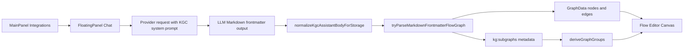

# Knowgrph LLM Prompt Contract - PRD and TAD

**Version**: 0.2.0  
**Status**: Implemented  
**Scope**: MainPanel Integrations -> FloatingPanel Chat UI -> LLM output -> YAML frontmatter -> Canvas nodes, subgraphs, groups, clusters, and edges.

## Architecture Guard

This document is implementation-accurate for the current Knowgrph repo. It forbids stale claims that the product needs a new Mermaid AST lift for the KGC chat path. The active path is frontmatter-first:

1. MainPanel Integrations selects provider/auth/endpoint settings through `SettingsView` and shared integration SSOT rows.
2. FloatingPanel Chat uses `SidePanelChat` and `useSidePanelChatSubmit`.
3. `chatKnowgrph` mode prepends `CHAT_BASE_KGC_RESPONSE_CONTRACT_PROMPT`.
4. LLM output must be one standalone Markdown document beginning with YAML frontmatter.
5. `normalizeKgcAssistantBodyForStorage` accepts parseable KGC output or builds a deterministic fallback.
6. `tryParseMarkdownFrontmatterFlowGraph` parses frontmatter `flow.nodes`, `flow.edges`, and `flow.subgraphs`.
7. `flow.subgraphs` is projected into canonical `kg:subgraphs` graph metadata.
8. `deriveGraphGroups` turns `kg:subgraphs` into Canvas groups and cluster underlays.
9. Flow Editor renders interactive nodes, edges, handles, groups, and nested group relationships.

Forbidden implementation patterns:

- Do not add a separate Mermaid-to-GraphData path for `chatKnowgrph`.
- Do not remap legacy `clusters:` aliases as a compatibility layer for new KGC output.
- Do not hardcode provider, model, endpoint, or domain-specific graph node fixtures.
- Do not re-scan graph nodes in chat surfaces when shared graph lookup and semantic keys exist.
- Do not add renderer-local guards for duplicate graph apply work; use the upstream markdown apply semantic-key gate.
- Do not describe Source Files selection as an implicit YAML/frontmatter apply trigger.

## PRD

### Problem

Graph authors use FloatingPanel Chat to ask an LLM for a workflow, PRD/TAD, or execution plan. Without a strict output contract, the response may be prose-only, partially structured, or visually diagrammed but not materialized as Canvas graph data. The product need is not another downstream renderer patch; it is a single upstream response contract that produces parseable frontmatter graph data on the first pass.

### Users

Graph Author: asks for a graph-backed planning or implementation document and expects the result to open as editable Markdown plus interactive Flow Editor nodes.

Operator: configures provider settings in MainPanel Integrations and expects the same Chat UI behavior across OpenAI-compatible, Gemini, BytePlus, and BYOK-style provider paths.

Agentic Workflow: needs a deterministic validation surface that proves the output parsed into nodes, edges, and groups without visual inspection.

### Goals

| ID | Goal |
|---|---|
| G1 | Make `chatKnowgrph` LLM responses start with canonical YAML frontmatter and no wrapper prose. |
| G2 | Keep graph structure in `flow.nodes`, `flow.edges`, and `flow.subgraphs`, not in prose-only Mermaid diagrams. |
| G3 | Project subgraphs and clusters through existing `kg:subgraphs` metadata so Canvas group rendering remains shared. |
| G4 | Reuse shared semantic-key helpers for parser/apply/cache identities that can otherwise churn. |
| G5 | Keep provider configuration in MainPanel Integrations independent from graph output semantics. |

### Non-Goals

Live partial graph mutation during streaming is out of scope. The stream may draft text, but the graph applies after a complete parseable document is available.

Backward compatibility for new legacy aliases is out of scope. Existing parser support can remain where already owned, but this contract does not add new local remapping paths.

Renderer-specific graph shape forks are out of scope. `FlowEditor`, D3, and other consumers should read the same GraphData and group metadata.

### User Stories

| ID | Story | Acceptance |
|---|---|---|
| S1 | As a graph author, I want chat output saved as a KGC Markdown document. | The response starts with `---`, validates as KGC structured Markdown, and stores under the canonical `kgc_*.md` workspace path. |
| S2 | As a graph author, I want generated nodes to be editable Canvas nodes. | `tryParseMarkdownFrontmatterFlowGraph` returns `graphData.nodes.length > 0` from `flow.nodes`. |
| S3 | As a graph author, I want generated edges to keep handle semantics. | `flow.edges[*]` maps source/target handles into parsed graph edges without a duplicate edge pass. |
| S4 | As a graph author, I want subgraphs and clusters visible as Canvas groups. | `flow.subgraphs[*]` projects into `metadata["kg:subgraphs"]`, and `deriveGraphGroups` renders user subgraph groups. |
| S5 | As an operator, I want Integrations settings to affect provider calls only. | Provider selection changes chat endpoint/auth behavior without changing the graph parser contract. |

### Required KGC Output Shape

```yaml
---
kgFrontmatterModeEnabled: true
kgDocumentSemanticMode: document
kgCanvasSurfaceMode: 2d
kgCanvas2dRenderer: flowEditor
runtime:
  maxRetry: {key: maxRetry, type: number, value: 3}
pipeline:
  - seq: S01
    node: n-trigger
mermaid: |
  flowchart LR
    subgraph P1["Context"]
      n-trigger --> n-pack
    end
flow:
  direction: {key: direction, type: string, value: LR}
  edgeType: {key: edgeType, type: string, value: smoothstep}
  nodes:
    - id: {key: id, type: string, value: "n-trigger"}
      type: {key: type, type: string, value: "input"}
      label: {key: label, type: string, value: "Trigger"}
      handles: {key: handles, type: object, value: {source: [signal]}}
    - id: {key: id, type: string, value: "n-pack"}
      type: {key: type, type: string, value: "default"}
      label: {key: label, type: string, value: "Pack"}
      handles: {key: handles, type: object, value: {target: [signal]}}
  subgraphs:
    - {id: sg-context, kind: subgraph, label: "Context", memberNodeIds: [n-trigger, n-pack], parentId: null}
  edges:
    - {id: e1, source: n-trigger, sourceHandle: signal, target: n-pack, targetHandle: signal, label: "signal", animated: true}
---
```

`mermaid` remains a readable projection. `flow` is the graph SSOT for chat-generated Canvas materialization.

## TAD

### Component Ownership

| Component | Current owner | Responsibility |
|---|---|---|
| MainPanel Integrations | `canvas/src/features/panels/views/SettingsView.tsx` and constants/helpers | Provider settings, auth mode, endpoint rows, API docs text. |
| FloatingPanel Chat | `canvas/src/features/chat/SidePanelChat.tsx` | Chat UI, storage target, selected node context, shared graph lookup. |
| Chat submission | `canvas/src/features/chat/sidePanelChat/useSidePanelChatSubmit.ts` | Builds provider request, injects KGC contract, validates/retries output. |
| KGC response contract | `canvas/src/features/chat/chatResponseBaseContract.ts` | System prompt that requires frontmatter, `flow.nodes`, `flow.edges`, and `flow.subgraphs`. |
| KGC fallback | `canvas/src/features/chat/chatHistoryWorkspace.kgc.baseFallback.ts` | Deterministic parseable fallback when model output is incomplete. |
| KGC parser | `canvas/src/features/parsers/markdownFrontmatterFlowGraph.core.ts` and `.flowBlock.ts` | Converts frontmatter flow blocks into GraphData and canonical group metadata. |
| Group metadata | `canvas/src/lib/graph/subgraphs.ts` | `kg:subgraphs` read/write contract. |
| Canvas groups | `canvas/src/components/GraphCanvas/layout/graphGroups.ts` | Projects `kg:subgraphs` into rendered groups/clusters. |
| Apply dedupe | `canvas/src/hooks/store/graph-data-slice/graphDataDocumentActions.ts` | Shared semantic-key gate for markdown document graph apply requests. |

### Data Flow



### Parser Contract

`normalizeMetaWithFlowBlock` reads `flow.nodes`, `flow.edges`, and `flow.subgraphs`. It resolves typed inline `{key,type,value}` envelopes before normalizing.

`flow.subgraphs` entries use:

| Field | Type | Rule |
|---|---|---|
| `id` | string | Stable group id without renderer prefix. |
| `kind` | `subgraph` or `cluster` | `cluster` affects group styling; default is `subgraph`. |
| `label` | string | Rendered Canvas group label. |
| `memberNodeIds` | string[] | Must reference normalized `flow.nodes[*].id`. Unknown members are dropped upstream. |
| `parentId` | string or null | Enables nested Canvas groups through existing group nesting helpers. |

The parser writes valid entries to `metadata["kg:subgraphs"]`. Canvas code then derives group ids with `subgraphGroupId(id)`, so the renderer-visible group id is `subgraph:<id>`.

### Semantic-Key Contract

Frontmatter flow source identity includes stable id, node signature, edge signature, and subgraph signature. It uses `buildScopedGraphSemanticKey("frontmatter-flow-source-layer", ...)` so subgraph-only changes invalidate the same upstream graph/group derivation caches that node/edge changes use.

Markdown graph application continues through `setActiveMarkdownDocument(... applyToGraph)` and `applyMarkdownDocumentToGraph`. Duplicate apply suppression remains in `buildMarkdownApplyRequestSemanticKey`; no chat-specific apply dedupe is allowed.

### Validation

Focused validation for this contract:

| Test | Purpose |
|---|---|
| `frontmatterFlowNodeNormalize.test.ts` | Proves `flow.subgraphs` becomes canonical `kg:subgraphs` metadata. |
| `chatResponseContractPrompt.test.ts` | Proves the KGC prompt and deterministic fallback require `flow.subgraphs`. |
| `markdownDocumentGraphApplyDedupe.test.ts` | Guards upstream graph apply dedupe. |
| `sidePanelChatSharedLookupRegression.test.ts` | Guards shared lookup/semantic-key usage in chat selection context. |

### Deployment Boundary

Dev source is `/Users/huijoohwee/Documents/GitHub/knowgrph`. Production content is synced to `/Users/huijoohwee/Documents/GitHub/huijoohwee/content/knowgrph`. Cloudflare serves `airvio.co/knowgrph`. This feature must deploy as generated app assets; do not hand-edit production content to simulate parser or prompt behavior.
