# Knowgrph - LLM Prompt Contract PRD-TAD (Implemented E2E)

> Scope: MainPanel integrations -> FloatingPanel chat UI -> raw SSE JSON chunks -> workspace stream artifacts -> Markdown YAML frontmatter output -> canvas nodes / subgraphs / groups / clusters / edges.
>
> This revision is implementation-accurate first, enhancement-oriented second. It forbids speculative or conflicting architecture that does not exist in-repo.

---

## 1. Executive Summary

The current repo already has a working upstream path for chat-generated structured Markdown to become live canvas state. That path is not a future standalone orchestrator, a separate JSONB-to-Markdown bridge, or a direct downstream `graphDataSlice` patch. The canonical path today is:

1. MainPanel `SettingsView` and `useSettingsChatAssist` shape chat provider, model, auth, endpoint, and context-scope configuration.
2. FloatingPanel mounts `FloatingPanelChat` when `floatingPanelView === 'chat'`.
3. `useFloatingPanelChatSubmit` is a thin submit shell: it resolves the request URL, initializes optimistic UI state, and delegates the async runtime to `executeFloatingPanelChatSubmitCoordinator()`.
4. `floatingPanelChatSubmitCoordinator.ts` owns the async submit lifecycle by composing dedicated helpers for draft bootstrap, request assembly, provider transport fallback, streaming draft writes, and KGC retry/validation.
5. The streaming helpers capture raw SSE JSON chunks, keep the editor on the live `kgc-trace_<session>.md` draft, and persist timestamped `chat-stream-log_*`, `chat-stream-report*`, and dereferenced share/report markdown artifacts in the same workspace session folder.
6. `useFinalizeAssistantSuccess` writes the canonical `kgc_<session>.md` workspace document from that folder and calls `applyChatKgcWorkspaceDocumentToCanvas()`.
7. `applyChatKgcWorkspaceDocumentToCanvas()` materializes the saved Markdown through `applyWorkspaceImportToCanvas()` for Source Files, then loads it into `setActiveMarkdownDocument({ applyViewPreset: true, applyToGraph: true, forceApplyToGraph: true })`.
8. The Markdown parser prefers `tryParseMarkdownFrontmatterFlowGraph()` before generic Markdown or JSON-LD parsing.
9. Typed KGC semantic sigils are parsed by `parseKgcSemanticGraphFromMarkdown()` and merged through the shared Markdown parser without replacing frontmatter-flow ownership.
10. Frontmatter-flow metadata becomes `GraphData` with `context: 'frontmatter-flow'`.
11. `flow.subgraphs` are normalized into `kg:subgraphs`, then `readSubgraphs()` and `deriveGraphGroups()` project them into rendered groups and cluster underlays.

This document enhances that existing path. It does not invent a second one.

When a standard, recovered, literal MCP, or already-accepted KGC chat answer includes structured content as `response.structuredContent`, `result.structuredContent`, or a structured block inside `result.content[]` text parts, the same path converts declared `widgets[]` form records into real Flow Editor widget nodes with document-scoped `flow:widgetRegistry` entries, and converts undeclared widgets, panels, cards, media, nodes, and authored edges into canonical frontmatter-flow Rich Media Panel endpoints and edges before workspace apply. Literal MCP results that already extract to a renderable structured surface are accepted by the submit validation owner and finalize without retrying for a KGC block or synthesizing KGC text. Plain scalar records, exact typed `{key,type,value}` envelopes, and `properties[]` KTV rows normalize to the same record shape. Declared widget records may also carry safe `flow:compute` data that reads incoming handle keys from `inputs` and emits output-port values through `computeFlowConnectedValuesBySchemaPath()`, so inline compute and live dataflow stay on the shared Flow Editor runtime; Flow Editor workflow execution resolves those computed output schema paths and writes them through the shared workflow writeback helper before any provider TextGeneration branch. Projected output fields stay inline-editable through the shared card patch/updateNode path, which keeps flattened fields and any native `properties` mirror aligned before frontmatter writeback. If an accepted KGC already uses `widget_bundle.graph.nodes_ref`, projection extends that upstream overlay list so Flow Editor opens the generated response widgets without a renderer-local exception.

---

## 2. Architecture Truths

### 2.1 Canonical E2E Owners

| Stage | Canonical owner | Current file(s) | Implementation truth |
|---|---|---|---|
| MainPanel chat configuration | MainPanel Settings + settings assist | `canvas/src/features/panels/MainPanel.tsx`, `canvas/src/features/panels/views/SettingsView.tsx`, `canvas/src/features/panels/views/useSettingsChatAssist.tsx` | MainPanel owns chat settings and model discovery, not chat rendering. |
| Floating chat mount | FloatingPanel toolbar view switch | `canvas/src/lib/toolbar/ToolbarToolMenu.impl.tsx`, `canvas/src/components/ui/FloatingPanel.tsx` | FloatingPanel mounts `FloatingPanelChatLazy` when the chat panel is selected. |
| Chat UI | Floating panel chat feature | `canvas/src/features/chat/FloatingPanelChat.tsx` | FloatingPanelChat is the active runtime owner for LLM chat UI state and graph/workspace context reads. |
| System prompt contract | Base chat response contracts | `canvas/src/features/chat/chatResponseBaseContract.ts` | `CHAT_BASE_KGC_RESPONSE_CONTRACT_PROMPT` is the current chatKnowgrph KGC contract owner. |
| Chat structured-content projection | MCP-shaped chat response materializer | `canvas/src/features/chat/chatResponseStructuredContent.ts`, `canvas/src/features/chat/chatResponseStructuredContentProjector.ts`, `canvas/src/features/chat/chatHistoryWorkspace.kgc.baseFallback.ts`, `canvas/src/features/chat/chatHistoryWorkspace.kgc.build.ts`, `canvas/src/features/parsers/markdownFrontmatterFlowGraph.flowEnvelope.ts`, `canvas/src/features/parsers/markdownFrontmatterFlowGraph.core.ts`, `canvas/src/components/FlowEditorCanvas/runtime/flowEditorWorkflowRunInputs.ts` | Extracts `response.structuredContent`, literal MCP `result.structuredContent`, and structured `result.content[]` text blocks from standard, recovered, literal MCP, or accepted KGC assistant YAML/JSON/frontmatter, normalizes plain fields plus typed KTV envelopes, projects declared widget forms as real Flow Editor widget nodes with document-scoped widget registry entries, preserves safe `flow:compute` widget data for the shared connected-value runtime and provider-free workflow-run output writeback, and projects neutral render records into Rich Media Panel endpoints, canonical `flow.edges`, and existing `widget_bundle.graph.nodes_ref` before parser/canvas apply. |
| Submit hook shell | Submit hook shell | `canvas/src/features/chat/floatingPanelChat/useFloatingPanelChatSubmit.ts` | Thin hook shell that resolves endpoint guards, initializes optimistic state, and delegates the async submit lifecycle. |
| Submit preflight | Preflight helpers | `canvas/src/features/chat/floatingPanelChat/floatingPanelChatSubmitPreflight.ts` | Owns endpoint/model guards, optimistic message setup, cache updates, and trace-draft bootstrap. |
| Submit coordinator | Submit coordinator | `canvas/src/features/chat/floatingPanelChat/floatingPanelChatSubmitCoordinator.ts` | Owns the async submit lifecycle and composes request-build, transport, streaming, KGC retry/validation, and terminal state helpers. |
| Request build and transport | Submit request and transport helpers | `canvas/src/features/chat/floatingPanelChat/floatingPanelChatSubmitRequest.ts`, `canvas/src/features/chat/floatingPanelChat/floatingPanelChatSubmitTransport.ts` | Builds packed context and payload messages, resolves token-limit strategy, retries transport safely, and falls back models upstream. |
| Streaming and KGC retry | Streaming, recovery, validation, and stream artifacts | `canvas/src/features/chat/floatingPanelChat/floatingPanelChatStreaming.ts`, `canvas/src/features/chat/floatingPanelChat/floatingPanelChatKgcAttempt.ts`, `canvas/src/features/chat/chatMarkdownValidation.ts`, `canvas/src/features/chat/chatHistoryWorkspace.kgc.recovery.ts`, `canvas/src/features/chat/chatStreamArtifacts.ts` | Parses raw SSE chunks into live drafts, canonical KGC candidates, literal MCP structured-surface acceptances, session stream artifacts, and correction-prompt retries without downstream reinterpretation. |
| Final persistence and apply | Finalize success runtime | `canvas/src/features/chat/floatingPanelChat/useFinalizeAssistantSuccess.ts` | Writes the canonical KGC workspace file, follows it in Editor Workspace, and applies it through the workspace-document path. |
| Workspace KGC apply | Chat KGC canvas bridge + workspace import owner | `canvas/src/features/chat/chatKgcCanvasApply.ts`, `canvas/src/features/workspace-fs/applyWorkspaceImportToCanvas.ts` | Materializes the saved Markdown into Source Files, then reuses `setActiveMarkdownDocument`, not local graph patching. |
| Flow Editor widget run output | Shared widget run artifact owner | `canvas/src/components/FlowEditorCanvas/runtime/useFlowEditorWorkflowActions.ts`, `canvas/src/features/chat/richMediaRun.ts`, `canvas/src/features/chat/chatHistoryWorkspace.output.ts`, `canvas/src/features/workspace-fs/applyWorkspaceImportToCanvas.ts` | Persists final text/transcript output as sibling workspace Markdown, persists image/video binaries with editable Markdown manifests, routes audio media URLs through shared card/panel/output owners, passively registers text and media manifests in Source Files, and carries workspace paths through widgets and Rich Media Panels. |
| Markdown parse priority | Default parser pipeline | `canvas/src/features/parsers/default.ts` | `tryParseMarkdownFrontmatterFlowGraph()` runs before generic Markdown/JSON-LD parsing. |
| Frontmatter-flow parse | Frontmatter-flow parser core | `canvas/src/features/parsers/markdownFrontmatterFlowGraph.core.ts` plus supporting parser modules | Parses canonical YAML frontmatter `flow:` blocks, nodes, edges, subgraphs, clusters, and metadata. Body text is a human projection or typed KGC semantic-reference surface, not a second Flow Editor topology layer. |
| Typed KGC semantic graph | KGC semantic parser and query helpers | `canvas/src/features/parsers/kgcSemanticGraph.ts`, `canvas/src/lib/graph/kgcSemanticQuery.ts`, `canvas/src/hooks/active-graph-data/workspaceStructuredGraph.ts` | Parses typed inline `@node:type:id` / `@edge:predicate:source->target` sigils, emits semantic-keyed GraphData, and keeps untyped legacy references out of the graph. |
| Interactive import replay | Workspace import path | `canvas/src/features/workspace-fs/applyWorkspaceImportToCanvas.ts`, `canvas/src/features/parsers/frontmatterFlowImportMode.ts`, `canvas/src/features/parsers/applyGraphDataCanonicalBootstrap.ts` | Applies graph data and view presets through canonical import helpers. |
| Group and cluster render | Group derivation and rendering | `canvas/src/lib/graph/subgraphs.ts`, `canvas/src/components/GraphCanvas/layout/graphGroups.ts` | `kg:subgraphs` is the group SSOT; rendered group IDs are `subgraph:${id}`. |
| Graph cache identity | Shared semantic-key helpers | `canvas/src/lib/graph/semanticKey.ts`, `canvas/src/lib/graph/lookupCache.ts` | `buildScopedGraphSemanticKey()` is the upstream semantic signature helper reused across MainPanel, chat, preview, workspace, and canvas flows. |

### 2.2 Current End-to-End Sequence

```mermaid
flowchart LR
  A[MainPanel Settings] --> B[FloatingPanel chat]
  B --> C[FloatingPanelChat]
  C --> D[useFloatingPanelChatSubmit shell]
  D --> E[submit preflight]
  D --> F[submit coordinator]
  F --> G[CHAT_BASE_KGC_RESPONSE_CONTRACT_PROMPT]
  F --> H[request build plus provider transport]
  H --> I[streamed assistant text]
  I --> J[upsertChatHistoryWorkspaceDraft]
  I --> K[KGC recovery plus validateChatMarkdown retry]
  K --> L[useFinalizeAssistantSuccess]
  L --> M[appendChatHistoryWorkspaceFile]
  L --> N[applyChatKgcWorkspaceDocumentToCanvas]
  N --> O[setActiveMarkdownDocument]
  O --> P[default markdown parser]
  P --> Q[tryParseMarkdownFrontmatterFlowGraph]
  Q --> R[GraphData context=frontmatter-flow]
  R --> S[applyFrontmatterFlowImportModes]
  R --> T[kg:subgraphs metadata]
  T --> U[readSubgraphs + deriveGraphGroups]
  U --> V[GraphCanvas groups and clusters]
```

### 2.3 Frontmatter Output Reality

The import layer already accepts Markdown with YAML frontmatter presets. The current chatKnowgrph contract, however, is richer than a minimal four-key frontmatter document. The canonical chat path today is a KGC structured Markdown document that contains:

- identity fields such as `title`, `graphId`, `doc_type`, `date`, `ai_model`, and `lang`
- structural blocks such as `$schema`, `spec`, `runner`, `links`, `canvas`, `graph_meta`, `pipeline`, `mermaid`, and `flow`
- `flow.subgraphs` as the grouping source of truth

Therefore:

- Minimal canvas preset keys remain a supported import surface.
- Rich chatKnowgrph output remains the canonical chat contract.
- The PRD must not downgrade chat-generated KGC output into a thinner, lossy frontmatter-only format that drops `flow`, `pipeline`, or `subgraph` semantics.

---

## 3. Stale And Conflicting Architecture Is Forbidden

### 3.1 Hard Prohibitions

The implementation and all future changes under this scope MUST NOT introduce any of the following:

1. A parallel chat orchestrator that bypasses `FloatingPanelChat` or `useFloatingPanelChatSubmit`.
2. A separate chat-path JSONB-to-Markdown bridge for canvas apply. The chat path already persists Markdown directly.
3. A Mermaid-only fast path that bypasses `tryParseMarkdownFrontmatterFlowGraph()` as the first Markdown graph parser.
4. A direct downstream `graphDataSlice` merge from assistant text that skips workspace document persistence and `setActiveMarkdownDocument()`.
5. A second grouping model separate from `flow.subgraphs -> kg:subgraphs -> readSubgraphs() -> deriveGraphGroups()`.
6. Local ad hoc graph signature helpers when `buildScopedGraphSemanticKey()` already exists.
7. Legacy alias remaps such as duplicate `clusters` or duplicate grouping payloads when `flow.subgraphs` already owns grouping semantics.
8. Untyped KGC sigil remaps such as `@node:n-trigger`; typed semantic extraction must require explicit `@node:type:id` or declared `@edge:predicate:source->target` syntax.
9. Request boilerplate or copied fixture prose that causes duplicate sections, stale labels, hardcoded actors, hardcoded model IDs, or hardcoded retry counts.
10. Passive import-mode seepage that mutates canvas view state during passive source switching.
11. Backward-compatibility shims that preserve stale conflicting owners instead of deleting them.

### 3.2 Upstream SSOT Rules

- Chat contract SSOT: `CHAT_BASE_KGC_RESPONSE_CONTRACT_PROMPT`.
- Chat submit shell SSOT: `useFloatingPanelChatSubmit`.
- Chat submit lifecycle SSOT: `floatingPanelChatSubmitCoordinator.ts` plus its dedicated helper modules.
- Chat finalize/apply SSOT: `useFinalizeAssistantSuccess` plus `applyChatKgcWorkspaceDocumentToCanvas`.
- Markdown graph parse SSOT: `tryParseMarkdownFrontmatterFlowGraph()`.
- Canvas grouping SSOT: `flow.subgraphs` normalized to `kg:subgraphs`.
- Graph identity/cache SSOT: `buildScopedGraphSemanticKey()`.

### 3.3 Root Fix Requirement

If any bug appears anywhere in the chat-to-canvas path, the fix MUST happen at the highest owner in that chain:

- prompt issue -> `chatResponseBaseContract.ts`
- validation issue -> `chatMarkdownValidation`
- persistence/apply issue -> chat workspace persistence or `chatKgcCanvasApply.ts`
- parse issue -> frontmatter-flow parser modules
- typed KGC semantic extraction issue -> `kgcSemanticGraph.ts` and `kgcSemanticQuery.ts`
- grouping issue -> `subgraphs.ts` or `graphGroups.ts`
- cache signature issue -> `semanticKey.ts`

Downstream patches, alias layers, and duplicated transforms are explicitly forbidden.

---

## 4. PRD

### 4.1 Problem Statement

Knowgrph needs one seamless and deterministic path from user intent to interactive graph state. The current repo already has that path, but the documentation is stale: it mixes real owners with speculative components and understates the existing KGC Markdown contract. That stale documentation creates three concrete risks:

1. Engineers may build duplicate chat routing, duplicate parsing, or duplicate graph-apply paths.
2. The LLM prompt contract may regress toward generic prose or minimal frontmatter, causing incomplete or weakly structured canvas imports.
3. Group, cluster, and subgraph semantics may drift if future work treats them as separate parallel concepts instead of one normalized metadata pipeline.

The requirement is to harden the current upstream contract, document the actual runtime, and explicitly forbid stale or conflicting architecture at the source.

### 4.2 Product Goal

A user configures chat from MainPanel, opens FloatingPanel chat, submits a request, receives one request-shaped KGC Markdown document, and sees the resulting nodes, edges, subgraphs, groups, and clusters applied through the canonical workspace-document import path without duplicate transforms, stale aliases, or local graph patch layers.

### 4.3 Personas

| ID | Persona | Job to be done | Pain today |
|---|---|---|---|
| P1 | Solo founder / primary operator | Turn a prompt into an immediately usable graph document and canvas graph | Stale docs obscure the real pipeline and invite duplicate implementation paths. |
| P2 | Maintainer | Extend chat-to-canvas behavior safely | Mixed proposed-vs-real architecture makes root ownership unclear. |
| P3 | Future agent / automation loop | Rely on deterministic KGC Markdown output | Weak contracts can produce prose or malformed KGC documents that need retry or fallback. |

### 4.4 In Scope

- MainPanel chat settings and integration posture.
- FloatingPanel chat mounting and FloatingPanelChat ownership.
- KGC structured Markdown prompt contract for `chatKnowgrph`.
- Streaming draft persistence, correction retry, canonical workspace persistence, and canvas apply.
- Frontmatter-flow parsing of nodes, edges, subgraphs, clusters, groups, and import modes.
- Shared semantic-key reuse and stale-path elimination.
- Typed KGC semantic sigil extraction and queryable graph helpers.

### 4.5 Out Of Scope

- External agent frameworks.
- A separate seeder / JSONB / bridge pipeline for the chat path.
- Replacing the workspace-document apply path with direct store mutations.
- Reworking Cloudflare deployment topology.
- Schema-config authoring beyond noting its adjacency to this chat KGC contract.

---

## 5. PRD Epics And Acceptance Criteria

### PRD-E1 - MainPanel And FloatingPanel Chat Integration

#### User story

As a maintainer, I want MainPanel settings and FloatingPanel chat to remain one connected runtime so that provider, model, auth, endpoint, and context scope are configured upstream once and consumed downstream once.

#### Acceptance criteria

**PRD-E1-AC1**  
Given a user changes provider, endpoint, model, or context scope in MainPanel settings,  
when FloatingPanel chat submits a request,  
then `useFloatingPanelChatSubmit` MUST use those same store-backed values for request URL, headers, provider options, and context packing.

**PRD-E1-AC2**  
Given the user opens the chat floating view,  
when `floatingPanelView === 'chat'`,  
then the UI MUST mount `FloatingPanelChatLazy` and no second chat renderer or second request path may exist.

**PRD-E1-AC3**  
Given the graph is active,  
when MainPanel and FloatingPanelChat both need graph-aware context,  
then both paths MUST reuse the shared semantic-key and cached lookup helpers instead of computing local incompatible signatures.

#### Success metric

- Zero duplicate chat runtime owners.
- Zero alternate chat request pipelines.
- Shared graph-context identity remains cache-stable across MainPanel and chat surfaces.

---

### PRD-E2 - KGC Prompt Contract Hardening

#### User story

As a graph author, I want `chatKnowgrph` to always request and persist one valid KGC structured Markdown document so that the canvas can apply it directly and predictably.

#### Acceptance criteria

**PRD-E2-AC1**  
Given `chatStorageTarget === 'chatKnowgrph'`,  
when a request is submitted,  
then the first system prompt MUST be `CHAT_BASE_KGC_RESPONSE_CONTRACT_PROMPT`, not the generic chat response contract.

**PRD-E2-AC2**  
Given the LLM streams a response for `chatKnowgrph`,  
when the response is complete,  
then it MUST contain exactly one parseable standalone KGC Markdown document that begins with YAML frontmatter and is accepted by `isKgcStructuredMarkdown()`.

**PRD-E2-AC3**  
Given the KGC document includes graph structure,  
when it references nodes, edges, and groups,  
then `pipeline`, `flow.nodes`, `flow.edges`, `mermaid`, and `flow.subgraphs` MUST remain in sync and MUST NOT introduce duplicate cluster aliases or stale parallel grouping blocks.

**PRD-E2-AC4**  
Given the request provides actor, product, objective, or artifact context,  
when the LLM writes the KGC document,  
then it MUST generate request-shaped prose and resolve only context-supported Tier B values; it MUST NOT paste template prose, duplicate sections, or inject stale labels such as `Request Intent`, `Monetization Focus`, or `Stack` unless the user explicitly asked for those labels.

**PRD-E2-AC5**  
Given actor, model, and retry semantics are referenced inside the graph contract,  
when the KGC document is generated,  
then the prompt contract MUST require variable-driven values such as `{{subject}}`, `{{ai_model}}`, and `{{runtime.maxRetry}}`, and MUST forbid hardcoded replacements that desynchronize the graph from the runtime.

#### Success metric

- First-pass structured KGC output is parseable and validator-clean in the majority of chatKnowgrph runs.
- No stale labels or duplicate sections survive persistence normalization.
- Group and cluster semantics remain canonical through `flow.subgraphs`.

---

### PRD-E3 - Workspace-First KGC Persistence And Apply

#### User story

As a maintainer, I want assistant output to become canvas state only through the saved workspace document path so that streaming, persistence, apply, retries, and replay all stay deterministic.

#### Acceptance criteria

**PRD-E3-AC1**  
Given a chatKnowgrph request is streaming,  
when assistant deltas arrive,  
then the runtime MUST write a live draft through `upsertChatHistoryWorkspaceDraft()` and follow the trace companion workspace path instead of waiting for the final response before any persisted artifact exists.

**PRD-E3-AC2**  
Given the final assistant response succeeds,  
when `useFinalizeAssistantSuccess` runs,  
then it MUST persist the canonical KGC workspace file and call `applyChatKgcWorkspaceDocumentToCanvas()`.

**PRD-E3-AC3**  
Given `applyChatKgcWorkspaceDocumentToCanvas()` is called,  
when the workspace document is eligible for graph application,  
then the apply path MUST first materialize the saved document through `applyWorkspaceImportToCanvas()` for Source Files and shared renderers, then reuse `setActiveMarkdownDocument({ applyViewPreset: true, applyToGraph: true, forceApplyToGraph: true })`, and MUST NOT patch graph state directly from raw assistant text.

**PRD-E3-AC4**  
Given the provider emits raw SSE JSON chunks or cited share/report URLs,  
when the shared streaming and finalize lifecycle runs,  
then it MUST persist session-folder stream artifacts and dereferenced markdown artifacts on the same workspace path without adding a second fetch or graph-apply runtime.

**PRD-E3-AC5**
Given the first returned KGC Markdown fails structural validation,
when retry budget remains,
then `floatingPanelChatSubmitCoordinator.ts` with `floatingPanelChatKgcAttempt.ts` MUST build a correction prompt from the first validation error and retry the same upstream contract instead of switching to a parallel fallback architecture.

**PRD-E3-AC6**
Given a Flow Editor Text Widget or Video Transcriber Widget completes with final Markdown text,
when an active workspace document path exists,
then the run MUST persist one sibling workspace Markdown artifact through `writeTextWidgetRunOutputArtifact()`, register that artifact through `applyWorkspaceImportToCanvas({ applyToGraph: false })`, and pass the resulting `outputPath` through shared widget and Rich Media Panel output patches.

**PRD-E3-AC7**
Given a Flow Editor Image Generation or Video Generation Widget completes with a generated binary asset,
when an active workspace document path exists,
then the run MUST persist the generated binary sibling artifact, persist one editable Markdown manifest through `writeRichMediaWidgetRunOutputArtifact()`, register that manifest through `applyWorkspaceImportToCanvas({ applyToGraph: false })`, and pass both `outputPath` and `outputManifestPath` through shared widget and Rich Media Panel output patches.

**PRD-E3-AC8**
Given a chat or Flow Editor response includes generated output text and audio media URL fields,
when the response is parsed into graph nodes or Flow Editor widgets,
then output/result/response/transcript text MUST appear in the shared editable Card and Storyboard Output row, while audioUrl/audio/audio_url/inferred audio resources MUST render through shared CardMediaPreview, Rich Media Panel, overlay, inventory, importer, and HTML export owners.

**PRD-E3-AC9**
Given a FloatingPanel Chat response includes MCP-style `response.structuredContent`, literal MCP `result.structuredContent`, or structured `result.content[]` widgets, panels, cards, media, nodes, or edges,
when KGC persistence normalizes a standard, recovered, or accepted assistant response,
then `floatingPanelChatKgcAttempt.ts` MUST accept a renderable literal MCP structured surface without retrying for KGC or synthesizing KGC text, and `chatResponseStructuredContent.ts` MUST normalize plain scalar fields, exact typed `{key,type,value}` envelopes, and `properties[]` KTV rows into the same neutral record shape, MUST preserve declared `widgets[]` form records as canonical Flow Editor widget nodes with widget form metadata, document-scoped widget registry entries, widget source/target handles, and safe `flow:compute` data when authored, MUST project undeclared widget/panel/card/media/node records into canonical KGC `flow.nodes` and `flow.edges` as Rich Media Panel endpoints with `output`, `imageUrl`, `videoUrl`, `audioUrl`, or `outputSrcDoc` fields, MUST preserve handle-bearing authored edges between structured-content records or from `n-deliver`, MUST let shared connected-value computation drive downstream panels and run-all eligibility after workspace apply, MUST execute authored `flow:compute` nodes through provider-free shared workflow writeback before TextGeneration provider dispatch, and MUST append projected node ids to an existing `widget_bundle.graph.nodes_ref` without renderer-local graph patching.

#### Success metric

- One canonical saved KGC document per chat turn.
- One trace companion path per KGC session timestamp.
- One timestamped workspace session folder for stream logs, stream reports, and dereferenced share/report artifacts.
- One passive sibling workspace artifact or manifest for each completed Flow Editor text, transcript, image, or video run that has an active workspace document.
- MCP-style chat structured-content records parse into declared Flow Editor widget nodes and document-scoped registry entries when form metadata is present, editable Rich Media Panel endpoint nodes otherwise, default delivery edges, authored record-to-record edges, and existing widget-bundle overlay refs through the normalized KGC document, not a provider-specific renderer branch.
- No direct raw-text-to-graph patch path exists outside workspace-document apply.

---

### PRD-E4 - Frontmatter Flow Graph And Group Pipeline

#### User story

As a graph author, I want chat-generated KGC Markdown to become nodes, edges, subgraphs, groups, and clusters through the canonical parser and group pipeline so that canvas semantics stay consistent across chat, imports, and source-file composition.

#### Acceptance criteria

**PRD-E4-AC1**  
Given a Markdown document enters the parser stack,  
when it contains frontmatter-flow graph content,  
then `default.ts` MUST prefer `tryParseMarkdownFrontmatterFlowGraph()` before generic Markdown or JSON-LD parsing.

**PRD-E4-AC2**  
Given a KGC document contains a YAML frontmatter `flow:` block,
when `tryParseMarkdownFrontmatterFlowGraph()` parses it,  
then it MUST return `GraphData` with `context: 'frontmatter-flow'`, normalized nodes, normalized edges, and metadata built by the frontmatter-flow compose helpers.

**PRD-E4-AC3**  
Given the document defines subgraphs or clusters,  
when parsing completes,  
then `flow.subgraphs` and normalized cluster-derived subgraphs MUST converge into one `kg:subgraphs` metadata channel, and rendered canvas groups MUST be derived from that channel only.

**PRD-E4-AC4**  
Given graph import is interactive,  
when graph data is applied,  
then frontmatter-flow import modes and canvas presets MUST be replayed through the canonical import helpers; passive source switching MUST NOT leak those view mutations.

**PRD-E4-AC5**  
Given a node definition is emitted by the prompt contract,  
when it is parsed into frontmatter-flow graph data,  
then it MUST NOT include manual `position:` overrides because auto layout and import-mode geometry own placement.

#### Success metric

- Zero duplicate grouping channels.
- Zero stale preset replay regressions.
- Nodes, edges, and groups stay round-trippable through the same frontmatter-flow graph contract.

---

### PRD-E5 - Shared Semantic Key And Stale-Path Elimination

#### User story

As a maintainer, I want chat, MainPanel, workspace, and graph views to share one semantic identity model so that cache reuse, diff detection, and apply decisions stay stable without recomputation churn.

#### Acceptance criteria

**PRD-E5-AC1**  
Given any graph-aware UI surface needs a graph identity key,  
when it computes a cache signature,  
then it MUST reuse `buildScopedGraphSemanticKey()` and the shared lookup cache helpers rather than define a local semantic signature scheme.

**PRD-E5-AC2**  
Given workspace import or source-file composition already owns graph application,  
when new work extends the chat-to-canvas path,  
then it MUST reuse those apply helpers and MUST NOT fork duplicate graph-owning compose logic.

**PRD-E5-AC3**  
Given stale or conflicting runtime owners are discovered,  
when the pipeline is updated,  
then the stale path MUST be removed rather than preserved behind compatibility remaps.

#### Success metric

- Reduced duplicate graph recomputation.
- No parallel cache key formats.
- No stale architecture left alive behind aliases.

---

## 6. Enhanced LLM Prompt Contract

### 6.1 Contract Owner

The enhanced contract is an upstream extension of `CHAT_BASE_KGC_RESPONSE_CONTRACT_PROMPT`. This PRD-TAD does not define a second prompt source.

### 6.2 Contract Goals

The prompt contract MUST produce Markdown that is simultaneously:

- valid as a standalone KGC workspace document
- structurally parseable by the current frontmatter-flow parser path
- request-shaped instead of template-cloned
- headless and renderer-neutral so Editor Workspace, Flow Editor, Storyboard, Rich Media Panels, Cards, Widgets, and Edges render the same saved data through shared owners
- compatible with group, cluster, and canvas import semantics already present in-repo
- resistant to stale labels, duplicated sections, hardcodes, and parallel grouping aliases

### 6.3 Required Output Properties

The enhanced contract MUST require all of the following:

1. Exactly one standalone KGC document.
2. YAML frontmatter first chunk.
3. Canonical KGC structural blocks preserved: `$schema`, `spec`, `runner`, `links`, `canvas`, `graph_meta`, `pipeline`, `mermaid`, and `flow`.
4. `flow.subgraphs` emitted as the canonical grouping surface.
5. Node IDs, edge IDs, and group references synchronized across `pipeline`, `flow.nodes`, `flow.edges`, and `mermaid`.
6. Variable-driven actor, model, and retry fields.
7. Request-responsive body prose that adapts to the user request rather than cloning fixture sentences.
8. No duplicate sections or conflicting headings.
9. No manual `position:` on `flow.nodes`.
10. No secrets, no environment-specific paths, and no hardcoded provider credentials.

### 6.4 Enhanced Anti-Stale Rules

The enhanced contract MUST explicitly forbid:

- returning prose plus a partial KGC fragment instead of one full KGC document
- returning a minimal canvas-preset-only document when the chatKnowgrph path expects the full KGC contract
- duplicate cluster channels such as separate legacy `clusters:` payloads when `flow.subgraphs` already owns grouping semantics
- hardcoded domain roles in actor arrays
- hardcoded model identifiers in sys_event or flow node data
- hardcoded retry counts in validation or retry arcs
- legacy canned body labels unless the user explicitly requested those labels
- duplicate directive echoing from long prompts
- separate downstream instructions that reinterpret the generated graph outside the saved Markdown document

### 6.5 Frontmatter And Grouping Guidance

The enhanced contract MUST treat grouping semantics as follows:

- `flow.subgraphs` is the authoring surface.
- `kg:subgraphs` is the normalized metadata surface.
- `readSubgraphs()` is the read model.
- `deriveGraphGroups()` is the render projection.

The prompt contract MUST NOT create a second first-class grouping representation for the same graph.

### 6.6 Request-Shaped Section Behavior

The current prompt already supports request-responsive sections. This PRD-TAD tightens that behavior:

- If the user explicitly asks for `Use Case`, `Problem`, `Solution`, `User Flow`, `Work Flow`, `Data Flow`, `Monetization`, or `Integration`, the output SHOULD include those exact labels.
- If the user does not ask for those sections, the prompt MUST NOT inject them as default filler.
- If the request is generic, the output MUST stay neutral and avoid domain-specific carryover.
- If the request includes concrete context, the output SHOULD resolve Tier B identity fields conservatively and keep unresolved values explicit instead of invented.

### 6.7 Validation Contract

The enhanced prompt contract remains coupled to validator behavior:

- `isKgcStructuredMarkdown()` checks structural completeness.
- `validateChatMarkdown()` checks rule compliance.
- `buildCorrectionPrompt()` re-prompts against the first failed rule.

Therefore the prompt contract MUST be authored so that validator failure drives upstream correction, not downstream patching.

---

### Continuation

See continuation in `knowgrph-llm-prompt-contract-prd-tad.companion.md` for:

- TAD component specifications
- data contracts
- validation and traceability
- implementation guidance
- open questions and final decision

---

*Document ID: `knowgrph-llm-prompt-contract-prd-tad`*  
*Version: `0.3.14`*
*Updated: `2026-06-04`*
