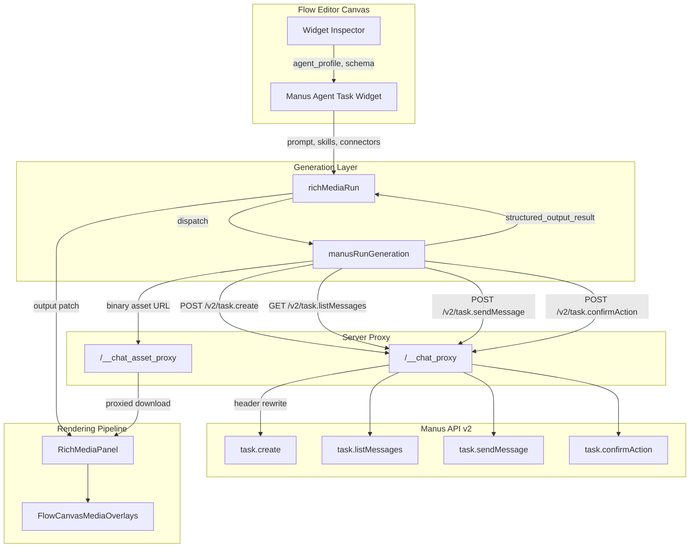
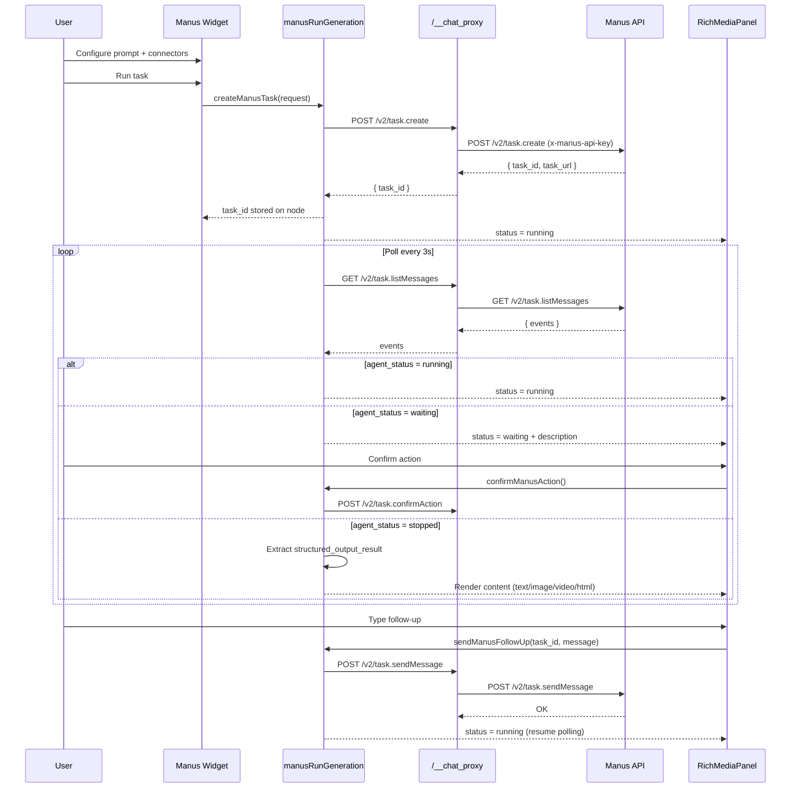

# Manus AI Integration — PRD & TAD

**Version**: 0.1.0
**Date**: 2026-05-13
**Status**: Draft
**Upstream API**: [Manus API v2](https://open.manus.ai/docs/v2/introduction) — `https://api.manus.ai`

---

# PRD — Product Requirements Documentation

## Feature: Manus Agent Task Integration for Canvas Rich Media

### Problem Statement

knowgrph's canvas rich media pipeline currently supports single-shot model-inference providers (BytePlus, Gemini, DeerFlow, OpenAI) for image and video generation. Each provider follows a rigid request→poll→binary-asset pattern with no multi-step reasoning, no web browsing, and no tool use. Users who need research-backed content, multi-modal composition, or iterative refinement must leave the canvas, use external tools, and manually import results — breaking the creative workflow and losing graph-connected context.

**Opportunity**: The Manus API v2 exposes agentic task execution with structured output extraction, 80+ connectors (Canva, Kling, HeyGen, Flux, Firecrawl, etc.), multi-turn conversation, and webhook push notifications. Integrating Manus as a first-class provider transforms knowgrph from a model-inference canvas into an agentic content-creation workspace.

### Personas

| Persona | Role | Jobs-to-be-Done |
|---------|------|-----------------|
| **Content Creator** | Uses flow editor to compose rich media panels | Generate research-backed text, images, and videos without leaving the canvas; iterate on outputs with follow-up instructions |
| **Workflow Designer** | Builds multi-node flow graphs connecting data sources to media outputs | Orchestrate agent tasks as flow nodes with structured input/output contracts; chain Manus tasks with existing BytePlus/Gemini nodes |
| **Integration Manager** | Configures providers and API keys in the Integrations tab | Add Manus as a provider with BYOK or server-managed auth; monitor task status and credit consumption |

### User Journey Stage

## Journey: Content Creator — Generate Agent-Backed Rich Media

| Stage    | Action                          | Touchpoint              | Pain Point                          | Opportunity                              |
|----------|---------------------------------|-------------------------|-------------------------------------|------------------------------------------|
| Trigger  | Needs research-backed content   | Flow editor canvas      | No provider can browse or reason    | Manus agent researches and composes      |
| Discover | Selects Manus Agent widget      | Widget registry palette | Manus not available as widget type  | New widget with agent profile selection  |
| Engage   | Configures prompt, skills, connectors | Widget inspector  | No connector/skill awareness        | Expose Manus connectors and skills       |
| Complete | Agent produces structured output | Rich media panel       | No structured extraction pipeline    | Schema-driven output → panel rendering   |
| Return   | Refines with follow-up message  | Panel text input        | Must recreate task from scratch      | Multi-turn via `task.sendMessage`        |

## Journey: Workflow Designer — Chain Agent Tasks in Flow Graph

| Stage    | Action                          | Touchpoint              | Pain Point                          | Opportunity                              |
|----------|---------------------------------|-------------------------|-------------------------------------|------------------------------------------|
| Trigger  | Builds multi-step content pipeline | Flow editor canvas   | Single-shot providers lack chaining  | Manus tasks accept upstream connections  |
| Discover | Connects text node → Manus node | Flow edge wiring       | No port compatibility               | Manus widget defines input/output ports  |
| Engage   | Runs workflow with "Run All"    | Toolbar                 | Agent tasks block synchronous flow   | Async task polling with status feedback  |
| Complete | All panels render final outputs  | Canvas overlay          | No unified status across providers   | Consistent loading/done/error states     |
| Return   | Adjusts upstream prompt, reruns | Node inspector          | Full pipeline re-executes           | Selective node re-run with cached deps   |

### User Stories

#### Epic 1: Manus Provider Registration

**PRD-E1-S1**: As an Integration Manager, I want to add Manus as a chat provider with API key configuration, so that I can authenticate against the Manus API from within knowgrph.

**PRD-E1-S2**: As an Integration Manager, I want to select agent profiles (lite, standard, max) per widget, so that I can balance quality, speed, and cost for different generation tasks.

#### Epic 2: Manus Agent Task Widget

**PRD-E2-S1**: As a Content Creator, I want to create a Manus Agent Task widget on the flow canvas, so that I can configure prompts, skills, connectors, and structured output schemas for agent-driven content generation.

**PRD-E2-S2**: As a Content Creator, I want the widget to display real-time agent status (running, waiting, stopped, error) in the rich media panel, so that I can monitor long-running agent tasks without leaving the canvas.

**PRD-E2-S3**: As a Content Creator, I want agent-produced text, images, videos, and HTML to render directly in the rich media panel, so that I can preview generated content in context with the rest of my flow graph.

**PRD-E2-S4**: As a Content Creator, I want to send follow-up messages to a running or completed Manus task from the panel, so that I can iteratively refine content without creating a new task.

#### Epic 3: Structured Output Pipeline

**PRD-E3-S1**: As a Workflow Designer, I want Manus task results extracted via structured output schema into typed fields (text, imageUrl, videoUrl, htmlContent), so that downstream flow nodes can consume agent output as connected values.

**PRD-E3-S2**: As a Workflow Designer, I want the structured output schema to be auto-configured based on the target panel type (text, image, video, iframe), so that I do not need to manually author JSON schemas.

#### Epic 4: Connector-Powered Generation

**PRD-E4-S1**: As a Content Creator, I want to select Manus connectors (Canva, Kling, HeyGen, Flux, Firecrawl, etc.) when configuring a widget, so that the agent can use external tools for specialized content generation.

**PRD-E4-S2**: As a Content Creator, I want connector-produced artifacts (images, videos, HTML pages) to be proxied and rendered in rich media panels, so that external tool outputs appear natively on the canvas.

#### Epic 5: Webhook Real-Time Updates

**PRD-E5-S1**: As a Content Creator, I want rich media panels to update in real-time when a Manus task completes via webhook, so that I do not need to manually refresh or wait for polling intervals.

### Acceptance Criteria

**PRD-E1-S1 AC**:
- Given the Integrations tab is open, When I select "Manus" as a provider and enter a valid API key, Then the provider is saved and the Manus widget type appears in the flow editor palette.

**PRD-E1-S2 AC**:
- Given a Manus Agent Task widget is selected, When I open the inspector, Then I can choose from agent profiles: `manus-1.6-lite`, `manus-1.6`, `manus-1.6-max`.

**PRD-E2-S1 AC**:
- Given the flow editor canvas, When I drag a "Manus Agent Task" widget from the palette, Then a new node appears with input ports (prompt, reference_image, skills, connectors) and output ports (text, imageUrl, videoUrl, htmlContent, status).

**PRD-E2-S2 AC**:
- Given a Manus task is running, When I view the connected rich media panel, Then the panel displays a loading skeleton with the current agent status (running/waiting) and a task URL link.

**PRD-E2-S3 AC**:
- Given a Manus task completes with structured output containing `imageUrl`, When the result is processed, Then the rich media panel renders the image inline with the panel's image viewer.

**PRD-E2-S4 AC**:
- Given a Manus task is in `stopped` status, When I type a follow-up message in the panel's text input and submit, Then `task.sendMessage` is called and the panel returns to loading state.

**PRD-E3-S1 AC**:
- Given a Manus task completes with `structured_output_result`, When the result is processed, Then each extracted field is written to the corresponding node output property and propagated to connected downstream nodes.

**PRD-E3-S2 AC**:
- Given a Manus widget's target panel type is set to "image", When the task is created, Then the `structured_output_schema` is auto-populated with `imageUrl` as the primary output field.

**PRD-E4-S1 AC**:
- Given the widget inspector is open, When I click the connectors field, Then a searchable list of available Manus connectors is displayed with names and descriptions.

**PRD-E4-S2 AC**:
- Given a Manus task used the Canva connector to produce an image, When the task completes, Then the image URL is extracted and rendered in the rich media panel via the binary asset proxy.

**PRD-E5-S1 AC**:
- Given a webhook is configured for task completion events, When a Manus task transitions to `stopped`, Then the connected rich media panel updates within 5 seconds without manual refresh.

### Success Metrics

| Metric                              | Baseline | Target                    | Timeline     |
|-------------------------------------|----------|---------------------------|--------------|
| Manus widget creation success rate   | N/A      | ≥ 95%                     | Post-launch  |
| Agent task → panel render latency    | N/A      | ≤ 3s after task stopped   | Post-launch  |
| Structured output extraction success | N/A      | ≥ 90%                     | Post-launch  |
| Multi-turn refinement usage         | N/A      | ≥ 20% of Manus tasks      | 30 days      |
| Connector-powered generation usage   | N/A      | ≥ 15% of Manus tasks      | 30 days      |

### MoSCoW Priority

| Epic | Priority | Rationale                                          |
|------|----------|----------------------------------------------------|
| E1: Provider Registration          | **Must**  | Prerequisite for all other epics                   |
| E2: Agent Task Widget              | **Must**  | Core user-facing feature                           |
| E3: Structured Output Pipeline     | **Must**  | Bridges agent results to existing rendering pipeline |
| E4: Connector-Powered Generation   | **Should** | High value but depends on E1–E3                  |
| E5: Webhook Real-Time Updates      | **Could** | UX improvement; polling is sufficient for MVP      |

### Out of Scope

- Manus Projects API (`project.create`, `project.list`) — future iteration
- Manus Agents API (`agent.list`, `agent.detail`, `agent.update`) — future iteration
- Manus Website API (`website.publish`, `website.status`) — future iteration
- Browser connector (`needConnectMyBrowser`) — requires browser extension
- Usage tracking dashboard (`usage.list`, `usage.teamLog`) — future iteration
- Manus file upload for reference images — deferred to P1

### Dependencies

- Manus API v2 key (BYOK or server-managed)
- Server-side proxy support for `x-manus-api-key` header mapping
- Existing rich media rendering pipeline (`RichMediaPanel`, `mediaOverlayPool`)
- Existing flow editor widget registry (`registryTemplates`)
- Existing provider configuration system (`chatEndpoint`, `SettingsView`)

### Open Questions

1. Should the server-side proxy cache Manus task messages to reduce polling overhead?
2. What is the maximum acceptable task duration before showing a "long-running" warning?
3. Should webhook registration be per-user or per-workspace?
4. How should credit consumption be surfaced to the user (if at all)?

---

# TAD — Technical Architecture Documentation

## Architecture: Manus Agent Task Integration

### Overview

**From user prompt to rendered rich media**: Flow Editor Widget → Manus Task API → Structured Output Extraction → Rich Media Panel Rendering → Canvas Overlay Display

The integration adds Manus as a new provider category — **agent task** — alongside existing model-inference providers. The key architectural difference is that Manus tasks are asynchronous, multi-step agent workflows with intermediate states, confirmation gates, and multi-turn follow-ups, requiring a task lifecycle manager rather than a simple request-response pattern.

### Journey → System Mapping

| Journey Stage | Workflow                  | Data Flow                          | Component                        |
|---------------|---------------------------|------------------------------------|----------------------------------|
| Trigger       | Widget configuration       | User settings → provider config    | `chatEndpoint`, `SettingsView`   |
| Discover      | Widget creation            | Registry → node instantiation      | `registryTemplates`              |
| Engage        | Task dispatch + polling    | Prompt → Manus API → task events   | `manusRunGeneration`             |
| Complete      | Output extraction          | Structured output → node props     | `richMediaRun`                   |
| Return        | Follow-up refinement       | User input → `task.sendMessage`    | `manusRunGeneration`             |

### Component Specifications

**Component**: `manusRunGeneration`
**Responsibility**: Manage the full Manus task lifecycle — create, poll, confirm actions, send follow-ups, extract structured output
**Interfaces**: `createManusTask()`, `pollManusTaskMessages()`, `confirmManusAction()`, `sendManusFollowUp()`, `extractManusStructuredOutput()`
**Dependencies**: `chatEndpoint` (proxy routing), `richMediaRun` (output patching)
**Configuration**: Agent profile, polling interval, max poll duration, structured output schema

**Component**: `manusSsot`
**Responsibility**: Define Manus API field bindings for the settings panel and widget inspector
**Interfaces**: `MANUS_API_DOC_ROWS`, `MANUS_WIDGET_FIELDS`
**Dependencies**: `registryTemplates` (widget registration)
**Configuration**: Static API documentation bindings

**Component**: `chatEndpoint` (extension)
**Responsibility**: Route Manus API calls through the proxy with correct header mapping
**Interfaces**: `CHAT_PROVIDER_MANUS`, `CHAT_MANUS_BASE`, proxy path helpers
**Dependencies**: Proxy server (header rewrite: `X-KG-Chat-Api-Key` → `x-manus-api-key`)
**Configuration**: Base URL, API paths, provider normalization

**Component**: `registryTemplates` (extension)
**Responsibility**: Register the Manus Agent Task widget with input/output ports and inspector fields
**Interfaces**: Widget registry entry for `ManusAgentTask`
**Dependencies**: `manusSsot` (field definitions), `config.flow-editor` (node type ID)
**Configuration**: Node type ID, port definitions, default field values

### Integration Contracts

**Interface**: Manus Task Creation
**Protocol**: HTTP POST (via `/__chat_proxy`)
**Format**: JSON
**Errors**: Retry on `rate_limited` (exponential backoff); fail on `permission_denied`; surface `invalid_argument` to user

```json
{
  "message": {
    "content": "Generate a product comparison infographic",
    "connectors": ["c63d86db-4c98-483a-af0c-f94721d7f2a5"],
    "force_skills": []
  },
  "project_id": null,
  "locale": "en",
  "interactive_mode": false,
  "agent_profile": "manus-1.6",
  "structured_output_schema": {
    "type": "object",
    "properties": {
      "title": { "type": "string" },
      "contentKind": { "type": "string", "enum": ["text", "image", "video", "html"] },
      "textContent": { "type": ["string", "null"] },
      "imageUrl": { "type": ["string", "null"] },
      "videoUrl": { "type": ["string", "null"] },
      "htmlContent": { "type": ["string", "null"] },
      "caption": { "type": ["string", "null"] },
      "sourceUrl": { "type": ["string", "null"] }
    },
    "required": ["title", "contentKind", "textContent", "imageUrl", "videoUrl", "htmlContent", "caption", "sourceUrl"],
    "additionalProperties": false
  }
}
```

**Interface**: Manus Task Polling
**Protocol**: HTTP GET (via `/__chat_proxy`)
**Format**: JSON (cursor-based pagination)
**Errors**: Continue polling on transient errors; fail after max duration

```
GET /v2/task.listMessages?task_id={task_id}&order=desc&limit=10
```

**Interface**: Manus Structured Output Result
**Protocol**: Event in `task.listMessages` response
**Format**: JSON with `success`, `value`, `error` fields
**Errors**: When `success: false`, display `error` to user; `value` contains zero-value fallback

```json
{
  "type": "structured_output_result",
  "structured_output_result": {
    "success": true,
    "value": {
      "title": "Product Comparison",
      "contentKind": "image",
      "textContent": null,
      "imageUrl": "https://cdn.manus.im/...",
      "videoUrl": null,
      "htmlContent": null,
      "caption": "Side-by-side feature comparison",
      "sourceUrl": "https://manus.im/app/task_abc"
    }
  }
}
```

**Interface**: Manus Follow-Up Message
**Protocol**: HTTP POST (via `/__chat_proxy`)
**Format**: JSON
**Errors**: Surface error to user; allow retry

```json
{
  "task_id": "task_abc123",
  "message": {
    "content": "Make the infographic more colorful and add a legend"
  }
}
```

### Architectural Decisions

## ADR-1: Manus as Agent Task Provider, Not Model Inference Provider
**Status**: Proposed
**Date**: 2026-05-13

### Context
Existing providers (BytePlus, Gemini, OpenAI) follow a synchronous request→response or async task→poll→binary pattern. Manus operates as an agentic task platform with multi-step execution, intermediate states, confirmation gates, and multi-turn conversation.

### Decision
Register Manus as a new provider category (`CHAT_PROVIDER_MANUS = 'manus'`) with a dedicated generation module (`manusRunGeneration.ts`) that manages the full task lifecycle, rather than adapting the existing model-inference pattern.

### Alternatives Considered
1. **Adapt to OpenAI-compatible pattern**: Pros — minimal code changes. Cons — loses multi-turn, confirmation gates, structured output, connectors. Rejected.
2. **Treat as a BytePlus-style async task**: Pros — reuses polling infrastructure. Cons — misses `waiting` state handling, `task.sendMessage`, `structured_output`. Rejected.

### Rationale
Manus is architecturally distinct from model-inference providers. Forcing it into the existing pattern would sacrifice its core differentiators (agentic reasoning, connectors, multi-turn, structured extraction). A dedicated module preserves the full API capability while following the established generation module pattern.

### Consequences
- **Positive**: Full Manus API capability exposed; clean separation of concerns; follows existing module pattern
- **Negative**: New generation module to maintain; additional proxy header mapping logic
- **Neutral**: Provider dropdown gains one more option; widget registry gains one more widget type

## ADR-2: Structured Output Schema as Bridge to Rich Media Pipeline
**Status**: Proposed
**Date**: 2026-05-13

### Context
Manus tasks produce free-form agent output. The existing rich media pipeline expects typed properties (`imageUrl`, `videoUrl`, `outputSrcDoc`) to render content in `RichMediaPanel`.

### Decision
Use Manus's `structured_output_schema` to extract a typed content envelope from agent output, then map the extracted fields to existing node output properties via `buildRichMediaWidgetOutputPatch()` and `buildTextWidgetOutputPatch()`.

### Alternatives Considered
1. **Parse free-form agent messages with regex/heuristics**: Pros — no schema needed. Cons — fragile, unreliable, unmaintainable. Rejected.
2. **Require user to manually specify output mapping**: Pros — maximum flexibility. Cons — poor UX, high friction. Rejected.

### Rationale
Structured output provides guaranteed schema conformance with zero-value fallbacks on failure. This creates a reliable, typed bridge between the unstructured agent output and the typed rich media rendering pipeline.

### Consequences
- **Positive**: Reliable extraction; graceful degradation on failure; auto-mapping to existing rendering
- **Negative**: Schema must be pre-defined per content type; nested depth limited to 5 levels
- **Neutral**: Schema is "arm once, fire once" — must re-arm for multi-turn extractions

## ADR-3: Proxy Header Mapping for Manus Authentication
**Status**: Proposed
**Date**: 2026-05-13

### Context
Existing providers use `Authorization: Bearer <key>` via the `X-KG-Chat-Api-Key` proxy header. Manus uses `x-manus-api-key: <key>`.

### Decision
Add a provider-specific header mapping in the proxy layer: when the upstream provider is `manus`, map `X-KG-Chat-Api-Key` to `x-manus-api-key` instead of `Authorization: Bearer`.

### Alternatives Considered
1. **Client sends `x-manus-api-key` directly**: Pros — no proxy changes. Cons — breaks BYOK abstraction; leaks provider-specific headers to client. Rejected.
2. **Separate proxy endpoint for Manus**: Pros — clean isolation. Cons — duplicated proxy infrastructure. Rejected.

### Rationale
Extending the existing proxy header mapping preserves the BYOK abstraction and keeps provider-specific details server-side.

### Consequences
- **Positive**: Consistent BYOK UX across all providers; no client-side changes for auth
- **Negative**: Proxy server needs provider-aware header mapping logic
- **Neutral**: Follows the same pattern as existing provider-specific proxy behavior

### Quality Attributes

| Attribute     | Scenario                                          | Pattern                          | Validation                          |
|---------------|---------------------------------------------------|----------------------------------|-------------------------------------|
| Performance   | Agent task polling must not block canvas rendering | Async polling with `requestIdleCallback` | DevTools performance trace; no main-thread jank >50ms |
| Scalability   | Multiple concurrent Manus tasks per workspace     | Independent task lifecycle per widget | Run 5 concurrent tasks; verify no state leakage |
| Security      | API key must never be exposed to client           | Server-side proxy header mapping | Network inspector shows no `x-manus-api-key` in client requests |
| Observability | Task failures must be surfaced to user            | Error state in `RichMediaPanel`  | Trigger `permission_denied`; verify error message renders |
| Resilience    | Transient API errors must not lose task context   | Retry with exponential backoff; persist `task_id` on node | Simulate 500 error; verify retry and task resumption |

### Deployment Strategy

**Rolling deployment** — no database migrations or infrastructure changes required. The integration is purely client-side JavaScript with server-side proxy header mapping.

**Rollback plan**: Remove `CHAT_PROVIDER_MANUS` from `CHAT_PROVIDER_OPTIONS` and delete `manusRunGeneration.ts`. No data migration needed since Manus task IDs are stored as node properties, not in persistent storage.

### Architecture Diagrams





### Component Inventory

| Layer          | Component                  | File / Module                                              | Status       |
|----------------|----------------------------|------------------------------------------------------------|--------------|
| Provider       | Manus provider constants   | `canvas/src/lib/chatEndpoint.ts`                           | Planned      |
| Generation     | Manus task lifecycle       | `canvas/src/features/chat/manusRunGeneration.ts`           | Planned      |
| Integration    | Manus API doc bindings     | `canvas/src/features/integrations/manusSsot.ts`            | Planned      |
| Widget         | Manus widget registry      | `canvas/src/features/flow-editor-manager/registryTemplates.ts` | Planned (extension) |
| Rendering      | Output patch mapping       | `canvas/src/features/chat/richMediaRun.ts`                 | Planned (extension) |
| Proxy          | Header mapping             | Server proxy configuration                                 | Planned      |
| Settings       | Provider configuration     | `canvas/src/features/panels/views/SettingsView.tsx`        | Planned (extension) |

---

# Traceability Matrix

| PRD ID        | TAD Component                  | TAD Interface                          |
|---------------|--------------------------------|----------------------------------------|
| PRD-E1-S1     | `chatEndpoint`                 | `CHAT_PROVIDER_MANUS`, proxy routing   |
| PRD-E1-S2     | `manusSsot`                    | Agent profile field binding            |
| PRD-E2-S1     | `registryTemplates`            | Widget registry entry, port definitions |
| PRD-E2-S2     | `manusRunGeneration`           | `pollManusTaskMessages()`, status mapping |
| PRD-E2-S3     | `richMediaRun`                 | `buildRichMediaWidgetOutputPatch()`, `buildTextWidgetOutputPatch()` |
| PRD-E2-S4     | `manusRunGeneration`           | `sendManusFollowUp()`                  |
| PRD-E3-S1     | `manusRunGeneration`           | `extractManusStructuredOutput()`       |
| PRD-E3-S2     | `manusRunGeneration`           | Auto-schema builder                    |
| PRD-E4-S1     | `manusSsot`                    | Connector list field binding           |
| PRD-E4-S2     | `manusRunGeneration`           | Asset URL proxy routing                |
| PRD-E5-S1     | `manusRunGeneration`           | Webhook event handler                  |

---

# Validation Checklist

**Pre-Implementation**:
- [x] User journey mapped before stories written; every story anchored to a journey stage
- [x] Workflows defined with trigger, happy path, alternate paths, error paths, and postconditions
- [x] Data flows typed at every stage boundary with persistence and error handling documented
- [x] User stories follow "As a… I want… So that" format
- [x] Acceptance criteria use Given-When-Then with observable outcomes
- [x] Features prioritized via MoSCoW with rationale
- [x] Components have single responsibility; interfaces specified with explicit contracts
- [x] Architectural decisions documented with ADRs
- [x] Architecture diagrams use Mermaid (not ASCII for >5 nodes)
- [x] Component inventory table accompanies every architecture diagram
- [x] PRD-to-TAD traceability established via `PRD-[Epic]-[Story] ↔ TAD-[Component]-[Interface]`
- [x] No implementation detail in PRD; no business logic in TAD

**Post-Documentation Review**:
- [ ] Stakeholders validate PRD addresses user problems
- [ ] Development team confirms TAD provides sufficient guidance
- [ ] QA confirms acceptance criteria are objectively testable
- [x] Success metrics defined with baseline, target, and timeline
- [x] Quality attributes specified with measurable scenarios
- [ ] Open questions resolved or formally tracked
