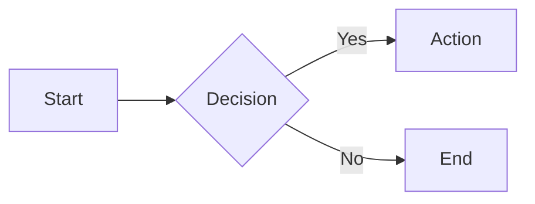
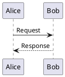

# knowgrph Markdown Slide Styling Guidelines: Advanced and Export

Continuation of knowgrph-markdown-slide-styling-guidelines.md covering transitions, notes, advanced embeds, export, navigation, and best practices.

## Transition Effects (structural only today)

```yaml
---
transition: slide-left
---
```

**Options:**
- `none` - No transition
- `fade` - Crossfade
- `slide-left` - Slide from right
- `slide-right` - Slide from left
- `slide-up` - Slide from bottom
- `slide-down` - Slide from top
- `zoom` - Zoom effect

---

## Fragment Animations (fully supported in Knowgrph viewer)

```html
<p class="fragment">Default fade-in</p>
<p class="fragment fade-out">Fade out</p>
<p class="fragment fade-up">Fade up</p>
<p class="fragment highlight-red">Highlight red</p>
<p class="fragment grow">Grow</p>
<p class="fragment shrink">Shrink</p>
```

**Ordering:**
```html
<p class="fragment" data-fragment-index="1">First</p>
<p class="fragment" data-fragment-index="2">Second</p>
```

**Knowgrph semantics:**
- Elements with `class="fragment"` are treated as slide fragments.
- `data-fragment-index="N"` controls the ordering; when omitted, order follows document flow.
- Fragment visibility is driven by the current presentation “step” within the active slide.

**Knowgrph-only minimal fragment deck (copy-paste template):**

```markdown
---
layout: center
aspectRatio: '16/9'
fragments:
  enabled: true
  steps: 3
---

# Demo: Fragments

Intro text (always visible)

<p class="fragment">First fragment (step 1)</p>
<p class="fragment">Second fragment (step 2)</p>

---

# Demo: v-click

<v-click>Appears at step 1</v-click>
<v-click at="2">Appears at step 2</v-click>
<v-click at="3">Appears at step 3</v-click>
```

---

## Speaker Notes (fully supported)

**Method 1: HTML comments (Slidev-compatible)**
```markdown
## Slide Content

<!--
Speaker notes here
- Not visible to audience
- Accessible via presenter mode
-->
```

**Method 2: Note delimiter**
```markdown
## Slide Content

Note:
- Speaker note line 1
- Speaker note line 2
```

---

## Diagrams: Mermaid (fully supported)

````markdown

````

**Diagram types:** `graph`, `flowchart`, `sequenceDiagram`, `classDiagram`, `stateDiagram`, `gantt`, `pie`

---

## Diagrams: PlantUML (structural only today)

````markdown

````

**Purpose**: Generates UML diagrams from text syntax

---

## Custom CSS Classes (fully supported where expressed via HTML and CSS classes)

**Framework utilities:**
```html
<div class="text-center opacity-50">Centered, semi-transparent</div>
<div class="grid grid-cols-3 gap-4">Three columns</div>
<div class="absolute top-10 right-10">Positioned</div>
```

**Common utilities:** `text-center`, `flex`, `grid`, `absolute`, `relative`, `opacity-*`, `scale-*`

---

## Scoped Styling (structural only today)

```markdown
<style scoped>
h1 { color: #667eea; }
section { background: #1a1a2e; }
code { font-size: 1.2em; }
</style>

# Styled Slide
Content affected by scoped styles
```

**Scope:** Applies only to current slide, not globally

---

## Embedded Components (structural only today)

**QR Code:**
```html
<QRCode value="https://example.com" :size="200" />
```

**Chart:**
```html
<ChartJS type="bar" :data="{
  labels: ['A', 'B', 'C'],
  datasets: [{ data: [10, 20, 30] }]
}" />
```

**Icons:**
```html
<carbon-logo-github />
<mdi-check-circle class="text-3xl" />
```

---

## Absolute Positioning (fully supported where expressed via HTML classes)

```html
<div class="absolute top-0 left-0">
  Top-left corner
</div>

<div class="absolute bottom-0 right-0">
  Bottom-right corner
</div>

<div class="absolute top-50% left-50% transform -translate-x-50% -translate-y-50%">
  Center
</div>
```

---

## Grid Layouts (fully supported where expressed via HTML classes)

```html
<div class="grid grid-cols-3 gap-4">
  <div>Column 1</div>
  <div>Column 2</div>
  <div>Column 3</div>
</div>

<div class="grid grid-cols-2 grid-rows-2 gap-2">
  <div>Cell 1</div>
  <div>Cell 2</div>
  <div>Cell 3</div>
  <div>Cell 4</div>
</div>
```

---

## Aspect Ratio Configuration (fully supported)

```yaml
---
aspectRatio: '16/9'   # Widescreen (default)
# aspectRatio: '4/3'  # Standard
# aspectRatio: '16/10' # Wide
---
```

**Purpose**: Controls slide dimensions for target display

---

## Font Configuration (structural only today)

```yaml
---
fonts:
  sans: 'Inter'
  serif: 'Merriweather'
  mono: 'Fira Code'
  provider: 'google'
---
```

**Providers:** `google`, `local`, `none`

---

## Export Configuration (framework-dependent, structural only)

```yaml
---
download: true
exportFilename: presentation
---
```

**Export commands (framework-dependent):**
```bash
export --format pdf
export --format png
export --format pptx
export --with-clicks
```

---

## Keyboard Navigation (partially supported)

| Action | Keys |
|--------|------|
| Next slide | `Space`, `→`, `Page Down` |
| Previous slide | `←`, `Page Up` |
| First slide | `Home` |
| Last slide | `End` |
| Overview mode | `O`, `Esc` |
| Speaker view | `S` |
| Fullscreen | `F`, `F11` |
| Drawing mode | `D` |
| Go to slide | `G` |

---

## Drawing Mode (structural only today)

```yaml
---
drawings:
  enabled: true
  persist: false
  presenterOnly: false
---
```

**Purpose**: Enables on-slide annotations during presentation

**Activation:** Press `D` key during presentation

---

## Multi-language Support (structural only today)

```yaml
---
lang: en-US
# lang: zh-CN
---
```

**RTL support:**
```yaml
---
dir: rtl
lang: ar
---
```

---

## Theme Customization (structural only today)

```css
:root {
  --primary-color: #667eea;
  --secondary-color: #764ba2;
  --text-color: #333333;
  --background-color: #ffffff;
  --code-background: #1a1a2e;
}

.slidev-layout {
  font-family: 'Inter', sans-serif;
}

h1 {
  color: var(--primary-color);
}
```

---

## Plugin System (framework-dependent, structural only)

```javascript
// config.js
export default {
  plugins: [
    'plugin-qrcode',
    'plugin-charts',
    'plugin-diagrams'
  ]
}
```

**Purpose**: Extends framework capabilities via modular plugins

---

## Configuration Inheritance (framework-dependent, structural only)

```yaml
---
extends: ./base.md
---
```

**Purpose**: Reuses common configuration across multiple presentations

**Effect**: Current file inherits settings from base file, overriding as needed

---

## Feature Comparison

| Feature | Framework A | Framework B | Framework C |
|---------|-------------|-------------|-------------|
| Components | ✅ | ❌ | ❌ |
| Live reload | ✅ | ✅ | ❌ |
| PDF export | ✅ | ✅ | ✅ |
| PPTX export | ❌ | ✅ | ❌ |
| Drawing | ✅ | ❌ | ✅ |
| Monaco editor | ✅ | ❌ | ❌ |

**Purpose**: Compare capabilities across presentation frameworks

---

## Best Practices

**Content structure:**
- One concept per slide
- Maximum 6 bullet points
- Maximum 6 words per point
- Prioritize visuals over text

**Code presentation:**
- Highlight changed lines
- Limit blocks to 15 lines
- Include language hints
- Use syntax highlighting

**Accessibility:**
- High contrast (4.5:1 minimum)
- Readable fonts (20px+)
- Semantic HTML structure
- Alternative text for images

---

# Complete Reference

**45 slides** • **Universal syntax** • **Zero duplication** • **Production-ready**
