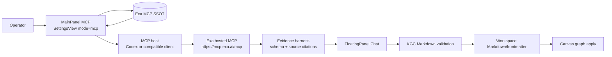

# Knowgrph - Exa MCP MainPanel Integration PRD/TAD

`version {{version}}` - `status {{status}}` - owner `{{author}}` - {{updated}}

This document defines the implementation contract for surfacing Exa MCP in MainPanel MCP and using Exa web search/page fetch results as structured evidence for Knowgrph workflows.

It is not a mandate to add a new MainPanel tab, a new graph mutation service, a parallel MCP runtime, or a browser-stored Exa secret. Exa MCP belongs in the existing MCP configuration surface and feeds the existing MainPanel MCP/Integrations -> FloatingPanel Chat -> workspace Markdown/frontmatter -> Canvas proof path.

---

## Source Baseline

### External Source Facts

| Fact | Source | Contract Impact |
|---|---|---|
| Exa Search MCP is installed in MCP clients through the hosted server URL `https://mcp.exa.ai/mcp`. | Exa docs | MainPanel MCP must expose the hosted Streamable HTTP URL as the default remote configuration. |
| Codex setup is `codex mcp add exa --url https://mcp.exa.ai/mcp`. | Exa docs | MainPanel MCP copy blocks should include Codex-ready setup, but should not mutate user Codex config from the browser. |
| Default tools are `web_search_exa` and `web_fetch_exa`. | Exa docs | Default read-only capability must be visible without implying every Exa tool is enabled. |
| `web_search_advanced_exa` is optional and enabled through the `tools` query parameter. | Exa docs | Advanced search must be a deliberate setting or the `advanced` profile, not a hidden default. |
| Active tools for this integration are `web_search_exa`, `web_fetch_exa`, and `web_search_advanced_exa`. | Exa docs + repo README | MainPanel should emit only the shared active tool list and reject unsupported tool names. |
| API keys are optional for free-plan usage and required for production/rate-limit headroom. | Exa docs | Browser UI must never store `x-api-key`; server/local MCP hosts own secret injection. |
| The open-source server lives at `exa-labs/exa-mcp-server`. | Exa docs + GitHub | Implementation should map source behavior through a shared SSOT, not copy README snippets into multiple UI files. |
| Some MCP clients need a restart after MCP config changes. | Exa docs | MainPanel troubleshooting must include restart/fresh-session guidance. |

### Local Repo Truth

| Surface | Current State | Owner | Integration Rule |
|---|---|---|---|
| MainPanel MCP | Shipped as a thin `SettingsView mode="mcp"` shell | `canvas/src/features/panels/views/McpHubView.tsx` | Add Exa as an MCP settings section; do not add a new tab. |
| MainPanel Integrations | Shipped as a thin `SettingsView mode="integrations"` shell | `canvas/src/features/panels/views/IntegrationsHubView.tsx` | Exa evidence handoff can route to chat, but integration settings remain shared. |
| Settings row composition | Shipped via registry entries plus virtual MCP doc entries | `useSettingsView.ts`, `settingsMcpDocEntries.ts` | Reuse MCP doc-entry builders and settings registry patterns. |
| Section actions/docs links | Shipped via `MCP_SECTION_META` | `settingsView.constants.ts` | Add Exa docs link and FloatingPanel Chat handoff through the existing section metadata map. |
| Chat readiness snapshot | Shipped | `useSettingsChatAssist.tsx`, `localSettingsChatReadinessInspection.ts` | Exa search output must flow through chat readiness, not bypass it. |
| MainPanel -> Chat -> Canvas proof | Shipped | `localMainPanelChatCanvasPipelineInspection.ts`, `agentReadyLocalMainPanelChatCanvasPipeline.test.ts` | Exa acceptance must reuse the rendered path proof. |
| Workspace/frontmatter validation | Shipped | `chatMarkdownValidation.ts`, workspace import/apply owners | Exa results become cited evidence for validated KGC Markdown; they do not mutate canvas directly. |
| Local/Pages MCP baseline | Shipped | `mcp/server.js`, `mcp/local-tool-contract.js`, `cloudflare/pages/knowgrph-agent-ready.mjs` | Exa configuration does not replace Knowgrph's native MCP surface. |

---

## Executive Summary

Knowgrph needs web search and page-fetch evidence inside the same MCP-aware operator surface that already handles local MCP, Stripe MCP, GrabMaps MCP, API-native browser MCP, PixVerse MCP, MiroMind MCP, and native agent-ready tooling. Exa MCP is the right external search connector because it offers hosted MCP search/fetch tools and an open-source server reference.

The product risk is not search capability. The risk is integration sprawl: copied URLs, stale tool names, browser-stored API keys, direct graph mutation from untrusted web content, and parallel MCP paths. The integration must therefore:

- expose Exa MCP as a MainPanel MCP configuration family
- keep Exa constants in one shared SSOT
- route Exa output into FloatingPanel Chat evidence packs
- require schema validation before KGC/frontmatter/canvas application
- keep all secrets in an MCP host, server environment, or local environment
- filter unsupported Exa tool names at the shared SSOT

---

## Problem Discovery

### Problem Statement

Operators can configure MCP tools today, but Knowgrph does not yet have a first-class MainPanel contract for Exa web search and page fetch. As a result, Exa setup can drift into manual Codex config, pasted notes, or ad-hoc prompt instructions instead of a reusable UI and documentation path.

For e-commerce and market-research workflows, operators need current web evidence, product pages, competitor pages, pricing references, policy pages, and cited source content. That evidence must be discoverable through MainPanel MCP and then processed through the existing chat/frontmatter/canvas pipeline.

### Problem Hypothesis

If Exa MCP is represented as a shared MainPanel MCP configuration section and evidence harness, operators can activate current web search/page-fetch workflows with less setup drift, lower prompt rework, and better traceability from source evidence to graph nodes.

### ROI Estimate

| Factor | Estimate | Rationale |
|---|---:|---|
| User impact | 4 | Current web evidence is high-value for commerce, research, and agent-ready demos. |
| Reach | 3 | Applies to MCP operators, chat users, queryable-corpus work, commerce research, and docs validation. |
| Build hours | 8 | Shared SSOT, settings registry rows, virtual MCP docs entries, section metadata, tests, and docs. |
| Monthly TCO | 0 to paid Exa plan | Free plan can validate; production rate limits require explicit API-key plan decision. |
| Token cost/month | bounded by evidence pack limits | Search/fetch content can be large; chat harness must summarize and cap evidence before KGC generation. |
| ROI score | 1.5 before paid plan | `(4 * 3) / 8` at zero paid TCO; paid Exa plan requires re-score. |

### Phase 0 Gate

Proceed with the MainPanel MCP contract because the min-viable scope is small, user impact is high, and the architecture reuses shipped owners. Defer any server-side Exa proxy, Exa result cache, or production paid-plan enforcement until after the P0 UI/docs/test path proves value.

---

## PRD

### Personas And Jobs To Be Done

| Persona | Job | Success Signal |
|---|---|---|
| Operator | Configure Exa MCP in the same place as other MCP integrations | MainPanel MCP shows Exa server URL, enabled tools, auth mode, copyable Codex config, and restart guidance. |
| Research user | Turn web evidence into Knowgrph nodes and sources | Exa search/fetch results are summarized into cited evidence and applied only through validated KGC Markdown. |
| Maintainer | Keep tool names, URLs, and deprecation notes synchronized | One shared Exa MCP SSOT drives docs, rows, tests, and search hints. |
| Auditor | Confirm no secrets or untrusted web content bypass validation | Browser stores no Exa API key; fetched content is treated as untrusted and validated before canvas mutation. |

### User Journey Flow

| Stage | Action | Touchpoint | Pain Point | Opportunity |
|---|---|---|---|---|
| Trigger | Operator needs live web evidence for a workspace or commerce research task | MainPanel MCP | Exa setup lives outside Knowgrph UI | Show Exa MCP readiness where operators already inspect MCP tools. |
| Discover | Operator searches `exa`, `web search`, or `mcp` | MainPanel search | Tool names and setup commands drift across notes | Render shared Exa rows with canonical URL/tool/auth labels. |
| Configure | Operator copies Codex or generic MCP config | MainPanel MCP row | API-key handling is easy to paste into browser state | Show non-secret config by default and mark API key as host-owned. |
| Engage | Operator asks chat to search/fetch evidence | FloatingPanel Chat | Raw search content can be noisy or hostile | Route through evidence harness and validation. |
| Complete | Validated KGC Markdown updates workspace/canvas | Workspace + Canvas | Direct external data mutation creates stale or unsafe graphs | Apply only validated frontmatter/flow documents. |
| Return | Operator reruns research with updated query/tool profile | MainPanel MCP + Chat | Repeated searches burn tokens and Exa quota | Cache/summary discipline and rate-limit surfacing reduce waste. |

### User Stories

| ID | Story | Acceptance Criteria | Priority |
|---|---|---|---|
| PRD-EXA-MCP-01 | As an operator, I can find Exa MCP under MainPanel MCP. | Given MainPanel MCP is opened, when the settings rows render, then an `Exa MCP Configuration` section appears with server URL, enabled tools, docs link, and Codex config guidance. | Must |
| PRD-EXA-MCP-02 | As an operator, I can copy a non-secret Exa MCP config. | Given no API key is configured, when I copy the Codex or generic MCP config, then it includes only the hosted URL and optional `tools` query parameter, with no `x-api-key` value. | Must |
| PRD-EXA-MCP-03 | As a maintainer, I can update Exa MCP defaults once. | Given Exa URL/tool names change, when I update the shared Exa MCP SSOT, then MainPanel rows, virtual config JSON, docs links, and tests read the same constants. | Must |
| PRD-EXA-MCP-04 | As a research user, I can turn Exa evidence into graph content safely. | Given Exa returns search/fetch results, when chat consumes them, then the output is represented as cited evidence and only applied to Canvas through existing KGC/frontmatter validation. | Must |
| PRD-EXA-MCP-05 | As an auditor, I can see unsupported tool names are not emitted. | Given an unsupported Exa tool name is present in settings, when generated config is built, then only active tools are included in enabled tools and config JSON. | Should |
| PRD-EXA-MCP-06 | As an operator, I can opt into advanced search. | Given advanced search is needed, when the `advanced` profile is enabled, then the URL uses `tools=web_search_exa,web_fetch_exa,web_search_advanced_exa`. | Should |
| PRD-EXA-MCP-07 | As a maintainer, I can verify the rendered pipeline. | Given MainPanel MCP or Integrations is active, when the local pipeline inspection runs, then route, chat, workspace, Markdown flow, and canvas readiness remain true. | Should |

### Acceptance Criteria And Goal Conditions

| Criterion | Given | When | Then | `/goal` Condition |
|---|---|---|---|---|
| AC-01 | MainPanel MCP renders | The operator searches for `exa` | `Exa MCP Configuration` rows are visible and use shared defaults | `/goal Exa MCP rows render from shared SSOT and focused MainPanel MCP tests pass with no unrelated file edits` |
| AC-02 | Non-secret config is copied | No API-key mode is enabled | Copy output omits `x-api-key`, `EXA_API_KEY`, and real secrets | `/goal copied Exa MCP config contains no secret literals, verified by focused unit tests and repo grep for Exa secret placeholders` |
| AC-03 | Advanced search is enabled | The `advanced` profile is selected | URL uses exactly the three active Exa MCP tools | `/goal advanced Exa MCP URL is generated from one constants owner and tools/list smoke returns the expected three tools` |
| AC-04 | Exa evidence is used by chat | Chat asks for source-backed graph output | Workspace Markdown includes citations/frontmatter and Canvas apply uses existing validation | `/goal MainPanel MCP to chat to workspace/frontmatter to canvas proof passes using Exa evidence fixture without direct graph writes` |
| AC-05 | Unsupported tool names are present | MainPanel MCP builds config rows | Unsupported names are absent from enabled tools and config JSON | `/goal unsupported Exa MCP tool names are absent from generated config JSON, verified by targeted assertions` |

### Success Metrics

| Metric | Baseline | Target | Timeline |
|---|---:|---:|---|
| MainPanel MCP Exa row drift | Not implemented | 0 drift between SSOT, rows, docs, tests | P0 |
| Browser-stored Exa secrets | 0 desired | 0 | Always |
| Unsupported Exa tool names in enabled config | 0 desired | 0 | P0 |
| Exa evidence direct canvas mutation | 0 desired | 0 | Always |
| Operator setup time | Manual/off-UI | Under 60 seconds to find copyable config | P0 |
| Token cost per evidence pack | Unknown | Under 8k input tokens after summarization by default | P1 |
| Monthly TCO | 0 while on free plan | 0 until paid Exa plan is explicitly approved | P0 |
| ROI score | 1.5 estimate | Re-score before paid production rollout | P1 |

### MoSCoW Priority

| Tier | Requirement | ROI/TCO Rationale |
|---|---|---|
| Must | Add Exa MCP docs/config rows under MainPanel MCP using one shared SSOT | High value, low build, zero infrastructure cost. |
| Must | Keep API keys out of browser storage and copied default config | Security baseline; prevents hidden TCO and secret leakage. |
| Must | Route Exa output through chat evidence and KGC validation before Canvas apply | Reuses existing owners and avoids unsafe direct mutation. |
| Must | Filter unsupported Exa tool names in enabled config | Prevents invalid MCP URLs before implementation. |
| Should | Offer an `advanced` tools profile with `web_search_advanced_exa` | Useful for commerce/company/news filtering, still low cost. |
| Should | Add focused MainPanel pipeline proof for Exa evidence fixtures | Keeps validation near current MCP/Integrations readiness tests. |
| Could | Add server-side Exa result cache and quota telemetry | Useful after traffic exists; avoid premature storage work. |
| Could | Add per-workspace Exa research templates | Valuable later, but first prove generic evidence path. |
| Won't | Store Exa API keys in browser localStorage/sessionStorage | Explicitly forbidden. |
| Won't | Add Exa search results directly to graph state without KGC validation | Explicitly forbidden. |
| Won't | Add unsupported Exa tool names to generated config | Explicitly forbidden. |

### Min-Viable Scope

P0 is limited to a documentation and MainPanel contract:

1. Shared Exa MCP SSOT constants.
2. Settings registry keys for non-secret Exa MCP configuration.
3. Virtual MainPanel MCP rows for setup, tools, auth boundary, docs, and troubleshooting.
4. Section metadata with Exa docs link and FloatingPanel Chat handoff.
5. Focused tests for generated config, forbidden secrets, unsupported tool filtering, and MainPanel pipeline readiness.

### Out Of Scope

- Running Exa searches directly from MainPanel without chat.
- Storing Exa API keys in browser state.
- Building a new remote Worker MCP proxy for Exa.
- Caching Exa results in D1/R2 before quota pressure is proven.
- Adding unsupported Exa MCP tool names to generated config.
- Deploying to Prod or Cloudflare as part of this document.

### Dependencies

| Dependency | Type | TCO Posture | Notes |
|---|---|---|---|
| Exa hosted MCP | External service | Free plan first; paid plan requires ADR update | Default `https://mcp.exa.ai/mcp`. |
| `exa-labs/exa-mcp-server` | FOSS source reference | MIT/open-source posture from public repo | Use as behavior reference; do not vendor copy. |
| MainPanel SettingsView | Internal | Zero incremental TCO | Existing owner. |
| FloatingPanel Chat | Internal AI harness | Token cost bounded by chat budget | Existing validation and cost discipline applies. |
| Workspace Markdown/frontmatter | Internal | Zero incremental TCO | Existing KGC validation path. |

### Open Questions

| ID | Question | Owner | Resolution Rule |
|---|---|---|---|
| OQ-01 | Should production Exa use hosted free plan, `x-api-key` header injection, or local `EXA_API_KEY` env injection? | Maintainer | Keep default non-secret; require ADR update before production paid/API-key rollout. |
| OQ-02 | Should Exa result summaries be cached per workspace? | Maintainer | Defer until repeated query volume proves quota/token savings. |
| OQ-03 | Should Exa appear under Integrations as well as MCP? | Maintainer | Start in MainPanel MCP; only add Integrations alias if rendered pipeline proof requires it. |
| OQ-04 | What is the default evidence pack size? | Maintainer | Start with conservative result/page caps and measure token cost. |

---

## TAD

### Architecture Overview

From `operator intent` to `validated graph evidence`:

`MainPanel MCP` reads shared Exa configuration -> `FloatingPanel Chat` requests Exa search/fetch through the active MCP host -> `Evidence Harness` normalizes and summarizes untrusted web content -> `KGC Validation` produces YAML/frontmatter Markdown -> `Workspace Apply` persists the document -> `Canvas Apply` materializes nodes and edges through existing graph owners.

### Architecture Diagram



### Journey To System Mapping

| Journey Stage | Workflow | Data Flow | Component |
|---|---|---|---|
| Discover | MainPanel search filters for Exa MCP rows | Settings registry + virtual doc entries | `SettingsView`, `settingsMcpDocEntries.ts` |
| Configure | Operator copies remote/all-tools config | SSOT constants -> generated JSON | `exaMcpSsot.ts`, `exaMcpApiDocs.ts` |
| Engage | Chat asks MCP host to search/fetch | Prompt intent -> MCP tool input -> Exa result | FloatingPanel Chat + MCP host |
| Validate | Evidence is summarized and converted to KGC | Search/fetch result -> cited evidence -> Markdown/frontmatter | Chat validation owners |
| Apply | Valid Markdown updates workspace/canvas | Markdown/frontmatter -> graph data | Workspace + Canvas apply owners |
| Audit | Tests inspect route/chat/workspace/canvas proof | Rendered snapshots -> readiness payload | `localMainPanelChatCanvasPipelineInspection.ts` |

### Component Specifications

#### Component: Shared Exa MCP SSOT

| Field | Value |
|---|---|
| Responsibility | Own Exa MCP URLs, server key, active tool names, tool profiles, auth labels, and default limits. |
| Proposed file | `grph-shared/src/search/exaMcpSsot.ts` |
| Interfaces | Export constants consumed by settings registry, MainPanel virtual rows, tests, and docs. |
| Dependencies | None beyond TypeScript build. |
| Configuration | No secrets; only URLs, names, booleans, arrays, and numeric limits. |
| FOSS/Vendor | Exa is external proprietary service; source reference is open-source. |
| Goal Conditions | AC-01, AC-02, AC-03, AC-05. |

Required constants:

```ts
EXA_MCP_DOC_AREA = 'Exa MCP Configuration'
EXA_MCP_DOCS_URL = 'https://exa.ai/docs/reference/exa-mcp'
EXA_MCP_GITHUB_URL = 'https://github.com/exa-labs/exa-mcp-server'
EXA_MCP_REMOTE_URL = 'https://mcp.exa.ai/mcp'
EXA_MCP_DEFAULT_SERVER_KEY = 'exa'
EXA_MCP_DEFAULT_TOOL_NAMES = ['web_search_exa', 'web_fetch_exa']
EXA_MCP_ADVANCED_TOOL_NAMES = ['web_search_advanced_exa']
EXA_MCP_ACTIVE_TOOL_NAMES = ['web_search_exa', 'web_fetch_exa', 'web_search_advanced_exa']
EXA_MCP_API_KEY_HEADER = 'x-api-key'
EXA_MCP_LOCAL_API_KEY_ENV = 'EXA_API_KEY'
```

#### Component: Settings Registry Rows

| Field | Value |
|---|---|
| Responsibility | Persist non-secret Exa MCP row values using local settings helpers. |
| Proposed file | `canvas/src/features/settings/registry-search.ts` or a nearby MCP-specific registry module if the repo already has a search settings owner when implementation starts. |
| Interfaces | `SettingMeta[]` entries for `search.exa.mcp.*` keys. |
| Dependencies | `LS_KEYS`, local settings helpers, shared SSOT. |
| Configuration | `serverKey`, `remoteUrl`, `toolProfile`, `enabledTools`, `connectionMode`, `startupTimeoutMs`, `maxResults`, `fetchContentLimit`, `requireFetchReview`. |
| Secret Boundary | No API key value. If production API-key mode is enabled, only expose an environment/header placeholder owned by MCP host or server config. |
| Goal Conditions | AC-01, AC-02, AC-03. |

Proposed keys:

| Key | Type | Default | Secret? |
|---|---|---|---|
| `search.exa.mcp.serverKey` | string | `exa` | No |
| `search.exa.mcp.remoteUrl` | string | `https://mcp.exa.ai/mcp` | No |
| `search.exa.mcp.toolProfile` | string enum | `default` | No |
| `search.exa.mcp.enabledTools` | JSON array | `["web_search_exa","web_fetch_exa"]` | No |
| `search.exa.mcp.connectionMode` | string enum | `hosted-free` | No |
| `search.exa.mcp.startupTimeoutMs` | number | `60000` | No |
| `search.exa.mcp.maxResults` | number | `10` | No |
| `search.exa.mcp.fetchContentLimit` | number | `12000` | No |
| `search.exa.mcp.requireFetchReview` | boolean | `true` | No |

#### Component: Exa MCP MainPanel Virtual Rows

| Field | Value |
|---|---|
| Responsibility | Render Exa MCP setup, tools, auth, config JSON, and troubleshooting under MainPanel MCP. |
| Proposed file | `canvas/src/features/panels/views/exaMcpApiDocs.ts` |
| Interfaces | `EXA_MCP_DOC_ENTRIES`, `buildExaRemoteMcpConfigJson(values)`, `getExaMcpApiRowAnchorId(rowKey)`. |
| Dependencies | Shared SSOT, `buildSettingsRowAnchorId`, `VirtualSettingsEntry`. |
| Configuration | Generated URL includes `tools` only when the chosen profile needs it. |
| Goal Conditions | AC-01, AC-02, AC-03, AC-05. |

Minimum rows:

| Row | Responsibility |
|---|---|
| `server_key` | MCP server key inside `mcpServers`. |
| `remote.url` | Hosted Exa MCP URL. |
| `tool_profile` | `default` or `advanced`. |
| `enabled_tools` | Visible active enabled tools. |
| `advanced_search` | Optional `web_search_advanced_exa` capability and filter use cases. |
| `remote_config.codex` | Copyable Codex command/config without secrets. |
| `remote_config.generic` | Generic remote MCP JSON without secrets. |
| `auth_boundary` | Free plan, API-key header injection, or local env injection notes. |
| `troubleshooting.restart` | Restart/fresh-session guidance when tools do not appear. |

#### Component: MCP Section Metadata

| Field | Value |
|---|---|
| Responsibility | Add Exa docs link and handoff action to the existing MainPanel MCP section intro. |
| Proposed file | `canvas/src/features/panels/views/settingsView.constants.ts` |
| Interfaces | `MCP_SECTION_META[EXA_MCP_DOC_AREA]`. |
| Dependencies | `emitFloatingPanelOpen`. |
| Configuration | `docsUrl = EXA_MCP_DOCS_URL`; `panelLabel = 'Open FloatingPanel Chat UI'`. |
| Goal Conditions | AC-01, AC-04. |

#### Component: MainPanel MCP Entry Aggregation

| Field | Value |
|---|---|
| Responsibility | Add Exa virtual entries to the existing MCP doc-entry builder without changing other MCP families. |
| Proposed file | `canvas/src/features/panels/views/settingsMcpDocEntries.ts` |
| Interfaces | Import and spread `EXA_MCP_DOC_ENTRIES`; route Exa anchor IDs and generated config display. |
| Dependencies | `buildMcpDocEntries`, `buildMcpVirtualEntry`. |
| Configuration | No direct Exa strings outside SSOT and Exa doc-entry module. |
| Goal Conditions | AC-01, AC-03, AC-05. |

#### Component: Evidence Harness

| Field | Value |
|---|---|
| Responsibility | Convert Exa search/fetch output into bounded, cited evidence for chat/KGC generation. |
| Proposed owner | Existing FloatingPanel Chat and KGC validation owners; add helper only if duplication appears. |
| Input Schema | `{ query, tool, resultLimit, urls, sourcePolicy, workspaceContextKey }` |
| Output Schema | `{ evidenceItems: [{ title, url, publishedAt, fetchedAt, summary, quoteBudget, sourceType }], warnings, tokenEstimate }` |
| Cost Log | `{ model, prompt_tokens, completion_tokens, cache_hits, estimated_cost_usd, exa_tool, exa_result_count }` |
| Fallback | Return an evidence-unavailable message and keep canvas unchanged. |
| Token Budget | Default evidence pack under 8k input tokens after summarization; fetched pages clipped before chat generation. |
| Orchestration | Sequential: query -> Exa tool -> evidence normalization -> chat summary -> KGC validation -> canvas apply. Max 1 retry; circuit breaker on empty evidence, quota/rate-limit, or validation failure. |
| Goal Conditions | AC-04. |

#### Component: Validation Tests

| Field | Value |
|---|---|
| Responsibility | Prevent config drift, secret leakage, unsupported tool emission, and direct graph mutation. |
| Proposed tests | `canvas/src/__tests__/exaMcpMainPanelContract.test.ts` plus extension to existing rendered MainPanel pipeline proof if needed. |
| Interfaces | Import shared SSOT and rendered/virtual row builders. |
| Goal Conditions | AC-01 through AC-05. |

### Integration Contracts

| Interface | Protocol | Format | Errors | Owner |
|---|---|---|---|---|
| Exa hosted MCP | Streamable HTTP MCP | JSON-RPC via MCP client | 401/403 auth, 429 rate limit, network failure | Exa + MCP host |
| Exa npm MCP | Stdio MCP | JSON-RPC over process stdio | startup failure, missing `EXA_API_KEY`, package install failure | MCP host/local environment |
| MainPanel row config | Local settings | String/number/boolean/JSON | invalid JSON, stale local value | Settings registry |
| Evidence harness | Internal typed object | JSON | empty results, oversized fetched content, untrusted content warning | Chat/KGC owners |
| KGC apply | Internal workspace/canvas | Markdown frontmatter + graph data | validation failure, forbidden grouping alias, empty graph | Existing validation/apply owners |

### Data Flow

| Stage | Component | Input Format | Output Format | Persistence | Error Handling |
|---|---|---|---|---|---|
| Configure | MainPanel MCP | Shared constants + local settings | Exa config rows and generated MCP JSON | Browser local settings for non-secret values only | Reset to SSOT defaults |
| Invoke | MCP host | Tool call `{ query/url/options }` | Exa MCP tool result | MCP host session/cache if any | Surface auth/rate-limit/network error |
| Normalize | Evidence harness | Exa result JSON/markdown | Bounded cited evidence pack | Optional workspace draft only after user/chat action | Clip, warn, or fail closed |
| Generate | FloatingPanel Chat | Evidence pack + user intent | KGC Markdown/frontmatter | Chat history/workspace draft | Retry once through validation correction |
| Validate | KGC validation | Markdown/frontmatter | Validated KGC payload | None until valid | Reject malformed YAML or forbidden aliases |
| Apply | Workspace/Canvas owners | Validated Markdown/graph | Nodes, edges, sources | Workspace file and graph store | Keep previous graph on failure |

### Security And Privacy Requirements

| Requirement | Rule | Validation |
|---|---|---|
| No browser secrets | Never store `x-api-key`, `EXA_API_KEY`, API-key values, or dashboard credentials in browser localStorage/sessionStorage. | Grep and targeted tests. |
| Untrusted content | Treat fetched pages as untrusted input. | Evidence harness sanitizes and summarizes before KGC. |
| No direct graph mutation | Exa tool results cannot call canvas/store mutation APIs directly. | Pipeline proof asserts KGC/frontmatter path. |
| Prompt injection defense | Search/fetch content cannot override system/developer instructions or execute commands. | Chat harness preserves source separation. |
| Least privilege | Production API-key mode must use server or MCP-host secret injection only. | ADR update before enabling paid/production mode. |
| Unsupported tools | Tool names outside the shared active list are not enabled or emitted. | Targeted assertions in config generators. |

### Quality Attributes

| Attribute | Scenario | Pattern | Validation |
|---|---|---|---|
| Performance | MainPanel MCP opens with Exa rows without noticeable delay | Static SSOT + virtual rows | Render test and no network call during render |
| Scalability | Repeated research sessions do not explode context | Evidence clipping + summaries + optional future cache | Token log and p95 evidence size |
| Security | API-key production mode is requested | Host/server secret injection only | No browser secret persistence tests |
| Observability | Search/fetch evidence feeds chat | Evidence pack logs tool, result count, fetch count, token estimate | Chat/evidence debug payload |
| Token Cost | A page fetch returns long markdown | Clip before chat generation; summarize before KGC | Budget under 8k evidence tokens by default |
| TCO | Free plan rate limits are hit | Surface API-key/plan decision as explicit ADR | Monthly cost audit before paid rollout |
| Maintainability | Exa tool names change | One SSOT update | MainPanel/docs/tests import constants |

### Deployment Strategy

P0 is Dev-only documentation and code path planning. No Prod or Cloudflare deploy is required by this PRD/TAD.

When implemented:

1. Add shared SSOT and MainPanel docs rows in Dev.
2. Run focused tests and doc lint.
3. Verify local browser MainPanel MCP row rendering.
4. Only after user instruction, sync to Prod and Cloudflare through the established Dev -> Prod -> Cloudflare chain.

Rollback:

- Remove Exa entries from `settingsMcpDocEntries.ts`.
- Keep SSOT in place only if referenced by tests/docs; otherwise remove with the same PR.
- Do not leave orphaned LS keys, generated rows, or docs-map entries.

### Component Inventory

| Layer | Component | File / Module | Status |
|---|---|---|---|
| Shared SSOT | Exa MCP constants | `grph-shared/src/search/exaMcpSsot.ts` | Proposed |
| Settings registry | Non-secret Exa MCP settings | `canvas/src/features/settings/registry-search.ts` or nearest existing settings owner | Proposed |
| MainPanel MCP docs rows | Exa virtual rows and config builders | `canvas/src/features/panels/views/exaMcpApiDocs.ts` | Proposed |
| MainPanel section metadata | Docs link + chat handoff | `canvas/src/features/panels/views/settingsView.constants.ts` | Proposed |
| MCP row aggregation | Include Exa entries | `canvas/src/features/panels/views/settingsMcpDocEntries.ts` | Proposed |
| Evidence harness | Exa evidence normalization | Existing chat/KGC owners first; helper only if needed | Proposed |
| Rendered pipeline proof | MainPanel MCP/Integrations -> Chat -> Canvas | Existing `agentReadyLocalMainPanelChatCanvasPipeline.test.ts` pattern | Proposed |
| Documentation | This PRD/TAD | `docs/documents/knowgrph-mcp/knowgrph-exa-mcp-prd-tad.md` | Proposed |

---

## ADRs

### ADR-001: Use Exa Hosted MCP As Default

**Status**: Proposed
**Date**: 2026-06-03

#### Context

Exa offers a hosted MCP URL and a local npm package. MainPanel MCP needs a simple default that works for Codex and other remote-MCP-capable clients.

#### Decision

Default MainPanel MCP config to `https://mcp.exa.ai/mcp`. Document the npm package as a fallback for clients that cannot use remote MCP directly or for host-managed API-key usage.

#### Alternatives Considered

1. Hosted Exa MCP: simplest setup, no local process, matches Exa Codex docs. Risk: external rate limits and vendor availability.
2. Local npm `exa-mcp-server`: host-controlled API key and process lifecycle. Risk: local package install/startup complexity.
3. Build a Knowgrph Exa proxy: maximum control. Risk: duplicate MCP/runtime architecture and premature TCO.

#### TCO Impact

| Dimension | Chosen Option | Best FOSS Alternative | Delta / 12 months |
|---|---|---|---|
| Infra cost | 0 until paid Exa/API-key plan | Local npm package | 0 for P0 |
| Egress cost | External service handles search/fetch | Self-hosted crawler/search stack | Lower operational TCO in P0 |
| Token cost | Same downstream chat budget | Same | 0 |
| Vendor risk | Medium | Lower with self-hosting, higher build cost | Accepted for P0 |

#### Consequences

- Positive: fast setup, aligns with official docs, no new runtime.
- Negative: production quotas and availability depend on Exa.
- Neutral: paid-plan decision is deferred to a later ADR.

### ADR-002: Route Exa Results Through Evidence Harness, Not Direct Graph Writes

**Status**: Proposed
**Date**: 2026-06-03

#### Context

Exa outputs current web content, but fetched pages are untrusted. Knowgrph already has a validated chat/KGC/frontmatter/canvas path.

#### Decision

Treat Exa output as evidence for FloatingPanel Chat. Only validated KGC Markdown can update workspace/canvas state.

#### Alternatives Considered

1. Evidence harness through chat/KGC: reuses current validation and source paths.
2. Direct Exa-to-graph importer: faster but unsafe and duplicative.
3. Store raw Exa results as Source Files first: useful later, but adds storage and lifecycle work before evidence path is proven.

#### TCO Impact

| Dimension | Chosen Option | Best FOSS Alternative | Delta / 12 months |
|---|---|---|---|
| Infra cost | 0 | Direct importer also 0 | 0 |
| Egress cost | Exa tool calls only | Same | 0 |
| Token cost | Bounded by evidence summaries | Direct importer lower tokens but lower safety | Accepted safety trade-off |
| Vendor risk | Medium | Same | 0 |

#### Consequences

- Positive: safe, auditable, reuses shipped owners.
- Negative: adds chat token cost.
- Neutral: future cache can reduce repeated evidence cost.

### ADR-003: Filter Unsupported Exa Tool Names

**Status**: Proposed
**Date**: 2026-06-03

#### Context

Exa MCP config must stay bounded to the shared active tool list. The user explicitly requires cleanup and no backfill/remapping behavior.

#### Decision

Only enable `web_search_exa`, `web_fetch_exa`, and optionally `web_search_advanced_exa`. Tool names outside that active list are ignored by the shared normalizer.

#### Alternatives Considered

1. Strict active tools only: clean and aligned with current docs.
2. Compatibility mappings: easier for older prompts but creates stale contracts.
3. Hidden remapping layer: masks drift and violates source/upstream cleanup.

#### TCO Impact

| Dimension | Chosen Option | Best FOSS Alternative | Delta / 12 months |
|---|---|---|---|
| Infra cost | 0 | 0 | 0 |
| Egress cost | 0 | 0 | 0 |
| Token cost | Lower due fewer tool variants | Higher if prompts include stale tool names | Lower |
| Vendor risk | Lower | Higher stale behavior risk | Lower |

#### Consequences

- Positive: no unsupported tool debt.
- Negative: older prompt snippets may need update.
- Neutral: explicit settings still accept active tool arrays.

### ADR-004: Keep Exa API Keys Outside Browser State

**Status**: Proposed
**Date**: 2026-06-03

#### Context

Exa supports free-plan usage and API-key headers for production/rate limits. Browser-persisted keys would create secret leakage risk.

#### Decision

MainPanel MCP exposes non-secret configuration only. API keys are host/server/local environment concerns.

#### Alternatives Considered

1. Host/server secret injection: safe and aligns with MCP host responsibility.
2. Browser BYOK field: convenient but unsafe for this MCP path.
3. No API-key documentation: simpler but hides production rate-limit reality.

#### TCO Impact

| Dimension | Chosen Option | Best FOSS Alternative | Delta / 12 months |
|---|---|---|---|
| Infra cost | 0 for P0 | 0 | 0 |
| Egress cost | 0 until paid plan | 0 | 0 |
| Token cost | 0 | 0 | 0 |
| Vendor risk | Medium | Same | 0 |

#### Consequences

- Positive: no browser secret storage.
- Negative: production setup needs MCP host/server configuration.
- Neutral: docs remain honest about rate-limit upgrades.

---

## Traceability Matrix

| PRD Story | TAD Component | Files/Owners | Verification |
|---|---|---|---|
| PRD-EXA-MCP-01 | MainPanel virtual rows + section metadata | `exaMcpApiDocs.ts`, `settingsMcpDocEntries.ts`, `settingsView.constants.ts` | Rendered MainPanel MCP test |
| PRD-EXA-MCP-02 | Settings registry + config builder | `exaMcpSsot.ts`, settings registry | Secret absence test and grep |
| PRD-EXA-MCP-03 | Shared SSOT | `grph-shared/src/search/exaMcpSsot.ts` | Import-based constants tests |
| PRD-EXA-MCP-04 | Evidence harness + existing chat/KGC owners | FloatingPanel Chat, validation/apply owners | MainPanel pipeline proof |
| PRD-EXA-MCP-05 | Unsupported tool filtering | `exaMcpApiDocs.ts` | Enabled-tool assertions |
| PRD-EXA-MCP-06 | Tool profile URL builder | `exaMcpApiDocs.ts`, SSOT | URL snapshot test |
| PRD-EXA-MCP-07 | Rendered E2E proof | Existing pipeline inspection test pattern | Focused test exits 0 |

---

## Validation Plan

### Static Checks

| Check | Command | Expected |
|---|---|---|
| Frontmatter parses | `npm --prefix canvas run doc:lint` | Exit 0 for this doc and existing docs. |
| No trailing whitespace | `git diff --check -- docs/documents/knowgrph-mcp/knowgrph-exa-mcp-prd-tad.md` | Exit 0. |
| Unsupported tools absent from config | Focused unit test | Unsupported names not in enabled tools or generated config. |
| Secrets absent from browser rows | Focused unit test + grep | No real key or browser key persistence. |

### Focused Runtime Checks For Implementation

| Check | Proposed Command | Expected |
|---|---|---|
| MainPanel row contract | `npm --prefix canvas test -- exaMcpMainPanelContract` | Exa rows and config builders pass. |
| Rendered pipeline proof | `npm --prefix canvas test -- agentReadyLocalMainPanelChatCanvasPipeline` | MCP/Integrations route remains ready. |
| Typecheck | `npm --prefix canvas run check` | Exit 0. |
| Hygiene | `npm run hygiene:check` | No new hardcode/legacy drift from Exa implementation. |

### Manual Browser Smoke For Implementation

1. Start local Dev preview.
2. Open MainPanel MCP.
3. Search `exa`.
4. Confirm Exa MCP section appears.
5. Confirm docs link opens `https://exa.ai/docs/reference/exa-mcp`.
6. Confirm config JSON has no secret value.
7. Confirm FloatingPanel Chat handoff opens Chat.
8. Confirm Exa evidence can be represented as workspace Markdown before Canvas apply.

---

## Implementation Guardrails

- Reuse existing MainPanel MCP/SettingsView owners.
- Reuse shared SSOT constants; do not duplicate Exa URL/tool lists in UI, tests, and docs.
- Keep Exa external content as evidence, not trusted instruction.
- Do not store Exa keys, API-key values, or dashboard credentials in browser state.
- Do not add backward-compatible mappings for unsupported Exa tools.
- Do not add a new MainPanel tab.
- Do not deploy to Prod or Cloudflare until explicitly instructed.
- Do not copy the Exa server implementation into the repo.
- Do not introduce a server-side Exa proxy until rate limits, audit, or product requirements justify it with a fresh ADR.

---

## Appendix: Exa MCP Tool Policy

| Tool | Status | MainPanel Policy | Notes |
|---|---|---|---|
| `web_search_exa` | Default | Enabled in default profile | General web search. |
| `web_fetch_exa` | Default | Enabled in default profile | Fetch known pages as clean content/markdown; requires untrusted-content review. |
| `web_search_advanced_exa` | Optional | Enabled only in the `advanced` profile | Use for category/domain/date/highlight/summary/subpage controls. |

---

## Appendix: Copy Blocks

### Codex Hosted Setup

```bash
codex mcp add exa --url https://mcp.exa.ai/mcp
```

### Codex All Non-Deprecated Tools

```bash
codex mcp add exa --url 'https://mcp.exa.ai/mcp?tools=web_search_exa,web_fetch_exa,web_search_advanced_exa'
```

### Generic Remote MCP

```json
{
  "mcpServers": {
    "exa": {
      "url": "https://mcp.exa.ai/mcp"
    }
  }
}
```

### Generic Remote MCP With All Non-Deprecated Tools

```json
{
  "mcpServers": {
    "exa": {
      "url": "https://mcp.exa.ai/mcp?tools=web_search_exa,web_fetch_exa,web_search_advanced_exa"
    }
  }
}
```

### Production API-Key Boundary

Production API-key mode must be injected by the MCP host or server environment. MainPanel may display the header name `x-api-key` and env name `EXA_API_KEY`, but it must not store or render an actual key value.
