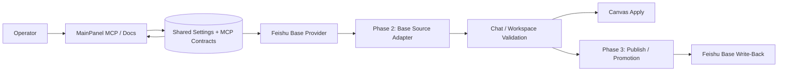

# Knowgrph - Feishu Base MCP Integration PRD/TAD

`version {{version}}` - `status {{status}}` - owner `{{author}}` - {{updated}}

This document defines the implementation contract for integrating Feishu Base into Knowgrph through the existing MCP, settings, chat, workspace, and publish topology.

It does not authorize a parallel graph pipeline, a downstream-only Cloudflare patch, direct browser-side Feishu secret storage, or direct graph mutation from Base rows. Feishu Base must enter Knowgrph through the existing SSOT-driven surfaces and validation owners.

---

## Source Baseline

### Current Repo Truth

| Surface | Current State | Contract Impact |
|---|---|---|
| MainPanel MCP | Existing MCP settings and docs surfaces already aggregate external MCP integrations, and Feishu Base is now wired into that same path. | Phase 1 is implemented through the existing settings and virtual-doc entry owners instead of a bespoke runtime branch. |
| Shared MCP contracts | Tool contracts and published executors are centralized, and Feishu Base now has a shared SSOT metadata owner. | Feishu Base integration extends shared SSOT and does not duplicate constants across docs, settings, and tests. |
| Chat -> Workspace -> Canvas path | Existing validation path owns Markdown/frontmatter ingestion before canvas apply. | Feishu Base content must flow through evidence/document validation before graph materialization. |
| Publish chain | Dev -> Prod mirror -> Cloudflare Pages is already contractually defined. | No downstream-only Base patching in `content/knowgrph` or Pages Functions. |
| Existing MCP docs style | Combined PRD/TAD docs exist for MCP service and Exa MCP. | This document follows the same frontmatter and traceability pattern. |

### External Integration Truth

| Fact | Impact |
|---|---|
| Feishu Base operations are available through `lark-base` and a Base-oriented MCP/tooling ecosystem. | Product language should treat Feishu Base as a structured data source and operator integration, not just a freeform document source. |
| Feishu Base commonly requires tokens, table identifiers, field identifiers, and permission-aware identity handling. | Browser state must not own privileged credentials; host/server/integration layers own auth. |
| Base records can be used as structured source material, operational metadata, or write-back targets. | The architecture should separate read-source, transform, and publish/write-back concerns. |
| Base content is structured and queryable, but not inherently trusted for graph mutation. | Base-originated data must still pass the existing Knowgrph validation and normalization chain. |

---

## Executive Summary

Knowgrph already has a strong MCP foundation, and it now has a shipped Phase 1 Feishu Base integration baseline. The rollout remains incremental and SSOT-aligned:

1. Phase 1 is implemented: Feishu Base is shipped as an external MCP configuration and operator-facing documentation surface.
2. Phase 2 remains planned: add a Feishu Base adapter only when Base should behave as a real content or source-file input.
3. Phase 3 remains planned: add write-back or publish promotion only when Base should become a downstream target for generated artifacts.

The main architectural risk is not Base connectivity. The main risk is integration sprawl: duplicated constants, direct Base-to-graph writes, browser-owned credentials, and downstream deployment patches. The solution is a phased approach that reuses existing owners and keeps all validation upstream.

---

## Problem Discovery

### Problem Statement

Operators can work with MCP surfaces today, and before this Phase 1 rollout Knowgrph did not expose a first-class Feishu Base integration path. That gap forced Base usage into ad-hoc manual steps, external notes, or one-off scripts instead of a reusable and auditable product path.

For knowledge graphs, agent-ready workflows, and structured content operations, operators need Feishu Base to serve one or more of these roles:

- a discoverable external MCP integration
- a structured source of records and metadata
- a downstream publish or write-back target for generated outputs

Without a documented contract, Feishu Base integration will drift across multiple layers and violate the repo's upstream-SSOT and no-downstream-patch rules.

### Problem Hypothesis

If Feishu Base is integrated in three bounded phases that reuse existing settings, chat, validation, and publish owners, Knowgrph can support Base-driven workflows with lower architecture risk, lower maintenance overhead, and stronger traceability from operator intent to validated output.

### ROI Estimate

| Factor | Estimate | Rationale |
|---|---:|---|
| User impact | 4 | Structured Base content is high-value for knowledge, operations, and publish workflows. |
| Reach | 3 | Applies to operators, maintainers, content pipelines, and agent-ready demos. |
| Build hours | 12 | Phase 1 is small; Phases 2 and 3 expand based on proven value. |
| Monthly TCO | 0 incremental for documentation/configuration path | Existing surfaces are reused; later phases may add token or API-cost considerations. |
| Token cost/month | Bounded by existing chat and transform pipelines | Phase 1 has no meaningful new token spend; later phases inherit existing budgets. |
| ROI score | 1.0 for phased start | `(4 * 3) / 12` with zero incremental paid TCO at P0. |

### Phase 0 Gate

Proceed because the minimum viable scope is documentation and configuration-first, uses existing infrastructure, and preserves the Dev -> Prod -> Cloudflare contract. Defer adapter logic and write-back until the prior phase proves value and reduces uncertainty.

---

## PRD

### Personas And Jobs To Be Done

| Persona | Job | Success Signal |
|---|---|---|
| Operator | Discover and configure Feishu Base from the same MCP-aware product surface. | MainPanel shows a clear Feishu Base integration section with source-of-truth setup guidance. |
| Knowledge user | Use Base records as structured evidence or source content for Knowgrph workflows. | Base-derived content enters Knowgrph through validated document or evidence paths. |
| Maintainer | Extend Feishu Base support without creating a parallel runtime or deployment fork. | One shared design drives settings, docs, tests, and deployment expectations. |
| Publisher | Optionally promote generated outputs back to Feishu Base when needed. | Write-back occurs through a controlled promotion step rather than direct graph mutation. |
| Auditor | Verify that auth boundaries, validation rules, and deployment ownership remain intact. | No browser secrets, no downstream-only patches, and no unsafe Base-to-graph bypasses. |

### User Journey Flow

| Stage | Action | Touchpoint | Pain Point | Opportunity |
|---|---|---|---|---|
| Trigger | Operator wants Knowgrph to connect to structured Feishu Base content | MainPanel MCP | No canonical Feishu Base entry point exists | Add a discoverable Feishu Base MCP integration surface |
| Discover | Operator searches for Base or MCP setup details | MainPanel search/docs | Base setup drifts into tribal knowledge | Publish one SSOT-backed documentation surface |
| Configure | Operator reviews how Base should connect | MainPanel MCP and docs | It is unclear whether Base is config, source, or publish target | Separate Phase 1, Phase 2, and Phase 3 responsibilities clearly |
| Engage | User consumes Base-backed content in chat or document workflows | Chat/workspace | Direct data ingestion is easy to do unsafely | Require existing validation path before canvas apply |
| Publish | User wants generated artifacts to update Base | Promote/publish path | Write-back target is undefined | Introduce a controlled publish target only in Phase 3 |
| Return | Maintainer extends the feature | Dev repo and docs | Architecture can sprawl across dev, prod, and cloud | Keep all changes upstream and mirror through the existing release flow |

### User Stories

| ID | Story | Acceptance Criteria | Priority |
|---|---|---|---|
| PRD-FEISHU-BASE-MCP-01 | As an operator, I can find a Feishu Base MCP integration entry in Knowgrph docs/settings. | Given MainPanel MCP is opened, when settings/docs rows render, then Feishu Base integration guidance appears as a first-class entry. | Must |
| PRD-FEISHU-BASE-MCP-02 | As a maintainer, I can add Feishu Base support without creating a parallel MCP runtime. | Given implementation begins, when files are added, then the design reuses existing settings, shared contracts, and validation owners. | Must |
| PRD-FEISHU-BASE-MCP-03 | As a knowledge user, I can use Base data as a structured source only through validated paths. | Given Base content is ingested, when it reaches Knowgrph, then it passes through existing normalization and validation before graph apply. | Must |
| PRD-FEISHU-BASE-MCP-04 | As a publisher, I can treat Base as a downstream promotion target only when explicitly enabled. | Given generated artifacts are promoted, when Base write-back is active, then it happens in the promotion layer and not through direct graph mutation. | Should |
| PRD-FEISHU-BASE-MCP-05 | As an auditor, I can confirm the deployment flow remains Dev -> Prod -> Cloudflare. | Given the integration is implemented, when it is released, then prod/cloud changes originate from Dev SSOT and not from downstream patches. | Must |

### Acceptance Criteria And Goal Conditions

| Criterion | Given | When | Then | `/goal` Condition |
|---|---|---|---|---|
| AC-01 | MainPanel MCP/docs render | The operator searches for Feishu Base | A Feishu Base MCP integration doc surface is visible | `/goal Feishu Base MCP documentation rows render from one source of truth and focused documentation tests pass` |
| AC-02 | The design is implemented | New integration files are introduced | The implementation reuses existing MCP/settings owners and adds no parallel runtime | `/goal Feishu Base integration uses existing settings and MCP owners with no duplicate runtime entrypoints, verified by focused code review and tests` |
| AC-03 | Base content is used as source input | The content reaches Knowgrph workflows | It passes through normalization and validation before canvas apply | `/goal any Feishu Base sourced content reaches canvas only through validated document or evidence paths` |
| AC-04 | Base is enabled as a publish target | A generated artifact is promoted | The write occurs in the promotion layer, not in direct graph mutation code | `/goal Feishu Base write-back is isolated to the promotion layer and no direct graph-write shortcut exists` |
| AC-05 | The release is prepared | Changes are mirrored to prod/cloud | The deployment originates from Dev SSOT and follows the existing publish chain | `/goal Feishu Base integration artifacts are generated from Dev sources and no downstream-only patch is required in prod or Cloudflare` |

### Success Metrics

| Metric | Baseline | Target | Timeline |
|---|---:|---:|---|
| Feishu Base integration doc drift | Implemented in Phase 1 | 0 drift across docs, settings, and design references | P0 |
| Browser-stored Feishu credentials | 0 desired | 0 | Always |
| Parallel Base runtime branches | 0 desired | 0 | Always |
| Direct Base-to-graph mutation path | 0 desired | 0 | Always |
| Upstream-only release compliance | Manual today | 100 percent through Dev SSOT | P1 |
| Structured Base-source validation coverage | Not implemented | All Base-source flows routed through validation owners | P2 |
| Controlled Base publish target coverage | Not implemented | Promotion-only write-back contract defined | P3 |

### MoSCoW Priority

| Tier | Requirement | ROI/TCO Rationale |
|---|---|---|
| Must | Define Feishu Base Phase 1 as a configuration/documentation surface | Lowest build cost, highest clarity gain |
| Must | Keep Feishu Base auth outside browser state | Security baseline and zero-regret rule |
| Must | Route Base source data through existing validation paths | Prevents unsafe graph mutation and avoids duplicate pipelines |
| Must | Keep release ownership upstream in Dev | Preserves current publish topology and avoids drift |
| Should | Add Phase 2 adapter design for content-source use cases | Valuable once Phase 1 clarifies operator needs |
| Should | Add Phase 3 promotion design for write-back workflows | Useful only after upstream source usage is proven |
| Could | Add richer Base-specific source normalization templates | Helpful later, not required for the first contract |
| Won't | Patch `content/knowgrph` or Cloudflare routes as the primary source of truth | Explicitly forbidden |
| Won't | Store Feishu Base secrets in browser settings | Explicitly forbidden |
| Won't | Add direct Base row to graph mutation bypasses | Explicitly forbidden |

### Min-Viable Scope

P0 is now implemented as documentation-first and architecture-first:

1. Add this PRD/TAD under `docs/documents/knowgrph-mcp`.
2. Define Feishu Base integration scope in three phases.
3. Keep all future implementation anchored to shared settings, shared MCP contracts, validation owners, and publish owners.

### Out Of Scope

- Building the full Feishu Base adapter in this Phase 1 baseline.
- Implementing write-back in this Phase 1 baseline.
- Adding downstream-only prod or Cloudflare patches.
- Defining browser BYOK flows.
- Replacing the current chat/workspace/canvas validation chain.

### Dependencies

| Dependency | Type | TCO Posture | Notes |
|---|---|---|---|
| Feishu Base / `lark-base` ecosystem | External integration surface | Existing operator/tooling dependency | Base operations and semantics originate outside the repo. |
| MainPanel settings/docs owners | Internal | Zero incremental infra cost | Phase 1 reuses them directly. |
| Shared MCP contracts | Internal | Zero incremental infra cost | Required for SSOT-aligned integration. |
| Chat/workspace validation owners | Internal AI/document pipeline | Existing token budget applies | Required for Phase 2. |
| Publish/promotion owners | Internal | Zero incremental infra cost for design stage | Required for Phase 3. |

### Open Questions

| ID | Question | Owner | Resolution Rule |
|---|---|---|---|
| OQ-01 | Should Feishu Base be represented as a remote MCP, a documented external provider, or both? | Maintainer | Start with documented external provider semantics in Phase 1. |
| OQ-02 | What is the canonical Base-to-document transformation format? | Maintainer | Reuse existing canonical markdown/frontmatter patterns in Phase 2. |
| OQ-03 | Which generated artifacts are eligible for Base write-back? | Maintainer | Limit to promotion-owned artifacts in Phase 3. |
| OQ-04 | Does Base write-back require row-level idempotency or conflict handling? | Maintainer | Treat as a Phase 3 contract question, not a Phase 1 blocker. |

---

## TAD

### Architecture Overview

From `operator intent` to `validated integration`:

`MainPanel MCP / docs` defines the Feishu Base integration contract -> `shared MCP/settings contracts` keep metadata and configuration aligned -> `source adaptation` optionally transforms Base content into canonical Knowgrph document inputs -> `chat/workspace validation` normalizes content before graph apply -> `publish/promotion` optionally writes generated artifacts back to Feishu Base.

### Recommended Integration Approach

#### Phase 1 - External MCP Configuration Surface

Phase 1 introduces Feishu Base as an operator-visible integration surface inside the existing MainPanel/settings/docs architecture, and this baseline is now implemented.

Scope:

- add Feishu Base configuration and documentation entries
- reuse the existing settings registry and docs-rendering patterns
- document auth boundaries and operator setup
- avoid any new provider runtime, graph importer, or downstream deployment override

Primary outcome:

Feishu Base is discoverable and governable without changing the core runtime topology.

Why this phase first:

- smallest scope with highest clarity
- no new publish or graph risks
- aligns with the existing Exa-style MCP documentation pattern

#### Phase 2 - Content-Source Adapter

Phase 2 begins only when Feishu Base should behave as a real content source for Knowgrph.

Scope:

- adapt Base records or views into canonical markdown or source-file style outputs
- place the adaptation behind shared executors or equivalent upstream owners
- route Base-derived content into existing chat, workspace, and validation flows
- preserve source citations, schema validation, and safe transformation boundaries

Primary outcome:

Feishu Base can feed structured content into Knowgrph without bypassing validation owners.

Why this is phase two:

- it introduces real data transformation concerns
- it requires contract design for record, table, and field mapping
- it should only happen after the product surface is stable

#### Phase 3 - Publish / Promotion Target

Phase 3 begins only when Feishu Base should receive generated outputs from Knowgrph.

Scope:

- add Feishu Base as a controlled promotion target
- isolate write-back logic inside publish or promotion owners
- preserve idempotency, auditability, and explicit operator intent
- keep canvas state generation upstream and independent of write-back

Primary outcome:

Knowgrph can publish generated artifacts to Feishu Base without turning Base into a direct graph mutation channel.

Why this is phase three:

- write-back adds side effects, permissions, and reconciliation risk
- it belongs after source ingestion is proven
- it must not contaminate validation or rendering owners

### Architecture Diagram

### Journey To System Mapping

| Journey Stage | Workflow | Data Flow | Component |
|---|---|---|---|
| Discover | Operator opens MainPanel MCP/docs | Shared metadata -> rendered integration rows | MainPanel MCP/docs |
| Configure | Operator reads Base setup contract | Settings/doc constants -> operator guidance | Shared settings and docs owners |
| Ingest | Base becomes a real source | Base record/view -> canonical document input | Phase 2 adapter |
| Validate | Content is normalized before use | Canonical document input -> validated markdown/frontmatter | Chat/workspace validation owners |
| Apply | Valid content updates graph state | Validated doc -> graph materialization | Existing canvas apply owners |
| Publish | Generated outputs are written back | Artifact -> promotion target payload | Phase 3 promotion owner |

### Component Specifications

#### Component: Feishu Base Integration SSOT

| Field | Value |
|---|---|
| Responsibility | Own Feishu Base integration metadata, scope labels, docs references, and phase definitions. |
| Implemented location | `grph-shared/src/search/feishuBaseMcpSsot.ts` |
| Interfaces | Shared constants consumed by docs, settings rows, tests, and implementation guards. |
| Dependencies | None beyond current TypeScript/documentation owners. |
| Configuration | No secrets; metadata only. |
| Goal Conditions | AC-01, AC-02, AC-05. |

#### Component: MainPanel Feishu Base Documentation Surface

| Field | Value |
|---|---|
| Responsibility | Render Feishu Base setup, phase boundaries, auth rules, and operator guidance in the existing MainPanel surface. |
| Implemented owner | `canvas/src/features/panels/views/feishuBaseMcpApiDocs.ts` |
| Interfaces | Virtual doc entries and section metadata. |
| Dependencies | Shared Feishu Base integration SSOT. |
| Configuration | English operator-facing copy and canonical links only. |
| Goal Conditions | AC-01, AC-02. |

#### Component: Phase 2 Base Source Adapter

| Field | Value |
|---|---|
| Responsibility | Transform Base-originated rows, tables, or views into canonical Knowgrph document inputs. |
| Planned owner | Shared executor or equivalent upstream source-adaptation owner. |
| Input Schema | `{ baseToken, tableId, viewId, fieldMap, recordSelection, sourcePolicy }` |
| Output Schema | `{ sourceDocuments, sourceMetadata, warnings }` |
| Dependencies | Feishu Base provider plus existing validation owners. |
| Fallback | Return a structured source error and keep workspace/canvas unchanged. |
| Goal Conditions | AC-03. |

#### Component: Validation Path Reuse

| Field | Value |
|---|---|
| Responsibility | Preserve the current chat -> workspace -> validation -> canvas apply chain for Base-derived content. |
| Existing owner | Existing validation and apply owners. |
| Interfaces | Canonical markdown/frontmatter or equivalent validated document form. |
| Dependencies | Phase 2 source adapter when enabled. |
| Goal Conditions | AC-03. |

#### Component: Phase 3 Publish / Promotion Adapter

| Field | Value |
|---|---|
| Responsibility | Write generated artifacts to Feishu Base as a downstream target. |
| Planned owner | Existing promotion or artifact-publish owner. |
| Input Schema | `{ artifactId, targetBase, targetTable, rowMode, idempotencyKey }` |
| Output Schema | `{ status, writtenRecords, warnings }` |
| Dependencies | Promotion flow plus Feishu Base write permissions. |
| Fallback | Surface publish failure without mutating graph state. |
| Goal Conditions | AC-04, AC-05. |

### Integration Contracts

| Interface | Protocol | Format | Errors | Owner |
|---|---|---|---|---|
| MainPanel Feishu Base docs | Internal UI composition | Structured settings/doc rows | Missing constants, stale docs rows | Settings/docs owner |
| Feishu Base source adaptation | Integration-driven data fetch | Structured record/view payloads -> canonical documents | auth, permission, missing field mapping, invalid table/view | Phase 2 adapter owner |
| Validation path | Internal document pipeline | Markdown/frontmatter or validated canonical document | schema failure, malformed content, rejected transformations | Existing validation owners |
| Feishu Base publish target | Promotion/write-back contract | Artifact payload -> Base write request | auth, permission, conflict, idempotency failure | Phase 3 promotion owner |

### Data Flow

| Stage | Component | Input Format | Output Format | Persistence | Error Handling |
|---|---|---|---|---|---|
| Configure | MainPanel docs/settings | Shared metadata | Rendered setup guidance | Local settings for non-secret metadata only | Reset to SSOT defaults |
| Source | Feishu Base provider | Base tables, views, or records | Structured source payload | External provider only | Structured provider error |
| Transform | Phase 2 adapter | Structured source payload | Canonical documents | Optional workspace draft after validation request | Reject invalid mappings |
| Validate | Existing doc pipeline | Canonical documents | Validated markdown/frontmatter | Workspace and graph only after success | Fail closed |
| Publish | Phase 3 promotion owner | Generated artifact | Base write-back payload | External provider write target | Surface write failure and keep graph stable |

### Security And Privacy Requirements

| Requirement | Rule | Validation |
|---|---|---|
| No browser secrets | Do not store Base tokens, app secrets, or privileged credentials in browser settings. | Grep, config review, and targeted tests |
| No direct graph mutation | Base content cannot bypass validation owners to mutate graph state. | Pipeline inspection and focused tests |
| Upstream ownership | Do not patch prod or Cloudflare as primary implementation layers. | Release review against Dev SSOT |
| Least privilege | Read and write responsibilities stay separated by phase and owner. | Design review and implementation checklist |
| Structured failure | Provider failures must return explicit errors instead of silent degradation. | Adapter and promotion tests |

### Quality Attributes

| Attribute | Scenario | Pattern | Validation |
|---|---|---|---|
| Performance | Phase 1 docs load with no provider call during render | Static SSOT + local rendering | Render test |
| Scalability | Phase 2 processes larger Base datasets over time | Canonical document boundaries and selective record mapping | Focused transform tests |
| Security | Operators request Base auth support | Host/server-owned credentials only | No-browser-secret tests |
| Observability | Base source and publish actions are introduced | Structured logs and explicit phase ownership | Focused runtime assertions |
| Token Cost | Base content is summarized into existing AI paths | Reuse existing bounded validation/chat budgets | Budget review when Phase 2 starts |
| TCO | The integration expands from docs to source and publish workflows | Phase-gated rollout and reuse of existing owners | ADR review before each phase expansion |

### Deployment Strategy

Implementation follows the existing release chain:

1. Author and implement in `Dev` at `/Users/huijoohwee/Documents/GitHub/knowgrph`.
2. Mirror generated artifacts to `Prod` at `/Users/huijoohwee/Documents/GitHub/huijoohwee/content/knowgrph`.
3. Publish via Cloudflare Pages to `https://airvio.co/knowgrph`.

Deployment rules:

- Dev remains the SSOT.
- Prod mirror remains generated output, not a design owner.
- Cloudflare Pages and Functions remain delivery infrastructure, not the primary architecture layer for Feishu Base behavior.

Rollback rules:

- remove upstream Feishu Base integration entries first
- re-sync prod mirror from Dev
- do not leave orphaned downstream patches

### Component Inventory

| Layer | Component | File / Module | Status |
|---|---|---|---|
| Documentation | This PRD/TAD | `docs/documents/knowgrph-mcp/knowgrph-feishu-base-mcp-prd-tad.md` | Implemented baseline |
| Phase 1 | Feishu Base docs/settings integration surface | `canvas/src/features/panels/views/feishuBaseMcpApiDocs.ts` | Implemented |
| Phase 1 | Shared Feishu Base integration SSOT | `grph-shared/src/search/feishuBaseMcpSsot.ts` | Implemented |
| Phase 1 | Feishu Base settings registry | `canvas/src/features/settings/registry-feishu-base-mcp.ts` + `canvas/src/features/settings/registry.ts` | Implemented |
| Phase 1 | MCP doc entry aggregation | `canvas/src/features/panels/views/settingsMcpDocEntries.ts` + `canvas/src/features/panels/views/settingsView.constants.ts` + `canvas/src/features/panels/views/useSettingsView.helpers.ts` | Implemented |
| Phase 1 | Focused MCP tests | `canvas/src/__tests__/mainPanelMcpFeishuBase.test.tsx` + `canvas/src/__tests__/helpers/mainPanelMcpExpectations.ts` | Implemented |
| Phase 2 | Base source adapter | Shared executor or source-adaptation owner | Planned |
| Phase 2 | Validation-path reuse | Existing chat/workspace/canvas validation owners | Existing / Planned integration |
| Phase 3 | Publish / promotion adapter | Existing promotion owner | Planned |
| Release | Dev -> Prod -> Cloudflare mirror path | Existing build/sync/deploy owners | Existing |

---

## ADRs

### ADR-001: Start With a Configuration-First Integration

**Status**: Proposed
**Date**: 2026-06-06

#### Context

Knowgrph has no Feishu Base runtime integration today, but it already has strong settings, docs, MCP, and validation foundations.

#### Decision

Make Feishu Base visible first as a configuration and documentation surface inside existing owners before adding any source adapter or write-back behavior.

#### Alternatives Considered

1. Configuration-first rollout: lowest-risk, highest clarity, fastest adoption path.
2. Full adapter immediately: faster feature breadth, but adds transformation and validation risk too early.
3. Write-back immediately: highest side-effect risk and weakest phase separation.

#### TCO Impact

| Dimension | Chosen Option | Best FOSS Alternative | Delta / 12 months |
|---|---|---|---|
| Infra cost | 0 incremental at Phase 1 | Same | 0 |
| Egress cost | 0 at docs-only stage | Same | 0 |
| Token cost | 0 meaningful change | Same | 0 |
| Vendor risk | Low integration commitment | Same | Lower early risk |

#### Consequences

- Positive: clear product surface and low-risk start.
- Negative: Phase 1 alone does not deliver real data ingestion.
- Neutral: later phases remain open but controlled.

### ADR-002: Use Existing Validation Paths for Base-Sourced Content

**Status**: Proposed
**Date**: 2026-06-06

#### Context

Base data is structured, but it should not be trusted as direct graph mutation input.

#### Decision

Any Base-derived content must enter Knowgrph through the existing document/evidence validation path before canvas apply.

#### Alternatives Considered

1. Reuse existing validation path: safest and most consistent.
2. Direct Base-to-graph importer: faster but violates current architectural guardrails.
3. Parallel Base pipeline: increases drift and maintenance burden.

#### TCO Impact

| Dimension | Chosen Option | Best FOSS Alternative | Delta / 12 months |
|---|---|---|---|
| Infra cost | 0 incremental infra | Same | 0 |
| Egress cost | Provider reads only when Phase 2 starts | Same | 0 |
| Token cost | Reuses existing bounded pipelines | Direct importer lower but unsafe | Accepted safety trade-off |
| Vendor risk | Lower architecture lock-in | Higher if parallel path is built | Lower |

#### Consequences

- Positive: preserves safety and auditability.
- Negative: adds transformation work before data reaches graph state.
- Neutral: write-back remains a separate concern.

### ADR-003: Keep Write-Back in Promotion Owners

**Status**: Proposed
**Date**: 2026-06-06

#### Context

Base write-back is a downstream side effect and should not contaminate rendering or validation layers.

#### Decision

If Feishu Base becomes a target, it must be added in the promotion layer and remain isolated from graph generation logic.

#### Alternatives Considered

1. Promotion-layer write-back: clean ownership and auditable side effects.
2. Validation-layer write-back: mixes transformation with publishing.
3. Direct canvas-linked write-back: tight coupling and unsafe semantics.

#### TCO Impact

| Dimension | Chosen Option | Best FOSS Alternative | Delta / 12 months |
|---|---|---|---|
| Infra cost | Minimal incremental logic | Same | 0 to low |
| Egress cost | Provider write calls only when promoted | Same | bounded |
| Token cost | No required incremental AI cost | Same | 0 |
| Vendor risk | Controlled by explicit target ownership | Higher in mixed-layer designs | Lower |

#### Consequences

- Positive: clear separation of concerns.
- Negative: requires explicit promotion contracts.
- Neutral: only needed when Phase 3 is approved.

---

## Traceability Matrix

| PRD Story | TAD Component | Files/Owners | Verification |
|---|---|---|---|
| PRD-FEISHU-BASE-MCP-01 | MainPanel Feishu Base documentation surface | `feishuBaseMcpApiDocs.ts`, `settingsMcpDocEntries.ts`, `settingsView.constants.ts`, `useSettingsView.helpers.ts` | `mainPanelMcpFeishuBase.test.tsx` |
| PRD-FEISHU-BASE-MCP-02 | Feishu Base integration SSOT | `feishuBaseMcpSsot.ts`, `registry-feishu-base-mcp.ts`, `registry.ts`, local-storage owners | Focused assertions and typecheck |
| PRD-FEISHU-BASE-MCP-03 | Phase 2 adapter plus validation-path reuse | Planned shared adapter owner + existing validation owners | Planned pipeline tests |
| PRD-FEISHU-BASE-MCP-04 | Phase 3 promotion adapter | Planned promotion owner | Planned publish-target tests |
| PRD-FEISHU-BASE-MCP-05 | Deployment strategy and release ownership | Dev -> Prod -> Cloudflare owners | Release checklist |

---

## Validation Plan

### Static Checks

| Check | Command | Expected |
|---|---|---|
| Frontmatter parses | `npm --prefix canvas run doc:lint` | Exit 0 for this document and neighboring docs |
| Whitespace hygiene | `git diff --check -- docs/documents/knowgrph-mcp/knowgrph-feishu-base-mcp-prd-tad.md` | Exit 0 |
| Phase 1 focused MCP surface | direct module execution of `mainPanelMcpFeishuBase.test.tsx` | Exit 0 |
| MCP regression safety | direct module execution of `mainPanelMcpExa.test.tsx` and `mainPanelMcpStripe.test.tsx` | Exit 0 |
| Type safety | `npm --prefix canvas run check` | Exit 0 |

### Focused Runtime Checks For Future Implementation

| Check | Proposed Command | Expected |
|---|---|---|
| Phase 1 docs/settings contract | `npm --prefix canvas test -- feishuBaseMcp` | Feishu Base integration rows and metadata pass |
| Phase 2 validation-path proof | `npm --prefix canvas test -- agentReadyLocalMainPanelChatCanvasPipeline` | Base-derived content still routes through validation owners |
| Phase 3 publish target proof | `npm --prefix canvas test -- feishuBasePromotion` | Write-back remains isolated to promotion owner |

---

## Implementation Guardrails

- Reuse existing MainPanel, MCP, validation, and promotion owners.
- Keep Feishu Base constants and phase boundaries centralized.
- Do not implement Base behavior first in prod mirror or Cloudflare functions.
- Do not store Feishu Base credentials in browser state.
- Do not add direct Base-to-graph mutation shortcuts.
- Do not start Phase 2 or Phase 3 work until Phase 1 is documented and aligned.
