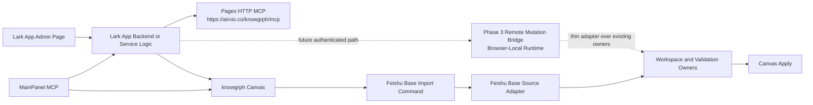

# Knowgrph - Lark App MCP to Canvas Integration PRD/TAD

`version {{version}}` - `status {{status}}` - owner `{{author}}` - {{updated}}

This document defines the implementation contract for connecting a Lark app to the shipped `knowgrph` MCP surfaces while using `knowgrph` Canvas as the canonical user-mediated import, validation, and visualization surface.

It does not authorize a direct connection from the Lark Open Platform admin page to a local filesystem path, a parallel remote mutation runtime, browser-owned Lark secrets inside `knowgrph`, or a direct Lark row -> graph mutation bypass. Lark app integration must target the deployed MCP boundary and reuse the existing Canvas validation and source-file import owners.

---

## Source Baseline

### External Source Facts

| Fact | Source | Contract Impact |
|---|---|---|
| `https://open.larksuite.com/app/cli_a7ddaa5aeff89010/baseinfo` is a Lark Open Platform app-management page, not a Feishu Base URL and not a `knowgrph` MCP endpoint. | Lark URL shape and live verification | The app-management page itself is not the integration target. |
| Lark apps can call external HTTP services through app backends or hosted service logic. | Lark app platform model | The Lark app should behave as an MCP client or bridge client, not as a direct file-path consumer. |
| Feishu Base/Lark Base access is permission- and token-scoped. | Lark platform model | Auth remains host-managed or backend-managed; Canvas browser state must not own privileged app secrets. |
| Lark users expect an interactive UI for review and confirmation. | Product expectation | `knowgrph` Canvas is the right review, import, and graph-visualization surface. |

### Local Repo Truth

| Surface | Current State | Owner | Integration Rule |
|---|---|---|---|
| Local stdio MCP | Shipped | `mcp/server.js`, `mcp/local-tool-contract.js` | Useful for local MCP clients only; not the direct target for a Lark cloud app. |
| Pages HTTP MCP | Shipped | `cloudflare/pages/knowgrph-agent-ready.mjs` | Remote Lark integration must target `https://airvio.co/knowgrph/mcp`. |
| Browser WebMCP and app runtime | Shipped | `canvas/src/features/agent-ready/webMcpRuntime.ts`, `canvas/src/main.tsx` | Browser-local inspection remains separate from remote Lark integration. |
| MainPanel MCP Lark docs surface | Shipped | `grph-shared/src/search/larkAppMcpSsot.ts`, `canvas/src/features/panels/views/larkAppMcpApiDocs.ts`, `canvas/src/features/panels/views/settingsMcpDocEntries.ts` | The Lark app -> deployed MCP -> Canvas flow is now surfaced as a first-class MCP documentation family in MainPanel. |
| Lark-to-Canvas handoff contract | Shipped | `canvas/src/features/canvas/larkAppCanvasHandoff.ts`, `canvas/src/lib/routing/queryParams.ts` | Phase 2 handoff uses a typed query payload and forbids endpoint overrides, secrets, and direct mutation semantics. |
| Canvas handoff bootstrap runtime | Shipped | `canvas/src/features/canvas/CanvasQueryBootstrapRuntime.tsx` | Lark review/import launches reuse the existing query/bootstrap lane and Base import seam. |
| Remote mutation bridge contract | Shipped | `canvas/src/features/canvas/larkAppRemoteMutationBridge.ts`, `grph-shared/src/search/larkAppMcpSsot.ts` | Phase 3 defines auth, idempotency, conflict, and audit rules for the live browser-local runtime bridge. |
| Remote mutation bridge runtime | Shipped browser-local | `canvas/src/features/canvas/larkAppRemoteMutationBridgeRuntime.ts`, `canvas/src/features/canvas/CanvasQueryBootstrapRuntime.tsx` | Phase 3 now installs a browser-local runtime bridge that supports `import-source-document` via the existing Base import seam and `publish-approved-artifact` as a validated dry-run preview, while still deferring any remote write-capable endpoint. |
| Canvas runtime command install | Shipped | `canvas/src/App.tsx` | Canvas can host user-mediated runtime commands after the app loads. |
| Feishu Base source adapter | Shipped | `canvas/src/features/source-files/feishuBaseSourceAdapter.ts` | Base snapshots already have a canonical source-document transformation path. |
| Feishu Base source import bridge | Shipped | `canvas/src/features/source-files/feishuBaseSourceImportCommand.ts` | Canvas already exposes a host-managed import seam for Base snapshots. |
| Chat -> Workspace -> Canvas path | Shipped | Existing chat, validation, workspace, and apply owners | Lark-originated content must still flow through the same validation/apply chain. |
| Dev -> Prod -> Cloudflare release chain | Shipped | Existing publish topology | New Lark app integration contracts must remain upstream in Dev. |

---

## Executive Summary

Knowgrph already exposes the key ingredients needed for a Lark app integration, and the first three product slices now ship in bounded form:

1. a deployed, remote, read-only MCP endpoint at `https://airvio.co/knowgrph/mcp`
2. a shipped MainPanel MCP documentation surface that explains the Lark app -> deployed MCP -> Canvas flow
3. a shipped typed Lark-to-Canvas handoff contract that treats `webpage` as launch/configuration only
4. a shipped typed authenticated remote mutation bridge plus a browser-local runtime bridge that remains non-remote
5. a shipped Canvas runtime with a host-managed Feishu Base import bridge and validated graph-apply path

The integration must therefore be phased:

1. Phase 1 is implemented: treat the Lark app as an external MCP client of the deployed `knowgrph` MCP and surface that contract in MainPanel MCP
2. Phase 2 is implemented for the next slice: use `knowgrph` Canvas as the user-mediated review/import surface for Base snapshots and structured source content through a typed handoff and the existing import seam
3. Phase 3 is implemented in bounded form: ship an authenticated remote mutation contract plus a browser-local runtime bridge with dry-run publish preview and without adding a remote write-capable endpoint

The main risk is not transport. The main risk is architectural drift: connecting a Lark app admin page to a local repo path, duplicating MCP runtimes, leaking Lark secrets into browser state, or bypassing Canvas validation. The solution is to keep remote reads on the shipped Pages HTTP MCP and keep human-reviewed mutation or import flows inside `knowgrph` Canvas until a separately authorized remote mutation layer exists.

---

## Problem Discovery

### Problem Statement

The current Lark app page can discover app settings, but by itself it does not explain how that Lark app should consume `knowgrph` MCP or how it should use `knowgrph` Canvas as the canonical graph and source-material surface. Before this rollout, that mapping lived only in analysis and not in a first-class repo surface.

Without a repo-accurate contract, a Lark app integration will drift into one of four bad patterns:

- trying to connect the Lark app directly to `/Users/huijoohwee/Documents/GitHub/knowgrph`
- treating the Lark app admin page as a Feishu Base or MCP endpoint
- creating a parallel write-capable remote graph service before validation and auth are designed
- pushing Base-originated content into graph state without the existing Canvas review and validation steps

Operators need a clear answer to one product question:

How should a Lark app connect to `knowgrph` so that remote discovery uses the shipped MCP surface and actual content import or graph work still uses `knowgrph` Canvas?

### Problem Hypothesis

If the Lark app is modeled as a remote MCP client for read-only discovery and `knowgrph` Canvas is modeled as the canonical user-mediated import and visualization surface, operators can connect Lark and `knowgrph` with lower security risk, clearer deployment ownership, and better traceability from Lark-originated intent to validated graph output.

### ROI Estimate

| Factor | Estimate | Rationale |
|---|---:|---|
| User impact | 4 | Lark is the operational surface; Canvas is the graph-review surface. Joining them removes workflow fragmentation. |
| Reach | 3 | Applies to operators, maintainers, Base users, and MCP demos. |
| Build hours | 10 | Initial contract and Canvas-oriented integration plan are moderate in scope. |
| Monthly TCO | 0 incremental for Phase 1 | Phase 1 reuses the existing deployed MCP and Canvas runtime. |
| Token cost/month | Bounded by existing chat and import paths | Phase 1 adds no new AI pipeline; later phases reuse existing bounded paths. |
| ROI score | 1.2 for phased start | `(4 * 3) / 10` with zero incremental paid TCO at P0. |

### Phase 0 Gate

Proceed because the min-viable scope is a documentation and integration-contract layer over already shipped surfaces. Defer any new remote mutation runtime, OAuth-specific remote bridge, or non-Canvas write path until the read-only MCP plus Canvas-mediated flow proves real operator value.

---

## PRD

### Personas And Jobs To Be Done

| Persona | Job | Success Signal |
|---|---|---|
| Lark app operator | Connect a Lark app to `knowgrph` without guessing which endpoint or surface to use. | The operator sees one canonical remote MCP target and one canonical Canvas handoff path. |
| Canvas operator | Review imported Lark or Base content before it affects graph state. | Imported content lands in source files or validated workspace documents before Canvas apply. |
| Maintainer | Extend Lark integration without creating a new MCP stack or bypass path. | One design separates remote read-only MCP from Canvas-mediated import/mutation. |
| Auditor | Verify secrets, validation, and deployment ownership remain intact. | No browser-owned app secrets, no local-path coupling, and no direct row-to-graph mutation. |
| Publisher | Eventually promote approved artifacts back into Lark or Base workflows. | Write-back stays isolated to a future authenticated bridge or promotion owner. |

### User Journey Flow

| Stage | Action | Touchpoint | Pain Point | Opportunity |
|---|---|---|---|---|
| Trigger | Operator wants a Lark app to use `knowgrph` | Lark app admin page and docs | The app page is not the actual MCP target | Publish the real endpoint and surface mapping clearly |
| Discover | Operator asks what the Lark app should connect to | MCP docs | Local repo path and deployed endpoint can be confused | Separate local stdio, Pages HTTP MCP, and Canvas runtime responsibilities |
| Configure | Operator wires the Lark app backend/client | Lark app backend -> `knowgrph` MCP | It is unclear which features are safe remotely | Start with read-only remote MCP only |
| Review | Operator wants Lark- or Base-originated content in graph workflows | `knowgrph` Canvas | Direct import can bypass validation | Use Canvas as the review and import surface |
| Apply | Approved content updates workspace/canvas | Source files, workspace, Canvas | Graph mutation without validation is unsafe | Reuse existing import and validation owners |
| Return | Maintainer extends the integration | Dev repo -> Prod -> Cloudflare | Remote mutation pressure may create a second runtime | Keep future remote writes phase-gated and auth-scoped |

### User Stories

| ID | Story | Acceptance Criteria | Priority |
|---|---|---|---|
| PRD-LARK-APP-MCP-01 | As a Lark app operator, I can identify the real remote `knowgrph` MCP endpoint. | Given the operator reads MainPanel MCP or the integration contract, when setup begins, then `https://airvio.co/knowgrph/mcp` is identified as the remote MCP target and the local repo path is not. | Must |
| PRD-LARK-APP-MCP-02 | As a maintainer, I can describe how the Lark app uses `knowgrph` Canvas. | Given content should be reviewed or imported, when the workflow reaches `knowgrph`, then Canvas is the canonical review, import, and visualization surface and MainPanel MCP documents that handoff. | Must |
| PRD-LARK-APP-MCP-03 | As an auditor, I can confirm Lark secrets do not live in browser state. | Given Lark app or Base auth is required, when the integration is implemented, then credentials stay backend-managed, host-managed, or server-managed. | Must |
| PRD-LARK-APP-MCP-04 | As a Canvas operator, I can import Base snapshots through an existing runtime seam. | Given a Feishu Base snapshot is available, when Canvas is open, then the snapshot can flow through the existing source adapter and import command instead of a direct graph mutation path. | Must |
| PRD-LARK-APP-MCP-05 | As a maintainer, I can defer remote mutation until auth and conflict rules are explicit. | Given remote write-back is requested, when the architecture is reviewed, then write-capable remote flows remain out of scope until a dedicated authenticated bridge exists. | Must |
| PRD-LARK-APP-MCP-06 | As a publisher, I can later promote approved artifacts back into Lark-facing workflows. | Given a future write-back flow is approved, when it is designed, then it is isolated behind a dedicated promotion or remote bridge owner. | Should |

### Acceptance Criteria And Goal Conditions

| Criterion | Given | When | Then | `/goal` Condition |
|---|---|---|---|---|
| AC-01 | The integration contract is read | The operator starts setup | The deployed Pages HTTP MCP endpoint is named as the remote Lark target and the local repo path is excluded | `/goal the Lark app MCP document and MainPanel MCP rows distinguish deployed HTTP MCP from local stdio/local repo paths and focused tests pass` |
| AC-02 | Lark-originated content needs review or import | The workflow reaches `knowgrph` | Canvas is identified as the canonical review/import/visualization surface | `/goal the Lark app MCP document and MainPanel MCP rows map Lark-originated import and graph review to knowgrph Canvas with no parallel runtime claims` |
| AC-03 | Auth is required | Lark app or Base credentials are configured | Secrets remain backend-managed, host-managed, or server-managed and not browser-owned | `/goal the Lark app MCP contract states no browser-owned Lark or Base secrets and no conflicting storage path is introduced` |
| AC-04 | A Base snapshot is available | Canvas is open | The import path reuses the existing Feishu Base source adapter and import command seam | `/goal the Lark app MCP document points Base snapshot ingestion to shipped Canvas import owners instead of a direct graph mutation shortcut` |
| AC-05 | Remote mutation is requested | The design is reviewed | The feature is deferred until an authenticated remote bridge and conflict contract exist | `/goal the Lark app MCP document keeps remote mutation out of scope for the initial contract and isolates future write flows behind a separate phase` |

### Success Metrics

| Metric | Baseline | Target | Timeline |
|---|---:|---:|---|
| Endpoint ambiguity between local repo and deployed MCP | High risk without doc | 0 ambiguity in the canonical contract and MainPanel MCP surface | P0 |
| Browser-stored Lark or Base secrets | 0 desired | 0 | Always |
| Direct Lark/Base row -> graph mutation path | 0 desired | 0 | Always |
| Canvas-mediated review path clarity | Ad hoc | 100 percent of documented import flows route through Canvas | P0 |
| MainPanel MCP Lark surface drift | Not implemented | 0 drift across SSOT, docs rows, and focused tests | P0 |
| Remote mutation sprawl | High risk if unspecified | 0 shipped remote mutation shortcuts | P0-P1 |
| Upstream-only release compliance | Existing rule | 100 percent | Always |

### MoSCoW Priority

| Tier | Requirement | ROI/TCO Rationale |
|---|---|---|
| Must | Document the deployed Pages HTTP MCP endpoint as the Lark app remote target | Highest clarity, zero incremental infra cost |
| Must | Use `knowgrph` Canvas as the canonical review/import/visualization surface | Reuses shipped runtime and validation owners |
| Must | Keep secrets out of browser state | Security baseline and zero-regret rule |
| Must | Reuse existing Feishu Base source adapter and import-command seam for Base snapshots | Avoids a second import or graph-mutation path |
| Must | Defer remote write-capable mutation until auth and conflict contracts exist | Prevents unsafe architecture drift |
| Should | Define a future authenticated bridge for approved write/import workflows | Valuable later once auth and ownership are explicit |
| Could | Add richer MainPanel MCP copy blocks or deep-link helpers specifically for Lark app setup snippets | Useful after the baseline contract is accepted |
| Won't | Connect the Lark app directly to `/Users/huijoohwee/Documents/GitHub/knowgrph` | Explicitly forbidden |
| Won't | Treat the Lark Open Platform admin page as a Base or MCP endpoint | Explicitly forbidden |
| Won't | Add direct remote graph mutation in the first phase | Explicitly forbidden |

### Min-Viable Scope

P0 is now implemented as a documentation-first and MainPanel-first baseline:

1. Define the Lark app remote target as `https://airvio.co/knowgrph/mcp`.
2. Define `knowgrph` Canvas as the canonical review/import/visualization surface.
3. Ship a MainPanel MCP docs family that renders the Lark app -> deployed MCP -> Canvas flow.
4. Bind Base snapshot ingestion to the existing Canvas import owners.
5. Explicitly defer remote mutation to a future authenticated bridge phase.

### Out Of Scope

- Implementing a new remote write-capable MCP tool set in this document.
- Making the Lark Open Platform admin page itself behave as an MCP client.
- Replacing the existing Canvas validation and apply path.
- Storing Lark or Base secrets in browser state.
- Defining downstream-only prod or Cloudflare patches as the primary integration owner.

### Dependencies

| Dependency | Type | TCO Posture | Notes |
|---|---|---|---|
| Lark app backend or hosted service logic | External integration surface | Existing platform dependency | Owns calls to external HTTP MCP and Lark APIs. |
| Pages HTTP MCP | Internal shipped remote endpoint | Zero incremental infra cost | Existing `knowgrph` remote read-only surface. |
| Canvas runtime | Internal shipped app runtime | Zero incremental infra cost | Existing user-mediated review/import surface. |
| Feishu Base source adapter and import command | Internal shipped source pipeline | Zero incremental infra cost | Existing Base snapshot import seam. |
| Chat/workspace/canvas validation owners | Internal AI/document pipeline | Existing token budget applies | Required for graph-safe content flows. |

### Open Questions

| ID | Question | Owner | Resolution Rule |
|---|---|---|---|
| OQ-01 | Should the Lark app call `knowgrph` MCP directly or through a thin app-owned backend proxy? | Maintainer | Prefer direct remote MCP client behavior unless app platform constraints require a proxy. |
| OQ-02 | What exact Canvas deep link or handoff URL should the Lark app open for reviewed import sessions? | Maintainer | Reuse existing Canvas route conventions; do not invent a second app shell. |
| OQ-03 | Which imported artifacts are eligible for future remote mutation without opening Canvas? | Maintainer | Defer until a dedicated authenticated remote bridge phase. |
| OQ-04 | Does future Lark write-back require idempotency keys, row conflict rules, and audit logging? | Maintainer | Treat as a required Phase 3 contract before any remote mutation ships. |

---

## TAD

### Architecture Overview

From `Lark app intent` to `validated Canvas outcome`:

`MainPanel MCP` publishes the Lark app integration contract -> `Lark app backend/client` calls the deployed `knowgrph` Pages HTTP MCP for read-only discovery and document access -> `knowgrph` Canvas hosts the canonical runtime for reviewing and importing structured Base snapshots -> `source-file import and validation owners` convert content into canonical documents -> `workspace and Canvas apply owners` materialize approved graph changes.

### Recommended Integration Approach

#### Phase 1 - Lark App as Remote MCP Client

Phase 1 treats the Lark app as a remote client of the shipped Pages HTTP MCP, and this documentation/configuration surface is now implemented.

Scope:

- use `https://airvio.co/knowgrph/mcp` as the remote Lark app target
- surface the contract in MainPanel MCP through shared SSOT metadata and virtual documentation rows
- reuse the existing Pages HTTP MCP methods and read-only contracts
- keep the Lark app admin page separate from the actual MCP transport
- avoid any remote mutation or Canvas bypass

Primary outcome:

The Lark app can discover `knowgrph` resources and read-only MCP capabilities without connecting to a local repo path or inventing a new server, and operators can find the correct setup flow inside MainPanel MCP.

The next Phase 2 slice now lets Lark-driven launches hand off into Canvas for review/import through the query/bootstrap lane while preserving the existing Base import seam and validation owners.

#### Phase 2 - Canvas-Mediated Review And Import

Phase 2 treats `knowgrph` Canvas as the canonical user-mediated surface for imported structured content, and the next handoff/runtime slice is now implemented.

Scope:

- open `knowgrph` Canvas for operator review, source-file import, and graph visualization
- parse a typed Lark-to-Canvas handoff payload from the existing query/bootstrap lane
- allow the `webpage` surface to act only as a launch/configuration origin for the handoff
- reuse the shipped Feishu Base source adapter and import-command seam
- route imported content into existing workspace/source-file validation owners
- preserve current Canvas apply semantics

Primary outcome:

Lark- or Base-originated structured content reaches graph state only through the existing Canvas review and validation flow.

#### Phase 3 - Authenticated Remote Mutation Bridge

Phase 3 begins only if the product needs server-mediated import or write-back without opening Canvas, and the first runtime slice is now implemented.

Scope:

- define a typed authenticated remote bridge contract and MainPanel documentation rows
- ship a browser-local runtime bridge that can execute the supported import action through existing owners
- allow `publish-approved-artifact` only as a validated dry-run preview in the browser-local runtime
- return explicit preview metadata for dry-run publish so host callers can inspect target, conflict, audit, next-step, blocked-preview intent, a stable host handoff manifest, a human-readable preview summary, a machine-readable warning severity, a host handoff checklist, and a machine-readable remediation hint without applying write-back
- specify idempotency, conflict semantics, and audit boundaries
- keep the remote mutation layer thin over existing source adaptation, validation, and promotion owners
- preserve Canvas as the canonical graph semantics owner even if a live remote bridge is added later
- avoid shipping a live write-capable endpoint in this bounded slice

Primary outcome:

Approved remote mutation becomes possible only through an explicitly authenticated and conflict-aware bridge. The currently shipped Phase 3 slice exposes that bridge as a browser-local runtime for the supported import action and a dry-run-only publish preview that returns explicit target, conflict, audit, next-step, blocked-preview metadata, a stable host handoff manifest, a human-readable preview summary, a machine-readable warning severity, a host handoff checklist, and a machine-readable remediation hint, but it still does not expose the remote mutation endpoint itself.

### Architecture Diagram

### Journey To System Mapping

| Journey Stage | Workflow | Data Flow | Component |
|---|---|---|---|
| Discover | Operator reads endpoint/surface contract | Docs and MainPanel rows -> endpoint selection | This PRD/TAD and MainPanel MCP docs surface |
| Configure | Lark app backend/client is wired to remote MCP | JSON-RPC over HTTP | Pages HTTP MCP |
| Review | Operator opens `knowgrph` Canvas for import or graph review | Deep link or user-mediated app open | Canvas runtime |
| Import | Base snapshot is pushed through the import seam | Snapshot -> canonical source document | Feishu Base source adapter and import command |
| Validate | Imported content is normalized before graph apply | Canonical document -> validated workspace/source-file state | Existing validation owners |
| Apply | Approved content updates graph state | Validated document -> graph materialization | Existing Canvas apply owners |

### Component Specifications

#### Component: Lark App Integration SSOT

| Field | Value |
|---|---|
| Responsibility | Own the Lark app MCP metadata, endpoint labels, Canvas handoff labels, and phase status strings used across docs, rows, and tests. |
| Implemented owner | `grph-shared/src/search/larkAppMcpSsot.ts` |
| Interfaces | Shared constants consumed by MainPanel rows, tests, and documentation. |
| Dependencies | `grph-shared/package.json` export surface. |
| Configuration | Metadata only; no secrets. |
| Goal Conditions | AC-01, AC-02, AC-03. |

#### Component: MainPanel Lark App Documentation Surface

| Field | Value |
|---|---|
| Responsibility | Render the Lark app -> deployed MCP -> Canvas flow inside the existing MainPanel MCP surface. |
| Implemented owner | `canvas/src/features/panels/views/larkAppMcpApiDocs.ts` |
| Interfaces | Virtual documentation rows, generated remote config JSON, and anchor ids. |
| Dependencies | Shared Lark app integration SSOT plus existing MCP doc-entry aggregation owners. |
| Configuration | Read-only docs/config surface only; no new runtime or secret owner. |
| Goal Conditions | AC-01, AC-02, AC-03. |

#### Component: Lark App Canvas Handoff Contract

| Field | Value |
|---|---|
| Responsibility | Normalize, validate, encode, and parse the Phase 2 Lark-to-Canvas handoff payload. |
| Implemented owner | `canvas/src/features/canvas/larkAppCanvasHandoff.ts` |
| Interfaces | Query payload builder/parser, query consumption helper, review handoff example. |
| Dependencies | `canvas/src/lib/routing/queryParams.ts` plus the existing Base import contract types. |
| Configuration | Forbids secret material and MCP endpoint override fields. |
| Goal Conditions | AC-02, AC-03, AC-04. |

#### Component: Canvas Handoff Bootstrap Runtime

| Field | Value |
|---|---|
| Responsibility | Consume the Lark handoff payload, open the intended Canvas/MainPanel context, and call the existing Base import seam for import intent. |
| Implemented owner | `canvas/src/features/canvas/CanvasQueryBootstrapRuntime.tsx` |
| Interfaces | Existing query/bootstrap runtime plus the existing `window.knowgrphFeishuBaseSourceImportCommand.importSnapshot` seam. |
| Dependencies | Lark App Canvas Handoff Contract, Base import command owner, existing workspace/open-panel owners. |
| Configuration | Launch/config/import only; no direct graph mutation and no remote MCP endpoint ownership. |
| Goal Conditions | AC-02, AC-03, AC-04. |

#### Component: Pages HTTP MCP

| Field | Value |
|---|---|
| Responsibility | Expose the remote read-only MCP contract that the Lark app can call. |
| Existing owner | `cloudflare/pages/knowgrph-agent-ready.mjs` |
| Interfaces | JSON-RPC `initialize`, `tools/list`, `tools/call`, `resources/list`, `resources/read`, `prompts/list`, `prompts/get`. |
| Dependencies | Existing published tool/resource/prompt owners. |
| Configuration | Deployed at `https://airvio.co/knowgrph/mcp`. |
| Goal Conditions | AC-01, AC-05. |

#### Component: Lark App MCP Client Layer

| Field | Value |
|---|---|
| Responsibility | Call the deployed `knowgrph` HTTP MCP from the Lark app side. |
| Proposed owner | Lark app backend or hosted service logic outside this repo. |
| Input Schema | `{ method, params, requestId, operatorContext }` |
| Output Schema | `{ result, error, transportMetadata }` |
| Dependencies | Pages HTTP MCP and Lark app platform constraints. |
| Configuration | Use the deployed MCP URL; never use a local repo path. |
| FOSS / Vendor | Lark is external platform; `knowgrph` endpoint remains native in-repo. |
| Goal Conditions | AC-01, AC-03. |

#### Component: Canvas Runtime

| Field | Value |
|---|---|
| Responsibility | Host the canonical user-mediated review, import, and graph visualization flow. |
| Existing owner | `canvas/src/App.tsx` plus existing Canvas/runtime owners |
| Interfaces | Browser app runtime, existing panels, workspace/source-file state, runtime commands. |
| Dependencies | Existing Canvas route and startup behavior. |
| Configuration | No privileged Lark/Base secret storage in browser state. |
| Goal Conditions | AC-02, AC-03, AC-04. |

#### Component: Feishu Base Import Command

| Field | Value |
|---|---|
| Responsibility | Accept host-managed Base snapshot import requests inside the Canvas runtime. |
| Existing owner | `canvas/src/features/source-files/feishuBaseSourceImportCommand.ts` |
| Interfaces | `window.knowgrphFeishuBaseSourceImportCommand`, custom event bridge, import result event. |
| Dependencies | Feishu Base source import contract and source-file ingest integration. |
| Configuration | Installed by the Canvas app at startup; runtime-available only when Canvas is open. |
| Goal Conditions | AC-02, AC-04. |

#### Component: Feishu Base Source Adapter

| Field | Value |
|---|---|
| Responsibility | Transform Base snapshots into canonical source documents. |
| Existing owner | `canvas/src/features/source-files/feishuBaseSourceAdapter.ts` |
| Input Schema | Existing `FeishuBaseSourceAdapterInput` contract. |
| Output Schema | Canonical source document payload with warnings or structured failure. |
| Dependencies | Source import integration and existing markdown sanitization owners. |
| Fallback | Return explicit import failure and keep workspace/canvas unchanged. |
| Goal Conditions | AC-04. |

#### Component: Authenticated Remote Mutation Bridge Contract

| Field | Value |
|---|---|
| Responsibility | Define the typed auth/idempotency/conflict/audit contract for the Phase 3 runtime bridge and any future remote endpoint. |
| Implemented owner | `canvas/src/features/canvas/larkAppRemoteMutationBridge.ts` |
| Input Schema | Existing `LarkAppRemoteMutationRequest` contract. |
| Output Schema | Existing `LarkAppRemoteMutationResult` contract, including target, conflict, audit, next-step, blocked-preview metadata, a stable host handoff manifest, a human-readable preview summary, a machine-readable warning severity, a host handoff checklist, and a machine-readable remediation hint for dry-run publish results. |
| Dependencies | Existing source adaptation, validation, and promotion owners plus shared Lark app MCP SSOT. |
| Fallback | Reject invalid mutation contracts and keep Canvas/graph state unchanged. |
| Goal Conditions | AC-05, AC-06. |

#### Component: Browser-Local Remote Mutation Bridge Runtime

| Field | Value |
|---|---|
| Responsibility | Install a browser-local Phase 3 runtime bridge command, execute the supported import action through the existing Base import seam, and accept dry-run publish preview requests with explicit target, conflict, audit, next-step, blocked-preview metadata, a stable host handoff manifest, a human-readable preview summary, a machine-readable warning severity, a host handoff checklist, and a machine-readable remediation hint and without applying write-back. |
| Implemented owner | `canvas/src/features/canvas/larkAppRemoteMutationBridgeRuntime.ts` |
| Interfaces | `window.knowgrphLarkAppRemoteMutationBridge.execute`, custom event bridge, import command delegation. |
| Dependencies | Authenticated Remote Mutation Bridge Contract, existing Feishu Base import command owner, Canvas runtime bootstrap owner. |
| Configuration | Supports `import-source-document`; accepts `publish-approved-artifact` only as a dry-run preview with target, conflict, audit, next-step, blocked-preview metadata, a stable host handoff manifest, a human-readable preview summary, a machine-readable warning severity, a host handoff checklist, and a machine-readable remediation hint; explicitly rejects non-dry-run publish until a separate endpoint ships. |
| Goal Conditions | AC-05, AC-06. |

### Integration Contracts

| Interface | Protocol | Format | Errors | Owner |
|---|---|---|---|---|
| Lark app -> `knowgrph` remote MCP | Streamable HTTP MCP / JSON-RPC over HTTP | JSON | transport failure, auth mismatch, unsupported method | Lark app backend + Pages HTTP MCP |
| Lark operator -> Canvas | Browser app open or deep link | URL and runtime state | missing session, unopened app, invalid handoff | Canvas runtime |
| Canvas import bridge | Browser runtime command + custom event | Structured import request/result objects | invalid snapshot, unsupported action, import failure | Feishu Base import command |
| Base snapshot transformation | Internal typed source adapter | Structured snapshot -> canonical document | missing identifiers, invalid records, sanitization failure | Feishu Base source adapter |
| Validation and apply | Existing internal document pipeline | Canonical document -> workspace/canvas state | validation failure, parse failure, rejected apply | Existing validation owners |

### Data Flow

| Stage | Component | Input Format | Output Format | Persistence | Error Handling |
|---|---|---|---|---|---|
| Discover | MainPanel MCP docs surface | Shared metadata | Rendered endpoint and surface guidance | MainPanel/docs only | Clarify and fail closed |
| Remote read | Lark app MCP client layer | JSON-RPC request | MCP result/resource/prompt payload | Lark-side session/cache if any | Explicit transport error |
| Review open | Canvas runtime | Operator open/deep-link action | Active Canvas session | Browser runtime only | Require user-mediated session |
| Import | Feishu Base import bridge | Base snapshot request | Source-file import result | Source-file/workspace state on success only | Structured failure event |
| Transform | Feishu Base source adapter | Structured Base snapshot | Canonical markdown/source document | None until accepted | Fail closed |
| Apply | Existing validation/apply owners | Canonical document | Graph state | Workspace + graph store | Keep prior state on failure |

### Security And Privacy Requirements

| Requirement | Rule | Validation |
|---|---|---|
| No local-path coupling | Lark integration must not target `/Users/huijoohwee/Documents/GitHub/knowgrph`. | Docs review and future integration tests |
| No browser secrets | Lark/Base secrets must stay backend-managed, host-managed, or server-managed. | Code review and targeted tests when implemented |
| No direct graph mutation | Lark- or Base-originated content cannot bypass validation/apply owners. | Pipeline inspection and focused tests |
| Human review boundary | Canvas remains the user-mediated review surface for imported content in the initial contract. | Workflow proof and product review |
| Explicit future auth | Remote mutation stays out of scope until a dedicated authenticated bridge exists. | Architecture review |

### Quality Attributes

| Attribute | Scenario | Pattern | Validation |
|---|---|---|---|
| Performance | Lark app needs remote discovery quickly | Reuse shipped Pages HTTP MCP instead of a new proxy | Existing MCP health/readiness checks |
| Scalability | More Lark app sessions need read-only access | Use existing stateless remote MCP surface | Existing MCP route validation |
| Security | Lark app needs privileged access to Base or write flows | Keep secrets off browser and phase-gate remote mutation | Design review and focused tests |
| Observability | Imported snapshot behavior needs auditability | Reuse structured import results and explicit errors | Import-command and adapter tests |
| Token Cost | Imported Base content reaches AI paths later | Reuse existing bounded chat/validation budgets | Budget review when deeper Lark-driven workflows are added |
| TCO | Product wants Lark integration fast | Reuse shipped MCP and Canvas surfaces first | ADR review before any new remote bridge |

### Deployment Strategy

Implementation follows the existing release chain:

1. Author and implement in `Dev` at `/Users/huijoohwee/Documents/GitHub/knowgrph`.
2. Mirror generated artifacts to `Prod` at `/Users/huijoohwee/Documents/GitHub/huijoohwee/content/knowgrph`.
3. Publish via Cloudflare Pages to `https://airvio.co/knowgrph`.

Deployment rules:

- Dev remains the SSOT.
- Lark app integration contracts are authored upstream in this repo.
- Prod mirror and Cloudflare remain delivery layers, not alternate design owners.
- No downstream-only Lark integration patching is allowed.

Rollback rules:

- remove upstream Lark app integration artifacts first
- re-sync prod mirror from Dev
- do not leave a partial remote bridge or downstream-only auth patch in place

### Component Inventory

| Layer | Component | File / Module | Status |
|---|---|---|---|
| Documentation | This PRD/TAD | `docs/documents/knowgrph-mcp/knowgrph-lark-app-mcp-prd-tad.md` | Implemented baseline |
| Shared SSOT | Lark app MCP constants | `grph-shared/src/search/larkAppMcpSsot.ts` | Implemented |
| MainPanel MCP docs rows | Lark app virtual rows and config builders | `canvas/src/features/panels/views/larkAppMcpApiDocs.ts` | Implemented |
| Handoff contract | Typed Lark-to-Canvas payload parser/builder | `canvas/src/features/canvas/larkAppCanvasHandoff.ts` | Implemented |
| Canvas bootstrap | Lark handoff routing through the existing query/bootstrap lane | `canvas/src/features/canvas/CanvasQueryBootstrapRuntime.tsx` | Implemented |
| Remote mutation contract | Typed authenticated remote mutation bridge contract | `canvas/src/features/canvas/larkAppRemoteMutationBridge.ts` | Implemented contract-only |
| Remote mutation runtime | Browser-local authenticated remote mutation bridge runtime | `canvas/src/features/canvas/larkAppRemoteMutationBridgeRuntime.ts` | Implemented browser-local |
| MCP row aggregation | Lark app MCP doc-entry inclusion | `canvas/src/features/panels/views/settingsMcpDocEntries.ts` | Implemented |
| Section metadata | Lark platform docs link and chat handoff | `canvas/src/features/panels/views/settingsView.constants.ts` | Implemented |
| Settings helper ownership | MCP area inclusion for Lark app docs | `canvas/src/features/panels/views/useSettingsView.helpers.ts` | Implemented |
| Focused tests | Lark app MCP render/default contract | `canvas/src/__tests__/mainPanelMcpLarkApp.test.tsx`, `canvas/src/__tests__/helpers/mainPanelMcpExpectations.ts` | Implemented |
| Remote MCP | Pages HTTP MCP | `cloudflare/pages/knowgrph-agent-ready.mjs` | Shipped |
| App runtime | Canvas runtime bootstrap | `canvas/src/App.tsx` | Shipped |
| Source import | Feishu Base import command | `canvas/src/features/source-files/feishuBaseSourceImportCommand.ts` | Shipped |
| Source transform | Feishu Base source adapter | `canvas/src/features/source-files/feishuBaseSourceAdapter.ts` | Shipped |
| Source ingest | Source-file import integration | `canvas/src/features/source-files/sourceFilesIngestIntegration.ts` | Shipped |
| Future remote write | Authenticated remote mutation bridge endpoint | Future dedicated owner | Planned after browser-local runtime |
| Release | Dev -> Prod -> Cloudflare mirror path | Existing build/sync/deploy owners | Existing |

---

## ADRs

### ADR-001: Use The Deployed Pages HTTP MCP As The Lark App Target

**Status**: Accepted
**Date**: 2026-06-06

#### Context

The Lark Open Platform app page is not a `knowgrph` endpoint, and the local repo path is not remotely connectable by a hosted Lark app.

#### Decision

Treat `https://airvio.co/knowgrph/mcp` as the canonical remote target for Lark app MCP integration.

#### Alternatives Considered

1. Deployed Pages HTTP MCP: reuses shipped remote surface with zero incremental infra cost.
2. Local stdio MCP or local repo path: impossible or incorrect for a hosted Lark app.
3. New Lark-specific proxy service: adds architecture and operational cost too early.

#### TCO Impact

| Dimension | Chosen Option | Best FOSS Alternative | Delta / 12 months |
|---|---|---|---|
| Infra cost | 0 incremental | Local-only stdio is not remotely viable | 0 |
| Egress cost | Existing deployment only | Same | 0 |
| Token cost | No new AI path in Phase 1 | Same | 0 |
| Vendor risk | Low incremental repo risk | Higher if a new proxy is introduced | Lower |

#### Consequences

- Positive: clear remote target and no new transport layer.
- Negative: read-only limitation remains in place.
- Neutral: future remote mutation still remains possible later through a separate phase.

### ADR-002: Use Canvas As The Canonical Review And Import Surface

**Status**: Accepted
**Date**: 2026-06-06

#### Context

The repo already ships a Canvas runtime, a Feishu Base source adapter, and a host-managed import seam.

#### Decision

Treat `knowgrph` Canvas as the canonical user-mediated review, import, and visualization surface for Lark- or Base-originated structured content.

#### Alternatives Considered

1. Canvas-mediated review/import: reuses shipped owners and preserves validation.
2. Direct Lark-to-graph mutation: unsafe and bypasses current graph/document contracts.
3. New standalone review app: duplicates product surface and runtime cost.

#### TCO Impact

| Dimension | Chosen Option | Best FOSS Alternative | Delta / 12 months |
|---|---|---|---|
| Infra cost | 0 incremental | Same | 0 |
| Egress cost | Same as current app use | Same | 0 |
| Token cost | Reuses current bounded import/chat paths | Same | 0 |
| Vendor risk | Lower | Higher if a second app is introduced | Lower |

#### Consequences

- Positive: preserves one review/import/graph surface.
- Negative: some flows still require opening Canvas.
- Neutral: future automation can still wrap the same owners later.

### ADR-003: Defer Remote Mutation Until Auth And Conflict Rules Exist

**Status**: Accepted
**Date**: 2026-06-06

#### Context

The shipped remote `knowgrph` MCP is read-only, while write-capable remote mutation would require auth, idempotency, and conflict handling.

#### Decision

Keep remote mutation out of scope for the initial Lark app MCP contract. Introduce it only through a future authenticated bridge that wraps existing owners.

#### Alternatives Considered

1. Defer remote mutation: safest and most aligned with current repo truth.
2. Add an immediate write-capable remote bridge: fast but under-specified and risky.
3. Let the Lark app mutate graph state indirectly through ad hoc APIs: violates current architecture boundaries.

#### TCO Impact

| Dimension | Chosen Option | Best FOSS Alternative | Delta / 12 months |
|---|---|---|---|
| Infra cost | 0 in Phase 1 | Same | 0 |
| Egress cost | 0 incremental | Same | 0 |
| Token cost | 0 incremental | Same | 0 |
| Vendor risk | Lower | Higher if auth/workflow debt ships early | Lower |

#### Consequences

- Positive: preserves safety and truthfulness.
- Negative: some fully automated write scenarios wait for a later phase.
- Neutral: existing Canvas-mediated import remains sufficient for the initial contract.

---

## Traceability Matrix

| PRD Story | TAD Component | Files/Owners | Verification |
|---|---|---|---|
| PRD-LARK-APP-MCP-01 | Lark App Integration SSOT + MainPanel documentation surface | `larkAppMcpSsot.ts`, `larkAppMcpApiDocs.ts`, `settingsMcpDocEntries.ts` | `mainPanelMcpLarkApp.test.tsx` |
| PRD-LARK-APP-MCP-02 | MainPanel documentation surface + Lark handoff contract + Canvas bootstrap runtime | `larkAppMcpApiDocs.ts`, `larkAppCanvasHandoff.ts`, `CanvasQueryBootstrapRuntime.tsx`, `settingsView.constants.ts`, `useSettingsView.helpers.ts` | `mainPanelMcpLarkApp.test.tsx`, `canvasLarkAppHandoffRuntime.test.tsx` |
| PRD-LARK-APP-MCP-03 | Lark App Integration SSOT + handoff contract + MainPanel documentation surface | `larkAppMcpSsot.ts`, `larkAppCanvasHandoff.ts`, `larkAppMcpApiDocs.ts`, `mainPanelMcpExpectations.ts` | Focused contract/render tests |
| PRD-LARK-APP-MCP-04 | Feishu Base import command + source adapter | `feishuBaseSourceImportCommand.ts`, `feishuBaseSourceAdapter.ts`, `sourceFilesIngestIntegration.ts` | Existing focused import tests |
| PRD-LARK-APP-MCP-05 | Authenticated remote mutation bridge contract + browser-local runtime | `larkAppRemoteMutationBridge.ts`, `larkAppRemoteMutationBridgeRuntime.ts`, `larkAppMcpSsot.ts`, `larkAppMcpApiDocs.ts` | `larkAppRemoteMutationBridge.test.ts`, `larkAppRemoteMutationBridgeRuntime.test.ts`, `mainPanelMcpLarkApp.test.tsx` |
| PRD-LARK-APP-MCP-06 | Future promotion or remote endpoint owner | Future dedicated owner | Planned remote publish/write endpoint tests |

---

## Validation Plan

### Static Checks

| Check | Command | Expected |
|---|---|---|
| Frontmatter parses | `npm --prefix canvas run doc:lint` | Exit 0 for this document and neighboring docs |
| Whitespace hygiene | `git diff --check -- docs/documents/knowgrph-mcp/knowgrph-lark-app-mcp-prd-tad.md` | Exit 0 |
| MainPanel Lark app surface | direct focused test execution of `mainPanelMcpLarkApp.test.tsx` | Lark app rows render, avoid local repo path coupling, and keep non-secret defaults |
| Lark Canvas handoff contract | direct focused test execution of `larkAppCanvasHandoff.test.ts` | Handoff payload parses valid review/import flows and rejects secrets or endpoint overrides |
| Lark Canvas handoff runtime | direct focused test execution of `canvasLarkAppHandoffRuntime.test.tsx` | Review/import launches route through the existing bootstrap lane and import seam |
| Lark remote mutation bridge contract | direct focused test execution of `larkAppRemoteMutationBridge.test.ts` | Phase 3 contract requires auth, idempotency, conflict handling, and audit-safe request shape |
| Lark remote mutation bridge runtime | direct focused test execution of `larkAppRemoteMutationBridgeRuntime.test.ts` | Browser-local runtime bridge supports `import-source-document`, accepts dry-run publish preview, and still rejects non-dry-run publish until a separate endpoint exists |
| Lark app endpoint truthfulness | Manual doc review | Local repo path is not presented as a remote endpoint |
| Canvas import-owner truthfulness | Manual doc review | Existing import-command and adapter owners are referenced accurately |

### Focused Runtime Checks For Future Implementation

| Check | Proposed Command | Expected |
|---|---|---|
| Pages MCP surface | `node scripts/check-agent-ready.mjs` | Shipped remote MCP remains available and read-only |
| MainPanel MCP regressions | direct focused test execution of `mainPanelMcpFeishuBase.test.tsx` and `mainPanelMcpExa.test.tsx` | Nearby MCP surfaces remain stable after Lark app doc-entry changes |
| Feishu Base import bridge | direct focused test execution for `feishuBaseSourceImportCommand.test.ts` | Canvas import command still installs and publishes structured results |
| Feishu Base source import | direct focused test execution for `feishuBaseSourceImport.test.ts` | Base snapshot import still creates or updates source files safely |
| Feishu Base source adapter | direct focused test execution for `feishuBaseSourceAdapter.test.ts` | Snapshot transformation remains canonical and safe |

---

## Implementation Guardrails

- Reuse the deployed Pages HTTP MCP for remote Lark access.
- Reuse `knowgrph` Canvas as the canonical review/import/graph surface.
- Reuse the shipped Feishu Base source adapter and import-command seam for Base snapshots.
- Do not connect the Lark app directly to a local repo path.
- Do not treat the Lark admin page as a Base endpoint or `knowgrph` MCP endpoint.
- Do not store Lark or Base secrets in browser state.
- Do not add a direct Lark/Base -> graph mutation shortcut.
- Do not introduce a write-capable remote bridge until auth, idempotency, and conflict semantics are explicitly documented.
