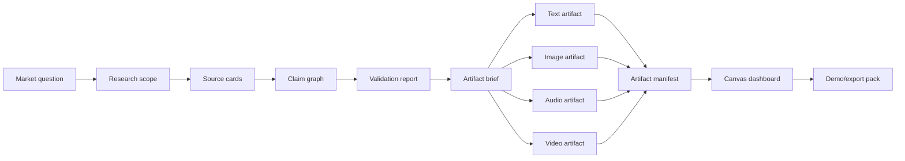

# Knowgrph MCP Agentic Canvas OS - PRD/TAD Companion

This companion keeps the detailed Agentic Canvas OS lane contracts outside the primary PRD/TAD so all files remain under 600 lines. The parent document owns scope, PRD/TAD traceability, budget policy, approval policy, and `/goal` conditions. This companion owns payload-level lane behavior.

## Lane Inventory

| Lane | Purpose | Source of truth | Status (2026-07-03) |
|---|---|---|---|
| Dashboard runtime | Render run state as Source Files Markdown plus typed manifest | parent PRD/TAD | P0 dry-run **implemented**; Canvas Storyboard render → **Track C** follow-on |
| Market Radar | Convert messy market evidence into validation reports | this companion | P0 dry-run payload **implemented**; live retrieval → approval-gated **Track C** |
| Real-browser evidence | Capture scoped rendered-page evidence from local Chrome | this companion | P0 scope/redaction payload **implemented**; live capture → **Track C** |
| Market-to-artifact | Generate text, image, audio, and video artifacts from validated evidence | this companion | P0 dry-run manifest **implemented**; generation → approval-gated |
| Starter repo | Generate a secured web React frontend plus AI-agent backend starter repository | this companion | P0 blueprint **implemented**; repo writes → approval-gated |
| Learning Loop | Learn from finalized traces through recall cards, skills, and identity facets | this companion | P0 dry-run payload **implemented**; promotion → approval-gated |

Follow-on execution order and VCCs: [`knowgrph-agentic-os-follow-on-prd-tad.md`](../knowgrph-agentic-os-follow-on-prd-tad.md) Track C.

## Market Radar Contract

Market Radar turns scattered social, launch, community, product, and commerce evidence into a Markdown report that can render as the dashboard evidence lane.

Supported source categories are scoped per run: public social posts/comments, launch/product pages, public community threads, app-store/ecommerce/pricing/review pages, GitHub repos, official sites, and browser-inspected authenticated pages when explicitly approved.

Required report sections:

| Section | Required content |
|---|---|
| Conclusion | recommendation, confidence, uncertainty, and no-go triggers |
| Segment | target user, job-to-be-done, pain intensity, willingness-to-pay |
| Alternatives | competitor, workaround, substitute, and adjacent-product matrix |
| Source cards | URL, platform, capture time, visible author/publisher, evidence level, observed fields |
| Claims | claim id, source-card ids, confidence, counterevidence, impact |
| Next test | MVP experiment, success metric, budget, and failure condition |

Evidence levels:

| Level | Meaning | Rule |
|---|---|---|
| `A` | Detail page or primary source was opened and inspected with text, comments, screenshot/media, DOM, or network provenance | may support strong directional claims |
| `B` | Primary source was opened but media, comments, or metadata were incomplete | must carry caveat |
| `C` | Search result, summary page, public metric, or source without full context | weak signal; never sole basis for conclusion |

Market Radar must mark absent evidence as absent and must not infer demand from generic trend language, vanity metrics, or one unverified source.

## Real-Browser Evidence Contract

The browser backend is local-only and operator-controlled. It may connect to a dedicated Chrome profile through a browser automation or DevTools-style bridge after the user starts that profile and scopes domains/tabs.

Allowed capture:

- rendered DOM text and element structure
- URL, title, timestamp, redirect/load status
- request/response metadata needed for provenance
- screenshots and cropped evidence images
- media resource URL, dimensions, duration, captions, key frames, and optional transcript artifacts
- visible comments, reactions, pricing, download/rating counts, purchase paths, and blocked gates

Forbidden capture:

- passwords, session cookies, bearer tokens, private messages, unrelated tabs, unrelated history, unscoped network bodies, credential-bearing headers, or background profile data
- automated login, CAPTCHA bypass, posting, commenting, following, liking, purchasing, or payment confirmation

Blocked platform access becomes a blocked source card. The agent must not bypass platform controls.

## Market-To-Artifact Pipeline

Artifacts must trace to validated market claims. No generated artifact can be marked `ready` without an `AgenticOSArtifactBrief`, and no brief can be marked `valid` without source-backed claims.

Artifact manifest fields:

| Field | Purpose |
|---|---|
| `artifactId` | stable id for generated artifact |
| `kind` | `text`, `image`, `audio`, `video`, `deck`, `landing_page`, or `demo_pack` |
| `briefId` | source-backed brief reference |
| `claimIds` | market claims that justify the artifact |
| `promptOrRecipe` | generation prompt, template, or script |
| `modelOrTool` | model/tool name when applicable |
| `cost` | token/API/storage estimate |
| `artifactPath` | Source Files/workspace path |
| `hash` | integrity marker |
| `reviewState` | `draft`, `needs_review`, `approved`, `rejected`, or `ready` |

## Starter Repo Contract

The Starter Repo lane turns an approved Agentic Canvas OS run into a new product repository blueprint for a secured, web-accessible React frontend connected to an AI agents platform backend. It is a Knowgrph-native generator contract, not a copied external template or vendored scaffold.

P0 output is a dry-run blueprint plus optional file manifest. Actual repository creation, file writes, cloud deployment, paid model calls, auth setup, and DNS changes require explicit approval gates.

Required starter surfaces:

| Surface | Contract |
|---|---|
| Frontend | React + TypeScript web app with chat/task UI, auth-aware API client, streaming state, error states, and deployment config |
| Backend | AI-agent runtime adapter boundary with typed request/response contracts, tool invocation records, traces, and cost logs |
| Auth | browser session boundary, token propagation model, role/tenant claims, and no browser-stored service secrets |
| Gateway/tools | server-owned tool registry, per-tool policy, audit trail, and dry-run mode before real-world actions |
| Infrastructure | one selected IaC path per run, env/secrets inventory, least-privilege policy notes, and rollback plan |
| Local development | deterministic setup, sample env file with placeholders, seed/demo data, and smoke-test command list |
| Tests | frontend render smoke, backend agent contract test, auth rejection test, tool-policy test, and deployment preflight |
| Docs | README, architecture diagram, security notes, deployment guide, local dev guide, and agent-customization guide |

Starter repo manifest fields:

| Field | Purpose |
|---|---|
| `starterId` | stable starter blueprint id |
| `targetRepo` | requested repo name/path, still dry-run until approved |
| `frontendPath` | proposed frontend root |
| `backendPath` | proposed backend/agent root |
| `infraPath` | proposed IaC root |
| `authModel` | identity provider, token flow, role claims, and secret boundary |
| `agentBackend` | backend adapter, model/provider boundary, tool registry, and trace policy |
| `deploymentTargets` | web host, backend runtime, storage, observability, and rollback targets |
| `securityChecks` | least-privilege, secret redaction, auth rejection, and public-route checks |
| `approvalState` | `draft`, `dry_run_ready`, `approval_required`, `approved`, or `rejected` |

The generator may use cloud providers as adapters, but the blueprint must remain provider-swappable at the contract layer. AWS-oriented outputs must be documented as one adapter lane, not as the Agentic Canvas OS core. If both CDK-like and Terraform-like IaC paths are proposed, the run must choose one before implementation to avoid duplicate infrastructure ownership.

Forbidden starter shortcuts:

- copying an external repository layout, code, docs, policies, or naming as source truth
- generating real secrets, checking in credentials, or storing browser tokens
- deploying without environment inventory, rollback, and approval state
- adding both competing IaC stacks as active owners in one starter
- bypassing Source Files/frontmatter-flow for dashboard state or proof manifests
- marking the starter production-ready without auth, policy, observability, tests, and failure handling proof

## Learning Loop Contract

Learning creates durable knowledge only from finalized chats, verified Agentic Canvas OS runs, explicit user notes, or approved imported memories. Drafts, aborted turns, transient tool output, raw credentials, and private browser evidence are not learning inputs.

Learning artifacts:

| Artifact | Purpose | Promotion rule |
|---|---|---|
| `recall_card` | ranked memory about a past task, decision, error, preference, or reusable context | advisory only; must cite source trace ids |
| `experience_skill` | reusable procedure learned from repeated successful work | requires human approval, validation notes, and rollback before active use |
| `identity_facet` | durable model of user/project/preferences/constraints | requires evidence, confidence, expiry/review date, and edit/delete controls |

Required fields: `sourceTraceIds`, `sourceDocumentPaths`, `createdAt`, `lastReviewedAt`, `confidence`, `scope`, `expiryPolicy`, `redactionStatus`, and `approvalState`.

## Skill Evolution

Skills are structured procedures, not hidden prompt snippets. A skill declares purpose, trigger conditions, required inputs, preconditions, steps, allowed tools, expected outputs, validation checks, failure modes, rollback, token/TCO expectation, and examples linked to prior traces.

| State | Meaning |
|---|---|
| `candidate` | extracted from traces but not ready |
| `trial` | may be suggested, not automatic |
| `approved` | may run when trigger conditions match |
| `refining` | approved skill has proposed edits |
| `deprecated` | retained but not suggested |
| `rejected` | unused unless restored |

No skill may write files, deploy, spend paid tokens, browse authenticated pages, or take financial/social actions beyond the parent approval policy.

## Identity Model

The identity model describes the working relationship, not a psychological profile.

Allowed facets: repos, deployment boundaries, product goals, success metrics, engineering standards, doc conventions, accepted/rejected patterns, risk tolerance, approval preferences, budget constraints, and explicitly observed artifact style preferences.

Forbidden facets: sensitive personal inferences, protected-class inference, private relationship inference, health/financial/legal conclusions, secrets, credentials, and unrelated browsing behavior.

Facets must be inspectable, editable, deletable, evidence-linked, and scoped to Knowgrph unless the user opts into wider use.

## Companion Guardrails

- Dashboard state enters Canvas through Source Files/frontmatter-flow or typed MCP `structuredContent`.
- Evidence cannot directly mutate product-roadmap graph state without an approved apply step.
- Browser evidence stays local and redacted.
- Recall is advisory and token-capped; current source files override remembered context.
- Skill and identity changes require approval before altering future behavior.
- Paid calls, deploys, browser-authenticated access, publishing, and payment actions require HITL gates.

## Cross-References

- Parent PRD/TAD: [knowgrph-mcp-agentic-os-prd-tad.md](knowgrph-mcp-agentic-os-prd-tad.md)
- MCP overview: [knowgrph-mcp.md](knowgrph-mcp.md)
- MCP service PRD/TAD: [knowgrph-mcp-service-prd-tad.md](knowgrph-mcp-service-prd-tad.md)
- Service companion: [knowgrph-mcp-service-prd-tad.companion.md](knowgrph-mcp-service-prd-tad.companion.md)
