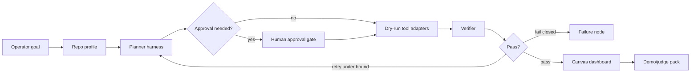

# Knowgrph MCP Agentic OS - PRD and TAD

## Executive Summary

Knowgrph MCP should become the Agentic OS control plane for building, inspecting, and operating real agent products from the Canvas UI. The first consumer is a sibling repo such as `stryfork`, but the contract is repo-agnostic: Knowgrph reads a root-allowlisted consumer repo, profiles its stack, turns goals into source-backed plans, runs local harnesses, and renders an operator dashboard with decisions, traces, artifacts, token/TCO budgets, and approval gates.

This is not a new graph runtime, not a replacement for the shipped stdio MCP server, and not a claim that remote mutating MCP is already deployed. Agentic OS is a thin orchestration and dashboard layer over the existing MCP, SuperAgent, MainPanel, FloatingPanel Chat, Source Files, KGC/frontmatter, and Canvas owners.

## Phase 0 Discovery

| Finding | Impact | Contract |
|---|---|---|
| Solo builders need production agents, not prompt demos | Demo quality depends on real frontend, backend, tools, payments, and failure handling | Agentic OS must generate build dashboards, not only docs |
| Knowgrph already has MCP, SuperAgent, Source Files, and Canvas proof paths | Reuse gives high ROI and low implementation risk | Extend existing owners before adding remote services |
| Cross-repo automation can be risky | Unbounded file writes, deployments, payments, and paid calls create high blast radius | Dry-run, repo allowlist, HITL, and typed manifests are mandatory |
| Vendor stack choices affect TCO and token economics | AWS, Vercel, Exa, and Stripe add value but can add cost | Treat them as explicit adapters with budgets and fallback plans |

**ROI score**: `(5 user impact x 3 reach) / (12 build hours + 0 default monthly TCO + bounded token pack) = high enough for P0`.

**Phase gate**: proceed with documentation and local dry-run planning only. Mutation, deployment, paid model calls, and financial actions remain blocked until explicit implementation and approval.

## PRD

### Personas

| Persona | Job | Success signal |
|---|---|---|
| Solo founder | Build and demo a production-ready autonomous product quickly | One dashboard shows plan, repo state, tools, deployments, budget, and proof |
| Agent operator | Approve or reject actions before they affect code, cloud, or payments | Every mutating step has dry-run output and approval state |
| Maintainer | Keep cross-repo work on source-owned contracts | No downstream patches, stale aliases, or duplicate graph pipelines |
| Judge/reviewer | Understand autonomy, tools, orchestration, HITL, and failure handling | Demo pack maps directly to judging criteria |

### User Journey

| Stage | Action | Touchpoint | Pain point | Opportunity |
|---|---|---|---|---|
| Trigger | User selects a consumer repo and goal | MainPanel MCP / Agentic OS | Repo context is scattered | Build one source-backed repo profile |
| Discover | Agent profiles stack, docs, scripts, and deployment gaps | local stdio MCP + Source Files | Manual audit is slow | Emit typed readiness graph |
| Engage | User chooses a plan lane | Canvas dashboard | Agent choices are opaque | Show decision nodes, budgets, and tool contracts |
| Control | Agent proposes writes, deploys, searches, or payment actions | HITL approval panel | Risk of unsafe mutation | Dry-run first and require approval |
| Complete | Agent emits demo/judge pack | Workspace + Canvas | Pitch proof is fragmented | Produce overview, autonomy, tools, orchestration, HITL, failures, and demo script |

### Epics And Stories

| Epic | Story | Acceptance criteria | Priority |
|---|---|---|---|
| PRD-AOS-1 Repo Profile | As an operator, I can profile an allowlisted sibling repo | Given `stryfork` is configured, when profile runs, then the dashboard shows stack, scripts, docs, env gaps, and deployment targets without mutating files | Must |
| PRD-AOS-2 Build Plan | As a founder, I can turn a goal into a bounded agent build plan | Given a product goal, when planning runs, then it emits tasks, dependencies, token/TCO estimates, and `/goal` checks | Must |
| PRD-AOS-3 Tool Adapters | As an operator, I can see AWS, Vercel, Exa, and Stripe as adapter lanes | Given adapters are listed, when a lane is opened, then secrets stay host/server-owned and actions remain dry-run until approved | Must |
| PRD-AOS-4 Control Dashboard | As a maintainer, I can inspect decisions and failures on Canvas | Given a run exists, when rendered, then nodes show plan, tool calls, approvals, artifacts, retries, and failure recovery | Must |
| PRD-AOS-5 Demo Pack | As a judge, I can evaluate the product quickly | Given a run completes, when pack generation runs, then output maps to overview, autonomy, tools, orchestration, HITL, failure handling, and demo | Should |

### MoSCoW

| Tier | Scope |
|---|---|
| Must | repo allowlist, dry-run manifests, Canvas dashboard model, SuperAgent handoff, evidence pack, token/TCO budget, HITL gates |
| Should | judging pack, Vercel/AWS deployment readiness plans, Exa evidence adapter, Stripe payment readiness lane |
| Could | live deployment execution, remote Worker MCP adapter, quota telemetry, run history comparison |
| Won't | browser-stored secrets, direct graph mutation from external evidence, unapproved deploy/payment actions, compatibility aliases for stale repo paths |

### Success Metrics

| Metric | Target |
|---|---:|
| Consumer repo profile mutation count before approval | 0 |
| Agentic loop max iterations | 8 |
| Default fixed monthly TCO before live adapters | 0 |
| Evidence pack default input budget | <= 8000 tokens |
| Required demo-pack sections generated | 7 of 7 |
| Unapproved deployment/payment/paid-call execution | 0 |

## TAD

### Component Inventory

| Component | Responsibility | Canonical owner direction |
|---|---|---|
| Agentic OS profile contract | Consumer repo root, stack, scripts, docs, env, deploy target, and risk summary | new shared contract under agent-ready or MCP owners |
| Local MCP adapter | Expose profile, plan, dry-run, and dashboard-manifest tools | extend `mcp/local-tool-contract.js` and `mcp/server.js` only after contract approval |
| SuperAgent bridge | Run bounded research/code/create tasks and emit trace/proof artifacts | reuse `knowgrph_parser/superagent_*` |
| Evidence adapter | Turn live search/retrieval into cited, bounded evidence packs | reuse Exa MCP/MainPanel evidence contract; no browser secrets |
| Canvas dashboard | Render run plan, approvals, artifacts, failures, budgets, and demo pack | reuse Source Files, KGC/frontmatter, Flow Editor, and dashboard renderer paths |
| Cloud adapter plan | Describe AWS backend runtime/storage/observability and Vercel frontend/gateway deployment | adapter docs first; live deploy later |
| Payment adapter plan | Describe Stripe checkout/subscription/webhook/payout readiness | reuse Commerce/payment Worker readiness; human approval required |

### Harness Contract

```text
User goal + consumer repo profile
  -> Agentic OS harness validates inputs
  -> planner selects bounded tasks and adapters
  -> tools run dry-run or approved execution
  -> verifier checks artifacts, costs, and failure handling
  -> Canvas dashboard + demo pack consume typed outputs
```

Every model-backed step must emit `{model, prompt_tokens, completion_tokens, cache_hits, estimated_cost_usd}`. Every agentic loop must stop after eight iterations or on `blocked`, `approval_required`, `budget_exceeded`, or `verification_failed`.

### Data Flow

| Stage | Component | Input | Output | Persistence | Error handling |
|---|---|---|---|---|---|
| Ingest | repo profiler | allowlisted root | repo profile JSON | workspace artifact | fail closed on external path |
| Plan | Agentic OS harness | goal + profile | build plan + budget | trace JSONL | require clarification or block |
| Act | tool adapters | approved task | dry-run or execution result | run manifest | retry bounded, then surface failure |
| Render | Canvas dashboard | run manifest | KGC/frontmatter graph | Source Files | validation failure blocks apply |
| Present | demo pack generator | verified run | judging pack markdown | workspace artifact | missing sections fail verification |

### Orchestration



### Adapter Boundaries

| Adapter | Allowed in P0 | Requires approval |
|---|---|---|
| AWS | runtime/storage/observability plan, env gap report | deploy, mutate IAM, create paid resources |
| Vercel | frontend/gateway plan, config checklist | production deploy, paid model routing |
| Exa | cited evidence-pack contract | API-key injection, high-volume search |
| Stripe | readiness and workflow plan | product/price/session/refund/payout mutation |

### `/goal` Conditions

- `/goal repo-profile`: profile a configured consumer root and prove no file mutation occurred.
- `/goal agentic-plan`: generate a typed plan with task bounds, token/TCO budget, adapters, and approval gates.
- `/goal dashboard`: render the run manifest through Source Files and Canvas without direct graph writes.
- `/goal demo-pack`: emit all seven judging sections and link each to trace evidence.
- `/goal failure-handling`: inject one tool failure and show bounded retry or fail-closed recovery.

### ADR

| Decision | FOSS/TCO rationale | Status |
|---|---|---|
| Reuse Knowgrph MCP/SuperAgent/Canvas instead of a new orchestrator | Lowest build cost, avoids duplicate runtime, preserves FOSS-first local loop | accepted for P0 |
| Treat AWS, Vercel, Exa, and Stripe as adapters, not core owners | Keeps default TCO at zero until the user enables live services | accepted for P0 |
| Dry-run before mutation | Prevents unsafe writes, deploys, paid calls, and financial side effects | accepted for P0 |

## Validation Checklist

- [x] Overview doc links Agentic OS as planned extension over shipped owners
- [x] Service PRD/TAD marks Agentic OS as planned, not shipped remote MCP
- [x] Companion owner map records future owner rules and forbidden shortcuts
- [x] SuperAgent docs explain cross-repo Agentic OS handoff without claiming public mutation
- [x] Focused tests are deferred until implementation begins
