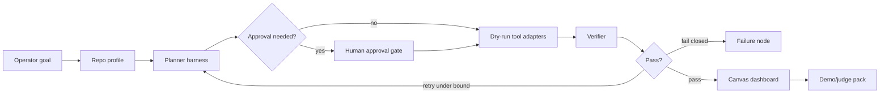

# Knowgrph MCP Agentic Canvas OS - PRD and TAD

## Executive Summary

Knowgrph MCP should become the **Agentic Canvas OS** control plane for building, inspecting, and operating real agent products from the Canvas UI. The first consumer is a sibling repo such as `strybldr`, but the contract is repo-agnostic: Knowgrph reads a root-allowlisted consumer repo, profiles its stack, turns goals into source-backed plans, runs local harnesses, and renders an operator dashboard with decisions, traces, artifacts, token/TCO budgets, approval gates, and source-backed market validation.

This is not a new graph runtime, not a replacement for the shipped stdio MCP server, and not a claim that remote mutating MCP is already deployed. Agentic Canvas OS is a thin orchestration and dashboard layer over the existing MCP, SuperAgent, MainPanel, FloatingPanel Chat, Source Files, KGC/frontmatter, and Canvas owners.

The Agentic Canvas OS Dashboard is a **document/runtime model**: one Source Files Markdown document owns the dashboard frontmatter and body, while a typed run manifest owns volatile runtime facts such as tool attempts, approvals, cost logs, and failure transitions. Canvas renders both through the existing frontmatter-flow and Storyboard Widget path; it must not introduce a dashboard-only graph store, renderer, or mutation bridge.

Agentic Canvas OS also supports **Market Radar**, **real-browser evidence**, **market-to-artifact generation**, **Starter Repo**, and **Learning Loop** lanes. The detailed lane contracts live in [knowgrph-mcp-agentic-os-prd-tad.companion.md](knowgrph-mcp-agentic-os-prd-tad.companion.md) so this PRD/TAD remains the compact governing document and all docs stay under the 600-line limit.

**Follow-on increment** (HITL durable store, live stage golden path, Canvas dashboard render): [`knowgrph-agentic-os-follow-on-prd-tad.md`](../knowgrph-agentic-os-follow-on-prd-tad.md).

The companion is normative for lane payloads, node fields, evidence grades, artifact lineage, skill states, identity facets, and privacy guardrails. This file remains normative for PRD/TAD scope, orchestration, budgets, approval policy, `/goal` conditions, and shipped-vs-planned boundaries.

## Phase 0 Discovery

| Finding | Impact | Contract |
|---|---|---|
| Solo builders need production agents, not prompt demos | Demo quality depends on real frontend, backend, tools, payments, and failure handling | Agentic Canvas OS must generate build dashboards, not only docs |
| Knowgrph already has MCP, SuperAgent, Source Files, and Canvas proof paths | Reuse gives high ROI and low implementation risk | Extend existing owners before adding remote services |
| Cross-repo automation can be risky | Unbounded file writes, deployments, payments, and paid calls create high blast radius | Dry-run, repo allowlist, HITL, and typed manifests are mandatory |
| Vendor stack choices affect TCO and token economics | Cloudflare, BytePlus, and Stripe add value but can add cost | Treat them as explicit adapters with budgets and fallback plans; Vercel and AWS are out of scope |
| Social research evidence is fragmented across text, comments, images, video, and dynamic pages | A normal LLM summary can overclaim demand without traceable proof | Market Radar must preserve source cards, evidence levels, screenshots/media references, and uncertainty |
| Some useful evidence requires authenticated rendered pages | Headless/static fetch often misses login-gated, app-like, or media-heavy content | Real-browser backend stays local, dedicated-profile, user-approved, and read-only until stronger contracts exist |
| Long-horizon agent work loses lessons between sessions | Repeated mistakes, stale preferences, and duplicated tactics waste tokens and time | Learning Loop must convert finalized traces into reviewed skills, recall cards, and identity facets |
| Self-improvement can drift or become opaque | Unreviewed memory and self-modification create trust and safety risk | Skill promotion, identity changes, and cross-session recall must be evidence-linked, scoped, and reversible |
| Full-stack agent apps require secure frontend/backend/infrastructure plumbing | Solo builders lose time on auth, deployment, tool policy, and boilerplate | Starter Repo lane must produce a secured React + agent-backend blueprint without copying external templates |

**ROI score**: `(5 user impact x 3 reach) / (12 build hours + 0 default monthly TCO + bounded token pack) = high enough for P0`.

**Phase gate**: proceed with documentation and local dry-run planning only. Mutation, deployment, paid model calls, and financial actions remain blocked until explicit implementation and approval.

## PRD

### Personas

| Persona | Job | Success signal |
|---|---|---|
| Solo founder | Build and demo a production-ready autonomous product quickly | One dashboard shows plan, repo state, tools, deployments, budget, and proof |
| Agent operator | Approve or reject actions before they affect code, cloud, or payments | Every mutating step has dry-run output and approval state |
| Maintainer | Keep cross-repo work on source-owned contracts | No downstream patches, stale aliases, or duplicate graph pipelines |
| Judge/reviewer | Understand autonomy, tools, orchestration, HITL, and failure handling | Demo pack maps directly to judging criteria |
| Returning user | Have the agent remember durable work patterns without inventing preferences | Identity facets and skills are evidence-backed and editable |

### User Journey

| Stage | Action | Touchpoint | Pain point | Opportunity |
|---|---|---|---|---|
| Trigger | User selects a consumer repo and goal | MainPanel MCP / Agentic Canvas OS | Repo context is scattered | Build one source-backed repo profile |
| Discover | Agent profiles stack, docs, scripts, and deployment gaps | local stdio MCP + Source Files | Manual audit is slow | Emit typed readiness graph |
| Engage | User chooses a plan lane | Canvas dashboard | Agent choices are opaque | Show decision nodes, budgets, and tool contracts |
| Control | Agent proposes writes, deploys, searches, or payment actions | HITL approval panel | Risk of unsafe mutation | Dry-run first and require approval |
| Complete | Agent emits demo/judge pack | Workspace + Canvas | Pitch proof is fragmented | Produce overview, autonomy, tools, orchestration, HITL, failures, and demo script |
| Learn | Agent reviews finalized traces | Learning Loop dashboard lane | Knowledge is trapped in past chats | Propose skills, recall cards, and identity facets for approval |

### Epics And Stories

| Epic | Story | Acceptance criteria | Priority |
|---|---|---|---|
| PRD-AOS-1 Repo Profile | As an operator, I can profile an allowlisted sibling repo | Given `strybldr` is configured, when profile runs, then the dashboard shows stack, scripts, docs, env gaps, and deployment targets without mutating files | Must |
| PRD-AOS-2 Build Plan | As a founder, I can turn a goal into a bounded agent build plan | Given a product goal, when planning runs, then it emits tasks, dependencies, token/TCO estimates, and `/goal` checks | Must |
| PRD-AOS-3 Tool Adapters | As an operator, I can see Cloudflare, BytePlus, and Stripe as adapter lanes | Given adapters are listed, when a lane is opened, then secrets stay host/server-owned and actions remain dry-run until approved | Must |
| PRD-AOS-4 Control Dashboard | As a maintainer, I can inspect decisions and failures on Canvas | Given a run exists, when rendered, then nodes show plan, tool calls, approvals, artifacts, retries, and failure recovery | Must |
| PRD-AOS-5 Demo Pack | As a judge, I can evaluate the product quickly | Given a run completes, when pack generation runs, then output maps to overview, autonomy, tools, orchestration, HITL, failure handling, and demo | Should |
| PRD-AOS-6 Dashboard Document Model | As an operator, I can open one source-backed dashboard document | Given a run manifest exists, when the dashboard document is focused, then Canvas renders profile, plan, tools, approvals, budget, failures, artifacts, and demo pack nodes from source-backed frontmatter | Must |
| PRD-AOS-7 Market Radar | As a founder, I can validate a product idea from messy market signals | Given an idea and scoped platforms, when research runs, then the dashboard emits evidence levels, source cards, competitor/alternative matrix, pain points, pricing/adoption signals, and a recommendation without unsupported claims | Must |
| PRD-AOS-8 Real-Browser Research Backend | As an operator, I can let an agent inspect authenticated rendered pages safely | Given a dedicated local Chrome profile is connected, when browser research runs, then the run records DOM snapshots, network evidence, screenshots, media references, and user-handled login/verification gates without storing credentials | Should |
| PRD-AOS-9 Learning Loop | As a returning user, I can let Agentic Canvas OS learn from finalized work | Given a completed run or chat, when learning review runs, then it proposes skills, recall cards, and identity facets with source trace ids, confidence, expiry, and approval state | Must |
| PRD-AOS-10 Skill Evolution | As an operator, I can approve reusable skills created from experience | Given a recurring successful pattern is detected, when skill promotion is requested, then the skill includes trigger conditions, procedure, validation, rollback notes, and test evidence before becoming active | Should |
| PRD-AOS-11 Past Conversation Search | As an agent, I can retrieve relevant prior context without overloading the prompt | Given a new task, when recall runs, then it returns bounded, ranked memory cards with citations to prior finalized conversations and does not treat them as source truth | Must |
| PRD-AOS-12 Starter Repo | As a founder, I can generate a secured full-stack agent starter repository blueprint | Given an approved product goal, when starter planning runs, then it emits React frontend, agent backend, auth, gateway/tool policy, infrastructure, tests, docs, and deployment preflight manifests without copying external source | Should |

### MoSCoW

| Tier | Scope |
|---|---|
| Must | repo allowlist, dry-run manifests, Canvas dashboard model, SuperAgent handoff, evidence pack, market validation report, learning loop, past-conversation recall, token/TCO budget, HITL gates |
| Should | judging pack, real-browser evidence backend, skill promotion workflow, identity facet editor, Cloudflare deployment readiness plan, BytePlus media adapter, Stripe payment readiness lane |
| Could | live deployment execution, remote Worker MCP adapter, quota telemetry, run history comparison |
| Won't | browser-stored secrets, direct graph mutation from external evidence, unapproved deploy/payment actions, compatibility aliases for stale repo paths |

### Success Metrics

| Metric | Target |
|---|---:|
| Consumer repo profile mutation count before approval | 0 |
| Agentic loop max iterations | 8 |
| Default fixed monthly TCO before live adapters | 0 |
| Evidence pack default input budget | <= 8000 tokens |
| Market validation source cards per report | >= 8 when available |
| Unsupported market claims in final report | 0 |
| Browser credential values persisted by Agentic Canvas OS | 0 |
| Learning writes from draft/aborted turns | 0 |
| Active skills without approval and validation evidence | 0 |
| Recall context injected per turn | <= 1200 tokens |
| Identity facets without source trace ids | 0 |
| Starter repos marked ready without auth/test/deploy preflight | 0 |
| Dashboard runtime document count per run | 1 canonical `.agentic-os.md` |
| Required demo-pack sections generated | 7 of 7 |
| Unapproved deployment/payment/paid-call execution | 0 |

## TAD

### Component Inventory

| Component | Responsibility | Canonical owner direction |
|---|---|---|
| Agentic Canvas OS profile contract | Consumer repo root, stack, scripts, docs, env, deploy target, and risk summary | new shared contract under agent-ready or MCP owners |
| Dashboard document contract | Source Files Markdown frontmatter, body sections, semantic graph ids, and renderer metadata | new authored `.agentic-os.md` document template; no generated sidecar HTML as source truth |
| Runtime manifest contract | Run id, task state, tool attempts, approvals, cost logs, artifacts, and failures | workspace artifact beside the dashboard document; imported into Canvas through the same Source Files/KGC path |
| Local MCP adapter | Expose profile, plan, dry-run, and dashboard-manifest tools | P0 shipped as `knowgrph.agentic_canvas_os.plan` in `mcp/local-tool-contract.js` and `mcp/server.js`; mutating actions remain blocked |
| SuperAgent bridge | Run bounded research/code/create tasks and emit trace/proof artifacts | reuse `knowgrph_parser/superagent_*` |
| Evidence adapter | Turn live search/retrieval into cited, bounded evidence packs | reuse the MainPanel evidence contract routed through Cloudflare AI Gateway; no browser secrets |
| Market Radar harness | Convert social/community/product evidence into source-backed validation reports | P0 local dry-run payload shipped in `mcp/agentic-canvas-os-lanes.js`; live evidence calls require approval |
| Browser evidence backend | Inspect rendered pages, DOM, network records, screenshots, image/video resources, and comments from a dedicated local Chrome profile | P0 local dry-run scope/redaction manifest shipped; real capture still requires explicit browser approval |
| Learning Loop harness | Convert finalized traces into proposed skills, recall cards, and identity facets | P0 local dry-run payload shipped; finalized trace ids or explicit notes only |
| Skill registry | Store reviewed reusable procedures with triggers, validation, and rollback notes | P0 candidate-skill payload shipped with approval required before active use |
| Identity model | Maintain inspectable user/work preferences, constraints, projects, and recurring goals | P0 explicit-note facet payload shipped with source ids, confidence, review state, and approval gate |
| Conversation recall index | Search past finalized conversations and run traces for bounded context | P0 bounded advisory recall-card payload shipped; full index remains local-first future work |
| Canvas dashboard | Render run plan, approvals, artifacts, failures, budgets, and demo pack | reuse Source Files, KGC/frontmatter, Storyboard Widget, and dashboard renderer paths |
| Cloud adapter plan | Describe the Cloudflare control plane: Workers McpAgent, Pages UI, D1 manifests, R2 media, and AI Gateway routing | P0 readiness payload shipped; live deploy later. Vercel and AWS are out of scope |
| Media adapter plan | Describe BytePlus chat/image/video via Cloudflare AI Gateway with persist-on-generate to R2 and replay-without-LLM | P0 readiness payload shipped; paid calls require approval |
| Payment adapter plan | Describe Stripe checkout/subscription/webhook/payout readiness | P0 readiness payload shipped; human approval required |
| Starter Repo generator | Emit a secured React + agent-backend repository blueprint, file manifest, policy checks, and deployment preflight | companion-owned lane; dry-run first; no copied external template |

### Harness Contract

```text
User goal + consumer repo profile
  -> Agentic Canvas OS harness validates inputs
  -> planner selects bounded tasks and adapters
  -> tools run dry-run or approved execution
  -> market radar gathers source cards when requested
  -> learning loop proposes recall, skills, and identity updates from finalized traces
  -> verifier checks artifacts, costs, and failure handling
  -> Canvas dashboard + demo pack consume typed outputs
```

Every model-backed step must emit `{model, prompt_tokens, completion_tokens, cache_hits, estimated_cost_usd}`. Every agentic loop must stop after eight iterations or on `blocked`, `approval_required`, `budget_exceeded`, or `verification_failed`.

### Dashboard Document Model

One run owns one canonical Markdown document named with the pattern:

```text
agentic-os/<runId>/dashboard.agentic-os.md
```

The document is source truth for what Canvas renders. It starts with normal YAML frontmatter and uses existing frontmatter-flow graph semantics:

```yaml
---
kgSchema: kgc-computing-flow/v1
kgCanvasSurfaceMode: 2d
kgCanvas2dRenderer: storyboard
agenticOs:
  runId: strybldr-launch-001
  consumerRepo: strybldr
  status: approval_required
  capabilityLanes:
    - build_control
    - market_radar
    - browser_evidence
    - learning_loop
    - starter_repo
  mutationPolicy: dry_run_first
  maxIterations: 8
  tokenBudget:
    maxInputTokens: 8000
    maxEstimatedCostUsd: 5
flow:
  nodes:
    - id: profile
      label: Repo Profile
      type: AgenticOSProfile
    - id: plan
      label: Planner
      type: AgenticOSPlan
    - id: approval-deploy
      label: Deploy Approval
      type: AgenticOSApprovalGate
  edges:
    - source: profile
      target: plan
    - source: plan
      target: approval-deploy
---
```

The body carries human-readable evidence and the demo narrative. The runtime manifest carries fast-changing state, but Canvas only renders it after the manifest is projected into the same dashboard document or accepted as typed MCP `structuredContent`.

### Capability Lane Companion

Detailed lane contracts are maintained in [knowgrph-mcp-agentic-os-prd-tad.companion.md](knowgrph-mcp-agentic-os-prd-tad.companion.md). The companion covers Market Radar, real-browser evidence, market-to-artifact generation, Starter Repo generation, Learning Loop memory, skill promotion, identity facets, evidence grades, artifact lineage, and privacy guardrails.

The primary PRD/TAD depends on those lane contracts but does not duplicate their payload details. This keeps frontmatter, PRD stories, TAD owners, and `/goal` conditions compact while preserving a single cross-referenced source for implementation-specific lane behavior.

### Runtime State Model

| State | Meaning | Allowed next states |
|---|---|---|
| `draft` | Dashboard document exists but no profile has run | `profiled`, `blocked` |
| `profiled` | Consumer repo profile is captured without mutation | `planned`, `blocked` |
| `planned` | Planner emitted bounded tasks and budgets | `dry_run_ready`, `blocked` |
| `dry_run_ready` | Tool calls can execute in dry-run mode | `approval_required`, `verified`, `blocked` |
| `approval_required` | A write, deploy, paid call, or payment action is waiting for human approval | `approved`, `rejected`, `blocked` |
| `approved` | Human approval exists for one bounded action | `executing`, `blocked` |
| `executing` | Approved action is running | `verified`, `failed` |
| `failed` | Bounded retry or fail-closed path captured error evidence | `dry_run_ready`, `blocked` |
| `verified` | Artifacts, costs, and judging pack checks passed | `archived` |
| `blocked` | Run cannot proceed without external input or config | `draft`, `profiled`, `planned` |

### Dashboard Node Types

| Node type | Required fields | Canvas behavior |
|---|---|---|
| `AgenticOSProfile` | `consumerRepo`, `rootPolicy`, `stack`, `scripts`, `envGaps` | Read-only profile card |
| `AgenticOSPlan` | `goal`, `tasks`, `maxIterations`, `stopConditions` | Planner lane with task edges |
| `AgenticOSToolCall` | `toolName`, `adapter`, `mode`, `status`, `attempt` | Tool-call card with retry/failure status |
| `AgenticOSApprovalGate` | `actionKind`, `risk`, `dryRunArtifact`, `approvalState` | HITL gate; no implicit execution |
| `AgenticOSBudget` | `model`, `inputTokens`, `outputTokens`, `cacheHits`, `estimatedCostUsd` | Token/TCO meter |
| `AgenticOSEvidencePack` | `sources`, `citations`, `summary`, `trustPolicy` | Evidence lane; no direct graph mutation |
| `AgenticOSMarketReport` | `idea`, `platforms`, `segments`, `competitors`, `sourceCards`, `recommendation` | Market validation lane |
| `AgenticOSSourceCard` | `url`, `platform`, `captureTime`, `evidenceLevel`, `observedFields`, `claimIds` | Source-backed evidence card |
| `AgenticOSBrowserSession` | `profileKind`, `allowedDomains`, `startedAt`, `blockedGates`, `capturedArtifacts` | Local browser backend status |
| `AgenticOSMediaEvidence` | `sourceId`, `mediaKind`, `artifactPath`, `ocrOrTranscriptStatus`, `claimIds` | Media evidence card |
| `AgenticOSStarterRepo` | `starterId`, `targetRepo`, `frontendPath`, `backendPath`, `infraPath`, `approvalState` | Secured starter blueprint card |
| `AgenticOSAuthBoundary` | `authModel`, `tokenFlow`, `roleClaims`, `secretBoundary` | Auth and identity boundary card |
| `AgenticOSGatewayPolicy` | `toolRegistry`, `policyRules`, `auditTrail`, `dryRunMode` | Gateway/tool policy card |
| `AgenticOSDeploymentPreflight` | `targets`, `envGaps`, `tests`, `rollback`, `readiness` | Deployment preflight card |
| `AgenticOSLearningLoop` | `sourceTraceIds`, `candidateCount`, `approvedCount`, `nudgeCount`, `recallBudgetTokens` | Learning lane summary |
| `AgenticOSRecallCard` | `summary`, `sourceTraceIds`, `rankScore`, `scope`, `expiryPolicy` | Advisory memory card |
| `AgenticOSSkill` | `name`, `trigger`, `procedure`, `validation`, `state`, `approvalState` | Skill card with state and safeguards |
| `AgenticOSIdentityFacet` | `facetKind`, `value`, `confidence`, `sourceTraceIds`, `reviewAt` | Editable identity model card |
| `AgenticOSLearningNudge` | `proposal`, `sourceTraceIds`, `risk`, `approvalState` | Persistence prompt card |
| `AgenticOSArtifact` | `path`, `kind`, `hash`, `sourceStep` | Artifact link/card |
| `AgenticOSFailure` | `failureKind`, `message`, `retryCount`, `resolution` | Failure replay lane |
| `AgenticOSDemoPack` | `sections`, `urls`, `screenshots`, `readiness` | Judging pack summary |

### Runtime Inspection Contract

MCP/WebMCP inspection for the dashboard is read-only in P0. It may expose:

- active dashboard document id and path
- selected dashboard node id and type
- run state and blocked reason
- approval gates and approval states
- token/TCO budget summary
- artifact list and hashes
- failure list and retry counts
- demo-pack completeness
- active market validation report id and evidence-level counts
- source-card list, claim ids, and artifact hashes
- browser backend connection state, allowed domains, and blocked gates
- starter repo manifest, auth boundary, gateway policy, IaC choice, tests, docs, and deployment preflight state
- learning-loop artifact counts and pending nudges
- approved/candidate skill list with trigger summaries
- bounded recall cards selected for the current run
- identity facets relevant to the current run, with confidence and source trace ids

It must not expose direct file-write, deploy, paid-call, or Stripe mutation tools until the corresponding source-owned tool contract, approval contract, and focused validation exist.

It must not expose browser credential material, cookies, headers containing secrets, private messages, unrelated tabs, or raw network bodies outside the scoped evidence manifest.

It must not expose private identity facets, rejected memories, raw chat transcripts, or hidden prompt material to deployed public MCP surfaces.

### Data Flow

| Stage | Component | Input | Output | Persistence | Error handling |
|---|---|---|---|---|---|
| Ingest | repo profiler | allowlisted root | repo profile JSON | workspace artifact | fail closed on external path |
| Research | Market Radar harness | idea + scoped platforms + evidence budget | market validation report + source cards | dashboard document + evidence artifacts | mark weak/blocked evidence; never overclaim |
| Browser capture | local browser backend | approved domains/tabs | DOM, screenshot, network, media evidence manifest | local artifact under run folder | user handles login/verification; block on disallowed access |
| Starter | Starter Repo generator | approved goal + stack targets | secured frontend/backend blueprint + file manifest | dashboard document + manifest | block writes/deploy until approval |
| Learn | Learning Loop harness | finalized traces + user notes | recall cards + candidate skills + identity facets | local-first memory profile | reject drafts, secrets, low-confidence inferences |
| Recall | conversation recall index | current task + scope | bounded advisory context | prompt-time context only | cap tokens; cite traces; never override current source |
| Plan | Agentic Canvas OS harness | goal + profile | build plan + budget | trace JSONL | require clarification or block |
| Act | tool adapters | approved task | dry-run or execution result | run manifest | retry bounded, then surface failure |
| Render | Canvas dashboard | dashboard document + run manifest | KGC/frontmatter graph | Source Files | validation failure blocks apply |
| Present | demo pack generator | verified run | judging pack markdown | workspace artifact | missing sections fail verification |

### Orchestration



### Adapter Boundaries

| Adapter | Allowed in P0 | Requires approval |
|---|---|---|
| Cloudflare | control-plane plan (Workers McpAgent, Pages, D1, R2, AI Gateway), env gap report | production deploy, D1/R2 mutation, paid model routing |
| BytePlus | chat/image/video readiness via Cloudflare AI Gateway; persist-on-generate to R2 | paid model/media calls, key injection, high-volume generation |
| Stripe | readiness and workflow plan | product/price/session/refund/payout mutation |
| Browser evidence | dedicated-profile setup checklist, read-only scoped capture manifest, screenshots, DOM summaries, media references | connecting to a daily profile, inspecting authenticated domains, saving screenshots/media, any write/post/comment/follow/like action |
| Learning Loop | local recall cards, candidate skills, approved skills, editable identity facets, persistence nudges | auto-promoting skills, hidden personality changes, cross-repo/cloud sync, or learning from drafts/private browser data |

### `/goal` Conditions

- `/goal repo-profile`: profile a configured consumer root and prove no file mutation occurred.
- `/goal agentic-plan`: generate a typed plan with task bounds, token/TCO budget, adapters, and approval gates.
- `/goal dashboard`: render the run manifest through Source Files and Canvas without direct graph writes.
- `/goal dashboard-document`: create or update exactly one `.agentic-os.md` dashboard document for the run and validate frontmatter parsing.
- `/goal dashboard-runtime`: project runtime state into dashboard nodes without a dashboard-only graph store or renderer.
- `/goal market-radar`: produce a source-backed market validation report with evidence levels, source cards, competitor/workaround matrix, uncertainty, and next validation experiment.
- `/goal browser-evidence`: connect only to an approved local browser profile/domain scope and prove no credentials, unrelated tabs, or unscoped network bodies were persisted.
- `/goal learning-loop`: create recall cards, candidate skills, and identity facets only from finalized traces or explicit user notes, with source ids and redaction status.
- `/goal skill-promotion`: promote a candidate skill only after approval, validation notes, rollback notes, and trigger conditions exist.
- `/goal recall-search`: retrieve bounded past-conversation context with citations and keep it advisory rather than source truth.
- `/goal identity-model`: expose editable, scoped identity facets with confidence, expiry/review dates, and delete controls.
- `/goal starter-repo`: produce a dry-run secured React frontend + AI-agent backend starter blueprint with auth, gateway/tool policy, IaC choice, tests, docs, and deployment preflight before any file write.
- `/goal demo-pack`: emit all seven judging sections and link each to trace evidence.
- `/goal failure-handling`: inject one tool failure and show bounded retry or fail-closed recovery.

### ADR

| Decision | FOSS/TCO rationale | Status |
|---|---|---|
| Reuse Knowgrph MCP/SuperAgent/Canvas instead of a new orchestrator | Lowest build cost, avoids duplicate runtime, preserves FOSS-first local loop | accepted for P0 |
| Make the dashboard a Source Files Markdown document plus runtime manifest | Reuses existing parser/render/storage, keeps TCO zero, and avoids a bespoke dashboard database | accepted for P0 |
| Add Market Radar as a typed harness, not a separate product runtime | Reuses Source Files, evidence packs, browser-local tools, and Canvas; avoids a second reporting stack | accepted for P0 |
| Keep browser evidence local and dedicated-profile by default | Preserves login-state usefulness while minimizing privacy and credential risk | accepted for P0 |
| Add Learning Loop as local-first memory artifacts, not hidden self-modifying code | Reuses finalized chat memory and Source Files while keeping behavior inspectable and reversible | accepted for P0 |
| Require human-reviewed skill promotion | Prevents unbounded self-modification and keeps learned procedures testable | accepted for P0 |
| Keep identity facets scoped and editable | Preserves personalization value while avoiding opaque or sensitive inference | accepted for P0 |
| Add Starter Repo as a dry-run blueprint, not a copied scaffold | Speeds full-stack agent launches while keeping ownership, security, and TCO visible | accepted for P0 |
| Treat AWS, Vercel, Exa, and Stripe as adapters, not core owners | Keeps default TCO at zero until the user enables live services | accepted for P0 |
| Dry-run before mutation | Prevents unsafe writes, deploys, paid calls, and financial side effects | accepted for P0 |

## Validation Checklist

- [x] Overview doc links Agentic Canvas OS as planned extension over shipped owners
- [x] Service PRD/TAD marks Agentic Canvas OS as planned, not shipped remote MCP
- [x] Companion owner map records future owner rules and forbidden shortcuts
- [x] SuperAgent docs explain cross-repo Agentic Canvas OS handoff without claiming public mutation
- [x] Dashboard document/runtime model uses Source Files, frontmatter-flow, and typed manifests instead of a dashboard-only runtime
- [x] Market Radar and browser evidence capabilities are documented as bounded Agentic Canvas OS lanes with source cards, evidence levels, privacy guardrails, and no copied external product/runtime dependency
- [x] Learning Loop is documented as local-first, finalized-trace-only, source-linked, approval-gated, and inspectable through Canvas nodes
- [x] Local MCP `knowgrph.agentic_canvas_os.plan` emits repo profile, planner, tool calls, approvals, budget, adapter readiness, market radar, browser evidence, artifact pipeline, learning loop, starter repo, demo pack, failure handling, and `/goal` coverage payloads
- [x] Focused MCP/vdeoxpln checks validate the new local tool contract and registry wiring
