# Knowgrph MCP Service - PRD & TAD (Proposed) Companion

Implementation-accurate supplement to [knowgrph-mcp-service-prd-tad-proposed.md](knowgrph-mcp-service-prd-tad-proposed.md).

**Document Version**: 0.4.7  
**Date**: 2026-05-22  
**Status**: Proposed supplement

---

## Purpose

This companion keeps the main PRD/TAD honest at the owner-map and architecture-invariant level.

It answers three questions:

1. What MCP surfaces are actually shipped today?
2. Which files currently own the MainPanel -> FloatingPanel Chat -> KGC -> Canvas flow?
3. Which stale or conflicting architectures are forbidden?

---

## Shipped Vs Proposed

| Surface | Status | Canonical owner | Contract |
|---|---|---|---|
| Local stdio MCP | Shipped | `mcp/server.js` | local subprocess and browser-bridge tools |
| Local stdio MCP docs | Shipped | `mcp/README.md` | local configuration and usage |
| Pages HTTP MCP | Shipped | `cloudflare/pages/knowgrph-agent-ready.mjs` | read-only JSON-RPC MCP |
| Browser WebMCP | Shipped | `canvas/src/features/agent-ready/webMcpRuntime.ts` | app runtime registers ten read-only tools, including `knowgrph.inspect_local_workspace_document`, `knowgrph.inspect_local_canvas_topology`, `knowgrph.inspect_local_canvas_snapshot`, `knowgrph.inspect_local_3d_camera_pose`, and `knowgrph.inspect_local_3d_layout_positions` |
| Shared read-only tool contract | Shipped | `canvas/src/features/agent-ready/knowgrphAgentReadyToolContract.mjs` | published Pages/HTTP tool set = `knowgrph.list_source_files`, `knowgrph.read_source_file`, `knowgrph.read_shared_document`, `knowgrph.inspect_shared_document_structure`, `knowgrph.inspect_agent_surface` |
| MainPanel MCP | Shipped | `canvas/src/features/panels/views/McpHubView.tsx` | thin `SettingsView mode="mcp"` shell |
| MainPanel Integrations | Shipped | `canvas/src/features/panels/views/IntegrationsHubView.tsx` | thin `SettingsView mode="integrations"` shell |
| Shared MainPanel chat readiness | Shipped | `canvas/src/features/panels/views/useSettingsChatAssist.tsx` | presets, routing, model refresh |
| Stripe MCP readiness docs | Shipped | `canvas/src/features/panels/views/stripeMcpApiDocs.ts` | readiness/config only |
| Crawler Access MCP readiness docs | Shipped | `canvas/src/features/panels/views/crawlerAccessMcpApiDocs.ts` | readiness/config only |
| FloatingPanel Chat -> Canvas flow | Shipped | `canvas/src/features/chat/*` + parser/store owners | browser-local validated KGC pipeline |
| Remote Worker MCP gateway / pipeline platform | Proposed only | none in repo yet | must not be described as implemented |

---

## E2E Owner Map

### MainPanel And Settings

| Stage | Owner | Notes |
|---|---|---|
| MainPanel tab registration | `canvas/src/features/panels/MainPanel.tsx` | owns `mcp` and `integrations` tab presence |
| MCP shell | `canvas/src/features/panels/views/McpHubView.tsx` | no separate business logic |
| Integrations shell | `canvas/src/features/panels/views/IntegrationsHubView.tsx` | no separate business logic |
| Shared settings owner | `canvas/src/features/panels/views/SettingsView.tsx` | filters and renders settings content |
| Chat readiness owner | `canvas/src/features/panels/views/useSettingsChatAssist.tsx` | presets, context scope, integration enablement, model discovery |

### FloatingPanel Chat

| Stage | Owner | Notes |
|---|---|---|
| Floating panel container | `canvas/src/components/ui/FloatingPanel.tsx` | UI container |
| Chat mounting surface | `canvas/src/features/chat/SidePanelChat.tsx` | interactive chat state and UI |
| Submit shell | `canvas/src/features/chat/sidePanelChat/useSidePanelChatSubmit.ts` | thin shell by design |
| Submit coordinator | `canvas/src/features/chat/sidePanelChat/sidePanelChatSubmitCoordinator.ts` | request lifecycle owner |
| Streaming | `canvas/src/features/chat/sidePanelChat/sidePanelChatStreaming.ts` | assistant draft flush and stream parsing |
| KGC attempt / retry | `canvas/src/features/chat/sidePanelChat/sidePanelChatKgcAttempt.ts` | validation and correction retry |

### KGC Validation And Canvas Apply

| Stage | Owner | Notes |
|---|---|---|
| KGC recovery | `canvas/src/features/chat/chatHistoryWorkspace.kgc.recovery.ts` | strips wrappers and legacy grouping aliases upstream |
| KGC validation | `canvas/src/features/chat/chatMarkdownValidation.ts` | frontmatter-first and `flow.subgraphs` enforcement |
| Finalize write | `canvas/src/features/chat/sidePanelChat/useFinalizeAssistantSuccess.ts` | canonical workspace KGC persistence |
| Canvas apply bridge | `canvas/src/features/chat/chatKgcCanvasApply.ts` | calls `setActiveMarkdownDocument()` |
| Graph apply action | `canvas/src/hooks/store/graph-data-slice/graphDataDocumentActions.ts` | canonical graph apply gateway |
| Parse priority | `canvas/src/features/parsers/default.ts` | frontmatter-flow parser first |
| Graph composition | `canvas/src/features/parsers/markdownFrontmatterFlowGraph.core.ts` + helpers | edge/subgraph/cluster compose |
| Group projection | `canvas/src/lib/graph/subgraphs.ts` + `canvas/src/components/GraphCanvas/layout/graphGroups.ts` | subgraph metadata -> rendered groups |

---

## E2E Contract

```mermaid
flowchart LR
  A["MainPanel mcp"] --> C["SettingsView"]
  B["MainPanel integrations"] --> C
  C --> D["useSettingsChatAssist()"]
  D --> E["FloatingPanel Chat"]
  E --> F["useSidePanelChatSubmit()"]
  F --> G["Coordinator + streaming"]
  G --> H["KGC recovery + validation"]
  H --> I["Finalize assistant success"]
  I --> J["applyChatKgcWorkspaceDocumentToCanvas()"]
  J --> K["setActiveMarkdownDocument(applyToGraph)"]
  K --> L["Frontmatter-flow parse"]
  L --> M["Nodes / edges / subgraphs / groups"]
```

### Architectural Invariants

- MainPanel `mcp` and `integrations` stay thin shells over `SettingsView`.
- Chat routing and presets stay owned by `useSettingsChatAssist()`.
- `useSidePanelChatSubmit()` stays a thin shell; complexity remains in dedicated helpers.
- Canonical KGC output starts at YAML frontmatter.
- `flow.subgraphs` is the only upstream grouping authoring surface.
- Canvas graph apply goes through `applyChatKgcWorkspaceDocumentToCanvas()` and `setActiveMarkdownDocument({ applyToGraph: true })`.
- Rendered groups and clusters are downstream projection, not a second authoring SSOT.

---

## Forbidden Architecture

The following are explicitly forbidden:

- documenting nonexistent remote MCP Worker modules as if they are already implemented
- adding a second MainPanel MCP config or routing surface outside `SettingsView` and `useSettingsChatAssist()`
- adding a second LLM output -> Markdown -> Canvas pipeline outside the current chat submit, KGC validation, finalize, and parser/apply owners
- treating `kg:subgraphs`, `clusters`, `groups`, or `layers` as upstream authoring alternatives to `flow.subgraphs`
- treating the prod mirror as canonical deploy authority
- reintroducing server-side custom-domain self-fetch for storage-backed document reads

---

## Future Remote MCP Rules

If a future remote MCP service is added, it must:

- introduce richer tools as thin adapters over current owners
- keep tool-schema SSOT shared across stdio, browser, Pages, and remote transport
- add read-oriented tools before mutating tools where possible
- reuse the storage-worker origin for server-side published-doc reads
- preserve browser performance by avoiding unnecessary downstream remapping or duplicate graph recomputation

---

## Review Checklist

- [x] Companion aligns with the main PRD/TAD `0.4.0`
- [x] Owner map points only to files that actually exist in the repo
- [x] Shipped vs proposed boundary is explicit
- [x] E2E MainPanel -> FloatingPanel Chat -> KGC -> Canvas contract is documented
- [x] Forbidden architecture list blocks stale/conflicting narratives

---

*Document Version: 0.4.0 · Updated: 2026-05-22*
