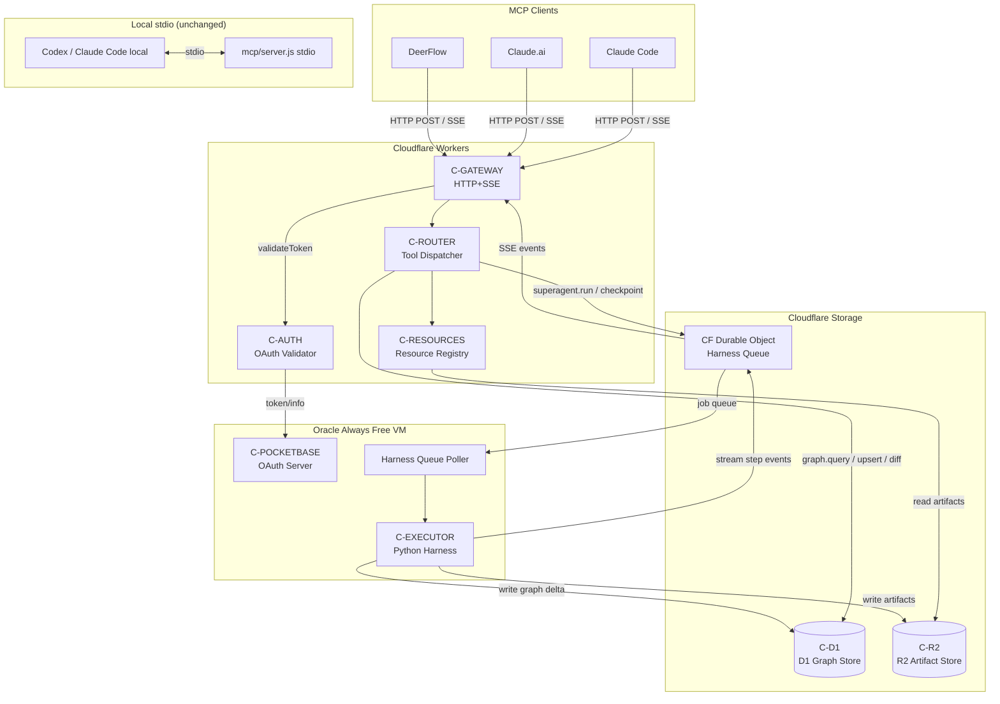
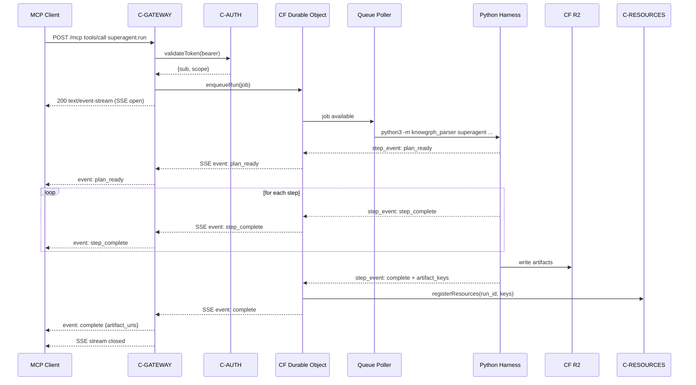
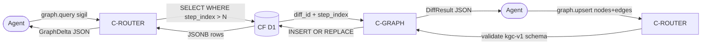

# Knowgrph MCP Service — PRD & TAD (Proposed) Companion

Continuation of [knowgrph-mcp-service-prd-tad-proposed.md](knowgrph-mcp-service-prd-tad-proposed.md). Contains Data Flows, Component Specifications, Integration Contracts, ADRs, Quality Attributes, Deployment Strategy, Architecture Diagrams, Traceability, and Validation Checklist.

**Document Version**: 0.2.0
**Date**: 2026-05-20
**Status**: Proposed

---

### Data Flows

#### DF-1: MCP Handshake

| Stage | Component | Input Format | Output Format | Persistence | Error Handling |
|---|---|---|---|---|---|
| Ingest | C-GATEWAY | HTTP POST `application/json` MCP envelope | Validated MCP envelope | None | 400 on malformed JSON |
| Transform | C-AUTH | Bearer token string | Auth claim object `{sub, exp, scope}` | None | 401 on invalid |
| Store | None (stateless) | — | — | None | — |
| Serve | C-ROUTER | Auth claim + MCP method | Tool schema list JSON | None (in-memory) | 503 on router fail |

#### DF-2: Harness Run

| Stage | Component | Input Format | Output Format | Persistence | Error Handling |
|---|---|---|---|---|---|
| Ingest | C-GATEWAY | `tools/call` JSON: `{inputPath, outputDir, runId}` | Queued job object | CF DO queue (ephemeral) | 422 on missing fields |
| Transform | C-EXECUTOR | Job object + `superagent_harness.py` | SSE events + artifact files | `state.json`, `trace.jsonl` on R2 | Retry budget per harness policy |
| Store | C-ARTIFACT | Artifact files (MD, JSON, HTML, SVG) | R2 object keys | R2 (durable, zero-egress) | Alert on write failure |
| Serve | C-RESOURCES | R2 object keys | MCP Resource list + content | None (R2-backed) | 202 if not yet written |

#### DF-3: Graph Delta

| Stage | Component | Input Format | Output Format | Persistence | Error Handling |
|---|---|---|---|---|---|
| Ingest | C-ROUTER | `{run_id, since_step}` JSON | Validated query params | None | 422 on invalid params |
| Transform | C-GRAPH | Query params | D1 SQL `WHERE step_index > ?` | None | 503 on D1 timeout |
| Store | C-D1 | — (read-only) | JSONB rows | D1 (durable) | Read replica fallback |
| Serve | C-ROUTER | JSONB rows | `{nodes:[], edges:[], diff_id}` JSON | None | 404 if run_id absent |

#### DF-4: Graph Write

| Stage | Component | Input Format | Output Format | Persistence | Error Handling |
|---|---|---|---|---|---|
| Ingest | C-ROUTER | `{nodes:[], edges:[]}` JSON | Validated kgc-v1 payload | None | 422 on schema fail |
| Transform | C-GRAPH | kgc-v1 payload | D1 INSERT OR REPLACE statements | None | Rollback on error |
| Store | C-D1 | SQL statements | Committed rows + new `step_index` | D1 (durable) | 409 on conflict |
| Serve | C-ROUTER | Committed `step_index` | `{diff_id, step_index}` JSON | None | — |

#### DF-5: Resource Read

| Stage | Component | Input Format | Output Format | Persistence | Error Handling |
|---|---|---|---|---|---|
| Ingest | C-RESOURCES | `resource://knowgrph/{run-id}/{artifact}` URI | Parsed `{run_id, artifact_name}` | None | 400 on malformed URI |
| Transform | C-RESOURCES | R2 key derived from URI | R2 get request | None | 404 if key absent |
| Store | C-R2 | — (read-only) | Object bytes | R2 (durable, zero-egress) | 503 on R2 outage |
| Serve | C-RESOURCES | Object bytes | MCP resource `{uri, mimeType, text|blob}` | None | 202 if not yet written |

#### DF-6: Token Validation

| Stage | Component | Input Format | Output Format | Persistence | Error Handling |
|---|---|---|---|---|---|
| Ingest | C-AUTH | `Authorization: Bearer <token>` header | Token string | None | 401 on absent header |
| Transform | C-AUTH | Token string | PocketBase `/oauth2/token/info` HTTP call | None | 503 if PocketBase down |
| Store | None | — | — | None | — |
| Serve | C-AUTH | `{sub, exp, scope}` claim | Auth decision (allow/deny) | None | 401 on expired |

---

### Component Specifications

**Component**: C-GATEWAY
**Responsibility**: Accepts inbound HTTP requests and routes them to the MCP tool router after auth validation.
**Interfaces**: HTTP POST `/mcp` (MCP envelope); SSE stream response
**Dependencies**: C-AUTH, C-ROUTER
**Configuration**: `KNOWGRPH_NAMESPACE`, `PORT` (local), CF Workers bindings

---

**Component**: C-AUTH
**Responsibility**: Validates Bearer tokens against PocketBase OAuth2 token-info endpoint.
**Interfaces**: Internal function `validateToken(bearer): AuthClaim | 401`
**Dependencies**: C-POCKETBASE (external HTTP)
**Configuration**: `POCKETBASE_URL`, `POCKETBASE_CLIENT_ID`

---

**Component**: C-ROUTER
**Responsibility**: Dispatches validated MCP tool calls to the correct handler and returns typed responses.
**Interfaces**: Internal dispatch table keyed by tool name; returns MCP `CallToolResult`
**Dependencies**: C-EXECUTOR, C-GRAPH, C-ARTIFACT, C-RESOURCES
**Configuration**: Tool registry (declarative JSON); schema token budget enforcement

---

**Component**: C-EXECUTOR
**Responsibility**: Spawns and supervises the Python harness process via CF Durable Object queue, streams step events as SSE.
**Interfaces**: CF Durable Object RPC `enqueueRun(job)`; SSE event emitter
**Dependencies**: `knowgrph_parser.superagent_harness`, CF Durable Objects, C-ARTIFACT
**Configuration**: `KNOWGRPH_PYTHON`, `KNOWGRPH_ROOT`, `MAX_WALL_CLOCK_SECONDS`

---

**Component**: C-GRAPH
**Responsibility**: Reads and writes `kgc-computing-flow/v1` nodes and edges against CF D1, producing typed JSONB deltas.
**Interfaces**: `query(pattern): GraphDelta`; `upsert(payload): DiffResult`
**Dependencies**: C-D1 (CF D1 binding)
**Configuration**: `DB` binding (D1); `KGC_SCHEMA_VERSION`

---

**Component**: C-ARTIFACT
**Responsibility**: Persists harness output files to CF R2 and registers them with C-RESOURCES on completion.
**Interfaces**: `sync(outputDir, runId): ArtifactManifest`
**Dependencies**: C-R2 (CF R2 binding), C-RESOURCES
**Configuration**: `ARTIFACTS_BUCKET` (R2 binding)

---

**Component**: C-RESOURCES
**Responsibility**: Maintains the MCP Resources registry and serves artifact content from R2 by resource URI.
**Interfaces**: `list(runId?): ResourceList`; `read(uri): ResourceContent`
**Dependencies**: C-R2 (CF R2 binding), C-D1 (resource metadata)
**Configuration**: `RESOURCE_URI_PREFIX = resource://knowgrph/`

---

**Component**: C-POCKETBASE
**Responsibility**: External OAuth 2.1 authorization server; issues and validates Bearer tokens.
**Interfaces**: `POST /oauth2/token`; `GET /oauth2/token/info`
**Dependencies**: Oracle Always Free VM (existing)
**Configuration**: Managed externally; URL injected via `POCKETBASE_URL` env

---

**Component**: C-D1
**Responsibility**: Durable relational store for graph nodes, edges, run metadata, and resource registry.
**Interfaces**: CF D1 SQL binding
**Dependencies**: Cloudflare D1 (existing account)
**Configuration**: `DB` binding; migrations under `cloudflare/migrations/`

---

**Component**: C-R2
**Responsibility**: Zero-egress binary object store for harness artifact files.
**Interfaces**: CF R2 binding (`put`, `get`, `list`)
**Dependencies**: Cloudflare R2 (existing account)
**Configuration**: `ARTIFACTS_BUCKET` binding

---

### Integration Contracts

| Interface | Protocol | Format | Errors |
|---|---|---|---|
| MCP HTTP+SSE transport | HTTP/1.1 POST + SSE | `application/json` in; `text/event-stream` out | 400 malformed / 401 auth / 422 schema / 503 unavail |
| OAuth token validation | HTTP GET (PocketBase) | JSON `{id, token, collectionId, …}` | 401 expired / 503 PocketBase down |
| CF D1 graph query | D1 SQL binding | SQL + JSONB parameters | D1 error object; surfaced as 503 |
| CF R2 artifact store | R2 binding | Binary blob / UTF-8 text | R2 error object; surfaced as 503 |
| CF Durable Object queue | DO RPC | JSON job envelope | DO eviction → checkpoint resume |
| Python harness subprocess | CF DO shell exec | CLI args + stdout/stderr | Non-zero exit → `step_failed` SSE event |

**Tool Schema Contract** (all tools):
```json
{
  "name": "knowgrph.<domain>.<action>",
  "description": "<≤20 words, no examples array>",
  "inputSchema": {
    "type": "object",
    "properties": { "<field>": { "type": "<type>", "description": "<≤10 words>" } },
    "required": ["<required fields>"]
  }
}
```

**SSE Event Schema** (harness stream):
```json
{
  "event": "plan_ready | step_complete | step_retry | verification_done | checkpoint | complete | timeout",
  "data": {
    "run_id": "<string>",
    "step": "<integer | null>",
    "status": "<string>",
    "artifact_uris": ["<resource://knowgrph/…>"],
    "error": "<string | null>"
  }
}
```

**Graph Delta Schema** (`canvas.diff` response):
```json
{
  "run_id": "<string>",
  "diff_id": "<string>",
  "since_step": "<integer>",
  "nodes": [{ "@node": "<sigil>", "id": "<string>", "data": {} }],
  "edges": [{ "@edge": "<sigil>", "source": "<id>", "target": "<id>", "data": {} }]
}
```

---

### Architectural Decisions (ADRs)

#### ADR-1: HTTP+SSE over WebSocket for MCP transport

**Status**: Proposed
**Date**: 2026-05-20

**Context**: MCP 2025-03-26 spec supports both HTTP+SSE and WebSocket transports. CF Workers has limited WebSocket session duration (≤30s without Durable Objects hibernation).

**Decision**: Use HTTP+SSE transport. Long-running harness runs stream events through CF Durable Objects (hibernatable WebSocket bridge internally), but the MCP-facing API is HTTP+SSE.

**Alternatives Considered**:
1. WebSocket: lower overhead per message / CF Workers 30s limit without DO; harder client compatibility
2. HTTP polling: no additional infrastructure / high latency; wasteful token re-fetch

**Rationale**: HTTP+SSE is the MCP spec default, universally supported by SDK clients, and CF Durable Objects handle long-lived state transparently.

**Consequences**:
- Positive: Spec-compliant; SDK client out-of-the-box; CF Workers hibernation for long runs
- Negative: SSE is unidirectional; client cannot cancel mid-stream without closing connection
- Neutral: CF DO billing applies for harness runs > 30s

---

#### ADR-2: CF Durable Objects for Python harness isolation

**Status**: Proposed
**Date**: 2026-05-20

**Context**: CF Workers cannot spawn subprocesses (Node.js `child_process` is unavailable in the V8 isolate). `knowgrph_parser superagent_harness.py` requires Python execution. (Addresses OQ-1.)

**Decision**: Use a CF Durable Object as a stateful worker that bridges to an external Python runtime. The DO enqueues the job; a sidecar process on the Oracle Always Free VM (where PocketBase runs) polls the DO queue, executes the harness, and writes results to R2. The DO tracks state and emits SSE events.

**Alternatives Considered**:
1. Rewrite harness in TypeScript: full compatibility / months of effort; breaks Codex `/goal` contract
2. CF Workers + external Python API (separate server): works / adds infra; violates TCO-zero constraint if separate VM required
3. Oracle VM as MCP host (bypass CF Workers): possible / loses CF edge benefits; single-region

**Rationale**: Oracle Always Free VM is already running PocketBase; adding a lightweight harness queue poller costs zero additional infra. CF DO provides the stateful SSE bridge. R2 is the shared artifact bus.

**Consequences**:
- Positive: Zero new infra cost; harness unchanged; state durability via DO + R2
- Negative: Coupling between CF DO and Oracle VM; polling latency (configurable, default 2s)
- Neutral: Oracle VM becomes single point of Python execution; acceptable for solo-founder scale

---

#### ADR-3: PocketBase OAuth 2.1 over Cloudflare Access

**Status**: Proposed
**Date**: 2026-05-20

**Context**: MCP spec requires OAuth 2.1 for remote servers. Two options: Cloudflare Access (zero-config, MFA) or PocketBase (existing, full control). (Addresses OQ-2.)

**Decision**: Use PocketBase OAuth 2.1 with PKCE. PocketBase is already deployed and holds user records for Knowgrph. This avoids a second auth system and keeps the token store co-located with graph data.

**Alternatives Considered**:
1. Cloudflare Access: zero-config MFA / cannot issue MCP Bearer tokens natively; would require custom worker bridge
2. Auth.js / Lucia: flexible / adds NPM dependency and maintenance surface

**Rationale**: PocketBase implements OAuth 2.1 natively since v0.21. The `/oauth2/token` and `/oauth2/token/info` endpoints are stable. Zero additional infra.

**Consequences**:
- Positive: Single auth system; token store in existing DB; FOSS
- Negative: PocketBase downtime = MCP auth downtime; no built-in MFA (can add via PB hooks)
- Neutral: Token TTL configurable via PocketBase admin

---

#### ADR-4: Minimal tool schema design

**Status**: Proposed
**Date**: 2026-05-20

**Context**: MCP tool schemas are injected into LLM context on every call. Verbose descriptions and `examples` arrays add 200–600 tokens per tool per turn. (Addresses PRD-MCP2-S1.)

**Decision**: Enforce a schema budget: ≤20 words per tool description, ≤10 words per field description, no `examples` arrays. Budget validated at server startup via automated token count check.

**Alternatives Considered**:
1. Rich schemas with examples: better self-documentation for humans / untenable token cost at scale
2. External schema registry (separate fetch): separates docs from runtime / added complexity

**Rationale**: AI agents do not require human-readable prose in tool schemas; they parse structure. Brevity is accuracy for LLMs.

**Consequences**:
- Positive: ≤800 token overhead for full tool list; directly improves cost per agentic loop
- Negative: Human developers must consult separate docs (link in `mcp/README.md`)
- Neutral: Schema validation at startup catches budget violations before deploy

---

#### ADR-5: CF D1 for graph store (replaces file-system canvas.graph.json)

**Status**: Proposed
**Date**: 2026-05-20

**Context**: Current graph output is a file (`canvas.graph.json`) written to `data/outputs/`. Remote agents cannot query or write it without filesystem access. (Addresses OQ-3, OQ-4.)

**Decision**: Mirror graph state to CF D1 as the authoritative store for remote access. The harness continues to write `canvas.graph.json` to disk (and R2 for artifact access), but C-GRAPH maintains a D1 table with `step_index`-tagged rows enabling delta queries. D1 uses JSON1 extension for JSONB-style queries; `@node` sigil matching uses `json_extract` with `LIKE` for v0.1 (GIN equivalent deferred to v0.2 if performance warrants).

**Alternatives Considered**:
1. PostgreSQL (existing Hackamap pattern): full GIN / adds infra outside CF stack
2. Derive diffs on-the-fly from `trace.jsonl` (OQ-4 option B): no extra storage / O(N) scan per query; unacceptable at scale

**Rationale**: D1 is zero-cost within free tier (500MB, 5M reads/day), CF-native, and `json_extract` covers `@node` sigil lookups for v0.1 graph sizes. Migration to PostgreSQL deferred to when D1 limits are reached.

**Consequences**:
- Positive: Zero additional infra; graph queryable by remote agents; delta queries enabled
- Negative: D1 `json_extract` + LIKE is O(N) without GIN; acceptable for ≤10k nodes per canvas
- Neutral: Harness must be updated to write to D1 via C-GRAPH on each step completion

---

### Quality Attributes

| Attribute | Scenario | Pattern | Validation |
|---|---|---|---|
| Performance | Agent calls `graph.query` → p95 ≤ 500ms under 50 concurrent requests | D1 JSON1 index on `step_index`; CF edge routing | Load test with k6: 50 VUs, 60s |
| Scalability | CF Workers handles 100k requests/day (free tier ceiling) | CF auto-scaling; stateless gateway | CF analytics: daily request count alert at 80k |
| Security | Unauthorized client calls any tool → 401 within 100ms | OAuth PKCE; PocketBase token validation on every request | Automated auth test suite: unauthenticated requests must all return 401 |
| Observability | Harness run fails mid-step → operator notified within 5 minutes | CF Workers `console.log` → CF Logpush → PocketBase alert hook | Integration test: inject `--fail-once` flag; verify alert fires |
| Resilience | CF Durable Object evicted mid-run → harness resumes from checkpoint | DO hibernation + R2 `state.json` checkpoint; resume on reconnect | Test: kill DO mid-run; verify resume from last checkpoint |
| Token Efficiency | Full `tools/list` ≤ 800 tokens | Schema budget enforced at startup | Unit test: tokenize schema at boot; fail if over budget |

---

### Deployment Strategy

**Target**: Cloudflare Workers (HTTP+SSE gateway + C-GATEWAY + C-ROUTER + C-AUTH + C-RESOURCES)
**Sidecar**: Oracle Always Free VM (PocketBase + harness queue poller)
**Artifact store**: CF R2 (existing bucket; new `knowgrph-artifacts` prefix)
**Graph store**: CF D1 (new `knowgrph_graph` database; migrations in `cloudflare/migrations/`)

**Release sequence**:
1. Deploy D1 schema migrations (`cloudflare/migrations/001_graph_init.sql`)
2. Deploy CF Workers bundle (`wrangler deploy`) — stdio server continues to run locally in parallel
3. Deploy PocketBase OAuth application record
4. Deploy Oracle VM queue poller (`scripts/harness-queue-poller.py`)
5. Run smoke test: `curl -H "Authorization: Bearer <token>" https://knowgrph-mcp.<account>.workers.dev/mcp`
6. Validate `tools/list` returns all 6 tools with schema token count ≤ 800

**Rollback plan**: CF Workers supports instant rollback to prior deployment via `wrangler rollback`. D1 schema changes are additive-only in v0.1 (no destructive migrations); rollback does not require DB migration reversal. Oracle VM poller can be stopped with no impact on stdio path.

**Stdio preservation**: Existing `mcp/server.js` stdio server is unchanged; `npm run mcp:stdio` continues to work for local Codex usage. HTTP+SSE is an additive path, not a replacement.

---

### Architecture Diagrams

#### System Component Topology



#### Harness Execution Sequence



#### Graph Tool Data Flow



---

### Component Inventory

| Layer | Component | File / Module | Status |
|---|---|---|---|
| Transport | C-GATEWAY | `mcp/src/gateway.ts` | Proposed |
| Auth | C-AUTH | `mcp/src/auth.ts` | Proposed |
| Routing | C-ROUTER | `mcp/src/router.ts` | Proposed |
| Execution | C-EXECUTOR | `mcp/src/executor.ts` | Proposed |
| Graph | C-GRAPH | `mcp/src/graph.ts` | Proposed |
| Artifacts | C-ARTIFACT | `mcp/src/artifact.ts` | Proposed |
| Resources | C-RESOURCES | `mcp/src/resources.ts` | Proposed |
| Queue sidecar | Queue Poller | `scripts/harness-queue-poller.py` | Proposed |
| D1 migrations | Schema init | `cloudflare/migrations/001_graph_init.sql` | Proposed |
| CF config | Wrangler | `mcp/wrangler.toml` | Proposed |
| Existing | stdio server | `mcp/server.js` | Stable (unchanged) |
| Existing | Python harness | `knowgrph_parser/superagent_harness.py` | Stable (unchanged) |

---

## PRD ↔ TAD Traceability

| PRD ID | Story | TAD Component | TAD Interface |
|---|---|---|---|
| PRD-MCP1-S1 | HTTP+SSE harness invocation | C-GATEWAY, C-EXECUTOR, CF Durable Object | `gateway.ts` HTTP+SSE; DO `enqueueRun` |
| PRD-MCP1-S2 | CF Workers one-command deploy | C-GATEWAY, all CF-hosted components | `mcp/wrangler.toml` |
| PRD-MCP1-S3 | OAuth 2.1 PKCE auth | C-AUTH, C-POCKETBASE | `auth.ts` validateToken; PB `/oauth2/token/info` |
| PRD-MCP2-S1 | Pruned tool schemas | C-ROUTER | `router.ts` schema registry with budget check |
| PRD-MCP2-S2 | Streaming SSE progress | C-EXECUTOR, CF Durable Object, C-GATEWAY | DO → GW SSE relay |
| PRD-MCP2-S3 | Canvas diff tool | C-GRAPH, C-D1 | `graph.ts` query with `since_step`; D1 `step_index` |
| PRD-MCP3-S1 | Graph query tool | C-GRAPH, C-D1 | `graph.ts` query; D1 JSON1 |
| PRD-MCP3-S2 | Graph upsert tool | C-GRAPH, C-D1 | `graph.ts` upsert; kgc-v1 schema validator |
| PRD-MCP3-S3 | Harness checkpoint tool | C-EXECUTOR, C-R2 | `executor.ts` checkpoint read; R2 `state.json` |
| PRD-MCP4-S1 | MCP Resources | C-RESOURCES, C-R2 | `resources.ts` list/read; R2 artifact keys |
| PRD-MCP4-S2 | MCP Sampling *(Won't — v0.1)* | Deferred | — |

---

## Validation Checklist

**Pre-Implementation**:
- [x] User journeys mapped before stories written; every story anchored to a journey stage
- [x] Workflows defined with trigger, happy path, alternate paths, error paths, and postconditions
- [x] Data flows typed at every stage boundary with persistence and error handling documented
- [x] User stories follow "As a… I want… So that" format
- [x] Acceptance criteria use Given-When-Then with observable outcomes
- [x] Features prioritized via MoSCoW with rationale
- [x] Components have single responsibility; interfaces specified with explicit contracts
- [x] Architectural decisions documented with ADRs (ADR-1 through ADR-5)
- [x] Architecture diagrams use Mermaid (not ASCII for >5 nodes)
- [x] Component inventory table accompanies every architecture diagram
- [x] PRD-to-TAD traceability established via `PRD-[Epic]-[Story] ↔ TAD-[Component]-[Interface]`
- [x] No implementation detail in PRD; no business logic in TAD

**Open at Gate (Phase 1 → Phase 2)**:
- [ ] OQ-1 resolved: CF Workers Python subprocess approach confirmed or DO sidecar pattern approved
- [ ] OQ-2 resolved: PocketBase vs CF Access auth decision finalized
- [ ] OQ-3 resolved: D1 JSON1 query plan benchmarked for `@node` sigil pattern at expected canvas sizes
- [ ] OQ-4 resolved: D1 step-indexed storage vs `trace.jsonl` diff derivation chosen
- [ ] OQ-5 resolved: MCP Sampling client support inventory completed

**Post-Documentation Review**:
- [ ] Builder (airvio) validates PRD addresses agent pipeline pain points
- [ ] Development confirms TAD is implementable within CF Workers constraints
- [ ] QA confirms acceptance criteria (especially p95 latency and token budget) are objectively testable
- [ ] Success metrics baselined (CF Workers dashboard + tokenizer unit test)
- [ ] Quality attribute scenarios confirmed measurable (k6 load test, auth test suite)
- [ ] All open questions resolved or formally tracked in `todo.md`
