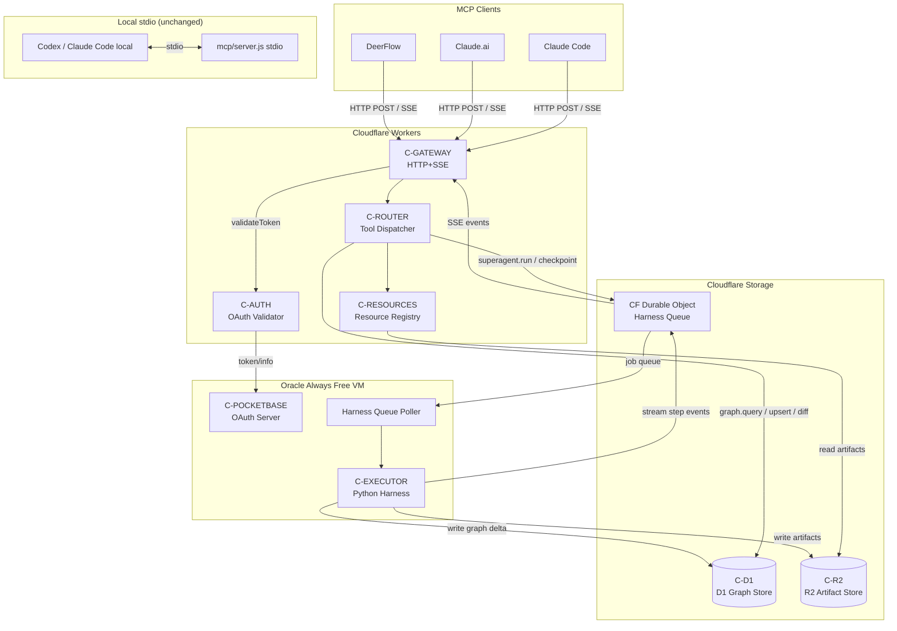
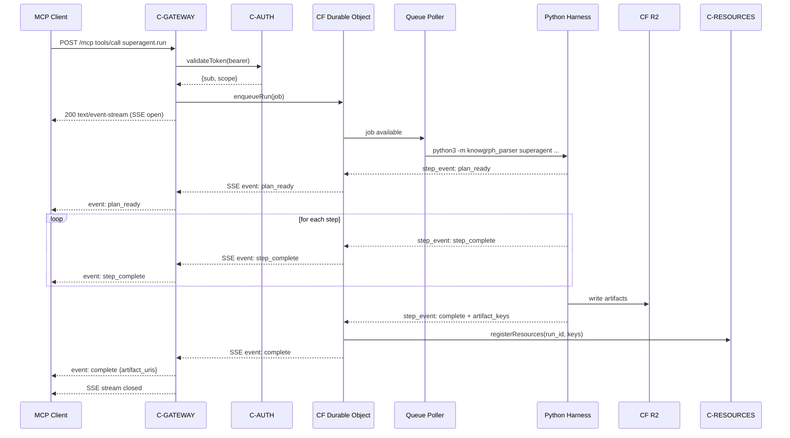
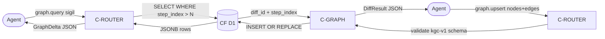

# Knowgrph MCP Service — PRD & TAD (Proposed)

> **Document type**: Combined PRD + TAD | **Phase**: Proposed (pre-implementation) | **Version**: 0.2.0

---

## Table of Contents

1. [Problem Discovery (Phase 0)](#phase-0--problem-discovery)
2. [PRD — Product Requirements](#prd--product-requirements)
   - [Problem Statement](#problem-statement)
   - [Personas](#personas)
   - [User Journeys](#user-journeys)
   - [Epics & User Stories](#epics--user-stories)
   - [Acceptance Criteria](#acceptance-criteria)
   - [MoSCoW Prioritization](#moscow-prioritization)
   - [Success Metrics](#success-metrics)
   - [Scope Boundaries](#scope-boundaries)
   - [Dependencies](#dependencies)
   - [Open Questions](#open-questions)
3. [TAD — Technical Architecture](#tad--technical-architecture)
   - [Architecture Overview](#architecture-overview)
   - [Journey → System Mapping](#journey--system-mapping)
   - [Workflows](#workflows)
   - [Data Flows](#data-flows)
   - [Component Specifications](#component-specifications)
   - [Integration Contracts](#integration-contracts)
   - [Architectural Decisions (ADRs)](#architectural-decisions-adrs)
   - [Quality Attributes](#quality-attributes)
   - [Deployment Strategy](#deployment-strategy)
   - [Architecture Diagrams](#architecture-diagrams)
   - [Component Inventory](#component-inventory)
4. [PRD ↔ TAD Traceability](#prd--tad-traceability)
5. [Validation Checklist](#validation-checklist)

> **v0.2.0 additions** are marked with `<!-- v0.2 -->` inline and consolidated in the changelog above.

---

## Phase 0 — Problem Discovery

### Problem Hypothesis

> **Falsifiable**: The current Knowgrph MCP server (`mcp/server.js`) is limited to stdio transport and local-only access, preventing external AI agents, remote orchestrators, and multi-tenant pipelines from invoking the harness or querying the knowledge graph — measurable by the inability of any non-local MCP client to call `knowgrph.superagent.run` without direct filesystem access.

### Problem Impact Quantification

| Pain Point | Observable Symptom | Impact |
|---|---|---|
| stdio-only transport | Remote agents (Claude.ai, DeerFlow, CI) cannot call harness | Blocks airvio agent pipeline composition |
| No remote auth | No multi-tenant gating; single-user local only | Blocks SaaS and shared-workspace scenarios |
| Single tool exposure | Only `superagent.run` registered; no graph query/write | Agents must run full harness to read one node |
| Full-blob responses | `canvas.graph.json` returned whole on each call | ~8k–40k token overhead per graph query |
| No MCP Resources | Workspace docs not addressable by URI | Agents cannot fetch artifacts without tool overhead |
| No monetization path <!-- v0.2 --> | MCP service has no checkout flow; usage is free with no revenue mechanism | Blocks airvio from converting agentic commerce traffic into revenue |

### Stakeholder Alignment

| Role | Concern | Aligned Scope |
|---|---|---|
| Solo founder (airvio) | Zero TCO, FOSS-first, Cloudflare-native | CF Workers + MIT SDK + Oracle Free PocketBase |
| AI Agent (Claude Code / DeerFlow) | Stable tool contracts, low token cost | Pruned schemas, delta responses, typed contracts |
| KGC Pipeline (Hackamap / Singapoly) | Graph read/write without full harness run | `graph.query` + `graph.upsert` tools |
| Paying Customer (MCP host user) <!-- v0.2 --> | Purchase harness credits or canvas tiers inside MCP host (Claude.ai, ChatGPT) without leaving chat | Stripe Checkout redirect flow via `knowgrph.products.list` + `knowgrph.products.buy` tools |

**Gate**: Problem validated and scoped. Proceed to PRD authoring.

---

## PRD — Product Requirements

### Problem Statement

AI agents building on the Knowgrph Knowledge Graph Canvas cannot access the harness or graph data remotely because the MCP server is stdio-only, path-restricted, and exposes a single tool (`knowgrph.superagent.run`). This forces every consumer — whether a Claude.ai session, a DeerFlow workflow, or a CI pipeline — to either run Knowgrph locally or bypass MCP entirely. The opportunity is to expose Knowgrph as a first-class, remotely accessible MCP service with typed graph tooling, streaming responses, and zero-TCO hosting, enabling AI agents to compose with the harness and the knowledge graph as native building blocks.

---

### Personas

**Persona A — Autonomous AI Agent**
- **Job-to-be-done**: Invoke harness runs, query graph state, and write enriched nodes without human mediation.
- **Context**: Claude Code, DeerFlow, or a custom LangGraph node operating in a CI or agentic loop.
- **Pain**: Can only call `superagent.run` via a local stdio pipe; no remote access; responses carry full canvas blobs even for single-node reads.

**Persona B — airvio Builder (Joohwee)**
- **Job-to-be-done**: Compose multi-project pipelines (KGC + Hackamap + Singapoly) through a single MCP endpoint without per-project infrastructure.
- **Context**: Solo founder; zero-TCO constraint; Cloudflare stack already in use.
- **Pain**: Cannot share a single running MCP instance across projects or expose it to collaborators; auth is absent.

**Persona C — Downstream LLM Orchestrator**
- **Job-to-be-done**: Fetch workspace documents and graph artifacts as named resources, not tool calls.
- **Context**: Any MCP client supporting the Resources protocol (e.g. Claude.ai with MCP resource panel).
- **Pain**: No MCP Resources registered; artifacts are only reachable via tool calls, wasting tool-use token budget.

**Persona D — Paying Customer (MCP Host User)** <!-- v0.2 -->
- **Job-to-be-done**: Browse Knowgrph service tiers or harness credit packs and complete a purchase without leaving their MCP host (Claude.ai, ChatGPT).
- **Context**: A developer or researcher using a Knowgrph-connected MCP host who wants to unlock higher harness run budgets, premium canvas exports, or additional graph storage.
- **Pain**: No in-chat purchasing path; must navigate external website, lose context, and manually upgrade — high drop-off.

---

### User Journeys

#### Journey: Autonomous AI Agent — Run harness and read result

| Stage | Action | Touchpoint | Pain Point | Opportunity |
|---|---|---|---|---|
| Trigger | Agent receives goal brief | LLM tool-use context | No remote MCP endpoint | HTTP+SSE endpoint on CF Workers |
| Discover | Agent lists available tools | MCP `tools/list` | Only one tool; no schema docs | Pruned schema; rich tool set |
| Engage | Agent calls `superagent.run` | MCP tool call | Full blob response; slow | Streaming SSE progress events |
| Complete | Agent reads result artifact | MCP resource fetch | No resource URIs registered | `resource://knowgrph/{run-id}/…` |
| Return | Agent polls run for checkpoint | `harness.checkpoint` tool | No checkpoint tool | Checkpoint read tool |

#### Journey: airvio Builder — Configure multi-project MCP endpoint

| Stage | Action | Touchpoint | Pain Point | Opportunity |
|---|---|---|---|---|
| Trigger | New project pipeline needs graph access | CF Workers dashboard | No deploy path | `wrangler deploy` one-command |
| Discover | Builder checks auth configuration | PocketBase admin | No auth layer | OAuth 2.1 PKCE via PocketBase |
| Engage | Builder registers project namespace | MCP env config | No namespace isolation | `KNOWGRPH_NAMESPACE` env var |
| Complete | Builder verifies tool contracts | MCP inspector | Schemas undocumented | Typed JSON Schema per tool |
| Return | Builder updates harness version | GitHub push → CF deploy | Manual redeploy | GitHub Actions → wrangler |

#### Journey: Downstream Orchestrator — Fetch workspace artifact as resource

| Stage | Action | Touchpoint | Pain Point | Opportunity |
|---|---|---|---|---|
| Trigger | Orchestrator needs canvas state | MCP client | No resource URIs | Resources protocol enabled |
| Discover | Orchestrator lists resources | `resources/list` | Empty list | Workspace docs registered |
| Engage | Orchestrator fetches artifact | `resources/read` | Full tool call overhead | Direct resource read; no tool overhead |
| Complete | Orchestrator parses JSONB graph | Resource content | Schema undocumented | Typed JSONB response schema |
| Return | Orchestrator re-fetches on diff | Resource subscription | No change notification | `resource.updated` event via SSE |

#### Journey: Paying Customer — Purchase harness credits inside MCP host <!-- v0.2 -->

| Stage | Action | Touchpoint | Pain Point | Opportunity |
|---|---|---|---|---|
| Trigger | Agent hits run-budget limit; suggests upgrade | MCP tool response | No upgrade path in-chat | `knowgrph.products.list` tool triggers product UI |
| Discover | Customer views available plans in MCP host | `list-products` UI resource widget | External website required today | In-chat product card widget via `@modelcontextprotocol/ext-apps` |
| Engage | Customer selects plan; clicks Buy | Product UI widget → `knowgrph.products.buy` tool | Manual copy-paste URL; context loss | Checkout Session URL returned; opens Stripe-hosted page in new tab |
| Complete | Customer completes Stripe Checkout | Stripe-hosted Checkout page | Separate tab; no in-chat confirmation | `checkout.session.completed` webhook → credit grant → in-chat confirmation |
| Return | Customer continues with unlocked quota | MCP tool call proceeds | Drop-off if confirmation is unclear | `resource://knowgrph/account/credits` resource reflects updated balance |

---

### Epics & User Stories

#### Epic MCP-1: Remote Transport

**PRD-MCP1-S1**: As an autonomous AI agent, I want to call `knowgrph.superagent.run` over HTTP+SSE so that I can invoke the harness from a remote process without filesystem access.

**PRD-MCP1-S2**: As an airvio builder, I want to deploy the MCP server to Cloudflare Workers with a single command so that I have a zero-TCO remote endpoint without managing server infrastructure.

**PRD-MCP1-S3**: As an AI agent, I want to authenticate with the MCP server via OAuth 2.1 PKCE so that only authorized clients invoke the harness.

#### Epic MCP-2: Token-Efficient Tool Surface

**PRD-MCP2-S1**: As an AI agent, I want tool schemas to be minimal and pruned so that tool-use token overhead is reduced per call.

**PRD-MCP2-S2**: As an AI agent, I want harness run progress delivered as streaming SSE events so that I receive incremental signal without waiting for the full run to complete.

**PRD-MCP2-S3**: As an AI agent, I want a `knowgrph.canvas.diff` tool that returns only changed nodes and edges so that I can track graph state changes without fetching the full canvas.

#### Epic MCP-3: Graph Tool Surface

**PRD-MCP3-S1**: As an autonomous AI agent, I want a `knowgrph.graph.query` tool so that I can retrieve a subgraph matching a sigil pattern or JSONB filter without running the full harness.

**PRD-MCP3-S2**: As a KGC pipeline, I want a `knowgrph.graph.upsert` tool so that I can write nodes and edges with schema validation directly via MCP.

**PRD-MCP3-S3**: As an autonomous AI agent, I want a `knowgrph.harness.checkpoint` tool so that I can read the current run's `state.json` and `trace.jsonl` mid-flight.

#### Epic MCP-4: MCP Resources & Sampling

**PRD-MCP4-S1**: As a downstream orchestrator, I want workspace documents registered as MCP Resources so that I can fetch them without a tool call.

**PRD-MCP4-S2**: As an AI agent orchestrator, I want MCP Sampling callbacks enabled so that the harness can request LLM completions during graph synthesis without a hardcoded provider key.

#### Epic MCP-5: Stripe MCP Monetization <!-- v0.2 -->

**PRD-MCP5-S1**: As a paying customer in an MCP host, I want to browse available Knowgrph service plans via an in-chat product list widget so that I can evaluate tiers without leaving the chat interface.

**PRD-MCP5-S2**: As a paying customer, I want to initiate a Stripe Checkout for a selected plan from within my MCP host so that I can complete payment on a secure Stripe-hosted page and return to the chat with my quota unlocked.

**PRD-MCP5-S3**: As an airvio builder, I want successful Stripe payments to automatically grant harness run credits to the authenticated user via webhook so that quota is updated without manual intervention.

---

### Acceptance Criteria

#### PRD-MCP1-S1 — Remote HTTP+SSE harness invocation

**Given** an MCP client with a valid OAuth token and the CF Workers endpoint URL,
**When** it sends `tools/call` with tool name `knowgrph.superagent.run` and a valid input payload,
**Then** the server returns HTTP 200 with `Content-Type: text/event-stream`, emits at least one `state_update` event before `complete`, and the final event contains `artifacts` with `harness-proof.json` present.

#### PRD-MCP1-S2 — CF Workers one-command deploy

**Given** `wrangler.toml` is configured with `KNOWGRPH_ROOT` and `KNOWGRPH_PYTHON` bindings,
**When** the builder runs `wrangler deploy`,
**Then** the MCP server is live at `https://knowgrph-mcp.<account>.workers.dev` within 30 seconds with `tools/list` returning all registered tools.

#### PRD-MCP1-S3 — OAuth 2.1 PKCE auth

**Given** a client presents an expired or absent Bearer token,
**When** it calls any MCP endpoint,
**Then** the server returns HTTP 401 with `WWW-Authenticate: Bearer` and the client is not able to invoke any tool or read any resource.

#### PRD-MCP2-S1 — Pruned tool schemas

**Given** the server starts and a client calls `tools/list`,
**When** the response is parsed,
**Then** no tool's `description` field exceeds 20 words, no tool schema contains an `examples` array, and the total token count of all tool schemas combined is ≤ 800 tokens (measured by `cl100k_base` tokenizer).

#### PRD-MCP2-S2 — Streaming SSE progress

**Given** a client calls `knowgrph.superagent.run` with a valid input,
**When** the harness executes a run with ≥ 3 steps,
**Then** the SSE stream emits distinct events for: `plan_ready`, at least one `step_complete`, `verification_done`, and `complete` — in that order — before the stream closes.

#### PRD-MCP2-S3 — Canvas diff tool

**Given** a client calls `knowgrph.canvas.diff` with a `run_id` and a `since_step` integer,
**When** the run has at least one node change after `since_step`,
**Then** the response contains only nodes/edges added or modified after `since_step`, as a JSONB delta, and the response token count is ≤ 10% of the full `canvas.graph.json` token count for that run.

#### PRD-MCP3-S1 — Graph query tool

**Given** a client calls `knowgrph.graph.query` with a valid `@node` sigil pattern,
**When** matching nodes exist in the D1 graph store,
**Then** the response contains a `nodes` array and an `edges` array matching the pattern, typed to `kgc-computing-flow/v1` schema, with response time ≤ 500ms at p95.

#### PRD-MCP3-S2 — Graph upsert tool

**Given** a client calls `knowgrph.graph.upsert` with a nodes/edges payload conforming to `kgc-computing-flow/v1`,
**When** the server processes the payload,
**Then** all nodes and edges are persisted to CF D1 within one transaction, a `diff_id` is returned for subsequent `canvas.diff` queries, and invalid schema payloads are rejected with HTTP 422 and a field-level error message.

#### PRD-MCP3-S3 — Harness checkpoint tool

**Given** a run is in progress or completed with a valid `run_id`,
**When** a client calls `knowgrph.harness.checkpoint` with that `run_id`,
**Then** the response contains `state.json` content and the last 50 lines of `trace.jsonl`, serialized as JSON, within 200ms.

#### PRD-MCP4-S1 — MCP Resources

**Given** a run completes with artifacts in `data/outputs/{run-id}/`,
**When** a client calls `resources/list`,
**Then** the response includes resource URIs for `rich-media-flow.md`, `canvas.graph.json`, `harness-proof.json`, and `final-report.md` scoped to that run, with correct MIME types.

#### PRD-MCP4-S2 — MCP Sampling callback

**Given** the harness is configured with `SAMPLING_ENABLED=true`,
**When** the harness requires an LLM completion during graph synthesis,
**Then** it issues a `sampling/createMessage` request to the connected MCP client instead of calling a hardcoded provider API, and the response is incorporated into the synthesis step.

#### PRD-MCP5-S1 — In-chat product list widget <!-- v0.2 -->

**Given** an authenticated MCP client calls `tools/call` with `knowgrph.products.list`,
**When** the MCP host supports `@modelcontextprotocol/ext-apps` UI resources,
**Then** the host renders the registered `ui://knowgrph-products.html` widget displaying at least two available plans (name, price, credit quota), each with a "Buy" action; and the tool response `structuredContent` contains a `products` array with `priceId`, `name`, `amount`, and `currency` fields per item.

#### PRD-MCP5-S2 — Stripe Checkout redirect from MCP host <!-- v0.2 -->

**Given** a paying customer selects a plan in the product list widget and triggers the buy action,
**When** the widget calls `knowgrph.products.buy` with the selected `priceId`,
**Then** the server creates a Stripe Checkout Session in `payment` mode with a valid `success_url`, returns the session URL in both `text` content (as a Markdown link) and `structuredContent.checkoutSessionUrl`, and the MCP host opens the URL in a new browser tab within 2 seconds; and the Checkout page is PCI-compliant (Stripe-hosted).

#### PRD-MCP5-S3 — Webhook-driven credit grant <!-- v0.2 -->

**Given** a customer completes payment on the Stripe Checkout page,
**When** Stripe delivers a `checkout.session.completed` webhook to the server's `/stripe/webhook` endpoint,
**Then** the server validates the webhook signature with `stripe.webhooks.constructEvent`, retrieves the session with `line_items` expanded, verifies `payment_status === "paid"`, increments the authenticated user's harness run credit balance in D1 by the purchased amount, and returns HTTP 200 to Stripe within 5 seconds; and the `resource://knowgrph/account/credits` MCP resource reflects the updated balance on next read.

---

### MoSCoW Prioritization

| Story | Priority | Rationale |
|---|---|---|
| PRD-MCP1-S1 — HTTP+SSE transport | **Must** | Unlocks all remote agent access; prerequisite for all other epics |
| PRD-MCP1-S2 — CF Workers deploy | **Must** | Zero-TCO constraint; no alternative zero-cost hosting path identified |
| PRD-MCP1-S3 — OAuth 2.1 PKCE | **Must** | MCP spec mandates for remote servers; multi-tenant safety |
| PRD-MCP2-S1 — Pruned schemas | **Must** | Every agent call incurs schema tokens; immediate savings with zero architecture change |
| PRD-MCP2-S2 — Streaming SSE | **Should** | Significant UX for long runs; not blocking for correctness |
| PRD-MCP2-S3 — Canvas diff tool | **Should** | High ROI for KGC loops; requires D1 step-indexed storage |
| PRD-MCP3-S1 — Graph query tool | **Should** | Core to KGC pipeline agents; needs D1 GIN-equivalent |
| PRD-MCP3-S2 — Graph upsert tool | **Should** | Enables HuggingFace → KGC seeding via MCP; schema validation required |
| PRD-MCP3-S3 — Harness checkpoint | **Could** | Useful for long runs; lower priority than query/upsert |
| PRD-MCP4-S1 — MCP Resources | **Could** | Reduces token overhead for orchestrators; spec support varies by client |
| PRD-MCP4-S2 — MCP Sampling | **Won't** (v0.1) | Complex client-side dependency; deferred to v0.2 after transport stabilizes |

---

### Success Metrics

| Metric | Baseline | Target | Timeline |
|---|---|---|---|
| Remote tool call success rate | 0% (no remote endpoint) | ≥ 99% over 7-day window | 4 weeks post-deploy |
| Tool schema token overhead per `tools/list` | Unmeasured | ≤ 800 tokens (cl100k_base) | At launch |
| Graph query p95 latency | N/A | ≤ 500ms via CF Workers | 4 weeks post-deploy |
| Canvas diff response vs full canvas | N/A | ≤ 10% token ratio | 6 weeks post-deploy |
| CF Workers monthly cost | $0 (not deployed) | $0 (within free tier: 100k req/day) | Ongoing |
| MCP Resources list population | 0 resources | ≥ 4 resources per completed run | 8 weeks post-deploy |

---

### Scope Boundaries

**In scope (v0.1.0)**:
- HTTP+SSE transport alongside existing stdio
- Cloudflare Workers deployment with `wrangler`
- OAuth 2.1 PKCE via PocketBase token store
- Pruned tool schemas for all registered tools
- Streaming SSE progress events for `superagent.run`
- `knowgrph.canvas.diff` tool
- `knowgrph.graph.query` tool
- `knowgrph.graph.upsert` tool
- `knowgrph.harness.checkpoint` tool
- MCP Resources for completed run artifacts

**Out of scope (v0.1.0)**:
- MCP Sampling callback (deferred to v0.2)
- Multi-region CF Workers deployment
- Rate limiting beyond CF built-in
- Real-time collaborative graph editing over MCP
- Any GUI or dashboard for MCP management
- Provider-specific (Anthropic / OpenAI) API key management in server
- Billing or usage metering

---

### Dependencies

| Dependency | Type | Status |
|---|---|---|
| `@modelcontextprotocol/sdk` ≥ 1.x | NPM package (MIT) | Available |
| `workers-mcp` (Cloudflare) | NPM package (MIT) | Available |
| Cloudflare Workers free tier account | Infrastructure | Existing (airvio) |
| Cloudflare D1 (graph store) | Infrastructure | Existing in stack |
| Cloudflare R2 (artifact binary store) | Infrastructure | Existing in stack |
| PocketBase on Oracle Always Free | Auth / DB | Existing in stack |
| `knowgrph_parser superagent_harness.py` | Internal module | Stable (harness v0.x) |
| `kgc-computing-flow/v1` schema | Internal spec | Baselined |

---

### Open Questions

| ID | Question | Owner | Status |
|---|---|---|---|
| OQ-1 | Does CF Workers support Python subprocess spawning needed by `superagent_harness.py`? If not, does the harness need a Durable Objects + Queue pattern to delegate Python execution? | Architect | Open |
| OQ-2 | Should OAuth tokens be issued by PocketBase directly, or proxied through CF Access? Tradeoff: PocketBase gives full control; CF Access gives zero-config MFA. | Builder | Open |
| OQ-3 | What is the D1 query plan for `kgc-computing-flow/v1` JSONB graph pattern matching? Does D1 support GIN-equivalent index for `@node` sigil lookups? | Architect | Open |
| OQ-4 | Should `canvas.diff` store step snapshots in D1 or derive diffs on-the-fly from `trace.jsonl`? | Architect | Open |
| OQ-5 | MCP Sampling requires the client to support `sampling/createMessage`. Which MCP clients in the airvio stack currently implement this capability? | Builder | Open |

---

## TAD — Technical Architecture

### Architecture Overview

**From remote MCP call to graph artifact**: MCP Client → CF Workers HTTP+SSE Gateway → OAuth Middleware → Tool Router → [Harness Executor | Graph Store | Artifact Store] → Streaming SSE response → MCP Client

The architecture extends the existing `mcp/server.js` stdio server with an HTTP+SSE transport layer deployed on Cloudflare Workers, backed by CF D1 (graph), R2 (artifacts), and PocketBase (OAuth). All components adhere to zero-egress-cost and FOSS constraints. The Python harness is invoked via CF Durable Objects queue pattern (see ADR-2 for OQ-1 resolution).

---

### Journey → System Mapping

| Journey Stage | Workflow | Data Flow | Component |
|---|---|---|---|
| Agent discovers tools | `WF-1: Tool Discovery` | `DF-1: MCP Handshake` | `C-GATEWAY`, `C-ROUTER` |
| Agent calls `superagent.run` | `WF-2: Harness Execution` | `DF-2: Harness Run` | `C-EXECUTOR`, `C-ARTIFACT` |
| Agent fetches canvas diff | `WF-3: Graph Delta Query` | `DF-3: Graph Delta` | `C-GRAPH`, `C-D1` |
| Agent upserts nodes | `WF-4: Graph Upsert` | `DF-4: Graph Write` | `C-GRAPH`, `C-D1` |
| Orchestrator fetches resource | `WF-5: Resource Fetch` | `DF-5: Resource Read` | `C-RESOURCES`, `C-R2` |
| Auth challenge | `WF-6: OAuth PKCE` | `DF-6: Token Validation` | `C-AUTH`, `C-POCKETBASE` |

---

### Workflows

#### WF-1: Tool Discovery

**Trigger**: MCP client connects and sends `initialize` + `tools/list`
**Actors**: MCP Client, C-GATEWAY, C-ROUTER

**Happy Path**:
1. Client sends HTTP POST `initialize` → C-GATEWAY validates Bearer token via C-AUTH
2. C-GATEWAY forwards to C-ROUTER → C-ROUTER returns pruned tool schema list
3. Client receives `tools/list` response with ≤ 800 total schema tokens

**Alternate Paths**:
- Client reconnects mid-session: C-GATEWAY re-validates token; session state restored from D1

**Error Paths**:
- Invalid/expired Bearer token: C-AUTH returns 401 with `WWW-Authenticate: Bearer`; client redirected to OAuth PKCE flow
- C-ROUTER unavailable: C-GATEWAY returns 503 with `Retry-After: 5`

**Postconditions**: Client holds valid tool schema list; session established in C-GATEWAY

---

#### WF-2: Harness Execution

**Trigger**: Client calls `tools/call` with `knowgrph.superagent.run`
**Actors**: MCP Client, C-GATEWAY, C-EXECUTOR, C-ARTIFACT, CF Durable Object Queue

**Happy Path**:
1. Client sends tool call → C-GATEWAY validates auth; queues job to CF Durable Object
2. C-EXECUTOR spawns `python3 -m knowgrph_parser superagent` in Durable Object worker
3. Harness emits step events → C-EXECUTOR relays as SSE: `plan_ready`, `step_complete` (×N), `verification_done`
4. Harness writes artifacts → C-ARTIFACT syncs to R2
5. C-EXECUTOR emits `complete` event with artifact URIs and `harness-proof.json` summary
6. SSE stream closes; artifacts registered as MCP Resources in C-RESOURCES

**Alternate Paths**:
- `--stop-after-step N` in input payload: C-EXECUTOR checkpoints after step N; emits `checkpoint` event; stream closes; run resumable via `harness.checkpoint` tool

**Error Paths**:
- Harness step fails (retryable): C-EXECUTOR respects harness retry budget; emits `step_retry` event
- Harness exceeds wall-clock budget: C-EXECUTOR emits `timeout` event; partial `state.json` committed to R2
- CF Durable Object eviction: run resumes from last `state.json` checkpoint on reconnect

**Postconditions**: Artifacts written to R2; resources registered in C-RESOURCES; `harness-proof.json` in D1

---

#### WF-3: Graph Delta Query

**Trigger**: Client calls `knowgrph.canvas.diff` with `run_id` and `since_step`
**Actors**: MCP Client, C-ROUTER, C-GRAPH, C-D1

**Happy Path**:
1. C-ROUTER validates `run_id` exists in D1
2. C-GRAPH queries D1 for nodes/edges with `step_index > since_step`
3. C-GRAPH serializes delta as JSONB; returns in tool response

**Alternate Paths**:
- `since_step = 0`: full canvas returned (fallback to same schema as `canvas.graph.json`)

**Error Paths**:
- `run_id` not found: 404 with `run_id` in error body
- D1 query timeout: 503 with `Retry-After`

**Postconditions**: Client holds typed JSONB delta; no full canvas transfer occurred for partial queries

---

#### WF-4: Graph Upsert

**Trigger**: Client calls `knowgrph.graph.upsert` with nodes/edges payload
**Actors**: MCP Client, C-ROUTER, C-GRAPH, C-D1

**Happy Path**:
1. C-GRAPH validates payload against `kgc-computing-flow/v1` JSON Schema
2. C-GRAPH executes D1 upsert transaction (INSERT OR REPLACE)
3. C-GRAPH increments `step_index`; returns `diff_id` for subsequent diff queries

**Alternate Paths**:
- Partial payload (nodes only, no edges): valid; only node rows upserted

**Error Paths**:
- Schema validation failure: 422 with field-level error array; no partial writes
- D1 transaction conflict: 409; client instructed to retry with exponential backoff

**Postconditions**: All valid nodes/edges persisted; `diff_id` issued; D1 consistent

---

#### WF-5: Resource Fetch

**Trigger**: Client calls `resources/read` with a `resource://knowgrph/{run-id}/{artifact}` URI
**Actors**: MCP Client, C-RESOURCES, C-R2

**Happy Path**:
1. C-RESOURCES parses URI; validates `run_id` and artifact name against allowlist
2. C-RESOURCES fetches artifact from R2 with zero-egress read
3. Content returned as resource `text` or `blob` per MIME type

**Error Paths**:
- Artifact not yet written: 202 Accepted; client may poll or subscribe to `resource.updated`
- Unauthorized run ID: 403

**Postconditions**: Artifact content delivered; no tool-use token overhead incurred

---

#### WF-6: OAuth PKCE Flow

**Trigger**: Client lacks valid Bearer token; server issues 401
**Actors**: MCP Client, C-AUTH, C-POCKETBASE

**Happy Path**:
1. Client initiates PKCE: generates `code_verifier`, `code_challenge`
2. Client redirects to PocketBase `/oauth2/authorize` with `code_challenge`
3. User authenticates (or client uses service-account credentials)
4. PocketBase issues authorization code → client exchanges for Bearer token
5. Client presents Bearer token on subsequent MCP calls; C-AUTH validates via PocketBase `/oauth2/token/info`

**Error Paths**:
- PocketBase unreachable: C-AUTH returns 503; MCP endpoint unavailable until PocketBase restored

**Postconditions**: Client holds valid Bearer token with configurable TTL; subsequent calls authorized

---

### Data Flows

#### DF-1: MCP Handshake

| Stage | Component | Input Format | Output Format | Persistence | Error Handling |
|---|---|---|---|---|---|
| Ingest | C-GATEWAY | HTTP POST `application/json` MCP envelope | Validated MCP envelope | None | 400 on malformed JSON |
| Transform | C-AUTH | Bearer token string | Auth claim object `{sub, exp, scope}` | None | 401 on invalid |
| Store | None (stateless) | — | — | None | — |
| Serve | C-ROUTER | Auth claim + MCP method | Tool schema list JSON | None (in-memory) | 503 on router fail |

#### DF-2: Harness Run

| Stage | Component | Input Format | Output Format | Persistence | Error Handling |
|---|---|---|---|---|---|
| Ingest | C-GATEWAY | `tools/call` JSON: `{inputPath, outputDir, runId}` | Queued job object | CF DO queue (ephemeral) | 422 on missing fields |
| Transform | C-EXECUTOR | Job object + `superagent_harness.py` | SSE events + artifact files | `state.json`, `trace.jsonl` on R2 | Retry budget per harness policy |
| Store | C-ARTIFACT | Artifact files (MD, JSON, HTML, SVG) | R2 object keys | R2 (durable, zero-egress) | Alert on write failure |
| Serve | C-RESOURCES | R2 object keys | MCP Resource list + content | None (R2-backed) | 202 if not yet written |

#### DF-3: Graph Delta

| Stage | Component | Input Format | Output Format | Persistence | Error Handling |
|---|---|---|---|---|---|
| Ingest | C-ROUTER | `{run_id, since_step}` JSON | Validated query params | None | 422 on invalid params |
| Transform | C-GRAPH | Query params | D1 SQL `WHERE step_index > ?` | None | 503 on D1 timeout |
| Store | C-D1 | — (read-only) | JSONB rows | D1 (durable) | Read replica fallback |
| Serve | C-ROUTER | JSONB rows | `{nodes:[], edges:[], diff_id}` JSON | None | 404 if run_id absent |

#### DF-4: Graph Write

| Stage | Component | Input Format | Output Format | Persistence | Error Handling |
|---|---|---|---|---|---|
| Ingest | C-ROUTER | `{nodes:[], edges:[]}` JSON | Validated kgc-v1 payload | None | 422 on schema fail |
| Transform | C-GRAPH | kgc-v1 payload | D1 INSERT OR REPLACE statements | None | Rollback on error |
| Store | C-D1 | SQL statements | Committed rows + new `step_index` | D1 (durable) | 409 on conflict |
| Serve | C-ROUTER | Committed `step_index` | `{diff_id, step_index}` JSON | None | — |

#### DF-5: Resource Read

| Stage | Component | Input Format | Output Format | Persistence | Error Handling |
|---|---|---|---|---|---|
| Ingest | C-RESOURCES | `resource://knowgrph/{run-id}/{artifact}` URI | Parsed `{run_id, artifact_name}` | None | 400 on malformed URI |
| Transform | C-RESOURCES | R2 key derived from URI | R2 get request | None | 404 if key absent |
| Store | C-R2 | — (read-only) | Object bytes | R2 (durable, zero-egress) | 503 on R2 outage |
| Serve | C-RESOURCES | Object bytes | MCP resource `{uri, mimeType, text\|blob}` | None | 202 if not yet written |

#### DF-6: Token Validation

| Stage | Component | Input Format | Output Format | Persistence | Error Handling |
|---|---|---|---|---|---|
| Ingest | C-AUTH | `Authorization: Bearer <token>` header | Token string | None | 401 on absent header |
| Transform | C-AUTH | Token string | PocketBase `/oauth2/token/info` HTTP call | None | 503 if PocketBase down |
| Store | None | — | — | None | — |
| Serve | C-AUTH | `{sub, exp, scope}` claim | Auth decision (allow/deny) | None | 401 on expired |

---

### Component Specifications

**Component**: C-GATEWAY
**Responsibility**: Accepts inbound HTTP requests and routes them to the MCP tool router after auth validation.
**Interfaces**: HTTP POST `/mcp` (MCP envelope); SSE stream response
**Dependencies**: C-AUTH, C-ROUTER
**Configuration**: `KNOWGRPH_NAMESPACE`, `PORT` (local), CF Workers bindings

---

**Component**: C-AUTH
**Responsibility**: Validates Bearer tokens against PocketBase OAuth2 token-info endpoint.
**Interfaces**: Internal function `validateToken(bearer): AuthClaim | 401`
**Dependencies**: C-POCKETBASE (external HTTP)
**Configuration**: `POCKETBASE_URL`, `POCKETBASE_CLIENT_ID`

---

**Component**: C-ROUTER
**Responsibility**: Dispatches validated MCP tool calls to the correct handler and returns typed responses.
**Interfaces**: Internal dispatch table keyed by tool name; returns MCP `CallToolResult`
**Dependencies**: C-EXECUTOR, C-GRAPH, C-ARTIFACT, C-RESOURCES
**Configuration**: Tool registry (declarative JSON); schema token budget enforcement

---

**Component**: C-EXECUTOR
**Responsibility**: Spawns and supervises the Python harness process via CF Durable Object queue, streams step events as SSE.
**Interfaces**: CF Durable Object RPC `enqueueRun(job)`; SSE event emitter
**Dependencies**: `knowgrph_parser.superagent_harness`, CF Durable Objects, C-ARTIFACT
**Configuration**: `KNOWGRPH_PYTHON`, `KNOWGRPH_ROOT`, `MAX_WALL_CLOCK_SECONDS`

---

**Component**: C-GRAPH
**Responsibility**: Reads and writes `kgc-computing-flow/v1` nodes and edges against CF D1, producing typed JSONB deltas.
**Interfaces**: `query(pattern): GraphDelta`; `upsert(payload): DiffResult`
**Dependencies**: C-D1 (CF D1 binding)
**Configuration**: `DB` binding (D1); `KGC_SCHEMA_VERSION`

---

**Component**: C-ARTIFACT
**Responsibility**: Persists harness output files to CF R2 and registers them with C-RESOURCES on completion.
**Interfaces**: `sync(outputDir, runId): ArtifactManifest`
**Dependencies**: C-R2 (CF R2 binding), C-RESOURCES
**Configuration**: `ARTIFACTS_BUCKET` (R2 binding)

---

**Component**: C-RESOURCES
**Responsibility**: Maintains the MCP Resources registry and serves artifact content from R2 by resource URI.
**Interfaces**: `list(runId?): ResourceList`; `read(uri): ResourceContent`
**Dependencies**: C-R2 (CF R2 binding), C-D1 (resource metadata)
**Configuration**: `RESOURCE_URI_PREFIX = resource://knowgrph/`

---

**Component**: C-POCKETBASE
**Responsibility**: External OAuth 2.1 authorization server; issues and validates Bearer tokens.
**Interfaces**: `POST /oauth2/token`; `GET /oauth2/token/info`
**Dependencies**: Oracle Always Free VM (existing)
**Configuration**: Managed externally; URL injected via `POCKETBASE_URL` env

---

**Component**: C-D1
**Responsibility**: Durable relational store for graph nodes, edges, run metadata, and resource registry.
**Interfaces**: CF D1 SQL binding
**Dependencies**: Cloudflare D1 (existing account)
**Configuration**: `DB` binding; migrations under `cloudflare/migrations/`

---

**Component**: C-R2
**Responsibility**: Zero-egress binary object store for harness artifact files.
**Interfaces**: CF R2 binding (`put`, `get`, `list`)
**Dependencies**: Cloudflare R2 (existing account)
**Configuration**: `ARTIFACTS_BUCKET` binding

---

### Integration Contracts

| Interface | Protocol | Format | Errors |
|---|---|---|---|
| MCP HTTP+SSE transport | HTTP/1.1 POST + SSE | `application/json` in; `text/event-stream` out | 400 malformed / 401 auth / 422 schema / 503 unavail |
| OAuth token validation | HTTP GET (PocketBase) | JSON `{id, token, collectionId, …}` | 401 expired / 503 PocketBase down |
| CF D1 graph query | D1 SQL binding | SQL + JSONB parameters | D1 error object; surfaced as 503 |
| CF R2 artifact store | R2 binding | Binary blob / UTF-8 text | R2 error object; surfaced as 503 |
| CF Durable Object queue | DO RPC | JSON job envelope | DO eviction → checkpoint resume |
| Python harness subprocess | CF DO shell exec | CLI args + stdout/stderr | Non-zero exit → `step_failed` SSE event |

**Tool Schema Contract** (all tools):
```json
{
  "name": "knowgrph.<domain>.<action>",
  "description": "<≤20 words, no examples array>",
  "inputSchema": {
    "type": "object",
    "properties": { "<field>": { "type": "<type>", "description": "<≤10 words>" } },
    "required": ["<required fields>"]
  }
}
```

**SSE Event Schema** (harness stream):
```json
{
  "event": "plan_ready | step_complete | step_retry | verification_done | checkpoint | complete | timeout",
  "data": {
    "run_id": "<string>",
    "step": "<integer | null>",
    "status": "<string>",
    "artifact_uris": ["<resource://knowgrph/…>"],
    "error": "<string | null>"
  }
}
```

**Graph Delta Schema** (`canvas.diff` response):
```json
{
  "run_id": "<string>",
  "diff_id": "<string>",
  "since_step": "<integer>",
  "nodes": [{ "@node": "<sigil>", "id": "<string>", "data": {} }],
  "edges": [{ "@edge": "<sigil>", "source": "<id>", "target": "<id>", "data": {} }]
}
```

---

### Architectural Decisions (ADRs)

#### ADR-1: HTTP+SSE over WebSocket for MCP transport

**Status**: Proposed
**Date**: 2026-05-20

**Context**: MCP 2025-03-26 spec supports both HTTP+SSE and WebSocket transports. CF Workers has limited WebSocket session duration (≤30s without Durable Objects hibernation).

**Decision**: Use HTTP+SSE transport. Long-running harness runs stream events through CF Durable Objects (hibernatable WebSocket bridge internally), but the MCP-facing API is HTTP+SSE.

**Alternatives Considered**:
1. WebSocket: lower overhead per message / CF Workers 30s limit without DO; harder client compatibility
2. HTTP polling: no additional infrastructure / high latency; wasteful token re-fetch

**Rationale**: HTTP+SSE is the MCP spec default, universally supported by SDK clients, and CF Durable Objects handle long-lived state transparently.

**Consequences**:
- Positive: Spec-compliant; SDK client out-of-the-box; CF Workers hibernation for long runs
- Negative: SSE is unidirectional; client cannot cancel mid-stream without closing connection
- Neutral: CF DO billing applies for harness runs > 30s

---

#### ADR-2: CF Durable Objects for Python harness isolation

**Status**: Proposed
**Date**: 2026-05-20

**Context**: CF Workers cannot spawn subprocesses (Node.js `child_process` is unavailable in the V8 isolate). `knowgrph_parser superagent_harness.py` requires Python execution. (Addresses OQ-1.)

**Decision**: Use a CF Durable Object as a stateful worker that bridges to an external Python runtime. The DO enqueues the job; a sidecar process on the Oracle Always Free VM (where PocketBase runs) polls the DO queue, executes the harness, and writes results to R2. The DO tracks state and emits SSE events.

**Alternatives Considered**:
1. Rewrite harness in TypeScript: full compatibility / months of effort; breaks Codex `/goal` contract
2. CF Workers + external Python API (separate server): works / adds infra; violates TCO-zero constraint if separate VM required
3. Oracle VM as MCP host (bypass CF Workers): possible / loses CF edge benefits; single-region

**Rationale**: Oracle Always Free VM is already running PocketBase; adding a lightweight harness queue poller costs zero additional infra. CF DO provides the stateful SSE bridge. R2 is the shared artifact bus.

**Consequences**:
- Positive: Zero new infra cost; harness unchanged; state durability via DO + R2
- Negative: Coupling between CF DO and Oracle VM; polling latency (configurable, default 2s)
- Neutral: Oracle VM becomes single point of Python execution; acceptable for solo-founder scale

---

#### ADR-3: PocketBase OAuth 2.1 over Cloudflare Access

**Status**: Proposed
**Date**: 2026-05-20

**Context**: MCP spec requires OAuth 2.1 for remote servers. Two options: Cloudflare Access (zero-config, MFA) or PocketBase (existing, full control). (Addresses OQ-2.)

**Decision**: Use PocketBase OAuth 2.1 with PKCE. PocketBase is already deployed and holds user records for Knowgrph. This avoids a second auth system and keeps the token store co-located with graph data.

**Alternatives Considered**:
1. Cloudflare Access: zero-config MFA / cannot issue MCP Bearer tokens natively; would require custom worker bridge
2. Auth.js / Lucia: flexible / adds NPM dependency and maintenance surface

**Rationale**: PocketBase implements OAuth 2.1 natively since v0.21. The `/oauth2/token` and `/oauth2/token/info` endpoints are stable. Zero additional infra.

**Consequences**:
- Positive: Single auth system; token store in existing DB; FOSS
- Negative: PocketBase downtime = MCP auth downtime; no built-in MFA (can add via PB hooks)
- Neutral: Token TTL configurable via PocketBase admin

---

#### ADR-4: Minimal tool schema design

**Status**: Proposed
**Date**: 2026-05-20

**Context**: MCP tool schemas are injected into LLM context on every call. Verbose descriptions and `examples` arrays add 200–600 tokens per tool per turn. (Addresses PRD-MCP2-S1.)

**Decision**: Enforce a schema budget: ≤20 words per tool description, ≤10 words per field description, no `examples` arrays. Budget validated at server startup via automated token count check.

**Alternatives Considered**:
1. Rich schemas with examples: better self-documentation for humans / untenable token cost at scale
2. External schema registry (separate fetch): separates docs from runtime / added complexity

**Rationale**: AI agents do not require human-readable prose in tool schemas; they parse structure. Brevity is accuracy for LLMs.

**Consequences**:
- Positive: ≤800 token overhead for full tool list; directly improves cost per agentic loop
- Negative: Human developers must consult separate docs (link in `mcp/README.md`)
- Neutral: Schema validation at startup catches budget violations before deploy

---

#### ADR-5: CF D1 for graph store (replaces file-system canvas.graph.json)

**Status**: Proposed
**Date**: 2026-05-20

**Context**: Current graph output is a file (`canvas.graph.json`) written to `data/outputs/`. Remote agents cannot query or write it without filesystem access. (Addresses OQ-3, OQ-4.)

**Decision**: Mirror graph state to CF D1 as the authoritative store for remote access. The harness continues to write `canvas.graph.json` to disk (and R2 for artifact access), but C-GRAPH maintains a D1 table with `step_index`-tagged rows enabling delta queries. D1 uses JSON1 extension for JSONB-style queries; `@node` sigil matching uses `json_extract` with `LIKE` for v0.1 (GIN equivalent deferred to v0.2 if performance warrants).

**Alternatives Considered**:
1. PostgreSQL (existing Hackamap pattern): full GIN / adds infra outside CF stack
2. Derive diffs on-the-fly from `trace.jsonl` (OQ-4 option B): no extra storage / O(N) scan per query; unacceptable at scale

**Rationale**: D1 is zero-cost within free tier (500MB, 5M reads/day), CF-native, and `json_extract` covers `@node` sigil lookups for v0.1 graph sizes. Migration to PostgreSQL deferred to when D1 limits are reached.

**Consequences**:
- Positive: Zero additional infra; graph queryable by remote agents; delta queries enabled
- Negative: D1 `json_extract` + LIKE is O(N) without GIN; acceptable for ≤10k nodes per canvas
- Neutral: Harness must be updated to write to D1 via C-GRAPH on each step completion

---

### Quality Attributes

| Attribute | Scenario | Pattern | Validation |
|---|---|---|---|
| Performance | Agent calls `graph.query` → p95 ≤ 500ms under 50 concurrent requests | D1 JSON1 index on `step_index`; CF edge routing | Load test with k6: 50 VUs, 60s |
| Scalability | CF Workers handles 100k requests/day (free tier ceiling) | CF auto-scaling; stateless gateway | CF analytics: daily request count alert at 80k |
| Security | Unauthorized client calls any tool → 401 within 100ms | OAuth PKCE; PocketBase token validation on every request | Automated auth test suite: unauthenticated requests must all return 401 |
| Observability | Harness run fails mid-step → operator notified within 5 minutes | CF Workers `console.log` → CF Logpush → PocketBase alert hook | Integration test: inject `--fail-once` flag; verify alert fires |
| Resilience | CF Durable Object evicted mid-run → harness resumes from checkpoint | DO hibernation + R2 `state.json` checkpoint; resume on reconnect | Test: kill DO mid-run; verify resume from last checkpoint |
| Token Efficiency | Full `tools/list` ≤ 800 tokens | Schema budget enforced at startup | Unit test: tokenize schema at boot; fail if over budget |

---

### Deployment Strategy

**Target**: Cloudflare Workers (HTTP+SSE gateway + C-GATEWAY + C-ROUTER + C-AUTH + C-RESOURCES)
**Sidecar**: Oracle Always Free VM (PocketBase + harness queue poller)
**Artifact store**: CF R2 (existing bucket; new `knowgrph-artifacts` prefix)
**Graph store**: CF D1 (new `knowgrph_graph` database; migrations in `cloudflare/migrations/`)

**Release sequence**:
1. Deploy D1 schema migrations (`cloudflare/migrations/001_graph_init.sql`)
2. Deploy CF Workers bundle (`wrangler deploy`) — stdio server continues to run locally in parallel
3. Deploy PocketBase OAuth application record
4. Deploy Oracle VM queue poller (`scripts/harness-queue-poller.py`)
5. Run smoke test: `curl -H "Authorization: Bearer <token>" https://knowgrph-mcp.<account>.workers.dev/mcp`
6. Validate `tools/list` returns all 6 tools with schema token count ≤ 800

**Rollback plan**: CF Workers supports instant rollback to prior deployment via `wrangler rollback`. D1 schema changes are additive-only in v0.1 (no destructive migrations); rollback does not require DB migration reversal. Oracle VM poller can be stopped with no impact on stdio path.

**Stdio preservation**: Existing `mcp/server.js` stdio server is unchanged; `npm run mcp:stdio` continues to work for local Codex usage. HTTP+SSE is an additive path, not a replacement.

---

### Architecture Diagrams

#### System Component Topology



#### Harness Execution Sequence



#### Graph Tool Data Flow



---

### Component Inventory

| Layer | Component | File / Module | Status |
|---|---|---|---|
| Transport | C-GATEWAY | `mcp/src/gateway.ts` | Proposed |
| Auth | C-AUTH | `mcp/src/auth.ts` | Proposed |
| Routing | C-ROUTER | `mcp/src/router.ts` | Proposed |
| Execution | C-EXECUTOR | `mcp/src/executor.ts` | Proposed |
| Graph | C-GRAPH | `mcp/src/graph.ts` | Proposed |
| Artifacts | C-ARTIFACT | `mcp/src/artifact.ts` | Proposed |
| Resources | C-RESOURCES | `mcp/src/resources.ts` | Proposed |
| Queue sidecar | Queue Poller | `scripts/harness-queue-poller.py` | Proposed |
| D1 migrations | Schema init | `cloudflare/migrations/001_graph_init.sql` | Proposed |
| CF config | Wrangler | `mcp/wrangler.toml` | Proposed |
| Existing | stdio server | `mcp/server.js` | Stable (unchanged) |
| Existing | Python harness | `knowgrph_parser/superagent_harness.py` | Stable (unchanged) |

---

## PRD ↔ TAD Traceability

| PRD ID | Story | TAD Component | TAD Interface |
|---|---|---|---|
| PRD-MCP1-S1 | HTTP+SSE harness invocation | C-GATEWAY, C-EXECUTOR, CF Durable Object | `gateway.ts` HTTP+SSE; DO `enqueueRun` |
| PRD-MCP1-S2 | CF Workers one-command deploy | C-GATEWAY, all CF-hosted components | `mcp/wrangler.toml` |
| PRD-MCP1-S3 | OAuth 2.1 PKCE auth | C-AUTH, C-POCKETBASE | `auth.ts` validateToken; PB `/oauth2/token/info` |
| PRD-MCP2-S1 | Pruned tool schemas | C-ROUTER | `router.ts` schema registry with budget check |
| PRD-MCP2-S2 | Streaming SSE progress | C-EXECUTOR, CF Durable Object, C-GATEWAY | DO → GW SSE relay |
| PRD-MCP2-S3 | Canvas diff tool | C-GRAPH, C-D1 | `graph.ts` query with `since_step`; D1 `step_index` |
| PRD-MCP3-S1 | Graph query tool | C-GRAPH, C-D1 | `graph.ts` query; D1 JSON1 |
| PRD-MCP3-S2 | Graph upsert tool | C-GRAPH, C-D1 | `graph.ts` upsert; kgc-v1 schema validator |
| PRD-MCP3-S3 | Harness checkpoint tool | C-EXECUTOR, C-R2 | `executor.ts` checkpoint read; R2 `state.json` |
| PRD-MCP4-S1 | MCP Resources | C-RESOURCES, C-R2 | `resources.ts` list/read; R2 artifact keys |
| PRD-MCP4-S2 | MCP Sampling *(Won't — v0.1)* | Deferred | — |

---

## Validation Checklist

**Pre-Implementation**:
- [x] User journeys mapped before stories written; every story anchored to a journey stage
- [x] Workflows defined with trigger, happy path, alternate paths, error paths, and postconditions
- [x] Data flows typed at every stage boundary with persistence and error handling documented
- [x] User stories follow "As a… I want… So that" format
- [x] Acceptance criteria use Given-When-Then with observable outcomes
- [x] Features prioritized via MoSCoW with rationale
- [x] Components have single responsibility; interfaces specified with explicit contracts
- [x] Architectural decisions documented with ADRs (ADR-1 through ADR-5)
- [x] Architecture diagrams use Mermaid (not ASCII for >5 nodes)
- [x] Component inventory table accompanies every architecture diagram
- [x] PRD-to-TAD traceability established via `PRD-[Epic]-[Story] ↔ TAD-[Component]-[Interface]`
- [x] No implementation detail in PRD; no business logic in TAD

**Open at Gate (Phase 1 → Phase 2)**:
- [ ] OQ-1 resolved: CF Workers Python subprocess approach confirmed or DO sidecar pattern approved
- [ ] OQ-2 resolved: PocketBase vs CF Access auth decision finalized
- [ ] OQ-3 resolved: D1 JSON1 query plan benchmarked for `@node` sigil pattern at expected canvas sizes
- [ ] OQ-4 resolved: D1 step-indexed storage vs `trace.jsonl` diff derivation chosen
- [ ] OQ-5 resolved: MCP Sampling client support inventory completed

**Post-Documentation Review**:
- [ ] Builder (airvio) validates PRD addresses agent pipeline pain points
- [ ] Development confirms TAD is implementable within CF Workers constraints
- [ ] QA confirms acceptance criteria (especially p95 latency and token budget) are objectively testable
- [ ] Success metrics baselined (CF Workers dashboard + tokenizer unit test)
- [ ] Quality attribute scenarios confirmed measurable (k6 load test, auth test suite)
- [ ] All open questions resolved or formally tracked in `todo.md`