# Knowgrph MCP Service - PRD & TAD (Proposed)

> **Document type**: Combined PRD + TAD  
> **Phase**: Proposed enhancement over shipped MCP surfaces  
> **Version**: 0.4.2

---

## Executive Summary

This document defines the next MCP phase for Knowgrph, but it starts from the current repo truth instead of older roadmap assumptions.

### Repo Truth Baseline

| Surface | Current state | Canonical owner | Notes |
|---|---|---|---|
| Local stdio MCP server | Shipped | `mcp/server.js` | Exposes local UI launch, pipeline, harness, and browser API bridge tools |
| Browser WebMCP | Shipped | `canvas/src/features/agent-ready/webMcpRuntime.ts` | Registers five read-only tools in browser context |
| Pages HTTP MCP | Shipped | `cloudflare/pages/knowgrph-agent-ready.mjs` | JSON-RPC read-only MCP on `/knowgrph/mcp` |
| MainPanel `mcp` | Shipped | `canvas/src/features/panels/views/McpHubView.tsx` | Thin `SettingsView mode="mcp"` shell |
| MainPanel `integrations` | Shipped | `canvas/src/features/panels/views/IntegrationsHubView.tsx` | Thin `SettingsView mode="integrations"` shell |
| Shared chat readiness | Shipped | `canvas/src/features/panels/views/useSettingsChatAssist.tsx` | Chat preset, routing, model readiness owner |
| FloatingPanel Chat -> Canvas pipeline | Shipped | `canvas/src/features/chat/*` + parser/store owners | Browser-local validated KGC path |
| Full remote Worker MCP platform | Proposed only | This document | Not implemented in repo today |

### Primary Correction

The repo does **not** currently contain the previously described remote Worker modules such as:

- `cloudflare/workers/mcp-gateway.ts`
- `cloudflare/workers/mcp-router.ts`
- `cloudflare/workers/kgc-pipeline-mcp.ts`
- a shipped D1-backed server shadow graph for the browser pipeline

Those modules remain proposed. Any document or implementation note that treats them as already implemented is stale and forbidden.

### Product Direction

Knowgrph should evolve toward a richer MCP platform, but only by:

- preserving the already shipped stdio server and read-only Pages/browser MCP surfaces as truthful baselines
- keeping MainPanel `mcp` and `integrations` as thin shells over shared settings and chat-routing owners
- reusing the shipped FloatingPanel Chat -> KGC validation -> Canvas apply helpers instead of introducing a second MCP-only graph pipeline
- keeping `flow.subgraphs` as the sole upstream grouping authoring surface
- separating shipped implementation from proposed remote-service work at every layer, document, and deploy description

---

## Problem Discovery

### Problem Statement

Knowgrph already exposes useful MCP-ready surfaces, but they are fragmented:

1. `mcp/server.js` is useful for local power users and automation, but it is stdio-only and local-root scoped.
2. `/knowgrph/mcp` and browser WebMCP are deployed and agent-ready, but intentionally limited to read-only published-document tools.
3. MainPanel `mcp` and `integrations` already guide users toward MCP and integration readiness, yet the MCP docs underdescribe how those surfaces feed the richer FloatingPanel Chat -> KGC -> Canvas pipeline.
4. Older MCP proposals blur the line between what is shipped and what is still proposed, which risks duplicate architecture, stale code planning, and downstream patching.

### Desired Outcome

Future MCP work must unify these surfaces into one consistent story:

- local stdio MCP remains the local execution and automation surface
- Pages/browser MCP remains the public read-only discovery and published-doc surface
- MainPanel `mcp` and `integrations` remain the UX bridge into MCP-aware settings, readiness, and chat orchestration
- any richer remote MCP service wraps the same upstream chat, validation, workspace, parser, and canvas owners that already materialize structured KGC Markdown into nodes, edges, subgraphs, groups, and cluster projections

---

## PRD — Product Requirements

### Product Goals

Knowgrph MCP must:

- expose truthful shipped MCP surfaces without conflating them with proposed remote services
- support seamless E2E flow across MainPanel `mcp` and MainPanel `integrations` -> FloatingPanel Chat UI -> LLM output -> YAML frontmatter -> Canvas nodes / edges / subgraphs / groups / clusters
- keep one canonical KGC contract where output starts at YAML frontmatter and `flow.subgraphs` is the only upstream grouping authoring surface
- keep one canonical graph-apply path through existing chat finalize and parser/store actions
- preserve zero- or near-zero fixed-cost deployment bias for remote surfaces
- keep tool contracts SSOT, small, typed, and reusable across stdio, browser, and future remote transports

### Non-Goals

This document does not claim that the following are already implemented:

- a deployed remote Worker MCP gateway with mutating graph or pipeline tools
- a server-side D1 shadow of browser `graphDataSlice` that is already wired into live canvas sync
- a shipped OAuth 2.1 remote auth flow for Knowgrph-specific tools
- a shipped Stripe-backed remote MCP monetization surface beyond the MainPanel readiness/docs layer

### Personas

- **Persona A - Local MCP power user**: runs `mcp/server.js` from Claude Code, Cursor, or another local MCP host to launch the UI, run parser pipelines, run the superagent harness, or drive the browser API bridge.
- **Persona B - Published-doc agent**: connects to deployed Pages/browser agent-ready surfaces to discover `knowgrph.list_source_files`, `knowgrph.read_source_file`, `knowgrph.read_shared_document`, `knowgrph.inspect_shared_document_structure`, and `knowgrph.inspect_agent_surface`.
- **Persona C - MainPanel operator**: configures MCP, integrations, provider presets, and chat routing through shared MainPanel settings.
- **Persona D - FloatingPanel Chat user**: asks the LLM to generate canonical KGC Markdown and expects the result to materialize on the Canvas without a second manual import path.
- **Persona E - Future remote MCP client**: should eventually trigger selected richer flows remotely, but only through thin adapters over existing browser/local owners.

### User Journeys

#### Journey A - Local stdio workflow

| Stage | Action | Touchpoint | Current owner | Gap |
|---|---|---|---|---|
| Discover | MCP client lists tools | `mcp/server.js` | `ListToolsRequestSchema` | No remote transport |
| Launch | User opens Canvas or Workspace Editor | `knowgrph.ui.launch` | `mcp/server.js` | Local-only dev workflow |
| Execute | User runs harness or pipeline | local MCP tools | `mcp/server.js` | Local-root and subprocess bound |
| Inspect | User inspects outputs | local files / summaries | `mcp/server.js` + parser outputs | No public remote artifact contract |

#### Journey B - Deployed read-only workflow

| Stage | Action | Touchpoint | Current owner | Gap |
|---|---|---|---|---|
| Discover | Agent hits `/knowgrph/` | Pages Link headers and docs | `cloudflare/pages/knowgrph-agent-ready.mjs` | Read-only only |
| List tools | Agent calls `/knowgrph/mcp` | JSON-RPC MCP | `cloudflare/pages/knowgrph-agent-ready.mjs` | Only 2 tools |
| Use tools | Agent reads docs | storage-backed routes | Pages + storage worker | No richer workspace/chat/canvas integration |
| In browser | Agent sees WebMCP tools | `navigator.modelContext` | `webMcpRuntime.ts` | Read-only only; lifecycle hardening now shipped |

#### Journey C - MainPanel to chat orchestration

| Stage | Action | Touchpoint | Current owner | Gap |
|---|---|---|---|---|
| Configure | User opens MainPanel `mcp` or `integrations` | thin shell tabs | `McpHubView.tsx`, `IntegrationsHubView.tsx` | Docs previously overstated separate MCP orchestration |
| Prepare | User applies chat preset or routing | shared settings helpers | `useSettingsChatAssist.tsx` | Needs stronger MCP doc alignment |
| Open chat | User opens FloatingPanel chat | shared open-panel helpers | settings constants + FloatingPanel | Must remain shared path |
| Submit | User asks for knowledge graph output | chat submit shell | `useSidePanelChatSubmit.ts` | Future remote adapters must reuse this path |

#### Journey D - FloatingPanel Chat to Canvas graph

| Stage | Action | Touchpoint | Current owner | Gap |
|---|---|---|---|---|
| Stream | Assistant draft streams | chat streaming helper | `sidePanelChatStreaming.ts` | Not yet formalized as transport-agnostic contract |
| Validate | KGC is recovered and validated | KGC retry + validation helpers | `sidePanelChatKgcAttempt.ts`, `chatMarkdownValidation.ts` | Docs previously proposed parallel pipelines |
| Finalize | KGC persists to workspace | finalize helper | `useFinalizeAssistantSuccess.ts` | Must remain canonical write path |
| Apply | Canvas graph materializes | parser/store apply chain | `chatKgcCanvasApply.ts` -> `setActiveMarkdownDocument()` -> frontmatter-flow parser | Remote MCP future must wrap, not fork |

### Epics And Stories

#### Epic MCP-1 - Truthful Surface Separation

- **PRD-MCP1-S1**: As a maintainer, I want all MCP docs to distinguish shipped stdio MCP, shipped read-only Pages/browser MCP, and proposed future remote MCP service so that no stale architecture is treated as implementation truth.
- **PRD-MCP1-S2**: As a maintainer, I want explicit forbidden-architecture rules so future changes do not reintroduce conflicting pipeline, grouping, or deploy authority narratives.

#### Epic MCP-2 - MainPanel Readiness Alignment

- **PRD-MCP2-S1**: As a MainPanel operator, I want `mcp` and `integrations` documented as thin shared settings shells so that MCP readiness stays anchored to one upstream settings owner.
- **PRD-MCP2-S2**: As a maintainer, I want chat routing, presets, and provider configuration documented as shared prerequisites for MCP-aware workflows so that new MCP features do not fork provider state.

#### Epic MCP-3 - E2E Pipeline Reuse

- **PRD-MCP3-S1**: As a FloatingPanel Chat user, I want future MCP-aligned workflows to reuse the existing chat submit, KGC validation, and canvas apply pipeline so that LLM output reaches Canvas through the same validated path.
- **PRD-MCP3-S2**: As a maintainer, I want `flow.subgraphs` documented as the sole upstream grouping authoring surface so that no MCP layer reintroduces `clusters`, `groups`, `layers`, or `kg:subgraphs` as parallel authoring channels.

#### Epic MCP-4 - Future Remote MCP Direction

- **PRD-MCP4-S1**: As a future remote MCP client, I want richer graph and pipeline tools to be introduced as thin adapters over existing helpers so that remote execution preserves the current KGC contract.
- **PRD-MCP4-S2**: As an operator, I want remote server-side fetches to reuse the shipped storage-worker boundary so that Pages and future remote MCP workers do not regress into custom-domain self-fetch rewrite failures.

### Acceptance Criteria

#### PRD-MCP1-S1 - Surface separation

**Given** the repo as of 2026-05-22,  
**When** an engineer reads the MCP docs,  
**Then** the docs clearly separate:
- shipped local stdio MCP in `mcp/server.js`
- shipped read-only Pages/browser MCP in `cloudflare/pages/knowgrph-agent-ready.mjs` and `webMcpRuntime.ts`
- proposed future remote MCP service work that is not yet implemented

#### PRD-MCP1-S2 - Forbidden architecture

**Given** a future design or implementation proposal,  
**When** it claims a second graph pipeline, second grouping contract, mirror-owned deploy authority, or already-shipped remote Worker modules,  
**Then** the docs classify that architecture as forbidden until real upstream owners exist in the repo.

#### PRD-MCP2-S1 - MainPanel shell ownership

**Given** MainPanel `mcp` and `integrations`,  
**When** they are documented,  
**Then** the docs identify them as `SettingsView` shells instead of independent configuration or orchestration stacks.

#### PRD-MCP2-S2 - Shared chat readiness

**Given** chat provider, preset, and integration routing configuration,  
**When** MCP readiness is documented,  
**Then** the docs point to `useSettingsChatAssist.tsx` and shared open-panel helpers as the upstream owners instead of inventing separate MCP-only routing config.

#### PRD-MCP3-S1 - E2E pipeline reuse

**Given** any future MCP trigger for graph creation or graph import,  
**When** it reaches the Canvas,  
**Then** it reuses the existing submit, validation, finalize, parser, and apply pipeline or equally thin adapters over those helpers, rather than creating a separate serializer or graph importer.

#### PRD-MCP3-S2 - Grouping SSOT

**Given** a canonical KGC Markdown document,  
**When** it is accepted for canvas apply,  
**Then** `flow.subgraphs` is the only upstream grouping authoring surface and parallel grouping aliases are rejected or normalized upstream before graph apply.

#### PRD-MCP4-S1 - Future remote tools

**Given** future richer remote MCP tools,  
**When** they are introduced,  
**Then** they wrap existing workspace, chat, parser, and graph owners and keep tool schemas small, typed, and transport-agnostic.

#### PRD-MCP4-S2 - Storage boundary reuse

**Given** a server-side fetch for published Source Files or shared-doc markdown,  
**When** it is performed by Pages or a future remote MCP worker,  
**Then** it targets `https://knowgrph-storage.huijoohwee.workers.dev` for server-side reads while browser/public URLs remain canonical on `https://airvio.co/api/storage/*`.

---

## TAD — Technical Architecture

### Current Canonical Owners

| Concern | Canonical owner | Status | Notes |
|---|---|---|---|
| Local MCP transport and tools | `mcp/server.js` | Shipped | stdio only |
| Local MCP docs | `mcp/README.md` | Shipped | must stay aligned with `server.js` |
| Pages agent-ready MCP route | `cloudflare/pages/knowgrph-agent-ready.mjs` | Shipped | JSON-RPC read-only transport |
| Browser WebMCP install | `canvas/src/features/agent-ready/webMcpRuntime.ts` | Shipped | `provideContext` / `registerTool(tool, { signal })` / fallback / late binding |
| Shared read-only tool contract | `canvas/src/features/agent-ready/knowgrphAgentReadyToolContract.mjs` | Shipped | four read-only tools |
| MainPanel MCP shell | `canvas/src/features/panels/views/McpHubView.tsx` | Shipped | thin shell |
| MainPanel Integrations shell | `canvas/src/features/panels/views/IntegrationsHubView.tsx` | Shipped | thin shell |
| Shared settings/chat readiness owner | `canvas/src/features/panels/views/SettingsView.tsx` + `useSettingsChatAssist.tsx` | Shipped | chat preset/routing/model readiness |
| Stripe MCP readiness docs | `canvas/src/features/panels/views/stripeMcpApiDocs.ts` | Shipped | readiness/docs, not remote service implementation |
| Crawler Access MCP readiness docs | `canvas/src/features/panels/views/crawlerAccessMcpApiDocs.ts` | Shipped | readiness/docs, not a separate tool server |
| FloatingPanel chat shell | `canvas/src/features/chat/SidePanelChat.tsx` | Shipped | interactive chat UI |
| Chat submit shell | `canvas/src/features/chat/sidePanelChat/useSidePanelChatSubmit.ts` | Shipped | thin shell |
| Chat coordinator | `canvas/src/features/chat/sidePanelChat/sidePanelChatSubmitCoordinator.ts` | Shipped | request/stream/retry/finalize |
| KGC validation | `canvas/src/features/chat/chatMarkdownValidation.ts` | Shipped | frontmatter-first, canonical grouping |
| KGC recovery | `canvas/src/features/chat/chatHistoryWorkspace.kgc.recovery.ts` | Shipped | wrapper salvage, alias stripping |
| Chat finalize -> canvas bridge | `canvas/src/features/chat/sidePanelChat/useFinalizeAssistantSuccess.ts` + `chatKgcCanvasApply.ts` | Shipped | canonical workspace write then graph apply |
| Structured Markdown parse priority | `canvas/src/features/parsers/default.ts` | Shipped | frontmatter-flow first |
| Frontmatter-flow graph compose | `canvas/src/features/parsers/markdownFrontmatterFlowGraph.core.ts` + helpers | Shipped | edges + subgraphs + cluster merge |
| Canvas group projection | `canvas/src/lib/graph/subgraphs.ts` + `canvas/src/components/GraphCanvas/layout/graphGroups.ts` | Shipped | downstream rendered grouping |

### Current Runtime Contracts

#### Contract A - Shipped stdio MCP

- Transport: stdio only.
- Tool surface: UI launch/stop, pipeline, GraphRAG pipeline, superagent harness, browser API bridge.
- Deploy model: local process in an MCP client host.
- Constraints: rooted to `KNOWGRPH_ROOT`; subprocess-based; not public remote transport.

#### Contract B - Shipped read-only Pages/browser MCP

- Transport: JSON-RPC over `/knowgrph/mcp` and browser WebMCP via `navigator.modelContext`.
- Tool surface: `knowgrph.list_source_files`, `knowgrph.read_source_file`, `knowgrph.read_shared_document`, `knowgrph.inspect_shared_document_structure`, `knowgrph.inspect_agent_surface`.
- Data source: published Source Files and storage-backed markdown doc reads.
- Constraints: read-only by design; lifecycle now includes late binding, duplicate-state handling, and localhost/current-origin storage resolution.

#### Contract C - Shipped in-browser chat-to-canvas pipeline

- Start points: MainPanel `mcp`, MainPanel `integrations`, or FloatingPanel Chat.
- Chat readiness owner: `useSettingsChatAssist.tsx`.
- Submit owner: `useSidePanelChatSubmit.ts` -> `sidePanelChatSubmitCoordinator.ts`.
- Validation owner: `sidePanelChatKgcAttempt.ts` + `chatMarkdownValidation.ts` + shared KGC recovery helpers.
- Apply owner: `useFinalizeAssistantSuccess.ts` -> `applyChatKgcWorkspaceDocumentToCanvas()` -> `setActiveMarkdownDocument({ applyToGraph: true })`.
- Parse owner: `tryParseMarkdownFrontmatterFlowGraph()` and related compose helpers.

### Forbidden Architecture

The following are forbidden until the repo gains real upstream owners for them:

- claiming a remote Worker MCP gateway or pipeline-worker module is already implemented when its files do not exist
- creating a second MainPanel MCP configuration stack outside `SettingsView` and `useSettingsChatAssist()`
- creating a second LLM output -> Markdown -> Canvas path outside the current chat submit, validation, finalize, parser, and apply chain
- using `clusters`, `groups`, `layers`, or `kg:subgraphs` as upstream grouping authoring channels alongside canonical `flow.subgraphs`
- treating the prod mirror as deploy authority instead of `knowgrph` source + publish sync + `huijoohwee` root control files
- performing Pages or future MCP server-side storage reads through the custom-domain self-fetch path instead of the storage-worker origin

### Future Remote MCP Architecture Direction

The next remote MCP layer is still proposed. When it is implemented, it should follow these rules:

| Concern | Required direction | Forbidden shortcut |
|---|---|---|
| Tool contracts | reuse one SSOT manifest or builder shared across transports | per-transport drifted schemas |
| Auth | add explicit remote auth only for future remote tools | rewriting or weakening shipped read-only Pages/browser flows |
| Published-doc reads | reuse existing storage worker and route contract | new ad hoc document fetchers |
| Chat orchestration | wrap `useSettingsChatAssist`-owned routing semantics and existing chat submit helpers | new MCP-only provider config or submit loop |
| KGC validation | reuse shared recovery + validation rules | accepting prose wrappers or parallel grouping aliases downstream |
| Canvas apply | reuse existing graph apply boundary and parser owners | new serializer/importer that bypasses `setActiveMarkdownDocument()` |
| Group rendering | keep subgraphs as source, rendered groups as projection | writing rendered group state as a second source of truth |

### Architecture Diagram

```mermaid
flowchart LR
  A["MainPanel integrations"] --> C["SettingsView"]
  B["MainPanel mcp"] --> C
  C --> D["useSettingsChatAssist()"]
  D --> E["FloatingPanel Chat"]
  E --> F["useSidePanelChatSubmit()"]
  F --> G["sidePanelChatSubmitCoordinator.ts"]
  G --> H["Streaming draft + KGC retry"]
  H --> I["chatMarkdownValidation.ts"]
  I --> J["useFinalizeAssistantSuccess()"]
  J --> K["applyChatKgcWorkspaceDocumentToCanvas()"]
  K --> L["setActiveMarkdownDocument(applyToGraph)"]
  L --> M["tryParseMarkdownFrontmatterFlowGraph()"]
  M --> N["edges + subgraphs + cluster merge"]
  N --> O["Canvas nodes / edges / groups"]
```

### Open Questions

| ID | Question | Why it remains open |
|---|---|---|
| OQ-1 | What is the thinnest future remote tool contract that can safely reuse the current chat pipeline without duplicating browser-only UI responsibilities? | needed before richer remote mutating tools |
| OQ-2 | Which helper logic is safe to extract into shared transport-agnostic modules for future remote execution? | needed to avoid hook- or UI-only coupling |
| OQ-3 | Should future remote graph mutation operate on canonical Markdown, canonical graph payloads, or both? | needed to preserve SSOT and avoid format drift |
| OQ-4 | How should future remote auth and entitlements compose with existing Stripe readiness docs and Pages/public surfaces? | needed before shipping monetized remote tools |
| OQ-5 | Which remote inspection tools deliver the best value before any mutating remote tool is added? | needed to keep rollout incremental and low-risk |

---

## Delivery Plan

### Phase 0 - Documentation truthfulness

- keep this PRD/TAD aligned with the current repo
- keep `knowgrph-mcp.md` aligned with current topology and shipped surfaces
- keep the companion focused on owner maps and forbidden architecture

### Phase 1 - Shared contract hardening

- harden browser WebMCP lifecycle without changing the shared read-only tool contract
- identify which tool-schema builder or manifest can be reused by stdio, browser, Pages, and future remote surfaces
- keep MainPanel readiness docs aligned with Stripe MCP and crawler-access MCP SSOT modules

### Phase 2 - Remote inspection first

- introduce remote read-oriented tools first
- reuse existing storage worker boundaries and published-doc contracts
- avoid mutating graph or chat actions until shared helper extraction is explicit and tested

### Phase 3 - Remote pipeline bridge

- add thin remote adapters for selected pipeline stages only after they reuse current validation and parser contracts
- keep canonical KGC Markdown and `flow.subgraphs` invariants upstream
- add targeted validation around transport parity and canvas materialization correctness

---

## Validation Checklist

- [x] Distinguishes shipped stdio MCP, shipped read-only Pages/browser MCP, and proposed future remote MCP
- [x] Documents MainPanel `mcp` and `integrations` as thin `SettingsView` shells
- [x] Documents `useSettingsChatAssist.tsx` as the shared chat readiness owner
- [x] Documents `useSidePanelChatSubmit.ts` as a thin shell over the coordinator/helper stack
- [x] Documents canonical KGC validation and recovery before canvas apply
- [x] Documents `flow.subgraphs` as the sole upstream grouping authoring surface
- [x] Forbids stale remote Worker module claims and duplicate graph pipelines
- [x] Reuses the storage-worker origin rule for future server-side reads
- [x] Keeps future remote MCP work explicitly proposed rather than shipped

---

*Document ID: `md:knowgrph-mcp-service-prd-tad-proposed` · Version: 0.4.1 · Updated: 2026-05-22*
