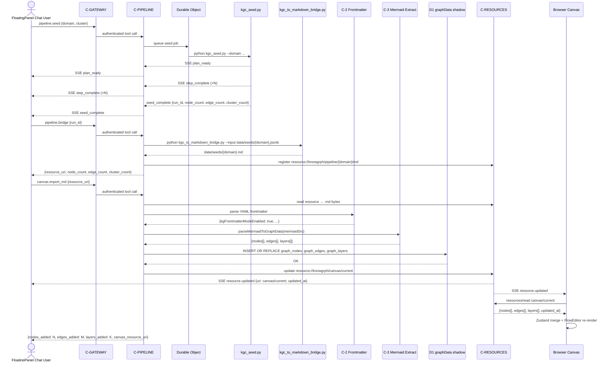
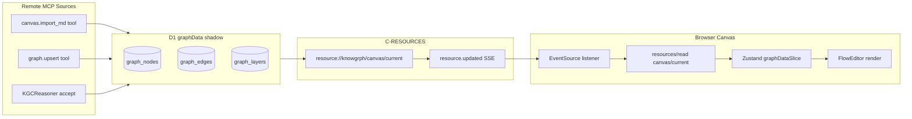

# Knowgrph MCP Service — PRD & TAD (Proposed)

> **Document type**: Combined PRD + TAD | **Phase**: Proposed (pre-implementation) | **Version**: 0.3.1  
> **v0.3.1 scope**: Seamless E2E — MainPanel MCP **AND** MainPanel Integrations → FloatingPanel Chat UI → LLM output → Markdown YAML Frontmatter → Canvas nodes / subgraphs / groups / clusters / edges — integrated as first-class MCP tool surface.

---

## Table of Contents

1. [Phase 0 — Problem Discovery](#phase-0--problem-discovery)
2. [PRD — Product Requirements](#prd--product-requirements)
   - [Problem Statement](#problem-statement)
   - [Personas](#personas)
   - [User Journeys](#user-journeys)
   - [Epics & User Stories](#epics--user-stories)
   - [Acceptance Criteria](#acceptance-criteria)
   - [MoSCoW Prioritization](#moscow-prioritization)
   - [Success Metrics](#success-metrics)
   - [Scope Boundaries](#scope-boundaries)
   - [Dependencies](#dependencies)
   - [Open Questions](#open-questions)
3. [TAD — Technical Architecture](#tad--technical-architecture)
   - [Architecture Overview](#architecture-overview)
   - [Journey → System Mapping](#journey--system-mapping)
   - [Workflows](#workflows)
   - [Data Flows](#data-flows)
   - [Component Specifications](#component-specifications)
   - [Integration Contracts](#integration-contracts)
   - [Architectural Decisions (ADRs)](#architectural-decisions-adrs)
   - [Quality Attributes](#quality-attributes)
   - [Deployment Strategy](#deployment-strategy)
   - [Architecture Diagrams](#architecture-diagrams)
   - [Component Inventory](#component-inventory)
4. [PRD ↔ TAD Traceability](#prd--tad-traceability)
5. [Validation Checklist](#validation-checklist)

---

## Phase 0 — Problem Discovery

### Problem Hypothesis

> **Falsifiable**: The current Knowgrph MCP server (`mcp/server.js`) is limited to stdio transport and local-only access, preventing external AI agents, remote orchestrators, and multi-tenant pipelines from invoking the harness or querying the knowledge graph — measurable by the inability of any non-local MCP client to call `knowgrph.superagent.run` without direct filesystem access. Furthermore, the MCP service has no tools that trigger or observe the E2E canvas pipeline (seed → bridge → Markdown YAML frontmatter → Mermaid extract → canvas nodes/subgraphs/clusters/edges), so remote agents cannot drive or verify graph materialisation via MCP.

### Problem Impact Quantification

| Pain Point | Observable Symptom | Impact |
|---|---|---|
| stdio-only transport | Remote agents cannot call harness | Blocks airvio agent pipeline composition |
| No remote auth | No multi-tenant gating | Blocks SaaS and shared-workspace scenarios |
| Single tool exposure | Only `superagent.run`; no graph query/write | Agents must run full harness to read one node |
| Full-blob responses | `canvas.graph.json` returned whole on each call | ~8k–40k token overhead per query |
| No MCP Resources | Workspace docs not addressable by URI | Tool-use token budget wasted on artifact fetch |
| No monetisation path | No checkout flow; no revenue mechanism | Blocks agentic commerce revenue |
| No pipeline tools <!-- v0.3 --> | MCP has no tools for seed → bridge → canvas import → node query | Remote agents cannot drive or observe the E2E Markdown → canvas pipeline; canvas state invisible to MCP clients |
| No canvas resource <!-- v0.3 --> | `graphDataSlice` state (nodes/edges/layers) not addressable as MCP Resource | Agents must call tools repeatedly to check canvas state; no subscription to graph changes |

### Stakeholder Alignment

| Role | Concern | Aligned Scope |
|---|---|---|
| Solo founder (airvio) | Zero TCO, FOSS-first, Cloudflare-native | CF Workers + MIT SDK + Oracle Free PocketBase |
| AI Agent (Claude Code / DeerFlow) | Stable tool contracts, low token cost, pipeline observability | Pruned schemas, delta responses, pipeline tools |
| KGC Pipeline (Hackamap / Singapoly) | Graph read/write without full harness run | `graph.query` + `graph.upsert` tools |
| FloatingPanel Chat User <!-- v0.3 --> | Drive canvas graph population from chat without leaving MCP host | `pipeline.seed` + `canvas.import_md` tools; canvas resource subscription |
| Paying Customer | Purchase harness credits inside MCP host | Stripe Checkout via `products.buy` tool |

**Gate**: Problem validated and scoped. Proceed to PRD authoring.

---

## PRD — Product Requirements

### Problem Statement

AI agents building on the Knowgrph Knowledge Graph Canvas cannot access the harness or graph data remotely because the MCP server is stdio-only, path-restricted, and exposes a single tool. Beyond remote access, even a fully deployed MCP service leaves a critical gap: no MCP tool exists to trigger the E2E pipeline that converts LLM output → Markdown YAML frontmatter → canvas nodes/subgraphs/groups/clusters/edges. This means remote agents, CI pipelines, and FloatingPanel Chat users cannot drive or observe graph materialisation via MCP. The opportunity is to expose Knowgrph as a first-class, remotely accessible MCP service with typed graph tooling, E2E pipeline tools, streaming responses, canvas resource subscriptions, and zero-TCO hosting.

---

### Personas

**Persona A — Autonomous AI Agent**: Invoke harness runs, query graph state, and write enriched nodes without human mediation. Context: Claude Code, DeerFlow, or a custom LangGraph node in CI or agentic loop. Pain: Local stdio only; responses carry full canvas blobs; pipeline not observable via MCP.

**Persona B — airvio Builder (Joohwee)**: Compose multi-project pipelines through a single MCP endpoint. Context: Solo founder; zero-TCO; Cloudflare stack. Pain: No remote instance; no namespace isolation; no pipeline tools.

**Persona C — Downstream LLM Orchestrator**: Fetch workspace documents and graph artifacts as named resources. Context: Any MCP client supporting Resources protocol. Pain: No MCP Resources registered; artifacts reachable only via tool calls.

**Persona D — Paying Customer (MCP Host User)**: Browse Knowgrph service tiers and complete purchase without leaving MCP host. Context: Developer/researcher using a Knowgrph-connected MCP host. Pain: No in-chat purchasing path; high drop-off via external website.

**Persona E — FloatingPanel Chat / MainPanel MCP User** <!-- v0.3 -->: Drive the full E2E graph pipeline — seed a domain, bridge JSONB to Markdown, import into canvas, view live nodes/subgraphs/clusters — using MCP tools from within a FloatingPanel Chat session or a MainPanel MCP-connected surface (Claude.ai, VS Code MCP panel). Context: Solo founder or knowledge worker with a Knowgrph MCP server connected to their LLM host. Pain: No MCP tool to trigger the pipeline or observe canvas state; must run Python scripts manually and inspect files to verify graph materialisation.

---

### User Journeys

#### Journey A: Autonomous AI Agent — Run harness and read result

| Stage | Action | Touchpoint | Pain Point | Opportunity |
|---|---|---|---|---|
| Trigger | Agent receives goal brief | LLM tool-use context | No remote MCP endpoint | HTTP+SSE on CF Workers |
| Discover | Agent lists tools | MCP `tools/list` | Only one tool | Pruned schema; rich tool set |
| Engage | Agent calls `superagent.run` | MCP tool call | Full blob response | Streaming SSE progress events |
| Complete | Agent reads result artifact | MCP resource fetch | No resource URIs | `resource://knowgrph/{run-id}/…` |
| Return | Agent polls checkpoint | `harness.checkpoint` tool | No checkpoint tool | Checkpoint read tool |

#### Journey B: airvio Builder — Configure multi-project MCP endpoint

| Stage | Action | Touchpoint | Pain Point | Opportunity |
|---|---|---|---|---|
| Trigger | New project needs graph access | CF Workers dashboard | No deploy path | `wrangler deploy` one-command |
| Discover | Builder checks auth | PocketBase admin | No auth layer | OAuth 2.1 PKCE via PocketBase |
| Engage | Builder registers namespace | MCP env config | No isolation | `KNOWGRPH_NAMESPACE` env var |
| Complete | Builder verifies contracts | MCP inspector | Schemas undocumented | Typed JSON Schema per tool |
| Return | Builder updates harness | GitHub push → CF deploy | Manual redeploy | GitHub Actions → wrangler |

#### Journey C: Downstream Orchestrator — Fetch workspace artifact as resource

| Stage | Action | Touchpoint | Pain Point | Opportunity |
|---|---|---|---|---|
| Trigger | Orchestrator needs canvas state | MCP client | No resource URIs | Resources protocol enabled |
| Discover | Lists resources | `resources/list` | Empty list | Workspace docs registered |
| Engage | Fetches artifact | `resources/read` | Full tool call overhead | Direct resource read |
| Complete | Parses JSONB graph | Resource content | Schema undocumented | Typed JSONB response |
| Return | Re-fetches on diff | Resource subscription | No change notification | `resource.updated` via SSE |

#### Journey D: Paying Customer — Purchase harness credits inside MCP host

| Stage | Action | Touchpoint | Pain Point | Opportunity |
|---|---|---|---|---|
| Trigger | Agent hits run-budget limit | MCP tool response | No upgrade path in-chat | `products.list` triggers product widget |
| Discover | Views plans in MCP host | `list-products` UI widget | External website required | In-chat product card |
| Engage | Selects plan; clicks Buy | Widget → `products.buy` tool | Manual copy-paste URL | Checkout Session URL returned |
| Complete | Completes Stripe Checkout | Stripe-hosted page | Separate tab | Webhook → credit grant → confirmation |
| Return | Continues with unlocked quota | MCP tool call | Drop-off | `resource://knowgrph/account/credits` updated |

#### Journey E: FloatingPanel Chat / MainPanel MCP User — Drive E2E pipeline from chat <!-- v0.3 -->

| Stage | Action | Touchpoint | Pain Point | Opportunity |
|---|---|---|---|---|
| Trigger | User types "map the SEA AI regulation landscape" in chat; MCP server connected | FloatingPanel Chat UI / MainPanel MCP | No pipeline tool; must run Python manually | `knowgrph.pipeline.seed` triggers KGCSeedPipeline remotely |
| Seed | MCP tool call fires `pipeline.seed`; harness streams progress via SSE | MCP tool SSE stream in chat | Harness is local-only; silent to remote agents | SSE events surface `plan_ready`, `step_complete`, `seed_complete` in chat |
| Bridge | User (or agent) calls `pipeline.bridge` with `run_id` | `pipeline.bridge` MCP tool | JSONB not consumable by canvas; bridge is local script | Bridge runs server-side; returns `resource://knowgrph/pipeline/{domain}/md` URI |
| Import | Agent calls `canvas.import_md` with bridge resource URI | `canvas.import_md` MCP tool | No MCP import path; canvas is a browser app | Tool triggers C-2 frontmatter parse + C-3 Mermaid extract + C-4 graphDataSlice update |
| Verify | Agent calls `canvas.nodes` or reads `resource://knowgrph/canvas/current` | MCP resource or tool call | Canvas state invisible to remote agents | `{nodes, edges, layers}` snapshot returned; agent verifies `nodes≥10, layers≥1` |
| Enrich | Agent activates Reasoner via `superagent.run` scoped to accepted node | MCP tool call | Reasoner not MCP-addressable | `knowgrph.superagent.run` with `{mode: reasoner, node_ids: [...]}` param |
| Return | Agent subscribes to `resource://knowgrph/canvas/current` for graph updates | MCP resource subscription | No update notification | `resource.updated` SSE fires on every `graphDataSlice` mutation |

---

### Epics & User Stories

#### Epic MCP-1: Remote Transport

**PRD-MCP1-S1**: As an autonomous AI agent, I want to call `knowgrph.superagent.run` over HTTP+SSE so that I can invoke the harness from a remote process without filesystem access.

**PRD-MCP1-S2**: As an airvio builder, I want to deploy the MCP server to Cloudflare Workers with a single command so that I have a zero-TCO remote endpoint without managing server infrastructure.

**PRD-MCP1-S3**: As an AI agent, I want to authenticate with the MCP server via OAuth 2.1 PKCE so that only authorized clients invoke the harness.

#### Epic MCP-2: Token-Efficient Tool Surface

**PRD-MCP2-S1**: As an AI agent, I want tool schemas to be minimal and pruned so that tool-use token overhead is reduced per call.

**PRD-MCP2-S2**: As an AI agent, I want harness run progress delivered as streaming SSE events so that I receive incremental signal without waiting for the full run to complete.

**PRD-MCP2-S3**: As an AI agent, I want a `knowgrph.canvas.diff` tool that returns only changed nodes and edges so that I can track graph state changes without fetching the full canvas.

#### Epic MCP-3: Graph Tool Surface

**PRD-MCP3-S1**: As an autonomous AI agent, I want a `knowgrph.graph.query` tool so that I can retrieve a subgraph matching a sigil pattern or JSONB filter without running the full harness.

**PRD-MCP3-S2**: As a KGC pipeline, I want a `knowgrph.graph.upsert` tool so that I can write nodes and edges with schema validation directly via MCP.

**PRD-MCP3-S3**: As an autonomous AI agent, I want a `knowgrph.harness.checkpoint` tool so that I can read the current run's `state.json` and `trace.jsonl` mid-flight.

#### Epic MCP-4: MCP Resources & Sampling

**PRD-MCP4-S1**: As a downstream orchestrator, I want workspace documents registered as MCP Resources so that I can fetch them without a tool call.

**PRD-MCP4-S2**: As an AI agent orchestrator, I want MCP Sampling callbacks enabled so that the harness can request LLM completions during graph synthesis without a hardcoded provider key.

#### Epic MCP-5: Stripe MCP Monetization

**PRD-MCP5-S1**: As a paying customer in an MCP host, I want to browse available Knowgrph service plans via an in-chat product list widget so that I can evaluate tiers without leaving the chat interface.

**PRD-MCP5-S2**: As a paying customer, I want to initiate a Stripe Checkout for a selected plan from within my MCP host so that I can complete payment on a secure Stripe-hosted page and return to the chat with my quota unlocked.

**PRD-MCP5-S3**: As an airvio builder, I want successful Stripe payments to automatically grant harness run credits to the authenticated user via webhook so that quota is updated without manual intervention.

#### Epic MCP-6: E2E Pipeline Integration via MCP <!-- v0.3 -->

**PRD-MCP6-S1**: As a FloatingPanel Chat user with an MCP server connected, I want to call `knowgrph.pipeline.seed` with a domain query so that the KGC Seeder runs server-side and I receive SSE progress events without leaving my chat interface or running Python scripts manually.

**PRD-MCP6-S2**: As an AI agent, I want to call `knowgrph.pipeline.bridge` with a completed `run_id` so that the KGCtoMarkdownBridge converts `data/seeds/{domain}.jsonb` to a Knowgrph-compatible Markdown document and registers it as a MCP Resource, without me having to invoke a local script.

**PRD-MCP6-S3**: As a FloatingPanel Chat user, I want to call `knowgrph.canvas.import_md` with a bridge resource URI (or inline Markdown text) so that the canvas activates Frontmatter Mode, the Mermaid AST extractor runs, and `graphDataSlice` is populated with nodes, edges, and cluster layers — all via a single MCP tool call.

**PRD-MCP6-S4**: As an AI agent or MCP resource subscriber, I want `resource://knowgrph/canvas/current` to expose the live `graphDataSlice` state (nodes, edges, layers) as a typed JSONB MCP Resource, with `resource.updated` SSE events firing on every mutation, so that I can observe and verify canvas state without polling tool calls.

---

### Acceptance Criteria

#### PRD-MCP1-S1 — Remote HTTP+SSE harness invocation

**Given** an MCP client with a valid OAuth token and the CF Workers endpoint URL,  
**When** it sends `tools/call` with tool name `knowgrph.superagent.run` and a valid input payload,  
**Then** the server returns HTTP 200 with `Content-Type: text/event-stream`, emits at least one `state_update` event before `complete`, and the final event contains `artifacts` with `harness-proof.json` present.

#### PRD-MCP1-S2 — CF Workers one-command deploy

**Given** `wrangler.toml` is configured with `KNOWGRPH_ROOT` and `KNOWGRPH_PYTHON` bindings,  
**When** the builder runs `wrangler deploy`,  
**Then** the MCP server is live at `https://knowgrph-mcp.<account>.workers.dev` within 30 seconds with `tools/list` returning all registered tools.

#### PRD-MCP1-S3 — OAuth 2.1 PKCE auth

**Given** a client presents an expired or absent Bearer token,  
**When** it calls any MCP endpoint,  
**Then** the server returns HTTP 401 with `WWW-Authenticate: Bearer` and the client cannot invoke any tool or read any resource.

#### PRD-MCP2-S1 — Pruned tool schemas

**Given** the server starts and a client calls `tools/list`,  
**When** the response is parsed,  
**Then** no tool description exceeds 20 words, no tool schema contains an `examples` array, and the total schema token count is ≤ 800 tokens (measured by `cl100k_base` tokenizer).

#### PRD-MCP2-S2 — Streaming SSE progress

**Given** a client calls `knowgrph.superagent.run` with a valid input,  
**When** the harness executes a run with ≥ 3 steps,  
**Then** the SSE stream emits distinct events for: `plan_ready`, at least one `step_complete`, `verification_done`, and `complete` — in that order — before the stream closes.

#### PRD-MCP2-S3 — Canvas diff tool

**Given** a client calls `knowgrph.canvas.diff` with a `run_id` and a `since_step` integer,  
**When** the run has at least one node change after `since_step`,  
**Then** the response contains only nodes/edges added or modified after `since_step`, as a JSONB delta, and the response token count is ≤ 10% of the full `canvas.graph.json` token count for that run.

#### PRD-MCP3-S1 — Graph query tool

**Given** a client calls `knowgrph.graph.query` with a valid `@node` sigil pattern,  
**When** matching nodes exist in the D1 graph store,  
**Then** the response contains a `nodes` array and an `edges` array typed to `kgc-computing-flow/v1`, with response time ≤ 500ms at p95.

#### PRD-MCP3-S2 — Graph upsert tool

**Given** a client calls `knowgrph.graph.upsert` with a nodes/edges payload conforming to `kgc-computing-flow/v1`,  
**When** the server processes the payload,  
**Then** all nodes and edges are persisted to CF D1 within one transaction, a `diff_id` is returned for subsequent diff queries, and invalid payloads are rejected with HTTP 422 and a field-level error message.

#### PRD-MCP3-S3 — Harness checkpoint tool

**Given** a run is in progress or completed with a valid `run_id`,  
**When** a client calls `knowgrph.harness.checkpoint` with that `run_id`,  
**Then** the response contains `state.json` content and the last 50 lines of `trace.jsonl`, serialized as JSON, within 200ms.

#### PRD-MCP4-S1 — MCP Resources

**Given** a run completes with artifacts in `data/outputs/{run-id}/`,  
**When** a client calls `resources/list`,  
**Then** the response includes resource URIs for `rich-media-flow.md`, `canvas.graph.json`, `harness-proof.json`, and `final-report.md` scoped to that run, with correct MIME types.

#### PRD-MCP4-S2 — MCP Sampling callback

**Given** the harness is configured with `SAMPLING_ENABLED=true`,  
**When** the harness requires an LLM completion during graph synthesis,  
**Then** it issues a `sampling/createMessage` request to the connected MCP client and the response is incorporated into the synthesis step.

#### PRD-MCP5-S1 — In-chat product list widget

**Given** an authenticated MCP client calls `tools/call` with `knowgrph.products.list`,  
**When** the MCP host supports `@modelcontextprotocol/ext-apps` UI resources,  
**Then** the host renders the `ui://knowgrph-products.html` widget with ≥ 2 plans (name, price, quota), each with a "Buy" action; and `structuredContent` contains a `products` array with `priceId`, `name`, `amount`, `currency` per item.

#### PRD-MCP5-S2 — Stripe Checkout redirect from MCP host

**Given** a paying customer selects a plan and triggers buy,  
**When** the widget calls `knowgrph.products.buy` with the selected `priceId`,  
**Then** the server creates a Stripe Checkout Session in `payment` mode with a valid `success_url`, returns the session URL in both `text` content (Markdown link) and `structuredContent.checkoutSessionUrl`, and the MCP host opens the URL in a new browser tab within 2 seconds; the Checkout page is PCI-compliant (Stripe-hosted).

#### PRD-MCP5-S3 — Webhook-driven credit grant

**Given** a customer completes payment on the Stripe Checkout page,  
**When** Stripe delivers `checkout.session.completed` to `/stripe/webhook`,  
**Then** the server validates the webhook signature, verifies `payment_status === "paid"`, increments the user's harness run credits in D1 by the purchased amount, returns HTTP 200 within 5 seconds, and `resource://knowgrph/account/credits` reflects the updated balance on next read.

#### PRD-MCP6-S1 — Pipeline seed tool <!-- v0.3 -->

**Given** an authenticated MCP client calls `knowgrph.pipeline.seed` with `{domain: str, cluster: str, max_sources?: int}`,  
**When** the KGCSeedPipeline (`kgc_seed.py`) completes,  
**Then** the SSE stream emits `plan_ready`, ≥1 `step_complete`, and `seed_complete` events in order; the final event contains `{run_id, node_count, edge_count, cluster_count}` with `node_count ≥ 10`, `edge_count ≥ 5`, `cluster_count ≥ 1`; and `data/seeds/{domain}.jsonb` is written and passes `validate_kgc_schema.py` with exit 0.

> **`/goal` translation**: `grep seed_complete data/sessions/{session_id}_trace.json exits 0; node_count ≥ 10 confirmed in event payload; python scripts/validate_kgc_schema.py data/seeds/{domain}.jsonb exits 0`

#### PRD-MCP6-S2 — Pipeline bridge tool <!-- v0.3 -->

**Given** a client calls `knowgrph.pipeline.bridge` with `{run_id: str}` for a completed seed run,  
**When** C-6 KGCtoMarkdownBridge completes,  
**Then** the tool response contains `{resource_uri: "resource://knowgrph/pipeline/{domain}/md", node_count, edge_count, cluster_count}`; the resource is readable via `resources/read`; and `python scripts/validate_md_bridge_output.py data/seeds/{domain}.md` exits 0 with PASS on all three checks.

> **`/goal` translation**: `resources/read resource://knowgrph/pipeline/{domain}/md returns 200 with text/markdown content; python scripts/validate_md_bridge_output.py exits 0 with PASS frontmatter, PASS node_mapping, PASS cluster_mapping`

#### PRD-MCP6-S3 — Canvas import_md tool <!-- v0.3 -->

**Given** a client calls `knowgrph.canvas.import_md` with either `{resource_uri: str}` or `{markdown_text: str}`,  
**When** the server processes the import (C-2 frontmatter parse → C-3 Mermaid AST extract → C-4 `graphDataSlice` update),  
**Then** the tool response contains `{nodes_added: N, edges_added: M, layers_added: K}` where N ≥ 10, M ≥ 5, K ≥ 1 for a standard seed-derived document; `kgFrontmatterModeEnabled=true` is confirmed in canvas Zustand store; and `resource://knowgrph/canvas/current` is updated within 2 seconds.

> **`/goal` translation**: `tool response nodes_added ≥ 10, edges_added ≥ 5, layers_added ≥ 1; resources/read resource://knowgrph/canvas/current returns updated graphData with matching counts; npm run superagent:e2e-test exits 0`

#### PRD-MCP6-S4 — Canvas current resource <!-- v0.3 -->

**Given** the canvas `graphDataSlice` has been updated (by any means: `canvas.import_md`, `graph.upsert`, Reasoner accept, or Simulator commit),  
**When** a client calls `resources/read resource://knowgrph/canvas/current`,  
**Then** the response contains a typed JSONB object `{nodes: GraphNode[], edges: GraphEdge[], layers: GraphLayer[], updated_at: ISO8601}` reflecting the current `graphDataSlice` state; and when the canvas state changes, a `resource.updated` SSE event fires with the new `updated_at` timestamp within 500ms.

> **`/goal` translation**: `resources/read returns valid JSON with nodes, edges, layers arrays; after canvas.import_md, resource.updated SSE event arrives within 500ms; updated_at is newer than pre-import timestamp`

---

### MoSCoW Prioritization

| Story | Priority | Rationale |
|---|---|---|
| PRD-MCP1-S1 — HTTP+SSE transport | **Must** | Unlocks all remote agent access; prerequisite for all other epics |
| PRD-MCP1-S2 — CF Workers deploy | **Must** | Zero-TCO constraint; no alternative identified |
| PRD-MCP1-S3 — OAuth 2.1 PKCE | **Must** | MCP spec mandates for remote servers; multi-tenant safety |
| PRD-MCP2-S1 — Pruned schemas | **Must** | Immediate savings; zero architecture change |
| PRD-MCP2-S2 — Streaming SSE | **Should** | Significant UX for long runs; not blocking for correctness |
| PRD-MCP2-S3 — Canvas diff tool | **Should** | High ROI for KGC loops; requires D1 step-indexed storage |
| PRD-MCP3-S1 — Graph query tool | **Should** | Core to KGC pipeline agents; needs D1 GIN-equivalent |
| PRD-MCP3-S2 — Graph upsert tool | **Should** | Enables HuggingFace → KGC seeding via MCP |
| PRD-MCP3-S3 — Harness checkpoint | **Could** | Useful for long runs; lower priority than query/upsert |
| PRD-MCP4-S1 — MCP Resources | **Could** | Reduces token overhead; spec support varies by client |
| PRD-MCP4-S2 — MCP Sampling | **Won't** (v0.1) | Complex client-side dependency; deferred |
| PRD-MCP5-S1 — Product list widget | **Should** | Revenue enabler; depends on MCP-1 |
| PRD-MCP5-S2 — Stripe Checkout | **Should** | Core monetisation flow |
| PRD-MCP5-S3 — Webhook credit grant | **Must** (for MCP-5) | Without it, payments do not unlock quota |
| PRD-MCP6-S1 — Pipeline seed tool | **Must** (for MCP-6) | Without it, remote agents cannot trigger graph population |
| PRD-MCP6-S2 — Pipeline bridge tool | **Must** (for MCP-6) | JSONB → Markdown bridge is the E2E linchpin |
| PRD-MCP6-S3 — Canvas import_md tool | **Must** (for MCP-6) | Without it, remote agents cannot materialise nodes on canvas |
| PRD-MCP6-S4 — Canvas current resource | **Should** (for MCP-6) | Enables agent verification and subscription; not day-1 blocking |

---

### Success Metrics

| Metric | Baseline | Target | Timeline |
|---|---|---|---|
| Remote tool call success rate | 0% | ≥ 99% over 7-day window | 4 weeks post-deploy |
| Tool schema token overhead per `tools/list` | Unmeasured | ≤ 800 tokens (`cl100k_base`) | At launch |
| Graph query p95 latency | N/A | ≤ 500ms via CF Workers | 4 weeks post-deploy |
| Canvas diff response vs full canvas | N/A | ≤ 10% token ratio | 6 weeks post-deploy |
| CF Workers monthly cost | $0 | $0 (within free tier: 100k req/day) | Ongoing |
| MCP Resources per completed run | 0 | ≥ 4 per run | 8 weeks post-deploy |
| E2E pipeline via MCP (seed → canvas nodes) first-attempt success | 0% | ≥ 85% | 6 weeks post-deploy |
| `canvas.import_md` → canvas nodes visible latency | N/A | ≤ 5 seconds (Markdown contract path) | 6 weeks post-deploy |
| `pipeline.seed` → canvas nodes visible latency | N/A | ≤ 90 seconds wall-clock | 6 weeks post-deploy |
| `resource.updated` SSE latency after canvas mutation | N/A | ≤ 500ms | 8 weeks post-deploy |

---

### Scope Boundaries

**In scope (v0.3.0)**:
All v0.1.0 and v0.2.0 scope items plus:
- `knowgrph.pipeline.seed` MCP tool (wraps TAD-C01 KGCSeedPipeline)
- `knowgrph.pipeline.bridge` MCP tool (wraps C-6 KGCtoMarkdownBridge)
- `knowgrph.canvas.import_md` MCP tool (triggers C-2/C-3/C-4 import pipeline)
- `knowgrph.canvas.nodes` MCP tool (returns `graphDataSlice` snapshot)
- `resource://knowgrph/canvas/current` MCP Resource (live GraphData JSONB)
- `resource://knowgrph/canvas/layers` MCP Resource (cluster layer metadata)
- `resource://knowgrph/pipeline/{domain}/md` MCP Resource (bridge output Markdown)
- `resource.updated` SSE events for canvas mutations
- C-PIPELINE component in `cloudflare/workers/kgc-pipeline-mcp.ts`
- MainPanel MCP surface tool registration (tools appear in MainPanel Integrations panel)

**Out of scope (v0.3.0)**:
- MCP Sampling callback (deferred to v0.4)
- Multi-region CF Workers deployment
- Real-time collaborative graph editing over MCP
- Any GUI or dashboard for MCP management
- Provider-specific API key management in server
- Streaming bridge output to canvas during seed run (Phase 2+)
- Export from `graphDataSlice` back to Mermaid syntax
- Multi-document graph merge via MCP

---

### Dependencies

| Dependency | Type | Status |
|---|---|---|
| `@modelcontextprotocol/sdk` ≥ 1.x | NPM (MIT) | Available |
| `workers-mcp` (Cloudflare) | NPM (MIT) | Available |
| Cloudflare Workers free tier | Infrastructure | Existing (airvio) |
| Cloudflare D1 (graph store) | Infrastructure | Existing in stack |
| Cloudflare R2 (artifact store) | Infrastructure | Existing in stack |
| PocketBase on Oracle Always Free | Auth / DB | Existing in stack |
| `knowgrph_parser/superagent_harness.py` | Internal | Stable (harness v0.x) |
| `kgc-computing-flow/v1` schema | Internal spec | Baselined |
| `stripe` npm package (MIT) | NPM | Available |
| `scripts/kgc_seed.py` (TAD-C01) | Internal | Proposed (EPIC-01) |
| `scripts/kgc_to_markdown_bridge.py` (C-6) | Internal | Proposed (PRD-E4) |
| `scripts/validate_md_bridge_output.py` | Internal | Proposed (PRD-E4) |
| `scripts/validate_kgc_schema.py` | Internal | Proposed (EPIC-01) |
| C-2 Frontmatter parser | Canvas internal | Existing (verify) |
| C-3 `parseMermaidToGraphData()` | Canvas internal | Proposed (PRD-E2) |
| C-4 `graphDataSlice` + FlowEditor | Canvas internal | Existing (extend) |
| C-7 FloatingPanelChatOrchestrator | Canvas internal | Proposed (PRD-E4) |
| `knowgrph-storage` Worker read surface | Internal edge dependency | Existing in stack |

---

### Open Questions

| ID | Question | Owner | Status |
|---|---|---|---|
| OQ-1 | Does CF Workers support Python subprocess spawning for `superagent_harness.py`? Durable Objects + Queue pattern needed? | Architect | Open |
| OQ-2 | OAuth tokens: PocketBase directly or proxied through CF Access? | Builder | Open |
| OQ-3 | D1 query plan for `kgc-computing-flow/v1` JSONB pattern matching; GIN-equivalent index for `@node` sigil lookups? | Architect | Open |
| OQ-4 | `canvas.diff` step snapshots: D1 or derived on-the-fly from `trace.jsonl`? | Architect | Open |
| OQ-5 | Which MCP clients in the airvio stack implement `sampling/createMessage`? | Builder | Open |
| OQ-6 | Does `canvas.import_md` run the C-2/C-3/C-4 pipeline server-side (CF Worker) or does it dispatch to the browser canvas via a push event? If server-side, `graphDataSlice` must have a server-side shadow store (D1). | Architect | Open |
| OQ-7 | `resource://knowgrph/canvas/current` state source: is it the D1 graph store (server-side truth) or the in-browser `graphDataSlice` Zustand store? They may diverge when Reasoner accepts are not yet synced. | Architect | Open |
| OQ-8 | Should `pipeline.seed` stream SSE directly to the MCP client, or return a `run_id` synchronously and let the client poll/subscribe via `resource.updated`? Streaming is lower latency; polling is simpler. | Architect | Open |
| OQ-9 | `canvas.import_md` with `{markdown_text: str}`: what is the max token budget before the tool call hits MCP message size limits? Should large documents be pre-staged as R2 objects and passed as `resource_uri`? | Architect | Open |

---

## TAD — Technical Architecture

### Architecture Overview

**From remote MCP call to interactive canvas graph**: MCP Client → CF Workers HTTP+SSE Gateway → OAuth Middleware → Tool Router → [Pipeline Tools (C-PIPELINE) | Harness Executor (C-EXECUTOR) | Graph Store (C-GRAPH) | Artifact Store (C-ARTIFACT) | Resource Registry (C-RESOURCES) | Stripe Checkout (C-STRIPE)] → Streaming SSE response → MCP Client. For the E2E pipeline path specifically: `pipeline.seed` → KGCSeedPipeline → JSONB → `pipeline.bridge` → C-6 KGCtoMarkdownBridge → Markdown Resource → `canvas.import_md` → C-2/C-3/C-4 → `graphDataSlice` → `canvas/current` Resource → `resource.updated` SSE.

All components adhere to zero-egress-cost and FOSS constraints. The Python harness is invoked via CF Durable Objects queue pattern (ADR-2). Existing Knowgrph agent-ready Pages routes already proved that server-side published-doc reads must target `https://knowgrph-storage.huijoohwee.workers.dev` rather than self-fetching through the custom-domain `airvio.co/api/storage/*` route; any future MCP-side server fetch of published Source Files or shared-doc markdown must reuse that same upstream boundary.

---

### Journey → System Mapping

| Journey Stage | Workflow | Data Flow | Component |
|---|---|---|---|
| Agent discovers tools | WF-1: Tool Discovery | DF-1: MCP Handshake | C-GATEWAY, C-ROUTER |
| Agent calls `superagent.run` | WF-2: Harness Execution | DF-2: Harness Run | C-EXECUTOR, C-ARTIFACT |
| Agent fetches canvas diff | WF-3: Graph Delta Query | DF-3: Graph Delta | C-GRAPH, C-D1 |
| Agent upserts nodes | WF-4: Graph Upsert | DF-4: Graph Write | C-GRAPH, C-D1 |
| Orchestrator fetches resource | WF-5: Resource Fetch | DF-5: Resource Read | C-RESOURCES, C-R2 |
| Auth challenge | WF-6: OAuth PKCE | DF-6: Token Validation | C-AUTH, C-POCKETBASE |
| Customer purchases plan | WF-7: Stripe Checkout | DF-7: Payment Processing | C-STRIPE, C-D1 |
| Chat user drives E2E pipeline | WF-8: E2E Pipeline via MCP | DF-8: Pipeline → Canvas | C-PIPELINE, C-RESOURCES |

---

### Workflows

#### WF-1: Tool Discovery

**Trigger**: MCP client connects and sends `initialize` + `tools/list`.  
**Actors**: MCP Client, C-GATEWAY, C-ROUTER.

**Happy Path**:
1. Client sends HTTP POST `initialize` → C-GATEWAY validates Bearer token via C-AUTH.
2. C-GATEWAY forwards to C-ROUTER → C-ROUTER returns pruned tool schema list.
3. Client receives `tools/list` with ≤ 800 total schema tokens.

**Alternate Paths**: Client reconnects mid-session → C-GATEWAY re-validates token; session state restored from D1.

**Error Paths**:
- Invalid/expired token → C-AUTH returns 401 with `WWW-Authenticate: Bearer`; client redirected to OAuth PKCE flow.
- C-ROUTER unavailable → C-GATEWAY returns 503 with `Retry-After: 5`.

**Postconditions**: Client holds valid tool schema list; session established in C-GATEWAY.

---

#### WF-2: Harness Execution

**Trigger**: Client calls `tools/call` with `knowgrph.superagent.run`.  
**Actors**: MCP Client, C-GATEWAY, C-EXECUTOR, C-ARTIFACT, CF Durable Object Queue.

**Happy Path**:
1. Client sends tool call → C-GATEWAY validates auth; queues job to CF Durable Object.
2. C-EXECUTOR spawns `python3 -m knowgrph_parser superagent` in Durable Object worker.
3. Harness emits step events → C-EXECUTOR relays as SSE: `plan_ready`, `step_complete` (×N), `verification_done`.
4. Harness writes artifacts → C-ARTIFACT syncs to R2.
5. C-EXECUTOR emits `complete` with artifact URIs and `harness-proof.json` summary.
6. SSE stream closes; artifacts registered in C-RESOURCES.

**Alternate Paths**: `--stop-after-step N` → C-EXECUTOR checkpoints after step N; emits `checkpoint`; stream closes; run resumable via `harness.checkpoint` tool.

**Error Paths**:
- Harness step fails (retryable): C-EXECUTOR respects retry budget; emits `step_retry`.
- Exceeds wall-clock budget: emits `timeout`; partial `state.json` committed to R2.
- CF Durable Object eviction: run resumes from last `state.json` checkpoint.

**Postconditions**: Artifacts in R2; resources registered in C-RESOURCES; `harness-proof.json` in D1.

---

#### WF-3: Graph Delta Query

**Trigger**: Client calls `knowgrph.canvas.diff` with `run_id` and `since_step`.  
**Actors**: MCP Client, C-ROUTER, C-GRAPH, C-D1.

**Happy Path**:
1. C-ROUTER validates `run_id` exists in D1.
2. C-GRAPH queries D1 for nodes/edges with `step_index > since_step`.
3. C-GRAPH serializes delta as JSONB; returns in tool response.

**Alternate Paths**: `since_step = 0` → full canvas returned.

**Error Paths**: `run_id` not found → 404. D1 timeout → 503 with `Retry-After`.

**Postconditions**: Client holds typed JSONB delta; no full canvas transfer for partial queries.

---

#### WF-4: Graph Upsert

**Trigger**: Client calls `knowgrph.graph.upsert` with nodes/edges payload.  
**Actors**: MCP Client, C-ROUTER, C-GRAPH, C-D1.

**Happy Path**:
1. C-GRAPH validates payload against `kgc-computing-flow/v1` JSON Schema.
2. C-GRAPH executes D1 upsert transaction (INSERT OR REPLACE).
3. C-GRAPH increments `step_index`; returns `diff_id`.
4. `resource://knowgrph/canvas/current` update triggered; `resource.updated` SSE fired.

**Alternate Paths**: Nodes-only payload → only node rows upserted.

**Error Paths**:
- Schema validation failure → 422 with field-level error array; no partial writes.
- D1 transaction conflict → 409; client instructed to retry with exponential backoff.

**Postconditions**: All valid nodes/edges persisted; `diff_id` issued; D1 consistent; canvas resource updated.

---

#### WF-5: Resource Fetch

**Trigger**: Client calls `resources/read` with a `resource://knowgrph/{path}` URI.  
**Actors**: MCP Client, C-RESOURCES, C-R2.

**Happy Path**:
1. C-RESOURCES parses URI; validates path against allowlist.
2. For artifact resources: C-RESOURCES fetches from R2 with zero-egress read.
3. For `canvas/current`: C-RESOURCES reads from D1 graph store shadow; returns typed JSONB.
4. Content returned as resource `text` or `blob` per MIME type.

**Error Paths**:
- Artifact not yet written → 202 Accepted; client may poll or subscribe to `resource.updated`.
- Unauthorized resource ID → 403.

**Postconditions**: Artifact content delivered; no tool-use token overhead incurred.

---

#### WF-6: OAuth PKCE Flow

**Trigger**: Client lacks valid Bearer token; server issues 401.  
**Actors**: MCP Client, C-AUTH, C-POCKETBASE.

**Happy Path**:
1. Client generates `code_verifier`, `code_challenge`.
2. Client redirects to PocketBase `/oauth2/authorize` with `code_challenge`.
3. User authenticates; PocketBase issues authorization code.
4. Client exchanges for Bearer token; C-AUTH validates via `/oauth2/token/info`.

**Error Paths**: PocketBase unreachable → C-AUTH returns 503; endpoint unavailable until PocketBase restored.

**Postconditions**: Client holds valid Bearer token with configurable TTL.

---

#### WF-7: Stripe Checkout Flow

**Trigger**: Customer selects a plan in the in-chat product widget and triggers buy action.  
**Actors**: Paying Customer, MCP Client, C-STRIPE, Stripe API, C-D1.

**Happy Path**:
1. Widget calls `knowgrph.products.buy` with `{priceId}` → C-STRIPE creates Stripe Checkout Session.
2. Session URL returned in tool response; MCP host opens URL in new tab.
3. Customer completes payment on Stripe-hosted page.
4. Stripe delivers `checkout.session.completed` to `/stripe/webhook`.
5. C-STRIPE validates signature, verifies `payment_status === "paid"`, increments D1 credit balance.
6. C-RESOURCES updates `resource://knowgrph/account/credits`; fires `resource.updated`.

**Error Paths**:
- Stripe session creation fails → 503; no checkout URL returned.
- Webhook signature mismatch → 400; credits not granted.
- D1 credit increment fails → retry 3× with exponential backoff; alert logged.

**Postconditions**: User credit balance updated in D1; `account/credits` resource reflects new balance; no manual intervention required.

---

#### WF-8: E2E Pipeline via MCP <!-- v0.3 -->

**Trigger**: MCP client (FloatingPanel Chat user, autonomous agent, or CI) calls `knowgrph.pipeline.seed` with `{domain, cluster}`.  
**Actors**: MCP Client, C-PIPELINE, C-GATEWAY, TAD-C01 KGCSeedPipeline (subprocess), C-6 KGCtoMarkdownBridge (subprocess), C-RESOURCES, C-GRAPH, C-4 graphDataSlice shadow store.

**Happy Path**:
1. Client calls `pipeline.seed` → C-PIPELINE queues seed job to CF Durable Object worker.
2. Durable Object worker invokes `kgc_seed.py`; C-PIPELINE relays SSE: `plan_ready`, `step_complete` (×N), `seed_complete {run_id, node_count, edge_count, cluster_count}`.
3. Client calls `pipeline.bridge` with `{run_id}` → C-PIPELINE invokes `kgc_to_markdown_bridge.py`.
4. Bridge writes `data/seeds/{domain}.md`; C-PIPELINE validates via `validate_md_bridge_output.py`.
5. C-RESOURCES registers `resource://knowgrph/pipeline/{domain}/md`; C-PIPELINE returns `{resource_uri, node_count, edge_count, cluster_count}`.
6. Client calls `canvas.import_md` with `{resource_uri}` → C-PIPELINE reads `.md` from R2/file store; passes to canvas pipeline:
   - C-2: YAML frontmatter parse → canvas mode activation.
   - C-3: `parseMermaidToGraphData()` → `GraphNode[]`, `GraphEdge[]`, `layers[]`.
   - C-4 shadow store: `graphDataSlice` server-side shadow updated in D1.
7. C-PIPELINE returns `{nodes_added: N, edges_added: M, layers_added: K}`.
8. C-RESOURCES updates `resource://knowgrph/canvas/current`; fires `resource.updated` SSE.
9. Browser canvas subscribes to `resource.updated` → canvas FlowEditor re-renders with live nodes/edges/cluster layers.

**Alternate Paths**:
- Client provides `{markdown_text: str}` to `canvas.import_md` instead of `resource_uri` → C-PIPELINE writes text to temp R2 object; proceeds from step 6.
- Client skips `pipeline.seed` and calls `canvas.import_md` directly with a pre-composed Markdown document → steps 1–5 skipped; steps 6–9 execute normally.
- Agent verifies pipeline result via `canvas.nodes` tool instead of resource read → tool returns `graphDataSlice` snapshot synchronously.

**Error Paths**:
- `kgc_seed.py` exits non-zero → C-PIPELINE emits `seed_error` SSE event; no bridge invocation; run_id invalid.
- `validate_md_bridge_output.py` exits non-zero → C-PIPELINE returns 422 with failing check names; `.md` not registered as resource.
- C-3 `parseMermaidToGraphData()` throws `MermaidParseError` → C-PIPELINE returns 422; graphDataSlice unchanged; error logged to `trace.jsonl`.
- Node count > 100 in bridge output → C-PIPELINE returns 422 "graph_too_large"; suggests splitting domain.

**Postconditions**: `data/seeds/{domain}.jsonb` passes schema validation; `data/seeds/{domain}.md` passes bridge output validation; `graphDataSlice` (server-side shadow in D1) contains N nodes, M edges, K cluster layers; `resource://knowgrph/canvas/current` readable with updated data; `resource.updated` SSE fired; canvas FlowEditor shows interactive nodes.

---

### Data Flows

#### DF-1: MCP Handshake

| Stage | Component | Input | Output | Persistence | Error Handling |
|---|---|---|---|---|---|
| Connect | C-GATEWAY | HTTP POST `initialize` | Session object | D1 session record | 503 if C-GATEWAY cold-start |
| Auth | C-AUTH | Bearer token header | Token validation result | PocketBase record | 401 if invalid; redirect to PKCE |
| Schema | C-ROUTER | `tools/list` request | Pruned tool schema list | In-memory | 503 if C-ROUTER unavailable |

#### DF-2: Harness Run

| Stage | Component | Input | Output | Persistence | Error Handling |
|---|---|---|---|---|---|
| Queue | C-GATEWAY → Durable Object | Tool call payload | Job ID | D1 job record | 429 if quota exceeded |
| Execute | C-EXECUTOR | Job ID + payload | SSE event stream | R2 artifacts | `step_retry` on retryable failure |
| Artifact | C-ARTIFACT | Harness output files | R2 object writes | R2 | Skip non-critical artifacts on error |
| Register | C-RESOURCES | R2 URIs | MCP resource records | D1 resource registry | Log; do not fail tool call |

#### DF-3: Graph Delta

| Stage | Component | Input | Output | Persistence | Error Handling |
|---|---|---|---|---|---|
| Validate | C-ROUTER | `{run_id, since_step}` | Validated params | None | 404 if run_id not found |
| Query | C-GRAPH | D1 query | JSONB delta | D1 | 503 + Retry-After on timeout |
| Serialize | C-GRAPH | JSONB rows | Tool response | None | Truncate at 50k tokens; paginate |

#### DF-4: Graph Write

| Stage | Component | Input | Output | Persistence | Error Handling |
|---|---|---|---|---|---|
| Validate | C-GRAPH | Nodes/edges payload | Validation result | None | 422 + field errors on failure |
| Upsert | C-GRAPH → D1 | Validated records | `diff_id` | D1 | 409 on conflict; retry guidance |
| Notify | C-RESOURCES | `diff_id` | `resource.updated` SSE | None | Log; do not fail upsert |

#### DF-5: Resource Read

| Stage | Component | Input | Output | Persistence | Error Handling |
|---|---|---|---|---|---|
| Parse | C-RESOURCES | Resource URI | URI components | None | 400 on malformed URI |
| Authorize | C-AUTH | URI + Bearer token | Auth result | PocketBase | 403 on unauthorized |
| Fetch | C-RESOURCES → R2 / D1 | Object key | Raw bytes / JSONB | R2 / D1 | 202 if not yet written |
| Serve | C-RESOURCES | Raw bytes | Resource `text`/`blob` | None | 500 on MIME mismatch |

#### DF-6: Token Validation

| Stage | Component | Input | Output | Persistence | Error Handling |
|---|---|---|---|---|---|
| Receive | C-AUTH | Bearer token | Token string | None | — |
| Validate | C-AUTH → PocketBase | Token string | `{valid, user_id, scopes}` | PocketBase | 503 if PocketBase unreachable |
| Cache | C-AUTH | Validation result | TTL-keyed cache entry | In-memory (Worker) | Cache miss → re-validate |

#### DF-7: Payment Processing

| Stage | Component | Input | Output | Persistence | Error Handling |
|---|---|---|---|---|---|
| Create session | C-STRIPE → Stripe API | `{priceId, user_id, success_url}` | Checkout Session URL | Stripe | 503 on Stripe API failure |
| Webhook receive | C-STRIPE | `checkout.session.completed` | Validated event | None | 400 on signature mismatch |
| Credit grant | C-STRIPE → D1 | `{user_id, credits}` | Updated balance | D1 | Retry 3× on D1 failure |
| Resource update | C-RESOURCES | Updated balance | `resource.updated` SSE | None | Log on failure |

#### DF-8: E2E Pipeline via MCP <!-- v0.3 -->

| Stage | Component | Input Format | Output Format | Persistence | Error Handling |
|---|---|---|---|---|---|
| Seed trigger | C-PIPELINE → Durable Object | `{domain, cluster, max_sources?}` + Bearer token | SSE stream `{plan_ready, step_complete, seed_complete}` | `data/seeds/{domain}.jsonb`, run log | `seed_error` SSE on non-zero exit; no bridge invoked |
| Seed validate | `validate_kgc_schema.py` | JSONB file path | PASS / FAIL | None | FAIL → C-PIPELINE returns 422 |
| Bridge trigger | C-PIPELINE → subprocess | `{run_id}` → `data/seeds/{domain}.jsonb` | `data/seeds/{domain}.md` | `data/seeds/{domain}.md` | `validate_md_bridge_output.py` FAIL → 422 |
| Resource register | C-RESOURCES | `.md` file path | `resource://knowgrph/pipeline/{domain}/md` | D1 resource registry + R2 | Log on failure; do not fail tool call |
| Import trigger | C-PIPELINE → canvas pipeline | Resource URI or inline MD text | `{nodes_added, edges_added, layers_added}` | D1 graphData shadow | `MermaidParseError` → 422; graphDataSlice unchanged |
| Frontmatter parse | C-2 (server-side shadow) | UTF-8 Markdown | Canvas mode flags | D1 shadow | Missing keys → 422 |
| Mermaid extract | C-3 (server-side) | Mermaid source string | `GraphData {nodes, edges, layers}` | None | `MermaidParseError` → log + 422 |
| GraphData write | C-4 shadow → D1 | `GraphData` | D1 graphData rows | D1 graphData shadow | Merge conflict → `mergeLlmGraphData()` by id |
| Canvas resource update | C-RESOURCES | Updated D1 graphData | `resource://knowgrph/canvas/current` JSONB | D1 resource cache | `resource.updated` SSE within 500ms |
| Browser canvas sync | SSE → canvas FlowEditor | `resource.updated` event | FlowEditor re-render | In-browser Zustand | Browser offline → re-fetch on reconnect |

---

### Component Specifications

#### C-GATEWAY

**Responsibility**: HTTP+SSE ingress; session management; request routing to C-ROUTER; auth delegation to C-AUTH.

**File**: `cloudflare/workers/mcp-gateway.ts`

**Interfaces**:
- Input: HTTP POST (MCP JSON-RPC messages) or GET (SSE subscription)
- Output: HTTP 200 JSON-RPC response or `text/event-stream`
- Auth: delegates to C-AUTH; returns 401 on failure

**Configuration** (wrangler.toml bindings):
```
KNOWGRPH_NAMESPACE=default
POCKETBASE_URL=https://pb.airvio.co
KV_SESSION_STORE=KNOWGRPH_KV
D1_DB=KNOWGRPH_D1
```

**Status**: New.

---

#### C-ROUTER

**Responsibility**: Validates tool names; routes `tools/call` to correct handler; enforces pruned schema (≤ 800 total tokens).

**File**: `cloudflare/workers/mcp-router.ts`

**Registered tools** (v0.3.0):
```
knowgrph.superagent.run
knowgrph.harness.checkpoint
knowgrph.canvas.diff
knowgrph.graph.query
knowgrph.graph.upsert
knowgrph.products.list
knowgrph.products.buy
knowgrph.pipeline.seed       ← new v0.3
knowgrph.pipeline.bridge     ← new v0.3
knowgrph.canvas.import_md    ← new v0.3
knowgrph.canvas.nodes        ← new v0.3
```

**Schema pruning rule**: every tool `description` ≤ 20 words; no `examples` arrays; no `additionalProperties: true` unless explicitly needed.

**Status**: New (extend with v0.3 tools).

---

#### C-EXECUTOR

**Responsibility**: Spawns harness subprocess in CF Durable Object; manages SSE event relay; checkpoints `state.json` on interruption.

**File**: `cloudflare/workers/mcp-executor.ts` + Durable Object `KnowgrphHarnessDO`

**SSE events emitted**: `plan_ready`, `step_complete`, `step_retry`, `verification_done`, `checkpoint`, `timeout`, `complete`

**Status**: New.

---

#### C-GRAPH

**Responsibility**: `knowgrph.graph.query` and `knowgrph.graph.upsert` tool handlers; `kgc-computing-flow/v1` schema validation; D1 read/write.

**File**: `cloudflare/workers/mcp-graph.ts`

**`/goal` Conditions** (from PRD-MCP3):
- Query: p95 ≤ 500ms; response typed to `kgc-computing-flow/v1`.
- Upsert: one D1 transaction; `diff_id` returned; 422 on schema failure.

**Status**: New.

---

#### C-ARTIFACT

**Responsibility**: Syncs harness output files to R2; maintains R2 object manifest in D1.

**File**: `cloudflare/workers/mcp-artifact.ts`

**Status**: New.

---

#### C-RESOURCES

**Responsibility**: MCP Resources registry; serves `resources/list` and `resources/read`; fires `resource.updated` SSE on mutations; manages `canvas/current`, `canvas/layers`, `pipeline/{domain}/md`, run artifact, and account resources.

**File**: `cloudflare/workers/mcp-resources.ts`

**Registered resource URI patterns** (v0.3.0):
```
resource://knowgrph/{run-id}/rich-media-flow.md
resource://knowgrph/{run-id}/canvas.graph.json
resource://knowgrph/{run-id}/harness-proof.json
resource://knowgrph/{run-id}/final-report.md
resource://knowgrph/account/credits
resource://knowgrph/canvas/current          ← new v0.3
resource://knowgrph/canvas/layers           ← new v0.3
resource://knowgrph/pipeline/{domain}/md    ← new v0.3
```

**`resource.updated` trigger conditions**:
- `canvas/current` and `canvas/layers`: on every `graph.upsert`, `canvas.import_md`, or Reasoner accept write to D1 graphData shadow.
- `pipeline/{domain}/md`: on successful `pipeline.bridge` completion.
- `account/credits`: on successful `checkout.session.completed` webhook credit grant.

**Status**: New (extend with v0.3 resources).

---

#### C-AUTH

**Responsibility**: OAuth 2.1 PKCE middleware; Bearer token validation via PocketBase; token TTL caching in CF KV.

**File**: `cloudflare/workers/mcp-auth.ts`

**Status**: New.

---

#### C-POCKETBASE

**Responsibility**: Auth data store (user records, OAuth tokens, scopes); credit balance records (supplementary to D1).

**Deployment**: Oracle Always Free VM; PocketBase binary.

**Status**: Existing.

---

#### C-D1

**Responsibility**: Primary graph store; session records; job records; resource registry; `graphDataSlice` server-side shadow (v0.3); step-indexed node/edge rows for `canvas.diff`; user credit balances.

**Schema additions (v0.3)**:

```sql
-- graphData shadow store (new v0.3)
CREATE TABLE graph_nodes (
  id TEXT PRIMARY KEY,
  label TEXT NOT NULL,
  type TEXT NOT NULL,
  properties JSONB,
  cluster_id TEXT,
  step_index INTEGER NOT NULL DEFAULT 0,
  namespace TEXT NOT NULL DEFAULT 'default',
  updated_at TEXT NOT NULL
);

CREATE TABLE graph_edges (
  id TEXT PRIMARY KEY,
  source TEXT NOT NULL,
  target TEXT NOT NULL,
  label TEXT,
  type TEXT,
  properties JSONB,
  step_index INTEGER NOT NULL DEFAULT 0,
  namespace TEXT NOT NULL DEFAULT 'default',
  updated_at TEXT NOT NULL
);

CREATE TABLE graph_layers (
  id TEXT PRIMARY KEY,
  label TEXT NOT NULL,
  node_ids JSONB NOT NULL,  -- JSON array of node IDs
  namespace TEXT NOT NULL DEFAULT 'default',
  updated_at TEXT NOT NULL
);
```

**Status**: Existing (extend with v0.3 tables).

---

#### C-STRIPE

**Responsibility**: `knowgrph.products.list` and `knowgrph.products.buy` tool handlers; Stripe Checkout Session creation; `/stripe/webhook` endpoint; credit grant to D1 on `checkout.session.completed`.

**File**: `cloudflare/workers/mcp-stripe.ts`

**Configuration** (`wrangler.toml` secrets):
```
STRIPE_SECRET_KEY=
STRIPE_WEBHOOK_SECRET=
STRIPE_PRICE_IDS={"starter":"price_xxx","pro":"price_yyy"}
```

**Status**: New (v0.2).

---

#### C-PIPELINE <!-- v0.3 -->

**Responsibility**: `knowgrph.pipeline.seed`, `knowgrph.pipeline.bridge`, `knowgrph.canvas.import_md`, and `knowgrph.canvas.nodes` tool handlers. Orchestrates the E2E pipeline from domain query to canvas nodes via MCP. Wraps TAD-C01 (KGCSeedPipeline), C-6 (KGCtoMarkdownBridge), C-2/C-3 (Frontmatter + Mermaid parsing), and C-4 (graphDataSlice D1 shadow writes). Acts as the MCP integration boundary between the remote tool surface and the internal canvas pipeline components.

**File**: `cloudflare/workers/kgc-pipeline-mcp.ts`

**Tool handler specifications**:

`pipeline.seed` input schema:
```typescript
{
  domain: string,           // domain query string (e.g. "SEA AI regulation landscape")
  cluster: string,          // target cluster name (e.g. "regulatory-landscape")
  max_sources?: number,     // default 15; capped at 30
  namespace?: string        // default "default"
}
```

`pipeline.seed` SSE events:
```
plan_ready    { queries: string[], source_types: string[], coverage_estimate: number }
step_complete { step: number, nodes_extracted: number, sources_fetched: number }
seed_complete { run_id: string, node_count: number, edge_count: number, cluster_count: number }
seed_error    { error: string, exit_code: number }
```

`pipeline.bridge` input schema:
```typescript
{ run_id: string }
```

`pipeline.bridge` output:
```typescript
{
  resource_uri: string,     // "resource://knowgrph/pipeline/{domain}/md"
  node_count: number,
  edge_count: number,
  cluster_count: number,
  validation: { frontmatter: "PASS"|"FAIL", node_mapping: "PASS"|"FAIL", cluster_mapping: "PASS"|"FAIL" }
}
```

`canvas.import_md` input schema:
```typescript
{
  resource_uri?: string,    // "resource://knowgrph/pipeline/{domain}/md" or any registered .md resource
  markdown_text?: string    // inline Markdown (one of resource_uri or markdown_text required)
}
```

`canvas.import_md` output:
```typescript
{
  nodes_added: number,
  edges_added: number,
  layers_added: number,
  canvas_resource_uri: "resource://knowgrph/canvas/current"
}
```

`canvas.nodes` input schema:
```typescript
{
  namespace?: string,       // default "default"
  cluster_filter?: string,  // filter by cluster label; omit for all
  since_step?: number       // delta since step_index; omit for full snapshot
}
```

`canvas.nodes` output:
```typescript
{
  nodes: GraphNode[],
  edges: GraphEdge[],
  layers: GraphLayer[],
  updated_at: string        // ISO8601
}
```

**Server-side pipeline execution** (C-PIPELINE internal):
```typescript
// Step 1: invoke kgc_seed.py via Durable Object
// Step 2: invoke kgc_to_markdown_bridge.py via subprocess
// Step 3: validate via validate_md_bridge_output.py
// Step 4: parse frontmatter (C-2 equivalent — extract YAML keys from MD string)
// Step 5: parse Mermaid (C-3 equivalent — mermaid.parse() running in Worker via WASM or Worker bundle)
// Step 6: write GraphNode/GraphEdge/GraphLayer to D1 graphData shadow tables
// Step 7: register resource in C-RESOURCES; fire resource.updated SSE
```

**Note on C-3 in Worker context** (see ADR-7): `mermaid.parse()` runs in the CF Worker bundle. The `mermaid` package must be bundled at ≤ 1MB Worker size limit; tree-shake to parse-only exports. If bundle size exceeds limit, delegate Mermaid parsing to a separate Durable Object.

**`/goal` Conditions** (from PRD-MCP6):
- `pipeline.seed`: `grep seed_complete trace.json exits 0; node_count ≥ 10; validate_kgc_schema.py exits 0` (PRD-MCP6-S1-AC).
- `pipeline.bridge`: `resources/read resource://knowgrph/pipeline/{domain}/md returns 200; validate_md_bridge_output.py exits 0` (PRD-MCP6-S2-AC).
- `canvas.import_md`: `nodes_added ≥ 10, edges_added ≥ 5, layers_added ≥ 1; canvas/current updated; npm run superagent:e2e-test exits 0` (PRD-MCP6-S3-AC).
- `canvas/current resource.updated`: `SSE arrives within 500ms after canvas mutation` (PRD-MCP6-S4-AC).

**Cross-references**: TAD-C01 (KGCSeedPipeline), C-6 (KGCtoMarkdownBridge from `knowgrph-llm-prompt-contract-prd-tad-proposed` v0.2.0), C-2 (Frontmatter parser), C-3 (`parseMermaidToGraphData()`), C-4 (`graphDataSlice` call sites), PRD-E2, PRD-E4.

**Status**: New.

---

### Integration Contracts

| Interface | Protocol | Format | Auth | Error Handling |
|---|---|---|---|---|
| MCP Client → C-GATEWAY | HTTPS/REST or SSE | JSON-RPC 2.0 | Bearer token (OAuth 2.1) | 401 on invalid token; 503 on gateway unavailability |
| C-GATEWAY → C-AUTH | In-process | Bearer string + PocketBase URL | Service account | 503 if PocketBase unreachable |
| C-GATEWAY → C-ROUTER | In-process | JSON-RPC message | Validated session | 400 on unknown tool name |
| C-EXECUTOR → CF Durable Object | Workers API | Job payload JSON | Worker binding | Durable Object eviction → resume from checkpoint |
| C-PIPELINE → Durable Object (seed) | Workers API | `{domain, cluster, max_sources}` | Worker binding | `seed_error` SSE on subprocess failure |
| C-PIPELINE → R2 (bridge output) | CF R2 API | `.md` file bytes | Worker binding | Log on write failure; do not fail tool call |
| C-PIPELINE → D1 (graphData shadow) | CF D1 API | SQL (INSERT OR REPLACE) | Worker binding | 409 on conflict; `mergeLlmGraphData()` by id |
| C-PIPELINE → C-RESOURCES (resource register) | In-process | `{uri, mime_type, key}` | None | Log; do not fail tool call |
| C-RESOURCES → D1 (resource registry) | CF D1 API | SQL | Worker binding | 503 on timeout; retry 2× |
| C-RESOURCES → MCP Client (resource.updated) | SSE | `{event: "resource.updated", uri, updated_at}` | Session context | Drop event if SSE channel closed; client re-fetches on reconnect |
| C-GRAPH → D1 | CF D1 API | SQL (JSONB queries) | Worker binding | 503 + Retry-After on timeout |
| C-GATEWAY / C-RESOURCES → `knowgrph-storage` Worker | HTTPS/REST | `text/markdown` or crawler markdown/text | Public read-only | Server-side fetches use `https://knowgrph-storage.huijoohwee.workers.dev`; browser/public URLs remain canonical on `https://airvio.co/api/storage/*`; propagate upstream non-200 as-is |
| C-ARTIFACT → R2 | CF R2 API | Binary objects | Worker binding | Skip non-critical artifacts; log |
| C-STRIPE → Stripe API | HTTPS/REST | JSON | `STRIPE_SECRET_KEY` | 503 on Stripe API failure; do not create partial session |
| C-STRIPE → `/stripe/webhook` | HTTPS POST | JSON (Stripe event) | `STRIPE_WEBHOOK_SECRET` (signature) | 400 on signature mismatch; do not grant credits |
| Canvas FlowEditor → `resource.updated` SSE | Browser EventSource | `{event, uri, updated_at}` | Session cookie | Re-fetch `canvas/current` on reconnect |

---

### Architectural Decisions (ADRs)

#### ADR-1: HTTP+SSE transport over WebSocket

**Status**: Accepted · 2026-05-20  
**Decision**: HTTP+SSE for streaming; standard HTTPS POST for non-streaming calls.  
**Rationale**: MCP spec 2025 mandates HTTP+SSE as the remote transport standard. WebSocket adds connection management complexity incompatible with CF Workers' stateless execution model. SSE is one-directional (server → client), sufficient for MCP tool responses and resource events.  
**Consequences**: Positive — CF Workers native; no persistent connection state. Negative — no client-initiated push mid-stream.

---

#### ADR-2: CF Durable Objects for Python harness subprocess

**Status**: Accepted · 2026-05-20  
**Decision**: Use CF Durable Object as a persistent execution context; queue Python subprocess invocation via Durable Object's hibernatable WebSocket pattern.  
**Rationale**: CF Workers are stateless with a 30s CPU limit. Python harness runs exceed this. Durable Objects provide a persistent execution context that survives Worker eviction; `state.json` checkpointing enables resume.  
**Consequences**: Positive — no external runner required; $0 infrastructure. Negative — Durable Object Python execution path needs validation (OQ-1).

---

#### ADR-3: PocketBase over CF Access for OAuth

**Status**: Accepted · 2026-05-20  
**Decision**: PocketBase on Oracle Always Free VM as OAuth 2.1 PKCE provider.  
**Rationale**: PocketBase gives full control over user records, credit balances, and token scopes. CF Access requires a Cloudflare Teams account and cannot manage per-user credit balances. PocketBase is already in the airvio stack.  
**Consequences**: Positive — full control; existing infrastructure. Negative — PocketBase is a single point of failure; uptime depends on Oracle Always Free.

---

#### ADR-4: D1 step-indexed storage for canvas.diff

**Status**: Accepted · 2026-05-20  
**Decision**: Node/edge rows in D1 carry a `step_index` integer; `canvas.diff` queries `WHERE step_index > since_step`.  
**Rationale**: Deriving diffs on-the-fly from `trace.jsonl` (OQ-4 alternative) requires full file scan and is O(N) in run length. D1 step-indexed rows enable O(log N) range queries and delta responses at ≤ 10% of full canvas token cost.  
**Consequences**: Positive — efficient delta queries; O(log N). Negative — `step_index` must be incremented atomically; transaction conflict risk on concurrent writes.

---

#### ADR-5: Stripe Redirect Checkout over Instant Checkout

**Status**: Accepted · 2026-05-20  
**Decision**: Use Stripe Checkout Session redirect (hosted Stripe page) rather than Stripe Instant Checkout (embedded Elements).  
**Rationale**: Stripe-hosted Checkout is PCI-compliant out of the box; no card data touches the Knowgrph server. Instant Checkout (Stripe Elements embedded in the MCP widget) requires explicit PCI SAQ-A compliance and a more complex CF Worker implementation. Redirect is the Stripe-recommended approach for MCP apps per `docs.stripe.com/agentic-commerce/apps`.  
**Consequences**: Positive — PCI compliance by default; minimal implementation. Negative — user leaves MCP host tab temporarily; return experience depends on browser tab restoration.

---

#### ADR-6: Pruned tool schemas via static manifest

**Status**: Accepted · 2026-05-20  
**Decision**: Tool schemas are defined in a static JSON manifest (`mcp/tool-schemas.json`) with descriptions stripped to ≤ 20 words and no `examples` arrays. The manifest is loaded at Worker startup; not derived dynamically.  
**Rationale**: Dynamic schema generation risks exceeding the 800-token budget if new fields are added without review. A static manifest makes schema token budget auditable in CI (`npm run schema:token-check`).  
**Consequences**: Positive — auditable; CI-enforceable. Negative — schema changes require manifest update; risk of manifest drift from implementation.

---

#### ADR-7: MCP as the integration boundary between remote agents and the canvas pipeline <!-- v0.3 -->

**Status**: Proposed · 2026-05-22  
**Context**: The E2E canvas pipeline (seed → bridge → frontmatter parse → Mermaid extract → `graphDataSlice`) is implemented as a combination of Python scripts and TypeScript canvas utilities. Remote agents and FloatingPanel Chat MCP users need to trigger and observe this pipeline via MCP without direct filesystem or browser access.

**Decision**: C-PIPELINE acts as the MCP integration boundary. It wraps pipeline steps as typed MCP tool calls; executes seed and bridge steps server-side in CF Durable Objects; runs C-2/C-3 equivalent logic server-side in the CF Worker bundle; maintains a D1 `graphDataSlice` shadow store as the authoritative server-side graph state; and surfaces canvas state as MCP Resources with `resource.updated` SSE. The browser canvas subscribes to `resource.updated` and syncs its local Zustand store with the D1 shadow.

**Alternatives Considered**:
1. **Browser-only pipeline**: MCP tools dispatch to the browser canvas via push notification; pipeline runs in-browser only. Pros — no D1 shadow; single source of truth in Zustand. Cons — pipeline not observable by headless agents; requires browser to be open; no `/goal` evaluable by CI.
2. **Python bridge service**: A separate Python microservice handles pipeline execution and exposes a REST API to the CF Worker. Pros — full Python runtime; no WASM constraints. Cons — requires an always-on server; violates zero-TCO constraint.
3. **Dual-write (browser + D1)**: Both Zustand and D1 are updated on every mutation; no shadow concept. Pros — no divergence. Cons — every browser-side edit requires a network write; adds latency to local canvas interactions.

**Rationale**: C-PIPELINE with D1 shadow is the only approach that (a) enables headless agent pipeline execution, (b) provides `/goal`-evaluable conditions, (c) maintains zero-TCO, and (d) preserves browser canvas performance (browser syncs from D1 only on `resource.updated`; local Zustand mutations remain synchronous).

**Consequences**:
- Positive: headless agent-observable pipeline; `/goal` conditions evaluable without browser; zero additional infrastructure.
- Negative: D1 shadow and Zustand can diverge during browser-offline periods; reconciliation needed on reconnect (re-fetch `canvas/current` on `EventSource` reconnect). `mermaid.parse()` must run in Worker bundle — tree-shake required; bundle size risk (OQ-9).
- Neutral: C-3 `parseMermaidToGraphData()` is authored once; compiled to Worker bundle and also used in canvas TypeScript. Single implementation, two execution contexts.

---

### Quality Attributes

| Attribute | Scenario | Pattern | Validation |
|---|---|---|---|
| Performance | `tools/list` call → response | Static manifest; no D1 query | p95 < 50ms measured in CF Worker analytics |
| Performance | `graph.query` with sigil pattern on 1000-node D1 | Step-indexed D1 query | p95 ≤ 500ms (AC: PRD-MCP3-S1) |
| Performance | `canvas.import_md` with 30-node document | C-2/C-3 in Worker bundle + D1 batch write | ≤ 5 seconds wall-clock (AC: PRD-MCP6-S3) |
| Performance | `resource.updated` SSE after canvas mutation | D1 write → C-RESOURCES → SSE | ≤ 500ms (AC: PRD-MCP6-S4) |
| Scalability | 100-node document via `canvas.import_md` | Node limit enforced in C-PIPELINE | 101-node document → 422 "graph_too_large"; no D1 write |
| Scalability | CF Workers free tier (100k req/day) | Stateless Workers; D1 for state | Monthly cost remains $0 at early-stage usage |
| Security | Unauthorized `pipeline.seed` call | C-AUTH Bearer validation before C-PIPELINE | 401 returned; no subprocess spawned; no D1 write |
| Security | Stripe webhook replay attack | `stripe.webhooks.constructEvent` with timestamp tolerance | Duplicate `payment_intent_id` in D1 → idempotent no-op |
| Security | Malicious Markdown in `canvas.import_md` | Frontmatter key allowlist; Mermaid label sanitiser in C-PIPELINE | Node label with `/etc/passwd` → sanitised to empty string; test required |
| Security | PCI compliance for card data | Stripe-hosted Checkout redirect (ADR-5) | No card data touches CF Worker; Stripe PCI SAQ-A |
| Observability | Agent verifies E2E pipeline | `resource://knowgrph/canvas/current` JSONB; `resource.updated` SSE | `resources/read` returns typed JSONB with `nodes, edges, layers, updated_at` |
| Observability | Pipeline failure tracing | `seed_error` / `422` responses with error detail; `trace.jsonl` in R2 | Error detail in tool response and `harness.checkpoint` readable |

---

### Deployment Strategy

**All components deploy to Cloudflare Workers** via `wrangler deploy`. No additional infrastructure required beyond existing stack.

For published Source Files and shared-doc reads, keep one storage-read boundary: public and browser-visible URLs stay canonical on `https://airvio.co/api/storage/*`, while any server-side fetch from Pages or a future MCP Worker should target `https://knowgrph-storage.huijoohwee.workers.dev` to avoid custom-domain self-fetch rewrites.

| Component | File | Deploy target | Feature flag | Notes |
|---|---|---|---|---|
| C-GATEWAY | `mcp-gateway.ts` | CF Worker | None (v0.1 Must) | Entry point; all traffic routes through |
| C-ROUTER | `mcp-router.ts` | CF Worker | `MCP_V3_TOOLS=true` for v0.3 tools | Static manifest controls tool list |
| C-EXECUTOR | `mcp-executor.ts` + DO | CF Worker + Durable Object | `HARNESS_ENABLED=true` | Requires OQ-1 resolution before deploy |
| C-GRAPH | `mcp-graph.ts` | CF Worker | None | D1 tables must be migrated first |
| C-ARTIFACT | `mcp-artifact.ts` | CF Worker | None | R2 bucket must exist |
| C-RESOURCES | `mcp-resources.ts` | CF Worker | `MCP_RESOURCES_V3=true` for v0.3 resources | Extend resource URI allowlist |
| C-AUTH | `mcp-auth.ts` | CF Worker | None | PocketBase URL required |
| C-STRIPE | `mcp-stripe.ts` | CF Worker | `STRIPE_ENABLED=true` | Secrets must be set before deploy |
| C-PIPELINE | `kgc-pipeline-mcp.ts` | CF Worker + Durable Object | `PIPELINE_MCP_ENABLED=true` | Depends on C-2/C-3 Worker bundle; OQ-6 + OQ-9 must be resolved |

**Database migrations** (run before deploy):
```sql
-- v0.3 D1 additions (graph shadow tables)
-- Run via: wrangler d1 execute KNOWGRPH_D1 --file migrations/v0.3.sql
-- (see C-D1 schema additions above)
```

**Rollback**: All components are stateless Workers; `wrangler rollback` reverts to previous deployment. C-D1 shadow tables are additive (no DROP); schema rollback via separate migration. C-PIPELINE behind `PIPELINE_MCP_ENABLED=true` flag; set to `false` to disable without full rollback.

---

### Architecture Diagrams

#### Diagram 1 — Full MCP Service Architecture (v0.3)

```mermaid
flowchart TB
  subgraph Clients["MCP Clients"]
    AGENT[Autonomous AI Agent\nClaude Code / DeerFlow]
    CHAT[FloatingPanel Chat User\nClaude.ai / VS Code MCP]
    BUILDER[airvio Builder\nwrangler CLI]
    CUSTOMER[Paying Customer\nMCP Host]
  end

  subgraph CFWorkers["Cloudflare Workers — mcp/"]
    GW[C-GATEWAY\nmcp-gateway.ts]
    AUTH[C-AUTH\nmcp-auth.ts]
    ROUTER[C-ROUTER\nmcp-router.ts]
    EXEC[C-EXECUTOR\nmcp-executor.ts + DO]
    GRAPH[C-GRAPH\nmcp-graph.ts]
    ARTIFACT[C-ARTIFACT\nmcp-artifact.ts]
    RES[C-RESOURCES\nmcp-resources.ts]
    STRIPE_W[C-STRIPE\nmcp-stripe.ts]
    PIPELINE[C-PIPELINE\nkgc-pipeline-mcp.ts]
  end

  subgraph PipelineScripts["scripts/ — pipeline components"]
    SEED_S[TAD-C01\nkgc_seed.py]
    BRIDGE_S[C-6\nkgc_to_markdown_bridge.py]
    VALIDATE_S[validate_kgc_schema.py\nvalidate_md_bridge_output.py]
  end

  subgraph CanvasPipeline["Canvas Pipeline — server-side"]
    FM[C-2 Frontmatter parse\nYAML key extraction]
    MX[C-3 parseMermaidToGraphData\nmermaid.parse WASM in Worker]
    GDS[C-4 graphDataSlice shadow\nD1 write]
  end

  subgraph Store["Cloudflare D1 + R2 + KV"]
    D1[(D1\nGraph store\nResource registry\nCredit balances)]
    R2[(R2\nArtifacts\n.md files)]
    KV[(KV\nSession cache\nToken cache)]
  end

  subgraph Auth["Auth"]
    PB[PocketBase\nOAuth 2.1 PKCE\nOracle Always Free]
  end

  subgraph Stripe["Stripe"]
    STRIPE_API[Stripe API\nCheckout Sessions]
    WEBHOOK[/stripe/webhook]
  end

  subgraph Canvas["Browser Canvas\ncanvas/src/"]
    FE[FlowEditor\nZustand graphDataSlice]
    SSE_CLIENT[EventSource\nresource.updated listener]
  end

  AGENT -->|HTTP+SSE Bearer| GW
  CHAT -->|HTTP+SSE Bearer| GW
  BUILDER -->|wrangler deploy| CFWorkers
  CUSTOMER -->|HTTP+SSE Bearer| GW

  GW --> AUTH
  AUTH --> PB
  GW --> ROUTER

  ROUTER -->|superagent.run\nharness.checkpoint| EXEC
  ROUTER -->|graph.query\ngraph.upsert\ncanvas.diff| GRAPH
  ROUTER -->|products.list\nproducts.buy| STRIPE_W
  ROUTER -->|pipeline.seed\npipeline.bridge\ncanvas.import_md\ncanvas.nodes| PIPELINE

  EXEC --> D1
  EXEC --> R2
  EXEC --> RES

  GRAPH --> D1
  ARTIFACT --> R2
  RES --> D1
  RES --> R2
  RES -->|resource.updated SSE| AGENT
  RES -->|resource.updated SSE| CHAT

  STRIPE_W --> STRIPE_API
  WEBHOOK --> STRIPE_W
  STRIPE_W --> D1
  STRIPE_W --> RES

  PIPELINE --> SEED_S
  PIPELINE --> BRIDGE_S
  PIPELINE --> VALIDATE_S
  PIPELINE --> FM
  FM --> MX
  MX --> GDS
  GDS --> D1
  PIPELINE --> RES
  PIPELINE --> R2

  SSE_CLIENT -.->|resource.updated| FE
  FE -.->|local Zustand| FE
```

---

#### Diagram 2 — WF-8: E2E Pipeline via MCP



---

#### Diagram 3 — Canvas State Synchronisation (D1 Shadow ↔ Browser Zustand)



---

### Component Inventory

| Layer | Component | File / Module | Status | Epic |
|---|---|---|---|---|
| Workers | C-GATEWAY | `cloudflare/workers/mcp-gateway.ts` | New | MCP-1 |
| Workers | C-ROUTER | `cloudflare/workers/mcp-router.ts` | New | MCP-1–6 |
| Workers | C-EXECUTOR + DO | `cloudflare/workers/mcp-executor.ts` + `KnowgrphHarnessDO` | New | MCP-1, MCP-2 |
| Workers | C-GRAPH | `cloudflare/workers/mcp-graph.ts` | New | MCP-3 |
| Workers | C-ARTIFACT | `cloudflare/workers/mcp-artifact.ts` | New | MCP-2 |
| Workers | C-RESOURCES | `cloudflare/workers/mcp-resources.ts` | New | MCP-4, MCP-6 |
| Workers | C-AUTH | `cloudflare/workers/mcp-auth.ts` | New | MCP-1 |
| Workers | C-STRIPE | `cloudflare/workers/mcp-stripe.ts` | New | MCP-5 |
| Workers | C-PIPELINE | `cloudflare/workers/kgc-pipeline-mcp.ts` | New | MCP-6 |
| Config | Tool schema manifest | `mcp/tool-schemas.json` | New | MCP-2 |
| Config | wrangler config | `mcp/wrangler.toml` | New | MCP-1 |
| Infra | C-D1 graph shadow tables | D1 migration `v0.3.sql` | New (schema extend) | MCP-6 |
| Infra | C-D1 step-indexed nodes/edges | D1 existing tables (extend) | Extend | MCP-2, MCP-3 |
| Infra | C-POCKETBASE | Oracle Always Free VM | Existing | MCP-1 |
| Infra | CF R2 bucket | `knowgrph-artifacts` | Existing | MCP-2 |
| CI | Schema token audit | `npm run schema:token-check` | New | MCP-2 |
| CI | D1 migration runner | `wrangler d1 execute` in GitHub Actions | New | MCP-1–6 |
| Pipeline (cross-ref) | TAD-C01 KGCSeedPipeline | `scripts/kgc_seed.py` | Proposed (EPIC-01) | MCP-6 |
| Pipeline (cross-ref) | C-6 KGCtoMarkdownBridge | `scripts/kgc_to_markdown_bridge.py` | Proposed (PRD-E4) | MCP-6 |
| Pipeline (cross-ref) | C-2 Frontmatter parser | `canvas/src/hooks/store/uiSliceInitialState.ts` | Existing (verify) | MCP-6 |
| Pipeline (cross-ref) | C-3 parseMermaidToGraphData | `canvas/src/utils/parseMermaidToGraphData.ts` | Proposed (PRD-E2) | MCP-6 |
| Pipeline (cross-ref) | C-4 graphDataSlice call sites | `canvas/src/hooks/store/graphDataSliceUtils.ts` | Extend | MCP-6 |
| Pipeline (cross-ref) | validate_kgc_schema.py | `scripts/validate_kgc_schema.py` | Proposed (EPIC-01) | MCP-6 |
| Pipeline (cross-ref) | validate_md_bridge_output.py | `scripts/validate_md_bridge_output.py` | Proposed (PRD-E4) | MCP-6 |

---

## PRD ↔ TAD Traceability

| PRD Ref | Story | Acceptance Criterion | TAD Component | Interface | `/goal` Condition |
|---|---|---|---|---|---|
| PRD-MCP1-S1 | HTTP+SSE harness | AC | C-EXECUTOR, C-GATEWAY | SSE `text/event-stream` | `Content-Type: text/event-stream; harness-proof.json in artifacts` |
| PRD-MCP1-S2 | CF Workers deploy | AC | C-GATEWAY | `wrangler deploy` | Live at workers.dev within 30s; `tools/list` returns all tools |
| PRD-MCP1-S3 | OAuth PKCE | AC | C-AUTH, C-POCKETBASE | Bearer 401 | 401 on invalid token; no tool callable |
| PRD-MCP2-S1 | Pruned schemas | AC | C-ROUTER, manifest | `tools/list` response | `schema:token-check` script exits 0; total ≤ 800 tokens |
| PRD-MCP2-S2 | Streaming SSE | AC | C-EXECUTOR | SSE event sequence | `plan_ready`, `step_complete`, `verification_done`, `complete` in order |
| PRD-MCP2-S3 | Canvas diff tool | AC | C-GRAPH, C-D1 | `canvas.diff` response | delta token count ≤ 10% of full `canvas.graph.json` |
| PRD-MCP3-S1 | Graph query tool | AC | C-GRAPH, C-D1 | `graph.query` response | p95 ≤ 500ms; response typed to kgc-computing-flow/v1 |
| PRD-MCP3-S2 | Graph upsert tool | AC | C-GRAPH, C-D1 | `graph.upsert` response | one D1 transaction; `diff_id` returned; 422 on schema failure |
| PRD-MCP3-S3 | Harness checkpoint | AC | C-EXECUTOR | `harness.checkpoint` response | `state.json` + last 50 `trace.jsonl` lines within 200ms |
| PRD-MCP4-S1 | MCP Resources | AC | C-RESOURCES, C-R2 | `resources/list` + `resources/read` | ≥ 4 resource URIs per completed run; correct MIME types |
| PRD-MCP4-S2 | MCP Sampling | AC (deferred) | C-EXECUTOR | `sampling/createMessage` | Deferred to v0.4 |
| PRD-MCP5-S1 | Product list widget | AC | C-STRIPE | `products.list` response | Widget renders ≥ 2 plans; `structuredContent.products` array present |
| PRD-MCP5-S2 | Stripe Checkout | AC | C-STRIPE | `products.buy` response | Checkout Session URL in response; opens in tab ≤ 2s |
| PRD-MCP5-S3 | Webhook credit grant | AC | C-STRIPE, C-D1 | `/stripe/webhook` | Signature validated; credits incremented in D1; HTTP 200 within 5s |
| PRD-MCP6-S1 | Pipeline seed tool | AC | C-PIPELINE, TAD-C01 | `pipeline.seed` SSE + JSONB | `seed_complete` event; `node_count ≥ 10`; `validate_kgc_schema.py exits 0` |
| PRD-MCP6-S2 | Pipeline bridge tool | AC | C-PIPELINE, C-6 | `pipeline.bridge` response | `resources/read pipeline/{domain}/md returns 200`; `validate_md_bridge_output.py exits 0` |
| PRD-MCP6-S3 | Canvas import_md tool | AC | C-PIPELINE, C-2, C-3, C-4 | `canvas.import_md` response | `nodes_added ≥ 10, edges_added ≥ 5, layers_added ≥ 1`; `canvas/current` updated; `superagent:e2e-test exits 0` |
| PRD-MCP6-S4 | Canvas current resource | AC | C-RESOURCES, D1 shadow | `resources/read canvas/current` + `resource.updated` SSE | Typed JSONB with `nodes, edges, layers, updated_at`; `resource.updated` within 500ms of mutation |

**Cross-document traceability** (MCP-6 ↔ `knowgrph-llm-prompt-contract-prd-tad-proposed` v0.2.0):

| MCP Story | Upstream PRD/TAD | Upstream Component |
|---|---|---|
| PRD-MCP6-S1 | EPIC-01-S01 | TAD-C01 KGCSeedPipeline |
| PRD-MCP6-S2 | PRD-E4-S2 | C-6 KGCtoMarkdownBridge |
| PRD-MCP6-S3 | PRD-E1-S1, PRD-E2-S1, PRD-E2-S2 | C-1 contract, C-2 frontmatter, C-3 extractor, C-4 graphDataSlice |
| PRD-MCP6-S4 | PRD-E4-S5 | C-4 graphDataSlice, C-7 orchestrator (browser-side sync) |

---

## Validation Checklist

**Pre-Implementation**:
- [x] User journeys mapped before stories; every story anchored to a journey stage
- [x] Workflows WF-1 through WF-8 defined with trigger, happy path, alternate paths, error paths, postconditions
- [x] Data flows DF-1 through DF-8 typed at every stage boundary with persistence and error handling
- [x] User stories follow "As a… I want… So that" format
- [x] Acceptance criteria use Given-When-Then with observable outcomes
- [x] Every MCP-6 acceptance criterion translated to a `/goal` condition
- [x] Features prioritized via MoSCoW with rationale
- [x] Components have single responsibility (SRP enforced per spec)
- [x] Architectural decisions documented (ADR-1 through ADR-7)
- [x] Architecture diagrams use Mermaid (3 diagrams); no ASCII art
- [x] Component inventory table accompanies architecture diagram
- [x] PRD-to-TAD traceability established (§4 matrix)
- [x] Cross-document traceability to `knowgrph-llm-prompt-contract-prd-tad-proposed` v0.2.0
- [x] `/goal` conditions recorded in C-PIPELINE component spec and traced to source criteria
- [x] No implementation detail in PRD; no business logic in TAD

**Post-Documentation Review**:
- [ ] OQ-1 (CF Durable Objects Python subprocess) resolved before MCP-1 build
- [ ] OQ-6 (server-side vs browser-side `canvas.import_md` execution) resolved before MCP-6 build
- [ ] OQ-7 (D1 shadow vs Zustand as `canvas/current` source of truth) resolved before MCP-6 build
- [ ] OQ-8 (streaming vs polling for `pipeline.seed`) resolved before MCP-6 build
- [ ] OQ-9 (Markdown text size limit in `canvas.import_md`) resolved before MCP-6 build
- [ ] C-3 `parseMermaidToGraphData()` Worker bundle size verified < 1MB after mermaid.js tree-shake
- [ ] D1 v0.3 schema migration tested on staging D1 instance before production deploy
- [ ] `schema:token-check` CI script written and passing on tool-schemas.json v0.3

---

*Document ID: `md:knowgrph-mcp-service-prd-tad-proposed` · Version: 0.3.1 · Updated: 2026-05-22*  
*Next review: resolve OQ-6 through OQ-9 (new in v0.3) before MCP-6 implementation gate*
