# Knowgrph MCP Service - PRD & TAD Companion

Implementation-accurate supplement to [knowgrph-mcp-service-prd-tad.md](knowgrph-mcp-service-prd-tad.md).

**Document Version**: 0.4.22
**Date**: 2026-06-04
**Status**: Implementation-aligned supplement

---

## Purpose

This companion keeps the main PRD/TAD honest at the file-owner, WebMCP-readiness, and architecture-invariant level.

It answers five questions:

1. What MCP surfaces are actually shipped today?
2. Which files currently own WebMCP readiness and discovery?
3. Which files currently own MCP Apps-ready tool/resource/server-readiness behavior?
4. Which files currently own the MainPanel -> FloatingPanel Chat -> KGC or MCP structured response -> Editor Workspace -> Canvas flow?
5. Which stale or conflicting architectures are forbidden?

---

## Shipped Vs Planned

| Surface | Status | Canonical owner | Contract |
|---|---|---|---|
| Local stdio MCP transport | Shipped | `mcp/server.js` | stdio request handling, read-only `search`/`fetch`, prompt/resource/template handlers, and local tool execution |
| Local stdio MCP tool contract | Shipped | `mcp/local-tool-contract.js` | shared local tool names, descriptions, `inputSchema`, output schema, and read-only annotation inventory |
| Local SuperAgent harness | Shipped | `knowgrph_parser/superagent_harness.py` + `knowgrph_parser/superagent_plan.py` + `knowgrph_parser/superagent_tools.py` + `mcp/server.js` | local long-horizon research/code/create artifact loop exposed through CLI and `knowgrph.superagent.run`; not deployed through Pages MCP |
| Local stdio MCP Apps resource | Shipped | `mcp/server.js` + `mcp/local-tool-contract.js` + `canvas/src/features/agent-ready/mcpAppsReadyContract.mjs` | advertises `io.modelcontextprotocol/ui`, exposes `resources/list` and `resources/read`, and links `knowgrph.vdeoxpln.list` to `ui://knowgrph/agent-ready` |
| Agent-ready resource-template contract | Shipped | `canvas/src/features/agent-ready/knowgrphAgentReadyResourceContract.mjs` | shared `kgdoc://source-file/{id}` template, URI parsing/building, and `text/markdown` Source Files resource read results |
| Local stdio MCP docs | Shipped | `mcp/README.md` | local configuration and usage |
| Pages HTTP MCP | Shipped | `cloudflare/pages/knowgrph-agent-ready.mjs` | read-only JSON-RPC MCP with tools, resources, and data-first `search`/`fetch` |
| MCP Apps-ready shared contract | Shipped | `canvas/src/features/agent-ready/mcpAppsReadyContract.mjs` | `io.modelcontextprotocol/ui`, `text/html;profile=mcp-app`, `ui://knowgrph/agent-ready`, app resource descriptor/read result, app HTML, tool metadata, mirrored no-auth security schemes, OpenAI output-template/widget metadata, Qwen Code HTTP setup metadata, Kimi CLI HTTP setup metadata, BytePlus ModelArk Responses API MCP setup metadata, `search`/`fetch` plus resource-template readiness, and readiness payload |
| Agent-ready prompt contract | Shipped | `canvas/src/features/agent-ready/knowgrphAgentReadyPromptContract.mjs` | shared prompt names, descriptors, and rendered read-only guidance for Source Files research and agent-surface inspection |
| MCP Apps-ready inspection payload | Shipped | `canvas/src/features/agent-ready/agentSurfaceInspection.mjs` | adds `mcpAppsServerReadiness` to `inspect_agent_surface.structuredContent` |
| MCP Apps static artifact | Shipped | `cloudflare/pages/knowgrph-agent-ready.mjs` | publishes `.well-known/mcp/apps/knowgrph-agent-ready.html` from the shared resource contract |
| Pages HTML WebMCP fallback | Shipped | `cloudflare/pages/knowgrph-agent-ready.mjs` | injects shared seven-tool WebMCP into `/knowgrph` HTML surfaces and delegates `inspect_agent_surface` through `/knowgrph/mcp` |
| Browser WebMCP | Shipped | `canvas/src/features/agent-ready/webMcpRuntime.ts` | app runtime registers descriptor-complete read-only tools including `knowgrph.inspect_local_settings_chat_readiness`, `knowgrph.inspect_local_mainpanel_state`, `knowgrph.inspect_local_editor_workspace_state`, `knowgrph.inspect_local_chat_pipeline_state`, `knowgrph.inspect_local_mainpanel_chat_canvas_pipeline`, `knowgrph.inspect_local_workspace_document`, `knowgrph.inspect_local_canvas_topology`, `knowgrph.inspect_local_canvas_snapshot`, `knowgrph.inspect_local_3d_camera_pose`, `knowgrph.inspect_local_3d_layout_positions`, `knowgrph.inspect_local_2d_zoom_viewport`, and `knowgrph.inspect_local_source_files_snapshot` |
| Browser-local WebMCP state snapshots | Shipped | `canvas/src/features/agent-ready/browserLocalSurfaceSnapshots.ts` | shared browser-local Settings chat readiness, MainPanel, Editor Workspace, and chat pipeline state publication for app-runtime inspection tools, including KGC validation, MCP structured-surface acceptance, and finalize/apply diagnostics |
| Browser WebMCP lifecycle | Shipped | `canvas/src/features/agent-ready/webMcpLifecycle.mjs` | `provideContext({ tools })`, `registerTool(tool, { signal })`, late binding, duplicate registration tolerance |
| Browser WebMCP bootstrap | Shipped | `canvas/src/main.tsx` | installs app-runtime WebMCP on page load |
| Shared read-only tool contract | Shipped | `canvas/src/features/agent-ready/knowgrphAgentReadyToolContract.mjs` | published HTTP tool set includes `search`, `fetch`, `list_source_files`, `read_source_file`, `read_shared_document`, `inspect_shared_document_structure`, and `inspect_agent_surface`; WebMCP prefixes the same published tools with `knowgrph.` |
| Vdeoxpln registry | Shipped | `canvas/src/features/agent-ready/knowgrphVdeoxplnContract.mjs` | canonical vdeoxpln ids, semantic keys, source owners, tool projections, neutral routing, run manifest builder, and generated agent-skill Markdown |
| Vdeoxpln run manifests | Shipped | `canvas/src/features/chat/knowgrphVdeoxplnChatArtifacts.ts` | writes KGC companion manifests through Workspace FS and host mirror after FloatingPanel Chat finalization |
| Agent-ready metadata | Shipped | `cloudflare/pages/knowgrph-agent-ready.mjs` | health, API catalog, OpenAPI, MCP server card, A2A agent card, agent-skills |
| Agent-skills discovery metadata | Shipped | `cloudflare/pages/knowgrph-agent-ready-discovery.mjs` | agent-skills index and metadata expectations for published discovery |
| MainPanel MCP | Shipped | `canvas/src/features/panels/views/McpHubView.tsx` | thin `SettingsView mode="mcp"` shell |
| MainPanel Integrations | Shipped | `canvas/src/features/panels/views/IntegrationsHubView.tsx` | thin `SettingsView mode="integrations"` shell |
| Shared MainPanel chat readiness | Shipped | `canvas/src/features/panels/views/useSettingsChatAssist.tsx` | presets, routing, model refresh |
| Stripe MCP readiness docs | Shipped | `canvas/src/features/panels/views/stripeMcpApiDocs.ts` | readiness/config only |
| Crawler Access MCP readiness docs | Shipped | `canvas/src/features/panels/views/crawlerAccessMcpApiDocs.ts` | readiness/config only |
| FloatingPanel Chat -> Canvas flow | Shipped | `canvas/src/features/chat/*` + parser/store owners | browser-local validated KGC or MCP structured-response pipeline |
| Remote Worker MCP gateway / pipeline platform | Planned extension | none in repo yet | must not be described as implemented |

---

## WebMCP Readiness Owners

### Browser Runtime

| Concern | Owner | Notes |
|---|---|---|
| Page-load install | `canvas/src/main.tsx` | calls `installKnowgrphWebMcpRuntime()` at app startup |
| Tool contract builder | `canvas/src/features/agent-ready/knowgrphAgentReadyToolContract.mjs` | shared source for names, descriptions, `inputSchema`, and browser-only gate |
| Tool executor assembly | `canvas/src/features/agent-ready/webMcpRuntime.ts` | builds WebMCP tool objects with `name`, `description`, `inputSchema`, `outputSchema`, `securitySchemes`, annotations, `_meta`, and `execute` |
| Lifecycle controller | `canvas/src/features/agent-ready/webMcpLifecycle.mjs` | prefers `provideContext({ tools })`, also calls `registerTool(tool, { signal })`, and falls back to readable `modelContext.tools` state |
| Late binding | `canvas/src/features/agent-ready/webMcpLifecycle.mjs` | supports `navigator.modelContext` appearing after bootstrap |
| Runtime markers | `canvas/src/features/agent-ready/webMcpRuntime.ts` | writes `data-kg-webmcp-tools` and `data-kg-webmcp-context` on the document root |

### Deployed Discovery

| Concern | Owner | Notes |
|---|---|---|
| HTML fallback injection | `cloudflare/pages/knowgrph-agent-ready.mjs` | injects the shared seven-tool WebMCP surface on `/knowgrph` HTML routes and reuses `/knowgrph/mcp` for `inspect_agent_surface` structured content |
| Agent-skills index | `cloudflare/pages/knowgrph-agent-ready.mjs` + `cloudflare/pages/knowgrph-agent-ready-discovery.mjs` | publishes `/.well-known/agent-skills/index.json` under `/knowgrph` |
| Vdeoxpln markdown | `cloudflare/pages/knowgrph-agent-ready.mjs` + `canvas/src/features/agent-ready/knowgrphVdeoxplnContract.mjs` | publishes generated `/.well-known/agent-skills/{vdeoxpln-id}.md` routes from the canonical registry |
| HTTP MCP / server card parity | `cloudflare/pages/knowgrph-agent-ready.mjs` | metadata surfaces must stay contract-equal with the shared published seven-tool contract |

### MCP Apps Server-Readiness Owners

| Concern | Owner | Notes |
|---|---|---|
| Extension constants | `canvas/src/features/agent-ready/mcpAppsReadyContract.mjs` | `io.modelcontextprotocol/ui`, `2026-01-26`, `text/html;profile=mcp-app`, and `ui://knowgrph/agent-ready` |
| Server capability builder | `canvas/src/features/agent-ready/mcpAppsReadyContract.mjs` | `buildKnowgrphMcpAppsCapabilities()` is reused by Pages HTTP MCP and local stdio MCP |
| Tool metadata builder | `canvas/src/features/agent-ready/mcpAppsReadyContract.mjs` | `buildKnowgrphMcpAppsToolMeta()` owns `_meta.ui.resourceUri`, `_meta.securitySchemes`, `_meta["openai/outputTemplate"]`, `_meta["openai/widgetAccessible"]`, and app/model visibility |
| Prompt contract builder | `canvas/src/features/agent-ready/knowgrphAgentReadyPromptContract.mjs` | `buildKnowgrphAgentReadyPromptContracts()` and `getKnowgrphAgentReadyPrompt()` own prompt discovery and rendered prompt messages |
| Resource-template contract builder | `canvas/src/features/agent-ready/knowgrphAgentReadyResourceContract.mjs` | owns `kgdoc://source-file/{id}`, URI parsing/building, and Source Files markdown resource read payloads |
| Resource descriptor and read result | `canvas/src/features/agent-ready/mcpAppsReadyContract.mjs` | owns `resources/list` descriptor shape, CSP/border/domain metadata, and `resources/read` HTML payload |
| Resource HTML view | `canvas/src/features/agent-ready/mcpAppsReadyContract.mjs` | native inline HTML implements the OpenAI Apps `window.openai` bridge, the MCP Apps host bridge, and the readiness view |
| Pages prompt/resource route | `cloudflare/pages/knowgrph-agent-ready.mjs` | handles `prompts/list`, `prompts/get`, `resources/templates/list`, `resources/list`, `resources/read`, static app artifact, and `tools/call` text fallback plus structured content |
| Local prompt/resource route | `mcp/server.js` | handles `ListPromptsRequestSchema`, `GetPromptRequestSchema`, `ListResourcesRequestSchema`, `ListResourceTemplatesRequestSchema`, and `ReadResourceRequestSchema` for stdio clients |
| Pages app tool | `canvas/src/features/agent-ready/knowgrphAgentReadyToolContract.mjs` | links `inspect_agent_surface` to the shared app resource and output schema |
| Local app tool | `mcp/local-tool-contract.js` | links `knowgrph.vdeoxpln.list` to the shared app resource and output schema |
| Server-readiness payload | `canvas/src/features/agent-ready/agentSurfaceInspection.mjs` | builds `mcpAppsServerReadiness` from current tools, resources, server card, `search`/`fetch` output-schema readiness, base URL, and local stdio support |
| Focused coverage | `canvas/src/__tests__/agentReadyHttpMcpParity.test.ts` + `canvas/src/__tests__/mcpLocalToolContract.test.ts` + `scripts/check-agent-ready.mjs` | checks `search`/`fetch`, prompt discovery/rendering, resource-template discovery/read, resource linkage, OpenAI metadata, Qwen Code HTTP setup metadata, Kimi CLI HTTP setup metadata, BytePlus ModelArk Responses API MCP setup metadata, mirrored security schemes, widget accessibility, MIME type, output schema, static artifact, full tool descriptor parity, and live readiness |

### Readiness Invariants

- Browser WebMCP is already implemented and must not be described as future-only work.
- Shipped readiness follows the current WebMCP guidance: tools expose `name`, `description`, `inputSchema`, `outputSchema`, `securitySchemes`, annotations, `_meta`, and `execute` where the shared contract provides those fields.
- Runtime installation occurs on page load, not after a user manually opens a separate MCP panel.
- Lifecycle cleanup uses `AbortController` so tool registration can be released cleanly.
- Shared deployed WebMCP stays on the published seven-tool read-only contract.
- Browser-local inspect tools remain app-runtime only unless a future shared contract explicitly promotes them.
- Local SuperAgent execution remains CLI/local-stdio MCP only unless a future source-owned deployed route and live validation prove otherwise.
- DeerFlow-inspired SuperAgent language is conceptual-reference-only; do not copy DeerFlow code, clone its architecture, or add DeerFlow-owned parser, renderer, memory, or graph-apply stacks.
- Public retrieval and discovery tools stay read-only, non-destructive, non-open-world, and idempotent; browser-local inspectors stay read-only, non-destructive, non-open-world, and idempotent.
- MCP Apps-ready resource delivery stays server-owned through `resources/list` and `resources/read`; do not inline app HTML in tool results as a second resource path.
- MCP prompt delivery stays server-owned through `prompts/list` and `prompts/get`; prompts may guide hosts to call existing tools, but must not define a second execution path or mutate state.
- Source Files resource-template delivery stays server-owned through `resources/templates/list`; `resources/read` for `kgdoc://source-file/{id}` must reuse the existing `fetch` executor and must not introduce a second storage reader.
- The app resource URI stays `ui://knowgrph/agent-ready`; the HTML MIME type stays `text/html;profile=mcp-app`.
- Shipped read-only tool descriptors declare no-auth `securitySchemes`; UI-linked tools mirror the same scheme in `_meta.securitySchemes` and set `_meta["openai/widgetAccessible"]` when the widget bridge can call tools.
- Resource descriptors declare CSP/border metadata and derive the resource domain from the app URL origin when one is available.
- App resource HTML must read OpenAI Apps `window.openai.toolInput` / `window.openai.toolOutput`, listen for `openai:set_globals`, and call `window.openai.callTool` when available while keeping the native `ui/initialize` bridge for MCP Apps extension hosts.
- Qwen Code HTTP setup must stay server-owned in the shared server card and `mcpAppsServerReadiness.clients`: `qwen mcp add --transport http knowgrph https://airvio.co/knowgrph/mcp` and equivalent `mcpServers.knowgrph.httpUrl` point at the same Pages Streamable HTTP endpoint.
- Kimi CLI HTTP setup must stay server-owned in the shared server card and `mcpAppsServerReadiness.clients`: `kimi mcp add --transport http knowgrph https://airvio.co/knowgrph/mcp` and equivalent `~/.kimi/mcp.json` `mcpServers.knowgrph.url` point at the same Pages Streamable HTTP endpoint.
- BytePlus ModelArk Responses API setup must stay server-owned in the shared server card and `mcpAppsServerReadiness.clients`: `ark-beta-mcp: true` and `{ type: "mcp", server_label: "knowgrph", server_url: "https://airvio.co/knowgrph/mcp", require_approval: "never" }` point at the same Pages Streamable HTTP endpoint.
- `search` and `fetch` are read-only Source Files retrieval tools with stable `kgdoc:` ids, result URLs, `search.ids`, and `fetch.content`/`fetch.text` payloads; `search` must use bounded content-aware markdown scoring through the same storage reader as `fetch`, and neither tool may become a graph mutation alias or schema-light alias without required output fields.
- Tool results keep a text fallback and structured output so non-UI hosts and app-capable hosts share the same source payload.
- Pages HTTP MCP keeps Streamable HTTP status behavior at the route owner: JSON-RPC requests use POST, JSON GET is metadata-only discovery, `Accept: text/event-stream` GET returns 405 while no SSE stream is implemented, and client notifications/responses return 202 with no body.
- `mcpAppsServerReadiness` is the canonical readiness payload; downstream pages or docs should not recalculate a second checklist, and resource templates remain under the standard MCP `resources` capability rather than a custom capability.
- Pages HTML fallback must not rebuild `mcpAppsServerReadiness`; it reads the same `inspect_agent_surface` structured content through `/knowgrph/mcp`.
- The current implementation is native in-repo; upstream `modelcontextprotocol/ext-apps` is a reference, not source code to copy or vendor.

---

## E2E Owner Map

### MainPanel And Settings

| Stage | Owner | Notes |
|---|---|---|
| MainPanel tab registration | `canvas/src/features/panels/MainPanel.tsx` | owns `mcp` and `integrations` tab presence |
| MCP shell | `canvas/src/features/panels/views/McpHubView.tsx` | no separate business logic |
| Integrations shell | `canvas/src/features/panels/views/IntegrationsHubView.tsx` | no separate business logic |
| Shared settings owner | `canvas/src/features/panels/views/SettingsView.tsx` | filters and renders settings content |
| Chat readiness owner | `canvas/src/features/panels/views/useSettingsChatAssist.tsx` | presets, context scope, integration enablement, model discovery |
| Settings readiness WebMCP snapshot | `canvas/src/features/panels/views/useSettingsChatAssist.tsx` + `canvas/src/features/agent-ready/browserLocalSurfaceSnapshots.ts` | publishes provider/routing/model-discovery state for browser agents |

### FloatingPanel Chat

| Stage | Owner | Notes |
|---|---|---|
| Floating panel container | `canvas/src/components/ui/FloatingPanel.tsx` | UI container |
| Chat mounting surface | `canvas/src/features/chat/FloatingPanelChat.tsx` | interactive chat state and UI |
| Submit shell | `canvas/src/features/chat/floatingPanelChat/useFloatingPanelChatSubmit.ts` | thin shell by design |
| Submit coordinator | `canvas/src/features/chat/floatingPanelChat/floatingPanelChatSubmitCoordinator.ts` | request lifecycle owner |
| Vdeoxpln routing prompt | `canvas/src/features/chat/floatingPanelChat/floatingPanelChatSubmitRequest.ts` | injects the selected canonical vdeoxpln plan into provider-bound chat requests |
| Streaming | `canvas/src/features/chat/floatingPanelChat/floatingPanelChatStreaming.ts` | assistant draft flush and stream parsing |
| KGC/MCP response attempt | `canvas/src/features/chat/floatingPanelChat/floatingPanelChatKgcAttempt.ts` + `canvas/src/features/chat/chatResponseStructuredContent.ts` | validation, literal MCP structured-surface acceptance, and correction retry |
| Browser chat pipeline snapshot | `canvas/src/features/chat/FloatingPanelChat.tsx` + `canvas/src/features/agent-ready/browserLocalSurfaceSnapshots.ts` | publishes FloatingPanel runtime state and workspace follow/draft state for browser agents |

### KGC And MCP Structured-Surface Validation And Canvas Apply

| Stage | Owner | Notes |
|---|---|---|
| KGC recovery | `canvas/src/features/chat/chatHistoryWorkspace.kgc.recovery.ts` | strips wrappers and non-canonical grouping aliases before validation retry |
| Chat response validation | `canvas/src/features/chat/floatingPanelChat/floatingPanelChatKgcAttempt.ts` + `canvas/src/features/chat/chatMarkdownValidation.ts` + `canvas/src/features/chat/chatResponseStructuredContent.ts` | frontmatter-first KGC validation plus literal MCP `structuredContent` extraction/acceptance with `flow.subgraphs` enforcement |
| Validation snapshot publish | `canvas/src/features/chat/floatingPanelChat/floatingPanelChatSubmitCoordinator.ts` | publishes retry, failed-rule, validated-YAML, and structured-surface readiness state for WebMCP inspection |
| Finalize write | `canvas/src/features/chat/floatingPanelChat/useFinalizeAssistantSuccess.ts` | canonical workspace KGC or projected MCP structured-response persistence |
| Vdeoxpln run manifest write | `canvas/src/features/chat/knowgrphVdeoxplnChatArtifacts.ts` | source-backed KGC companion output with selected vdeoxpln id, semantic run key, status, provider/model/cost fields, and Canvas apply result |
| Canvas apply bridge | `canvas/src/features/chat/chatKgcCanvasApply.ts` + `canvas/src/features/workspace-fs/applyWorkspaceImportToCanvas.ts` | materializes Source Files, then calls `setActiveMarkdownDocument()` |
| Finalize/apply snapshot publish | `canvas/src/features/chat/floatingPanelChat/useFinalizeAssistantSuccess.ts` | publishes persisted path and apply outcome for WebMCP inspection |
| Graph apply action | `canvas/src/hooks/store/graph-data-slice/graphDataDocumentActions.ts` | canonical graph apply gateway |
| Parse priority | `canvas/src/features/parsers/default.ts` | frontmatter-flow parser first |
| Graph composition | `canvas/src/features/parsers/markdownFrontmatterFlowGraph.core.ts` + helpers | frontmatter-flow graph compose |
| Group projection | `canvas/src/lib/graph/subgraphs.ts` + `canvas/src/components/GraphCanvas/layout/graphGroups.ts` | subgraph metadata -> rendered groups and clusters |

---

## E2E Contract

```mermaid
flowchart LR
  A["MainPanel mcp"] --> C["SettingsView"]
  B["MainPanel integrations"] --> C
  C --> D["useSettingsChatAssist()"]
  D --> E["FloatingPanel Chat"]
  E --> F["useFloatingPanelChatSubmit()"]
  F --> G["Coordinator + streaming"]
  G --> H["Vdeoxpln routing prompt"]
  H --> I["KGC recovery + validation"]
  I --> J["Finalize assistant success"]
  J --> K["Workspace FS run manifest"]
  J --> L["applyChatKgcWorkspaceDocumentToCanvas()"]
  L --> M["setActiveMarkdownDocument(applyToGraph)"]
  M --> N["Frontmatter-flow parse"]
  N --> O["Nodes / edges / subgraphs / groups"]
```

### Architectural Invariants

- MainPanel `mcp` and `integrations` stay thin shells over `SettingsView`.
- Chat routing and presets stay owned by `useSettingsChatAssist()`.
- Browser-local settings readiness inspection reuses `useSettingsChatAssist()` output instead of creating a second settings/readiness source of truth.
- `useFloatingPanelChatSubmit()` stays a thin shell; complexity remains in dedicated helpers.
- Canonical KGC output starts at YAML frontmatter.
- `flow.subgraphs` is the only upstream grouping authoring surface.
- Canvas graph apply goes through `applyChatKgcWorkspaceDocumentToCanvas()`, `applyWorkspaceImportToCanvas()`, and `setActiveMarkdownDocument({ applyToGraph: true })`.
- Browser-local chat pipeline inspection may expose validation and finalize/apply diagnostics, but must remain read-only and must not introduce a second mutating MCP pipeline.
- Rendered groups and clusters are downstream projection, not a second authoring SSOT.

---

## Forbidden Architecture

The following are explicitly forbidden:

- documenting nonexistent remote MCP Worker modules as if they are already implemented
- documenting Knowgrph WebMCP as missing when the shipped runtime already installs it through `canvas/src/main.tsx`, `webMcpRuntime.ts`, and `webMcpLifecycle.mjs`
- copying, vendoring, or alias-stacking upstream MCP Apps example servers instead of extending `mcpAppsReadyContract.mjs`
- adding a second MCP Apps resource URI, MIME-type constant, resource-read path, or server-readiness checklist outside the shared contract
- adding a second MainPanel MCP config or routing surface outside `SettingsView` and `useSettingsChatAssist()`
- adding a second LLM output -> Markdown or MCP structured response -> Editor Workspace -> Canvas pipeline outside the current chat submit, KGC/MCP structured-surface validation, finalize, and parser/apply owners
- treating `kg:subgraphs`, `clusters`, `groups`, or `layers` as upstream authoring alternatives to `flow.subgraphs`
- treating downstream parser compatibility such as `frontmatter:chatKnowgrphRelaxed` as an upstream contract
- treating the prod mirror as canonical deploy authority
- reintroducing server-side custom-domain self-fetch for storage-backed document reads

---

## Future Remote MCP Rules

If a future remote MCP service is added, it must:

- introduce richer tools as thin adapters over current owners
- keep tool-schema SSOT shared across stdio, browser, Pages, and remote transport
- keep MCP Apps resources predeclared and read through standard MCP resource handlers
- add read-oriented tools before mutating tools where possible
- reuse the storage-worker origin for server-side published-doc reads
- preserve browser performance by avoiding unnecessary downstream remapping or duplicate graph recomputation

---

## Review Checklist

- [x] Companion aligns with the main PRD/TAD `0.4.22`
- [x] Owner map points only to files that actually exist in the repo
- [x] WebMCP readiness ownership is implementation-accurate
- [x] MCP Apps-ready resource, resource-template, capability, tool metadata, and server-readiness owners are documented
- [x] Shipped vs planned boundary is explicit
- [x] E2E MainPanel -> FloatingPanel Chat -> KGC or MCP structured response -> Editor Workspace -> Canvas contract is documented
- [x] Forbidden architecture list blocks stale/conflicting narratives

---

*Document Version: 0.4.22 · Updated: 2026-06-04*
