# Knowgrph MCP Service - PRD & TAD

> **Document type**: Combined PRD + TAD  
> **Phase**: Implemented baseline plus planned remote extension  
> **Version**: 0.4.23

---

## Executive Summary

This document defines the implemented MCP baseline for Knowgrph and the rules for any planned remote extension. It starts from current repo truth instead of older roadmap assumptions.

### Repo Truth Baseline

| Surface | Current state | Canonical owner | Notes |
|---|---|---|---|
| Local stdio MCP server | Shipped | `mcp/server.js` + `mcp/local-tool-contract.js` | `server.js` owns stdio handling, read-only `search`/`fetch`, local tools, MCP Apps capabilities, prompt/resource/template handlers, and local tool execution; `local-tool-contract.js` owns the shared local tool inventory |
| MCP Apps-ready shared contract | Shipped | `canvas/src/features/agent-ready/mcpAppsReadyContract.mjs` | `io.modelcontextprotocol/ui`, `text/html;profile=mcp-app`, `ui://knowgrph/agent-ready`, tool metadata, mirrored no-auth security schemes, OpenAI output-template/widget metadata, prompt and resource-template readiness, app resource descriptors, resource HTML, output schema, and server-readiness model |
| Agent-ready resource-template contract | Shipped | `canvas/src/features/agent-ready/knowgrphAgentReadyResourceContract.mjs` | `kgdoc://source-file/{id}` template, Source Files resource URI parsing/building, `text/markdown` read result, and shared Source Files resource metadata |
| Agent-ready prompt contract | Shipped | `canvas/src/features/agent-ready/knowgrphAgentReadyPromptContract.mjs` | shared read-only prompt templates for Source Files research and agent-surface inspection |
| Browser WebMCP | Shipped | `canvas/src/features/agent-ready/webMcpRuntime.ts` | Registers the published and browser-local read-only tools in the app runtime with shared descriptor parity, including Settings chat readiness, MainPanel, Editor Workspace, chat pipeline, workspace, canvas, 3d, 2d viewport, and Source Files snapshot inspectors |
| Browser WebMCP bootstrap | Shipped | `canvas/src/main.tsx` | Installs WebMCP on page load |
| Pages HTTP MCP | Shipped | `cloudflare/pages/knowgrph-agent-ready.mjs` | JSON-RPC read-only MCP on `/knowgrph/mcp`, including `initialize`, `tools/list`, `tools/call`, data-first `search`/`fetch`, `resources/templates/list`, `resources/list`, and `resources/read` |
| Pages HTML WebMCP fallback | Shipped | `cloudflare/pages/knowgrph-agent-ready.mjs` | Injects the shared seven-tool WebMCP surface on `/knowgrph` HTML routes and delegates `inspect_agent_surface` to `/knowgrph/mcp` |
| Agent-ready metadata | Shipped | `cloudflare/pages/knowgrph-agent-ready.mjs` | Health, API catalog, OpenAPI, MCP server card, MCP Apps static resource, A2A card, and agent-skills |
| MainPanel `mcp` | Shipped | `canvas/src/features/panels/views/McpHubView.tsx` | Thin `SettingsView mode="mcp"` shell |
| MainPanel `integrations` | Shipped | `canvas/src/features/panels/views/IntegrationsHubView.tsx` | Thin `SettingsView mode="integrations"` shell |
| Shared chat readiness | Shipped | `canvas/src/features/panels/views/useSettingsChatAssist.tsx` | Chat preset, routing, model readiness owner |
| FloatingPanel Chat -> Canvas pipeline | Shipped | `canvas/src/features/chat/*` + parser/store owners | Browser-local validated KGC path |
| Agentic Canvas OS control plane | Planned extension | `docs/documents/knowgrph-mcp/knowgrph-mcp-agentic-os-prd-tad.md` + companion | Canvas UI and cross-repo agent build/control dashboard over shipped owners; includes bounded Market Radar, local real-browser evidence, market-to-artifact, Starter Repo, and local-first Learning Loop lanes; dry-run first, root-allowlisted, token/TCO budgeted, source-backed, and HITL-gated |
| Full remote Worker MCP platform | Planned extension | none in repo yet | Not implemented in repo today |

### Primary Correction

The repo does **not** currently contain the previously described remote Worker modules such as:

- `cloudflare/workers/mcp-gateway.ts`
- `cloudflare/workers/mcp-router.ts`
- `cloudflare/workers/kgc-pipeline-mcp.ts`
- a shipped D1-backed server shadow graph for the browser pipeline

Those modules remain planned, not shipped. Any document or implementation note that treats them as already implemented is stale and forbidden.

### Product Direction

Knowgrph should evolve toward a richer MCP platform, but only by:

- preserving the already shipped stdio server and read-only Pages/browser MCP surfaces as truthful baselines
- preserving MCP Apps-ready behavior as a native server/resource contract, not a copied upstream example or parallel app host
- keeping current WebMCP readiness implementation-accurate: tool definitions stay shared, typed, descriptor-complete, page-load installed, and lifecycle-managed through `provideContext({ tools })` and `registerTool(tool, { signal })`
- keeping MainPanel `mcp` and `integrations` as thin shells over shared settings and chat-routing owners
- documenting the local long-horizon SuperAgent harness as CLI/local-MCP execution through `knowgrph_parser` and `knowgrph.superagent.run`, with `research.scout`, `code.write_and_run`, bounded sandbox artifacts, and `providerMode` selection, not as a deployed Pages/WebMCP mutation service
- documenting Agentic Canvas OS as an operator-facing Canvas UI and cross-repo build/control dashboard that composes existing MCP, SuperAgent, MainPanel, chat, Source Files, evidence, local browser, learning memory, and Canvas owners before any remote mutating service exists
- treating DeerFlow as conceptual inspiration for message gateway, memory, tools, skills, subagents, sandboxed workspace artifacts, and minutes-to-hours runs without copying DeerFlow code or architecture
- reusing the shipped FloatingPanel Chat -> KGC or literal MCP structured-surface validation -> Canvas apply helpers instead of introducing a second MCP-only graph pipeline
- keeping `flow.subgraphs` as the sole upstream grouping authoring surface
- separating shipped implementation from planned remote-service work at every layer, document, and deploy description

---

## Problem Discovery

### Problem Statement

Knowgrph already exposes useful MCP-ready surfaces, but they are fragmented:

1. `mcp/server.js` is useful for local power users and automation, but it is stdio-only and local-root scoped.
2. `/knowgrph/mcp` and browser WebMCP are deployed and agent-ready, but intentionally limited to read-only published-document tools.
3. MCP Apps-ready behavior now exists across Pages HTTP MCP and local stdio MCP, including app resources, Source Files resource templates, prompt templates, and `mcpAppsServerReadiness`.
4. MainPanel `mcp` and `integrations` already guide users toward MCP and integration readiness, yet the MCP docs underdescribe how those surfaces feed the richer FloatingPanel Chat -> KGC or literal MCP structured response -> Editor Workspace -> Canvas pipeline.
5. Older MCP drafts blur the line between what is shipped and what is still planned, which risks duplicate architecture, stale code planning, and downstream patching.

### Desired Outcome

Future MCP work must unify these surfaces into one consistent story:

- local stdio MCP remains the local execution and automation surface
- Pages/browser MCP remains the public read-only discovery and published-doc surface
- MCP Apps-ready support remains a native in-repo tool/resource contract centered on `ui://knowgrph/agent-ready`, `text/html;profile=mcp-app`, tool `_meta.ui.resourceUri`, `outputSchema`, `structuredContent`, and text fallback
- MainPanel `mcp` and `integrations` remain the UX bridge into MCP-aware settings, readiness, and chat orchestration
- any richer remote MCP service wraps the same upstream chat, validation, workspace, parser, and canvas owners that already materialize structured KGC Markdown or literal MCP structured responses into widgets, media panels, cards, compute outputs, edges, subgraphs, groups, and cluster projections
- Agentic Canvas OS cross-repo build/control workflows are dry-run first, root-allowlisted, trace-emitting, token/TCO-budgeted, and human-approved before file writes, deployments, paid model calls, or financial actions

---

## PRD — Product Requirements

### Product Goals

Knowgrph MCP must:

- expose truthful shipped MCP surfaces without conflating them with planned remote services
- support seamless E2E flow across MainPanel `mcp` and MainPanel `integrations` -> FloatingPanel Chat UI -> LLM output -> YAML frontmatter or literal MCP structured content -> Editor Workspace -> Canvas widgets / media panels / cards / compute outputs / edges / subgraphs / groups / clusters
- keep one canonical KGC contract where output starts at YAML frontmatter and `flow.subgraphs` is the only upstream grouping authoring surface
- keep one canonical graph-apply path through existing chat finalize and parser/store actions
- preserve zero- or near-zero fixed-cost deployment bias for remote surfaces
- keep tool contracts SSOT, small, typed, and reusable across stdio, browser, and future remote transports
- keep MCP Apps-ready resource delivery predeclared, server-owned, sandbox-metadata-backed, and readable without introducing a copied upstream sample server
- support a planned Agentic Canvas OS dashboard contract for consumer repos such as `stryfork`, where profile, plan, market/browser evidence, artifact pipeline state, secured starter-repo blueprint state, learning-loop memory, approval, failure, and demo-pack state render through existing Source Files and Canvas paths

### Non-Goals

This document does not claim that the following are already implemented:

- a deployed remote Worker MCP gateway with mutating graph or pipeline tools
- a server-side D1 shadow of browser `graphDataSlice` that is already wired into live canvas sync
- a shipped OAuth 2.1 remote auth flow for Knowgrph-specific tools
- a shipped Stripe-backed remote MCP monetization surface beyond the MainPanel readiness/docs layer
- a shipped Agentic Canvas OS mutating tool chain, production deploy executor, or financial-action executor
- a shipped public social-platform automation service, browser credential collector, unbounded scraping pipeline, copied starter template, or public private-memory/skill-promotion service

### Personas

- **Persona A - Local MCP power user**: runs `mcp/server.js` from Claude Code, Cursor, or another local MCP host to search/fetch published Source Files, launch the UI, run parser pipelines, run the superagent harness, or drive the browser API bridge.
- **Persona B - Published-doc agent**: connects to deployed Pages/browser agent-ready surfaces to discover `knowgrph.list_source_files`, `knowgrph.read_source_file`, `knowgrph.read_shared_document`, `knowgrph.inspect_shared_document_structure`, and `knowgrph.inspect_agent_surface`; when MCP Apps is available, it can also fetch the predeclared `ui://knowgrph/agent-ready` resource and render the server-readiness view backed by `inspect_agent_surface.structuredContent.mcpAppsServerReadiness`; when running inside the full app runtime it can additionally inspect Settings chat readiness with `knowgrph.inspect_local_settings_chat_readiness`, the active MainPanel state with `knowgrph.inspect_local_mainpanel_state`, the active Editor Workspace and Markdown pane state with `knowgrph.inspect_local_editor_workspace_state`, the active FloatingPanel chat pipeline state with `knowgrph.inspect_local_chat_pipeline_state`, the combined MainPanel -> Chat -> Markdown/frontmatter -> Canvas readiness path with `knowgrph.inspect_local_mainpanel_chat_canvas_pipeline`, the active local workspace document with `knowgrph.inspect_local_workspace_document`, the active local canvas with `knowgrph.inspect_local_canvas_topology`, the active local canvas snapshot with `knowgrph.inspect_local_canvas_snapshot`, the active local 3d camera pose with `knowgrph.inspect_local_3d_camera_pose`, the active local 3d layout positions with `knowgrph.inspect_local_3d_layout_positions`, the active local 2d zoom viewport with `knowgrph.inspect_local_2d_zoom_viewport`, and the active local Source Files snapshot with `knowgrph.inspect_local_source_files_snapshot`.
- **Persona C - MainPanel operator**: configures MCP, integrations, provider presets, and chat routing through shared MainPanel settings.
- **Persona D - FloatingPanel Chat user**: asks the LLM to generate canonical KGC Markdown or a literal MCP structured response and expects the result to land in Editor Workspace and materialize on the Canvas without a second manual import path.
- **Persona E - Future remote MCP client**: should eventually trigger selected richer flows remotely, but only through thin adapters over existing browser/local owners.
- **Persona F - Agentic Canvas OS operator**: uses the Canvas UI to profile an allowlisted consumer repo, plan autonomous agent work, inspect tool decisions, approve risky actions, and export a judging-ready demo pack while keeping mutations dry-run until approved.
- **Persona G - Market validation and learning operator**: uses Agentic Canvas OS to convert scoped evidence into source-backed reports and finalized traces into reviewed recall cards, skills, and identity facets while keeping browser evidence and memory local, manual-scale, and privacy-redacted.

### User Journeys

#### Journey A - Local stdio workflow

| Stage | Action | Touchpoint | Current owner | Gap |
|---|---|---|---|---|
| Discover | MCP client lists tools | `mcp/server.js` + `mcp/local-tool-contract.js` | `ListToolsRequestSchema` backed by the shared local tool contract | No remote transport |
| Launch | User opens Canvas or Workspace Editor | `knowgrph.ui.launch` | `mcp/server.js` | Local-only dev workflow |
| Execute | User runs harness or pipeline | local MCP tools | `mcp/server.js` | Local-root and subprocess bound |
| Inspect | User inspects outputs | local files / summaries | `mcp/server.js` + parser outputs | No public remote artifact contract |

#### Journey B - Deployed read-only workflow

| Stage | Action | Touchpoint | Current owner | Gap |
|---|---|---|---|---|
| Discover | Agent hits `/knowgrph/` | Pages Link headers and docs | `cloudflare/pages/knowgrph-agent-ready.mjs` | Read-only only |
| List tools | Agent calls `/knowgrph/mcp` | JSON-RPC MCP | `cloudflare/pages/knowgrph-agent-ready.mjs` | Shared seven-tool read-only contract only |
| List/read app resource | Agent calls `resources/list` and `resources/read` | MCP Apps resource | `cloudflare/pages/knowgrph-agent-ready.mjs` + `mcpAppsReadyContract.mjs` | Resource is read-only HTML and must stay predeclared |
| Use tools | Agent reads docs | storage-backed routes | Pages + storage worker | No richer workspace/chat/canvas integration |
| In browser | Agent sees WebMCP tools | `navigator.modelContext` | `webMcpRuntime.ts` + `main.tsx` | Shared seven-tool deployed surface; full app runtime adds browser-local inspect tools |

#### Journey C - MainPanel to chat orchestration

| Stage | Action | Touchpoint | Current owner | Gap |
|---|---|---|---|---|
| Configure | User opens MainPanel `mcp` or `integrations` | thin shell tabs | `McpHubView.tsx`, `IntegrationsHubView.tsx` | Docs previously overstated separate MCP orchestration |
| Prepare | User applies chat preset or routing | shared settings helpers | `useSettingsChatAssist.tsx` | Needs stronger MCP doc alignment |
| Open chat | User opens FloatingPanel chat | shared open-panel helpers | settings constants + FloatingPanel | Must remain shared path |
| Submit | User asks for knowledge graph output | chat submit shell | `useFloatingPanelChatSubmit.ts` | Future remote adapters must reuse this path |

#### Journey D - FloatingPanel Chat to Canvas graph

| Stage | Action | Touchpoint | Current owner | Gap |
|---|---|---|---|---|
| Stream | Assistant draft streams | chat streaming helper | `floatingPanelChatStreaming.ts` | Not yet formalized as transport-agnostic contract |
| Validate | KGC is recovered/validated or renderable MCP `structuredContent` is accepted | KGC retry + validation helpers | `floatingPanelChatKgcAttempt.ts`, `chatMarkdownValidation.ts`, `chatResponseStructuredContent.ts` | Older docs described parallel pipelines |
| Finalize | KGC or projected MCP response persists to workspace | finalize helper | `useFinalizeAssistantSuccess.ts` | Must remain canonical write path |
| Apply | Canvas graph materializes | parser/store apply chain | `chatKgcCanvasApply.ts` -> `applyWorkspaceImportToCanvas()` -> `setActiveMarkdownDocument()` -> frontmatter-flow parser | Remote MCP future must wrap, not fork |

### Epics And Stories

#### Epic MCP-1 - Truthful Surface Separation

- **PRD-MCP1-S1**: As a maintainer, I want all MCP docs to distinguish shipped stdio MCP, shipped read-only Pages/browser MCP, and planned future remote MCP service so that no stale architecture is treated as implementation truth.
- **PRD-MCP1-S2**: As a maintainer, I want explicit forbidden-architecture rules so future changes do not reintroduce conflicting pipeline, grouping, or deploy authority narratives.

#### Epic MCP-2 - MainPanel Readiness Alignment

- **PRD-MCP2-S1**: As a MainPanel operator, I want `mcp` and `integrations` documented as thin shared settings shells so that MCP readiness stays anchored to one upstream settings owner.
- **PRD-MCP2-S2**: As a maintainer, I want chat routing, presets, and provider configuration documented as shared prerequisites for MCP-aware workflows so that new MCP features do not fork provider state.

#### Epic MCP-3 - E2E Pipeline Reuse

- **PRD-MCP3-S1**: As a FloatingPanel Chat user, I want future MCP-aligned workflows to reuse the existing chat submit, KGC or literal MCP structured-surface validation, and canvas apply pipeline so that LLM output reaches Canvas through the same validated path.
- **PRD-MCP3-S2**: As a maintainer, I want `flow.subgraphs` documented as the sole upstream grouping authoring surface so that no MCP layer reintroduces `clusters`, `groups`, `layers`, or `kg:subgraphs` as parallel authoring channels.

#### Epic MCP-4 - Future Remote MCP Direction

- **PRD-MCP4-S1**: As a future remote MCP client, I want richer graph and pipeline tools to be introduced as thin adapters over existing helpers so that remote execution preserves the current KGC contract.
- **PRD-MCP4-S2**: As an operator, I want remote server-side fetches to reuse the shipped storage-worker boundary so that Pages and future remote MCP workers do not regress into custom-domain self-fetch rewrite failures.

#### Epic MCP-5 - MCP Apps Server-Readiness

- **PRD-MCP5-S1**: As an MCP Apps-capable host, I want Knowgrph tools to link a predeclared `ui://` resource so that the host can fetch and sandbox the UI before or during tool execution.
- **PRD-MCP5-S2**: As a maintainer, I want server-readiness to be computed from the shared tool/resource contract so that Pages HTTP MCP, local stdio MCP, static artifacts, and live checks cannot drift.

#### Epic MCP-6 - Agentic Canvas OS Control Plane

- **PRD-MCP6-S1**: As an Agentic Canvas OS operator, I want Knowgrph MCP to profile an allowlisted consumer repo and render stack, scripts, docs, env gaps, deployment targets, budget, and risks on Canvas.
- **PRD-MCP6-S2**: As a maintainer, I want every Agentic Canvas OS write, deployment, paid model call, or financial action to remain dry-run until a human approval state is recorded.
- **PRD-MCP6-S3**: As a founder, I want Agentic Canvas OS to turn scoped social/community/product research into a source-backed market validation report with evidence levels, source cards, claim ids, uncertainty, and next-test recommendations.
- **PRD-MCP6-S4**: As an operator, I want local browser-backed evidence capture to use an approved Chrome profile/domain scope and prove credentials, cookies, private messages, unrelated tabs, and unscoped network bodies were not persisted.

### Acceptance Criteria

#### PRD-MCP1-S1 - Surface separation

**Given** the repo as of 2026-05-23,  
**When** an engineer reads the MCP docs,  
**Then** the docs clearly separate:
- shipped local stdio MCP in `mcp/server.js`
- shipped read-only Pages/browser MCP in `cloudflare/pages/knowgrph-agent-ready.mjs` and `webMcpRuntime.ts`
- planned future remote MCP service work that is not yet implemented

#### PRD-MCP1-S2 - Forbidden architecture

**Given** a future design or implementation proposal,  
**When** it claims a second graph pipeline, second grouping contract, mirror-owned deploy authority, or already-shipped remote Worker modules,  
**Then** the docs classify that architecture as forbidden until real upstream owners exist in the repo.

#### PRD-MCP2-S1 - MainPanel shell ownership

**Given** MainPanel `mcp` and `integrations`,  
**When** they are documented,  
**Then** the docs identify them as `SettingsView` shells instead of independent configuration or orchestration stacks.

#### PRD-MCP2-S2 - Shared chat readiness

**Given** chat provider, preset, and integration routing configuration,  
**When** MCP readiness is documented,  
**Then** the docs point to `useSettingsChatAssist.tsx` and shared open-panel helpers as the upstream owners instead of inventing separate MCP-only routing config.

#### PRD-MCP3-S1 - E2E pipeline reuse

**Given** any future MCP trigger for graph creation or graph import,  
**When** it reaches the Canvas,  
**Then** it reuses the existing submit, validation, finalize, parser, and apply pipeline or equally thin adapters over those helpers, rather than creating a separate serializer or graph importer.

#### PRD-MCP3-S2 - Grouping SSOT

**Given** a canonical KGC Markdown document or literal MCP structured response,
**When** it is accepted for canvas apply,  
**Then** `flow.subgraphs` is the only upstream grouping authoring surface and parallel grouping aliases are rejected or normalized upstream before graph apply.

#### PRD-MCP4-S1 - Future remote tools

**Given** future richer remote MCP tools,  
**When** they are introduced,  
**Then** they wrap existing workspace, chat, parser, and graph owners and keep tool schemas small, typed, and transport-agnostic.

#### PRD-MCP4-S2 - Storage boundary reuse

**Given** a server-side fetch for published Source Files or shared-doc markdown,  
**When** it is performed by Pages or a future remote MCP worker,  
**Then** it targets `https://knowgrph-storage.huijoohwee.workers.dev` for server-side reads while browser/public URLs remain canonical on `https://airvio.co/api/storage/*`.

#### PRD-MCP5-S1 - MCP Apps resource linkage

**Given** an MCP Apps-capable host,
**When** it discovers Knowgrph MCP tools and resources,
**Then** the UI-capable tool exposes `_meta.ui.resourceUri = "ui://knowgrph/agent-ready"`, `securitySchemes` plus mirrored `_meta.securitySchemes`, and widget-call accessibility metadata; the matching resource uses `mimeType = "text/html;profile=mcp-app"` with CSP, border, derived domain metadata, OpenAI Apps `window.openai` / `openai:set_globals` handling, and native MCP Apps `ui/initialize` handling from the shared descriptor.

#### PRD-MCP5-S1A - Source Files resource template

**Given** an MCP host that supports resource templates,
**When** it calls `resources/templates/list`,
**Then** Knowgrph returns the shared `kgdoc://source-file/{id}` template, and `resources/read` for that URI returns `text/markdown` by using the same stable Source Files id accepted by `fetch`.

#### PRD-MCP5-S1B - Content-aware Source Files search

**Given** an OpenAI, Claude, Qwen Code, Kimi CLI, BytePlus ModelArk, or generic MCP host asks a natural-language question whose relevant terms live inside markdown body content,
**When** it calls `search`,
**Then** Knowgrph ranks bounded fetched Source Files content through the shared storage reader, returns stable `kgdoc:` ids plus citation-ready URLs, and does not create a second search index, graph mutation alias, or storage read path.

#### PRD-MCP5-S2 - Server-readiness parity

**Given** Pages HTTP MCP, local stdio MCP, and the static MCP Apps artifact,
**When** readiness is checked,
**Then** `mcpAppsServerReadiness.ready` is true only when tool/resource linkage, Source Files resource-template discovery, `outputSchema`, text fallback, structured content, sandbox/security metadata, OpenAI output-template/widget metadata, OpenAI widget bridge compatibility, Qwen Code HTTP setup metadata, Kimi CLI HTTP setup metadata, BytePlus ModelArk Responses API MCP setup metadata, mirrored no-auth security schemes, read-only/non-destructive/idempotent annotations, widget accessibility, prompt discovery, extension capability, Streamable HTTP JSON-RPC transport, read-only content-aware `search`/`fetch` tools with required output fields, and local stdio transport are all present.

#### PRD-MCP6-S1 - Agentic Canvas OS repo profile

**Given** a configured consumer repo root such as `stryfork`,
**When** Agentic Canvas OS profiling runs,
**Then** it returns a typed profile for stack, scripts, docs, env gaps, deployment targets, token/TCO budget, and risk state without mutating files.

#### PRD-MCP6-S2 - Agentic Canvas OS approval gates

**Given** an Agentic Canvas OS plan includes file writes, deployment, paid model calls, or Stripe actions,
**When** the plan reaches execution,
**Then** the tool returns dry-run output and blocks execution until a human approval state is present.

#### PRD-MCP6-S3 - Agentic Canvas OS market validation

**Given** an idea and scoped market platforms,
**When** Market Radar planning runs,
**Then** the dashboard records source cards, evidence levels, claim ids, competitor/workaround matrix, confidence, uncertainty, and next validation experiment without unsupported demand claims.

#### PRD-MCP6-S4 - Agentic Canvas OS browser evidence privacy

**Given** a local browser evidence run is approved,
**When** the browser manifest is rendered,
**Then** it records allowed domains/tabs, blocked gates, screenshots/media hashes, DOM/network provenance, and redaction status without credentials, cookies, private messages, unrelated tabs, or unscoped network bodies.

---

## TAD — Technical Architecture

### Current Canonical Owners

| Concern | Canonical owner | Status | Notes |
|---|---|---|---|
| Local MCP transport, tools, and resources | `mcp/server.js` + `mcp/local-tool-contract.js` | Shipped | stdio transport with tool, MCP Apps capability, resource list, and resource read support |
| Local SuperAgent harness | `knowgrph_parser/superagent_harness.py`, `knowgrph_parser/superagent_plan.py`, `knowgrph_parser/superagent_tools.py`, `knowgrph_parser/superagent_verifier.py` | Shipped | local long-horizon research/code/create artifact loop with trace memory, role-scoped agent contracts, proof manifest, and reviewable artifacts |
| Agentic Canvas OS dashboard contract | `docs/documents/knowgrph-mcp/knowgrph-mcp-agentic-os-prd-tad.md` + companion | Planned | cross-repo build/control dashboard requirements, Market Radar, real-browser evidence, market-to-artifact, Starter Repo, Learning Loop, dry-run/HITL policy, adapter lanes, and `/goal` checks |
| Local MCP docs | `mcp/README.md` | Shipped | must stay aligned with `server.js` |
| Pages agent-ready MCP route | `cloudflare/pages/knowgrph-agent-ready.mjs` | Shipped | JSON-RPC read-only transport with tools and resources |
| MCP Apps-ready shared contract | `canvas/src/features/agent-ready/mcpAppsReadyContract.mjs` | Shipped | extension id, resource MIME type, resource URI, tool metadata, resource descriptor/read result, inline HTML, output schema, and readiness payload |
| Agent-ready resource-template contract | `canvas/src/features/agent-ready/knowgrphAgentReadyResourceContract.mjs` | Shipped | Source Files `kgdoc://source-file/{id}` template and `text/markdown` resource read result |
| MCP Apps-ready inspection payload | `canvas/src/features/agent-ready/agentSurfaceInspection.mjs` | Shipped | injects `mcpAppsServerReadiness` into `inspect_agent_surface.structuredContent` |
| Pages HTML WebMCP fallback | `cloudflare/pages/knowgrph-agent-ready.mjs` | Shipped | shared seven-tool injected WebMCP surface; `inspect_agent_surface` delegates through `/knowgrph/mcp` for the canonical structured payload |
| Browser WebMCP install | `canvas/src/features/agent-ready/webMcpRuntime.ts` | Shipped | `provideContext` / `registerTool(tool, { signal })` / fallback / late binding |
| Browser WebMCP bootstrap | `canvas/src/main.tsx` | Shipped | installs runtime on page load |
| Shared read-only tool contract | `canvas/src/features/agent-ready/knowgrphAgentReadyToolContract.mjs` | Shipped | seven shared read-only tools |
| Agent-ready metadata | `cloudflare/pages/knowgrph-agent-ready.mjs` | Shipped | health, OpenAPI, MCP server card, A2A, agent-skills |
| MainPanel MCP shell | `canvas/src/features/panels/views/McpHubView.tsx` | Shipped | thin shell |
| MainPanel Integrations shell | `canvas/src/features/panels/views/IntegrationsHubView.tsx` | Shipped | thin shell |
| Shared settings/chat readiness owner | `canvas/src/features/panels/views/SettingsView.tsx` + `useSettingsChatAssist.tsx` | Shipped | chat preset/routing/model readiness |
| Stripe MCP readiness docs | `canvas/src/features/panels/views/stripeMcpApiDocs.ts` | Shipped | readiness/docs, not remote service implementation |
| Crawler Access MCP readiness docs | `canvas/src/features/panels/views/crawlerAccessMcpApiDocs.ts` | Shipped | readiness/docs, not a separate tool server |
| FloatingPanel chat shell | `canvas/src/features/chat/FloatingPanelChat.tsx` | Shipped | interactive chat UI |
| Chat submit shell | `canvas/src/features/chat/floatingPanelChat/useFloatingPanelChatSubmit.ts` | Shipped | thin shell |
| Chat coordinator | `canvas/src/features/chat/floatingPanelChat/floatingPanelChatSubmitCoordinator.ts` | Shipped | request/stream/retry/finalize |
| KGC and MCP structured-surface validation | `canvas/src/features/chat/floatingPanelChat/floatingPanelChatKgcAttempt.ts` + `canvas/src/features/chat/chatMarkdownValidation.ts` + `canvas/src/features/chat/chatResponseStructuredContent.ts` | Shipped | frontmatter-first canonical grouping or renderable literal MCP `structuredContent` |
| KGC recovery | `canvas/src/features/chat/chatHistoryWorkspace.kgc.recovery.ts` | Shipped | wrapper salvage, alias stripping |
| Chat finalize -> canvas bridge | `canvas/src/features/chat/floatingPanelChat/useFinalizeAssistantSuccess.ts` + `chatKgcCanvasApply.ts` | Shipped | canonical workspace write then graph apply |
| Structured Markdown parse priority | `canvas/src/features/parsers/default.ts` | Shipped | frontmatter-flow first |
| Frontmatter-flow graph compose | `canvas/src/features/parsers/markdownFrontmatterFlowGraph.core.ts` + helpers | Shipped | edges + subgraphs + cluster merge |
| Canvas group projection | `canvas/src/lib/graph/subgraphs.ts` + `canvas/src/components/GraphCanvas/layout/graphGroups.ts` | Shipped | downstream rendered grouping |

### Current Runtime Contracts

#### Contract A - Shipped stdio MCP

- Transport: stdio only.
- Tool surface: UI launch/stop, pipeline, GraphRAG pipeline, superagent harness, browser API bridge.
- MCP Apps surface: advertises `io.modelcontextprotocol/ui`, lists the shared `ui://knowgrph/agent-ready` resource, and reads native HTML from `mcpAppsReadyContract.mjs`.
- Resource-template surface: exposes `kgdoc://source-file/{id}` via `resources/templates/list`; reads that URI through the existing `fetch` executor.
- Local app tool binding: `knowgrph.vdeoxpln.list` exposes `_meta.ui.resourceUri` and an `outputSchema` so app-capable hosts have a local read-only resource path without replacing the canonical vdeoxpln tool.
- Deploy model: local process in an MCP client host.
- Constraints: rooted to `KNOWGRPH_ROOT`; subprocess-based; not public remote transport.

#### Contract B - Shipped read-only Pages/browser MCP

- Transport: JSON-RPC over `/knowgrph/mcp`, MCP prompt and resource discovery/read over the same route, and browser WebMCP via `navigator.modelContext`.
- Streamable HTTP boundary: POST handles JSON-RPC requests, JSON GET returns transport metadata for discovery, GET with `Accept: text/event-stream` returns 405 while no server stream is implemented, and client notifications/responses return 202 with no body.
- Tool surface: shared deployed contract = `knowgrph.list_source_files`, `knowgrph.read_source_file`, `knowgrph.read_shared_document`, `knowgrph.inspect_shared_document_structure`, `knowgrph.inspect_agent_surface`; app-installed browser runtime additionally exposes `knowgrph.inspect_local_settings_chat_readiness`, `knowgrph.inspect_local_mainpanel_state`, `knowgrph.inspect_local_editor_workspace_state`, `knowgrph.inspect_local_chat_pipeline_state`, `knowgrph.inspect_local_mainpanel_chat_canvas_pipeline`, `knowgrph.inspect_local_workspace_document`, `knowgrph.inspect_local_canvas_topology`, `knowgrph.inspect_local_canvas_snapshot`, `knowgrph.inspect_local_3d_camera_pose`, `knowgrph.inspect_local_3d_layout_positions`, `knowgrph.inspect_local_2d_zoom_viewport`, and `knowgrph.inspect_local_source_files_snapshot`.
- Resource surface: `resources/list` returns `ui://knowgrph/agent-ready`; `resources/templates/list` returns `kgdoc://source-file/{id}`; `resources/read` returns either MCP Apps HTML or Source Files markdown from the shared contracts.
- Prompt surface: `prompts/list` returns shared read-only prompt templates; `prompts/get` renders Source Files research and agent-surface inspection guidance that routes hosts to existing read-only tools.
- Data source: published Source Files and storage-backed markdown doc reads.
- Constraints: read-only by design; lifecycle now includes late binding, duplicate-state handling, and localhost/current-origin storage resolution.

#### Contract B1 - WebMCP readiness and discovery

- App bootstrap owner: `canvas/src/main.tsx` installs `installKnowgrphWebMcpRuntime()` on page load.
- Runtime owner: `webMcpRuntime.ts` builds tool definitions from the shared contract, including `name`, `description`, `inputSchema`, `outputSchema`, `securitySchemes`, annotations, `_meta`, and `execute` for the published and browser-local tool set.
- Lifecycle contract: `webMcpLifecycle.mjs` prefers `navigator.modelContext.provideContext({ tools })` when available and also registers each tool with `registerTool(tool, { signal })`.
- Cleanup and late binding: `AbortController` is used for registration cleanup; late binding supports `navigator.modelContext` appearing after startup; duplicate registrations are tolerated via `InvalidStateError` handling.
- Deployed HTML contract: `cloudflare/pages/knowgrph-agent-ready.mjs` injects a shared seven-tool WebMCP fallback only on `/knowgrph` HTML surfaces.
- Discovery contract: the same Pages owner also ships health, API catalog, OpenAPI, MCP server card, A2A card, and agent-skills metadata, and those metadata surfaces must describe all seven shared tools truthfully.
- Truthfulness rule: any doc that describes Knowgrph WebMCP as missing, future-only, or implemented outside the current shared tool/lifecycle owners is stale.

#### Contract B2 - MCP Apps-ready server contract

- Protocol version: `2026-01-26` for the native MCP Apps-ready payload and resource semantics.
- Extension capability: servers advertise `io.modelcontextprotocol/ui` with `mimeTypes: ["text/html;profile=mcp-app"]`.
- Resource URI: `ui://knowgrph/agent-ready`.
- Resource MIME type: `text/html;profile=mcp-app`.
- Resource owner: `buildKnowgrphMcpAppsResourceDescriptor()` and `buildKnowgrphMcpAppsResourceReadResult()` in `mcpAppsReadyContract.mjs`.
- Prompt owner: `knowgrphAgentReadyPromptContract.mjs` owns prompt names, descriptors, and rendered prompt messages; Pages HTTP MCP and local stdio MCP must reuse it.
- Resource-template owner: `knowgrphAgentReadyResourceContract.mjs` owns `kgdoc://source-file/{id}`, URI parsing/building, and `text/markdown` Source Files resource read results.
- Tool linkage: app-capable tools expose `_meta.ui.resourceUri`; Pages links `inspect_agent_surface`, and local stdio links `knowgrph.vdeoxpln.list`.
- OpenAI Apps compatibility: app-capable tools expose `_meta["openai/outputTemplate"]` to the same `ui://knowgrph/agent-ready` resource, top-level no-auth `securitySchemes` mirrored in `_meta.securitySchemes`, `_meta["openai/widgetAccessible"]` for widget-initiated tool calls, read-only/non-destructive/idempotent annotations, resource widget/CSP/domain metadata, and app HTML that reads `window.openai.toolInput` / `window.openai.toolOutput`, listens for `openai:set_globals`, and uses `window.openai.callTool` before falling back to the native MCP Apps host request path.
- Qwen Code compatibility: the shared server card and readiness payload expose the HTTP setup contract `qwen mcp add --transport http knowgrph https://airvio.co/knowgrph/mcp` plus equivalent `mcpServers.knowgrph.httpUrl` settings so Qwen clients can install the same Pages Streamable HTTP MCP endpoint without a transport-specific alias.
- Kimi CLI compatibility: the shared server card and readiness payload expose the HTTP setup contract `kimi mcp add --transport http knowgrph https://airvio.co/knowgrph/mcp` plus equivalent `~/.kimi/mcp.json` `mcpServers.knowgrph.url` settings so Kimi clients can install the same Pages Streamable HTTP MCP endpoint without a transport-specific alias.
- BytePlus ModelArk compatibility: the shared server card and readiness payload expose the Responses API setup contract with `ark-beta-mcp: true` and a `tools` entry `{ type: "mcp", server_label: "knowgrph", server_url: "https://airvio.co/knowgrph/mcp", require_approval: "never" }`, because ModelArk invokes remote MCP only through Streamable HTTP MCP endpoints.
- Data-first retrieval: Pages HTTP MCP and local stdio MCP expose read-only `search` and `fetch` tools with stable `kgdoc:` ids, citation-ready result URLs, `search.ids`, and complete Source File markdown payloads as `fetch.content` and `fetch.text` for OpenAI, Claude, Qwen Code, Kimi CLI, BytePlus ModelArk, and generic MCP hosts.
- Resource-template discovery: the MCP standard `resources` capability covers both listed resources and templates; Knowgrph does not advertise a separate resource-template capability.
- Tool output: UI-linked tools keep a text fallback and structured output; the Pages `inspect_agent_surface` output schema includes `mcpAppsServerReadiness`.
- View behavior: the generated HTML reads OpenAI Apps bridge globals when `window.openai` is present, listens for `openai:set_globals`, calls `window.openai.callTool` for widget refreshes, otherwise initiates `ui/initialize`, sends initialized and size-change notifications, handles host context/tool input/result/cancel notifications, calls the host through `tools/call`, and renders the readiness checklist from structured content.
- Security metadata: the resource declares UI CSP metadata, `prefersBorder: true`, and a derived app origin when available; future external resources must be declared there instead of fetched ad hoc.
- Server-readiness checklist: includes resource binding, Source Files resource-template discovery, output schema, text fallback, structured content, sandbox/security metadata, OpenAI output-template/widget metadata, OpenAI widget bridge compatibility, Qwen Code HTTP setup metadata, Kimi CLI HTTP setup metadata, BytePlus ModelArk Responses API MCP setup metadata, no-auth security-scheme mirroring, read-only/non-destructive/idempotent annotations, widget accessibility, prompt discovery, `search`/`fetch` output-schema readiness, Streamable HTTP JSON-RPC, and local stdio.
- Non-copy rule: the implementation may track the upstream MCP Apps spec and helper semantics, but must stay native in this repo and must not vendor or duplicate upstream examples.

#### Contract C - Shipped in-browser chat-to-canvas pipeline

- Start points: MainPanel `mcp`, MainPanel `integrations`, or FloatingPanel Chat.
- Chat readiness owner: `useSettingsChatAssist.tsx`.
- Submit owner: `useFloatingPanelChatSubmit.ts` -> `floatingPanelChatSubmitCoordinator.ts`.
- Validation owner: `floatingPanelChatKgcAttempt.ts` + `chatMarkdownValidation.ts` + shared KGC recovery helpers.
- Apply owner: `useFinalizeAssistantSuccess.ts` -> `applyChatKgcWorkspaceDocumentToCanvas()` -> `applyWorkspaceImportToCanvas()` -> `setActiveMarkdownDocument({ applyToGraph: true })`.
- Parse owner: `tryParseMarkdownFrontmatterFlowGraph()` and related compose helpers.

### Forbidden Architecture

The following are forbidden until the repo gains real upstream owners for them:

- claiming a remote Worker MCP gateway or pipeline-worker module is already implemented when its files do not exist
- copying upstream MCP Apps example servers or widgets into this repo instead of extending the native shared MCP Apps-ready contract
- creating a second MainPanel MCP configuration stack outside `SettingsView` and `useSettingsChatAssist()`
- creating a second LLM output -> Markdown or MCP structured response -> Editor Workspace -> Canvas path outside the current chat submit, validation, finalize, parser, and apply chain
- using `clusters`, `groups`, `layers`, or `kg:subgraphs` as upstream grouping authoring channels alongside canonical `flow.subgraphs`
- treating downstream parser compatibility such as `frontmatter:chatKnowgrphRelaxed` as an upstream authoring contract
- treating the prod mirror as deploy authority instead of `knowgrph` source + publish sync + `huijoohwee` root control files
- performing Pages or future MCP server-side storage reads through the custom-domain self-fetch path instead of the storage-worker origin

### Future Remote MCP Architecture Direction

The next remote MCP layer is planned but not implemented. When it is implemented, it should follow these rules:

| Concern | Required direction | Forbidden shortcut |
|---|---|---|
| Tool contracts | reuse one SSOT manifest or builder shared across transports | per-transport drifted schemas |
| Auth | add explicit remote auth only for future remote tools | rewriting or weakening shipped read-only Pages/browser flows |
| Published-doc reads | reuse existing storage worker and route contract | new ad hoc document fetchers |
| Chat orchestration | wrap `useSettingsChatAssist`-owned routing semantics and existing chat submit helpers | new MCP-only provider config or submit loop |
| KGC/MCP response validation | reuse shared recovery, validation, and structured-content extraction rules | accepting prose wrappers, parallel grouping aliases, or synthetic KGC downstream |
| Canvas apply | reuse existing graph apply boundary and parser owners | new serializer/importer that bypasses `setActiveMarkdownDocument()` |
| Group rendering | keep subgraphs as source, rendered groups as projection | writing rendered group state as a second source of truth |
| Agentic Canvas OS consumer repos | profile only configured allowlisted roots and render typed run manifests | arbitrary external path traversal, downstream patches, or write/deploy/payment execution without approval |
| Agentic Canvas OS market evidence | scoped, source-backed, manual-scale research with evidence levels and source cards | unsupported market claims, bulk scraping, credential extraction, platform-control bypass, or private-data persistence |

### Architecture Diagram

```mermaid
flowchart LR
  A["MainPanel integrations"] --> C["SettingsView"]
  B["MainPanel mcp"] --> C
  C --> D["useSettingsChatAssist()"]
  D --> E["FloatingPanel Chat"]
  E --> F["useFloatingPanelChatSubmit()"]
  F --> G["floatingPanelChatSubmitCoordinator.ts"]
  G --> H["Streaming draft + KGC retry"]
  H --> I["chatMarkdownValidation.ts"]
  I --> J["useFinalizeAssistantSuccess()"]
  J --> K["applyChatKgcWorkspaceDocumentToCanvas()"]
  K --> L["setActiveMarkdownDocument(applyToGraph)"]
  L --> M["tryParseMarkdownFrontmatterFlowGraph()"]
  M --> N["edges + subgraphs + cluster merge"]
  N --> O["Canvas nodes / edges / groups"]
```

### Open Questions

| ID | Question | Why it remains open |
|---|---|---|
| OQ-1 | What is the thinnest future remote tool contract that can safely reuse the current chat pipeline without duplicating browser-only UI responsibilities? | needed before richer remote mutating tools |
| OQ-2 | Which helper logic is safe to extract into shared transport-agnostic modules for future remote execution? | needed to avoid hook- or UI-only coupling |
| OQ-3 | Should future remote graph mutation operate on canonical Markdown, canonical graph payloads, or both? | needed to preserve SSOT and avoid format drift |
| OQ-4 | How should future remote auth and entitlements compose with existing Stripe readiness docs and Pages/public surfaces? | needed before shipping monetized remote tools |
| OQ-5 | Which remote inspection tools deliver the best value before any mutating remote tool is added? | needed to keep rollout incremental and low-risk |

---

## Delivery Plan

- keep this PRD/TAD, `knowgrph-mcp.md`, and the companion aligned to current repo owners
- preserve browser WebMCP and MCP Apps parity across app runtime, injected HTML fallback, Pages HTTP MCP, local stdio MCP, static artifacts, and live checks
- keep MainPanel readiness docs aligned with Stripe MCP and crawler-access MCP SSOT modules
- introduce remote read-oriented tools before mutation, reusing storage-worker, published-doc, validation, parser, KGC Markdown, and `flow.subgraphs` contracts
- keep Agentic Canvas OS P0 at documentation, profiling, dry-run planning, dashboard manifests, companion lane contracts, secured starter-repo blueprints, and demo-pack generation until implementation-specific tests exist
- add targeted validation around transport parity and canvas materialization correctness before any future remote pipeline bridge ships

---

## Validation Checklist

- [x] Distinguishes shipped stdio MCP, shipped read-only Pages/browser MCP, and planned future remote MCP
- [x] Documents MainPanel `mcp` and `integrations` as thin `SettingsView` shells
- [x] Documents `useSettingsChatAssist.tsx` as the shared chat readiness owner
- [x] Documents `useFloatingPanelChatSubmit.ts` as a thin shell over the coordinator/helper stack
- [x] Documents canonical KGC validation, literal MCP structured-surface acceptance, and recovery before canvas apply
- [x] Documents the shipped MCP Apps resource, Source Files resource template, MIME type, extension capability, OpenAI output-template/widget metadata, Qwen Code HTTP setup metadata, Kimi CLI HTTP setup metadata, BytePlus ModelArk Responses API MCP setup metadata, mirrored no-auth security schemes, read-only annotations, data-first `search`/`fetch`, prompt/resource handlers, and server-readiness payload
- [x] Documents Agentic Canvas OS as a planned Canvas UI and cross-repo build/control dashboard with bounded companion lanes, not as a shipped mutating remote MCP platform, credential-bearing browser sync, or public private-memory service
- [x] Documents `flow.subgraphs` as the sole upstream grouping authoring surface
- [x] Forbids stale remote Worker module claims and duplicate graph pipelines
- [x] Reuses the storage-worker origin rule for future server-side reads
- [x] Keeps future remote MCP work explicitly planned rather than shipped

---

*Document ID: `md:knowgrph-mcp-service-prd-tad` · Version: 0.4.23 · Updated: 2026-06-08*
