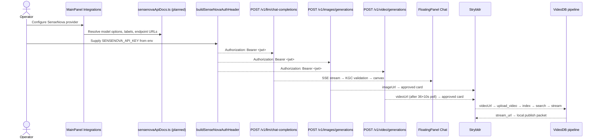

# Knowgrph — SenseNova AI API MainPanel Integrations PRD/TAD

`version {{version}}` — `status {{status}}` — owner `{{author}}` — {{updated}}

This document defines the implementation contract for adding **SenseNova AI API** (SenseTime's AI platform, `platform.sensenova.cn`) to `MainPanel Integrations` as a chat-compatible text provider and as dedicated image and video generation providers. It follows the same upstream-only integration pattern used by Agnes, MiroMind, and BytePlus: one new provider upstream at the provider boundary, with all downstream shared owners (SSE parser, KGC validation, workspace, canvas apply) reused unchanged.

SenseNova covers three modalities that map directly to the existing Knowgrph widget pipeline:
- **Text** (`POST /v1/llm/chat-completions`, SSE) → `FloatingPanel Chat` → `KGC validation` → `Canvas`
- **Image** (`POST /v1/images/generations`, synchronous) → `Rich Media Panel image tab`
- **Video** (`POST /v1/video/generations`, async job) → `Rich Media Panel video tab`

Combined with the VideoDB pipeline (upload → index → search → stream), this creates the full E2E `Text → Image → Video → VideoDB stream → local publish packet` workflow in Strybldr.

---

## Source Baseline

### SenseNova API Facts (from platform.sensenova.cn + PyPI `sensenova` package)

| Fact | Source | Contract Impact |
|---|---|---|
| Base URL is `https://api.sensenova.cn`. | Platform docs | `CHAT_SENSENOVA_BASE` and all endpoint URLs anchor to this host. |
| Auth uses a server-managed `SENSENOVA_API_KEY` and keeps signing/proxy auth server-side. | PyPI package, platform docs | Browser surfaces display only the env-key name; the secret value never reaches browser storage. |
| Chat completions: `POST /v1/llm/chat-completions` with `messages`, `model`, `max_new_tokens`, `stream`. | Platform docs | Follows OpenAI-compatible message format; SSE stream is `text/event-stream`. |
| Image generation: `POST /v1/images/generations` with `prompt`, `model` (`artist-xl`), `n`, `width`, `height`. | Platform docs | Synchronous response; `data[].url` contains image URL or base64. |
| Video generation: `POST /v1/video/generations` with `prompt`, `model` (`SenseAnim`), async job pattern. | Platform docs | Async job id returned; poll task status endpoint until completed. |
| Text models include `SenseChat-5`, `SenseChat-Turbo`, `SenseChat-Vision-5`, `nova-ptc-xl-v1`, `nova-ptc-s-v2`. | Platform docs | Model options surface in `sensenova.text.model` dropdown in MainPanel Integrations. |
| Image model: `artist-xl` (primary), `senseNova-img-enhance`. | Platform docs | Image model options surface in `sensenova.image.model` dropdown. |
| Video models: `SenseAnim`, `SenseAnim-Pro`. | Platform docs | Video model options surface in `sensenova.video.model` dropdown. |
| Python SDK available at PyPI as `sensenova`; knowgrph MainPanel Integrations uses the server-managed env-key placeholder `SENSENOVA_API_KEY`. | PyPI package | Env var names define the placeholder convention for MainPanel Integrations. |

### Local Repo Truth

| Surface | Current State | Owner | Integration Rule |
|---|---|---|---|
| MainPanel Integrations | Shipped; Agnes, MiroMind, BytePlus, Qwen, OpenAI registered | `canvas/src/features/panels/views/IntegrationsHubView.tsx` | Add SenseNova as a new provider section; do not add a new tab. |
| Chat provider registry | Shipped; `CHAT_PROVIDER_OPTIONS` in `chatEndpoint.ts` | `canvas/src/lib/chatEndpoint.ts` | Add `CHAT_PROVIDER_SENSENOVA = 'sensenova'`, `CHAT_SENSENOVA_HOST`, `CHAT_SENSENOVA_BASE`, `CHAT_SENSENOVA_ENDPOINT_URL`, `CHAT_SENSENOVA_MODEL_OPTIONS`. |
| Auth JWT signer | Not yet shipped for SenseNova | Planned: `canvas/src/lib/chatEndpoint.ts` or shared helper | Add `buildSenseNovaAuthHeader(accessKeyId, secretAccessKey)` — HMAC-SHA256 JWT; never store raw secrets in browser. |
| Settings registry (text) | Shipped via `registry-ui.ui.ts` | `canvas/src/features/settings/registry-ui.ui.ts` | Add `sensenova.text.*` settings keys following Agnes/MiroMind pattern. |
| Image SSOT | Planned: `canvas/src/features/integrations/sensenovaImageSsot.ts` | `sensenovaImageSsot.ts` (planned) | Follow `byteplusImageGenerationSsot.ts` pattern; export `SENSENOVA_IMAGE_DOC_ROWS`. |
| Video SSOT | Planned: `canvas/src/features/integrations/sensenovaVideoSsot.ts` | `sensenovaVideoSsot.ts` (planned) | Follow `byteplusVideoGenerationSsot.ts` / `geminiVideoGenerationSsot.ts` pattern; export `SENSENOVA_VIDEO_DOC_ROWS`. |
| Doc entries (text) | Planned: `canvas/src/features/panels/views/sensenovaApiDocs.ts` | `sensenovaApiDocs.ts` (planned) | Export `SENSENOVA_TEXT_DOC_ENTRIES`, `SENSENOVA_IMAGE_DOC_ENTRIES`, `SENSENOVA_VIDEO_DOC_ENTRIES` following MiroMind/Agnes pattern. |
| FloatingPanel Chat harness | Shipped; SSE parser, KGC validation, canvas apply | `canvas/src/features/chat/floatingPanelChat/*` | Reuse unchanged; SenseNova text output enters through the same SSE path. |
| Image widget pipeline | Shipped (BytePlus, Gemini) | `canvas/src/features/chat/byteplusRunGeneration.ts` (reference) | Adapt for SenseNova image endpoint; output `imageUrl` → Rich Media Panel image tab. |
| Video widget pipeline | Shipped (BytePlus, Gemini Veo) | `canvas/src/features/chat/geminiRunGeneration.ts` (reference) | Adapt for SenseNova video async pattern; 36 × 10s poll circuit-breaker. |
| Strybldr pipeline | Shipped | `canvas/src/features/strybldr/*` | SenseNova text→image→video output feeds approved Strybldr cards → VideoDB handoff. |

---

## Executive Summary

Knowgrph already integrates OpenAI, MiroMind, Agnes, Qwen, BytePlus, and Gemini as chat/generation providers. SenseNova adds a Chinese AI platform (SenseTime) with a strong text, image, and video stack — covering the same three modalities as BytePlus ModelArk but through a distinct HMAC-JWT authentication scheme and endpoints.

The product risks are:
- **Auth complexity**: SenseNova uses HMAC-SHA256 signed JWT, not a simple Bearer API key. A new JWT signer function is required upstream; the downstream pipeline is unchanged.
- **Dual-provider drift**: SenseNova text, image, and video rows must share one `sensenovaApiDocs.ts` SSOT with consistent `sensenova.*` key namespacing across all three modalities.
- **Credential exposure**: `SENSENOVA_API_KEY` must never reach the browser as a raw value; only the server-managed request path may use it.

The integration must:
- add SenseNova upstream at the provider boundary only (`chatEndpoint.ts`, `sensenovaApiDocs.ts`)
- implement `buildSenseNovaAuthHeader` as a shared pure function
- keep all downstream SSE parsing, KGC validation, and canvas apply owners unchanged
- align the SenseNova video async polling to the existing 36 × 10s circuit-breaker
- wire SenseNova text→image→video output into the Strybldr → VideoDB E2E publish packet

---

## Problem Discovery

### Problem Statement

Operators running a Strybldr → VideoDB E2E workflow need a capable text, image, and video AI provider that is not BytePlus or Gemini. SenseNova offers all three modalities through a single platform with competitive Chinese market positioning. Without a knowgrph integration, SenseNova workflows require manual API calls outside the canvas.

### Problem Hypothesis

If SenseNova is added upstream at the provider boundary following the Agnes/MiroMind pattern, operators can generate text scripts, reference images, and video clips from a single provider within the existing Strybldr canvas workflow, then hand off generated assets to the VideoDB pipeline for semantic indexing and streaming.

### ROI Estimate

| Factor | Estimate | Rationale |
|---|---:|---|
| User impact | 4 | Text + image + video from one provider unlocks the full Strybldr → VideoDB E2E pipeline. |
| Reach | 2 | Applies to Strybldr users, image/video widget operators, and Chinese market deployments. |
| Build hours | 10 | JWT signer (2h), text SSOT (2h), image SSOT (2h), video SSOT (2h), settings registry + tests (2h). |
| Monthly TCO | pay-per-use only | No fixed infrastructure cost; SenseNova charges per token/image/video. |
| Token cost/month | operator-determined | Same discipline as existing providers; bounded by shared chat budget controls. |
| ROI score | 0.8 (`4×2/10`) | Positive at zero fixed TCO; rises with Chinese market operator adoption. |

### Phase 0 Gate

Proceed with the MainPanel Integrations contract. The min-viable P0 scope is the JWT signer + text provider registration. Image and video SSOTs follow in P1. All defer the Strybldr handoff until P0 text generation proves stable.

---

## PRD

### Personas And Jobs To Be Done

| Persona | Job | Success Signal |
|---|---|---|
| Operator | Use SenseNova text generation in FloatingPanel Chat | MainPanel Integrations shows SenseNova provider with model options; chat works end-to-end on the existing KGC path. |
| Image producer | Generate reference images for Strybldr story beats | Image widget runs `artist-xl`; `imageUrl` flows to Rich Media Panel image tab. |
| Video producer | Generate video clips from approved story beats | Video widget runs `SenseAnim`; async poll completes within 36×10s; `videoUrl` flows to Rich Media Panel video tab. |
| Strybldr user | Run the full Text→Image→Video→VideoDB E2E pipeline | Approved Strybldr card → SenseNova text → SenseNova image → SenseNova video → VideoDB upload/index/search/stream → local publish packet. |
| Maintainer | Keep SenseNova constants in one SSOT | `sensenovaApiDocs.ts` drives all three modality rows; `chatEndpoint.ts` resolves host/base/endpoint from one source. |
| Auditor | Confirm no raw SenseNova credentials in browser or repo | `SENSENOVA_API_KEY` never in `localStorage`/`sessionStorage`; only the server-managed request path uses the value. |

### User Journey Flow

| Stage | Action | Touchpoint | Pain Point | Opportunity |
|---|---|---|---|---|
| Trigger | Operator needs Chinese-market AI for text/image/video generation | MainPanel Integrations | No SenseNova section exists | Add `SenseNova AI API` alongside Agnes, MiroMind, BytePlus sections. |
| Configure text | Select `sensenova` provider, choose `SenseChat-5` model, set auth in env | MainPanel Integrations | HMAC-JWT auth is unfamiliar | Surface auth method label and env var placeholders; hide JWT derivation behind the shared signer. |
| Generate text | Run chat request from FloatingPanel Chat | FloatingPanel Chat | SSE stream might differ from OpenAI | Reuse shared SSE parser; preserve any `reasoning_steps`/metadata fields in the stream. |
| Generate image | Run `artist-xl` in image widget | Props Panel Image widget | Synchronous response differs from BytePlus async | Follow synchronous path; emit `imageUrl` directly to Rich Media Panel. |
| Generate video | Run `SenseAnim` in video widget | Props Panel Video widget | Async job pattern differs from Gemini Veo | Use same 36×10s circuit-breaker pattern; poll SenseNova task status endpoint. |
| Strybldr handoff | Approve beats; dispatch text→image→video sequence | Strybldr canvas | Multiple providers for three modalities | One SenseNova provider for all three; convergence at Strybldr publish packet. |
| VideoDB E2E | VideoDB upload/index/search/stream following SenseNova generation | VideoDB REST or MCP path | Generated assets need semantic indexing | Pipe SenseNova `videoUrl` → VideoDB `upload_video` → index → search → stream → local publish packet. |

### User Stories

| ID | Story | Acceptance Criteria | Priority |
|---|---|---|---|
| PRD-SN-01 | As an operator, I can select SenseNova as a chat provider in MainPanel Integrations. | Given MainPanel Integrations is opened, when the provider selector renders, then `sensenova` appears with `SenseChat-5`, `SenseChat-Turbo`, `SenseChat-Vision-5`, `nova-ptc-xl-v1`, `nova-ptc-s-v2` as model options. | Must |
| PRD-SN-02 | As an operator, I can generate text through the shared chat pipeline. | Given `sensenova` provider is selected and auth env vars are set, when I send a message in FloatingPanel Chat, then the SSE stream returns KGC-valid Markdown that flows to workspace/canvas through existing owners. | Must |
| PRD-SN-03 | As an image producer, I can generate images using `artist-xl`. | Given the SenseNova image widget is configured, when I run it, then `POST /v1/images/generations` returns an image URL that flows to the Rich Media Panel image tab. | Must |
| PRD-SN-04 | As a video producer, I can generate video clips using `SenseAnim`. | Given the SenseNova video widget is configured, when I run it, then `POST /v1/video/generations` starts an async job, polling resolves within 36×10s, and the video URL flows to the Rich Media Panel video tab. | Must |
| PRD-SN-05 | As a Strybldr user, I can run the full Text→Image→Video E2E pipeline with SenseNova. | Given approved Strybldr story beats, when I dispatch the generation sequence, then text, image, and video outputs land in the Strybldr publish packet alongside the VideoDB stream URL. | Should |
| PRD-SN-06 | As a maintainer, I can update SenseNova constants once. | Given endpoint URLs, model names, or auth method change, when I update `sensenovaApiDocs.ts`, then MainPanel rows, widget defaults, tests, and docs read the same constants. | Must |
| PRD-SN-07 | As an auditor, I can confirm no raw SenseNova credentials are stored in browser or repository. | Given the integration is configured, when I inspect browser storage, docs, and test fixtures, then no raw `SENSENOVA_API_KEY` value appears. | Must |

### Acceptance Criteria And Goal Conditions

| Criterion | Given | When | Then | `/goal` Condition |
|---|---|---|---|---|
| AC-01 | MainPanel Integrations renders | Operator opens Integrations | `SenseNova AI API` section visible with text/image/video model options | `/goal SenseNova provider rows render from shared SSOT; focused MainPanel Integrations tests pass with no unrelated file edits` |
| AC-02 | Text generation via shared SSE path | `sensenova` provider selected, auth env set | FloatingPanel Chat SSE completes → workspace/canvas updated through existing KGC path | `/goal SenseNova chat completions SSE is parsed by the shared parser without a new finalize path` |
| AC-03 | Image generation via widget | Image widget configured with `artist-xl` | `imageUrl` returned synchronously → Rich Media Panel image tab | `/goal SenseNova image generation returns a non-empty imageUrl verified by image pipeline test` |
| AC-04 | Video generation via widget (async, 36×10s poll) | Video widget configured with `SenseAnim` | Async job completes within circuit-breaker; `videoUrl` → Rich Media Panel video tab | `/goal SenseNova video async polling terminates at ≤36 iterations and returns videoUrl or structured failure` |
| AC-05 | No raw credentials in browser or repo | Integration configured | No raw `SENSENOVA_API_KEY` value in browser storage, docs, or fixtures | `/goal repo grep for SENSENOVA_API_KEY returns only env-var name strings and placeholder text, never literal values` |

### MoSCoW Scope

| Class | Requirement |
|---|---|
| Must | Add `CHAT_PROVIDER_SENSENOVA` to `chatEndpoint.ts` with host, base, endpoint URL, and model options. |
| Must | Implement `buildSenseNovaAuthHeader(accessKeyId, secretAccessKey)` — HMAC-SHA256 JWT signer; inject at request time; never store raw keys in browser. |
| Must | Create `sensenovaApiDocs.ts` with `SENSENOVA_TEXT_DOC_ENTRIES`, `SENSENOVA_IMAGE_DOC_ENTRIES`, `SENSENOVA_VIDEO_DOC_ENTRIES`. |
| Must | Add `sensenova.text.*` settings keys following MiroMind/Agnes pattern; reuse shared SSE parser and KGC validation. |
| Must | Create `sensenovaImageSsot.ts` following `byteplusImageGenerationSsot.ts` pattern; synchronous image endpoint. |
| Must | Create `sensenovaVideoSsot.ts` following `geminiVideoGenerationSsot.ts` pattern; async video job with 36×10s circuit-breaker. |
| Should | Wire Strybldr approved-card dispatch through SenseNova text→image→video sequence. |
| Should | Pipe SenseNova `videoUrl` to VideoDB `upload_video` in the Strybldr → VideoDB E2E handoff. |
| Could | Add SenseNova-specific `mainPanel.sectionDescription` in `knowgrph-mainpanel-section-descriptions.md`. |
| Could | Add SenseNova provider to Cloudflare Pages chat proxy allowlist alongside Agnes/MiroMind. |
| Won't | Store raw `SENSENOVA_API_KEY` values in browser localStorage, sessionStorage, or any repo file. |
| Won't | Add a new MainPanel tab or parallel graph-mutation path for SenseNova. |
| Won't | Create a new SSE parser or KGC validation path for SenseNova text output. |

### Success Metrics

| Metric | Target |
|---|---:|
| SenseNova text/image/video rows rendered from shared SSOT | 100% |
| Raw `SENSENOVA_API_KEY` in browser storage, docs, or tests | 0 |
| New SSE parser or KGC validation paths introduced | 0 |
| SenseNova video async polling circuit-breaker violations | 0 |
| Operator setup time to first text generation | < 2 minutes |

---

## TAD

### Component Inventory

| Component | Responsibility | State | Boundary |
|---|---|---|---|
| `chatEndpoint.ts` | Add `CHAT_PROVIDER_SENSENOVA`, `CHAT_SENSENOVA_HOST`, `CHAT_SENSENOVA_BASE`, `CHAT_SENSENOVA_ENDPOINT_URL`, `CHAT_SENSENOVA_MODEL_OPTIONS`, `CHAT_SENSENOVA_IMAGE_MODEL_OPTIONS`, `CHAT_SENSENOVA_VIDEO_MODEL_OPTIONS`, `buildSenseNovaAuthHeader` | Runtime provider constants + JWT signer | `canvas/src/lib/chatEndpoint.ts` |
| `sensenovaApiDocs.ts` (planned) | SenseNova text/image/video constants: doc areas, doc entries, model options, endpoint labels, section label, anchor-id helper | Static constants + pure functions | `canvas/src/features/panels/views/` |
| `sensenovaImageSsot.ts` (planned) | Image SSOT: `SensenovaImageApiDocRow`, `SENSENOVA_IMAGE_DOC_ROWS`, widget fields builder, `artist-xl` defaults | Image generation rows | `canvas/src/features/integrations/` |
| `sensenovaVideoSsot.ts` (planned) | Video SSOT: `SensenovaVideoApiDocRow`, `SENSENOVA_VIDEO_DOC_ROWS`, widget fields builder, `SenseAnim` defaults, async job polling | Video generation rows | `canvas/src/features/integrations/` |
| `settings registry` | `sensenova.text.*` keys: model, endpoint_url, auth_mode, max_tokens | Non-secret settings | `canvas/src/features/settings/registry-ui.ui.ts` |
| `settingsView.constants.ts` | Add `[SENSENOVA_TEXT_DOC_AREA]`, `[SENSENOVA_IMAGE_DOC_AREA]`, `[SENSENOVA_VIDEO_DOC_AREA]` to `INTEGRATIONS_SECTION_META` | Section metadata | `canvas/src/features/panels/views/settingsView.constants.ts` |
| FloatingPanel Chat harness | Existing SSE parser + KGC validation + canvas apply — **unchanged** | Shared | `canvas/src/features/chat/floatingPanelChat/*` |
| Image pipeline harness | Existing BytePlus/Gemini image widget pattern — adapted for SenseNova synchronous response | Shared | `canvas/src/features/chat/byteplusRunGeneration.ts` (reference) |
| Video pipeline harness | Existing Gemini Veo async pattern — adapted for SenseNova async job with 36×10s circuit-breaker | Shared | `canvas/src/features/chat/geminiRunGeneration.ts` (reference) |
| Strybldr pipeline | Approved card → SenseNova Text→Image→Video → VideoDB handoff → publish packet | Operator-gated | `canvas/src/features/strybldr/*` |

### Auth Contract: HMAC-SHA256 JWT Signer

SenseNova does NOT use a simple Bearer API key. Authentication requires a JWT signed with HMAC-SHA256 from two operator-supplied credentials:

- `SENSENOVA_API_KEY` — the server-managed SenseNova credential env key; the value stays outside browser state.

The derived JWT is placed in the `Authorization: Bearer <jwt>` header. The signing logic must live in a pure TypeScript function `buildSenseNovaAuthHeader(accessKeyId, secretAccessKey, expirySeconds?)` that:
1. Constructs a JWT payload with `{ iss: accessKeyId, exp: Date.now() + expirySeconds, nbf: Date.now() - 5000 }` (or equivalent platform-documented fields)
2. Signs the payload using `HMAC-SHA256` with `secretAccessKey` as the signing key
3. Returns the `Authorization: Bearer <signed-jwt>` header string
4. Never persists raw `accessKeyId` or `secretAccessKey` in browser storage or any source file

The env var uses the `${SENSENOVA_API_KEY}` placeholder convention in docs, tests, and MainPanel copy rows — never literal values.

### Text Integration Contract

```
POST https://api.sensenova.cn/v1/llm/chat-completions
Authorization: Bearer <signed-jwt>
Content-Type: application/json

{
  "model": "SenseChat-5",
  "messages": [{"role": "user", "content": "prompt text"}],
  "max_new_tokens": 1024,
  "stream": true
}
```

Response: `text/event-stream` SSE — handled by existing shared SSE parser. No new parser. Any SenseNova-specific fields (e.g. `reasoning_content`, `usage`) surfaced but not required by the KGC path.

### Image Integration Contract

```
POST https://api.sensenova.cn/v1/images/generations
Authorization: Bearer <signed-jwt>
Content-Type: application/json

{
  "model": "artist-xl",
  "prompt": "image prompt",
  "n": 1,
  "width": 1024,
  "height": 1024,
  "response_format": "url"
}
```

Response: synchronous JSON with `data[].url` or `data[].b64_json`. Follows the existing image widget `imageUrl` → Rich Media Panel pattern.

### Video Integration Contract

```
POST https://api.sensenova.cn/v1/video/generations
Authorization: Bearer <signed-jwt>
Content-Type: application/json

{
  "model": "SenseAnim",
  "prompt": "video prompt",
  "image_url": "optional reference image"
}
```

Response: async job id returned immediately. Poll task status endpoint until `completed` or `failed`. Circuit-breaker: **36 iterations × 10 seconds** matching the Gemini Veo harness in `canvas/src/features/chat/geminiRunGeneration.ts`.

### Workflow Flow



### Data Flow

| Stage | Component | Input | Output | Persistence | Error Handling |
|---|---|---|---|---|---|
| Auth | `buildSenseNovaAuthHeader` | `accessKeyId`, `secretAccessKey` (from env) | `Authorization: Bearer <jwt>` header | Not persisted | Fail closed if either key is empty |
| Text request | FloatingPanel Chat SSE harness | `messages[]`, JWT header | SSE stream | Chat history + workspace on KGC validation | Shared SSE retry; surface provider error |
| Image request | Image widget harness | `prompt`, `model`, JWT header | `imageUrl` (sync) | Rich Media Panel state | Surface API error; keep previous `imageUrl` |
| Video request | Video widget harness | `prompt`, `model`, JWT header | async job id → `videoUrl` after poll | Rich Media Panel state | 36×10s circuit-breaker; failure result on exhaustion |
| Strybldr dispatch | Strybldr pipeline | Approved beat + `imageUrl` + `videoUrl` | Publish packet entry | Strybldr publish packet | Readiness-gate if any SenseNova output is missing |
| VideoDB handoff | VideoDB REST or MCP | `videoUrl` → `upload_video` | `stream_url` | Local publish packet | VideoDB async circuit-breaker (separate 36×10s bound) |

### Planned SSOTs

**`sensenovaApiDocs.ts` — doc area constants and virtual settings entries:**
- `SENSENOVA_TEXT_DOC_AREA = 'SenseNova AI Text API'`
- `SENSENOVA_IMAGE_DOC_AREA = 'SenseNova AI Image API'`
- `SENSENOVA_VIDEO_DOC_AREA = 'SenseNova AI Video API'`
- `SENSENOVA_TEXT_DOC_ENTRIES: VirtualSettingsEntry[]` — text rows following MiroMind/Agnes pattern
- `SENSENOVA_IMAGE_DOC_ENTRIES: VirtualSettingsEntry[]` — image rows following BytePlus image pattern
- `SENSENOVA_VIDEO_DOC_ENTRIES: VirtualSettingsEntry[]` — video rows following Gemini Veo pattern
- `getSensenovaTextApiRowAnchorId(rowKey: string): string`
- `getSensenovaImageApiRowAnchorId(rowKey: string): string`
- `getSensenovaVideoApiRowAnchorId(rowKey: string): string`

**`sensenovaImageSsot.ts` — image generation rows:**
- `SensenovaImageApiDocRow` type
- `SENSENOVA_IMAGE_DOC_ROWS` — keys: `model`, `prompt`, `n`, `width`, `height`, `response_format`, `endpoint`, `docs_url`
- `buildSensenovaImageGenerationFields(): WidgetRegistryField[]`
- `SENSENOVA_IMAGE_API_DOC_AREA`, `SENSENOVA_IMAGE_DOCS_URL`

**`sensenovaVideoSsot.ts` — video generation rows:**
- `SensenovaVideoApiDocRow` type
- `SENSENOVA_VIDEO_DOC_ROWS` — keys: `model`, `prompt`, `image_url`, `endpoint`, `polling_endpoint`, `docs_url`
- `buildSensenovaVideoGenerationFields(): WidgetRegistryField[]`
- `SENSENOVA_VIDEO_API_DOC_AREA`, `SENSENOVA_VIDEO_DOCS_URL`
- Async polling: 36 iterations × 10s — documented in `polling_endpoint` row value-description

### Error Handling

| Failure | Response |
|---|---|
| `SENSENOVA_API_KEY` empty | Fail readiness check before any API call; surface in MainPanel Integrations readiness row |
| JWT signing error | Return auth failure immediately; surface structured error; do not retry with empty/malformed token |
| Text SSE stream error | Shared SSE retry (1 attempt); surface provider error in chat history |
| Image request error | Surface API error in image widget; keep previous `imageUrl` unchanged |
| Video async job exhausts 36-iteration circuit-breaker | Return structured failure result; surface in video widget status; do not loop indefinitely |
| Strybldr dispatch missing SenseNova output | Write readiness-gated fallback card; do not fabricate `imageUrl` or `videoUrl` |

### Security And Governance

- `SENSENOVA_API_KEY` must live in the server environment. Never paste the raw value into MainPanel browser UI, `localStorage`, `sessionStorage`, or any repo source file.
- The `buildSenseNovaAuthHeader` signer derives a time-limited JWT; the raw secret is never transmitted, logged, or stored.
- Placeholder string `${SENSENOVA_API_KEY}` is the only value-like form of this identifier that may appear in docs, tests, or copy rows.
- Video async polling uses the same 36 × 10s circuit-breaker as Gemini Veo and VideoDB — prevents runaway cost.

### Quality Attributes

| Attribute | Requirement |
|---|---|
| Auth isolation | HMAC-JWT derivation is a pure function; raw secrets never cross the browser boundary |
| Upstream-only | Downstream SSE parser, KGC validation, and canvas apply are unchanged |
| SSOT coherence | `sensenovaApiDocs.ts` is the single source for all three modality constants |
| Async safety | 36 × 10s circuit-breaker prevents runaway video generation cost |
| Testability | Focused tests assert JWT signer output, credential placeholder absence, and async circuit-breaker |

### Deployment And Migration

1. Add `CHAT_PROVIDER_SENSENOVA` + auth signer to `chatEndpoint.ts`.
2. Create `sensenovaApiDocs.ts`, `sensenovaImageSsot.ts`, `sensenovaVideoSsot.ts`.
3. Register settings keys in `registry-ui.ui.ts`; add section metadata to `settingsView.constants.ts`.
4. Add `sensenova` to trusted host allowlist in `chatEndpointProviderInference.ts`.
5. Wire image and video rows to their widget pipelines.
6. Wire Strybldr dispatch to SenseNova text→image→video sequence.
7. Add focused tests: JWT signer, credential placeholder absence, async circuit-breaker.
8. Add SenseNova to Cloudflare Pages chat proxy allowlist (same pattern as Agnes/MiroMind).
9. Validate `npm run docs:update` and full `MainPanel Integrations` smoke before syncing Dev to Prod.

### ADRs

| Decision | Status | Rationale |
|---|---|---|
| Add SenseNova upstream-only; reuse all downstream owners | Accepted | Matches Agnes/MiroMind integration pattern; prevents duplicate finalize/apply logic. |
| Implement `buildSenseNovaAuthHeader` as a pure HMAC-SHA256 signer | Accepted | SenseNova requires JWT, not simple Bearer; pure function is testable and keeps raw secrets out of browser. |
| Share the 36 × 10s circuit-breaker for SenseNova video async | Accepted | Consistent with Gemini Veo and VideoDB async patterns; prevents runaway cost. |
| Use `sensenova.*` key namespace across all three modalities | Accepted | Prevents namespace collision and keeps SSOT coherent across text/image/video. |
| Do not add a new SSE parser or KGC validation path | Accepted | SenseNova text output is OpenAI-compatible SSE; reusing existing parser avoids drift. |
| Wire SenseNova video output to VideoDB upload in Strybldr handoff | Accepted | Completes the E2E Text→Image→Video→VideoDB pipeline; both async circuits are independent. |

### Traceability

| Requirement | PRD Coverage | TAD Coverage |
|---|---|---|
| Text provider in MainPanel Integrations | `PRD-SN-01`, `PRD-SN-02` | `chatEndpoint.ts` additions, `sensenovaApiDocs.ts` text entries |
| Image generation widget | `PRD-SN-03` | `sensenovaImageSsot.ts`, image pipeline harness |
| Video generation widget (async) | `PRD-SN-04` | `sensenovaVideoSsot.ts`, video pipeline harness, 36×10s circuit-breaker |
| Strybldr E2E handoff | `PRD-SN-05` | Strybldr dispatch, VideoDB handoff, publish packet |
| Shared SSOT | `PRD-SN-06` | `sensenovaApiDocs.ts` three doc areas |
| No raw credentials | `PRD-SN-07`, AC-05 | Auth signer, security governance |

---

## Correctness Properties

### Property 1: Auth Secret Isolation

No raw `SENSENOVA_API_KEY` value SHALL appear in browser `localStorage`, `sessionStorage`, Knowgrph source files, documentation, or test fixtures. The identifier appears only as an env var name or placeholder string.

**VCC**: `/goal grep -r "SENSENOVA_API_KEY" canvas/src docs/ tests/ returns only env-var name strings and ${...} placeholder text, never a literal credential value`

### Property 2: Upstream-Only Integration

No new SSE parser, KGC validation path, or canvas apply path SHALL be introduced for SenseNova text generation. The shared parser SHALL handle SenseNova SSE output without modification.

**VCC**: `/goal focused integration test confirms SenseNova text SSE is parsed by the shared SSE parser without a new code path; diff of parsing owners shows 0 additions`

### Property 3: Video Async Circuit-Breaker

For any SenseNova video generation job whose poll endpoint never returns a terminal state, the polling harness SHALL stop at or before 36 iterations at 10-second intervals and SHALL return a structured failure result.

**VCC**: `/goal SenseNova video poll harness stops at ≤36 iterations and returns failure result, verified by circuit-breaker unit test with mocked polling endpoint returning non-terminal state`

### Property 4: Strybldr → VideoDB E2E Publish Packet Integrity

For any approved Strybldr card dispatched through the SenseNova text→image→video sequence followed by the VideoDB upload→index→search→stream sequence, the local publish packet SHALL contain only values derived from live API responses or explicit fallback state — no fabricated `imageUrl`, `videoUrl`, `video_id`, `stream_url`, or `transcript_text`.

**VCC**: `/goal Strybldr publish packet for SenseNova + VideoDB E2E run contains no fabricated field values; all non-fallback fields trace to live API response fixtures in the integration test`
