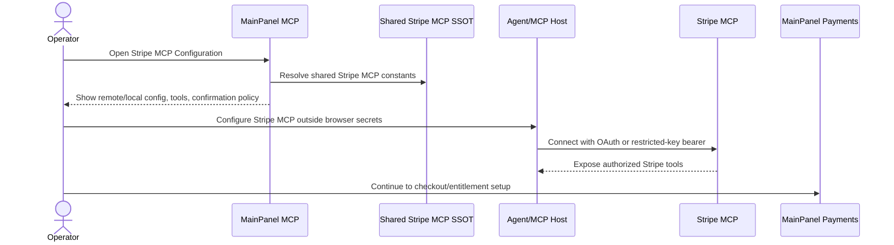

# Knowgrph - Stripe MCP Payment Readiness

`bg#E1F5EE:version {{version}}` - `bg#FAEEDA:status {{status}}` - owner `{{owner}}` - {{date}}

This document turns the MainPanel MCP Stripe surface into a PRD/TAD contract for accepting payment through Stripe MCP without embedding payment credentials in the browser. The implementation posture is neutral: MainPanel MCP exposes payment readiness and agent configuration; MainPanel Payments remains the customer-facing checkout, entitlement, and reconciliation surface.

The official Stripe MCP server is the integration source of truth. Use the remote server at `{{mcp.remote_url}}` with OAuth when the MCP client supports it. If OAuth is unavailable, use a restricted API key only from a server secret store or local environment. Payment-mutating tools stay behind human confirmation.

Stripe Projects can provision and sync local provider credentials, but production checkout still requires explicit Cloudflare Worker configuration. `stripe projects env --pull` writes local `.env` credentials; it does not write variables into `knowgrph-payment` or Cloudflare Pages.

---

## Flow Graph

```mermaid
{{mermaid}}
```

---

## PRD

### Problem Statement

MainPanel needs to become payment-ready for agent workflows without mixing secret handling, customer checkout UX, and MCP setup into one surface. Operators need to see which Stripe MCP server is configured, how it authenticates, which payment-capable tools may mutate Stripe state, and where checkout responsibility begins.

The product risk is not lack of Stripe API coverage; it is unsafe configuration sprawl: stale server URLs, copied keys in browser storage, duplicated payment tool labels, and unclear confirmation boundaries. The Stripe MCP contract must therefore be shared, explicit, and reusable.

### Personas And Jobs To Be Done

| Persona | Job | Success Signal |
|---|---|---|
| Operator | Configure Stripe MCP for an agent or server workflow | Remote and local `mcpServers` snippets are visible and use shared defaults |
| Maintainer | Keep Stripe MCP labels, URLs, tools, and security guidance in one place | UI, tests, and docs resolve the same semantic keys |
| End user | Pay only after an intentional checkout action | Payment-mutating calls require confirmation and entitlement UX stays in Payments |
| Auditor | Review whether keys and payment actions are handled safely | No secret examples, least-privilege scope, and traceable tool intent are documented |

### User Journey Flow

| Step | User Action | System Response | Acceptance Criteria |
|---|---|---|---|
| 1 | Open MainPanel MCP | Stripe MCP Configuration rows appear | Rows include server key, remote URL, connection mode, local launcher, timeout, confirmation, payment tools, registry URL |
| 2 | Choose remote mode | UI shows `{{mcp.remote_url}}` and OAuth-preferred connection guidance | Browser stores no OAuth token, restricted key, or secret key |
| 3 | Choose local/server fallback | UI shows local `mcpServers` JSON with `npx` and `@stripe/mcp@latest` | Secret value is represented only by `{{stripe_mcp_secret_placeholder}}` |
| 4 | Review tools | UI lists payment-capable Stripe MCP tools | Mutating tools are labeled as requiring human confirmation |
| 5 | Continue to payments | Operator opens MainPanel Payments | Payments surface owns checkout, entitlement, and reconciliation UX |

### User Stories

| id | Story | Acceptance Criteria | Priority |
|---|---|---|---|
| `US-01` | As an operator, I can copy agent-ready remote Stripe MCP config | Config contains `mcpServers.stripe.url = "{{mcp.remote_url}}"`; auth guidance says OAuth first | P0 |
| `US-02` | As an operator, I can run a local Stripe MCP server without pasting keys into Knowgrph | Local config uses `command: "{{mcp.local_command}}"`, `args: {{mcp.local_args}}`, and an environment placeholder | P0 |
| `US-03` | As a maintainer, I can update Stripe MCP defaults once | Docs, MainPanel MCP rows, and tests use one shared semantic-key owner | P0 |
| `US-04` | As an auditor, I can distinguish read-only from payment-mutating readiness | Payment-capable tools are listed and confirmation is required before mutation | P0 |
| `US-05` | As an end user, I never enter checkout from an implicit agent action | Checkout and entitlement UX remain in MainPanel Payments, not hidden MCP rows | P1 |

### MoSCoW Scope

| Class | Requirement |
|---|---|
| Must | Use `https://mcp.stripe.com` as the remote Stripe MCP URL |
| Must | Prefer OAuth; allow restricted-key bearer/local fallback only outside browser storage |
| Must | Keep Stripe MCP constants in shared SSOT and reuse them in MainPanel MCP docs/tests |
| Must | Require human confirmation for payment-mutating tools |
| Should | Surface local `@stripe/mcp@latest` launcher config for agents that need local MCP |
| Should | Link MainPanel MCP setup to MainPanel Payments handoff |
| Could | Add per-tool scope presets after the first payment workflow is finalized |
| Won't | Store Stripe secret or restricted keys in browser localStorage/sessionStorage |

### Success Metrics

| Metric | Target |
|---|---:|
| Stripe MCP rows render from shared constants | 100% |
| Secret-key literal examples in MainPanel MCP/docs | 0 |
| Payment-mutating tool calls without confirmation | 0 |
| Remote/local config drift between docs, UI, and tests | 0 |
| Time for operator to locate Stripe MCP registry/docs/config | under 60 seconds |

### Scope And Exclusions

In scope: Stripe MCP readiness rows, remote/local MCP config snippets, payment-tool labels, confirmation policy, secret-boundary guidance, docs, and tests.

Out of scope: creating live Stripe products, choosing actual prices, running production checkout, webhook fulfillment, refunds policy, and entitlement ledger migration. Those belong to MainPanel Payments and backend payment services.

### Assumptions

| id | Assumption | Validation |
|---|---|---|
| `A-01` | OAuth is available in the MCP host for the preferred remote path | Confirm during agent-host setup |
| `A-02` | Restricted API keys are used only for server/local fallback | Verify deployment secrets and local env templates |
| `A-03` | Payment tools may create or mutate Stripe resources | Keep `{{mcp.require_confirmation}}` true by default |
| `A-04` | MainPanel MCP is configuration readiness, not checkout UX | Keep customer-facing payment flow in Payments |

---

## TAD

### Component Inventory

| Component | Responsibility | State | Boundary |
|---|---|---|---|
| Shared Stripe MCP SSOT | Remote URL, registry/docs URLs, local launcher, env placeholder, timeout, tool list, confirmation default | Static constants | Shared package |
| MainPanel MCP | Renders Stripe MCP configuration rows and agent-ready JSON | Non-secret settings only | Browser UI |
| Stripe remote MCP | Official hosted MCP server | OAuth or bearer authorization | External service |
| Local Stripe MCP | Local/server MCP process launched by an agent host | `STRIPE_SECRET_KEY` from environment | Local/server process |
| MainPanel Payments | Checkout, entitlement, and reconciliation UX | Payment state and entitlement state | Product payment surface |
| Stripe Projects | Local project credential provisioning and sync | `.env` and `.projects/vault/` on developer machines | Local development, not production host |
| `knowgrph-payment` Worker | Hosted Checkout Session creation, status reads, and webhook verification | Cloudflare Worker secrets and D1 checkout-session rows | `airvio.co/api/payments/*` |

### Integration Contract

Remote MCP config:

```json
{
  "mcpServers": {
    "stripe": {
      "url": "https://mcp.stripe.com"
    }
  }
}
```

Local/server MCP config:

```json
{
  "mcpServers": {
    "stripe": {
      "command": "npx",
      "args": ["-y", "@stripe/mcp@latest"],
      "env": {
        "STRIPE_SECRET_KEY": "${STRIPE_RESTRICTED_KEY}"
      }
    }
  }
}
```

Authorization rules:

| Mode | Use When | Required Boundary |
|---|---|---|
| OAuth | MCP client supports remote OAuth | User authorization happens in the MCP host; browser UI stores no Stripe credential |
| Bearer restricted key | OAuth is unavailable and an agent/server needs direct authorization | Key lives in server secret store; permissions are least privilege |
| Local environment | Local agent host runs Stripe MCP process | Key lives in environment; config exposes only placeholder text |

Payment-capable tools surfaced for readiness:

| Tool | Mutation Class | Guard |
|---|---|---|
| `create_payment_link` | Create checkout resource | Human confirmation |
| `create_product` | Create catalog resource | Human confirmation |
| `create_price` | Create pricing resource | Human confirmation |
| `create_customer` | Create customer record | Human confirmation |
| `create_invoice` | Create billing document | Human confirmation |
| `create_invoice_item` | Create invoice line | Human confirmation |
| `finalize_invoice` | Finalize billing document | Human confirmation |
| `list_payment_intents` | Read payment state | Least-privilege read scope |
| `create_refund` | Move money back to customer | Human confirmation |

### Workflow Flow



### Data Flow

| Data | Source | Stored In Browser | Destination | Policy |
|---|---|---:|---|---|
| Server key | Shared SSOT/default setting | Yes | MCP config JSON | Non-secret |
| Remote URL | Shared SSOT/default setting | Yes | MCP host | Non-secret |
| Connection mode | Shared SSOT/default setting | Yes | Operator guidance | Non-secret |
| Local command/args | Shared SSOT/default setting | Yes | MCP host | Non-secret |
| Secret placeholder | Shared SSOT | Yes | Documentation only | Placeholder, not a credential |
| Restricted API key | Secret store or local environment | No | Stripe MCP | Least privilege |
| OAuth token/session | MCP host | No | Stripe MCP | Host-owned |
| Tool call arguments | Agent/payment service | No by default | Stripe MCP | Redact secrets; log hashes/trace ids |

### Error Handling

| Failure | Response |
|---|---|
| OAuth unsupported by host | Use restricted-key bearer/local fallback and keep key out of browser storage |
| Missing local `STRIPE_SECRET_KEY` | Agent host fails closed before calling Stripe tools |
| Payment-mutating tool requested without confirmation | Block call and ask for explicit confirmation |
| Tool authorization too broad | Reject config during review and narrow restricted-key permissions |
| Stripe MCP remote unavailable | Use local/server fallback only if secrets and confirmation policy are satisfied |

### Security And Governance

- Prefer OAuth for the remote Stripe MCP server because authorization can be user-scoped and revocable.
- Use restricted API keys only when OAuth is unavailable; grant only required Stripe permissions.
- Never paste `sk_*` or `rk_*` values into MainPanel, markdown docs, fixtures, or tests.
- Keep payment-mutating tools behind explicit human confirmation.
- Log tool name, principal, argument hash, result status, latency, and trace id; do not log raw secrets.

### Stripe Projects And Production Worker Configuration

Stripe Projects references:

| Reference | Purpose |
|---|---|
| `https://projects.dev/` | Stripe Projects entrypoint and provider catalog |
| `https://projects.dev/skill.md` | Agent skill entrypoint |
| `https://docs.stripe.com/projects` | CLI, project state, credential sync, and production environment guidance |

Production checkout configuration belongs to the `knowgrph-payment` Worker:

| Variable | Required For | Current context |
|---|---|---|
| `STRIPE_RESTRICTED_KEY` or `STRIPE_SECRET_KEY` | Stripe API authentication | `STRIPE_SECRET_KEY` is configured on `knowgrph-payment` as of 2026-05-19 |
| `STRIPE_CHECKOUT_PRICE_ID` | Preferred server-owned checkout price authority | Pending unless configured in Cloudflare |
| `STRIPE_CHECKOUT_CURRENCY` + `STRIPE_CHECKOUT_UNIT_AMOUNT` + `STRIPE_CHECKOUT_PRODUCT_NAME` | Inline price tuple fallback | Pending unless configured in Cloudflare |
| `STRIPE_WEBHOOK_SECRET` | Stripe webhook verification | Required before relying on webhook reconciliation |
| `STRIPE_CHECKOUT_RETURN_ORIGIN` | Optional return-origin override | Optional |

Do not configure these as browser storage or rely on Cloudflare Pages project variables for the payment route. Pages variables are separate from the standalone `knowgrph-payment` Worker runtime.

### Quality Attributes

| Attribute | Requirement |
|---|---|
| Neutrality | Stripe MCP config is reusable across agent hosts and does not depend on one payment product |
| Determinism | Defaults resolve from one semantic-key owner |
| Low TCO | Remote MCP OAuth is the default; local server is optional |
| Safety | Secrets never cross the browser boundary |
| Testability | MainPanel MCP render tests assert URLs, launcher, placeholders, tools, and forbidden key literals |

### Deployment And Migration

1. Keep Stripe MCP defaults in the shared payment SSOT.
2. Render MainPanel MCP rows from the shared constants.
3. Keep existing Payments settings focused on customer-facing checkout.
4. Validate render tests and docs lint before syncing Dev to Prod.
5. Configure real OAuth/restricted-key credentials only in the target MCP host or backend secret store.

### ADR

| Decision | Status | Rationale |
|---|---|---|
| Use official Stripe remote MCP URL | Accepted | Reduces custom adapter churn and follows Stripe's MCP documentation |
| Prefer OAuth over embedded bearer tokens | Accepted | Supports user-scoped authorization and avoids browser secret exposure |
| Keep local `@stripe/mcp@latest` fallback | Accepted | Supports agent hosts that need local MCP or lack remote OAuth |
| Separate MCP readiness from checkout UX | Accepted | Avoids duplicate payment logic and keeps MainPanel Payments as the checkout owner |

### Traceability

| Requirement | PRD Coverage | TAD Coverage |
|---|---|---|
| Remote Stripe MCP readiness | `US-01`, journey step 2 | Remote config, component inventory |
| Local MCP fallback | `US-02`, journey step 3 | Local config, authorization rules |
| Shared semantic-key reuse | `US-03`, MoSCoW Must | Shared SSOT, deployment steps |
| Confirmation for mutating tools | `US-04`, success metrics | Tool table, error handling |
| Payments handoff | `US-05`, scope | Workflow flow, ADR |

---

## Continuation

See companion: knowgrph-stripe-mcp-service.companion.md.
