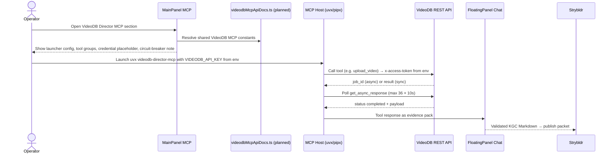

# Knowgrph — VideoDB MCP MainPanel Integration PRD/TAD

`version {{version}}` — `status {{status}}` — owner `{{author}}` — {{updated}}

This document defines the implementation contract for surfacing the **VideoDB Director MCP** server in `MainPanel MCP` and wiring it alongside the existing REST-based `MainPanel Integrations` surface so operators can run video intelligence workflows through either path.

It does not create a new MainPanel tab, a new graph-mutation service, or a parallel credential store. VideoDB MCP belongs in the existing MCP configuration surface and feeds the same `FloatingPanel Chat → workspace Markdown/frontmatter → Canvas` pipeline that all other MCP integrations use.

---

## Source Baseline

### External Source Facts (from https://docs.videodb.io/pages/build-with-agents/mcp-server.md)

| Fact | Source | Contract Impact |
|---|---|---|
| The official MCP package is `videodb-director-mcp`, installable via `uvx`, `pipx`, or `pip`. | VideoDB MCP docs | MainPanel MCP must surface the `uvx` command as the recommended launcher; `pipx`/`pip` are fallbacks. |
| `uvx videodb-director-mcp --api-key=<VIDEODB_API_KEY>` is the canonical launch command. | VideoDB MCP docs | API key is a runtime environment argument, never a browser-stored literal. |
| Auto-install targets: `--install=claude`, `--install=cursor`, `--install=all`. | VideoDB MCP docs | MainPanel MCP shows the copy-ready `mcpServers` JSON for Claude Desktop and Cursor; it does not mutate user config. |
| `claude mcp add videodb-director uvx -- videodb-director-mcp --api-key=<VIDEODB_API_KEY>` for Claude Code. | VideoDB MCP docs | Surface Claude Code one-liner as a copy block in MainPanel MCP, with placeholder substitution. |
| Python 3.12+ is required. | VideoDB MCP docs | MainPanel MCP readiness note must include Python 3.12+ prerequisite. |
| `uv cache clean` + `@latest` suffix ensures freshest package on `uvx`. | VideoDB MCP docs | Guidance row in MainPanel MCP; not a runtime constraint. |
| The MCP server bridges all VideoDB REST endpoints as MCP tools. | VideoDB MCP docs | Tool groups map to API groups from `knowgrph-videodb-api-reference.md`. |

### Local Repo Truth

| Surface | Current State | Owner | Integration Rule |
|---|---|---|---|
| MainPanel MCP | Shipped as `SettingsView mode="mcp"` shell | `canvas/src/features/panels/views/McpHubView.tsx` | Add VideoDB Director as an MCP settings section; do not add a new tab. |
| MCP doc entries registry | Shipped via `buildMcpDocEntries` + `buildMcpVirtualEntry` | `canvas/src/features/panels/views/settingsMcpDocEntries.ts` | Register `VIDEODB_MCP_DOC_ENTRIES` and `VIDEODB_MCP_DOC_AREA` following the Exa/Stripe MCP pattern. |
| Settings section metadata | Shipped via `MCP_SECTION_META` | `canvas/src/features/panels/views/settingsView.constants.ts` | Add `[VIDEODB_MCP_DOC_AREA]` entry with docs link and FloatingPanel Chat handoff. |
| VideoDB REST SSOT | Planned: `canvas/src/features/integrations/videodbSsot.ts` | `videodbSsot.ts` (planned) | MCP doc entries reuse the same `videodb.*` key namespace; no duplicate row definitions. |
| FloatingPanel Chat harness | Shipped | `canvas/src/features/chat/floatingPanelChat/*` | MCP tool responses flow into the existing chat evidence harness for KGC validation. |
| Async polling harness | Shipped (Gemini Veo pattern) | `canvas/src/features/chat/geminiRunGeneration.ts` | Both REST and MCP paths use the same 36 × 10s circuit-breaker for async VideoDB operations. |
| Strybldr pipeline | Shipped | `canvas/src/features/strybldr/*` | Approved Strybldr card fields → VideoDB pipeline; MCP or REST path is operator choice. |

---

## Executive Summary

Knowgrph already exposes a MainPanel MCP surface that hosts Stripe, Exa, GrabMaps, external video provider, Lark, OpenAI, Cloudflare AI Gateway, and Knowgrph-native MCP configurations. The VideoDB Director MCP adds video intelligence (upload, index, search, stream, AI generation) to this same surface.

The product risk is not lack of video API coverage — `knowgrph-videodb-api-reference.md` already maps the full REST surface. The risks are:
- **Credential sprawl**: `VIDEODB_API_KEY` copied into browser storage instead of kept in a host environment
- **Dual-path drift**: REST rows in `MainPanel Integrations` and MCP rows in `MainPanel MCP` using different key names or async semantics for the same operations
- **Stale tool names**: MCP tool identifiers hardcoded outside a shared SSOT

The integration must therefore:
- represent VideoDB Director MCP through one shared SSOT (`videodbMcpApiDocs.ts`, planned)
- reuse the `videodb.*` key namespace from `videodbSsot.ts` for consistent naming across both paths
- keep `VIDEODB_API_KEY` in the MCP host environment only — never in browser storage
- align the MCP async polling pattern to the existing 36 × 10s circuit-breaker
- route MCP tool output through the same `FloatingPanel Chat → KGC validation → Canvas` path used by all other MCP integrations

---

## Problem Discovery

### Problem Statement

Operators can run VideoDB REST calls from `MainPanel Integrations` using the `videodb.*` rows, but there is no first-class `MainPanel MCP` contract for the VideoDB Director MCP server. As a result, MCP-enabled agent workflows must be configured manually outside Knowgrph, which creates drift between the documented REST surface and the MCP tool surface.

For video intelligence workflows — upload → index → semantic search → stream → AI generation — operators need both a direct REST path (for fine-grained control) and an MCP path (for agent-driven orchestration). Both paths must converge on the same async semantics, the same key namespace, and the same Strybldr publish handoff.

### Problem Hypothesis

If the VideoDB Director MCP is represented as a shared `MainPanel MCP` configuration section alongside the existing REST `MainPanel Integrations` rows, operators can run video intelligence workflows through either path with consistent semantics, predictable credential handling, and a single publish handoff.

### ROI Estimate

| Factor | Estimate | Rationale |
|---|---:|---|
| User impact | 5 | Video intelligence is core to the Strybldr and vdeoxpln pipeline; agent-driven MCP workflows multiply operator leverage. |
| Reach | 2 | Applies to MCP operators, Strybldr users, and agent-ready demo surfaces. |
| Build hours | 6 | Shared SSOT `videodbMcpApiDocs.ts`, settings registry rows, `settingsMcpDocEntries.ts` registration, `settingsView.constants.ts` section metadata, docs, tests. |
| Monthly TCO | 0 fixed | `VIDEODB_API_KEY` is pay-per-use; MCP server is FOSS Python package. |
| Token cost/month | bounded by circuit-breaker | 36 × 10s async poll cap prevents runaway cost. |
| ROI score | 1.67 | `(5 × 2) / 6`; positive at zero fixed TCO. |

### Phase 0 Gate

Proceed with the `MainPanel MCP` contract because the min-viable scope is small (one new SSOT file + registry registration), user impact is high, and the architecture reuses all existing owners. Defer Strybldr direct-dispatch integration until the basic MCP readiness rows prove stable.

---

## PRD

### Personas And Jobs To Be Done

| Persona | Job | Success Signal |
|---|---|---|
| Operator | Configure VideoDB Director MCP in the same place as Stripe, Exa, and other MCP integrations | MainPanel MCP shows server key, uvx launcher, API base URL, credential placeholder, tool groups, and copy-ready MCP JSON. |
| Strybldr user | Dispatch an approved Strybldr card to a VideoDB pipeline (MCP or REST) | Approved card fields → upload → async poll → index → search → stream URL → publish packet, with no fabricated IDs. |
| Maintainer | Keep VideoDB MCP constants synchronized with the REST SSOT | One `videodbMcpApiDocs.ts` drives MainPanel MCP rows, config JSON, and tests; no duplicate `videodb.*` key definitions. |
| Agent implementer | Run video intelligence tasks through MCP tools | Tool names map to the `videodb.*` key namespace; async tools are documented with the 36 × 10s circuit-breaker. |
| Auditor | Verify no API keys or fabricated IDs are stored in the browser or repository | No `VIDEODB_API_KEY` literal in browser storage; no fabricated `video_id`, `job_id`, or `stream_url` in docs or tests. |

### User Journey Flow

| Stage | Action | Touchpoint | Pain Point | Opportunity |
|---|---|---|---|---|
| Trigger | Operator wants to run a video intelligence workflow via MCP agent | MainPanel MCP | No VideoDB MCP section exists | Surface VideoDB Director alongside other MCP integrations. |
| Discover | Operator searches `videodb`, `video intelligence`, or `mcp` | MainPanel MCP search | MCP setup lives outside Knowgrph | Render shared `videodb.mcp.*` rows with canonical launcher/tool/auth labels. |
| Configure | Operator copies the `mcpServers` JSON block for their agent host | MainPanel MCP row | API key easy to paste into browser config | Show non-secret config with `${VIDEODB_API_KEY}` placeholder and explicit host-env guidance. |
| Engage | Agent runs `upload_video` → `get_async_response` → `index_video` → `search_videos` | MCP host → VideoDB API | Async polling semantics differ from REST docs | Align MCP tool descriptions to the `videodb.async_response.get` 36 × 10s circuit-breaker. |
| Complete | Video search results / stream URL land in Strybldr publish packet | Strybldr + Canvas | REST and MCP outputs use different identifiers | Route both paths through the same `video_id → stream_url → publish_packet` schema. |
| Return | Operator re-runs with updated query or new story beat | MainPanel MCP + Strybldr | Repeated async jobs burn API quota | Surface async job status and circuit-breaker guidance to prevent runaway polling. |

### User Stories

| ID | Story | Acceptance Criteria | Priority |
|---|---|---|---|
| PRD-VDB-MCP-01 | As an operator, I can find VideoDB Director MCP under MainPanel MCP. | Given MainPanel MCP is opened, when the settings rows render, then a `VideoDB Director MCP` section appears with server key, uvx/pipx launcher, API base URL, Python 3.12+ prerequisite, credential placeholder, tool groups, and copy-ready MCP JSON. | Must |
| PRD-VDB-MCP-02 | As an operator, I can copy non-secret MCP config for Claude Desktop, Cursor, and Claude Code. | Given no `VIDEODB_API_KEY` is configured in the browser, when I copy the MCP config, then it contains only `command: "uvx"`, `args: ["videodb-director-mcp", "--api-key=<VIDEODB_API_KEY>"]`, and a `${VIDEODB_API_KEY}` placeholder — never a literal key. | Must |
| PRD-VDB-MCP-03 | As a maintainer, I can update VideoDB MCP constants once. | Given the MCP package name, tool list, or API URL changes, when I update `videodbMcpApiDocs.ts`, then MainPanel MCP rows, config JSON, docs links, and tests read the same constants without manual copy. | Must |
| PRD-VDB-MCP-04 | As an agent implementer, I can see the async polling contract for VideoDB MCP tools. | Given an async tool (`upload_video`, `index_video`, `generate_video`, etc.) is listed, when I inspect the tool description, then it states the operation returns a job id, requires polling `get_async_response`, and enforces the 36-iteration circuit-breaker. | Must |
| PRD-VDB-MCP-05 | As a Strybldr user, I can dispatch an approved card to the VideoDB pipeline via MCP or REST. | Given an approved Strybldr card exists, when I dispatch via either path, then the publish packet contains `video_id`, `stream_url`, `search_results`, and `transcript_text` derived only from live VideoDB responses or explicit fallback state — no fabricated IDs. | Should |
| PRD-VDB-MCP-06 | As an auditor, I can confirm no API keys or fabricated IDs are in browser storage or repo fixtures. | Given the integration is configured, when I inspect browser storage, docs, and test fixtures, then no `VIDEODB_API_KEY` literal, `video_id`, `job_id`, `stream_url`, or `download_url` concrete value appears. | Must |
| PRD-VDB-MCP-07 | As a maintainer, I can verify the rendered MainPanel pipeline. | Given MainPanel MCP or Integrations is active, when the local pipeline inspection runs, then route, chat, workspace, Markdown flow, and canvas readiness remain true and no VideoDB-related test regression is introduced. | Should |

### Acceptance Criteria And Goal Conditions

| Criterion | Given | When | Then | `/goal` Condition |
|---|---|---|---|---|
| AC-01 | MainPanel MCP renders | Operator searches `videodb` | `VideoDB Director MCP` section visible with shared constants | `/goal VideoDB MCP rows render from shared SSOT and focused MainPanel MCP tests pass with no unrelated file edits` |
| AC-02 | Config block copied | No `VIDEODB_API_KEY` in browser | Output contains placeholder `${VIDEODB_API_KEY}` and no literal key | `/goal copied VideoDB MCP config contains no secret literals, verified by repo grep for VIDEODB_API_KEY literal` |
| AC-03 | Async tool listed | `upload_video` or `index_video` row is rendered | Description states job id, polling, and 36-iteration circuit-breaker | `/goal async tool descriptions reference 36-iteration circuit-breaker in generated MCP config rows` |
| AC-04 | Strybldr dispatch | Approved card dispatched to MCP path | Publish packet contains real or explicit fallback values only | `/goal Strybldr VideoDB publish packet has no fabricated video_id, job_id, stream_url, or download_url` |
| AC-05 | Unsupported tool names | Operator builds config | No unsupported tool names appear in enabled tools JSON | `/goal unsupported videodb-director tool names absent from generated config JSON` |

### MoSCoW Scope

| Class | Requirement |
|---|---|
| Must | Surface `videodb-director-mcp` as a `MainPanel MCP` configuration section. |
| Must | Keep VideoDB MCP constants in `videodbMcpApiDocs.ts`; reuse `videodb.*` key namespace from `videodbSsot.ts`. |
| Must | Never store `VIDEODB_API_KEY` in browser storage or render a literal key in docs or tests. |
| Must | Require human confirmation for AI-generation tools (`generate_video`, `dub_video`, `translate_video`). |
| Must | Document the 36 × 10s async polling circuit-breaker for all async MCP tools. |
| Should | Surface copy-ready `mcpServers` JSON for Claude Desktop, Cursor, and Claude Code. |
| Should | Add `videodb-director` section to `settingsMcpDocEntries.ts` following the Exa/Stripe MCP pattern. |
| Should | Wire Strybldr approved-card dispatch to the VideoDB MCP or REST pipeline handoff. |
| Could | Add per-tool readiness smoke check aligned to `videodb.health` endpoint. |
| Won't | Store `VIDEODB_API_KEY` or any runtime `video_id`, `job_id`, or `stream_url` in browser storage. |
| Won't | Create a separate MainPanel tab for VideoDB MCP. |
| Won't | Bypass `FloatingPanel Chat → KGC validation → Canvas` by writing graph state directly from MCP tool responses. |

### Success Metrics

| Metric | Target |
|---|---:|
| VideoDB MCP rows rendered from shared constants | 100% |
| Literal `VIDEODB_API_KEY` values in browser storage, docs, or tests | 0 |
| AI-generation tool calls without human confirmation | 0 |
| Async tool descriptions missing circuit-breaker reference | 0 |
| REST / MCP key namespace drift | 0 |
| Operator setup time to find copy-ready MCP config | < 60 seconds |

### Assumptions

| ID | Assumption | Validation |
|---|---|---|
| A-01 | `videodb-director-mcp` exposes tools that map to the `videodb.*` REST surface in the API reference. | Confirm against VideoDB Director MCP release notes before promoting SSOT to production. |
| A-02 | Python 3.12+ is available in the operator's environment. | Surface as a prerequisite note in MainPanel MCP; do not gate other features on it. |
| A-03 | The 36 × 10s async polling circuit-breaker from the REST SSOT applies equally to MCP tool polling. | Verified by alignment with `videodb.async_response.get` value-description in `knowgrph-videodb-api-reference.md`. |
| A-04 | MainPanel MCP is configuration readiness, not a Strybldr checkout UX. | Strybldr dispatch remains in `StrybldrFloatingPanelView.tsx`; MCP rows only surface readiness. |

---

## TAD

### Component Inventory

| Component | Responsibility | State | Boundary |
|---|---|---|---|
| `videodbMcpApiDocs.ts` (planned) | VideoDB Director MCP constants: server key, launcher commands, API base URL, credential env placeholder, tool groups, section label, anchor-id helper, config JSON builders, MCP doc entries array | Static constants + pure functions | `canvas/src/features/panels/views/` |
| `settingsMcpDocEntries.ts` | Registry of all MCP doc entry arrays consumed by `useSettingsView` | Aggregates `VIDEODB_MCP_DOC_ENTRIES` alongside Exa, Stripe, GrabMaps, etc. | `canvas/src/features/panels/views/` |
| `settingsView.constants.ts` | `MCP_SECTION_META` — section title, docs link, and chat handoff per MCP area | Add `[VIDEODB_MCP_DOC_AREA]` entry | `canvas/src/features/panels/views/` |
| `videodbSsot.ts` (planned) | VideoDB REST SSOT — `VideodbAuthRow`, `VideodbEndpointRow`, `VIDEODB_DOC_ROWS` | Runtime panels consume REST rows | `canvas/src/features/integrations/` |
| `MainPanel MCP` | Renders `SettingsView mode="mcp"` rows including VideoDB Director section | Non-secret settings only | Browser UI |
| `FloatingPanel Chat` | Packs MCP tool output as evidence; validates KGC Markdown before Canvas apply | Harness-first | `canvas/src/features/chat/floatingPanelChat/` |
| Async polling harness | 36 × 10s circuit-breaker for `get_async_response`; shared with Gemini Veo and REST paths | Per-operation state | `canvas/src/features/chat/geminiRunGeneration.ts` (reference pattern) |
| Strybldr publish pipeline | Approved card → VideoDB dispatch → publish packet | Operator-gated | `canvas/src/features/strybldr/` |
| VideoDB Director MCP server | External MCP process; `uvx videodb-director-mcp --api-key=<key>` | Credential from host env | Local/server process |
| VideoDB REST API | `https://api.videodb.io` | `x-access-token` from operator | External service |

### MCP Configuration Contract

**`uvx` launcher config (recommended):**

```json
{
  "mcpServers": {
    "videodb-director": {
      "command": "uvx",
      "args": ["videodb-director-mcp", "--api-key=${VIDEODB_API_KEY}"]
    }
  }
}
```

**`pipx` launcher config (fallback):**

```json
{
  "mcpServers": {
    "videodb-director": {
      "command": "pipx",
      "args": ["run", "videodb-director-mcp", "--api-key=${VIDEODB_API_KEY}"]
    }
  }
}
```

**Claude Code one-liner:**

```bash
claude mcp add videodb-director uvx -- videodb-director-mcp --api-key=${VIDEODB_API_KEY}
```

Authorization rules:

| Mode | Use When | Required Boundary |
|---|---|---|
| `uvx` | `uv` is installed (macOS/Linux/Windows); simplest and recommended | `VIDEODB_API_KEY` stays in host environment; never in browser storage |
| `pipx run` | `uvx` is unavailable; `pipx` is installed | Same credential boundary |
| `pip` global install | Persistent install preferred | Same credential boundary |
| Claude Code `mcp add` | Claude Code is the agent host | CLI writes to Claude Code config; no browser involvement |

### Tool Groups And Confirmation Policy

| Tool Group | Tools | Mutation Class | Confirmation |
|---|---|---|---|
| Core operations | `upload_video`, `get_collection`, `list_collections`, `create_collection`, `get_async_response`, `check_health` | Upload is async-mutating; others are read | Required for `upload_video` |
| Search & discovery | `search_videos`, `search_collection`, `search_by_scene` | Read-only (requires prior index) | Not required |
| Index operations | `index_video`, `index_scene` | Async-mutating; job id returned | Required |
| Stream & download | `stream_video` | Synchronous read | Not required |
| Transcript | `get_transcript` | Read-only (requires prior transcription) | Not required |
| AI generation | `generate_video`, `generate_audio`, `generate_text`, `dub_video`, `translate_video` | Async-mutating; paid generation | **Human confirmation required** |

### Async Tool Polling Contract

All async MCP tools (`upload_video`, `index_video`, `index_scene`, `generate_video`, `generate_audio`, `generate_text`, `dub_video`, `translate_video`) return a job id immediately. Callers must use `get_async_response` to poll for the terminal state.

Circuit-breaker (both REST and MCP paths):
- **Maximum iterations:** 36
- **Polling interval:** 10 seconds
- **Maximum wait:** ~6 minutes
- **Terminal states:** `completed`, `failed`
- **On bound exhaustion:** return failure result; never loop indefinitely

This matches the operational bound from `videodb.async_response.get` in `knowgrph-videodb-api-reference.md` and the Gemini Veo harness in `canvas/src/features/chat/geminiRunGeneration.ts`.

### Planned SSOT: `videodbMcpApiDocs.ts`

This file does not yet exist. When created it must:

1. Export `VIDEODB_MCP_DOC_AREA = 'VideoDB Director MCP'`
2. Export constants for server key, launcher commands, API base URL, credential env, docs URL, and tool groups — all resolved from this same file, never duplicated from `videodbSsot.ts`
3. Export `VIDEODB_MCP_DOC_ENTRIES: VirtualSettingsEntry[]` following the `buildMcpDocEntries` / `buildMcpVirtualEntry` pattern from `settingsMcpDocEntries.ts`
4. Export `buildVideodbUvxMcpConfigJson(values)` and `buildVideodbPipxMcpConfigJson(values)` — pure functions returning the `mcpServers` JSON string with `${VIDEODB_API_KEY}` placeholder
5. Export `getVideodbMcpApiRowAnchorId(rowKey: string): string` — anchor id helper following the Exa/Stripe MCP pattern
6. Reference the `videodb.*` key namespace from `videodbSsot.ts` for doc entry keys — do not define duplicate key strings

### Workflow Flow



### Data Flow

| Data | Source | Browser-stored | Destination | Policy |
|---|---|---|---|---|
| Server key `videodb-director` | `videodbMcpApiDocs.ts` | Yes (non-secret) | MCP host config | Non-secret |
| `uvx videodb-director-mcp` launcher | `videodbMcpApiDocs.ts` | Yes (non-secret) | MCP host | Non-secret |
| `${VIDEODB_API_KEY}` placeholder | `videodbMcpApiDocs.ts` | Yes (placeholder text only) | Config documentation | Placeholder — not a credential |
| `VIDEODB_API_KEY` runtime value | Host environment | **No** | MCP server process | Host-owned; never in browser |
| Tool call arguments | Operator / Strybldr card | No by default | VideoDB API via MCP host | No literal IDs in fixtures |
| `video_id`, `job_id`, `stream_url` | Live VideoDB responses | No (transient runtime state) | Strybldr publish packet | Runtime values only; no fabrication |
| Async job status | `get_async_response` polling | No | Circuit-breaker handler | 36 × 10s bound; failure on exhaustion |

### Error Handling

| Failure | Response |
|---|---|
| `VIDEODB_API_KEY` missing from host env | MCP server exits before making API calls; `check_health` reports unhealthy |
| Async job exhausts 36-iteration circuit-breaker | Return structured failure result; surface in MainPanel MCP readiness row |
| AI-generation tool called without confirmation | Block tool call; surface confirmation prompt |
| Unsupported tool name in config | Remove from enabled tools at SSOT level; never emit unknown tool names |
| REST API unreachable | Both REST and MCP paths surface the same `videodb.health` readiness failure |

### Security And Governance

- `VIDEODB_API_KEY` must live in the host environment (`~/.claude_desktop_config.json` env, Cursor env, or local shell). Never paste into `MainPanel MCP`, browser `localStorage`/`sessionStorage`, or any Knowgrph source file.
- No concrete `video_id`, `collection_id`, `job_id`, `stream_url`, or `download_url` value belongs in source files, docs, or test fixtures. All runtime IDs are operator-supplied or live API responses.
- AI-generation tools (`generate_video`, `dub_video`, `translate_video`) require explicit human confirmation before execution. This mirrors the Stripe MCP confirmation policy.
- Log tool name, credential hash (not value), result status, latency, and async poll count; never log raw API keys or full `stream_url` values with embedded tokens.

### Quality Attributes

| Attribute | Requirement |
|---|---|
| Neutrality | `videodbMcpApiDocs.ts` constants are reusable across agent hosts; no hardcoded host-specific paths |
| Determinism | All config JSON is generated from one SSOT; no hand-edited MCP config in docs or tests |
| Low TCO | `videodb-director-mcp` is a FOSS Python package; no new paid dependency introduced |
| Safety | `VIDEODB_API_KEY` never crosses the browser boundary |
| Async safety | 36-iteration circuit-breaker prevents runaway polling cost on all async tools |
| Testability | MainPanel MCP render tests assert server key, launcher, placeholder, tool groups, and forbidden literal keys |

### Deployment And Migration

1. Create `canvas/src/features/panels/views/videodbMcpApiDocs.ts` with the SSOT, doc entries, and config builders.
2. Register `VIDEODB_MCP_DOC_ENTRIES` in `settingsMcpDocEntries.ts` following the Exa MCP import pattern.
3. Add `[VIDEODB_MCP_DOC_AREA]` section metadata to `settingsView.constants.ts`.
4. Promote `canvas/src/features/integrations/videodbSsot.ts` from stub to populated REST SSOT.
5. Wire Strybldr approved-card dispatch to call the VideoDB pipeline (REST or MCP) through `FloatingPanel Chat`.
6. Add focused render tests and repo-grep assertion for `VIDEODB_API_KEY` literal absence.
7. Validate with `npm run docs:update` and full `MainPanel MCP` smoke before syncing Dev to Prod.

### ADRs

| Decision | Status | Rationale |
|---|---|---|
| Use `uvx` as the recommended launcher | Accepted | `uvx` installs and runs in one command without a global install step; matches the Knowgrph MCP pattern for Python-based servers. |
| Reuse `videodb.*` key namespace from `videodbSsot.ts` | Accepted | Prevents REST/MCP key drift; one namespace for both panel surfaces. |
| Keep `VIDEODB_API_KEY` in host environment only | Accepted | Avoids browser secret exposure; matches Stripe MCP credential policy. |
| Require confirmation for AI-generation tools | Accepted | Paid generation must be intentional; mirrors Stripe MCP confirmation policy for payment-mutating tools. |
| Share 36 × 10s circuit-breaker across REST and MCP paths | Accepted | Prevents runaway async polling cost; aligns with the existing Gemini Veo harness pattern. |
| Do not add a new MainPanel tab for VideoDB MCP | Accepted | All MCP configurations belong in `MainPanel MCP`; tab proliferation is an anti-pattern. |
| Route MCP tool output through FloatingPanel Chat harness | Accepted | Avoids direct graph mutation from MCP responses; reuses existing KGC validation and Canvas apply owners. |

### Traceability

| Requirement | PRD Coverage | TAD Coverage |
|---|---|---|
| VideoDB MCP readiness in MainPanel MCP | `PRD-VDB-MCP-01`, journey step Discover | Component inventory, `videodbMcpApiDocs.ts` planned spec |
| Non-secret config copy | `PRD-VDB-MCP-02`, AC-02 | Config contract, authorization rules |
| Shared SSOT | `PRD-VDB-MCP-03`, AC-01 | `videodbMcpApiDocs.ts`, deployment step 1 |
| Async circuit-breaker documentation | `PRD-VDB-MCP-04`, AC-03 | Async tool polling contract, error handling |
| Strybldr dispatch handoff | `PRD-VDB-MCP-05`, journey step Complete | Workflow flow sequence diagram, data flow |
| No fabricated IDs or literal keys | `PRD-VDB-MCP-06`, AC-04 | Security and governance, data flow |
| Pipeline regression guard | `PRD-VDB-MCP-07`, AC-05 | Deployment step 6, quality attributes |

---

## Correctness Properties

### Property 1: Credential Isolation

No `VIDEODB_API_KEY` literal value SHALL appear in browser `localStorage`, `sessionStorage`, Knowgrph source files, documentation, or test fixtures. The credential exists only in the MCP host environment as a launch argument.

**VCC**: `/goal grep -r "VIDEODB_API_KEY" canvas/src docs/ tests/ returns only placeholder strings and environment variable names, never a literal key value`

### Property 2: Async Circuit-Breaker Alignment

For any async VideoDB MCP tool that returns a job id, the polling harness SHALL call `get_async_response` at most 36 times at 10-second intervals and SHALL return a failure result on bound exhaustion, regardless of whether the job has reached a terminal state.

**VCC**: `/goal async polling harness stops at ≤36 iterations and returns a structured failure result, verified by the circuit-breaker unit test suite with mocked get_async_response returning non-terminal state`

### Property 3: REST / MCP Key Namespace Parity

Every `videodb.*` key defined in `videodbMcpApiDocs.ts` for the MCP surface SHALL have a corresponding or non-conflicting entry in `videodbSsot.ts` for the REST surface. No key collision or silent override between the two namespaces is permitted.

**VCC**: `/goal automated namespace parity check reports 0 collisions between videodbMcpApiDocs.ts and videodbSsot.ts key sets`

### Property 4: Confirmation Guard For AI-Generation Tools

Any MCP tool in the AI-generation group (`generate_video`, `dub_video`, `translate_video`, `generate_audio`, `generate_text`) SHALL not execute without an explicit human confirmation event. The confirmation policy is surfaced in MainPanel MCP and enforced at the MCP host boundary.

**VCC**: `/goal MainPanel MCP render test asserts require_confirmation=true for all AI-generation tools in the VideoDB Director section`
