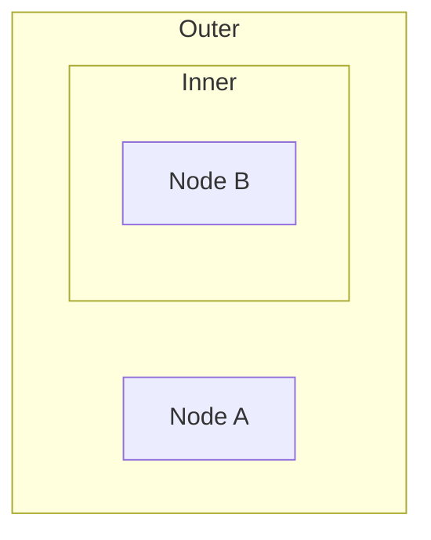

# Knowgrph Mermaid Frontmatter Architecture

## Design Mantras

```
- [ ] Isolation; separate diagram from content; forbid mixed-mode rendering
- [ ] Preservation; maintain nesting structure; forbid flattened hierarchies
- [ ] Performance; use efficient collision detection; forbid O(n²) overlap checks
- [ ] Topology-Driven; use graph structure for layout; forbid hardcoded node types
- [ ] Neutrality; support any diagram content; forbid domain-specific layout assumptions
- [ ] Configurability; externalize layout forces; forbid hardcoded physics parameters
```

---

## Mermaid Frontmatter Architecture

**Frontmatter Stack**: Markdown Source → Mermaid Diagram Kind Classifier → Mermaid Parser/Preserver → Scoped Nodes or Diagram Code → Layer Filter/Renderer Surface → Canvas Rendering

**Processing Flow**: Frontmatter Extraction → Mermaid Parsing → Scope Tagging → Subgraph Nesting → Layer Filtering → Mermaid Seed Layout → Force Layout → Port Positioning → Subgraph Rendering

**Design Principles**: Tag-Based Isolation | Topology-Driven Layout | Disjoint Component Separation | Port Handle Flow | Nested Subgraph Support

### High-Level Components

- **Mermaid Parser**: `markdownJsonLdMermaidParser.ts` processes Flowchart Mermaid code blocks, tagging nodes with `mermaidScope` and (for frontmatter) `isMermaidFrontmatter: true`.
- **Mermaid Diagram Kind Classifier**: `grph-shared/src/markdown/mermaidInput.ts` identifies Flowchart vs GitGraph declarations, skips Mermaid config headers, and splits mixed Mermaid blocks without file-specific heuristics.
- **GitGraph Renderer**: `canvas/src/components/MermaidGitGraphCanvas.tsx` renders frontmatter GitGraph code through the shared Mermaid SVG cache and adapts the output SVG into the shared D3 viewport runtime. `GitGraphFloatingPanelView` hosts command CRUD and writes back to the active Markdown/Source Files text through the shared GitGraph document hook. GitGraph blocks are preserved as `MermaidDiagram` code and are not expanded into Flowchart topology.
- **Layer Filter**: `layerDerivation.ts` derives a frontmatter-focused graph view: frontmatter Mermaid nodes/subgraphs plus any tied in-doc anchors/internal links/callouts reachable via `pointsTo` (e.g., Mermaid `click ... "#anchor"`).
- **Force Layout Engine**: Disjoint force layout separates disconnected components using `forceX`/`forceY` targets with `PackedRTree` for O(n log n) overlap broadphase.
- **Mermaid Seed Layout**: A fast, topology-aware seed that spreads top-level subgraphs across the 16:9 frame and recenters the centroid before simulation.
- **Port Handle System**: When enabled, edge endpoints route to cardinal handles; input/output nodes can be border-anchored using Mermaid direction (LR/RL/TB/BT).
- **Subgraph Renderer**: Visual group boxes rendered behind member nodes with support for nesting and z-ordering.

### Integration Bridge: Mermaid Frontmatter → Canvas Layout

| Frontmatter Stage             | Canvas Layout Equivalent              | Configuration Controls                                    |
|-------------------------------|---------------------------------------|-----------------------------------------------------------|
| Mermaid Code Extraction       | Frontmatter parsing                   | Markdown parser with frontmatter block detection          |
| Diagram Kind Classification   | Flowchart topology vs GitGraph code   | Shared Mermaid input helpers                             |
| Node Tagging                  | `mermaidScope` + `isMermaidFrontmatter` | Parser-emitted node properties                         |
| Subgraph Nesting              | `visual:parentId` assignments         | Hierarchical relationship preservation                    |
| Layer Filtering               | Frontmatter Mode toggle               | `layerDerivation.ts` filtering by tag                     |
| Component Separation          | Disjoint force layout                 | `layout.forces.disjointComponents` schema flag            |
| Port Handle Positioning       | Cardinal endpoints + optional anchoring | `behavior.portHandles.enabled` schema flag             |
| Subgraph Group Rendering      | Visual group boxes                    | `layout.groups` schema configuration                      |

---

## Component Responsibility Matrix

| Layer/Subsystem       | Path/Module                                   | Component                   | Interface/Method            | Responsibility (S-V-O)                                                                        | Dependencies                          | Contracts                                         | LOC    |
|-----------------------|-----------------------------------------------|-----------------------------|-----------------------------|-----------------------------------------------------------------------------------------------|---------------------------------------|---------------------------------------------------|--------|
| Mermaid Parser        | `canvas/src/features/parsers/markdownJsonLdMermaidParser.ts` | Mermaid Parser   | `parseMermaidFrontmatter`   | Parser → extracts Mermaid code → tags scope → preserves nesting → emits GraphData             | Markdown frontmatter + Mermaid syntax | Emits nodes tagged with `mermaidScope`           | ~600   |
| Mermaid Input Helpers | `grph-shared/src/markdown/mermaidInput.ts` | Diagram Kind Classifier | `readMermaidDiagramKind`, `splitMermaidDiagrams` | Classifier → skips Mermaid config headers → separates Flowchart and GitGraph slices → preserves diagram code | Mermaid code | Diagram kind plus diagram slices | ~150 |
| GitGraph Renderer | `canvas/src/components/MermaidGitGraphCanvas.tsx` | GitGraph Surface | default React component | Renderer → resolves frontmatter GitGraph code → renders Mermaid SVG → postprocesses SVG → delegates pan/zoom/fit to shared SVG runtime → syncs selected SVG label to shared GitGraph UI state | Graph metadata + Markdown text | Interactive GitGraph SVG surface | ~200 |
| GitGraph FloatingPanel | `canvas/src/features/gitgraph/GitGraphFloatingPanelView.tsx` | FloatingPanel GitGraph Commands | React view | View → reads shared GitGraph document hook → edits selected command with `CardInlineTextEditor` → appends/updates/deletes command source through shared writeback | Mermaid code + Markdown text + FloatingPanel state | Source-backed GitGraph command CRUD | ~220 |
| GitGraph Edit Helpers | `canvas/src/lib/mermaid/mermaidGitGraphEdit.ts` | GitGraph Source Transform | `parseMermaidGitGraphModel`, `replaceMermaidGitGraphCodeInMarkdown` | Helper → parses editable command lines → resolves selected labels → appends/updates/deletes command source → replaces only top-level YAML `mermaid` block | Mermaid code + Markdown text | Updated Mermaid code or Markdown source | ~300 |
| SVG Surface Viewport | `canvas/src/components/GraphCanvas/hooks/useSvgSurfaceZoomRuntime.ts` | SVG Viewport Adapter | `useSvgSurfaceZoomRuntime` | Adapter → measures SVG bounds → builds neutral visual-bounds graph → reuses D3 zoom/fit/toolbar owners → cleans listeners/RAF on unmount | SVG element + GraphData metadata | Keyed pan/zoom/fit state and generic SVG selection | ~500 |
| Layer Filter          | `canvas/src/lib/graph/layerDerivation.ts`     | Layer Derivation Engine     | `filterGraphToFrontmatterMermaid` | Filter → selects frontmatter Mermaid scope → expands via `pointsTo` to anchors/links/callouts → returns bounded focused graph | GraphData                             | Must not blank: if no frontmatter Mermaid nodes, return original GraphData | ~50    |
| Layout Engine         | `canvas/src/components/GraphCanvas/simulation.ts` | Force Simulation | `buildSimulation`       | Engine → seeds layout → runs forces → resolves overlaps → positions nodes                       | d3-force + native layout helpers      | Mutates node positions via simulation            | ~350   |
| Mermaid Seed Layout   | `canvas/src/components/GraphCanvas/layout/mermaidSeed.ts` | Mermaid Seed | `applyMermaidSeedLayout` | Seed → orders subgraphs → spreads bands → recenters centroid → forbids clustered layouts | Mermaid topology + grouping props     | Sets initial node positions                       | ~300   |
| Port Handle System    | `canvas/src/components/GraphCanvas/portHandles.ts` | Port Handles    | `getEdgeEndpointFromPorts`  | System → routes edge endpoints to handles → supports cardinal placement                         | Rect sizing + schema flags            | Computes edge endpoints for render tick           | ~100   |
| Subgraph Renderer     | `canvas/src/components/GraphCanvas/layers/groups.ts` | Group Renderer        | `createGroupsLayer`          | Renderer → computes group bounds/outlines → renders nested containers → manages z-order → draws group visuals | Canvas 2D context, geometry helpers    | Draws group overlays behind nodes                 | ~300   |
| Overlap Resolver      | `canvas/src/components/GraphCanvas/layout/overlap.ts` | Packed R-tree Collision  | `createBboxCollideForce`           | Resolver → builds packed R-tree → queries candidates → applies AABB push → achieves O(n log n)      | `PackedRTree` (local)                           | Mutates node velocities to eliminate overlaps      | ~250   |

---

## Mermaid Frontmatter Parsing Specifications

### Node Tagging Pattern

**From Mermaid Code → Scoped Nodes**: Mermaid diagrams are tagged with `properties.mermaidScope` and frontmatter diagrams also set `properties.isMermaidFrontmatter: true` → enables strict filtering without mixing content.

**Configuration Schema**:

```yaml
properties.mermaidScope:
  scope: node_local
  type: string enum ('frontmatter'|'block')
  mutability: immutable (set by parser)
  validation: enum
  impact: scopes Mermaid-derived nodes to their diagram source

properties.isMermaidFrontmatter:
  scope: node_local
  type: boolean
  mutability: immutable (set by parser)
  validation: boolean
  impact: marks nodes for frontmatter layer isolation

properties.visual:parentId:
  scope: node_local
  type: string (node ID)
  mutability: immutable (set by parser)
  validation: must reference valid parent subgraph ID
  impact: preserves subgraph nesting hierarchy

properties.visual:topParentId:
  scope: node_local
  type: string (node ID)
  mutability: immutable (set by parser)
  validation: must reference a top-level subgraph ID
  impact: stable top-level grouping for layout seeding and rendering
```

**Tagging Behavior**:

| Source Element        | Tagged Node Type       | Tag Properties                                           |
|-----------------------|------------------------|----------------------------------------------------------|
| Mermaid node          | `MermaidNode`          | `{isMermaidFrontmatter: true, type: "MermaidNode"}`      |
| Mermaid subgraph      | `MermaidSubgraph`      | `{isMermaidFrontmatter: true, type: "MermaidSubgraph"}`  |
| Nested subgraph       | `MermaidSubgraph`      | `{isMermaidFrontmatter: true, visual:parentId: "parent-id"}` |
| Mermaid GitGraph      | `MermaidDiagram`       | `{diagramKind: "gitgraph", isMermaidFrontmatter: true}`  |

**GitGraph behavior**: Mermaid `gitGraph` and `gitGraph:` declarations are diagram-code inputs. They must stay in `MermaidDiagram.properties.code` and must not emit `MermaidNode`, `MermaidSubgraph`, or Flowchart membership edges. Runtime viewport interactivity is applied after Mermaid renders the SVG and must remain a generic SVG viewport concern, not GitGraph semantic backfill. Inline CRUD remains source-text CRUD against the active YAML `mermaid: |` block; it updates Markdown/Source Files text and does not create a renderer-local GitGraph topology model.

**Design Compliance**:

| Context               | Intent                        | Directive                                                                                   | Module/Component          | Function/Method      | Input                     | Output                | Decision Logic                          |
|-----------------------|-------------------------------|---------------------------------------------------------------------------------------------|---------------------------|----------------------|---------------------------|-----------------------|-----------------------------------------|
| Frontmatter Detection | Identify Mermaid blocks       | - [ ] Scan frontmatter for Mermaid code blocks; forbid missing detection                   | Mermaid parser            | `detectMermaidBlocks` | frontmatter text         | Mermaid code array    | regex match for ```mermaid blocks       |
| Node Tag Assignment   | Mark frontmatter nodes        | - [ ] Set `isMermaidFrontmatter: true` on all parsed nodes; forbid untagged Mermaid nodes  | Mermaid parser            | `tagMermaidNodes`    | parsed nodes              | tagged nodes          | properties assignment during parse      |
| Parent ID Preservation| Maintain nesting              | - [ ] Assign `visual:parentId` for nested nodes; forbid flattened hierarchies              | Mermaid parser            | `assignParentIds`    | subgraph hierarchy        | nodes with parent refs| recursive traversal + ID assignment     |

---

### Subgraph Nesting Preservation

**Nesting Pattern**: Mermaid `subgraph` statements → hierarchical structure → `visual:parentId` links → nested rendering.

**Example Mermaid Source**:



**Resulting Graph Structure**:

```json
{
  "nodes": [
    {
      "id": "outer",
      "type": "MermaidSubgraph",
      "label": "Outer",
      "properties": {"isMermaidFrontmatter": true}
    },
    {
      "id": "inner",
      "type": "MermaidSubgraph",
      "label": "Inner",
      "properties": {
        "isMermaidFrontmatter": true,
        "visual:parentId": "outer"
      }
    },
    {
      "id": "a",
      "type": "MermaidNode",
      "label": "Node A",
      "properties": {
        "isMermaidFrontmatter": true,
        "visual:parentId": "outer"
      }
    },
    {
      "id": "b",
      "type": "MermaidNode",
      "label": "Node B",
      "properties": {
        "isMermaidFrontmatter": true,
        "visual:parentId": "inner"
      }
    }
  ]
}
```

**Design Compliance**:

| Context               | Intent                        | Directive                                                                                   | Module/Component          | Function/Method      | Input                     | Output                | Decision Logic                          |
|-----------------------|-------------------------------|---------------------------------------------------------------------------------------------|---------------------------|----------------------|---------------------------|-----------------------|-----------------------------------------|
| Hierarchy Extraction  | Parse subgraph nesting        | - [ ] Build parent-child tree from Mermaid syntax; forbid lossy nesting                    | Mermaid parser            | `extractHierarchy`   | Mermaid AST               | hierarchy tree        | recursive AST traversal                 |
| Parent ID Assignment  | Link children to parents      | - [ ] Set `visual:parentId` on all nested nodes; forbid orphaned children                  | Mermaid parser            | `linkChildrenToParents` | hierarchy tree         | nodes with parent IDs | tree traversal + property assignment    |

---

## Layer Filtering Specifications

### Frontmatter Mode Toggle

**Filtering Mechanism**: When Frontmatter Mode enabled → filter graph to show only nodes with `isMermaidFrontmatter: true` → effectively isolates diagram.

**Configuration Schema**:

```yaml
frontmatterMode.enabled:
  scope: ui_global
  type: boolean
  mutability: runtime_configurable
  validation: boolean
  impact: enables/disables Mermaid frontmatter isolation (default: false)

layerDerivation.frontmatterFilter:
  scope: layer_processing
  type: function
  mutability: immutable (core logic)
  validation: N/A (code implementation)
  impact: filters nodes by frontmatter scope tags (`isMermaidFrontmatter` or `mermaidScope`)
```

**Filtering Behavior**:

| Frontmatter Mode | Visible Nodes                                   | Visible Edges                              |
|------------------|------------------------------------------------|--------------------------------------------|
| Enabled          | Only nodes tagged as frontmatter Mermaid        | Edges between visible nodes                |
| Disabled         | All nodes                                      | All edges                                  |

**Design Compliance**:

| Context               | Intent                        | Directive                                                                                   | Module/Component          | Function/Method      | Input                     | Output                | Decision Logic                          |
|-----------------------|-------------------------------|---------------------------------------------------------------------------------------------|---------------------------|----------------------|---------------------------|-----------------------|-----------------------------------------|
| Mode Toggle           | Enable/disable filtering      | - [ ] Update UI toggle state; trigger filter recomputation; forbid stale filtering         | Layer UI                  | `toggleFrontmatterMode` | click event            | void (state update)   | boolean toggle + refilter trigger       |
| Node Filtering        | Isolate tagged nodes          | - [ ] Filter nodes by `isMermaidFrontmatter` property; forbid partial filtering            | Layer derivation          | `filterFrontmatterNodes` | nodes, mode enabled  | filtered nodes        | node.properties.isMermaidFrontmatter check|
| Edge Pruning          | Remove orphaned edges         | - [ ] Remove edges with hidden endpoints; forbid dangling edges                            | Layer derivation          | `pruneOrphanedEdges` | edges, visible nodes      | filtered edges        | source ∈ visible AND target ∈ visible   |

---

## Disjoint Force Layout Specifications

### Component Separation Algorithm

**From Disconnected Graph → Separated Components**: Detect connected components → assign cluster centers → apply `forceX`/`forceY` to separate → resolve overlaps with packed R-tree broadphase.

**Configuration Schema**:

```yaml
layout.forces.disjointComponents:
  scope: layout_global
  type: boolean
  mutability: runtime_configurable
  validation: boolean
  impact: enables component separation (default: true for Mermaid frontmatter)

layout.forces.componentSeparation:
  scope: layout_global
  type: number
  mutability: runtime_configurable
  validation: must be positive number
  impact: distance between component centers (default: 300 pixels)
```

**Processing Flow**:

| Stage                    | Input                          | Output                         | Responsibility                                              | Performance Consideration                    |
|--------------------------|--------------------------------|--------------------------------|-------------------------------------------------------------|----------------------------------------------|
| Component Detection      | Graph nodes and edges          | Component clusters             | Identify disconnected components via BFS/DFS                | O(n + m) graph traversal                     |
| Center Assignment        | Component clusters             | Target positions               | Compute cluster centers on circle or grid                   | O(k) where k = components                    |
| Force Application        | Nodes, target positions        | Force vectors                  | Apply `forceX`/`forceY` toward cluster centers              | O(n) per simulation tick                     |
| Overlap Resolution       | Positioned nodes               | Collision-free positions       | Build packed R-tree, query candidates, adjust positions     | O(n log n) packed R-tree broadphase|

**Design Compliance**:

| Context               | Intent                        | Directive                                                                                   | Module/Component          | Function/Method      | Input                     | Output                | Decision Logic                          |
|-----------------------|-------------------------------|---------------------------------------------------------------------------------------------|---------------------------|----------------------|---------------------------|-----------------------|-----------------------------------------|
| Component Detection   | Find disconnected parts       | - [ ] Use BFS/DFS to identify components; forbid missing components                        | Force layout              | `detectComponents`   | nodes, edges              | component clusters    | graph traversal algorithm               |
| Target Computation    | Position component centers    | - [ ] Arrange centers on circle or grid; forbid overlapping centers                        | Force layout              | `computeCenters`     | component count           | center positions      | circular or grid layout of centers      |
| Force Configuration   | Apply separation forces       | - [ ] Set `forceX`/`forceY` strengths; apply to nodes; forbid unforced components          | Force layout              | `applyComponentForces` | nodes, centers          | force simulation      | d3.forceX/forceY with target positions  |
| Packed R-tree Overlap      | Resolve collisions            | - [ ] Build packed R-tree; query nearby nodes; adjust positions; forbid O(n²) collision checks | Overlap resolver          | `createBboxCollideForce`    | node positions            | adjusted positions    | packed R-tree query + AABB push   |

---

## Port Handle Layout Specifications

### Topology-Driven Positioning

**From Graph Topology → Left-Right Flow**: Analyze in-degree/out-degree → classify as input/output/process → apply X-axis constraints → create left-to-right flow.

**Configuration Schema**:

```yaml
behavior.portHandles.enabled:
  scope: layout_global
  type: boolean
  mutability: runtime_configurable
  validation: boolean
  impact: enables topology-based port positioning (default: false)

layout.portHandles.inputX:
  scope: layout_global
  type: number
  mutability: runtime_configurable
  validation: X coordinate for input nodes
  impact: left edge position for source nodes (default: frameW * 0.1)

layout.portHandles.outputX:
  scope: layout_global
  type: number
  mutability: runtime_configurable
  validation: X coordinate for output nodes
  impact: right edge position for sink nodes (default: frameW * 0.9)
```

**Node Classification**:

| Node Type         | In-Degree | Out-Degree | X Position         | Rationale                                  |
|-------------------|-----------|------------|--------------------|-------------------------------------------|
| Input Node        | 0         | > 0        | Left (frameW * 0.1)| Sources have no incoming edges            |
| Output Node       | > 0       | 0          | Right (frameW * 0.9)| Sinks have no outgoing edges             |
| Process Node      | > 0       | > 0        | Center (variable)  | Intermediate nodes remain in flow         |

**Design Compliance**:

| Context               | Intent                        | Directive                                                                                   | Module/Component          | Function/Method      | Input                     | Output                | Decision Logic                          |
|-----------------------|-------------------------------|---------------------------------------------------------------------------------------------|---------------------------|----------------------|---------------------------|-----------------------|-----------------------------------------|
| Degree Calculation    | Compute node topology         | - [ ] Count in-degree and out-degree per node; forbid missing edge consideration           | Port handle system        | `computeDegrees`     | nodes, edges              | degree map            | edge endpoint counting                  |
| Node Classification   | Categorize by topology        | - [ ] Classify as input/output/process; forbid hardcoded type names                        | Port handle system        | `classifyNodes`      | degree map                | node categories       | in/out degree comparison                |
| X Constraint Application | Position by category       | - [ ] Set X position for inputs/outputs; forbid Y constraints (preserve vertical freedom)  | Port handle system        | `applyPortConstraints` | classified nodes        | X position overrides  | conditional X assignment by category    |

---

## Subgraph Rendering Specifications

### Group Box Visualization

**From Subgraph Nodes → Visual Containers**: Identify subgraph members → compute bounds → render rectangular/geo container → manage nesting z-order.

**Configuration Schema**:

```yaml
layout.groups.enabled:
  scope: layout_global
  type: boolean
  mutability: runtime_configurable
  validation: boolean
  impact: enables subgraph container rendering (default: true)

layout.groups.padding:
  scope: layout_global
  type: number
  mutability: runtime_configurable
  validation: must be non-negative
  impact: padding around member nodes in pixels (default: 12)

layout.groups.opacity:
  scope: layout_global
  type: number
  mutability: runtime_configurable
  validation: must be in range [0, 1]
  impact: container fill opacity (default: 0.1)

layout.groups.strokeWidth:
  scope: layout_global
  type: number
  mutability: runtime_configurable
  validation: must be non-negative
  impact: container border width in pixels (default: 1)
```

**Rendering Flow**:

| Stage                    | Input                          | Output                         | Responsibility                                              | Performance Consideration                    |
|--------------------------|--------------------------------|--------------------------------|-------------------------------------------------------------|----------------------------------------------|
| Member Identification    | Subgraph nodes, relationships  | Member node sets               | Extract nodes with matching `visual:parentId`               | O(n) node iteration                          |
| Bounds Calculation       | Member node positions          | Bounding rectangles            | Compute min/max X/Y with padding                            | O(m) where m = members per subgraph          |
| Z-Order Sorting          | Subgraph nesting levels        | Render order                   | Sort by nesting depth (outermost first)                     | O(k log k) where k = subgraphs               |
| Outline Rendering        | Bounding rectangles, styles    | Canvas rectangles              | Draw filled/stroked rectangles behind nodes                 | O(k) subgraph drawing                        |

**Design Compliance**:

| Context               | Intent                        | Directive                                                                                   | Module/Component          | Function/Method      | Input                     | Output                | Decision Logic                          |
|-----------------------|-------------------------------|---------------------------------------------------------------------------------------------|---------------------------|----------------------|---------------------------|-----------------------|-----------------------------------------|
| Member Extraction     | Find subgraph children        | - [ ] Filter nodes by `visual:parentId`; forbid missing member detection                   | Subgraph renderer         | `extractMembers`     | subgraph ID, nodes        | member nodes          | nodes.filter(n => n.visual:parentId === id)|
| Bounds Computation    | Calculate container bounds    | - [ ] Compute min/max X/Y; add padding; forbid zero-size containers                         | Group renderer            | `computeGroupBounds`  | member positions, padding | {x, y, w, h} rect     | Math.min/max + padding addition         |
| Nesting Level Calculation | Determine z-order          | - [ ] Count ancestor subgraphs; assign render order; forbid incorrect layering             | Subgraph renderer         | `computeNestingLevel` | subgraph, hierarchy      | nesting depth         | recursive parent traversal + count      |
| Outline Drawing       | Render group boxes/outlines   | - [ ] Draw rectangles with opacity/stroke; forbid rendering above nodes                    | Subgraph renderer         | `drawGroupOutline`   | bounds, style config      | canvas drawing        | ctx.fillRect + ctx.strokeRect with alpha|

---

## Data Flow: Frontmatter Parsing → Rendering

**Pipeline**: Markdown Source → Frontmatter Extraction → Mermaid Parsing → Node Tagging → Layer Filtering → Component Detection → Force Layout → Port Positioning → Overlap Resolution → Subgraph Rendering → Canvas Display

| Stage                    | Input                          | Output                         | Responsibility                                              | Performance Consideration                    |
|--------------------------|--------------------------------|--------------------------------|-------------------------------------------------------------|----------------------------------------------|
| Frontmatter Extraction   | Markdown text                  | Mermaid code blocks            | Extract `mermaid:` frontmatter section                      | O(n) frontmatter parsing                     |
| Mermaid Parsing          | Mermaid code                   | AST                            | Parse Mermaid syntax into structured tree                   | O(m) Mermaid parsing where m = code length   |
| Node Tagging             | Mermaid AST                    | Tagged nodes                   | Create nodes with `isMermaidFrontmatter: true`              | O(k) where k = Mermaid elements              |
| Layer Filtering          | Tagged nodes, mode enabled     | Filtered nodes                 | Isolate Mermaid nodes when mode active                      | O(n) filtering                               |
| Component Detection      | Filtered nodes                 | Component clusters             | Identify disconnected subgraphs                             | O(n + m) graph traversal                     |
| Force Layout             | Component clusters             | Positioned nodes               | Apply separation forces and standard physics                | O(n) per tick, multiple ticks                |
| Port Positioning         | Positioned nodes, topology     | Constrained positions          | Apply X constraints for input/output nodes                  | O(n) degree calculation + positioning        |
| Overlap Resolution       | Constrained positions          | Collision-free positions       | Packed R-tree broadphase overlap detection and adjustment   | O(n log n) packed R-tree operations          |
| Subgraph Rendering       | Final positions, subgraph data | Visual group boxes/outlines    | Compute bounds, render behind nodes                         | O(k) group rendering                         |
| Canvas Display           | Final scene                    | Rendered visualization         | Draw nodes, edges, group outlines to canvas                 | O(n + m) drawing operations                  |

---

## Testing & Quality Standards

**Test Coverage Metrics**

| Context              | Intent                          | Directive                                                                                   |
|----------------------|---------------------------------|---------------------------------------------------------------------------------------------|
| Mermaid Parsing      | Validate syntax handling        | - [ ] Test node/edge extraction; verify subgraph nesting; forbid parse errors             |
| Layer Filtering      | Ensure isolation                | - [ ] Test frontmatter mode toggle; verify only tagged nodes visible; forbid mixed content|
| Component Separation | Validate force layout           | - [ ] Test disconnected components; verify spatial separation; forbid overlapping clusters |

**Test Categories**:

- **Unit Tests**: Mermaid parser, layer filter, degree calculator, bounds calculator.
- **Integration Tests**: Full frontmatter → filtered layout → rendering pipeline.
- **Performance Tests**: Packed R-tree broadphase overlap resolution with large graphs (>1000 nodes).

**Quality Gates**:

| Context              | Intent                          | Directive                                                                                   |
|----------------------|---------------------------------|---------------------------------------------------------------------------------------------|
| Parse Completeness   | Ensure no element loss          | - [ ] Verify all Mermaid elements parsed; forbid missing nodes/edges                       |
| Nesting Preservation | Maintain hierarchy              | - [ ] Verify `visual:parentId` correctness; forbid flattened subgraphs                     |
| Collision Freedom    | Ensure readable layout          | - [ ] Verify no overlapping nodes after layout; forbid unresolved collisions               |

---

## Repository Health Checklist

**Parser Health**:

| Context              | Status | Directive                                                                                   |
|----------------------|--------|---------------------------------------------------------------------------------------------|
| Mermaid Syntax Support | ☐    | - [ ] Support latest Mermaid flowchart syntax; forbid outdated parser                      |
| Tag Consistency      | ☐      | - [ ] All frontmatter nodes tagged; forbid missing `isMermaidFrontmatter` flags            |
| Nesting Integrity    | ☐      | - [ ] Subgraph nesting correctly preserved; forbid broken parent-child links               |

**Layout Health**:

| Context              | Status | Directive                                                                                   |
|----------------------|--------|---------------------------------------------------------------------------------------------|
| Component Separation | ☐      | - [ ] Disconnected components visually separated; forbid overlapping clusters              |
| Port Handle Accuracy | ☐      | - [ ] Input nodes on left, output nodes on right; forbid incorrect topology classification|
| Overlap Resolution   | ☐      | - [ ] Packed R-tree overlap broadphase active; forbid O(n²) collision checks               |

**Rendering Health**:

| Context              | Status | Directive                                                                                   |
|----------------------|--------|---------------------------------------------------------------------------------------------|
| Subgraph Visibility  | ☐      | - [ ] Hulls render behind nodes; forbid z-order issues                                     |
| Nesting Visualization| ☐      | - [ ] Nested subgraphs visually distinct; forbid indistinguishable nesting levels          |

---

## Anti-Patterns (Forbidden)

| Context              | Intent                          | Directive                                                                                   |
|----------------------|---------------------------------|---------------------------------------------------------------------------------------------|
| Hardcoded Node Types | Enable generic diagrams         | - [ ] Use topology for layout; forbid assuming specific types like "Idea" or "Task"        |
| Manual Tag Setting   | Automate tagging                | - [ ] Parser sets `isMermaidFrontmatter`; forbid manual tag assignment in UI               |
| O(n²) Collision Detection | Use efficient algorithms    | - [ ] Use packed R-tree broadphase for overlap; forbid nested loop collision checks        |
| Fixed Layout Dimensions | Support responsive sizing    | - [ ] Use dynamic `frameW`/`frameH`; forbid hardcoded pixel values for layout bounds       |
| Mixed Mode Rendering | Maintain isolation              | - [ ] When frontmatter mode active, show only tagged nodes; forbid mixing content and diagram|

---

## Performance Optimization

### Packed R-tree Collision Broadphase

**Algorithm**: O(n log n) broadphase collision candidate lookup using a packed static R-tree (Morton/Z-order sorting), instead of O(n²) pairwise checks.

**Implementation**:

```typescript
const index = new PackedRTree(items)

for (const a of items) {
  const minX = a.cx - a.halfW
  const maxX = a.cx + a.halfW
  const minY = a.cy - a.halfH
  const maxY = a.cy + a.halfH

  index.query(minX, minY, -Infinity, maxX, maxY, Infinity, (b) => {
    if (b.id <= a.id) return
    // compute overlap; apply least-penetration-axis push (respect pinned)
  })
}
```

**Performance Gain**: ~100x speedup for 1000+ nodes compared to nested loop approach.

**Design Compliance**:

| Context               | Intent                        | Directive                                                                                   | Module/Component          | Function/Method      | Input                     | Output                | Decision Logic                          |
|-----------------------|-------------------------------|---------------------------------------------------------------------------------------------|---------------------------|----------------------|---------------------------|-----------------------|-----------------------------------------|
| Packed R-tree Construction | Build spatial index       | - [ ] Create packed R-tree from AABB items; forbid incomplete indexing                      | Overlap resolver          | `new PackedRTree`    | AABB items                | packed R-tree         | Morton sort + packed levels             |
| Collision Detection   | Find candidate pairs          | - [ ] Query the index by AABB; forbid pairwise iteration                                   | Overlap resolver          | `query`              | packed R-tree, target AABB | candidate items       | bounding-box query
| Position Adjustment   | Resolve overlaps              | - [ ] Compute overlap vector; adjust positions; forbid incomplete resolution                | Overlap resolver          | `adjustPositions`    | collision pairs           | adjusted positions    | vector math + position update           |

---

## Configuration Examples

### Enable Frontmatter Mode with Component Separation

```json
{
  "frontmatterMode": {
    "enabled": true
  },
  "layout": {
    "forces": {
      "disjointComponents": true,
      "componentSeparation": 400
    },
    "groups": {
      "enabled": true,
      "padding": 16,
      "opacity": 0.15
    }
  }
}
```

### Enable Port Handles for Flow Layout

```json
{
  "behavior": {
    "portHandles": {
      "enabled": true
    }
  },
  "layout": {
    "portHandles": {
      "inputX": "frameW * 0.05",
      "outputX": "frameW * 0.95"
    }
  }
}
```

### Nested Subgraph Rendering

```json
{
  "layout": {
    "groups": {
      "enabled": true,
      "padding": 20,
      "opacity": 0.12,
      "strokeWidth": 2,
      "nestingColors": ["#e8f4f8", "#d4e9f2", "#c0deec"]
    }
  }
}
```
