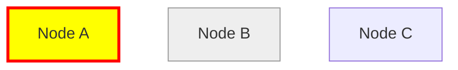

# Knowgrph Mermaid Layout Configuration Architecture

## Design Mantras

```
- [ ] Visual Consistency; maintain unified styling; forbid layout-specific color divergence
- [ ] Interactivity; enable dragging; forbid static-only layouts
- [ ] Robustness; prevent layout crashes; forbid unstable topology handling
- [ ] Performance; use revision-aware caching; forbid redundant computations
- [ ] Configurability; externalize all parameters; forbid hardcoded layout values
- [ ] Compliance; support Mermaid syntax; forbid incompatible extensions
```
## Mermaid Layout Architecture

**Layout Stack**: Mermaid code → Mermaid parser → GraphData → Mermaid seed layout (initial positions) → Force simulation → Interactive dragging → Canvas rendering

**Data Flow**: GraphData → Subgraph group derivation → Mermaid seed layout → Force layout forces → Group outline rendering → Edge rendering → Label rendering

**Design Principles**: Schema-Driven Styling | Seeded Stability | Crash Prevention | 16:9 Fit-to-View | Minimal Configuration Surface

### High-Level Components

- **Layout Seed Engine**: `canvas/src/components/GraphCanvas/layout/mermaidSeed.ts` assigns stable initial positions for Mermaid graphs inside Force mode.
- **Parser Integration**: `canvas/src/features/parsers/markdownJsonLdMermaidParser.ts` provides Mermaid AST to GraphData conversion.
- **Scene Orchestration**: `canvas/src/components/GraphCanvas/scene.ts` coordinates layout computation, rendering, and interaction.
- **Group Derivation**: `canvas/src/components/GraphCanvas/layout/mermaidSubgraphGroups.ts` derives Mermaid subgraph groups for rendering outlines.
- **Direction Parsing**: `canvas/src/components/GraphCanvas/layout/mermaidDirection.ts` reads Mermaid flow direction (TB/LR/etc) from Mermaid diagram nodes.
- **Drag Behavior**: `canvas/src/components/GraphCanvas/drag.ts` implements node dragging with optional snap-grid and constraints.
- **Rendering Layers**: `canvas/src/components/GraphCanvas/layers/` provides nodes, links, labels, and group outlines with z-order management.

### Schema-Driven Render Order (Mermaid)

To make Mermaid layering deterministic without relying on Mermaid draw-order, Canvas reads an optional schema mapping:

```json
{
  "layout": {
    "mermaid": {
      "renderOrder": {
        "MermaidSubgraph": -10,
        "MermaidNode": 0,
        "edge": 10
      }
    }
  }
}
```

### Integration Bridge: Mermaid Layout → Canvas Renderer

| Mermaid Layout Stage          | Canvas Renderer Equivalent            | Configuration Controls                                    |
|-------------------------------|---------------------------------------|-----------------------------------------------------------|
| Topology Validation           | Graph preprocessing                   | Filter self-loops, validate edge endpoints                |
| Compound Hierarchy Setup      | Parent-child relationship mapping     | Dagre `compound` mode with `setParent` calls              |
| Dagre Layout Execution        | Position computation                  | `network-simplex` ranker, `nodesep`/`ranksep` spacing     |
| Centering & Scaling           | 16:9 frame alignment                  | `fitPadding`, `fitTargetAspectRatio` schema settings      |
| Group Outline Rendering       | Subgraph box/outline visualization    | `layout.groups` configuration with rectangular outlines   |
| Node Rendering                | Styled geometric nodes (circle/rect/diamond/hex) | Schema-driven `getNodeBaseFill`, Mermaid shape syntax (`(( ))`, `[ ]`, `{ }`, `{{ }}`, `@{ shape: ... }`) |
| Edge Rendering                | Direct lines with arrow markers       | Endpoints clipped/offset to node bounds; hit layer separate from visuals |
| Interactive Dragging          | Rigid group movement                  | Subgraph centroid dragging with member node synchronization|

---

## Component Responsibility Matrix

| Layer/Subsystem       | Path/Module                                   | Component                   | Interface/Method            | Responsibility (S-V-O)                                                                        | Dependencies                          | Contracts                                         | LOC    |
|-----------------------|-----------------------------------------------|-----------------------------|-----------------------------|-----------------------------------------------------------------------------------------------|---------------------------------------|---------------------------------------------------|--------|
| Layout Seed Engine    | `canvas/src/components/GraphCanvas/layout/mermaidSeed.ts` | Mermaid Seed Layout | `applyMermaidSeedLayout`    | Engine → detects uninitialized layouts → groups Mermaid nodes → assigns stable seed positions  | Seed grid, Mermaid direction          | Mutates node positions and resets velocities      | ~300   |
| Group Derivation      | `canvas/src/components/GraphCanvas/layout/mermaidSubgraphGroups.ts` | Mermaid Subgraph Groups | `deriveMermaidSubgraphGroups` | Deriver → reads Mermaid subgraph membership edges → builds nested groups for rendering outlines | GraphData                             | Returns groups with member ids and depth          | ~125   |
| Direction Parsing     | `canvas/src/components/GraphCanvas/layout/mermaidDirection.ts` | Mermaid Direction     | `readMermaidAxisFromNodes`  | Parser → reads Mermaid flow direction from diagram code → maps to axis/forward                 | Mermaid diagram node properties       | Returns axis/forward used for seeding and ports   | ~25    |
| Drag Handler          | `canvas/src/components/GraphCanvas/drag.ts`   | Node Drag                  | `nodeDragBehavior`          | Handler → drags nodes → applies snap/constraints → releases forces per mode                    | d3-drag                               | Updates node fx/fy and velocities                 | ~70    |
| Group Renderer        | `canvas/src/components/GraphCanvas/layers/groups.ts` | Subgraph Renderer     | `createGroupsLayer`          | Renderer → computes bounds/outlines → draws behind nodes → manages z-order → applies padding  | Canvas 2D context                     | Draws subgraph containers                         | ~200   |
| Node Renderer         | `canvas/src/components/GraphCanvas/layers/nodes.ts` | Mermaid Node Renderer | `createNodesLayer`          | Renderer → applies schema colors → renders node shapes → wraps labels → supports `classDef`     | Schema config, label layout           | Draws styled geometric nodes                      | ~300   |
| Edge Renderer         | `canvas/src/components/GraphCanvas/layers/links.ts` | Mermaid Edge Renderer | `createLinksLayer`          | Renderer → draws direct line edges → applies edge styles and arrow markers                      | d3                                    | Draws styled edges (visuals) + hit layer          | ~200   |

---

## Mermaid Layout Engine Specifications

### Seed Layout Algorithm

**From GraphData → Stable Initial Positions**: Detect uninitialized positions → read Mermaid direction (TB/LR/etc) → group nodes by `visual:topParentId`/`visual:parentId` → seed each group into a grid band → layer nodes inside each group by `pointsTo` ranks → center result in the frame.

**Configuration Schema**:

```yaml
layout.mode:
  scope: layout_global
  type: string (enum: "force" | "radial")
  mutability: runtime_configurable
  validation: valid layout mode
  impact: enables Mermaid-aware seeding inside Force mode

schema.layout.fitPadding:
  scope: layout_global
  type: number
  mutability: runtime_configurable
  validation: must be non-negative
  impact: padding used by the seed grid (default: 80)
```

**Processing Flow**:

| Stage                    | Input                          | Output                         | Responsibility                                              | Performance Consideration                    |
|--------------------------|--------------------------------|--------------------------------|-------------------------------------------------------------|----------------------------------------------|
| Seed Eligibility Check   | nodes                           | skip/continue                  | Skip if enough nodes already have finite positions          | O(n)                                         |
| Mermaid Direction Read   | Mermaid diagram nodes           | axis + forward                 | Parse flow direction from Mermaid code (TB/LR/etc)          | O(n + lines)                                 |
| Group Extraction         | Mermaid nodes                   | groups + order                 | Group by `visual:topParentId`/`visual:parentId` and order by inter-group edges | O(n + m)                      |
| In-Group Layering        | group nodes + `pointsTo` edges  | ranked layers                  | Compute lightweight ranks inside each group                 | O(n + m)                                     |
| Seed Placement           | groups + layers + frame bounds  | positioned nodes               | Place groups into a seed grid and spread nodes inside boxes | O(n)                                         |
| Centering                | positioned nodes                | centered positions             | Center seeded layout within canvas frame                    | O(n)                                         |

**Overlap Enforcement**: Force mode enforces node-level bbox collision (`schema.layout.forces.bboxCollide*`). Group-level bbox collision is enforced whenever `schema.layout.groups.enabled !== false`; `schema.layout.forces.groupBboxCollide` is deprecated for disabling but its `*Strength/*Padding/*Iterations` still tune the constraint. Group keys are derived consistently (Mermaid subgraphs + Markdown structure), and group boxes use label-aware node AABBs so outlines don’t clip labels.

**Design Compliance**:

| Context               | Intent                        | Directive                                                                                   | Module/Component          | Function/Method      | Input                     | Output                | Decision Logic                          |
|-----------------------|-------------------------------|---------------------------------------------------------------------------------------------|---------------------------|----------------------|---------------------------|-----------------------|-----------------------------------------|
| Topology Validation   | Prevent layout crashes        | - [ ] Filter self-loops; validate edge endpoints; forbid invalid topology                  | Topology validator        | `validateTopology`   | nodes, edges              | validated edges       | edge.source !== edge.target + endpoint exists|
| Dagre Construction    | Build layout graph            | - [ ] Create Dagre graph; add nodes/edges; forbid missing elements                         | Layout engine             | `buildDagreGraph`    | validated graph           | Dagre graph object    | dagre.Graph() + setNode/setEdge calls   |
| Compound Setup        | Enable nesting                | - [ ] Set parent relationships; enable compound mode; forbid flat hierarchies              | Layout engine             | `setupCompound`      | subgraph hierarchy        | Dagre with parents    | graph.setParent(child, parent) calls    |
| Spacing Calculation   | Optimize layout density       | - [ ] Compute nodesep/ranksep; account for label padding; forbid overlap                   | Layout engine             | `computeSpacing`     | separation multiplier     | spacing values        | base * multiplier + label padding       |
| Layout Execution      | Run Dagre algorithm           | - [ ] Execute dagre.layout; extract positions; forbid layout failures                      | Layout engine             | `executeDagre`       | Dagre graph               | positioned graph      | dagre.layout(graph) invocation          |
| Centering             | Align to 16:9 frame           | - [ ] Compute bbox center; translate to frame center; forbid off-center layouts            | Post-processor            | `centerLayout`       | positions, frame dims     | centered positions    | translate by (frameCenter - bboxCenter) |

---

## Visual Consistency Specifications

### Schema-Driven Color Palette

**Unified Styling**: Mermaid nodes use same `getNodeBaseFill` function as Force/Radial layouts → ensures color consistency across layout modes.

**Configuration Schema**:

```yaml
schema.nodeColors:
  scope: schema_global
  type: object (type → color mapping)
  mutability: deployment_configurable
  validation: valid CSS colors or hex codes
  impact: determines node fill colors across all layout modes

schema.nodeStroke:
  scope: schema_global
  type: object (type → stroke config)
  mutability: deployment_configurable
  validation: {color: string, width: number}
  impact: node border styling (default: {color: "#333", width: 1})

mermaid.classDef:
  scope: mermaid_specific
  type: object (class → style mapping)
  mutability: runtime_configurable (from frontmatter)
  validation: {fill: color, stroke: color, stroke-width: number}
  impact: overrides schema colors for specific node classes
```

**Color Resolution Priority**:

| Priority | Source                  | Example                                      | Override Behavior                           |
|----------|-------------------------|----------------------------------------------|---------------------------------------------|
| 1        | Mermaid `classDef`      | `classDef highlight fill:#ff0,stroke:#f00`  | Highest priority, overrides schema          |
| 2        | Schema `nodeColors`     | `{MermaidNode: "#4A90E2"}`                   | Applies when no `classDef` assigned         |
| 3        | Default palette         | `getNodeBaseFill` fallback                   | Applies when type not in schema             |

**Design Compliance**:

| Context               | Intent                        | Directive                                                                                   | Module/Component          | Function/Method      | Input                     | Output                | Decision Logic                          |
|-----------------------|-------------------------------|---------------------------------------------------------------------------------------------|---------------------------|----------------------|---------------------------|-----------------------|-----------------------------------------|
| Color Resolution      | Apply style hierarchy         | - [ ] Check `classDef` first; fall back to schema; forbid ignoring hierarchy               | Node renderer             | `resolveNodeColor`   | node, schema, classDef    | color string          | priority-based lookup (classDef → schema → default)|
| Schema Application    | Ensure cross-layout consistency | - [ ] Use `getNodeBaseFill` for Mermaid; forbid Mermaid-specific color logic             | Node renderer             | `applySchemaColor`   | node, schema              | color string          | getNodeBaseFill(node.type, schema)      |
| ClassDef Parsing      | Extract frontmatter styles    | - [ ] Parse `classDef` statements; build style map; forbid malformed styles                | Mermaid parser            | `parseClassDef`      | Mermaid code              | classDef map          | regex extraction + CSS parsing          |

---

### Frontmatter `classDef` Support

**From Mermaid Frontmatter → Custom Styles**: Parse `classDef` statements → extract fill/stroke/width → apply to nodes with matching `class` assignments.

**Example Mermaid Frontmatter**:



**Resulting Style Application**:

```json
{
  "classDef": {
    "highlight": {"fill": "#ff0", "stroke": "#f00", "stroke-width": 3},
    "subtle": {"fill": "#eee", "stroke": "#999"}
  },
  "nodes": [
    {"id": "A", "class": "highlight"},
    {"id": "B", "class": "subtle"},
    {"id": "C"}  // Uses schema default
  ]
}
```

**Design Compliance**:

| Context               | Intent                        | Directive                                                                                   | Module/Component          | Function/Method      | Input                     | Output                | Decision Logic                          |
|-----------------------|-------------------------------|---------------------------------------------------------------------------------------------|---------------------------|----------------------|---------------------------|-----------------------|-----------------------------------------|
| ClassDef Parsing      | Extract style definitions     | - [ ] Parse `classDef` lines; extract CSS properties; forbid malformed syntax              | Mermaid parser            | `parseClassDef`      | Mermaid text              | classDef object       | regex match + CSS property extraction   |
| Class Assignment      | Link nodes to styles          | - [ ] Parse `:::className` syntax; assign to nodes; forbid missing class references        | Mermaid parser            | `assignNodeClasses`  | Mermaid AST               | nodes with class props| AST traversal + class extraction        |
| Style Application     | Apply custom styles           | - [ ] Lookup class in classDef; apply fill/stroke; forbid ignoring custom styles           | Node renderer             | `applyClassDefStyle` | node, classDef map        | applied styles        | map lookup + style override             |

---

## Interactive Dragging Specifications

### Rigid Group Dragging

**From Drag Event → Synchronized Movement**: Detect drag target (node or subgraph) → determine affected group → move all members rigidly → preserve relative positions.

**Configuration Schema**:

```yaml
drag.mermaid.rigidGroups:
  scope: drag_behavior
  type: boolean
  mutability: deployment_configurable
  validation: boolean
  impact: enables rigid group dragging for subgraphs (default: true)

drag.mermaid.persistPositions:
  scope: drag_behavior
  type: boolean
  mutability: deployment_configurable
  validation: boolean
  impact: disables physics forces to keep dragged positions fixed (default: true)
```

**Drag Behavior Patterns**:

| Drag Target           | Affected Nodes                                  | Movement Pattern                                |
|-----------------------|-------------------------------------------------|-------------------------------------------------|
| Node                  | Only the dragged node                           | Updates `fx`/`fy` with optional snap-grid and axis constraints |

**Processing Flow**:

| Stage                    | Input                          | Output                         | Responsibility                                              | Performance Consideration                    |
|--------------------------|--------------------------------|--------------------------------|-------------------------------------------------------------|----------------------------------------------|
| Drag Start               | Pointer down + node datum      | Node lock                       | Set `fx`/`fy`; restart force simulation in Force mode        | O(1)                                         |
| Drag Move                | Pointer move                   | Updated node target             | Apply snap-grid and drag constraints; update `fx`/`fy`       | O(1)                                         |
| Drag End                 | Pointer up                     | Node release or stop            | Release `fx`/`fy` in Force mode; stop simulation in Radial   | O(1)                                         |

**Design Compliance**:

| Context               | Intent                        | Directive                                                                                   | Module/Component          | Function/Method      | Input                     | Output                | Decision Logic                          |
|-----------------------|-------------------------------|---------------------------------------------------------------------------------------------|---------------------------|----------------------|---------------------------|-----------------------|-----------------------------------------|
| Drag Start            | Lock node for dragging        | - [ ] Set `fx`/`fy`; restart simulation only in Force mode; forbid unnecessary restarts    | Drag handler              | `nodeDragBehavior`   | drag event, node          | node lock             | `schema.layout.mode` gating             |
| Snap Grid             | Improve placement precision   | - [ ] Round to grid when enabled; forbid zero/negative grid size                            | Drag handler              | `nodeDragBehavior`   | x/y, grid size            | snapped x/y           | Math.round(v / size) * size             |
| Drag Constraints      | Constrain movement            | - [ ] Apply `axis-x`/`axis-y`/`none`; forbid inconsistent constraints                        | Drag handler              | `nodeDragBehavior`   | constraint, x/y           | updated fx/fy         | constraint switch                        |
| Drag End              | Release node appropriately    | - [ ] Release `fx`/`fy` in Force; stop simulation in Radial; forbid lingering velocities    | Drag handler              | `nodeDragBehavior`   | drag end event, node      | stable node           | mode-based release                        |

---

## Crash Prevention and Robustness

### Topology Validation

**From Potentially Invalid Graph → Safe Seed**: Validate endpoints → ignore missing ids → tolerate cycles by clamping ranks → prevent NaN/undefined node positions.

**Common Crash Scenarios**:

| Crash Scenario                | Detection Method                          | Prevention Strategy                           |
|-------------------------------|-------------------------------------------|-----------------------------------------------|
| Dangling edge (A → missing)   | Check Mermaid node id set contains endpoints | Ignore edges with non-existent endpoints   |
| Cyclic graph                  | Detect incomplete topological ordering    | Fall back to deterministic ordering            |
| Missing group ids             | Detect zero derived group ids             | Skip Mermaid seeding when grouping is absent   |
| Non-finite coordinates        | Check `Number.isFinite(x/y)`              | Skip seeding if already positioned; avoid writing NaNs |

**Configuration Schema**:

```yaml
schema.layout.fitPadding:
  scope: layout_global
  type: number
  mutability: runtime_configurable
  validation: must be non-negative
  impact: controls seed grid padding (default: 80)
```

**Design Compliance**:

| Context               | Intent                        | Directive                                                                                   | Module/Component          | Function/Method      | Input                     | Output                | Decision Logic                          |
|-----------------------|-------------------------------|---------------------------------------------------------------------------------------------|---------------------------|----------------------|---------------------------|-----------------------|-----------------------------------------|
| Endpoint Filtering    | Prevent dangling edges        | - [ ] Ignore edges whose endpoints are not Mermaid nodes; forbid invalid endpoint reads    | Seed layout engine        | `applyMermaidSeedLayout` | nodes, edges         | filtered edges        | id-set membership check                 |
| Cycle Tolerance       | Avoid unstable ordering        | - [ ] Tolerate cycles in group order and within-group ranks; forbid crashes on cycles      | Seed layout engine        | `applyMermaidSeedLayout` | nodes, edges         | ordered groups/ranks  | topo-sort + fallback                     |
| Seed Eligibility      | Preserve user layouts         | - [ ] Skip seeding when nodes already have positions; forbid clobbering dragged layouts    | Seed layout engine        | `applyMermaidSeedLayout` | nodes                | skip/continue         | validRatio >= 0.2 → return              |

---

## Performance Optimization Specifications

### Revision-Aware Caching

**From Graph Changes → Cached Layouts**: Track topology revision (`nodesRevision`, `edgesRevision`) → use as cache key → skip redundant Dagre calculations.

**Configuration Schema**:

```yaml
layout.mermaid.enableCaching:
  scope: layout_specific
  type: boolean
  mutability: deployment_configurable
  validation: boolean
  impact: enables layout position caching (default: true)

layout.mermaid.cacheKey:
  scope: runtime_internal
  type: string
  mutability: runtime_computed
  validation: format: `${nodesRev}-${edgesRev}-${layoutConfig}`
  impact: determines cache hit/miss for layout computation
```

**Cache Key Construction**:

```typescript
const cacheKey = `${graph.nodesRevision}-${graph.edgesRevision}-${JSON.stringify({
  orientation: config.orientation,
  direction: config.direction,
  separation: config.separation
})}`;
```

**Cache Behavior**:

| Scenario                      | Cache Action                          | Performance Gain                    |
|-------------------------------|---------------------------------------|-------------------------------------|
| No graph changes, same config | Cache hit → skip Dagre calculation    | ~100ms saved on medium graphs       |
| Node positions changed        | Positions not in cache key → cache hit| Layout reused, only visual update   |
| Edges added/removed           | `edgesRevision` incremented → miss   | Recompute layout                    |
| Config changed                | Cache key different → miss            | Recompute with new parameters       |

**Design Compliance**:

| Context               | Intent                        | Directive                                                                                   | Module/Component          | Function/Method      | Input                     | Output                | Decision Logic                          |
|-----------------------|-------------------------------|---------------------------------------------------------------------------------------------|---------------------------|----------------------|---------------------------|-----------------------|-----------------------------------------|
| Cache Key Generation  | Create unique layout key      | - [ ] Include topology revisions and config; forbid incomplete keys                         | Layout engine             | `generateCacheKey`   | graph revisions, config   | cache key string      | template string with rev + config hash  |
| Cache Lookup          | Check for existing layout     | - [ ] Lookup cache by key; return if exists; forbid stale cache hits                       | Layout engine             | `lookupCache`        | cache key                 | cached layout or null | Map.get(cacheKey)                       |
| Cache Storage         | Save computed layout          | - [ ] Store positions by cache key; forbid unbounded cache growth                          | Layout engine             | `storeCache`         | cache key, positions      | void                  | Map.set(cacheKey, positions) with LRU   |
| Cache Invalidation    | Clear on graph replacement    | - [ ] Clear cache on new graph load; forbid stale layout application                       | Graph store               | `clearLayoutCache`   | graph load event          | void                  | layoutCache.clear()                     |

---

### Memoized Text Wrapping

**From Repeated Label Wrapping → Cached Results**: Memoize text wrapping function → cache by (text, width) key → reduce CPU usage during rendering.

**Configuration Schema**:

```yaml
rendering.memoization.enabled:
  scope: rendering_global
  type: boolean
  mutability: deployment_configurable
  validation: boolean
  impact: enables function memoization (default: true)

rendering.memoization.maxCacheSize:
  scope: rendering_global
  type: number
  mutability: deployment_configurable
  validation: must be positive integer
  impact: max cached results before LRU eviction (default: 1000)
```

**Memoization Implementation**:

```typescript
const wrapCache = new Map<string, string[]>();

function wrapText(text: string, maxWidth: number): string[] {
  const key = `${text}:${maxWidth}`;
  if (wrapCache.has(key)) {
    return wrapCache.get(key)!;
  }
  
  const wrapped = computeWrappedLines(text, maxWidth);
  
  if (wrapCache.size >= MAX_CACHE_SIZE) {
    const firstKey = wrapCache.keys().next().value;
    wrapCache.delete(firstKey); // LRU eviction
  }
  
  wrapCache.set(key, wrapped);
  return wrapped;
}
```

**Performance Gain**: ~50% reduction in label rendering time for graphs with repeated text.

**Design Compliance**:

| Context               | Intent                        | Directive                                                                                   | Module/Component          | Function/Method      | Input                     | Output                | Decision Logic                          |
|-----------------------|-------------------------------|---------------------------------------------------------------------------------------------|---------------------------|----------------------|---------------------------|-----------------------|-----------------------------------------|
| Cache Key Generation  | Create unique wrap key        | - [ ] Combine text and width; forbid width-agnostic keys                                   | Text wrapper              | `makeWrapKey`        | text, maxWidth            | cache key string      | `${text}:${maxWidth}` template          |
| Cache Lookup          | Retrieve cached wrapping      | - [ ] Check cache by key; return if exists; forbid unnecessary recomputation               | Text wrapper              | `getCachedWrap`      | cache key                 | wrapped lines or null | Map.get(key)                            |
| Wrapping Computation  | Compute line breaks           | - [ ] Measure text; break at word boundaries; forbid character-level breaks                | Text wrapper              | `computeWrapping`    | text, maxWidth            | line array            | canvas measureText + word splitting     |
| Cache Storage         | Save wrapping result          | - [ ] Store in cache; evict LRU on overflow; forbid unbounded growth                       | Text wrapper              | `cacheWrap`          | key, wrapped lines        | void                  | Map.set with size check + LRU eviction  |

---

## Configuration Reference

### Layout Configuration Options

**Configuration Schema (Complete)**:

```yaml
layout.mode:
  scope: layout_global
  type: string
  values: ["force", "radial", "tree", "mermaid"]
  default: "force"
  impact: selects layout algorithm

layout.mermaid.orientation:
  scope: mermaid_specific
  type: string
  values: ["vertical", "horizontal"]
  default: "vertical"
  impact: TB (vertical) or LR (horizontal) flow

layout.mermaid.direction:
  scope: mermaid_specific
  type: string
  values: ["source-target", "target-source"]
  default: "source-target"
  impact: reverses layout direction

layout.mermaid.separation:
  scope: mermaid_specific
  type: number
  default: 3.0
  validation: must be positive
  impact: spacing multiplier for nodesep/ranksep

layout.fitPadding:
  scope: layout_global
  type: number
  default: 80
  validation: must be non-negative
  impact: padding around graph in pixels; fit scale computed on a capped 1920×1080 (16:9) frame

layout.fitDetectClusters:
  scope: layout_global
  type: boolean
  default: true
  impact: enables outlier rejection for focus

layout.fitTargetAspectRatio:
  scope: layout_global
  type: number
  default: 1.777
  impact: target aspect ratio (16:9)

layout.fitEnforceAspectRatio:
  scope: layout_global
  type: boolean
  default: true
  impact: enforces target aspect ratio

layout.mermaid.renderOrder:
  scope: mermaid_specific
  type: object
  default: {}
  impact: z-order control for deterministic rendering

layout.rectNodes.maxZoomMinimapWidthRatio:
  scope: layout_global
  type: number
  default: 5
  validation: clamped to [1, 50]
  impact: node width at max zoom as minimap multiple

layout.rectNodes.maxZoomMinimapHeightRatio:
  scope: layout_global
  type: number
  default: 2.5
  validation: derived as widthRatio / 2
  impact: node height maintaining 2:1 aspect ratio
```

---

## Testing & Quality Standards

**Test Coverage Metrics**

| Context              | Intent                          | Directive                                                                                   |
|----------------------|---------------------------------|---------------------------------------------------------------------------------------------|
| Topology Validation  | Prevent layout crashes          | - [ ] Test self-loop filtering; validate endpoint checks; forbid crash scenarios          |
| Compound Hierarchy   | Ensure nesting support          | - [ ] Test nested subgraphs; verify parent assignments; forbid flat rendering             |
| Cache Effectiveness  | Verify performance gains        | - [ ] Test cache hits on stable graphs; verify miss on changes; forbid cache corruption   |

**Test Categories**:

- **Unit Tests**: Topology validator, cache key generation, text wrapping memoization.
- **Integration Tests**: Full Mermaid → Dagre → rendering pipeline.
- **Performance Tests**: Layout computation time, cache hit rates, memoization effectiveness.

**Quality Gates**:

| Context              | Intent                          | Directive                                                                                   |
|----------------------|---------------------------------|---------------------------------------------------------------------------------------------|
| Layout Stability     | Ensure crash-free execution     | - [ ] Test with invalid topologies; verify no Dagre crashes; forbid unhandled errors      |
| Visual Consistency   | Maintain cross-layout styling   | - [ ] Verify Mermaid colors match Force mode; forbid layout-specific divergence           |
| Performance Bounds   | Keep layout fast                | - [ ] Target <500ms for 1000-node graphs; forbid slow Dagre configurations                |

---

## Repository Health Checklist

**Layout Engine Health**:

| Context              | Status | Directive                                                                                   |
|----------------------|--------|---------------------------------------------------------------------------------------------|
| Topology Validation  | ☐      | - [ ] All graphs validated before Dagre; forbid passing invalid topology                  |
| Compound Support     | ☐      | - [ ] Nested subgraphs correctly handled; forbid compound mode disabled                    |
| Ranker Stability     | ☐      | - [ ] Using `network-simplex` ranker; forbid switching to less stable algorithms          |

**Performance Health**:

| Context              | Status | Directive                                                                                   |
|----------------------|--------|---------------------------------------------------------------------------------------------|
| Cache Hit Rate       | ☐      | - [ ] Monitor cache effectiveness; target >80% hit rate for stable graphs                 |
| Memoization Usage    | ☐      | - [ ] Text wrapping memoized; forbid uncached repeated computations                        |
| Layout Time          | ☐      | - [ ] Measure Dagre execution time; optimize if >500ms for medium graphs                  |

**Visual Quality Health**:

| Context              | Status | Directive                                                                                   |
|----------------------|--------|---------------------------------------------------------------------------------------------|
| Color Consistency    | ☐      | - [ ] Verify Mermaid uses schema colors; forbid hardcoded color divergence                 |
| Edge Rendering       | ☐      | - [ ] B-splines smooth, direct lines during drag; forbid incorrect mode switching         |
| Group Outline Visibility | ☐      | - [ ] Subgraph outlines render behind nodes; forbid z-order issues                         |

## Anti-Patterns (Forbidden)

| Context              | Intent                          | Directive                                                                                   |
|----------------------|---------------------------------|---------------------------------------------------------------------------------------------|
| Hardcoded Colors     | Maintain schema consistency     | - [ ] Use `getNodeBaseFill`; forbid Mermaid-specific color constants                      |
| Uncached Layouts     | Optimize performance            | - [ ] Use revision-aware caching; forbid recomputing unchanged layouts                     |
| Unstable Rankers     | Prevent crashes                 | - [ ] Use `network-simplex`; forbid `tight-tree` without validation                        |
| Unbounded Caches     | Prevent memory leaks            | - [ ] Implement LRU eviction; forbid unlimited cache growth                                |
| Missing Validation   | Ensure robustness               | - [ ] Validate topology before Dagre; forbid passing invalid graphs                        |

## Codebase Integration Summary

### Key Implementation Files

| File Path                                                      | Responsibility                                    | LOC    |
|----------------------------------------------------------------|---------------------------------------------------|--------|
| `canvas/src/components/GraphCanvas/layout/mermaid.ts`          | Core Mermaid layout engine with Dagre integration | ~800   |
| `canvas/src/features/parsers/markdownJsonLdMermaidParser.ts`   | Mermaid syntax parsing and AST → GraphData        | ~600   |
| `canvas/src/components/GraphCanvas/scene.ts`                   | Scene orchestration and rendering coordination    | ~1200  |
| `canvas/src/components/GraphCanvas/sceneHandlers.ts`           | Event handling and interaction management         | ~400   |
| `canvas/src/components/GraphCanvas/layers/labels.ts`           | Label rendering with text wrapping                | ~300   |
| `canvas/src/components/GraphCanvas/drag.ts`                    | Drag behavior including rigid group movement      | ~500   |
| `canvas/src/components/GraphCanvas/layers/nodes.ts`            | Node rendering with schema styling                | ~400   |
| `canvas/src/components/GraphCanvas/layers/links.ts`            | Edge rendering with B-splines and direct lines    | ~350   |
| `canvas/src/components/GraphCanvas/layers/groups.ts`           | Subgraph container rendering                      | ~200   |

## Configuration Examples

See [knowgrph-mermaid-layout-configuration-examples.md](knowgrph-mermaid-layout-configuration-examples.md).
