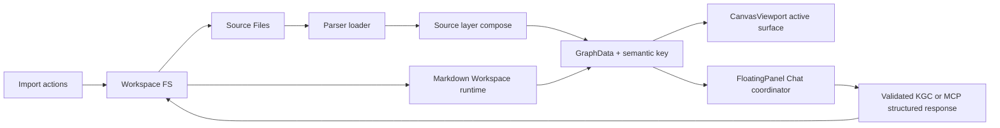
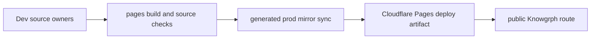

# Knowgrph Modularity PRD/TAD

## Executive Summary

Knowgrph modularity is an existing in-repo contract, not a plan to copy four stale component
folders into another application. The current modular seams are:

- local and URL import into Workspace FS and Source Files
- Editor Workspace through the Markdown Workspace runtime
- FloatingPanel Chat through the shared chat submit coordinator, KGC validation path, and literal MCP structured-response acceptance path
- Canvas rendering through shared renderer configuration, active graph derivation, and mounted 2D/3D/geo surfaces

This document replaces the older seed narrative that named nonexistent import, editor, and
standalone renderer-registry owners. The current repo already has stronger source owners. Future
modularity work must extend those owners at the root instead of adding downstream adapters,
compatibility aliases, duplicated fixtures, or mirror-only patches.

The Dev -> Prod -> Cloudflare rule remains: source changes begin in `knowgrph`, production mirror
files are generated or synced from source owners, and deployed behavior is verified through the
same build, sync, and readiness checks.

## Directive Commitments

| Directive | Product rule | Technical rule |
|---|---|---|
| Universal | A module works for any document, graph, source file, corpus, or renderer mode in the supported contract. | Derive behavior from content, metadata, mode state, and shared signatures rather than file names or project labels. |
| Neutral | No feature assumes a specific host app, provider, route, seller, fixture, or local path. | Keep paths repo-relative in docs and configurable in runtime code. |
| Source-owned | Fix behavior in the earliest shared owner that can prevent the defect. | Avoid local patches, remaps, and duplicate module facades. |
| Semantic-keyed | Expensive derivations reuse shared semantic keys. | Use `buildScopedGraphSemanticKey`, shared lookup caches, and Source Files signatures for graph, workspace, and renderer reuse. |
| Harness-first | AI calls stay typed, bounded, and observable. | Use FloatingPanel Chat coordinator, context packing, KGC or MCP structured-surface validation, and pipeline snapshots instead of a separate chat stack. |
| Cleanup-first | Obsolete contracts are removed from docs and source owners. | Do not preserve stale paths, duplicate tabs, backfill fixtures, or compatibility aliases that hide wrong ownership. |

## Current Implementation Baseline

| Module seam | Current owner | Existing behavior | Modularity rule |
|---|---|---|---|
| Workspace FS | `canvas/src/features/workspace-fs/workspaceFs.ts` | Provides persisted workspace files with memory fallback, seed loading, and change notifications. | Consumers use Workspace FS APIs, not direct browser storage or mirror paths. |
| Local import | `canvas/src/features/markdown-workspace/workspaceImport/localImport.ts` | Imports supported text, code, data, PDF, GLTF/GLB, image, and video metadata files into workspace entries. | Add formats through shared import format helpers and parser owners. |
| Import finalization | `canvas/src/features/markdown-workspace/useWorkspaceFileActions/importActions.ts` | Commits imports, refreshes entries, syncs source metadata, focuses created files, and decides graph application. | Keep import status, focus, and graph apply decisions in this path. |
| Import to canvas | `canvas/src/features/workspace-fs/applyWorkspaceImportToCanvas.ts` | Merges workspace entries into Source Files, parses bounded files, applies frontmatter/import modes, and schedules compose. | Reuse bounded parse and semantic identity rules; do not reparse in UI leaves. |
| Source Files compose | `canvas/src/features/source-files/applyComposedGraphFromSourceFiles.ts` | Composes enabled source layers into active graph state with deferral and signature guards. | Compose once from source layers; do not rebuild ad hoc graph copies downstream. |
| Source signatures | `canvas/src/features/source-files/sourceFilesSignatures.ts` | Hashes source file content, lifecycle, enabled state, and source-layer keys. | Use content and lifecycle signatures to prevent duplicate work. |
| Editor Workspace shell | `canvas/src/lib/markdown-workspace-runtime/MarkdownWorkspaceRuntime.impl.tsx` | Owns active path, editor/viewer state, Source Files panel, save/indexing, and graph sync. | Editor Workspace modularity starts here, not in a separate editor wrapper. |
| Editor Workspace main pane | `canvas/src/features/markdown-workspace/main/MarkdownWorkspaceMain.tsx` | Renders Markdown editor, viewer, webpage panes, derived views, and browser-local snapshots. | Presentation and editing modes remain projections of one active document text. |
| Chat submit shell | `canvas/src/features/chat/floatingPanelChat/useFloatingPanelChatSubmit.ts` | Thin hook delegating request build, transport, streaming, KGC retry, and finalization. | Keep the hook thin; place shared behavior in submit helpers. |
| Chat coordinator | `canvas/src/features/chat/floatingPanelChat/floatingPanelChatSubmitCoordinator.ts` | Owns request context, transport attempts, KGC retry loop, snapshots, and terminal state. | AI-powered modularity reuses this coordinator and its bounded attempts. |
| Chat context packing | `canvas/src/features/chat/floatingPanelChat/floatingPanelChatSubmitRequest.ts` | Packs selection/workspace/hybrid context, corpus evidence, model options, and provider payloads. | Context scopes and token ceilings are shared settings, not per-module prompt forks. |
| Chat response validation | `canvas/src/features/chat/floatingPanelChat/floatingPanelChatKgcAttempt.ts` + `chatMarkdownValidation.ts` + `chatResponseStructuredContent.ts` | Enforces frontmatter-first KGC output or accepts renderable literal MCP `structuredContent`. | Reject wrapper prose, parallel grouping channels, synthetic KGC backfill, and downstream graph patches upstream. |
| Chat to canvas apply | `canvas/src/features/chat/chatKgcCanvasApply.ts` | Reads validated KGC from Workspace FS and applies it through `setActiveMarkdownDocument`. | Chat never writes a separate graph path. |
| Renderer config | `canvas/src/lib/config.render.ts` | Defines renderer ids, surface ids, menu labels, normalized canonical tokens, default renderer, and feature predicates. | Add renderer semantics here before touching UI leaves. |
| Renderer mounting | `canvas/src/components/CanvasViewport.tsx` | Lazily mounts only the active 2D, 3D, or geospatial surface. | No warmed inactive renderer trees or local renderer registry clones. |
| Shared graph identity | `canvas/src/lib/graph/semanticKey.ts` and `canvas/src/lib/graph/lookupCache.ts` | Build scoped graph semantic keys and reusable node/edge lookup caches. | Any cache or derivation that depends on graph shape must use these helpers. |

## Product Requirements

### Problem Statement

Knowgrph is large because it supports import, workspace editing, Source Files, chat, graph parsing,
2D renderers, 3D, geospatial overlays, commerce, and agent-ready deployment. The modularity risk is
not that these features share one repo. The risk is that a change fixes one local view while leaving
the shared owner wrong, or that a document advertises an abstraction that does not exist in source.

The desired outcome is a stable implementation contract: feature slices remain independently
understandable, source-owned, testable, and publishable while still sharing graph identity,
workspace state, renderer state, and chat validation.

### Personas

| Persona | Job to be done | Success signal |
|---|---|---|
| Solo maintainer | Change one module seam without breaking import, workspace, chat, or renderer flows. | Focused checks pass and no unrelated owners are edited. |
| Agent implementer | Discover the current source owner for a behavior before patching. | PRD/TAD owner map points to real files and shared helpers. |
| Feature integrator | Add a parser, renderer, or chat capability without a parallel stack. | New behavior enters through import, Source Files, renderer config, or chat coordinator owners. |
| Deployment operator | Keep Dev, generated prod mirror, and Cloudflare behavior aligned. | `pages:check-sync` and readiness checks report no source/mirror drift. |

### User Journey

| Stage | Action | Touchpoint | Pain Point | Opportunity |
|---|---|---|---|---|
| Trigger | Maintainer identifies a feature slice to change. | PRD/TAD and code search | Stale module names hide the real owner. | Owner map starts from current repo files. |
| Locate | Maintainer finds root owner and shared helper. | `rg`, tests, docs | Local fixes can duplicate existing logic. | Semantic-key and signature helpers are named explicitly. |
| Patch | Maintainer changes the earliest shared owner. | Source module | Downstream patches cause conflict and recomputation. | Source-owned edits prevent the defect from existing downstream. |
| Verify | Maintainer runs focused and topology checks. | npm scripts | Passing a leaf test may miss mirror drift. | Dev -> Prod -> Cloudflare checks remain part of acceptance. |
| Publish | Maintainer syncs/deploys from source output. | prod mirror and Cloudflare | Mirror edits can become hidden forks. | Mirror remains generated or mechanically copied from source. |

### Epics And Acceptance

#### PRD-MOD-01: Source-Owned Module Boundaries

As a maintainer, I want every modular seam to point at the current source owner so that future
work starts at the shared root.

Acceptance criteria:

- Given a modularity document reader, when they inspect import, workspace, chat, and renderer seams, then all referenced owners exist in the repo.
- Given a proposed fix, when a shared owner can prevent the behavior, then the fix is implemented there instead of in a downstream component.
- `/goal` translation: `rg` confirms referenced files exist, and focused tests assert shared-helper usage for changed slices.

#### PRD-MOD-02: Universal Import And Source Files Contract

As a feature integrator, I want all local file, folder, URL, and corpus imports to flow through the
same Workspace FS -> Source Files -> parser -> compose path so that format support stays neutral.

Acceptance criteria:

- Given supported files, when imported, then workspace entries and Source Files records are created through existing import owners.
- Given large, unsupported, or parse-failing files, when import runs, then skipped, pending, or failed states are recorded without injecting fake graph data.
- Given unchanged source content, when composition reruns, then source signatures prevent avoidable parsing or graph churn.
- `/goal` translation: import and Source Files tests pass without adding project-specific fixtures or second import bridges.

#### PRD-MOD-03: Editor Workspace As One Document Runtime

As a user, I want Editor Workspace to edit, view, and sync one active document authority so that
viewer, Source Files, and Canvas state do not conflict.

Acceptance criteria:

- Given an active workspace path, when the user edits or views it, then Markdown Workspace runtime owns text, save, indexing, and graph sync.
- Given webpage, JSON, PDF-derived, or Markdown content, when pane mode changes, then it remains a projection of the same workspace document.
- `/goal` translation: Markdown Workspace tests prove viewer/editor SSOT behavior and no duplicate wrapper runtime is introduced.

#### PRD-MOD-04: FloatingPanel Chat As The Only AI Harness

As an AI-native developer, I want model calls to reuse the existing chat coordinator so that token
budgeting, retries, validation, and canvas apply behavior remain observable.

Acceptance criteria:

- Given a simple chat request, when submitted, then request context and transport flow through the shared submit coordinator.
- Given `chatStorageTarget = "chatKnowgrph"`, when the model returns KGC Markdown or literal MCP `structuredContent`, then validation is bounded, renderable structured surfaces finalize without KGC retry, and final apply uses Workspace FS plus `setActiveMarkdownDocument`.
- Given selection, workspace, or hybrid context scope, when context is packed, then token ceilings and corpus evidence paths are respected.
- `/goal` translation: chat response contract tests pass and no separate AI harness or prompt fork is added for modular consumers.

#### PRD-MOD-05: Renderer Modularity Through Shared Config

As a renderer developer, I want renderer identity, labels, surface mapping, and support predicates
to live in one config owner so that CanvasViewport mounts the right active surface without hidden
renderer state.

Acceptance criteria:

- Given a 2D renderer id, when the Canvas surface resolves, then `config.render.ts` maps it to a surface id and `CanvasViewport.tsx` mounts only that active surface.
- Given a new renderer is added, when it is wired, then menu labels, canonical renderer tokens, frontmatter syntax sharing, minimap support, and tests derive from shared config.
- `/goal` translation: renderer config and CanvasViewport tests pass with no standalone runtime registry clone.

## Technical Architecture

### Architecture Overview

### Shared Identity And Churn Control

| Concern | Required helper | Rule |
|---|---|---|
| Graph derivation cache | `buildScopedGraphSemanticKey` | Scope every graph-dependent cache by graph revision, semantic key, source-layer hashes, and graph structure. |
| Node/edge lookups | `getCachedGraphLookup` | Reuse shared lookup maps instead of rebuilding per component. |
| Source Files persistence | `buildSourceFilesPersistenceSignature` | Persist only meaningful content/lifecycle changes. |
| Source Files compose | `buildSourceFilesCompositionSignature` | Schedule composition only when source-layer semantics changed. |
| Workspace graph runtime | Markdown Workspace `graphSemanticKey` | Keep widget and selection derivations tied to the active graph semantic key. |

### Integration Contracts

| Interface | Protocol | Payload | Error strategy |
|---|---|---|---|
| Local import | Browser File API -> Workspace FS | `File[]` -> workspace entries and source metadata | Record skipped/failed/pending states; do not synthesize success. |
| URL import | Fetch/proxy helpers -> Workspace FS | fetched Markdown/HTML/JSON/assets | Store source URL and generated artifacts through import owners. |
| Source composition | Source Files -> GraphData | enabled source layers plus parsed graph fragments | Defer when workspace overlay state would conflict; clear empty states at owner. |
| Editor sync | Markdown Workspace runtime -> store | active document text, source URL, pane state | Preserve active document authority; autosave through workspace runtime. |
| Chat submit | FloatingPanel Chat -> provider endpoint | packed context, messages, model options | Abort/preflight errors surface in chat state; KGC retries are bounded and renderable literal MCP structured surfaces finalize on the first response. |
| Canvas render | GraphData -> active renderer surface | renderer id, surface id, mode state | Mount only active surface; use empty graph fallback for missing data. |

### Deployment Topology

Mirror files and deployed assets are outputs. They must not become the source of modular behavior,
route ownership, or documentation truth.

## ADRs

### ADR-MOD-001: Existing Owners Over Extracted Module Copies

**Status**: Accepted.

**Decision**: Document and extend current repo owners instead of prescribing a copy-extract module
protocol.

**Rationale**: The repo already has source-owned seams with tests, shared helpers, and deploy
checks. A copy-extract protocol would advertise noncurrent ownership and increase maintenance.

**Rejected alternative**: Keep a module extractor with path declarations. This is rejected because
it points at noncurrent owners and encourages local forks.

### ADR-MOD-002: Shared Semantic Keys Are Mandatory For Derived Work

**Status**: Accepted.

**Decision**: Graph, source, widget, renderer, and workspace derivations must use shared semantic
keys or source signatures when a helper exists.

**Rationale**: Raw object identity and component-local maps create avoidable recomputation and
incorrect reuse across document switches. The shared helpers encode graph shape, revision, and
source-layer identity in one place.

### ADR-MOD-003: FloatingPanel Chat Owns AI Harness Behavior

**Status**: Accepted.

**Decision**: AI-powered module work reuses FloatingPanel Chat request, transport, KGC/MCP structured-response validation, and finalize helpers.

**Rationale**: The coordinator already bounds retries, packs context, publishes readiness
snapshots, handles provider differences, accepts renderable literal MCP structured surfaces without synthetic KGC, and applies validated output through the workspace/canvas path. A second harness would duplicate token spend controls and validation logic.

### ADR-MOD-004: Renderer Extension Enters Shared Config First

**Status**: Accepted.

**Decision**: Renderer additions or semantic changes start in `config.render.ts` and then wire the
active surface in `CanvasViewport.tsx`.

**Rationale**: The current runtime uses finite renderer ids and surface ids. A standalone registry
API would conflict with the mounted active-surface model and would hide menu, renderer-token,
minimap, and frontmatter syntax behavior outside the shared owner.

## Validation Contract

| Gate | Command or probe | Expected result |
|---|---|---|
| Doc status guard | `npm --prefix canvas run test:ci:unit -- "docs.documents.statusCompliance"` | No draft/proposed PRD/TAD markers in docs. |
| Import and Source Files | `npm --prefix canvas run test:ci:unit -- "workspace.import"` plus Source Files focused tests | Local import, URL import, Source Files compose, and stale-guard tests pass. |
| Chat contract | `npm --prefix canvas run test:ci:unit -- "chat.responseContract"` | Submit coordinator, KGC validation, literal MCP structured-content acceptance, retry, and canvas apply contracts pass. |
| Renderer contract | `npm --prefix canvas run test:ci:unit -- "renderer"` and focused CanvasViewport tests | Renderer config and active-surface mounting stay aligned. |
| Hygiene | `npm run hygiene:check` | Changed files satisfy current repo hygiene checks. |
| Prod sync | `npm run pages:check-sync` | Production mirror remains generated from Dev output. |

## Forbidden States

- Do not add a second import bridge for a specific file, URL, repo, or corpus shape.
- Do not patch viewer, renderer, or chat leaves when Workspace FS, Source Files, parser, renderer
  config, semantic-key, or chat coordinator owners can prevent the behavior.
- Do not keep stale docs that name nonexistent module owners as active architecture.
- Do not add compatibility aliases for removed module names, renderer names, tab names, route names,
  or grouping keys unless a current shared source owner requires the persisted setting.
- Do not backfill fake parsed graph data, fake payment/proof state, or hardcoded fixture output.
- Do not recompute graph lookups, source composition, token context, or renderer identity locally
  when shared helpers already provide a semantic key or signature.
- Do not edit the prod mirror by hand to correct behavior that belongs in Dev source.

## Traceability

| PRD story | TAD owner | Evidence path |
|---|---|---|
| PRD-MOD-01 | owner map and docs status guard | `docs/documents/knowgrph-modularity-prd-tad.md`, `docsDocumentsStatusCompliance.test.ts` |
| PRD-MOD-02 | import and Source Files owners | `workspaceImport/localImport.ts`, `importActions.ts`, `applyWorkspaceImportToCanvas.ts`, `applyComposedGraphFromSourceFiles.ts` |
| PRD-MOD-03 | Editor Workspace runtime | `MarkdownWorkspaceRuntime.impl.tsx`, `MarkdownWorkspaceMain.tsx` |
| PRD-MOD-04 | FloatingPanel Chat harness | `useFloatingPanelChatSubmit.ts`, `floatingPanelChatSubmitCoordinator.ts`, `floatingPanelChatKgcAttempt.ts`, `chatResponseStructuredContent.ts`, `chatMarkdownValidation.ts`, `chatKgcCanvasApply.ts` |
| PRD-MOD-05 | renderer config and active mounting | `config.render.ts`, `CanvasViewport.tsx` |

## Change Log

| Version | Date | Notes |
|---|---|---|
| 1.0.2 | 2026-06-04 | Aligned modularity with literal MCP structured-response acceptance through the shared FloatingPanel Chat validation and workspace/canvas apply path. |
| 1.0.1 | 2026-05-30 | Rebased modularity on current repo owners, shared semantic-key helpers, and Dev -> Prod -> Cloudflare validation. |
