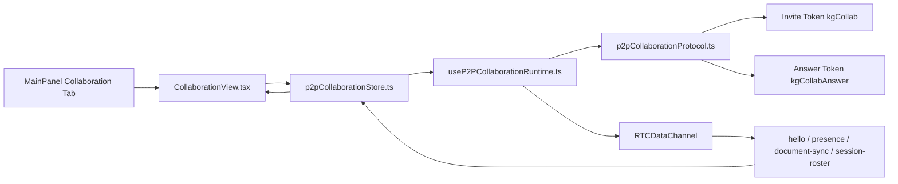

# Knowgrph Multi-User Collaboration - TAD Companion

Continuation of [knowgrph-multi-user-collaboration-prd.tad.md](knowgrph-multi-user-collaboration-prd.tad.md). Contains Part II: Technical Architecture Documentation.

**Document Version**: 1.1.0  
**Date**: 2026-05-29  
**Status**: Accepted and implemented P2P pilot

---

# Part II: Technical Architecture Documentation (TAD)

## Architecture Overview

The implemented collaboration surface is a browser-to-browser WebRTC pilot. It does not require a server-side room service. The host owns invite creation, guest answer application, multi-peer relay, roster publication, document sync, presence, and peer removal.



## Component Inventory

| ID | Component | Responsibility | Module | Status |
|---|---|---|---|---|
| TAD-MUC-C001 | MainPanel tab registry | Exposes `collaboration` as a top-level tab | `canvas/src/features/panels/mainPanelTabs.ts` | Shipped |
| TAD-MUC-C002 | Collaboration view | Renders session, invite, answer, peer roster, follow, and remove controls | `canvas/src/features/panels/views/CollaborationView.tsx` | Shipped |
| TAD-MUC-C003 | P2P protocol | Encodes/decodes invite and answer tokens; validates wire messages | `canvas/src/features/collaboration/p2pCollaborationProtocol.ts` | Shipped |
| TAD-MUC-C004 | P2P store | Owns session state, peer roster, commands, local caret, and follow target | `canvas/src/features/collaboration/p2pCollaborationStore.ts` | Shipped |
| TAD-MUC-C005 | P2P runtime | Creates WebRTC peer connections, sends/receives wire messages, relays host roster and document sync | `canvas/src/features/collaboration/useP2PCollaborationRuntime.ts` | Shipped |
| TAD-MUC-C006 | Type icons | Provides shared Collaboration row icon semantics | `canvas/src/features/panels/ui/mainPanelTypeIcons.tsx` | Shipped |
| TAD-MUC-C007 | Test harness | Validates protocol, store, view, and runtime behavior | `canvas/src/__tests__/mainPanelCollaboration.test.tsx` | Shipped |

## Data Flows

### Host Invite Flow

| Stage | Owner | Input | Output |
|---|---|---|---|
| Command | `p2pCollaborationStore.ts` | `queueStartHost()` | pending command `start-host` |
| Offer | `useP2PCollaborationRuntime.ts` | active document key, host identity | `RTCSessionDescriptionInit` offer |
| Encode | `p2pCollaborationProtocol.ts` | `P2PInvitePayload` | invite token |
| Share | `buildP2PInviteUrl()` | invite token, location | URL with `kgCollab` |

### Guest Answer Flow

| Stage | Owner | Input | Output |
|---|---|---|---|
| Parse | `parseP2PInviteInput()` | invite token or URL | validated invite payload |
| Answer | runtime | invite offer | answer description |
| Encode | `encodeP2PAnswerPayload()` | `P2PAnswerPayload` | answer token |
| Apply | host runtime | answer token | connected guest peer |

### Collaboration Wire Flow

| Message | Required Role | Payload Purpose |
|---|---|---|
| `hello` | owner or guest | announce peer identity, document key, caret, and ownership |
| `presence` | owner or guest | update display name, caret, and last-seen state |
| `document-sync` | owner or guest | sync active document text and text hash |
| `session-roster` | owner | broadcast owner-known peer roster |

## Integration Contracts

### TAD-MUC-I001: Token Contract

- Invite tokens use `P2P_COLLAB_INVITE_SEARCH_PARAM` (`kgCollab`).
- Answer tokens use `P2P_COLLAB_ANSWER_SEARCH_PARAM` (`kgCollabAnswer`).
- Payloads carry `P2P_COLLAB_PROTOCOL_VERSION`.
- Invalid payloads fail closed with explicit parse errors.

### TAD-MUC-I002: Store Contract

- Session state lives in `useP2PCollaborationStore`.
- Commands are queued through typed command helpers.
- Peers are sorted by ownership, local status, and display name.
- `followPeerId` is normalized to a live remote peer or cleared.

### TAD-MUC-I003: Runtime Contract

- Runtime starts only when active.
- WebRTC support is detected before starting a host or guest session.
- Host connections are tracked by peer id.
- Host removal disconnects selected guests and publishes a fresh roster.
- Guest host disconnect resets the session.
- Document sync suppresses outbound echo by signature.

### TAD-MUC-I004: UI Contract

- Collaboration UI uses shared `KeyTypeValueRow` and MainPanel type icons.
- The view registers stable collapse/expand actions.
- Owner-only remove actions are visible only for remote guest rows.
- Search filters session, invite, answer, and peer rows without creating alternate panels.

## Architectural Decisions

### ADR-MUC-001: Ship No-Server P2P Before Authenticated D1 Rooms

**Status**: Accepted and implemented.  
**Decision**: Ship a no-server WebRTC pilot first and keep authenticated D1/JWT collaboration as a planned extension.  
**Reasoning**: The pilot delivers real collaborative document sync without a new Worker auth surface or Durable Object room service.

### ADR-MUC-002: Host Owns Multi-Peer Relay

**Status**: Accepted and implemented.  
**Decision**: The host tracks guest peer connections and publishes roster messages.  
**Reasoning**: This keeps the pilot serverless and makes owner/guest semantics explicit in the wire protocol.

### ADR-MUC-003: Follow Mode Targets One Live Remote Peer

**Status**: Accepted and implemented.  
**Decision**: Follow mode resolves to one live remote peer and clears when that peer is no longer available.  
**Reasoning**: This prevents stale or noisy remote-caret jumps and avoids viewport churn.

## Planned Extension Boundary

Authenticated workspace membership, D1 role checks, server-side audit trails, and Durable Object rooms are not part of the implemented baseline. They need source owners and focused tests before this document can promote them.

| Extension | Expected Owner |
|---|---|
| Worker auth middleware | storage Worker |
| D1 membership and invitation schema | storage migrations |
| Permission-gated push/pull/export | storage Worker routes |
| Audit events by user | D1 sync events |
| Server-side real-time room | Durable Object or Worker room owner |

## Quality Attributes

| Attribute | Implemented Pattern | Evidence |
|---|---|---|
| Local-first | No-server WebRTC handshake | protocol and runtime owners |
| Neutrality | MainPanel tab and shared KTV rows | `CollaborationView.tsx` |
| State safety | Typed Zustand store and command queue | `p2pCollaborationStore.ts` |
| Runtime safety | Support checks, explicit reset, peer removal, echo suppression | `useP2PCollaborationRuntime.ts` |
| Testability | Protocol/store/view/runtime focused cases | `mainPanelCollaboration.test.tsx` |

## Validation

```bash
npm --prefix canvas run test:ci:unit -- "multiUserCollaboration.docs"
npm --prefix canvas run test:ci:unit -- "collaboration."
npm --prefix canvas run test:ci:unit -- "ui.mainPanel.collaboration"
npm run hygiene:check
npm --prefix canvas exec tsc -- -p canvas/tsconfig.json --noEmit --pretty false
```

## Revision History

| Version | Date | Author | Summary |
|---|---|---|---|
| 1.0.0 | 2026-05-08 | joohwee | Initial authenticated D1/JWT collaboration plan |
| 1.1.0 | 2026-05-29 | joohwee | Promoted implemented no-server WebRTC pilot and separated planned auth/D1 extension |
