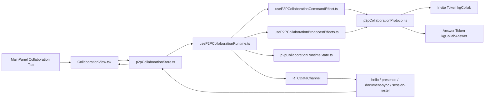

# Knowgrph Multi-User Collaboration - TAD Companion

Continuation of [knowgrph-multi-user-collaboration-prd.tad.md](knowgrph-multi-user-collaboration-prd.tad.md). Contains the detailed architecture inventory for the shipped authenticated collaboration room baseline plus the retained fallback P2P path.

**Document Version**: 1.2.1
**Date**: 2026-07-11
**Status**: Accepted and implemented authenticated room transport

---

## Architecture Overview

The implemented collaboration surface is an authenticated storage-room baseline backed by the storage Worker and Durable Object room relay. Storage-configured workspaces use the shared collaboration store, authenticated room runtime, and Worker-authenticated canvas-room route for roster, document sync, presence, and peer removal. The browser-to-browser WebRTC pilot remains in the repo as a fallback path when authenticated room transport is not configured.



## Component Inventory

| ID | Component | Responsibility | Module | Status |
|---|---|---|---|---|
| TAD-MUC-C001 | MainPanel tab registry | Exposes `collaboration` as a top-level tab | `canvas/src/features/panels/mainPanelTabs.ts` | Shipped |
| TAD-MUC-C002 | Collaboration view | Renders session, invite, answer, peer roster, follow, and remove controls | `canvas/src/features/panels/views/CollaborationView.tsx` | Shipped |
| TAD-MUC-C003 | Authenticated room runtime | Connects the active document to the storage-backed room and relays document or presence changes | `canvas/src/features/collaboration/useKnowgrphStorageCollaborationRuntime.ts` | Shipped |
| TAD-MUC-C004 | Authenticated room client contract | Reads storage env, builds room URLs, and scopes them by workspace id | `canvas/src/lib/storage/knowgrphStorageCanvasRoomClient.ts` | Shipped |
| TAD-MUC-C005 | Storage Worker room owners | Authenticate sessions, expose the canvas-room route, and relay room events through the Durable Object | `cloudflare/workers/knowgrph-storage/index.ts`, `cloudflare/workers/knowgrph-storage/chatAuth.ts`, `cloudflare/workers/knowgrph-storage/canvasSyncRoom.ts` | Shipped |
| TAD-MUC-C006 | P2P protocol | Encodes/decodes invite and answer tokens; validates wire messages for the fallback path | `canvas/src/features/collaboration/p2pCollaborationProtocol.ts` | Shipped |
| TAD-MUC-C007 | P2P store | Owns session state, peer roster, commands, local caret, and follow target | `canvas/src/features/collaboration/p2pCollaborationStore.ts` | Shipped |
| TAD-MUC-C008 | Runtime orchestration | Creates WebRTC peer connections, receives wire messages, and coordinates effects for the fallback path | `canvas/src/features/collaboration/useP2PCollaborationRuntime.ts` | Shipped |
| TAD-MUC-C009 | Runtime state helpers | Own reusable runtime refs, peer snapshots, signatures, and WebRTC helpers | `canvas/src/features/collaboration/p2pCollaborationRuntimeState.ts` | Shipped |
| TAD-MUC-C010 | Command effects | Executes start-host, join-invite, apply-answer, disconnect, and remove-peer commands | `canvas/src/features/collaboration/useP2PCollaborationCommandEffect.ts` | Shipped |
| TAD-MUC-C011 | Broadcast effects | Debounces document sync and emits hello, presence, and roster broadcasts | `canvas/src/features/collaboration/useP2PCollaborationBroadcastEffects.ts` | Shipped |
| TAD-MUC-C012 | Type icons | Provides shared Collaboration row icon semantics | `canvas/src/features/panels/ui/mainPanelTypeIcons.tsx` | Shipped |
| TAD-MUC-C013 | Test harness | Validates protocol, store, view, runtime relay, and runtime lifecycle behavior | `canvas/src/__tests__/mainPanelCollaboration.*` | Shipped |
| TAD-MUC-C014 | App-level E2E smoke | Opens owner and guest Markdown workspaces, connects the authenticated room, and validates guest-to-owner document propagation | `canvas/scripts/verify-multi-user-collaboration-e2e.ts` | Shipped |

## Data Flows

### Host Invite Flow

| Stage | Owner | Input | Output |
|---|---|---|---|
| Command | `p2pCollaborationStore.ts` | `queueStartHost()` | pending command `start-host` |
| Effect | `useP2PCollaborationCommandEffect.ts` | pending command, active document refs | WebRTC connection ref and offer |
| Encode | `p2pCollaborationProtocol.ts` | `P2PInvitePayload` | invite token |
| Share | `buildP2PInviteUrl()` | invite token, location | URL with `kgCollab` |

### Guest Answer Flow

| Stage | Owner | Input | Output |
|---|---|---|---|
| Parse | `parseP2PInviteInput()` | invite token or URL | validated invite payload |
| Effect | `useP2PCollaborationCommandEffect.ts` | invite offer, guest identity | answer description |
| Encode | `encodeP2PAnswerPayload()` | `P2PAnswerPayload` | answer token |
| Apply | host command effect | answer token | connected guest peer |

### Collaboration Wire Flow

| Message | Required Role | Payload Purpose |
|---|---|---|
| `hello` | owner or guest | announce peer identity, document key, caret, and ownership |
| `presence` | owner or guest | update display name, caret, and last-seen state |
| `document-sync` | owner or guest | sync active document text and text hash |
| `session-roster` | owner | broadcast owner-known peer roster |

## Integration Contracts

### TAD-MUC-I001: Token Contract

- Invite tokens use `P2P_COLLAB_INVITE_SEARCH_PARAM` (`kgCollab`).
- Answer tokens use `P2P_COLLAB_ANSWER_SEARCH_PARAM` (`kgCollabAnswer`).
- Payloads carry `P2P_COLLAB_PROTOCOL_VERSION`.
- Invalid payloads fail closed with explicit parse errors.

### TAD-MUC-I002: Store Contract

- Session state lives in `useP2PCollaborationStore`.
- Commands are queued through typed command helpers.
- Peers are sorted by ownership, local status, and display name.
- `followPeerId` is normalized to a live remote peer or cleared.

### TAD-MUC-I003: Runtime Contract

- Runtime starts only when active.
- WebRTC support is detected before starting a host or guest session.
- Host connections are tracked by peer id.
- Host removal disconnects selected guests and publishes a fresh roster.
- Guest host disconnect resets the session.
- Document sync suppresses outbound echo by signature.

### TAD-MUC-I004: UI Contract

- Collaboration UI uses shared `KeyTypeValueRow` and MainPanel type icons.
- Shared MainPanel open events accept the `collaboration` tab through `useCanvasToolbarContext.ts`.
- The view registers stable collapse/expand actions.
- Owner-only remove actions are visible only for remote guest rows.
- Search filters session, invite, answer, and peer rows without creating alternate panels.

## Architectural Decisions

### ADR-MUC-001: Authenticated Room First, P2P As Fallback

**Status**: Accepted and implemented.  
**Decision**: Use authenticated storage-room transport as the default collaboration path and retain the no-server WebRTC pilot only as a fallback.  
**Reasoning**: The authenticated room now exists, keeps identity and room scope honest, and is the path validated by the canonical browser smoke.

### ADR-MUC-002: Host Owns Multi-Peer Relay

**Status**: Accepted and implemented.  
**Decision**: The host tracks guest peer connections and publishes roster messages.  
**Reasoning**: This keeps the pilot serverless and makes owner/guest semantics explicit in the wire protocol.

### ADR-MUC-003: Follow Mode Targets One Live Remote Peer

**Status**: Accepted and implemented.  
**Decision**: Follow mode resolves to one live remote peer and clears when that peer is no longer available.  
**Reasoning**: This prevents stale or noisy remote-caret jumps and avoids viewport churn.

## Planned Extension Boundary

Richer role models, longer-lived audit replay, and media fan-out are not part of the completed baseline. They need source owners and focused tests before this document can promote them.

| Extension | Expected Owner |
|---|---|
| Worker auth middleware | storage Worker |
| D1 membership and invitation schema | storage migrations |
| Permission-gated push/pull/export | storage Worker routes |
| Audit events by user | D1 sync events |
| Server-side real-time room | Durable Object or Worker room owner |

## Quality Attributes

| Attribute | Implemented Pattern | Evidence |
|---|---|---|
| Local-first | Authenticated room joins against operator-owned local stack with fallback P2P escape hatch | storage room and runtime owners |
| Neutrality | MainPanel tab and shared KTV rows | `CollaborationView.tsx` |
| State safety | Typed Zustand store and command queue | `p2pCollaborationStore.ts` |
| Runtime safety | Support checks, explicit reset, peer removal, echo suppression | split runtime owners |
| Testability | Protocol/store/view/runtime focused cases | split `mainPanelCollaboration.*` tests |
| TCO | Reuses the existing storage Worker and Durable Object room; no extra vendor realtime dependency | ADR-MUC-001 |

## Validation

```bash
npm run collaboration:readiness:check
npm --prefix canvas run test:ci:unit -- "multiUserCollaboration.docs"
npm --prefix canvas run test:ci:unit -- "collaboration."
npm --prefix canvas run test:ci:unit -- "ui.mainPanel.collaboration"
npm --prefix canvas run validate:multi-user-collaboration:e2e
npm --prefix canvas exec tsc -- -p canvas/tsconfig.json --noEmit --pretty false
```

`npm run collaboration:readiness:check` is the canonical proof step: it runs the docs guard, focused collaboration/runtime suites, and the authenticated browser smoke together. The browser smoke expects the local authenticated stack by default: owner app on `127.0.0.1:5173`, guest app on `127.0.0.1:5174`, and storage worker on `127.0.0.1:8787`, with env overrides available. It uses the shared `QUERY_PARAM_OPEN_EDITOR_WORKSPACE` route to mount the Markdown runtime on both pages, opens Collaboration, connects the authenticated room, applies a guest-side marker, and asserts that the owner receives the same marker. `npm run hygiene:check` remains a repo-wide changed-file gate and can be red from unrelated dirty-tree files. The collaboration owners in this document are each below the 600-line source budget.

## Revision History

| Version | Date | Author | Summary |
|---|---|---|---|
| 1.0.0 | 2026-05-08 | joohwee | Initial authenticated D1/JWT collaboration plan |
| 1.1.0 | 2026-05-29 | joohwee | Promoted implemented no-server WebRTC pilot and separated planned auth/D1 extension |
| 1.1.1 | 2026-06-06 | Codex | Added YAML frontmatter and aligned architecture inventory with split runtime and test owners |
| 1.1.2 | 2026-06-06 | Codex | Added app-level E2E smoke validation for shared MainPanel Collaboration open and host invite readiness |
| 1.2.0 | 2026-07-11 | Codex | Promoted authenticated storage-room transport as the default architecture and updated the canonical E2E smoke to validate guest-to-owner propagation |
| 1.2.1 | 2026-07-11 | Codex | Added `npm run collaboration:readiness:check` as the canonical collaboration proof gate |
