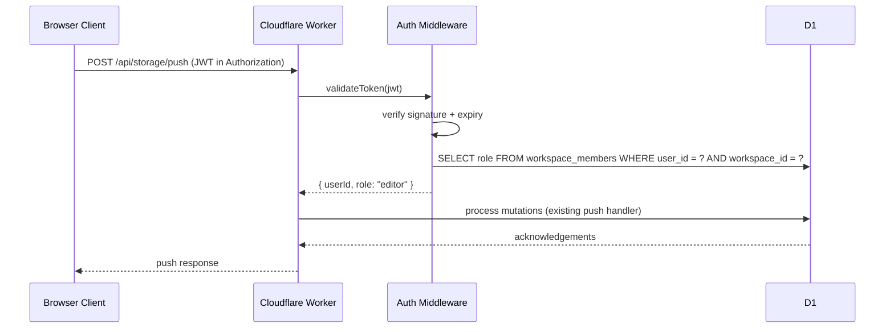
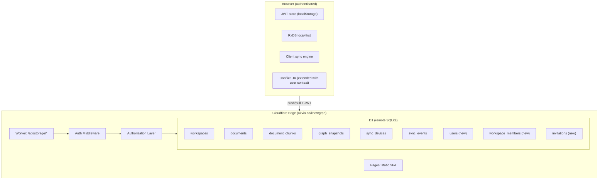

# Knowgrph Multi-User Collaboration — TAD Companion

Continuation of [knowgrph-multi-user-collaboration-prd.tad.md](knowgrph-multi-user-collaboration-prd.tad.md). Contains Part II: Technical Architecture Documentation.

**Document Version**: 1.0.0
**Date**: 2026-05-08
**Status**: Proposed

---

# PART II: TECHNICAL ARCHITECTURE DOCUMENTATION (TAD)

## Architecture: Multi-User Collaboration

### Overview
**From authenticated user** to **permission-gated CRUD**: Auth middleware validates JWT on every request, authorization layer checks workspace membership and role, then existing sync handlers process mutations with user attribution.

### Journey → System Mapping

| Journey Stage | Workflow | Data Flow | Component |
|---|---|---|---|
| Sign in | Auth workflow | Credentials → JWT | Auth handler |
| Assign role | Member management | Role assignment → D1 | Worker member API |
| Edit document | Push workflow | Mutation + JWT → permission check → D1 upsert | Auth middleware + push handler |
| View workspace | Pull workflow | JWT → permission check → D1 query → client apply | Auth middleware + pull handler |
| Resolve conflict | Conflict workflow | Conflict + user context → UX notification | Conflict UX (extended) |
| Export backup | Export workflow | JWT → permission check → D1 query → filesystem | Export handler (new) |

---

## Component Specifications

### Component: Auth Middleware
**Responsibility**: Validate JWT on every storage API request and extract user identity
**Interfaces**: HTTP Authorization header → decoded JWT payload
**Dependencies**: JWT verification key, D1 `users` table
**Configuration**: JWT secret, token expiry, algorithm

### Component: Authorization Layer
**Responsibility**: Check user role against required permission for each API route
**Interfaces**: User ID + workspace ID → role lookup → allow/deny
**Dependencies**: D1 `workspace_members` table, Auth middleware
**Configuration**: Role-to-permission mapping

### Component: User Store (D1)
**Responsibility**: Persist user identities and credentials
**Interfaces**: CRUD on `users` table
**Dependencies**: D1 database
**Configuration**: Password hash algorithm, email uniqueness constraint

### Component: Membership Store (D1)
**Responsibility**: Persist workspace membership and role assignments
**Interfaces**: CRUD on `workspace_members` table
**Dependencies**: D1 database, User store
**Configuration**: Default role for new members

### Component: Invitation Store (D1)
**Responsibility**: Track pending workspace invitations
**Interfaces**: CRUD on `invitations` table
**Dependencies**: D1 database, User store
**Configuration**: Invitation expiry duration

---

## Integration Contracts

### Interface: Auth Header
**Protocol**: HTTP Bearer token
**Format**: `Authorization: Bearer <jwt>`
**Errors**: 401 Unauthorized (missing/invalid token), 401 TokenExpired

### Interface: Push Route (Extended)
**Protocol**: HTTP POST
**Path**: `/api/storage/push`
**Format**: Existing push request + `Authorization` header
**Errors**: 403 Forbidden (insufficient role), 401 Unauthorized (no auth)

### Interface: Pull Route (Extended)
**Protocol**: HTTP POST
**Path**: `/api/storage/pull`
**Format**: Existing pull request + `Authorization` header
**Errors**: 403 Forbidden (viewer cannot pull — or allow pull for all roles)

### Interface: Export Route (Extended)
**Protocol**: HTTP GET
**Path**: `/api/storage/export/:workspaceId`
**Format**: Existing export + `Authorization` header
**Errors**: 403 Forbidden (non-owner cannot export)

### Interface: Member Management Routes (New)
**Protocol**: HTTP POST/GET/DELETE
**Path**: `/api/storage/members`
**Format**: JSON with `workspaceId`, `userId`, `role`
**Errors**: 403 Forbidden (non-owner cannot manage members), 404 User not found

---

## Architectural Decisions

### ADR-001: JWT Auth in Worker (Not External Provider)
**Status**: Proposed
**Date**: 2026-05-08

**Context**: Multi-user collaboration requires user identity on every request. Options include self-managed JWT in the Worker, Cloudflare Zero Trust, or external auth providers (Clerk, Auth0, Supabase Auth).

**Decision**: Start with self-managed JWT signed and verified in the Cloudflare Worker. Store password hashes in D1 `users` table.

**Alternatives Considered**:
1. Cloudflare Zero Trust: Tight Cloudflare integration but adds complexity for SPA auth flow; requires Access application configuration.
2. Clerk/Auth0/Supabase Auth: Feature-rich but adds external dependency and cost; overkill for MVP user count.

**Rationale**: Self-managed JWT keeps the auth boundary inside the existing Worker + D1 stack with zero additional services. The Worker already validates request structure; adding JWT verification is a thin middleware layer.

**Consequences**:
- **Positive**: No external dependency, no additional TCO, full control over token lifecycle
- **Negative**: Password reset, email verification, and brute-force protection must be implemented manually
- **Neutral**: JWT secret must be stored as a Cloudflare Worker secret (wrangler secret put)

### ADR-002: Three Roles (Owner, Editor, Viewer)
**Status**: Proposed
**Date**: 2026-05-08

**Context**: Workspace access needs at least read/write distinction. Options range from binary (read/write) to fine-grained (per-resource, per-field).

**Decision**: Implement three roles: owner, editor, viewer.

**Alternatives Considered**:
1. Binary read/write: Too coarse; owner cannot delegate read-only access.
2. Per-document permissions: Adds schema complexity; deferred to Could Have.

**Rationale**: Three roles cover the core use cases (full control, co-authoring, read-only sharing) without schema overhead. Per-document overrides can be added later without breaking the role model.

**Consequences**:
- **Positive**: Simple mental model, easy to implement and explain
- **Negative**: Cannot restrict individual document access within a workspace
- **Neutral**: Role is stored as TEXT in `workspace_members.role`; easy to extend later

### ADR-003: D1 Becomes Operational SSOT for Multi-User Workspaces
**Status**: Proposed
**Date**: 2026-05-08

**Context**: The current SSOT is the local filesystem (`huijoohwee/docs/`). Multi-user authoring requires a shared SSOT accessible to all users.

**Decision**: D1 becomes the operational SSOT for any workspace that has more than one member. Single-user workspaces can continue using filesystem as SSOT.

**Alternatives Considered**:
1. Keep filesystem as SSOT and sync to D1: Requires a server-side filesystem or git integration; adds operational complexity.
2. Migrate to PostgreSQL now: Premature per ADR-003 in `knowgrph-storage-sync-document.md`.

**Rationale**: D1 is already the shared store. Flipping SSOT is a workflow change, not a technical migration. The seed pipeline continues to bootstrap new workspaces from filesystem.

**Consequences**:
- **Positive**: No data migration; existing D1 data becomes authoritative
- **Negative**: Filesystem and D1 can diverge; seed script becomes bootstrap-only
- **Neutral**: Optional export script keeps filesystem as a backup mirror

### ADR-004: Auth Middleware as Worker Request Wrapper
**Status**: Proposed
**Date**: 2026-05-08

**Context**: JWT validation must apply to all storage routes. Options include per-route middleware, a single request wrapper, or Cloudflare Filters.

**Decision**: Implement auth as a single request wrapper function that runs before route dispatch in the existing Worker `fetch` handler.

**Alternatives Considered**:
1. Cloudflare Filters: Requires paid plan; adds configuration outside code.
2. Per-route middleware: Duplicates validation logic across handlers.

**Rationale**: A single wrapper function keeps auth logic centralized and testable. The existing Worker already has a `fetch` handler that dispatches by pathname; adding a pre-check is minimal change.

**Consequences**:
- **Positive**: Single point of auth logic, easy to test, no external dependency
- **Negative**: All routes share the same auth behavior; route-specific exemptions require explicit allowlist
- **Neutral**: Export route can be restricted to owner role in the same wrapper

---

## Quality Attributes

| Attribute | Scenario | Pattern | Validation |
|---|---|---|---|
| Performance | Auth check adds <10ms to every push/pull request | JWT verification in Worker (no external call) | Load test with 100 concurrent requests |
| Security | Unauthenticated requests are rejected before D1 access | Auth middleware rejects missing/invalid JWT with 401 | Auth middleware unit tests |
| Security | Viewers cannot push mutations | Authorization layer checks role before push handler | Permission enforcement integration tests |
| Scalability | D1 free tier supports projected multi-user load | 5M reads/day, 100K writes/day sufficient for <50 users | D1 metrics dashboard |
| Observability | Every mutation is attributed to a user | `sync_events` includes `user_id` column | Query sync_events by user |
| Resilience | JWT expiry does not lose unsynced local changes | Client retries push after token refresh | Client sync loop tests |
| Maintainability | Auth is a thin layer over existing sync | Auth middleware wraps existing handlers; no handler rewrite | Diff size of Worker changes |

---

## Deployment Strategy

See `knowgrph-storage-sync-document.md` for the full deployment phase history (Phase 1 and 1.5 are DONE).

### Phase 1 — Auth + Roles (unblock multi-user)
1. Add D1 migration `0002_knowgrph_auth.sql` for `users`, `workspace_members`, `invitations` tables
2. Implement JWT sign/verify in Worker
3. Add auth middleware wrapper to existing `fetch` handler
4. Add authorization checks to push, pull, export handlers
5. Implement sign-up, sign-in, member management API routes
6. Update client sync engine to include JWT in requests
7. Deploy migration and Worker update

### Phase 2 — SSOT Transition
1. Update seed pipeline to bootstrap-only (no write-back)
2. Add optional D1-to-filesystem export script
3. Update workspace creation flow to set D1 as SSOT for multi-member workspaces
4. Update documentation to reflect SSOT change

### Phase 3 — Enhanced Collaboration (future)
1. Add invitation delivery (email or in-app)
2. Extend conflict UX with user identity display
3. Add workspace activity feed
4. Evaluate real-time collaboration (Durable Objects WebSocket) per storage-sync Phase 3

---

## Architecture Diagrams

### Multi-User Auth Flow



### Extended Storage Architecture



---

## Component Inventory

### New Components

| Layer | Component | File | Status |
|---|---|---|---|
| D1 Migration | Auth tables | `cloudflare/d1/migrations/0002_knowgrph_auth.sql` | Proposed |
| Worker | Auth middleware | `cloudflare/workers/knowgrph-storage/auth.ts` | Proposed |
| Worker | Authorization layer | `cloudflare/workers/knowgrph-storage/authorization.ts` | Proposed |
| Worker | Member management routes | `cloudflare/workers/knowgrph-storage/members.ts` | Proposed |
| Worker | Auth routes (sign-up, sign-in) | `cloudflare/workers/knowgrph-storage/authRoutes.ts` | Proposed |
| Client | JWT store and refresh | `canvas/src/lib/storage/knowgrphAuth.ts` | Proposed |
| Client | Auth UI (sign-in, sign-up) | `canvas/src/features/auth/` | Proposed |
| Client | Member management UI | `canvas/src/features/members/` | Proposed |
| Client | Extended conflict UX | `canvas/src/lib/storage/knowgrphStorageConflictUx.ts` (extend) | Proposed |
| Scripts | D1-to-filesystem export | `scripts/export-storage-docs-from-cloudflare.mjs` | Proposed |
| Test | Auth middleware tests | `canvas/src/__tests__/knowgrphAuth.test.ts` | Proposed |
| Test | Permission enforcement tests | `canvas/src/__tests__/knowgrphAuthorization.test.ts` | Proposed |

### Existing Components (Extended)

| Layer | Component | File | Change |
|---|---|---|---|
| Worker | Request handler | `cloudflare/workers/knowgrph-storage/index.ts` | Add auth middleware wrapper |
| Worker | D1 query helpers | `cloudflare/workers/knowgrph-storage/db.ts` | Add user/member query helpers |
| Worker | Contract types | `canvas/src/lib/storage/knowgrphStorageSyncContract.ts` | Add auth-related types |
| Client | Sync engine | `canvas/src/lib/storage/knowgrphStorageClientSync.ts` | Add JWT to requests, auto-clear stale conflicts |
| Client | Sync contract | `canvas/src/lib/storage/knowgrphStorageSyncContract.ts` | Add auth header constant |
| Client | Workspace FS | `canvas/src/features/workspace-fs/workspaceFs.ts` | RxDB CONFLICT retry before degradation |
| Settings | Workspace registry | `canvas/src/features/settings/registry-ui.workspace.ts` | Add `workspace.import.defaultSourceUrl` setting |
| Seed | Seed provider | `canvas/src/features/workspace-fs/workspaceSeedProvider.ts` | Add URL fetch step in priority chain |
| Worker | Public doc view | `cloudflare/workers/knowgrph-storage/index.ts` | `GET /api/storage/doc/:workspaceId/:canonicalPath*` — see ADR-009 |

---

## D1 Schema Extension (Proposed)

```sql
CREATE TABLE IF NOT EXISTS users (
  id TEXT PRIMARY KEY,
  email TEXT NOT NULL UNIQUE,
  display_name TEXT NOT NULL,
  password_hash TEXT NOT NULL,
  created_at TEXT NOT NULL,
  updated_at TEXT NOT NULL
);

CREATE TABLE IF NOT EXISTS workspace_members (
  id TEXT PRIMARY KEY,
  workspace_id TEXT NOT NULL,
  user_id TEXT NOT NULL,
  role TEXT NOT NULL DEFAULT 'editor' CHECK(role IN ('owner', 'editor', 'viewer')),
  invited_by TEXT,
  joined_at TEXT NOT NULL,
  updated_at TEXT NOT NULL,
  FOREIGN KEY (workspace_id) REFERENCES workspaces(id) ON DELETE CASCADE,
  FOREIGN KEY (user_id) REFERENCES users(id) ON DELETE CASCADE,
  UNIQUE (workspace_id, user_id)
);

CREATE TABLE IF NOT EXISTS invitations (
  id TEXT PRIMARY KEY,
  workspace_id TEXT NOT NULL,
  email TEXT NOT NULL,
  role TEXT NOT NULL DEFAULT 'editor' CHECK(role IN ('owner', 'editor', 'viewer')),
  invited_by TEXT NOT NULL,
  token TEXT NOT NULL UNIQUE,
  accepted_at TEXT,
  expires_at TEXT NOT NULL,
  created_at TEXT NOT NULL,
  FOREIGN KEY (workspace_id) REFERENCES workspaces(id) ON DELETE CASCADE,
  FOREIGN KEY (invited_by) REFERENCES users(id)
);

CREATE INDEX IF NOT EXISTS idx_workspace_members_user
  ON workspace_members(user_id);

CREATE INDEX IF NOT EXISTS idx_workspace_members_workspace
  ON workspace_members(workspace_id);

CREATE INDEX IF NOT EXISTS idx_invitations_email
  ON invitations(email);

CREATE INDEX IF NOT EXISTS idx_invitations_token
  ON invitations(token);
```

---

## PRD ↔ TAD Traceability

| PRD Reference | TAD Component | TAD Interface |
|---|---|---|
| PRD-E001-S001, PRD-E001-S002 | Auth Middleware + Auth Routes | JWT sign/verify, POST /api/storage/auth/signup, POST /api/storage/auth/login |
| PRD-E002-S001, PRD-E002-S002, PRD-E002-S003 | Authorization Layer + Member Routes | Role check on push/pull/export, POST/GET/DELETE /api/storage/members |
| PRD-E003-S001 | Push handler (extended) | `sync_events.user_id` column |
| PRD-E003-S002 | Client sync engine (extended) | JWT in Authorization header |
| PRD-E003-S003 | Conflict UX (extended) | User display name in conflict notification |
| PRD-E004-S001 | D1 SSOT (workflow change) | Seed script becomes bootstrap-only |
| PRD-E004-S002 | Export script (new) | GET /api/storage/export/:workspaceId + filesystem write |

---

## Validation Checklist

- [ ] User journey mapped before stories written; every story anchored to a journey stage
- [ ] Workflows defined with trigger, happy path, alternate paths, error paths, and postconditions
- [ ] Data flows typed at every stage boundary with persistence and error handling documented
- [ ] User stories follow "As a... I want... So that" format
- [ ] Acceptance criteria use Given-When-Then with observable outcomes
- [ ] Features prioritized via MoSCoW with rationale
- [ ] Components have single responsibility; interfaces specified with explicit contracts
- [ ] Architectural decisions documented with ADRs
- [ ] Architecture diagrams use Mermaid (not ASCII for >5 nodes)
- [ ] Component inventory table accompanies every architecture diagram
- [ ] PRD-to-TAD traceability established via `PRD-[Epic]-[Story] ↔ TAD-[Component]-[Interface]`
- [ ] No implementation detail in PRD; no business logic in TAD
