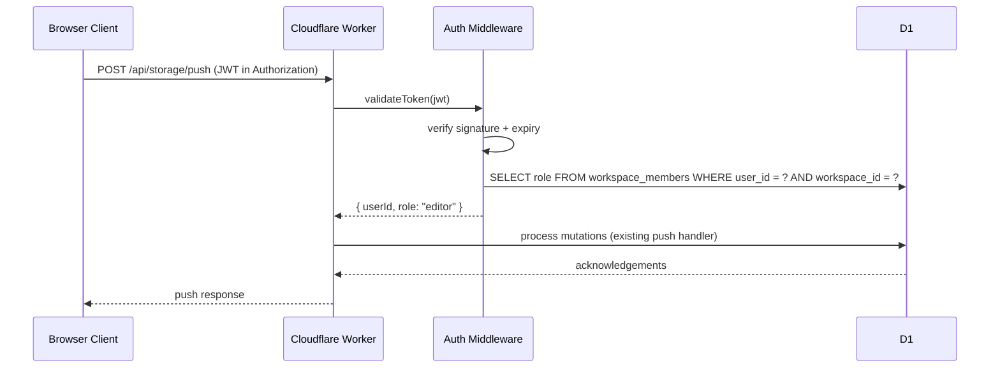
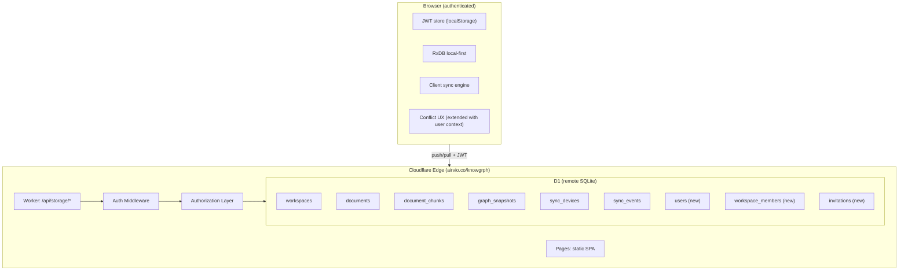

# Knowgrph Multi-User Collaboration - PRD & TAD

**Document Version**: 1.0.0
**Date**: 2026-05-08
**Status**: Proposed
**Scope**: Authentication, authorization, real-time multi-user CRUD collaboration on workspaces, documents, graph snapshots

---

## Document Purpose

**Context**: Knowgrph requires multi-user identity, workspace membership, and permission-gated CRUD collaboration on top of the existing Cloudflare D1 + Worker sync infrastructure.
**Intent**: Enable multiple authenticated users to read, edit, and co-author workspace documents and graph snapshots with role-based access control and conflict-aware sync.
**Directive**: This document defines product requirements and architecture contracts; PRD states WHAT/WHY, TAD states HOW; implementation details remain in code tasks.

---

## Companion Files

| File | Scope |
|---|---|
| `knowgrph-storage-sync-document.md` | Storage ladder, Worker push/pull/export, conflict resolution, RxDB client sync |
| `knowgrph-storage-schemas-document.md` | D1 SQL schema, RxDB shapes, contract types, route contracts |
| `knowgrph-database.md` | RxDB-to-PostgreSQL migration path (deferred) |
| `knowgrph-backend-document.md` | Vite dev/preview middleware |
| `knowgrph-integrations-ssot-sync-directives.md` | Cross-repo publish topology and sync directives |

---

# PART I: PRODUCT REQUIREMENTS DOCUMENTATION (PRD)

## Problem Statement

### Current User Pain Points

**Problem 1: No User Identity**
The storage sync system has no concept of who is editing. Every mutation is scoped to `workspace_id` + `device_id` with no user attribution, making audit trails impossible.

**Problem 2: No Access Control**
Any device that knows a `workspace_id` can push/pull all documents. There is no mechanism to restrict read or write access per user.

**Problem 3: No Real-Time Collaboration Awareness**
Users cannot see who else is viewing or editing the same workspace. Concurrent edits produce silent conflicts with no presence signals.

**Problem 4: SSOT Ambiguity for Multi-User**
The canonical authoring source is a local filesystem (`huijoohwee/docs/`), which is inaccessible to remote collaborators. Multi-user authoring requires D1 to become the operational SSOT.

### Quantified Impact

- Zero authenticated users can collaborate today; the system is single-device anonymous.
- Every push/pull request is unauthenticated; any network observer with a workspace ID can read or mutate data.
- Concurrent edits from two devices on the same document produce revision conflicts with no user context for resolution.
- Remote collaborators cannot access workspace content without the filesystem seed pipeline.

---

## Personas

### Persona 1: Workspace Owner
**Role**: Creator who invites collaborators to a shared workspace
**Goal**: Control who can view and edit workspace documents
**Pain Point**: Cannot share a workspace without exposing full write access to everyone

### Persona 2: Editor
**Role**: Collaborator who co-authors documents and graph snapshots
**Goal**: Edit documents in real-time with other collaborators, see who else is active
**Pain Point**: No awareness of other editors; conflicts discovered only after push rejection

### Persona 3: Viewer
**Role**: Stakeholder who needs read-only access to workspace state
**Goal**: View documents and graph snapshots without risk of accidental edits
**Pain Point**: Cannot access workspace without full write permissions

---

## Epic PRD-E001: Authentication

### Story PRD-E001-S001: Sign In with Email and Password
**As a** workspace user
**I want** to sign in with email and password
**So that** my identity is established and my mutations are attributed to me

**Acceptance Criteria**:
- **Given** the sign-in screen
- **When** user submits valid email and password
- **Then** a JWT is issued and stored client-side
- **And** subsequent push/pull requests include the JWT in the Authorization header

### Story PRD-E001-S002: Sign Up and Workspace Creation
**As a** new user
**I want** to sign up and create a workspace
**So that** I become the owner of a new collaborative workspace

**Acceptance Criteria**:
- **Given** the sign-up screen
- **When** user submits email, password, and display name
- **Then** a user record is created in D1 and a default workspace is created with the user as owner
- **And** the user is redirected to the new workspace

---

## Epic PRD-E002: Authorization

### Story PRD-E002-S001: Role-Based Workspace Access
**As a** workspace owner
**I want** to assign roles (owner, editor, viewer) to members
**So that** collaborators have appropriate read/write permissions

**Acceptance Criteria**:
- **Given** workspace member management
- **When** owner assigns a role to a member
- **Then** the member's push/pull permissions reflect the role
- **And** viewers cannot push mutations; editors can push documents and chunks; owners can manage members

### Story PRD-E002-S002: Permission Enforcement on Push
**As a** workspace member
**I want** the system to enforce my role on every mutation
**So that** unauthorized writes are rejected before reaching D1

**Acceptance Criteria**:
- **Given** an authenticated user with viewer role
- **When** user attempts to push a document mutation
- **Then** the Worker returns 403 Forbidden
- **And** the client displays a permission denied notification

### Story PRD-E002-S003: Invite Members via Email
**As a** workspace owner
**I want** to invite collaborators by email address
**So that** new members can join the workspace without manual provisioning

**Acceptance Criteria**:
- **Given** the workspace member management UI
- **When** owner enters an email and selects a role
- **Then** an invitation record is created
- **And** the invited user sees the workspace in their dashboard after sign-in

---

## Epic PRD-E003: Multi-User Sync

### Story PRD-E003-S001: User-Attributed Mutations
**As a** workspace editor
**I want** my mutations to carry my user identity
**So that** the workspace audit trail shows who changed what

**Acceptance Criteria**:
- **Given** an authenticated editor pushes a document mutation
- **When** the Worker processes the mutation
- **Then** the `sync_events` record includes the authenticated `user_id`
- **And** the document revision history is queryable by user

### Story PRD-E003-S002: Cross-Device State Parity
**As a** user with multiple devices
**I want** my workspace state to be identical across all my devices
**So that** I can switch devices without losing work

**Acceptance Criteria**:
- **Given** user is signed in on two devices
- **When** user edits a document on device A
- **Then** device B receives the mutation on next pull cycle
- **And** both devices show identical document content and revision

### Story PRD-E003-S003: Conflict Resolution with User Context
**As a** workspace editor
**I want** conflict notifications to show who made the conflicting change
**So that** I can coordinate with the other editor

**Acceptance Criteria**:
- **Given** two editors push conflicting revisions to the same document
- **When** the second push is rejected with a conflict
- **Then** the conflict notification includes the other editor's display name and the conflicting revision timestamp
- **And** the user can choose Keep Local, Accept Remote, or Review Log

---

## Epic PRD-E004: SSOT Transition

### Story PRD-E004-S001: D1 Becomes Operational SSOT
**As a** workspace owner
**I want** D1 to be the authoritative data source for all workspace content
**So that** remote collaborators can access and edit without the filesystem seed pipeline

**Acceptance Criteria**:
- **Given** a workspace with members
- **When** any member creates or edits a document
- **Then** the document is persisted to D1 as the canonical version
- **And** the filesystem seed becomes a bootstrap-only source for initial workspace creation

### Story PRD-E004-S002: Optional Filesystem Export
**As a** workspace owner
**I want** to export workspace documents to the local filesystem
**So that** I can maintain a git-backed backup of workspace content

**Acceptance Criteria**:
- **Given** a workspace with documents in D1
- **When** owner triggers a filesystem export
- **Then** all documents are written to a configured local directory as markdown files
- **And** the export is idempotent and does not overwrite newer local changes

---

## Success Metrics

| Metric | Baseline | Target | Timeline | Measurement Method |
|--------|----------|--------|----------|--------------------|
| Authenticated collaboration sessions | 0 | >=2 concurrent users per workspace | Release +4 weeks | D1 sync_events query |
| Push permission enforcement | 0% (no auth) | 100% of push requests authenticated and role-checked | Release +2 weeks | Worker logs |
| Cross-device state parity | 0% (no sync) | 100% document parity within 30s | Release +2 weeks | Integration test |
| Conflict resolution with user context | No user attribution | 100% conflicts show editor identity | Release +4 weeks | Conflict UX tests |
| Unauthorized push rejection rate | N/A | 100% viewer pushes rejected with 403 | Release +2 weeks | Auth middleware tests |

---

## MoSCoW Prioritization

### Must Have
- [PRD-E001-S001] Sign in with email and password (JWT)
- [PRD-E001-S002] Sign up and workspace creation
- [PRD-E002-S001] Role-based workspace access (owner, editor, viewer)
- [PRD-E002-S002] Permission enforcement on push
- [PRD-E003-S001] User-attributed mutations
- [PRD-E003-S002] Cross-device state parity
- [PRD-E004-S001] D1 becomes operational SSOT

### Should Have
- [PRD-E002-S003] Invite members via email
- [PRD-E003-S003] Conflict resolution with user context
- [PRD-E004-S002] Optional filesystem export

### Could Have
- OAuth/social sign-in (Google, GitHub)
- Workspace activity feed (who changed what, when)
- Per-document permission overrides
- Rate limiting per user per workspace

### Won't Have (This Release)
- Real-time WebSocket collaboration (cursor sharing, live edits)
- Operational transform or CRDT-based concurrent editing
- Fine-grained field-level permissions
- Enterprise SSO (SAML, OIDC)
- Audit log retention beyond 30 days

---

## Out of Scope

- Replacing the existing RxDB local-first architecture
- Migrating from D1 to PostgreSQL (remains deferred per `knowgrph-storage-sync-document.md` ADR-003)
- Real-time cursor sharing or live collaborative editing (deferred to Phase 4 per storage-sync roadmap)
- Changing the existing push/pull/export API contract (extends it, does not replace)
- Modifying the existing conflict resolution UX flow (extends it with user context)

---

## Dependencies

### Product Dependencies
- Existing storage sync infrastructure (Worker + D1 + RxDB client sync)
- Existing conflict resolution UX (toast + log + keep-local/accept-remote actions)
- Workspace FS and source-files bootstrap pipeline

### Technical Dependencies
- JWT signing and verification (HS256 or RS256)
- Password hashing (bcrypt or argon2) — can be delegated to Cloudflare Zero Trust or external auth provider
- D1 migration for new `users` and `workspace_members` tables
- Client-side JWT storage and refresh mechanism

### Validation Dependencies
- Existing test fixtures: `canvas/src/__tests__/knowgrphStorageContracts.test.ts`, `knowgrphStorageWorker.test.ts`
- New auth middleware tests
- New permission enforcement tests

---

## Open Questions

1. **Auth provider**: Self-managed JWT in Worker vs. Cloudflare Zero Trust vs. third-party (Clerk, Auth0, Supabase Auth)?
2. **Password storage**: Store hashed passwords in D1 `users` table vs. delegate entirely to external auth provider?
3. **JWT rotation**: Refresh token strategy and token expiry duration?
4. **Invitation delivery**: Email delivery mechanism for member invitations (Cloudflare Email Workers, external SMTP)?
5. **Workspace discovery**: How do invited users discover and navigate to shared workspaces?

---

# PART II: TECHNICAL ARCHITECTURE DOCUMENTATION (TAD)

## Architecture: Multi-User Collaboration

### Overview
**From authenticated user** to **permission-gated CRUD**: Auth middleware validates JWT on every request, authorization layer checks workspace membership and role, then existing sync handlers process mutations with user attribution.

### Journey → System Mapping

| Journey Stage | Workflow | Data Flow | Component |
|---|---|---|---|
| Sign in | Auth workflow | Credentials → JWT | Auth handler |
| Assign role | Member management | Role assignment → D1 | Worker member API |
| Edit document | Push workflow | Mutation + JWT → permission check → D1 upsert | Auth middleware + push handler |
| View workspace | Pull workflow | JWT → permission check → D1 query → client apply | Auth middleware + pull handler |
| Resolve conflict | Conflict workflow | Conflict + user context → UX notification | Conflict UX (extended) |
| Export backup | Export workflow | JWT → permission check → D1 query → filesystem | Export handler (new) |

---

## Component Specifications

### Component: Auth Middleware
**Responsibility**: Validate JWT on every storage API request and extract user identity
**Interfaces**: HTTP Authorization header → decoded JWT payload
**Dependencies**: JWT verification key, D1 `users` table
**Configuration**: JWT secret, token expiry, algorithm

### Component: Authorization Layer
**Responsibility**: Check user role against required permission for each API route
**Interfaces**: User ID + workspace ID → role lookup → allow/deny
**Dependencies**: D1 `workspace_members` table, Auth middleware
**Configuration**: Role-to-permission mapping

### Component: User Store (D1)
**Responsibility**: Persist user identities and credentials
**Interfaces**: CRUD on `users` table
**Dependencies**: D1 database
**Configuration**: Password hash algorithm, email uniqueness constraint

### Component: Membership Store (D1)
**Responsibility**: Persist workspace membership and role assignments
**Interfaces**: CRUD on `workspace_members` table
**Dependencies**: D1 database, User store
**Configuration**: Default role for new members

### Component: Invitation Store (D1)
**Responsibility**: Track pending workspace invitations
**Interfaces**: CRUD on `invitations` table
**Dependencies**: D1 database, User store
**Configuration**: Invitation expiry duration

---

## Integration Contracts

### Interface: Auth Header
**Protocol**: HTTP Bearer token
**Format**: `Authorization: Bearer <jwt>`
**Errors**: 401 Unauthorized (missing/invalid token), 401 TokenExpired

### Interface: Push Route (Extended)
**Protocol**: HTTP POST
**Path**: `/api/storage/push`
**Format**: Existing push request + `Authorization` header
**Errors**: 403 Forbidden (insufficient role), 401 Unauthorized (no auth)

### Interface: Pull Route (Extended)
**Protocol**: HTTP POST
**Path**: `/api/storage/pull`
**Format**: Existing pull request + `Authorization` header
**Errors**: 403 Forbidden (viewer cannot pull — or allow pull for all roles)

### Interface: Export Route (Extended)
**Protocol**: HTTP GET
**Path**: `/api/storage/export/:workspaceId`
**Format**: Existing export + `Authorization` header
**Errors**: 403 Forbidden (non-owner cannot export)

### Interface: Member Management Routes (New)
**Protocol**: HTTP POST/GET/DELETE
**Path**: `/api/storage/members`
**Format**: JSON with `workspaceId`, `userId`, `role`
**Errors**: 403 Forbidden (non-owner cannot manage members), 404 User not found

---

## Architectural Decisions

### ADR-001: JWT Auth in Worker (Not External Provider)
**Status**: Proposed
**Date**: 2026-05-08

**Context**: Multi-user collaboration requires user identity on every request. Options include self-managed JWT in the Worker, Cloudflare Zero Trust, or external auth providers (Clerk, Auth0, Supabase Auth).

**Decision**: Start with self-managed JWT signed and verified in the Cloudflare Worker. Store password hashes in D1 `users` table.

**Alternatives Considered**:
1. Cloudflare Zero Trust: Tight Cloudflare integration but adds complexity for SPA auth flow; requires Access application configuration.
2. Clerk/Auth0/Supabase Auth: Feature-rich but adds external dependency and cost; overkill for MVP user count.

**Rationale**: Self-managed JWT keeps the auth boundary inside the existing Worker + D1 stack with zero additional services. The Worker already validates request structure; adding JWT verification is a thin middleware layer.

**Consequences**:
- **Positive**: No external dependency, no additional TCO, full control over token lifecycle
- **Negative**: Password reset, email verification, and brute-force protection must be implemented manually
- **Neutral**: JWT secret must be stored as a Cloudflare Worker secret (wrangler secret put)

### ADR-002: Three Roles (Owner, Editor, Viewer)
**Status**: Proposed
**Date**: 2026-05-08

**Context**: Workspace access needs at least read/write distinction. Options range from binary (read/write) to fine-grained (per-resource, per-field).

**Decision**: Implement three roles: owner, editor, viewer.

**Alternatives Considered**:
1. Binary read/write: Too coarse; owner cannot delegate read-only access.
2. Per-document permissions: Adds schema complexity; deferred to Could Have.

**Rationale**: Three roles cover the core use cases (full control, co-authoring, read-only sharing) without schema overhead. Per-document overrides can be added later without breaking the role model.

**Consequences**:
- **Positive**: Simple mental model, easy to implement and explain
- **Negative**: Cannot restrict individual document access within a workspace
- **Neutral**: Role is stored as TEXT in `workspace_members.role`; easy to extend later

### ADR-003: D1 Becomes Operational SSOT for Multi-User Workspaces
**Status**: Proposed
**Date**: 2026-05-08

**Context**: The current SSOT is the local filesystem (`huijoohwee/docs/`). Multi-user authoring requires a shared SSOT accessible to all users.

**Decision**: D1 becomes the operational SSOT for any workspace that has more than one member. Single-user workspaces can continue using filesystem as SSOT.

**Alternatives Considered**:
1. Keep filesystem as SSOT and sync to D1: Requires a server-side filesystem or git integration; adds operational complexity.
2. Migrate to PostgreSQL now: Premature per ADR-003 in `knowgrph-storage-sync-document.md`.

**Rationale**: D1 is already the shared store. Flipping SSOT is a workflow change, not a technical migration. The seed pipeline continues to bootstrap new workspaces from filesystem.

**Consequences**:
- **Positive**: No data migration; existing D1 data becomes authoritative
- **Negative**: Filesystem and D1 can diverge; seed script becomes bootstrap-only
- **Neutral**: Optional export script keeps filesystem as a backup mirror

### ADR-004: Auth Middleware as Worker Request Wrapper
**Status**: Proposed
**Date**: 2026-05-08

**Context**: JWT validation must apply to all storage routes. Options include per-route middleware, a single request wrapper, or Cloudflare Filters.

**Decision**: Implement auth as a single request wrapper function that runs before route dispatch in the existing Worker `fetch` handler.

**Alternatives Considered**:
1. Cloudflare Filters: Requires paid plan; adds configuration outside code.
2. Per-route middleware: Duplicates validation logic across handlers.

**Rationale**: A single wrapper function keeps auth logic centralized and testable. The existing Worker already has a `fetch` handler that dispatches by pathname; adding a pre-check is minimal change.

**Consequences**:
- **Positive**: Single point of auth logic, easy to test, no external dependency
- **Negative**: All routes share the same auth behavior; route-specific exemptions require explicit allowlist
- **Neutral**: Export route can be restricted to owner role in the same wrapper

---

## Quality Attributes

| Attribute | Scenario | Pattern | Validation |
|---|---|---|---|
| Performance | Auth check adds <10ms to every push/pull request | JWT verification in Worker (no external call) | Load test with 100 concurrent requests |
| Security | Unauthenticated requests are rejected before D1 access | Auth middleware rejects missing/invalid JWT with 401 | Auth middleware unit tests |
| Security | Viewers cannot push mutations | Authorization layer checks role before push handler | Permission enforcement integration tests |
| Scalability | D1 free tier supports projected multi-user load | 5M reads/day, 100K writes/day sufficient for <50 users | D1 metrics dashboard |
| Observability | Every mutation is attributed to a user | `sync_events` includes `user_id` column | Query sync_events by user |
| Resilience | JWT expiry does not lose unsynced local changes | Client retries push after token refresh | Client sync loop tests |
| Maintainability | Auth is a thin layer over existing sync | Auth middleware wraps existing handlers; no handler rewrite | Diff size of Worker changes |

---

## Deployment Strategy

See `knowgrph-storage-sync-document.md` for the full deployment phase history (Phase 1 and 1.5 are DONE).

### Phase 1 — Auth + Roles (unblock multi-user)
1. Add D1 migration `0002_knowgrph_auth.sql` for `users`, `workspace_members`, `invitations` tables
2. Implement JWT sign/verify in Worker
3. Add auth middleware wrapper to existing `fetch` handler
4. Add authorization checks to push, pull, export handlers
5. Implement sign-up, sign-in, member management API routes
6. Update client sync engine to include JWT in requests
7. Deploy migration and Worker update

### Phase 2 — SSOT Transition
1. Update seed pipeline to bootstrap-only (no write-back)
2. Add optional D1-to-filesystem export script
3. Update workspace creation flow to set D1 as SSOT for multi-member workspaces
4. Update documentation to reflect SSOT change

### Phase 3 — Enhanced Collaboration (future)
1. Add invitation delivery (email or in-app)
2. Extend conflict UX with user identity display
3. Add workspace activity feed
4. Evaluate real-time collaboration (Durable Objects WebSocket) per storage-sync Phase 3

---

## Architecture Diagrams

### Multi-User Auth Flow



### Extended Storage Architecture



---

## Component Inventory

### New Components

| Layer | Component | File | Status |
|---|---|---|---|
| D1 Migration | Auth tables | `cloudflare/d1/migrations/0002_knowgrph_auth.sql` | Proposed |
| Worker | Auth middleware | `cloudflare/workers/knowgrph-storage/auth.ts` | Proposed |
| Worker | Authorization layer | `cloudflare/workers/knowgrph-storage/authorization.ts` | Proposed |
| Worker | Member management routes | `cloudflare/workers/knowgrph-storage/members.ts` | Proposed |
| Worker | Auth routes (sign-up, sign-in) | `cloudflare/workers/knowgrph-storage/authRoutes.ts` | Proposed |
| Client | JWT store and refresh | `canvas/src/lib/storage/knowgrphAuth.ts` | Proposed |
| Client | Auth UI (sign-in, sign-up) | `canvas/src/features/auth/` | Proposed |
| Client | Member management UI | `canvas/src/features/members/` | Proposed |
| Client | Extended conflict UX | `canvas/src/lib/storage/knowgrphStorageConflictUx.ts` (extend) | Proposed |
| Scripts | D1-to-filesystem export | `scripts/export-storage-docs-from-cloudflare.mjs` | Proposed |
| Test | Auth middleware tests | `canvas/src/__tests__/knowgrphAuth.test.ts` | Proposed |
| Test | Permission enforcement tests | `canvas/src/__tests__/knowgrphAuthorization.test.ts` | Proposed |

### Existing Components (Extended)

| Layer | Component | File | Change |
|---|---|---|---|
| Worker | Request handler | `cloudflare/workers/knowgrph-storage/index.ts` | Add auth middleware wrapper |
| Worker | D1 query helpers | `cloudflare/workers/knowgrph-storage/db.ts` | Add user/member query helpers |
| Worker | Contract types | `canvas/src/lib/storage/knowgrphStorageSyncContract.ts` | Add auth-related types |
| Client | Sync engine | `canvas/src/lib/storage/knowgrphStorageClientSync.ts` | Add JWT to requests, auto-clear stale conflicts |
| Client | Sync contract | `canvas/src/lib/storage/knowgrphStorageSyncContract.ts` | Add auth header constant |
| Client | Workspace FS | `canvas/src/features/workspace-fs/workspaceFs.ts` | RxDB CONFLICT retry before degradation |
| Settings | Workspace registry | `canvas/src/features/settings/registry-ui.workspace.ts` | Add `workspace.import.defaultSourceUrl` setting |
| Seed | Seed provider | `canvas/src/features/workspace-fs/workspaceSeedProvider.ts` | Add URL fetch step in priority chain |
| Worker | Public doc view | `cloudflare/workers/knowgrph-storage/index.ts` | `GET /api/storage/doc/:workspaceId/:canonicalPath*` — see ADR-009 |

---

## D1 Schema Extension (Proposed)

```sql
CREATE TABLE IF NOT EXISTS users (
  id TEXT PRIMARY KEY,
  email TEXT NOT NULL UNIQUE,
  display_name TEXT NOT NULL,
  password_hash TEXT NOT NULL,
  created_at TEXT NOT NULL,
  updated_at TEXT NOT NULL
);

CREATE TABLE IF NOT EXISTS workspace_members (
  id TEXT PRIMARY KEY,
  workspace_id TEXT NOT NULL,
  user_id TEXT NOT NULL,
  role TEXT NOT NULL DEFAULT 'editor' CHECK(role IN ('owner', 'editor', 'viewer')),
  invited_by TEXT,
  joined_at TEXT NOT NULL,
  updated_at TEXT NOT NULL,
  FOREIGN KEY (workspace_id) REFERENCES workspaces(id) ON DELETE CASCADE,
  FOREIGN KEY (user_id) REFERENCES users(id) ON DELETE CASCADE,
  UNIQUE (workspace_id, user_id)
);

CREATE TABLE IF NOT EXISTS invitations (
  id TEXT PRIMARY KEY,
  workspace_id TEXT NOT NULL,
  email TEXT NOT NULL,
  role TEXT NOT NULL DEFAULT 'editor' CHECK(role IN ('owner', 'editor', 'viewer')),
  invited_by TEXT NOT NULL,
  token TEXT NOT NULL UNIQUE,
  accepted_at TEXT,
  expires_at TEXT NOT NULL,
  created_at TEXT NOT NULL,
  FOREIGN KEY (workspace_id) REFERENCES workspaces(id) ON DELETE CASCADE,
  FOREIGN KEY (invited_by) REFERENCES users(id)
);

CREATE INDEX IF NOT EXISTS idx_workspace_members_user
  ON workspace_members(user_id);

CREATE INDEX IF NOT EXISTS idx_workspace_members_workspace
  ON workspace_members(workspace_id);

CREATE INDEX IF NOT EXISTS idx_invitations_email
  ON invitations(email);

CREATE INDEX IF NOT EXISTS idx_invitations_token
  ON invitations(token);
```

---

## PRD ↔ TAD Traceability

| PRD Reference | TAD Component | TAD Interface |
|---|---|---|
| PRD-E001-S001, PRD-E001-S002 | Auth Middleware + Auth Routes | JWT sign/verify, POST /api/storage/auth/signup, POST /api/storage/auth/login |
| PRD-E002-S001, PRD-E002-S002, PRD-E002-S003 | Authorization Layer + Member Routes | Role check on push/pull/export, POST/GET/DELETE /api/storage/members |
| PRD-E003-S001 | Push handler (extended) | `sync_events.user_id` column |
| PRD-E003-S002 | Client sync engine (extended) | JWT in Authorization header |
| PRD-E003-S003 | Conflict UX (extended) | User display name in conflict notification |
| PRD-E004-S001 | D1 SSOT (workflow change) | Seed script becomes bootstrap-only |
| PRD-E004-S002 | Export script (new) | GET /api/storage/export/:workspaceId + filesystem write |

---

## Validation Checklist

- [ ] User journey mapped before stories written; every story anchored to a journey stage
- [ ] Workflows defined with trigger, happy path, alternate paths, error paths, and postconditions
- [ ] Data flows typed at every stage boundary with persistence and error handling documented
- [ ] User stories follow "As a... I want... So that" format
- [ ] Acceptance criteria use Given-When-Then with observable outcomes
- [ ] Features prioritized via MoSCoW with rationale
- [ ] Components have single responsibility; interfaces specified with explicit contracts
- [ ] Architectural decisions documented with ADRs
- [ ] Architecture diagrams use Mermaid (not ASCII for >5 nodes)
- [ ] Component inventory table accompanies every architecture diagram
- [ ] PRD-to-TAD traceability established via `PRD-[Epic]-[Story] ↔ TAD-[Component]-[Interface]`
- [ ] No implementation detail in PRD; no business logic in TAD
