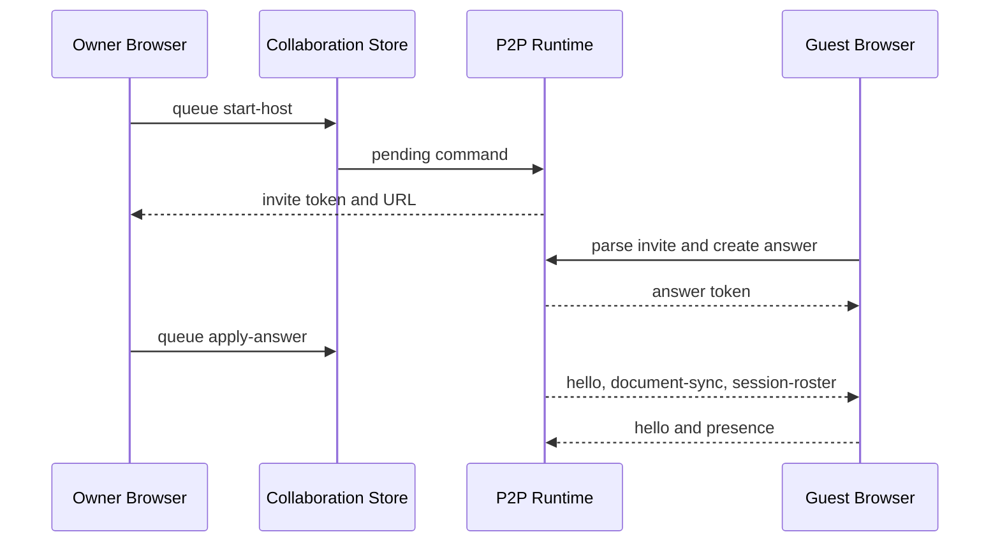

# Knowgrph Multi-User Collaboration - PRD & TAD

**Document Version**: 1.1.2
**Date**: 2026-06-06
**Status**: Accepted and implemented P2P pilot  
**Scope**: MainPanel Collaboration, no-server WebRTC invite/answer sessions, peer roster, presence, document sync, targeted follow mode

---

## Document Purpose

**Context**: Knowgrph ships a MainPanel Collaboration pilot for no-server peer-to-peer collaboration on the active workspace document. The shipped path uses a two-step invite/answer handshake, WebRTC data channels, owner-hosted multi-peer relay, live document sync, remote caret presence, roster state, and targeted follow mode.

**Intent**: Preserve a precise source-owned record of the implemented pilot, make PRD and TAD evidence evaluable by tests, and keep the larger authenticated membership model as a planned extension until its source owners and tests exist.

**Directive**: Collaboration behavior must remain source-owned by the existing P2P protocol, store, runtime hook, and MainPanel view. Do not add parallel collaboration panels, downstream patches, hardcoded room fixtures, or compatibility aliases for unimplemented auth plans.

## Phase Gate Summary

| Phase | Guideline Gate | Status | Evidence |
|---|---|---|---|
| Problem discovery | Scope is validated and ROI-positive at projected TCO | Passed | Existing users need fast same-document collaboration without operator setup |
| PRD authoring | Stories, acceptance, MoSCoW, ROI, and TCO are explicit | Passed | Product Contract, Prioritization, Success Metrics |
| TAD authoring | Components, data flows, contracts, ADRs, and quality attributes are explicit | Passed | Architecture Contract, Data Flow, ADR, Quality Attributes |
| Alignment | Requirements trace to implementation and `/goal` conditions | Passed | Requirement Traceability Matrix and Goal Conditions |
| Living document | Version-stamped and scoped to source-owned behavior | Passed | Version `1.1.2`; planned extension boundary retained |

## Product Contract

### Problem Statement

Single-user workspace editing blocks pair-review, guided exploration, and handoff moments. A collaborator should be able to join the active document quickly, see who else is present, receive document updates, and optionally follow a selected peer without requiring a server-side room service.

### Personas

| Persona | Job To Be Done | Success Signal |
|---|---|---|
| Workspace owner | Start a collaboration session from the current workspace document | Invite token or URL is generated and shareable |
| Guest collaborator | Join a host session from an invite and return an answer | Host can apply the answer and establish a data channel |
| Reviewer or navigator | Follow one selected remote peer | Viewport reveal is targeted and stops when the peer leaves |

### Journey: Workspace Owner and Guest - Active Document Collaboration

| Stage | Action | Touchpoint | Pain Point | Opportunity |
|---|---|---|---|---|
| Trigger | Owner needs another person to inspect the current document | MainPanel Collaboration tab | Collaboration is otherwise external to the canvas | Keep the workflow inside Knowgrph |
| Discover | Owner starts a host session | Collaboration actions | Server rooms would require setup and auth | Generate a no-server WebRTC invite |
| Engage | Guest joins and returns an answer | Invite and answer token fields | Connection setup needs deterministic metadata | Preserve session, owner, peer, and document keys |
| Complete | Peers exchange roster, presence, and document state | WebRTC data channel | Multi-peer state can drift | Owner relays roster and document updates |
| Return | Peer follows a selected collaborator | Follow target control | Untargeted presence can cause noisy jumps | Reveal only the selected live remote peer |

### User Stories and Acceptance Criteria

| ID | Story | Acceptance Criteria | `/goal` Condition |
|---|---|---|---|
| PRD-COLLAB-01 | As a workspace owner, I want to start a host session and generate an invite token or URL so another peer can join my active document without a server-side room service. | MainPanel exposes `collaboration`; the shared panel-open event accepts the collaboration tab; the view queues `start-host`; runtime creates version, invite id, session id, owner peer id, host peer id, display name, document key, offer, and created time; invite uses shared token helpers and `kgCollab`. | `multiUserCollaboration.docs.implementedP2POwners`, `collaboration.runtime.host.remount.preservesPendingInvite`, and `npm --prefix canvas run validate:multi-user-collaboration:e2e` pass |
| PRD-COLLAB-02 | As a guest, I want to paste an invite and generate an answer token so the host can complete the WebRTC connection. | Store queues `join-invite`; `parseP2PInviteInput()` validates the invite; answer preserves session, owner, invite, guest, and display-name metadata; answer can be carried by `kgCollabAnswer`. | `collaboration.protocol.inviteAnswerRoster.preserveOwnerMetadata` passes |
| PRD-COLLAB-03 | As the host, I want to relay roster, presence, and document updates across connected guests so each peer sees the active collaboration state. | Wire messages include `hello`, `presence`, `document-sync`, and `session-roster`; document sync includes stable document key and text hash; host broadcasts roster updates; remote peers include ownership, connection state, caret line, and last-seen metadata. | `collaboration.runtime.hostRelay.multipeerRosterPresenceAndDocument` passes |
| PRD-COLLAB-04 | As a collaborator, I want follow mode to reveal only the selected live remote peer so collaboration does not cause noisy viewport or caret jumps. | Store scopes `followPeerId` to live remote peers; reveal is gated by `followModeEnabled` and selected peer; disconnect or removal clears stale follow targets. | `collaboration.store.followTarget.scopedToLiveRemotePeers` and `collaboration.runtime.followMode.revealsOnlyTargetedPeer` pass |

### MoSCoW, ROI, and TCO

| Priority | Capability | ROI Score | TCO Estimate | Rationale |
|---|---|---:|---:|---|
| Must | MainPanel P2P invite/answer, roster, presence, document sync, follow target | 12 | 0 USD/month infra; 0 model tokens | Highest value per scope unit because it ships collaboration without server setup |
| Should | Runtime lifecycle guards for disconnect, owner removal, and remount | 9 | 0 USD/month infra; 0 model tokens | Prevents stale sessions and false collaboration state |
| Could | Authenticated membership, server audit, Durable room service | 4 | Non-zero Worker/D1/room operation cost | Deferred until source-owned auth and persistence owners exist |
| Won't for pilot | Parallel collaboration panels, hardcoded room fixtures, legacy alias remapping | 0 | Not accepted | Conflicts with source ownership and neutral architecture |

ROI estimate uses `(User Impact x Reach) / (Build Hours + Monthly TCO + Token Cost / Month)`. The pilot stays inside a zero-token, browser-native path; no AI harness is invoked by this feature.

### Success Metrics

| Metric | Baseline | Target | Evidence |
|---|---|---|---|
| Collaboration discoverability | Collaboration absent from MainPanel | `MAIN_PANEL_TABS` includes `collaboration` | `multiUserCollaboration.docs.implementedP2POwners` |
| Invite/answer fidelity | Peer metadata can be dropped | Owner/session/peer metadata round-trips | `collaboration.protocol.inviteAnswerRoster.preserveOwnerMetadata` |
| Runtime relay | Single-peer or stale relay risk | Multi-peer roster, presence, and document relay covered | `collaboration.runtime.*` |
| Follow-mode safety | Presence can reveal the wrong peer | Reveal only selected live peer and clear stale target | `collaboration.store.followTarget.scopedToLiveRemotePeers` |
| Cost envelope | Server room cost would be non-zero | 0 USD/month infra and 0 model tokens for pilot | Browser WebRTC and local runtime tests |
| No auth overclaim | Planned auth could be mistaken as shipped | Docs guard rejects shipped-language claims for D1/JWT auth | `multiUserCollaborationDocs.test.ts` |

## Architecture Contract

### Implemented Baseline

| Capability | Source Owner | Status |
|---|---|---|
| MainPanel Collaboration tab | `canvas/src/features/panels/mainPanelTabs.ts` | Shipped |
| Collaboration UI rows and actions | `canvas/src/features/panels/views/CollaborationView.tsx` | Shipped |
| Invite/answer token protocol | `canvas/src/features/collaboration/p2pCollaborationProtocol.ts` | Shipped |
| Session, peer, follow, and command state | `canvas/src/features/collaboration/p2pCollaborationStore.ts` | Shipped |
| WebRTC runtime and owner relay | `canvas/src/features/collaboration/useP2PCollaborationRuntime.ts` | Shipped |
| Runtime state and command effects | `canvas/src/features/collaboration/p2pCollaborationRuntimeState.ts`, `canvas/src/features/collaboration/useP2PCollaborationCommandEffect.ts` | Shipped |
| Broadcast effects | `canvas/src/features/collaboration/useP2PCollaborationBroadcastEffects.ts` | Shipped |
| Collaboration icon semantics | `canvas/src/features/panels/ui/mainPanelTypeIcons.tsx` | Shipped |
| App-level Collaboration open and host invite smoke | `canvas/src/components/toolbar/useCanvasToolbarContext.ts`, `canvas/scripts/verify-multi-user-collaboration-e2e.ts` | Shipped |
| Runtime and UI regression tests | `canvas/src/__tests__/mainPanelCollaboration.test.tsx` and split collaboration test owners | Shipped |

### Component Specifications

| Component | Responsibility | Inputs | Outputs | Failure Handling |
|---|---|---|---|---|
| `CollaborationView.tsx` | Render session controls, roster rows, follow controls, and owner actions | Store state and registered MainPanel actions | Queued collaboration commands and visible peer state | Disables invalid actions and surfaces status/error text |
| `p2pCollaborationProtocol.ts` | Encode, decode, and validate invite, answer, and wire messages | URL token or JSON wire message | Typed collaboration payload | Rejects malformed payloads without mutating session state |
| `p2pCollaborationStore.ts` | Own session state, peer roster, follow target, and command queue | UI commands and runtime updates | Zustand collaboration state | Clears stale follow targets and resets invalid session state |
| `useP2PCollaborationRuntime.ts` | Bind WebRTC lifecycle to store/runtime effects | Active document key/text and callbacks | Data channel messages and remote document application | Closes stale connections and emits explicit runtime errors |
| `useP2PCollaborationCommandEffect.ts` | Execute start, join, apply-answer, disconnect, and remove-peer commands | Pending command and runtime refs | Session phase updates and peer connection setup | Fails closed on invalid WebRTC or mismatched answer state |
| `useP2PCollaborationBroadcastEffects.ts` | Broadcast local document, hello, presence, and roster changes | Active document, follow, and local caret state | `document-sync`, `hello`, `presence`, `session-roster` messages | Debounces document sends and avoids echo loops |

### Workflow: Host Invite and Guest Answer

**Trigger**: Owner selects Collaboration and starts a host session.
**Actors**: Owner browser, guest browser, Collaboration view, store, protocol helpers, WebRTC runtime.

**Happy Path**:
1. Owner queues `start-host`; runtime creates a WebRTC offer and encoded invite.
2. Guest pastes invite and queues `join-invite`; runtime creates an answer.
3. Owner applies the answer; both peers open a data channel.
4. Runtime sends hello, presence, document sync, and roster messages.

**Alternate Paths**:
- Owner starts another invite before applying an answer: pending invite is closed and replaced by the new source-owned invite.
- Guest reconnects from a new answer: owner applies only the answer matching the current session and invite id.

**Error Paths**:
- Browser lacks WebRTC: runtime sets an explicit error and leaves the session closed.
- Answer metadata mismatches the current invite: runtime rejects the answer and preserves the current session state.

**Postconditions**: Store contains local and remote peers, connection phase is connected, roster metadata is current, and document/follow updates flow only through the runtime owner.

### Data Flow: Active Document Collaboration

| Stage | Component | Input Format | Output Format | Persistence | Error Handling |
|---|---|---|---|---|---|
| Ingest | `CollaborationView.tsx` | UI action and token text | Store command | Store memory only | Reject empty or invalid command state |
| Transform | `p2pCollaborationProtocol.ts` | Encoded invite/answer or JSON wire message | Typed payload | None | Return parse failure before runtime mutation |
| Transport | WebRTC data channel | Typed wire message serialized as JSON | Peer message event | Browser connection only | Close channel and update peer state on disconnect |
| Store | `p2pCollaborationStore.ts` | Runtime peer/session updates | Roster, phase, follow state | Client runtime state | Clear stale peer/follow data |
| Consume | Active document runtime callbacks | `document-sync` and presence payloads | Remote document apply and line reveal | Active workspace document owner | Suppress echo signatures and skip mismatched documents |

### Integration Contracts

| Contract | Required Fields | Owner |
|---|---|---|
| Invite token | protocol version, kind, invite id, session id, owner peer id, host peer id, host display name, document key, offer, created time | `p2pCollaborationProtocol.ts` |
| Answer token | protocol version, kind, invite id, session id, owner peer id, guest peer id, guest display name, answer, created time | `p2pCollaborationProtocol.ts` |
| Wire message | protocol version, kind, session id, peer metadata, sent time, plus message-specific payload | `p2pCollaborationProtocol.ts` |
| Runtime command | monotonic command id, command kind, optional peer id | `p2pCollaborationStore.ts` |

### ADR-001: Browser-Native P2P Pilot Before Authenticated Rooms

#### Context

Knowgrph needs collaborative canvas/document workflows, but authenticated membership, server audit, and room persistence require separate source owners. Shipping those concepts as claims before implementation would create stale architecture and false acceptance criteria.

#### Decision

Ship the implemented baseline as a browser-native WebRTC P2P pilot owned by MainPanel, protocol, store, and runtime modules. Keep authenticated collaboration as a planned extension until Worker/D1/room owners and tests exist.

#### Alternatives Considered

| Alternative | FOSS / Vendor | 12-Month TCO | Decision |
|---|---|---:|---|
| Browser WebRTC data channel | Browser-native open standard | 0 USD infra | Accepted for pilot |
| Durable room service | Cloudflare Worker/Durable Object | Non-zero operational cost | Deferred until server-owned acceptance exists |
| Proprietary realtime service | Vendor managed service | Non-zero subscription and egress risk | Rejected for pilot |

#### Rationale

The accepted path maximizes value per scope unit, avoids new infrastructure, and keeps implementation traceable to existing source owners.

#### Consequences

The pilot supports active peer sessions without server persistence. Authenticated membership, D1 role checks, server-side audit trails, and Durable Object rooms are not part of the implemented baseline.

### Quality Attributes

| Attribute | Scenario | Target | Verification |
|---|---|---|---|
| Reliability | Peer disconnects or owner removes a guest | Stale peer and follow target clear deterministically | `collaboration.runtime.ownerRemoval.keepsSessionAliveAndBroadcastsRoster` |
| Security | Malformed invite, answer, or wire message appears | Parser rejects before runtime mutation | Protocol parser tests |
| Performance | Active document changes while peers are connected | Broadcast is debounced and echo-suppressed | Runtime relay tests |
| Observability | Session state changes | UI exposes phase, status, roster, and error text | MainPanel Collaboration UI tests |
| Token cost | Collaboration runtime executes | 0 model calls and 0 tokens | No AI harness in component inventory |
| TCO | Pilot runs locally in browsers | 0 USD/month infra for shipped baseline | ADR-001 |

## Out of Scope for the Implemented Pilot

- Email/password sign-up and sign-in.
- Workspace membership tables and invitation email delivery.
- Permission-gated D1 CRUD routes.
- Durable Objects room servers.
- Multi-document merge/conflict UI.
- Treating D1/JWT auth as shipped.

## Planned Extension Boundary

The larger authenticated collaboration model remains a planned extension. It must be implemented through source-owned Worker/D1 auth, membership, and authorization owners before this document can mark those capabilities as shipped.

| Planned Capability | Required Owner Before Acceptance |
|---|---|
| User auth and JWT validation | storage Worker auth middleware and focused tests |
| Workspace roles | D1 membership schema and role-checking routes |
| Permission-gated push/pull/export | storage Worker route checks |
| Server-backed activity/audit trail | D1 sync-event user attribution |
| Durable multi-peer room service | Durable Object or Worker-backed room owner |

## Deployment Strategy

This document is Dev-scoped. Do not deploy, publish to the Prod mirror, or push to Cloudflare until the user explicitly requests it. Runtime validation stays local through focused unit tests, docs guards, TypeScript, and the app-level E2E smoke command.

## Continuation

Technical architecture continues in [knowgrph-multi-user-collaboration-prd.tad.companion.md](knowgrph-multi-user-collaboration-prd.tad.companion.md).

---

## Requirement Traceability Matrix

| Requirement | Source Owner | Validation |
|---|---|---|
| PRD-COLLAB-01 top-level Collaboration tab and host invite | `mainPanelTabs.ts`, `useCanvasToolbarContext.ts`, `CollaborationView.tsx`, `useP2PCollaborationCommandEffect.ts`, `verify-multi-user-collaboration-e2e.ts` | `mainPanelCollaboration.test.tsx`, `multiUserCollaborationDocs.test.ts`, `collaboration.runtime.host.remount.preservesPendingInvite`, `npm --prefix canvas run validate:multi-user-collaboration:e2e` |
| PRD-COLLAB-02 invite/answer protocol | `p2pCollaborationProtocol.ts` | `collaboration.protocol.inviteAnswerRoster.preserveOwnerMetadata` |
| PRD-COLLAB-03 peer/follow/session state | `p2pCollaborationStore.ts` | `collaboration.store.followTarget.scopedToLiveRemotePeers` |
| PRD-COLLAB-03 runtime relay | `useP2PCollaborationRuntime.ts`, `useP2PCollaborationBroadcastEffects.ts` | `collaboration.runtime.*` tests |
| PRD-COLLAB-04 UI roster/actions and follow controls | `CollaborationView.tsx` | `ui.mainPanel.collaboration.*` tests |

## Goal Conditions

| Goal | Command or Evidence | Passing Condition |
|---|---|---|
| Docs match shipped owners | `npm --prefix canvas run test:ci:unit -- "multiUserCollaboration.docs"` | 1/1 docs guard passes |
| Collaboration behavior remains intact | `npm --prefix canvas run test:ci:unit -- "collaboration."` | protocol, store, UI, and runtime tests pass |
| MainPanel UI remains stable | `npm --prefix canvas run test:ci:unit -- "ui.mainPanel.collaboration"` | roster, owner removal, and action registration tests pass |
| App-level host invite flow works | `npm --prefix canvas run validate:multi-user-collaboration:e2e` against a local Vite server | The shared editor-workspace query route mounts the Markdown runtime, the Collaboration tab opens, `Start Host` reaches `Invite ready. Waiting for guest answer...`, and the active document peer row is visible |
| Type contracts remain valid | `npm --prefix canvas exec tsc -- -p canvas/tsconfig.json --noEmit --pretty false` | TypeScript exits 0 |

## Open Questions

| Question | Decision Needed Before Expansion |
|---|---|
| What identity model should authenticated collaboration use? | Source-owned auth middleware, role schema, and tests |
| Should server rooms preserve offline state or only coordinate live peers? | Durable room TAD with explicit persistence and TCO |
| How should multi-document conflicts be surfaced? | Workspace merge UX and CRDT-backed document contract |

---

## Revision History

| Version | Date | Author | Summary |
|---|---|---|---|
| 1.0.0 | 2026-05-08 | joohwee | Initial authenticated D1/JWT collaboration plan |
| 1.1.0 | 2026-05-29 | joohwee | Promoted implemented no-server P2P Collaboration pilot and moved D1/JWT auth to planned extension boundary |
| 1.1.1 | 2026-06-06 | Codex | Aligned the combined PRD/TAD with YAML frontmatter, ROI/TCO, ADR, workflow, data-flow, traceability, and `/goal` guideline requirements |
| 1.1.2 | 2026-06-06 | Codex | Added app-level Collaboration panel-open and host-invite E2E validation to the implementation contract |
