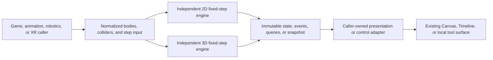

# Knowgrph Independent Native 2D And 3D Physics Engines PRD/TAD

## Outcome

Knowgrph owns two small, browser-local physics cores: a planar 2D engine for games, animation tooling, and bounded robotics experiments, and a spatial 3D engine that preserves the existing XR cuboid simulation behind a canonical physics feature owner. Both advance only through explicit fixed steps and remain independent of any external physics runtime.

The [Rapier repository](https://github.com/dimforge/rapier) is a principles-only reference for useful domain separation: bodies and colliders are distinct, simulation stepping is authoritative, interaction events are consumed after a step, queries read the same world, and snapshots identify their dimension and version. Knowgrph's implementation, terminology, data model, algorithms, constants, event and snapshot formats, tests, examples, file layout, and APIs are independently authored.

This document does not claim API compatibility, file-format interchange, numerical equivalence, benchmark parity, or a port of Rapier. Packages under the `@dimforge/rapier2d*` or `@dimforge/rapier3d*` families, compatibility layers, copied source, translated source, and copied fixtures or examples are forbidden in manifests, lockfiles, and runtime code.

## Product boundary

### Supported in this increment

| Capability | Native 2D | Native 3D |
|---|---|---|
| Body/collider ownership | Separate body and collider records | Separate body and collider records; XR adapts its persisted bodies and structures |
| Motion | Static, dynamic, and kinematic bodies | Static, dynamic, and kinematic bodies |
| Shapes | Box and circle colliders, including body-relative offset and rotation | Cuboid and sphere colliders plus optional horizontal ground |
| State | Position, rotation, linear velocity, and angular velocity | Position and linear velocity |
| Step | Explicit deterministic fixed step with bounded work and lossless retained backlog | Existing deterministic fixed-step and bounded-substep XR flow |
| Interaction | Layer/mask filtering, solid contacts, and sensors | Layer/mask filtering, solid contacts, sensors, and XR contact projection |
| Events | Buffered begin/end events for collisions and sensors | Buffered begin/end events for collisions and sensors |
| Queries | Point, shape-overlap, and ordered ray-hit queries | Point, shape-overlap, and ordered ray-hit queries |
| Snapshot | JSON-safe, stable, versioned `2d` snapshot and restore | JSON-safe, stable, versioned `3d` snapshot and restore |

### Explicitly not supported

- Capsule, mesh, height-field, soft-body, or fluid simulation.
- 3D orientation, angular velocity, torque, or inertia.
- Joints, articulation constraints, joint limits, motors, inverse kinematics, or robot dynamics.
- Continuous broadphase scaling guarantees, parallel/Wasm execution, or network lockstep.
- Automatic migration of Game Mode's bounded AABB/hitscan geometry owner.
- Physics-authored Timeline tracks, animation blending, rendering, persistence, remote sync, or deployment.

For robotics, this increment supports deterministic planar body motion, sensor volumes, spatial queries, and collision/trajectory checks. It is not an articulated-robot simulator and must not be presented as one. For animation, physics produces poses that an existing animation owner may consume; the physics cores do not own clips, mixers, keyframes, or export. For games, callers retain input, scoring, lifecycle, and rendering ownership.

## Requirements

### P-1: Independent source authority

- Physics implementation lives only under `canvas/src/features/physics/`.
- XR keeps its persisted world model and render adapter, but delegates stepping to the canonical 3D owner.
- The previous renderer-local 3D stepper is removed after direct caller migration; no alias or compatibility shim remains.
- The canonical Physics Playground seed remains byte-identical and keeps `run_ready_demo.id: xr-physics` and `external_dependencies: []`.

### P-2: Deterministic stepping

- A caller supplies elapsed time or an explicit fixed-step request; engines never create their own animation loop or timer.
- Stable identifiers define iteration, pair, query tie-break, event, and snapshot order.
- Invalid or non-finite input fails closed before committed state changes.
- Repeatability is scoped to the same implementation build, normalized configuration, initial snapshot, ordered input, and fixed-step sequence; cross-version or cross-runtime bit identity is not promised.

### P-3: Separate simulation from presentation

- Neither engine imports React, React Three Fiber, Three.js, D3, browser storage, MCP, or network transports.
- 2D and 3D share design rules, not vector types or dimension-erasing state.
- Renderer and feature adapters read immutable projections and write normalized commands.
- One existing React Three Fiber Canvas remains the sole 3D presentation owner.

### P-4: Observable interactions

- 2D and 3D contact and sensor transitions are buffered during stepping and drained by the caller after the committed step.
- Queries are read-only, apply the same collision filtering rules as simulation, and use stable tie-breaking.
- A snapshot declares its format, version, and dimension before any restore is accepted.
- Unsupported shapes, dimensions, snapshot versions, or missing identities return typed failures rather than approximating silently.

## Technical architecture

### 2D owner

`planarPhysicsTypes.ts` defines dimension-specific body, collider, event, query, and snapshot contracts. `planarPhysicsGeometry.ts` owns independent box/circle geometry and query math. `planarPhysicsEngine.ts` owns normalized world mutation, accumulator state, stable pair transitions, stepping, event draining, snapshot capture, and restore.

The engine stores a body's motion separately from one or more colliders. Dynamic bodies integrate linear and angular state; kinematic bodies move only through caller commands; static bodies never integrate. Sensors report overlap transitions without applying separation or impulses.

### 3D owner and XR adapter

`spatialPhysicsTypes.ts`, `spatialPhysicsGeometry.ts`, `spatialPhysicsStep.ts`, and `spatialPhysicsEngine.ts` own the independent 3D contracts, cuboid/sphere geometry, normalized world mutation, fixed stepping, sensors, ordered event drain, point/overlap/ray queries, and versioned snapshot restore. The engine retains the migrated XR behavior for gravity, linear damping, impulses, swept time-of-impact, penetration recovery, optional horizontal ground, static/body contacts, and filters. XR configuration remains normalized by `xrPhysicsModel.ts`; `xrSpatialPhysicsAdapter.ts` maps its bottom-anchored cuboids and contact identities to the shared owner; `XrPhysicsStageRuntime.tsx` and native-controller callers project accepted results into the retained authored scene.

The migration changes ownership, not the persisted XR schema or canonical source document. The shared engine adds sphere support for new callers, while the XR adapter remains cuboid-based; neither path adds 3D rotation, joints, or a second scene.

### Lifecycle and failure handling

| Condition | Required behavior |
|---|---|
| Non-finite configuration or command | Reject before mutation with a typed error |
| Fixed-step backlog exceeds the per-call step bound | Retain the complete remainder for later drains and report the step result honestly |
| Unknown body/collider identity | Return the command's explicit `false` or the read's explicit `null`; never create an implicit object |
| Unsupported snapshot format, version, or dimension | Reject restore and retain the current world unchanged |
| Callback or presentation failure | Preserve the committed physics step; surface the adapter error separately |
| External package or compatibility alias appears | Fail the source-authority guard, including manifest and lockfile scans |

## Acceptance criteria

1. Two fresh 2D worlds with the same normalized configuration, snapshot, commands, and fixed steps produce the same ordered bodies, colliders, events, query results, and snapshot bytes.
2. 2D solid contacts affect motion; sensor contacts emit transitions without changing motion; filters suppress both interaction and matching queries.
3. Point, overlap, and ray queries return stable identity order and do not mutate the world.
4. A 2D snapshot round trip preserves tick, remainder, body/collider state, active pairs, and pending events; wrong-dimension or wrong-version restore fails closed.
5. 3D cuboid/sphere contacts, sensors, filtering, ordered event drain, point/overlap/ray queries, and a `3d` snapshot round trip are deterministic under the stated fixed-step boundary.
6. Existing XR physics behavior remains source-compatible after direct migration to the canonical 3D owner, including fixed steps, impulses, swept cuboid collision, masks, contacts, reset, and pause/resume lifecycle.
7. The Game FPS bounded geometry owner remains unchanged until a dedicated migration proves gameplay and browser parity.
8. No new Canvas, source seed, runtime route, storage schema, network call, external physics package, compatibility layer, or Rapier-derived source/test/example artifact exists.

## Validation

- Focused 2D engine tests cover integration, filtering, sensors, ordered events, queries, snapshot round trips, invalid restore, and repeat runs.
- Focused 3D engine tests cover cuboid/sphere integration, filtering, sensors, ordered events, queries, snapshot round trips, invalid restore, and repeat runs.
- Existing XR physics source/runtime tests cover the 3D ownership migration and scene retention.
- The source-authority guard discovers every workspace package manifest and recognized npm, pnpm, or Yarn lockfile, then rejects Rapier 2D/3D package-family references, including compatibility and npm-alias entries.
- Game Mode source/runtime and serial browser smoke remain the proof boundary for unchanged gameplay ownership.
- Production and Cloudflare deployment are outside this Dev task.

## Follow-up gates

Any capsule/mesh support, 3D angular dynamics, joint/motor system, articulated robotics, broadphase replacement, Game Mode migration, worker/Wasm execution, or multiplayer synchronization requires a separate scoped PRD/TAD update and focused proof. It may reuse these independent contracts but cannot introduce an external compatibility surface or change the canonical seed implicitly.
