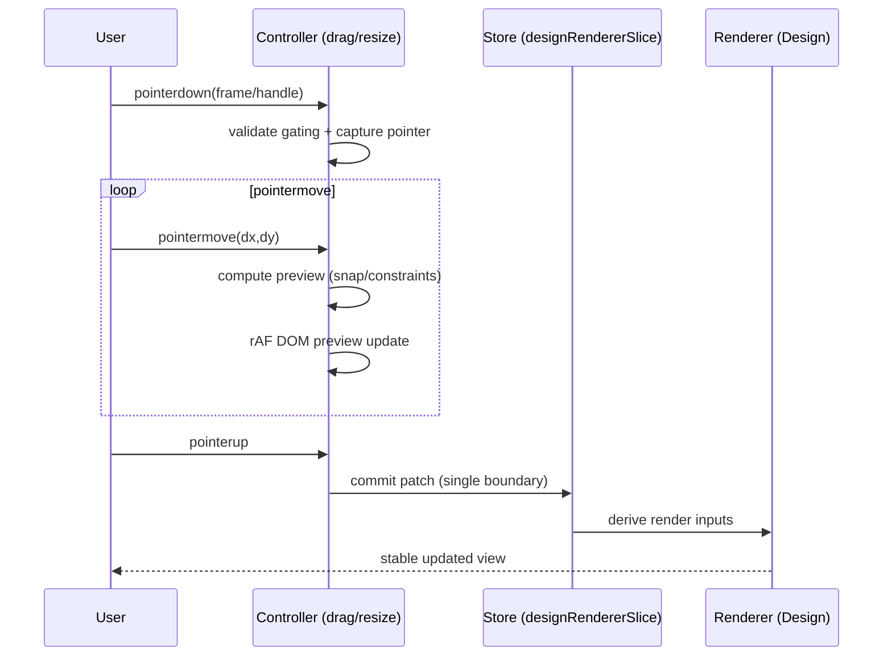

# Knowgrph Design Canvas Editor (Reference-editor inspired): PRD & TAD

**Document Version**: 0.2.1  
**Date**: 2026-05-14  
**Status**: Proposed (Dev-only first)

## Document Purpose

**Context**: Knowgrph has a Design (2D) renderer that lays out “frames” for graph nodes and webpage wireframe overlays, but the editing surface is not yet a cohesive design-editor experience (discoverability, structured tool affordances, Design-only undo/redo, and consistent edit boundaries).  
**Inspiration (no copying)**: Use the mental model of a lightweight “reference design editor” (layers + inspector + tool modes + predictable shortcuts) similar to OpenPencil, but implement natively in-repo with no code import, no repo copying, and no UI/assets duplication.  
**Intent**: Enhance the existing in-repo Canvas 2D Design renderer into a minimal design editor UI/UX (select/move/resize, pan/zoom, undo/redo) while preserving renderer semantics and performance budgets.  
**Directive**: Implement natively in-repo; reuse existing SSOTs (selection, zoom, semantic keys, layout derivations); avoid churn/duplication/hardcodes; introduce no behavior changes in Phase 0 refactors.

---

# PART I: PRODUCT REQUIREMENTS DOCUMENTATION (PRD)

## Problem Statement

### Current User Pain Points

**Problem 1: No Design-only undo/redo**  
Users can undo/redo GraphData snapshots, but Design-only edits (frame positions/sizes, layer visibility/order) are not reversible as a coherent command stream, causing “trial-and-error” churn.

**Problem 2: Editing boundaries are implicit**  
Dragging/resizing commits directly to the store without durable “operation boundaries” (begin/commit/cancel), making it difficult to integrate history, analytics, and future collaboration.

**Problem 3: Interaction parity is fragmented**  
Design has strong core interactions, but the UX contract is distributed across multiple controllers; consistency with a “design editor mental model” (tool modes, shortcuts, predictable snapping) is harder to guarantee as features grow.

**Problem 4: Design editor affordances are hidden**  
Design-specific tools exist, but are not presented as a coherent editor surface (layers, inspector, “active tool” visibility). Users must infer capabilities from disparate menus.

### Quantified Impact (initial baselines; refine after instrumentation)

- **Undo recovery cost**: users must manually restore layouts after accidental edits (no Design-only history)
- **Interaction confidence**: frequent “micro-adjust” churn due to lack of reversible edits
- **Performance risk**: new features could introduce re-render/recompute loops without a dedicated invalidation contract

---

## User Personas

### Persona 1: Knowledge Curator
**Goal**: Arrange graph-derived frames into a readable narrative layout (wireframe-like)  
**Pain**: Cannot safely explore layout changes without undo/redo

### Persona 2: Research Analyst
**Goal**: Produce stable, repeatable layouts for sharing/exporting snapshots  
**Pain**: Layout drift and irreversible changes make exports unreliable

### Persona 3: Builder / Maintainer
**Goal**: Extend the Design editor without regressions (performance, semantics, mode parity)  
**Pain**: Missing contracts for edit boundaries and invalidation increase maintenance risk

---

## Journey: Knowledge Curator — “Layout a page-like canvas”

| Stage    | Action                                 | Touchpoint                     | Pain Point                                  | Opportunity                                  |
|----------|----------------------------------------|--------------------------------|---------------------------------------------|----------------------------------------------|
| Trigger  | Switch to Design renderer              | Toolbar → Canvas View Mode     | No clear “editing mode” mental model         | Introduce explicit Design editor UX contract |
| Discover | Select and inspect frames              | Canvas + floating panel (DOM)  | Layers/inspector affordances not surfaced    | Add Design panels: Layers + Inspector        |
| Engage   | Drag/resize/align/distribute frames    | Canvas + arrange bar + keys    | Hard to trial variations safely              | Command-based edits with boundaries          |
| Complete | Export snapshot                         | Canvas snapshot/export surfaces| Layout must be stable and reproducible       | Persisted per-dataset Design state + history |
| Return   | Re-open same dataset and continue edit | Workspace + saved state         | Drift across sessions                        | Deterministic restore + bounded migrations   |

---

## Epic 1: Minimal Design Editor Interactions (Parity + Consistency)

### Story PRD-1.1: Select + Multi-select
**As a** knowledge curator  
**I want** to select one or multiple frames via click and marquee  
**So that** I can apply move/resize/arrange actions consistently

**Acceptance Criteria**:
- **Given** Design renderer is active
- **When** user clicks a frame
- **Then** the selection updates without triggering layout recomputation
- **When** user drags a marquee box
- **Then** frames intersecting the marquee become selected (Shift adds to selection)

**Priority**: MUST HAVE

### Story PRD-1.2: Move (drag) with snap + constraints
**As a** knowledge curator  
**I want** to drag selected frames with optional snap-to-grid and containment constraints  
**So that** layout edits are precise and bounded

**Acceptance Criteria**:
- **Given** snap grid is enabled in schema
- **When** user drags frames
- **Then** positions snap to grid unless Alt bypasses snapping
- **And** containment rules (group bounds) prevent illegal drags when configured

**Priority**: MUST HAVE

### Story PRD-1.3: Resize with handles + optional aspect lock
**As a** knowledge curator  
**I want** to resize a frame using handles  
**So that** I can allocate space for content and media previews

**Acceptance Criteria**:
- **Given** a frame is selected
- **When** user drags a resize handle
- **Then** size updates are previewed smoothly during drag and committed on release
- **And** holding Shift preserves aspect ratio

**Priority**: MUST HAVE

### Story PRD-1.4: Pan + zoom with stable coordinates
**As a** knowledge curator  
**I want** to pan/zoom the canvas without breaking selection and overlay anchoring  
**So that** I can navigate large layouts safely

**Acceptance Criteria**:
- **Given** Design renderer is active
- **When** user pans/zooms
- **Then** overlays remain anchored and no unintended selection occurs

**Priority**: MUST HAVE

---

## Epic 2: Design-only Undo/Redo (Command-bound Editing)

### Story PRD-2.1: Undo/redo Design edits
**As a** knowledge curator  
**I want** undo/redo to apply to Design-only edits (frame pos/size, layer hidden/order, group explicit bounds)  
**So that** I can safely iterate on layout

**Acceptance Criteria**:
- **Given** user moves/resizes frames or changes layer visibility/order
- **When** user triggers Undo
- **Then** the last Design edit is reverted without mutating GraphData
- **When** user triggers Redo
- **Then** the reverted edit is re-applied
- **And** undo/redo does not affect non-Design renderers’ semantics

**Priority**: MUST HAVE

### Story PRD-2.2: Operation boundaries
**As a** builder  
**I want** every edit gesture to define begin/commit/cancel boundaries  
**So that** history entries, instrumentation, and future collaboration can build on stable semantics

**Acceptance Criteria**:
- **Given** a drag/resize gesture begins
- **When** gesture completes
- **Then** exactly one history command is recorded (no per-move spam)
- **When** gesture is cancelled
- **Then** no history command is recorded and visual state is restored

**Priority**: MUST HAVE

---

## Success Metrics

| Metric | Baseline | Target | Timeline |
|--------|----------|--------|----------|
| Design-only undo/redo coverage | 0% | 100% of Design edits | Phase 1 |
| Drag/resize perceived smoothness | TBD | no jank during common gestures | Phase 1 |
| Regression rate (renderer semantics) | TBD | 0 known drift across renderer switch | All phases |

---

## MoSCoW Priority

- **Must**: selection, move, resize, pan/zoom parity; Design-only undo/redo; explicit operation boundaries; no behavior change in Phase 0 refactor
- **Should**: consolidated tool UX (cursor modes surfaced consistently), explicit “Design edit” labels in history UI
- **Could**: property inspector for frame size/position numeric input, multi-user collaboration hooks
- **Won’t (this scope)**: importing external `.fig` / `.pen`; upstream code reuse; new rendering engine swap

---

## Out of Scope

- Any repository copying of upstream reference editor implementations (or any upstream design editor)
- Changing canonical GraphData semantics or renderer switching behavior
- Introducing a new rendering backend (e.g., CanvasKit/Skia) in this initiative

---

## Dependencies

- Existing 2D renderer SSOT constraints and policies: `docs/documents/knowgrph-2d-renderer-enhancement-design.md`
- Shared selection/zoom/pointer mode in the Zustand store
- Shared semantic key helper(s) for stable identifiers (avoid new ad-hoc ID schemes)

---

## Open Questions

- Should Design-only history be displayed in the existing History panel, or a Design-specific panel?
- Should Design-only edits be persisted per `graphMetaKey` only, or also exported as an artifact (e.g., into markdown/frontmatter)?

---

# PART II: TECHNICAL ARCHITECTURE DOCUMENTATION (TAD)

## Overview

**From “gesture edits” to “stable design state”**: Pointer/keyboard inputs → interaction controllers (preview via rAF) → single commit boundary → Design edit command → persisted Design state (per `graphMetaKey`) → renderer derivations → SVG + DOM overlays

---

## Existing Architecture Audit (Current SSOT and Hot Paths)

### Entry + Mounting

- Renderer switchboard: `canvas/src/components/CanvasViewport.tsx`  
- Design root: `canvas/src/components/DesignCanvas.tsx`  
- Render shell: `canvas/src/components/DesignCanvas/DesignCanvasRenderShell.tsx`

### Current UX Audit (as shipped today)

#### How users reach Design mode

- “Canvas View Mode” (Eye icon) dropdown → `2D Renderer` submenu → `Design` (`renderer:design`)  
  Implementation: `canvas/src/components/toolbar/Canvas2dRendererSelect.tsx` + `canvasViewMenu.ts` + `canvasViewActions.ts`
- Design surface mounts via `CanvasViewport` choosing the `design` 2D surface and rendering `DesignCanvas`.

#### What “Design editor UI” exists today

- **Design interactions exist and are strong**: frame drag, resize, marquee, arrange actions, and group resize are already implemented in DesignCanvas controllers (preview during gesture + commit on release patterns exist in multiple places).
- **Design DOM tooling exists but is hidden**: the floating tool panel overflow menu includes `DOM Tree` and `Inspect (DOM)` views, gated to `canvasRenderMode=2d` + `canvas2dRenderer=design` (and a webpage layout key for “ready” states).  
  Implementation: `canvas/src/lib/toolbar/ToolbarToolMenu.impl.tsx`, panels in `canvas/src/features/design/DesignDomTreePanel.tsx` and `DesignDomInspectPanel.tsx`.
- **Design Layers panel exists but is not integrated**: a full `DesignLayersPanel` component is implemented and wired to design layer SSOT, but currently has no mount point in the toolbar/floating panel navigation.

#### Primary UX gaps (minimal-but-high-impact)

- No single “Design editor” navigation surface: Design capabilities are split between the renderer dropdown and a floating panel overflow menu.
- No “Design inspector” for frame geometry: users cannot type exact x/y/w/h or manage selection properties via UI.
- No explicit “active tool” model for Design: selection/hand/marquee/snap are implicit, increasing accidental edits and reducing learnability.

### Existing Design-only SSOT

- Design state slice (per dataset key + batched setters): `canvas/src/hooks/store/designRendererSlice.ts`
  - `designFramePosById` / `designFrameSizeById` persisted by `graphMetaKey`
  - `designLayerState` persisted by `graphMetaKey`

### Existing Interactions (already close to “editor MVP”)

- Drag move (rAF preview + single commit): `canvas/src/components/DesignCanvas/useFrameDragController.ts`
- Resize + marquee selection: `canvas/src/components/DesignCanvas/useResizeMarqueeController.ts`
- Group selection + group resize: `canvas/src/components/DesignCanvas/DesignCanvasRenderShell.tsx` + group resize controller
- Arrange + nudge: `canvas/src/components/DesignCanvas/arrangeActions.ts`

### Current Gap (must address without churn)

- Global history (undo/redo) snapshots only `graphData` + field settings: `canvas/src/hooks/store/historySlice.ts`  
  Design-only state is not part of undo/redo, so Design edits are irreversible.

---

## Proposed Architecture (Phase-gated; no behavior change in Phase 0)

### Design principles

- **SSOT**: Design-only state remains in the store slice keyed by `graphMetaKey`; do not mirror it in component local state
- **Operation boundaries**: Gestures produce exactly one command per completed operation
- **Preview vs commit**: During pointer move, update only DOM preview (rAF); on pointer up, commit patch to SSOT
- **No recompute loops**: Derivations must be memoized by topology keys and minimal config keys; forbid per-render deep clones
- **Reuse shared helpers**: coordinate transforms, snap-grid rules, selection helpers, semantic keys

---

## Minimal UI/UX Refactor + Extension Plan (Design Editor MVP)

### North Star (minimal)

- A user who switches to `Design` immediately sees: (1) what tool is active, (2) where Layers/Inspector live, (3) how to undo/redo design edits, without changing any renderer semantics.

### UI surface plan (minimal wiring, reuse existing panels)

#### Phase 0 (refactor-only; no behavior change)

- **Unhide Design panels as first-class views**:
  - Add a dedicated “Design” view group to the floating panel navigation, instead of placing Design panels in the overflow menu.
  - Mount `DesignLayersPanel` under this group.
  - Keep `DOM Tree` and `Inspect (DOM)` inside the same “Design” group, with consistent gating/disabled states.
- **Add “Design mode status line”**:
  - When in Design renderer, show a small status affordance: active tool (Select/Pan), selection count, snap status.
  - When not in Design renderer, Design panels show the existing “Switch to Design renderer” states (no new background work).
- **Standardize gating to prevent churn**:
  - Keep the existing invariant: Workspace Editor overlay open/close must not mutate canvas layout or renderer state; Design UI must respect overlay gating and avoid triggering re-derivations.

#### Phase 1 (Design editor UX completion; introduces new state + behaviors)

- **Design-only undo/redo**:
  - Add a Design history slice (command-based, per `graphMetaKey`) and wire it to existing gesture controllers.
  - Provide visible shortcuts: Cmd/Ctrl+Z / Shift+Cmd/Ctrl+Z, and an optional Design history list (minimal: last action label).
- **Tool modes (minimal set)**:
  - Add a Design-only tool mode state: `select` | `pan` (hand). Keep marquee selection as a Select-mode gesture (Shift/drag) to avoid multiplying modes.
  - Expose the mode in the status line and shortcut keys (e.g. `V` select, `H` hand), without touching non-Design renderers.

#### Phase 2 (polish; still minimal)

- **Design inspector (numeric frame geometry)**:
  - Add an inspector view for selected frame(s): x/y/w/h, align/distribute actions, and snap toggles.
  - Numeric edits use the same command boundary model as drags/resizes (single command per apply).
- **Layers UX tightening**:
  - Persist layer order/visibility changes as Design history commands.
  - Provide “solo layer” and “show/hide all filtered” as single commands.

### Explicit non-goals (to prevent scope creep and churn)

- No importing or copying external editor code/assets/DOM structures (including OpenPencil).
- No new rendering backend and no changes to graph semantics/topology.
- No cross-renderer feature parity changes unless explicitly covered by a renderer contract.

---

## Implementation Checklist (UI Surface Changes)

### Phase 0 — UI Wiring Only (no behavior change)

#### A) Floating panel: add a first-class “Design” entry

- [ ] Add a new primary floating-panel header button: `Design` (Palette icon) that selects a new `FloatingPanelView = 'design'`.
  - [ ] Update `FloatingPanelView` union to include `'design'`: `canvas/src/lib/toolbar/ToolbarToolMenu.impl.tsx`
  - [ ] Add button spec to `floatingPanelPrimaryViewButtonSpecs`: `ToolbarToolMenu.impl.tsx`
  - [ ] Ensure the new view does not change any renderer state, schema, or selection by itself (view switch only).
- [ ] Implement the `design` floating-panel view body as a lightweight “Design panel shell” that contains a local sub-tab selector:
  - [ ] `Layers` (default)
  - [ ] `DOM Tree`
  - [ ] `Inspect (DOM)`
- [ ] Mount existing components under those tabs (no new panels yet):
  - [ ] `Layers` → `canvas/src/features/design/DesignLayersPanel.tsx`
  - [ ] `DOM Tree` → `canvas/src/features/design/DesignDomTreePanel.tsx`
  - [ ] `Inspect (DOM)` → `canvas/src/features/design/DesignDomInspectPanel.tsx`
- [ ] Remove `domTree` and `domInspect` entries from the overflow dropdown once available via `Design` (or keep them temporarily as deep links that route to the same sub-tab; pick one path and delete the other to avoid duplicated UI entry points).
- [ ] Keep `graphTraversal` as a non-Design overflow entry (unchanged).

#### B) Unified gating + empty states (avoid churn)

- [ ] Define a single boolean gate for “Design editor panels are active” and reuse it across Layers/DOM panels:
  - Proposed gate (existing logic): `!geospatial && workspaceViewMode==='canvas' && canvasRenderMode==='2d' && canvas2dRenderer==='design'`
  - [ ] Apply the gate consistently (avoid extra derived computations when inactive):
    - [ ] `DesignLayersPanel active={designPanelsActive}`
    - [ ] `DesignDomTreePanel active={designPanelsActive}`
    - [ ] `DesignDomInspectPanel active={designPanelsActive}`
- [ ] Preserve the existing “webpage layout readiness” behavior:
  - [ ] DOM Tree / Inspect can remain “loading / requires webpage layout key” as today.
  - [ ] Layers should still work for non-webpage documents if `designRendererNodes` exist.

#### C) “Design status line” (discoverability without new modes)

- [ ] Add a compact Design HUD/status line visible only when Design renderer is active:
  - [ ] Shows: `Design` label + selection count + a minimal hint for where to find Layers/Inspector (e.g. “Open Design panel”).
  - [ ] Location: inside the Design renderer surface (preferred) rather than the global toolbar, to avoid crowding cross-renderer UI.
- [ ] Do not introduce new global state in Phase 0; the status line reads existing store state only (selection count, renderer id).

#### D) Copy + labels (SSOT)

- [ ] Add/confirm UI labels in `UI_COPY` / `UI_LABELS` rather than inline strings where applicable:
  - `Design`
  - `Layers`
  - `Inspector` (placeholder label for Phase 2)
  - `DOM Tree`, `Inspect (DOM)` (if not already centralized)

### Phase 1 — Minimal Editor Controls (new behavior; still minimal)

#### E) Tool affordance (minimal tool model)

- [ ] Add a Design-only “active tool” concept: `select` | `pan` (hand).
  - [ ] Expose tool toggle UI in the Design panel header (not the global toolbar).
  - [ ] Default: `select`
  - [ ] Shortcuts: `V` → select, `H` → hand (Design renderer only).
- [ ] Wire tool gating into existing gesture controllers:
  - [ ] In `pan` tool, disable selection/marquee/resize interactions (without affecting zoom).
  - [ ] In `select` tool, keep current behavior unchanged.
- [ ] Add snap indicator only (no new snapping behavior unless already in schema):
  - [ ] Read existing snap settings (schema) and show as “On/Off”.

#### F) Design-only undo/redo (UI surface only; implementation elsewhere)

- [ ] Add `Undo` / `Redo` buttons to the Design panel header (optional if relying on shortcuts only).
  - [ ] Buttons disabled when no Design history is available.
  - [ ] Tooltip includes shortcut labels.
- [ ] Decide “history display surface”:
  - [ ] Minimal: show only last committed Design action label in the Design panel header.
  - [ ] Do not reuse GraphData history UI unless the data model is already unified (avoid coupling).

### Phase 2 — Inspector + Layer polish (still minimal, but completes the editor mental model)

#### G) Inspector (numeric geometry)

- [ ] Add a `Design Inspector` tab to the Design panel sub-tabs (or replace `Inspect (DOM)` naming with `DOM Inspector` to avoid collision).
  - [ ] Shows selected frame(s) x/y/w/h with numeric inputs.
  - [ ] “Apply” commits a single command boundary per edit (no per-keystroke commits).
  - [ ] Multi-selection rules:
    - [ ] If multiple selected and values differ, show mixed state; allow setting a value to apply to all.

#### H) Layers: make it feel “editor-grade” without recompute

- [ ] Ensure layer reorder/visibility changes flow through the same Design edit boundary model as drags/resizes (single command per user action).
- [ ] Keep `normalizeDesignLayerStateFromNodes` behavior bounded:
  - [ ] Run only when `designPanelsActive` and the node list identity changes.
  - [ ] Do not trigger background normalization when panels are closed/inactive.

### Definition of Done (UI surface)

- [ ] Switching to Design renderer immediately reveals where to access “Design panels” (1 click, no overflow spelunking).
- [ ] No duplicated Design entry points remain (either overflow deep links are removed, or they route into the single Design view without separate implementations).
- [ ] No overlay-open or renderer-switch action causes layout/position mutations (preserve existing overlay invariants).
- [ ] No new loops: panel view switches and HUD updates do not trigger expensive derivations when Design is inactive.

## Journey → System Mapping

| Journey Stage | Workflow | Data Flow | Component |
|--------------|----------|----------|----------|
| Engage (edit) | WF-1 Drag/Resize/Arrange | DF-1 Edit patch → SSOT → Derive → Render | Design Interaction Engine |
| Engage (undo) | WF-2 Undo/Redo | DF-2 Command stream → SSOT patch | Design Edit History |
| Complete (export) | WF-3 Snapshot export | DF-3 SVG markup/PNG blob | Canvas Snapshot Fns |

---

## Workflow: WF-1 Design Edit Gesture (drag / resize)

**Trigger**: pointer down on a frame or resize handle  
**Actors**: User, Interaction Controller, Design Store Slice, Renderer Derivations  

**Happy Path**:
1. Controller validates gating (active, not baseline lock, not pan mode)
2. Controller starts gesture state and captures pointer
3. During pointer move, controller updates DOM preview via rAF (no store commit)
4. On pointer up, controller computes final snapped values and commits a single store patch

**Error Paths**:
- Pointer cancelled: restore original DOM state, do not commit

**Postconditions**:
- Store reflects the final frame pos/size; renderer derives stable visuals from store



---

## Workflow: WF-2 Undo/Redo (Design-only)

**Trigger**: user hotkey or history UI action  
**Actors**: User, Design Edit History, Design Store Slice  

**Happy Path**:
1. Resolve the active dataset key (`graphMetaKey`)
2. Pop/push command from a Design-only command stack
3. Apply inverse/forward patch to Design SSOT

**Error Paths**:
- No history: no-op

**Postconditions**:
- Design-only SSOT restored to a prior committed operation boundary

---

## Data Flow: DF-2 Design Edit Command Stream

| Stage | Component | Input Format | Output Format | Persistence | Error Handling |
|------|-----------|--------------|---------------|-------------|----------------|
| Ingest | Controllers | Gesture deltas | “patch” objects | None | fail-fast + cancel |
| Transform | Command Builder | patch + before-state snapshot | command with inverse | In-memory stack | validate keys |
| Store | Design History Slice | command | stack entry | localStorage (optional) | bounded size |
| Serve | Undo/Redo actions | stack pointer | store patch | store | no-op if empty |

---

## Component Specifications (Proposed Additions)

**Component**: DesignHistorySlice  
**Responsibility**: Record and replay Design-only edit commands with undo/redo boundaries per `graphMetaKey`  
**Interfaces**:
- `beginDesignCommand(kind, meta)`
- `commitDesignCommand(patch)`
- `cancelDesignCommand()`
- `undoDesignCommand()` / `redoDesignCommand()`
**Dependencies**: `designRendererSlice`, `graphMetaKey` builder, existing selection/pointer-mode gating  
**Configuration**: max history depth, persistence toggle

**Component**: DesignCommandModel  
**Responsibility**: Represent an edit as `{ forwardPatch, inversePatch, label, timestamp, graphKey }`  
**Interfaces**: command creation helpers and patch inversion helpers  
**Dependencies**: stable ID normalization helper; no GraphData mutation

---

## Integration Contracts

### Contract TAD-IF-1: Design Edit Command

```ts
export type DesignEditPatch = {
  framePos?: Record<string, { x: number; y: number }>
  frameSize?: Record<string, { w: number; h: number }>
  layerHidden?: Record<string, boolean>
  layerOrder?: string[]
  groupBounds?: Record<string, { x: number; y: number; w: number; h: number; explicit: boolean }>
}

export type DesignEditCommand = {
  id: string
  graphKey: string
  label: string
  timestamp: number
  forward: DesignEditPatch
  inverse: DesignEditPatch
}
```

### Contract TAD-IF-2: Commit Boundary Semantics

- Controllers must call **exactly one** `commitDesignCommand(...)` per completed gesture
- Controllers must never call `commitDesignCommand(...)` during pointer move
- Cancelled gestures must call `cancelDesignCommand()` and restore visuals

---

## Architectural Decisions

### ADR-1: Design-only history is separate from GraphData history
**Status**: Proposed  
**Context**: Existing undo/redo snapshots GraphData; Design-only state is per `graphMetaKey` and must not mutate graph topology  
**Decision**: Introduce a DesignHistorySlice with command-based history for Design edits only  
**Alternatives**:
1. Extend existing history slice to include Design state (pros: single panel; cons: couples graph snapshots to design layout)
2. Store per-move snapshots (pros: simple; cons: performance + noisy history)
**Rationale**: Preserves single responsibility and avoids polluting graph history with purely presentational layout edits  
**Consequences**: History UI may need a “Design” filter or separate panel

### ADR-2: Preview via rAF DOM patches; commit via store patch
**Status**: Accepted (existing pattern; formalize as contract)  
**Decision**: Keep preview-only DOM writes during gestures and a single store commit at end  
**Rationale**: Prevents store churn and recomputation loops; keeps frame budget stable

---

## Quality Attributes

| Attribute | Scenario | Pattern | Validation |
|----------|----------|---------|------------|
| Performance | Drag/resize 200 nodes without store churn | rAF preview + single commit | interaction tests + profiling |
| Correctness | Switch renderer modes without semantic drift | shared SSOT + shared helpers | existing renderer parity tests |
| Maintainability | Add new edit types without duplicating logic | command model + patch helpers | unit tests for inversion/merge |
| Observability | Identify expensive derivations | stage-timed instrumentation (opt-in) | metrics logs (dev-only) |

---

## Deployment Strategy (Dev-only first)

- Implement behind a feature flag (default off) until validated
- Phase gates:
  - **Phase 0**: refactor-only (extract shared edit-boundary helpers, no behavior change)
  - **Phase 1**: DesignHistorySlice + wiring into existing controllers
  - **Phase 2**: UX polish (labels, tool affordances, panel integration)

---

## Validation Checklist (Feature-specific)

- [ ] No upstream repository code copied; no upstream URLs added
- [ ] Phase 0 introduces no behavior changes (verified by targeted interaction tests)
- [ ] Design-only undo/redo covers: frame move, frame resize, layer visibility/order, group bounds edits
- [ ] No per-move store commits during pointer move
- [ ] Switching renderers preserves selection/zoom semantics and does not reset Design state unexpectedly
