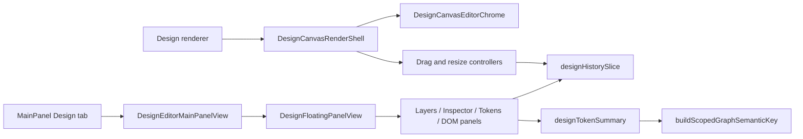

# Knowgrph Design Canvas Editor PRD/TAD

**Document Version**: 0.3.0  
**Date**: 2026-05-29  
**Status**: Accepted and implemented Design editor baseline

## Document Purpose

Design editor baseline is implemented natively in Knowgrph. This document records the product and technical contract for the in-repo Design editor surface that was originally scoped from a reference-editor mental model: a focused canvas, explicit tools, layers, inspector, tokens, DOM context, and reversible layout edits. The reference is directional only; the implementation owns its behavior in Knowgrph source files and does not import external editor code, fixtures, or assets.

The shipped baseline keeps renderer semantics neutral. Design editing operates on Design-owned view state, Design-only history, existing canvas pointer modes, and shared semantic-key helpers. It does not remap old aliases, layer local patches over downstream UI, or mutate graph topology to represent presentational frame edits.

## Implemented Product Contract

| Capability | Status | Source owner |
|------------|--------|--------------|
| MainPanel Design tab | Shipped | `canvas/src/features/panels/mainPanelTabs.ts`; `canvas/src/features/panels/MainPanel.tsx`; `canvas/src/features/panels/views/DesignEditorMainPanelView.tsx` |
| Design canvas render shell | Shipped | `canvas/src/components/DesignCanvas.tsx`; `canvas/src/components/DesignCanvas/DesignCanvasRenderShell.tsx` |
| Editor chrome | Shipped | `canvas/src/components/DesignCanvas/DesignCanvasEditorChrome.tsx` |
| Pointer modes, fit-to-view, undo, redo | Shipped | `canvas/src/components/DesignCanvas/DesignCanvasEditorChrome.tsx`; `canvas/src/features/design/DesignFloatingPanelView.tsx` |
| Move and resize operation commits | Shipped | `canvas/src/components/DesignCanvas/useFrameDragController.ts`; `canvas/src/components/DesignCanvas/useResizeMarqueeController.ts` |
| Layers, inspector, tokens, DOM tree, DOM inspect panels | Shipped | `canvas/src/features/design/DesignFloatingPanelView.tsx`; `canvas/src/features/design/DesignLayersPanel.tsx`; `canvas/src/features/design/DesignInspectorPanel.tsx`; `canvas/src/features/design/DesignTokensPanel.tsx`; `canvas/src/features/design/DesignDomTreePanel.tsx`; `canvas/src/features/design/DesignDomInspectPanel.tsx` |
| Design-only history | Shipped | `canvas/src/hooks/store/designHistorySlice.ts`; `canvas/src/hooks/store/store-types/graph-state-design-history.ts` |
| Design launch and Import URL activation | Shipped | `canvas/src/features/design/designEditorLaunchState.ts`; `canvas/src/__tests__/designEditorIntegrationRegression.test.ts` |
| Layer state and token summaries | Shipped | `canvas/src/features/design/designLayersState.ts`; `canvas/src/features/design/designTokenSummary.ts` |

## User Outcomes

| User | Need | Implemented behavior |
|------|------|----------------------|
| Knowledge curator | Arrange graph-derived frames into a readable canvas | Design mode supports frame selection, movement, resize, layers, and inspector controls without changing canonical graph topology. |
| Research analyst | Reopen and refine visual layouts | Design state is scoped by graph metadata and committed through Design-owned store actions. |
| Builder | Extend Design editor behavior without duplicate state paths | MainPanel, floating panel, render shell, controllers, and store history expose source-owned contracts covered by registry tests. |

## Functional Requirements

### FR-1: Dedicated Design Surface

The Design editor is reachable through the MainPanel Design tab and through Design renderer activation paths. `DesignEditorMainPanelView` reuses `DesignFloatingPanelView`, so the MainPanel and floating panel share the same overview, layers, inspector, token, DOM tree, and DOM inspect behavior.

Acceptance:

- `mainPanelTabs.ts` defines `key: 'design'`.
- `MainPanel.tsx` lazy-loads `DesignEditorMainPanelView`.
- `DesignEditorMainPanelView.tsx` delegates to `DesignFloatingPanelView`.

### FR-2: Editor Chrome and Tooling

The canvas render shell mounts `DesignCanvasEditorChrome` when Design is active. The chrome exposes select, pan, undo, redo, and fit-to-view affordances through existing store actions, preserving one owner for pointer mode and viewport behavior.

Acceptance:

- `DesignCanvasRenderShell.tsx` mounts `DesignCanvasEditorChrome`.
- `DesignCanvasEditorChrome.tsx` calls `setCanvasPointerMode2d`, `undoDesignHistory`, `redoDesignHistory`, and `dispatchRuntimeFitToViewSoon`.
- The floating panel exposes matching viewport and shortcut actions without creating an alternate command path.

### FR-3: Move and Resize Commit Boundaries

Frame movement and resizing preview during pointer gestures and commit once per completed operation. The drag controller commits position patches through `commitDesignFramePosHistory`; the resize controller commits rectangle patches through `commitDesignFrameRectHistory`.

Acceptance:

- `useFrameDragController.ts` commits move operations with `commitDesignFramePosHistory`.
- `useResizeMarqueeController.ts` commits resize operations with `commitDesignFrameRectHistory`.
- Store writes are operation-level commits, not pointer-move recomputation loops.

### FR-4: Design-Only History

Design frame position, frame size, and layer state edits are reversible through Design-owned history commands. Undo and redo operate on Design state and do not rewrite canonical graph data.

Acceptance:

- `designHistorySlice.ts` owns `undoDesignHistory`, `redoDesignHistory`, `commitDesignFrameRectHistory`, `commitDesignFramePosHistory`, and `commitDesignLayerStateHistory`.
- `DesignLayersPanel.tsx` records layer visibility and ordering changes through `commitDesignLayerStateHistory`.
- `DesignInspectorPanel.tsx` records numeric frame edits through `commitDesignFrameRectHistory`.

### FR-5: Semantic-Keyed Token Summaries

Design token summaries reuse the shared semantic-key helper. Token summary caching is scoped by graph metadata and token inputs, avoiding ad-hoc cache keys and redundant derivation.

Acceptance:

- `designTokenSummary.ts` calls `buildScopedGraphSemanticKey('design-token-summary'`.
- `designEditorSurfaceRegression.test.ts` verifies shared semantic-key helper usage.
- `designTokenSummary.test.ts` covers extraction and semantic cache behavior.

## Technical Architecture



### Source Ownership

| Layer | Owner | Contract |
|-------|-------|----------|
| MainPanel registration | `canvas/src/features/panels/mainPanelTabs.ts` | Defines the Design tab identity. |
| MainPanel mounting | `canvas/src/features/panels/MainPanel.tsx` | Lazy-loads the Design editor panel. |
| MainPanel view | `canvas/src/features/panels/views/DesignEditorMainPanelView.tsx` | Reuses the shared Design floating panel. |
| Canvas root | `canvas/src/components/DesignCanvas.tsx` | Wires frame edit operations into Design history actions. |
| Render shell | `canvas/src/components/DesignCanvas/DesignCanvasRenderShell.tsx` | Mounts editor chrome with selected and layer counts. |
| Editor chrome | `canvas/src/components/DesignCanvas/DesignCanvasEditorChrome.tsx` | Exposes existing pointer, undo, redo, and fit actions. |
| Move controller | `canvas/src/components/DesignCanvas/useFrameDragController.ts` | Commits move operations once per gesture. |
| Resize controller | `canvas/src/components/DesignCanvas/useResizeMarqueeController.ts` | Commits resize operations once per gesture. |
| Panel shell | `canvas/src/features/design/DesignFloatingPanelView.tsx` | Hosts overview, layers, inspector, tokens, DOM tree, and DOM inspect tabs. |
| Layers | `canvas/src/features/design/DesignLayersPanel.tsx`; `canvas/src/features/design/designLayersState.ts` | Owns layer visibility and ordering behavior. |
| Inspector | `canvas/src/features/design/DesignInspectorPanel.tsx` | Owns numeric frame edits. |
| Tokens | `canvas/src/features/design/DesignTokensPanel.tsx`; `canvas/src/features/design/designTokenSummary.ts` | Owns token extraction and semantic-keyed cache. |
| DOM context | `canvas/src/features/design/DesignDomTreePanel.tsx`; `canvas/src/features/design/DesignDomInspectPanel.tsx` | Owns DOM context display for Design workflows. |
| Design history | `canvas/src/hooks/store/designHistorySlice.ts`; `canvas/src/hooks/store/store-types/graph-state-design-history.ts` | Owns reversible Design-only commands. |

### State and Data Flow

1. The user opens the Design tab or activates the Design renderer.
2. `DesignEditorMainPanelView` and `DesignFloatingPanelView` render shared Design controls.
3. `DesignCanvasRenderShell` mounts `DesignCanvasEditorChrome` on the active canvas.
4. Drag, resize, inspector, and layer interactions preview through the UI and commit through Design history actions.
5. Token summaries use `buildScopedGraphSemanticKey('design-token-summary'` for stable cache identity.
6. Renderer output remains derived from graph data plus Design-scoped view state.

## Implementation Boundaries

Implemented:

- MainPanel Design tab.
- Shared Design floating panel and MainPanel view.
- Canvas editor chrome for select, pan, undo, redo, fit-to-view, selected count, and layer count.
- Design-only move, resize, layer, and inspector history commits.
- Token summary extraction using the shared semantic-key helper.
- DOM tree and DOM inspect panels for Design context.
- Import URL path that can activate the shared Design surface.

Out of scope for this baseline:

- Importing external OpenPencil code, assets, schemas, or runtime behavior.
- Full vector design-suite parity beyond Knowgrph frame, layer, token, and DOM workflows.
- External design-file import/export.
- Collaborative Design operation transport.
- Replacing the existing renderer backend.

Planned extension boundary:

- Any future collaborative Design operations must add source owners and tests before this document can mark them implemented.
- Any future external design-file import/export must keep conversion in a dedicated source owner and preserve graph semantics.
- Any future advanced vector tools must commit through Design history and reuse shared semantic keys for derived caches.

## Validation Contract

Run these focused checks after editing Design owners or this document:

```bash
npm --prefix canvas run test:ci:unit -- "design.editor.prdTad"
npm --prefix canvas run test:ci:unit -- "design.editor.surface"
npm --prefix canvas run test:ci:unit -- "design.layers"
npm run hygiene:check
npm --prefix canvas exec tsc -- -p canvas/tsconfig.json --noEmit --pretty false
```

The registry guard `design.editor.prdTad.implementedOwners` requires this PRD/TAD to stay aligned with implemented Design source owners and rejects proposed-only language for shipped behavior.
