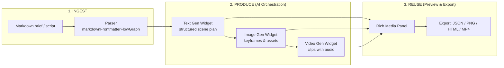
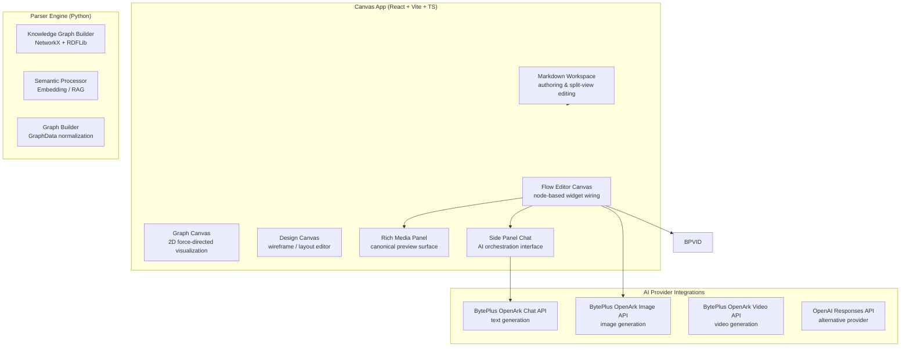

# Knowgrph

## AI-assisted programmatic video generation

**Widget-based canvas where AI (Markdown) orchestrated responses become images -- and images become video.**

<v-clicks>

> *"Write it. See it. Ship it."*
>
> The canvas is the product. The AI is the runtime.

</v-clicks>

---

---

layout: intro
class: text-left
---

# The problem

Video production is still **timeline-first**, which makes it:

<v-clicks>

- **Slow**: iteration cycles depend on manual editing and render queues
- **Hard to automate**: little reusable structure; creative logic lives in implicit UI state
- **Hard to audit**: prompts, assets, and decisions are scattered across three or more tools
- **Hard to scale**: content variants (localized, personalized, A/B) explode cost linearly

</v-clicks>

**Teams want video to behave like software:** versioned, testable, composable, diffable.

But today's toolchain gives you **three disconnected tabs** -- a chat window, an image generator, a timeline editor -- and every handoff loses context.

---

---

layout: default
class: text-left
---

# The insight

If you can represent a **scene plan as structured Markdown**, then:

<v-clicks>

- **AI becomes the orchestrator** -- not just a chat sidebar, but the runtime that drives each stage
- **Widgets become compiled stages** -- text node produces structured narrative; image node renders keyframes; video node composes clips
- **The canvas becomes a single source of truth** for prompts, intermediate artifacts, final outputs, and provenance

</v-clicks>

> Markdown is the **control plane**; media generation is the **data plane**.

Every connection on the canvas is an explicit data dependency. Change one prompt upstream, and all downstream nodes re-execute automatically.

---

---

layout: two-cols
class: text-left
---

# What we are building

Knowgrph is a **widget-based node canvas** for AI-assisted media pipelines -- where the entire Text-to-Image-to-Video workflow lives as an inspectable, executable graph.

::: right::

## Core widget primitives

<v-clicks>

| Widget | Role | Output |
|---|---|---|
| **Text Generation** | AI chat / LLM produces structured scene plans, shot lists, captions from Markdown brief | Structured text (tables, JSON sections) |
| **Image Generation** | Renders keyframes, storyboards, overlays from plan-derived prompts | Image URL (`imageUrl`) |
| **Video Generation** | Composes images + motion prompts into clips with resolution, duration, audio controls | Video URL (`videoUrl`) |
| **Rich Media Panel** | Canonical preview surface for all outputs -- image, video, HTML, iframe | Rendered preview |

</v-clicks>

All four widgets share typed envelope properties and canonical port handles per the `knowgrph-pitchdeck-frontmatter-template-contract`.

---

---

layout: default
class: text-left
---

# The workflow (end-to-end)



**Result:** fast iteration loops, reproducible generation, and full provenance from brief to final clip -- all in one canvas.

---

---

layout: default
class: text-left
---

# How it works -- architecture at a glance



**Key architectural principle: Client-First.** The browser does the heavy lifting -- parsing, rendering, orchestration -- with AI APIs called directly from the canvas via serverless endpoints. No heavy backend required.

---

---

layout: default
class: text-left
---

# Markdown orchestration -- concrete example

A creator writes this in the Markdown workspace:

~~~markdown
## Scene 03 -- Product reveal moment

Goal: Demonstrate the canvas turning Markdown into images,
then into video.
Style: Minimalist, high contrast, subtle kinetic typography.
Format: 16:9 landscape, ~5 seconds.

Shots:
1) Close-up: Markdown lines appear character-by-character (typing effect)
2) Cut: Storyboard grid fills with AI-generated keyframes (3 panels)
3) Cut: Rich Media Panel shows video preview auto-playing
~~~

From here the **Text Generation widget** derives per-shot image prompts, the **Image Generation widget** renders keyframes, and the **Video Generation widget** composes them into a final clip -- all visible on the same canvas.

---

---

layout: two-cols
class: text-left
---

# Why the canvas matters (not just another chat UI)

The canvas transforms a "creative" into an **explicit directed graph of stages**.

::: right::

## Software-like guarantees for media creation

<v-clicks>

- **Reproducibility**: Same Markdown + same parameters + same seed = identical artifacts, every time
- **Traceability**: Every image and video output carries upstream provenance -- which prompt produced it, which parameters were used
- **Composable reuse**: Save subgraphs as templates; wire them into new pipelines in one click
- **Safe iteration**: Diff a single prompt or parameter without breaking the entire project; downstream nodes re-execute automatically
- **Variant branching**: One brief branches into 4 style variants (cinematic, flat, neon, sketch) without duplicating work

</v-clicks>

---

---

layout: default
class: text-left
---

# Differentiation vs. alternatives

| Approach | Strength | Weakness |
|---|---|---|
| Timeline editors (Premiere, CapCut) | Fine-grained manual control | Not automatable; scaling variants = manual labor |
| Prompt-only image tools (Midjourney, etc.) | Fast single-output generation | Weak structure; no pipeline; poor reproducibility |
| Agent chains (LangGraph, n8n visual) | Flexible reasoning & branching | Hard to visually inspect; "where did THIS frame come from?" |
| **Knowgrph (canvas + widgets + Markdown SSOT)** | **Automatable + Inspectable + Reusable + Visual** | Requires template discipline; early-stage UX |

We treat a **"creative" as a compiled artifact from a declarative spec (Markdown)** -- not as a sequence of implicit UI actions in a timeline editor.

The **canvas IS the build log**.

---

---

layout: default
class: text-left
---

# Target users & use cases

<v-clicks>

### Growth & marketing teams
Campaign variants at scale: 10 languages x 3 CTAs x 2 styles = 60 videos from one Markdown brief.

### Product teams
Feature launch explainers, onboarding walkthroughs, changelog videos -- generated from existing docs / PRDs / release notes.

### Education creators
Course clips, lesson summaries, flash-card reels -- generated from structured lesson Markdown.

### Internal communications
Weekly update videos, all-hands recaps -- generated from status Markdown / Notion pages.

### Developers & DevRel
Programmatic media generation as part of CI/CD: docs -> diagrams -> explainer videos on every merge.

</v-clicks>

Common thread: teams that need **many videos with consistent structure** and want **zero-friction iteration**.

---

---

layout: default
class: text-left
---

# Tech stack -- what powers the canvas

| Layer | Technology | Scale notes |
|---|---|---|
| **Frontend framework** | React 18 + TypeScript + Vite 6 | Monorepo; ~500 TS/TSX source files |
| **State management** | Zustand (slice-based stores) | Graph data, UI, settings, history slices |
| **2D visualization** | D3.js force-directed + SVG + ELK/Dagre layouts | 10k+ node support |
| **3D visualization** | Three.js + @react-three/fiber (WebGL) | Voxel, sphere, globe modes |
| **Geospatial** | MapLibre GL JS + Turf.js | GeoJSON, administrative areas, POI search |
| **Code editing** | Monaco Editor (VS Code engine) | JSON, YAML, SQL, multi-language |
| **Markdown engine** | markdown-it + remark/rehype unified ecosystem | Frontmatter-aware, Mermaid, math (KaTeX) |
| **Local DB** | RxDB (reactive, queryable) | Offline-first persistence |
| **Backend parsers** | Python 3.10+ (NetworkX, RDFLib, DuckDB, NLTK) | AST indexing, GraphRAG, semantic processing |
| **AI providers** | BytePlus OpenArk (chat/image/video) + OpenAI Responses API | Multi-provider abstraction layer |
| **Payments** | Stripe (subscriptions, checkout, paywall) | Usage-based billing ready |
| **MCP protocol** | @modelcontextprotocol/sdk server | Claude Desktop / Cursor IDE integration |
| **Deployment** | Cloudflare Pages (PWA, Service Worker) | airvio.co/knowgrph |

**Shell size**: ~248 KB gzip (base); lazy-loaded features (Monaco 696KB, Mermaid 643KB, Three.js, MapLibre) load on demand via `React.lazy()`.

---

---

layout: default
class: text-left
---

# System design -- INGEST / PRODUCE / REUSE

```mermaid
flowchart LR
  subgraph INGEST ["INGEST (Parse & Extract)"]
    SRC[Sources:<br/>MD / JSON / CSV / PDF /<br/>HTML / YouTube / GeoJSON /<br/>Webpage URL / Codebase] --> LD[Loaders / Parsers]
    LD --> VAL[Validator]
    VAL --> GD[(GraphData SSOT)]
  end

  subgraph PRODUCE ["PRODUCE (Normalize & Derive)"]
    GD --> SCH[Schema Engine<br/>visual rules + behavior constraints]
    SCH --> DER[Deriver<br/>layout positions, groups, layers]
  end

  subgraph REUSE ["REUSE (Render & Interact)")]
    DER --> R2D[2D Renderer<br/>D3 SVG force-directed]
    DER --> R3D[3D Renderer<br/>Three.js WebGL voxel/globe]
    DER --> RFLOW[Flow Editor<br/>widget execution graph]
    DER --> RGEO[Geospatial<br/>MapLibre map overlay]
    R2D --> EXP[Exporters]
    R3D --> EXP
    RFLOW --> EXP
  end
```

**Six design principles**: Client-First, Performance, Neutrality, Modularity, Observability, Scalability (10k+ nodes, O(n log n) algorithms).

---

---

layout: default
class: text-left
---

# Business model

<v-clicks>

### Workspace subscription (per seat)
Authoring canvas access, collaboration, workspace storage, template library.

### Usage-based compute (per generation)
- Image generation: per-image pricing with budget caps & quota management
- Video generation: per-second-of-output pricing with resolution tiers
- Token budgets: configurable per-workspace, per-user spending limits

### Template marketplace (future)
Reusable branded decks, story-style packs, industry-specific pipelines sold as subgraph templates.

### Enterprise tier
SSO / SAML, audit logs, on-prem / VPC deployment, policy controls, dedicated support.

</v-clicks>

**Principle**: keep cost and quality **predictable** with fully explicit, user-visible parameters. No hidden token burns.

---

---

layout: default
class: text-left
---

# Roadmap

### Now (shipping)
- Stable Markdown-to-widget orchestration via frontmatter flow parser
- Rich Media Panel as canonical preview + export surface
- BytePlus OpenArk integration (chat, image, video) with full SSOT field coverage
- Flow Editor Canvas with widget registry, port handles, typed envelopes
- Stripe paywall and subscription gating

### Next (quarter ahead)
- Scene templates + subgraph library (storyboards, product demo flows, education packs)
- Batch variant generation (language swaps, CTA variants, audience segments)
- Evaluation harness (quality checks, brand compliance, regression detection)
- MCP server enhancement for AI-IDE-driven canvas control

### Later (vision)
- Multi-track composition (audio stem, captions, overlay layers)
- Deterministic "render recipes" and cross-variant caching
- Real-time collaboration (WebSocket + CRDT)
- Plugin system (sandboxed custom widget extensions)

---

---

layout: default
class: text-left
---

# The ask

<v-clicks>

- **Design partners**: Teams generating video content variants weekly who are frustrated by timeline-tool friction
- **Domain feedback**: Which constraints matter most -- brand guidelines? Compliance review? Localization workflows?
- **Real-world data**: Access to actual briefs, creative specs, and existing output templates we can encode as Markdown pipelines
- **Distribution intros**: Paths to growth teams, product marketing leads, education creators, and developer-relations communities

</v-clicks>

If you believe **video creation should feel like writing software** -- declarative, versionable, composable, inspectable -- let us build it together.

---

---

layout: center
class: text-center
---

# Thank you

## Knowgrph -- AI-assisted programmatic video generation

**Widget-based canvas. Markdown orchestration. Images become video.**

<div style="margin-top: 2em;">

**Live demo**: [airvio.co/knowgrph](https://airvio.co/knowgrph)

**Repo**: github.com/joohwee/knowgrph

**Contact**: (add)

</div>

> *"The canvas is the product. The AI is the runtime."*
