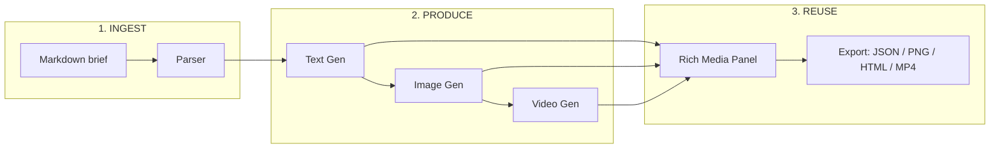
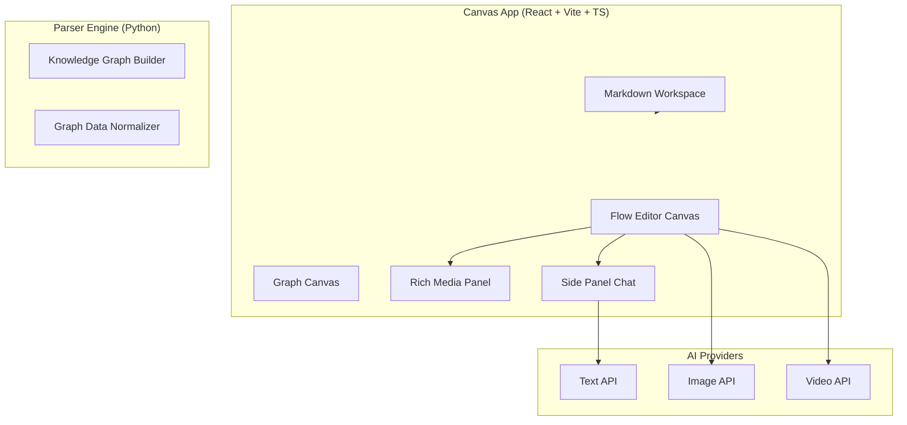
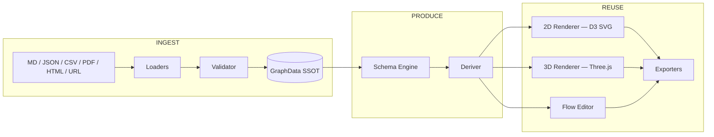

# Knowgrph

**AI-assisted programmatic video generation.** A widget-based canvas where AI-orchestrated Markdown responses become images — and images become video.

> The canvas is the product. The AI is the runtime.

---

## The problem

Video production is still timeline-first, which makes it slow, hard to automate, hard to audit, and hard to scale. Teams want video to behave like software: versioned, testable, composable, diffable.

Today's toolchain gives you three disconnected tabs — a chat window, an image generator, a timeline editor — and every handoff loses context.

---

## The insight

If you can represent a scene plan as structured Markdown, then:

- **AI becomes the orchestrator** — not just a chat sidebar, but the runtime that drives each stage
- **Widgets become compiled stages** — text node produces structured narrative; image node renders keyframes; video node composes clips
- **The canvas becomes a single source of truth** for prompts, intermediate artifacts, final outputs, and provenance

Markdown is the control plane. Media generation is the data plane.

Every connection on the canvas is an explicit data dependency. Change one prompt upstream, and all downstream nodes re-execute automatically.

---

## What we are building

Knowgrph is a widget-based node canvas for AI-assisted media pipelines — where the entire text → image → video workflow lives as an inspectable, executable graph.

| Widget | Role | Output |
|---|---|---|
| Text Generation | AI produces structured scene plans, shot lists, captions from Markdown brief | Structured text |
| Image Generation | Renders keyframes, storyboards, overlays from plan-derived prompts | Image URL |
| Video Generation | Composes images + motion prompts into clips with resolution, duration, audio | Video URL |
| Rich Media Panel | Canonical preview surface for all outputs | Rendered preview |

---

## The workflow (end-to-end)

---

## Architecture

Key principle: **Client-First.** The browser handles parsing, rendering, and orchestration — AI APIs called directly from the canvas via serverless endpoints.

---

## System design — INGEST / PRODUCE / REUSE

Six design principles: Client-First, Performance, Neutrality, Modularity, Observability, Scalability (10k+ nodes).

---

## Why the canvas matters

The canvas transforms a "creative" into an explicit directed graph of stages — giving media creation software-like guarantees:

- **Reproducibility** — same Markdown + same parameters + same seed = identical artifacts
- **Traceability** — every output carries upstream provenance
- **Composable reuse** — save subgraphs as templates; wire into new pipelines in one click
- **Safe iteration** — diff a single prompt without breaking the project; downstream nodes re-execute
- **Variant branching** — one brief branches into style variants without duplicating work

---

## Differentiation

| Approach | Strength | Weakness |
|---|---|---|
| Timeline editors (Premiere, CapCut) | Fine-grained control | Not automatable; variants = manual labor |
| Prompt-only image tools | Fast single output | No pipeline; poor reproducibility |
| Agent chains (LangGraph, n8n) | Flexible reasoning | Hard to visually inspect |
| **Knowgrph** | **Automatable + Inspectable + Reusable + Visual** | Requires template discipline; early-stage UX |

The canvas is the build log.

---

## Target users

- **Growth & marketing teams** — campaign variants at scale: 10 languages × 3 CTAs × 2 styles = 60 videos from one Markdown brief
- **Product teams** — feature launch explainers, onboarding walkthroughs from PRDs
- **Education creators** — course clips, lesson summaries from structured lesson Markdown
- **Internal comms** — weekly update videos generated from status Markdown
- **Developers & DevRel** — programmatic media as part of CI/CD: docs → diagrams → explainer videos on every merge

Common thread: teams needing many videos with consistent structure and zero-friction iteration.

---

## Tech stack

| Layer | Technology |
|---|---|
| Frontend | React 18 + TypeScript + Vite 6 |
| State | Zustand (slice-based stores) |
| 2D visualization | D3.js force-directed + ELK/Dagre layouts |
| 3D visualization | Three.js + @react-three/fiber (WebGL) |
| Geospatial | MapLibre GL JS + Turf.js |
| Code editing | Monaco Editor |
| Markdown engine | markdown-it + remark/rehype + Mermaid + KaTeX |
| Local DB | RxDB (offline-first) |
| Backend parsers | Python 3.10+ (NetworkX, RDFLib, DuckDB, NLTK) |
| AI providers | BytePlus OpenArk + OpenAI Responses API |
| Payments | Stripe (subscriptions, usage-based billing) |
| MCP protocol | @modelcontextprotocol/sdk |
| Deployment | Cloudflare Pages (PWA) — airvio.co/knowgrph |

Shell size: ~248 KB gzip; Monaco, Mermaid, Three.js lazy-loaded on demand.

---

## Business model

- **Workspace subscription** — authoring canvas, collaboration, storage, template library
- **Usage-based compute** — per-image and per-second-of-output pricing with budget caps
- **Template marketplace** (future) — branded subgraph templates sold per pipeline
- **Enterprise tier** — SSO/SAML, audit logs, on-prem/VPC, policy controls

Principle: cost and quality fully predictable with explicit, user-visible parameters.

---

## Roadmap

**Now (shipping)**
- Markdown-to-widget orchestration via frontmatter flow parser
- BytePlus OpenArk integration (chat, image, video)
- Flow Editor Canvas with widget registry, port handles, typed envelopes
- Stripe paywall and subscription gating

**Next**
- Scene templates + subgraph library
- Batch variant generation
- Evaluation harness (quality, brand compliance, regression)
- MCP server enhancement for AI-IDE canvas control

**Later**
- Multi-track composition (audio stem, captions, overlays)
- Real-time collaboration (WebSocket + CRDT)
- Plugin system (sandboxed custom widget extensions)

---

## The ask

- **Design partners** — teams generating video content variants weekly frustrated by timeline-tool friction
- **Domain feedback** — brand guidelines, compliance review, localization workflow constraints
- **Real-world data** — briefs, creative specs, existing output templates to encode as Markdown pipelines
- **Distribution intros** — growth teams, product marketing leads, education creators, DevRel communities

If you believe video creation should feel like writing software — declarative, versionable, composable, inspectable — let us build it together.

---

**Live demo**: airvio.co/knowgrph
**Contact**: joohwee @ airvio.co

> *"Write it. See it. Ship it."*