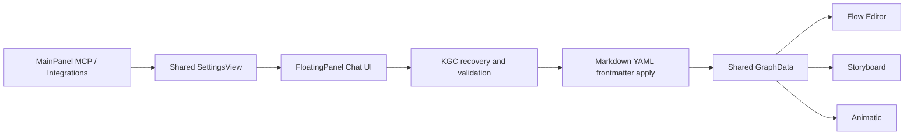
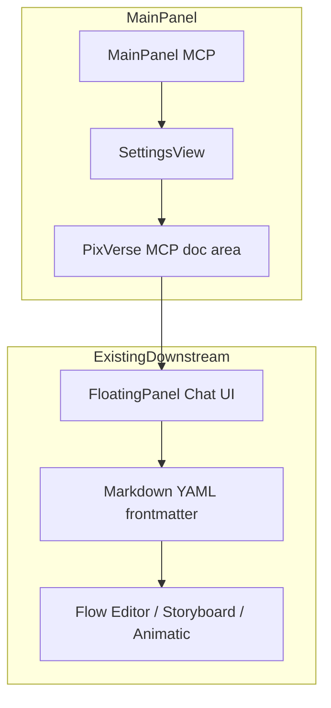
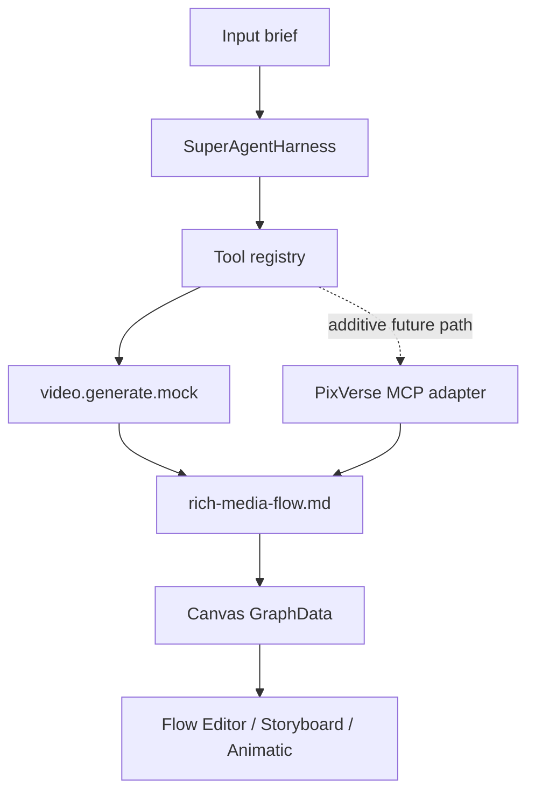

# Knowgrph x PixVerse MCP - MainPanel Readiness + Harness Provider PRD/TAD

**PRD + TAD | v0.12.1 | 2026-05-29**

---

## Document Map

Sec 1-7 define the PRD, Sec 8-15 define the TAD, Sec 16 maps traceability, and Sec 17 captures validation guardrails.

---

## Implementation Status

- Phase A shipped: MainPanel MCP includes PixVerse MCP readiness through the shared `SettingsView` owner.
- Phase B baseline shipped: `knowgrph_parser` now supports `provider_mode="pixverse"` using local PixVerse MCP stdio with `text_to_video`, `image_to_video`, `transition_video`, `fusion_video`, `extend_video`, `lip_sync_video` for generated clips and uploaded `video_media_id` with TTS plus custom-audio on generated clips and uploaded videos, `sound_effect_video` for generated clips and uploaded `video_media_id`, `upload_image`, automated local uploaded-video handoff, adaptive automated local audio upload when the PixVerse MCP build exposes an audio upload tool, and `get_video_status`, plus local preview/manifest artifacts and mock fallback when local config or live generation is unavailable.
- MainPanel Integrations and chat-readiness UX now include PixVerse-aware provider affordances through existing settings owners.
- The local SuperAgent harness boundary follows `docs/documents/knowgrph-superagent-harness.md`: PixVerse extends native `knowgrph_parser` tool/provider owners, and DeerFlow remains conceptual inspiration or an optional gateway, not copied architecture.
- Focused browser-side readiness coverage now exists for the real Settings -> Integrations flow, validating PixVerse strategy toggles and live browser state.
- Advanced PixVerse feature coverage such as guaranteed upstream-standard local audio upload exposure across all PixVerse MCP builds remains future additive work.

---

# PART A - PRODUCT REQUIREMENTS DOCUMENT

---

## Sec 1 - Problem Statement

### Current Repo Truth

Knowgrph already ships the shared browser-local E2E path for AI-assisted workspace generation:

- MainPanel `integrations` and MainPanel `mcp` both route through the shared `SettingsView` owner.
- MainPanel readiness can already open the FloatingPanel Chat UI and provider/widget surfaces.
- FloatingPanel Chat already owns the current chat submit workflow.
- Markdown YAML frontmatter remains the single source of truth for downstream canvas apply.
- Flow Editor, Storyboard, and Animatic already reuse the shared frontmatter/graph pipeline.
- The local super-agent harness now supports both `provider_mode="mock"` and `provider_mode="pixverse"`.
- The PixVerse path is implemented additively at the harness/tool boundary: it launches local PixVerse MCP stdio, uploads reference images when needed, selects `text_to_video`, `image_to_video`, `transition_video`, or constrained `fusion_video`, optionally chains bounded `extend_video`, can apply `lip_sync_video` in TTS mode or custom-audio mode to a generated clip and an uploaded `video_media_id`, can apply `sound_effect_video` to a final generated clip or an uploaded `video_media_id`, can automate local uploaded-video handoff through `upload_video`, can automate local custom-audio handoff when the connected PixVerse MCP exposes `upload_audio` or `upload_media`, polls `get_video_status`, writes local preview/manifest artifacts, and falls back to deterministic mock video when local config or live generation is unavailable.

### Pain Point

Knowgrph has two remaining PixVerse follow-on gaps today:

1. The shipped Integrations UX is now PixVerse-aware, but richer chat/runtime affordances can still be layered on top of the same settings and chat owners.
2. The shipped harness PixVerse path now covers text-to-video, image-to-video, transition-video, constrained fusion-video generation, bounded extend-video chaining, optional generated-video TTS lip-sync post-processing, optional generated-video plus custom-audio lip-sync post-processing, optional uploaded-video TTS lip-sync post-processing, optional uploaded-video plus custom-audio lip-sync post-processing, optional generated-video sound-effect post-processing, optional uploaded-video sound-effect post-processing, and automated local uploaded-media handoff at the same harness boundary, but richer PixVerse MCP capabilities remain future additive work.

### User Impact

- MainPanel MCP now expresses PixVerse as a first-class readiness option through shared settings-doc entries.
- MainPanel Integrations documents PixVerse beside BytePlus and Gemini video providers through shared integration SSOT rows.
- FloatingPanel Chat can generate markdown/frontmatter and drive canvas apply with PixVerse-aware readiness hints while staying on the shared route.
- Canonical demo markdown in `huijoohwee/docs/` must stay provider-neutral; hardcoding PixVerse-only fixture URLs into storyboard/video/animatic demos would corrupt the shared renderer contract.

### Opportunity

The repo already has the right seams to add PixVerse without creating a duplicate pipeline:

- MainPanel MCP can add a PixVerse MCP readiness section through the same settings-doc machinery already used for Stripe, API-native browser, and GrabMaps MCP.
- Live PixVerse execution now lives at the harness tool-registry boundary, not in renderer code and not as a second MCP-only markdown-to-canvas path.
- The existing chat -> YAML frontmatter -> canvas apply pipeline can remain the sole browser-local E2E route.
- Long-horizon research/code/create harness metadata can wrap the run, but it does not create a PixVerse-only renderer, parser, memory layer, or graph apply path.

### Falsifiable Hypothesis

If Knowgrph adds:

- a PixVerse MCP readiness section in MainPanel MCP, and
- a harness-side PixVerse provider behind the existing super-agent tool boundary,

then users will be able to move from MainPanel discovery through chat/frontmatter generation into Flow Editor, Storyboard, and Animatic without introducing stale local schemas, duplicate pipelines, or PixVerse-specific hardcoded demo fixtures.

### Phase 0 Gate

Problem, owners, and seams are verified in the repo: MainPanel MCP readiness and the local `provider_mode="pixverse"` harness baseline are shipped, while advanced PixVerse work remains planned and additive.

---

## Sec 2 - Personas and Jobs-to-Be-Done

### Persona A - Solo Founder / Workspace Operator

**Profile**: Uses MainPanel MCP, MainPanel Integrations, FloatingPanel Chat, and the canvas renderers to author and validate rich-media workspaces.

**Jobs-to-be-done**:
- Discover how PixVerse MCP should be configured from inside Knowgrph.
- Keep chat-driven markdown/frontmatter generation on the existing shared path.
- Validate that Flow Editor, Storyboard, and Animatic continue to consume provider-neutral graph/media fields.
- Extend the shipped baseline PixVerse harness path without rewriting the renderer stack.

### Persona B - MCP Client / Agent Builder

**Profile**: Connects external agents or MCP-capable tools to Knowgrph and related local MCP servers.

**Jobs-to-be-done**:
- Copy an agent-ready PixVerse MCP config snippet from MainPanel MCP.
- Understand that PixVerse MCP readiness is distinct from Knowgrph's local stdio MCP server.
- Understand that the readiness card points to the shipped local harness baseline, not a Cloudflare-deployed mutating PixVerse service.

### Persona C - Renderer / Pipeline Maintainer

**Profile**: Owns markdown/frontmatter contracts, shared semantic keys, and renderer projection rules.

**Jobs-to-be-done**:
- Keep PixVerse integration out of renderer-specific code paths.
- Preserve frontmatter as SSOT across Flow Editor, Storyboard, and Animatic.
- Prevent hardcoded PixVerse URLs or provider-specific demo schema drift in canonical docs.

---

## Sec 3 - User Journey

### Journey: Discover PixVerse, Then Stay on the Existing E2E Path

| Stage | Action | Touchpoint | Pain Point | Opportunity |
|---|---|---|---|---|
| Trigger | User wants real video generation beyond mock output | MainPanel `mcp` / `integrations` | Readiness and harness boundaries need one truthful surface | Use the shipped PixVerse MCP readiness section in MainPanel MCP |
| Discover | User reads config snippets and opens the next surface | Shared `SettingsView` | MCP setup is disconnected from chat/canvas workflow | Keep panel CTA routed into FloatingPanel Chat UI |
| Engage | User works through chat-driven document generation | FloatingPanel Chat UI | Risk of duplicate pipeline design | Reuse existing chat -> KGC -> canvas apply path only |
| Complete | Markdown YAML frontmatter lands in canvas | Flow Editor / Storyboard / Animatic | Risk of provider-specific renderer forks | Keep provider concerns upstream; renderers stay field-driven |
| Return | User runs local super-agent harness | `knowgrph_parser` harness | Live local provider still needs fallback-safe operation | Use the shipped PixVerse provider path behind the current tool registry |

---

## Sec 4 - User Stories and Acceptance Criteria

### Epic KPV-E1 - MainPanel PixVerse MCP Readiness

**Traceability root**: `PRD-KPV-E1`

**Story KPV-E1-S1 - MainPanel MCP shows PixVerse MCP readiness**

> As a workspace operator, I want MainPanel MCP to include a PixVerse MCP section, so that I can discover local stdio setup and the intended downstream chat/canvas path without leaving the repo-owned settings surface.

**Acceptance Criteria**:

*AC-1*: Given MainPanel is opened on the `mcp` tab, when settings sections are grouped by MCP area, then a `PixVerse MCP` area appears through the shared `SettingsView` pipeline and does not require a new panel shell.

`/goal MainPanel MCP readiness code contains a PixVerse MCP settings-doc area wired through existing shared settings owners, and no new panel view is added outside the current MainPanel/SettingsView path`

*AC-2*: Given the PixVerse MCP area is rendered, when the user inspects its rows, then it provides an agent-ready local stdio config snippet and states that the local harness supports `provider_mode="pixverse"` with bounded polling and mock fallback.

`/goal PixVerse MCP settings-doc entries include a local_config JSON snippet and a readiness/status note that documents the shipped `provider_mode="pixverse"` contract plus mock fallback`

*AC-3*: Given the PixVerse MCP area is rendered, when the user uses the section CTA, then the action routes into the existing FloatingPanel Chat UI rather than a new PixVerse-specific panel.

`/goal PixVerse MCP section metadata opens the existing FloatingPanel Chat UI and introduces no duplicate PixVerse-only chat launcher`

### Epic KPV-E2 - Preserve the Existing Browser-Local E2E Path

**Traceability root**: `PRD-KPV-E2`

**Story KPV-E2-S1 - PixVerse readiness must not create a second markdown-to-canvas pipeline**

> As a pipeline maintainer, I want PixVerse readiness to reuse the existing MainPanel -> Chat -> frontmatter -> Canvas path, so that MCP documentation does not fork runtime ownership.

**Acceptance Criteria**:

*AC-4*: Given the PixVerse MCP readiness feature exists, when architecture is documented, then it names the current browser-local path as MainPanel MCP / Integrations -> FloatingPanel Chat -> markdown YAML frontmatter -> shared canvas apply -> Flow Editor / Storyboard / Animatic.

`/goal the PixVerse PRD/TAD names the existing browser-local E2E path and does not describe a second MCP-only graph materialization path`

*AC-5*: Given the PixVerse PRD/TAD is updated, when scope boundaries are reviewed, then renderer-specific code ownership remains unchanged and provider logic stays upstream of renderer projection.

`/goal the PixVerse PRD/TAD explicitly keeps Flow Editor, Storyboard, and Animatic on shared frontmatter/graph projection rather than provider-specific renderer logic`

### Epic KPV-E3 - Local Harness Provider Integration

**Traceability root**: `PRD-KPV-E3`

**Story KPV-E3-S1 - Baseline live provider work is shipped additively and advanced PixVerse work remains additive**

> As a harness maintainer, I want the PixVerse live-provider path to stay at the super-agent tool boundary, so that the shipped baseline can evolve without rewriting the canvas or MainPanel systems.

**Acceptance Criteria**:

*AC-6*: Given the revised TAD, when PixVerse execution work is described, then it names the shipped baseline `provider_mode="pixverse"` path and keeps future PixVerse capabilities additive in `superagent_harness.py`, `superagent_tools.py`, and related adapter modules.

`/goal the PixVerse PRD/TAD marks the shipped baseline `provider_mode="pixverse"` path as additive harness work and keeps future PixVerse capabilities on the same tool-registry boundary`

*AC-7*: Given future provider work is implemented, when demo markdown is reviewed, then canonical docs in `huijoohwee/docs/knowgrph-storyboard-demo.md`, `huijoohwee/docs/knowgrph-video-demo.md`, and `huijoohwee/docs/knowgrph-animatic-demo.md` remain provider-neutral and do not hardcode PixVerse-specific fixture URLs as contract requirements.

`/goal the PixVerse PRD/TAD forbids hardcoded PixVerse-specific URLs or provider-only schema drift in canonical demo markdown and keeps shared media keys as the renderer contract`

---

## Sec 5 - MoSCoW Prioritization

| Priority | Feature | ROI | Rationale |
|---|---|---|---|
| **Must** | KPV-E1-S1 MainPanel PixVerse MCP readiness area | 11.1 | Small code slice, immediate discoverability, no renderer churn |
| **Must** | KPV-E2-S1 Existing E2E path preserved in docs | 10.4 | Prevents architectural drift and duplicate pipelines |
| **Must** | KPV-E3-S1 Future harness provider work documented as additive | 8.7 | Keeps implementation truth intact and avoids false shipped claims |
| **Should** | Local stdio config JSON snippet for PixVerse MCP | 7.2 | Improves copy-paste readiness for agent users |
| **Should** | Explicit provider-neutral demo-doc guardrails | 6.9 | Prevents hardcoded fixture creep across docs/renderers |
| **Should** | Shipped `provider_mode="pixverse"` path with auto/image-to-video/transition-video strategies plus bounded extend-video | 8.8 | Already implemented with bounded polling, stdio MCP, upload-safe image handling, continuation support, local artifacts, and mock fallback |
| **Won't (this slice)** | Cloudflare-deployed mutating PixVerse video generation service | 1.0 | Out of scope; current MCP surfaces remain local or read-only |

**Min-viable scope**:
- Update this PRD/TAD to match repo truth.
- Add a PixVerse MCP readiness section to MainPanel MCP.
- Preserve the existing browser-local E2E path as the only markdown-to-canvas route.

---

## Sec 6 - Success Metrics

| Metric | Baseline | Target | Timeline | Check |
|---|---|---|---|---|
| PixVerse MCP discoverability in MainPanel MCP | 0 sections | 1 PixVerse MCP area | This slice | Shared settings render includes PixVerse area |
| Duplicate pipeline count | 0 allowed | 0 | This slice | Docs claim only one browser-local E2E route |
| False shipped claims in PixVerse doc | Present in v0.1.0 draft | 0 | This slice | Revised doc reflects shipped readiness and shipped baseline harness support accurately |
| Provider-neutral demo contract drift | At risk | 0 hardcoded PixVerse fixtures required by demo contract | This slice | Revised scope/validation sections forbid provider-specific demo hardcodes |
| Future harness integration churn | Unknown | Additive only | Future slice | Future implementation touches harness/tool boundary, not renderer ownership |

---

## Sec 7 - Scope Boundaries and Explicit Exclusions

**In scope now**:
- Repo-accurate revision of `docs/documents/knowgrph-pixverse-mcp-prd-tad.md`
- MainPanel MCP PixVerse readiness documentation and config snippet
- Explicit preservation of the shared MainPanel / Chat / frontmatter / renderer pipeline
- Provider-neutral demo-doc guardrails for storyboard/video/animatic demo markdown

**Explicitly excluded now**:
- Claiming PixVerse is already a Cloudflare-deployed mutating video generation service
- Adding a second MCP-only markdown-to-canvas runtime path
- Provider-specific renderer behavior in Flow Editor, Storyboard, or Animatic
- Cloudflare deployment changes for PixVerse video generation
- Browser-stored PixVerse secret management

---

# PART B - TECHNICAL ARCHITECTURE DOCUMENT

---

## Sec 8 - Current Owner Map

| Concern | Current owner | Status |
|---|---|---|
| MainPanel `mcp` / `integrations` shells | `canvas/src/features/panels/MainPanel.tsx` | Shipped |
| Shared settings owner | `canvas/src/features/panels/views/SettingsView.tsx` + `useSettingsView.ts` | Shipped |
| MCP documentation entry registry | `canvas/src/features/panels/views/settingsMcpDocEntries.ts` | Shipped |
| MCP section CTA metadata | `canvas/src/features/panels/views/settingsView.constants.ts` | Shipped |
| Floating chat owner | `canvas/src/features/chat/FloatingPanelChat.tsx` | Shipped |
| Browser-local apply path | chat submit helpers -> KGC -> markdown/frontmatter apply | Shipped |
| Frontmatter parsing | `canvas/src/lib/markdown/frontmatter.ts` | Shipped |
| Storyboard projection | `canvas/src/components/StoryboardCanvas/storyboardModel.ts` | Shipped |
| Animatic projection | `canvas/src/components/AnimaticCanvas/animaticTimeline.ts` | Shipped |
| Super-agent harness | `knowgrph_parser/superagent_harness.py` | Shipped |
| Super-agent tool registry | `knowgrph_parser/superagent_tools.py` | Shipped |
| Live PixVerse harness provider | `provider_mode="pixverse"` baseline | Shipped |

---

## Sec 9 - Target Phases

### Phase A - MainPanel MCP Readiness

Add a PixVerse MCP area to the existing MainPanel MCP docs surface.

**Files**:
- `canvas/src/features/panels/views/pixverseMcpApiDocs.ts` (new)
- `canvas/src/features/panels/views/settingsMcpDocEntries.ts` (modify)
- `canvas/src/features/panels/views/settingsView.constants.ts` (modify)

**Intent**:
- Surface local stdio config guidance.
- Reuse the shared settings/doc-entry rendering path.
- Route CTA to FloatingPanel Chat.
- Document the shipped baseline harness provider contract and keep advanced PixVerse capabilities additive.

### Phase B - Shipped Local Harness Provider

Extend the existing harness/tool-registry boundary without changing renderer ownership.

**Files**:
- `knowgrph_parser/superagent_harness.py`
- `knowgrph_parser/superagent_tools.py`
- `knowgrph_parser/superagent_pixverse.py`
- `knowgrph_parser/superagent_harness_test.py`

**Intent**:
- Keep `provider_mode="mock"` behavior intact.
- Keep the PixVerse execution path additive.
- Preserve existing artifact shapes and workspace markdown semantics.

---

## Sec 10 - Architecture Diagrams

### Current Browser-Local E2E Path



### Phase A - PixVerse Readiness in MainPanel MCP



### Phase B - Local Harness Provider Placement



**Key invariant**: PixVerse belongs upstream of the renderer projection layer. The renderer contract remains field-driven (`videoUrl`, `imageUrl`, `url`, `href`, `references`, etc.), not provider-driven.

---

## Sec 11 - Component Inventory

| Layer | Component | File / Module | Status | Responsibility |
|---|---|---|---|---|
| MainPanel | `McpHubView` / `SettingsView` | `canvas/src/features/panels/views/` | Shipped | Shared MCP documentation shell |
| MainPanel | `PixVerse MCP doc entries` | `canvas/src/features/panels/views/pixverseMcpApiDocs.ts` | Shipped | PixVerse MCP readiness rows and config snippet |
| MainPanel | `PixVerse Video Generation docs` | `canvas/src/features/panels/views/pixverseVideoGenerationApiDocs.ts` | Shipped | PixVerse-aware Integrations documentation rows |
| MainPanel | `buildMcpDocEntries()` | `settingsMcpDocEntries.ts` | Shipped | Register PixVerse MCP entries in shared MCP list |
| MainPanel | `MCP_SECTION_META` | `settingsView.constants.ts` | Shipped | Define PixVerse MCP docs CTA and explanatory note |
| Chat | `FloatingPanelChat` | `canvas/src/features/chat/FloatingPanelChat.tsx` | Shipped | Existing downstream chat workflow |
| Parser | Frontmatter parser | `canvas/src/lib/markdown/frontmatter.ts` | Shipped | Canvas-view and frontmatter preset parsing |
| Parser | Frontmatter flow graph parser | `canvas/src/features/parsers/markdownFrontmatterFlowGraph.flowBlock.ts` | Shipped | Canonical graph derivation from markdown |
| Renderer | Storyboard projection | `storyboardModel.ts` | Shipped | Lane/card projection from GraphData |
| Renderer | Animatic projection | `animaticTimeline.ts` | Shipped | Timeline projection from GraphData + `timeline.*` |
| Harness | `SuperAgentHarness` | `knowgrph_parser/superagent_harness.py` | Shipped | Mock and PixVerse provider-mode orchestration owner |
| Harness | `build_default_tool_registry()` | `knowgrph_parser/superagent_tools.py` | Shipped | Registers mock text/image tools plus mock and PixVerse video tools |
| Harness | PixVerse MCP adapter | `knowgrph_parser/superagent_pixverse.py` | Shipped | Additive stdio MCP bridge with text/image/transition generation, bounded extend-video chaining, upload-safe image handling, and fallback |

---

## Sec 12 - Integration Contracts

### IC-01: MainPanel MCP PixVerse Readiness Contract

**Interface**: PixVerse MCP doc rows inside shared settings-doc rendering

**Contract**:
- Must reuse `VirtualSettingsEntry`-style rows.
- Must register through `buildMcpDocEntries()`.
- Must provide at least one agent-ready local stdio config snippet.
- Must route section CTA to the existing FloatingPanel Chat UI.
- Must document the shipped baseline harness contract truthfully and keep advanced PixVerse capability coverage additive.

**Minimal config snippet shape**:

```json
{
  "mcpServers": {
    "pixverse": {
      "command": "uvx",
      "args": ["pixverse-mcp"],
      "env": {
        "PIXVERSE_API_KEY": "<set-in-local-shell-or-secret-store>"
      }
    }
  }
}
```

**Security note**:
- Keep `PIXVERSE_API_KEY` server-side or shell-local.
- Do not treat browser local storage as the secret authority.

### IC-02: Browser-Local E2E Ownership Contract

**Interface**: MainPanel / Chat / frontmatter / canvas

**Contract**:
- MainPanel readiness may document or launch downstream surfaces.
- FloatingPanel Chat remains the active browser-local authoring assistant.
- Markdown YAML frontmatter remains the SSOT for canvas application.
- Flow Editor, Storyboard, and Animatic consume shared graph/media fields only.
- No PixVerse-specific renderer branch or second apply path is introduced.

### IC-03: Harness Provider Contract

**Interface**: `SuperAgentHarness` -> tool registry -> provider adapter

**Contract**:
- Extend the current registry additively while preserving the shipped mock path and shipped baseline PixVerse path.
- Preserve mock fallback for zero-key, offline, and CI runs.
- Keep exact PixVerse MCP tool names rooted in `pixverseVideoGenerationSsot.ts` and `superagent_pixverse.py`; future tools must be validated before documentation.
- Emit provider provenance in artifacts/proof only from the harness provider boundary.

---

## Sec 13 - Data Flow Rules

### DF-01: Readiness Discovery Flow

| Stage | Component | Input | Output | Persistence | Error Handling |
|---|---|---|---|---|---|
| Ingest | MainPanel MCP | User opens `mcp` tab | Shared settings mode = `mcp` | UI state | Existing panel fallback |
| Transform | `buildMcpDocEntries()` | Virtual doc rows | PixVerse area rows | In-memory | Missing row shows no area |
| Serve | `SettingsView` | Mapped settings entries | Rendered doc/config rows | UI state | Shared search/filter behavior |
| Handoff | `MCP_SECTION_META.openPanel` | CTA click | FloatingPanel Chat UI open | Existing panel bridge | Existing chat launcher fallback |

### DF-02: Browser-Local Authoring Flow

| Stage | Component | Input | Output | Persistence | Error Handling |
|---|---|---|---|---|---|
| Ingest | FloatingPanel Chat | Prompt/user intent | Chat request | Existing chat state | Existing chat error handling |
| Transform | KGC + markdown apply | LLM output | Markdown YAML frontmatter doc | Active markdown document | Existing KGC validation/recovery |
| Transform | Frontmatter/flow parser | Markdown + `flow:` | GraphData | Store state | Existing parser warnings |
| Serve | Flow Editor / Storyboard / Animatic | Shared GraphData | Rendered canvas surface | Runtime state | Surface-specific display fallback only |

### DF-03: Harness Provider Flow

| Stage | Component | Input | Output | Persistence | Error Handling |
|---|---|---|---|---|---|
| Ingest | `superagent_harness.py` | TaskSpec + provider mode | Tool payload | `state.json` | Existing harness budget/error rules |
| Transform | PixVerse MCP adapter | Prompt/media params | Live provider result | `trace.jsonl` + artifacts | Bounded retry/fallback required |
| Store | Existing canvas/workspace writer | Provider result | `rich-media-flow.md` + canvas graph | Output dir | Preserve mock fallback |
| Serve | Canvas renderers | Shared media fields | Video/image/text widgets | Runtime state | Renderer stays provider-neutral |

---

## Sec 14 - Architectural Decision Records

### ADR-01: PixVerse readiness and local provider work reuse existing owners

**Status**: Accepted
**Date**: 2026-05-29

#### Context

The repo ships shared settings-doc infrastructure for external MCP surfaces and a local harness provider baseline for PixVerse. Both must stay rooted in existing owners so PixVerse does not create a second MainPanel, chat, renderer, or harness stack.

#### Decision

Keep Phase A and Phase B in their existing owners:
- PixVerse MCP readiness in MainPanel MCP,
- PixVerse-aware Integrations rows in the shared integrations SSOT,
- `provider_mode="pixverse"` in the local super-agent harness with mock fallback,
- future advanced PixVerse work as additive changes to the same harness/provider boundary.

#### Alternatives Considered

1. **Readiness plus local harness baseline** (chosen): implementation-accurate, uses existing owners, keeps fallback-safe execution.
2. **Separate PixVerse service**: higher surface area, but would duplicate the current local/read-only MCP boundaries.
3. **Add PixVerse-specific renderer logic**: rejected; conflicts with the shared frontmatter/graph architecture.

#### Rationale

This sequence preserves SSOT and avoids false shipped claims. It delivered the MainPanel MCP readiness slice first, then added a baseline harness PixVerse path without creating a second runtime path.

#### Consequences

- **Positive**: Immediate discoverability, minimal code surface, architecture stays truthful.
- **Negative**: The shipped baseline remains local-first and depends on the connected PixVerse MCP build exposing upload tools for automated local media handoff.
- **Neutral**: Existing chat/frontmatter/renderer path remains unchanged.

---

### ADR-02: PixVerse provider concerns stay upstream of renderer projection

**Status**: Accepted
**Date**: 2026-05-29

#### Context

Flow Editor, Storyboard, and Animatic already derive from shared GraphData and canonical media/text fields. Provider-specific branches in renderer code would create schema drift and duplicate ownership.

#### Decision

Keep all PixVerse-specific behavior upstream:
- MainPanel MCP may document setup.
- Future harness/provider code may resolve media URLs.
- Renderer layers continue to consume shared graph/media fields only.

#### Consequences

- **Positive**: No duplicated parsing or renderer-local provider logic.
- **Negative**: Provider-specific UX must be expressed via upstream metadata, not renderer forks.
- **Neutral**: Canonical demo docs remain provider-neutral and reusable.

---

## Sec 15 - Quality Attributes

| Attribute | Scenario | Pattern | Validation |
|---|---|---|---|
| Implementation truth | PixVerse doc must describe the shipped baseline accurately without overstating unsupported capabilities | Separate shipped baseline vs future advanced capabilities | Review current harness/tool code against doc text |
| Reuse | PixVerse readiness must reuse existing MainPanel settings owners | Shared doc-entry + section-meta path | No new panel shell or duplicate launcher added |
| Pipeline integrity | MainPanel readiness must not fork the browser-local E2E path | Reuse Chat -> frontmatter -> canvas apply | Doc and code show one downstream route only |
| Renderer neutrality | Demo docs and renderers must remain provider-neutral | Shared media keys and semantic-key helpers only | No required hardcoded PixVerse URLs in canonical demo docs |
| Security | PixVerse secrets must not move into browser storage | Shell/server-side env placeholders only | Config snippets use placeholder env values only |
| Future extensibility | Advanced PixVerse work must remain additive | Extend tool registry, preserve mock fallback | Future implementation touches harness/tool boundary only |

---

# Sec 16 - Traceability Matrix

| PRD Epic | Story | AC | TAD Component | Interface | `/goal` Condition |
|---|---|---|---|---|---|
| E1 | S1 | AC-1 | PixVerse MCP doc entries | IC-01 | `PixVerse MCP settings-doc area is wired through shared MainPanel MCP settings owners` |
| E1 | S1 | AC-2 | PixVerse local config snippet | IC-01 | `PixVerse MCP entries include local_config JSON and document the shipped `provider_mode="pixverse"` contract plus mock fallback` |
| E1 | S1 | AC-3 | `MCP_SECTION_META` | IC-01 | `PixVerse MCP section opens existing FloatingPanel Chat UI only` |
| E2 | S1 | AC-4 | Current owner map + data flows | IC-02 | `PRD/TAD documents the existing browser-local E2E path with no second MCP-only apply path` |
| E2 | S1 | AC-5 | Renderer/provider boundary | IC-02 | `PRD/TAD keeps renderer ownership provider-neutral and upstreams PixVerse concerns` |
| E3 | S1 | AC-6 | Harness baseline + future phase | IC-03 | `PRD/TAD states the shipped baseline `provider_mode="pixverse"` path and keeps future PixVerse work additive` |
| E3 | S1 | AC-7 | Demo-doc guardrails | IC-02 | `PRD/TAD forbids canonical demo docs from depending on hardcoded PixVerse-only URLs or schema drift` |

---

# Sec 17 - Validation Checklist

**Pre-Implementation**:
- [x] Current repo owners audited before updating requirements
- [x] Shipped vs planned states explicitly separated
- [x] User journey anchored to MainPanel -> Chat -> frontmatter -> Canvas flow
- [x] Acceptance criteria are observable and expressible as `/goal`
- [x] Renderer neutrality and demo-doc hardcode guardrails are explicit
- [x] MainPanel MCP reuse is specified through existing settings-doc owners
- [x] Future harness work is additive and mock fallback is preserved

**Post-Documentation Review**:
- [x] Confirm PixVerse MCP local stdio launch shape in shipped MainPanel MCP docs and harness defaults
- [ ] Confirm any future PixVerse tool names from provider schema during implementation rather than hardcoding assumptions in docs
- [x] Add focused harness tests for mock fallback and fake stdio MCP live-path coverage
- [ ] Re-run this PRD/TAD version and traceability review when Phase B starts

---

## Anti-Pattern Guard Check

| Anti-Pattern | Status | Mitigation |
|---|---|---|
| Solution-first PixVerse rollout | Yes | Current repo truth and pain points documented first |
| False shipped claims | Yes | Shipped local readiness/provider baseline and planned advanced work are separated |
| Duplicate markdown-to-canvas path | Yes | Existing browser-local E2E route remains canonical |
| Renderer-specific provider logic | Yes | Provider concerns stay upstream of GraphData projection |
| Hardcoded PixVerse demo fixtures as contract | Yes | Demo docs remain provider-neutral; shared media keys stay canonical |
| Secret leakage into browser storage | Yes | Config snippets use env placeholders only |

---

*Document version 0.12.1 - implementation-accurate baseline for shipped PixVerse MCP readiness, shipped PixVerse-aware Integrations UX, shipped browser-side readiness validation, and shipped harness support for `text_to_video`, `image_to_video`, `transition_video`, `fusion_video`, `extend_video`, `lip_sync_video` on generated clips and uploaded `video_media_id` in TTS mode plus custom-audio on generated clips and uploaded videos, `sound_effect_video` for generated clips and uploaded `video_media_id`, automated local uploaded-media handoff, and `get_video_status`. Apply semantic versioning on every change. Update `/goal` conditions in Sec 16 whenever acceptance criteria in Sec 4 change. Re-verify upstream PixVerse MCP tool schema before expanding into fully standardized audio-upload exposure across all PixVerse MCP builds.*
