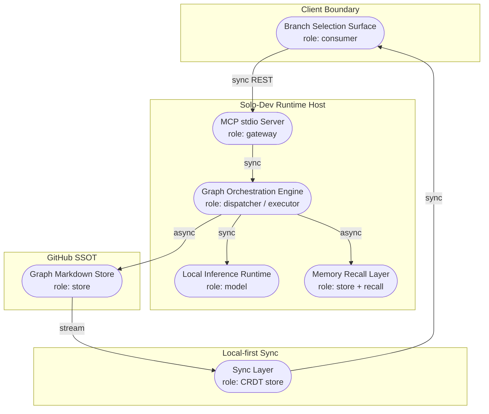
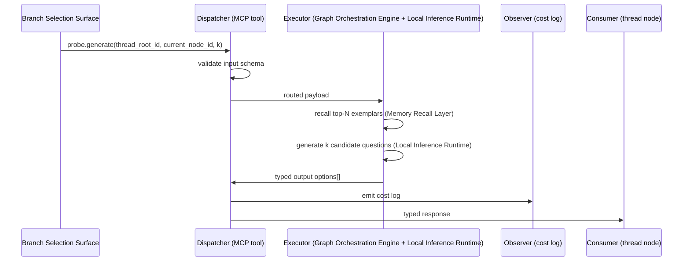
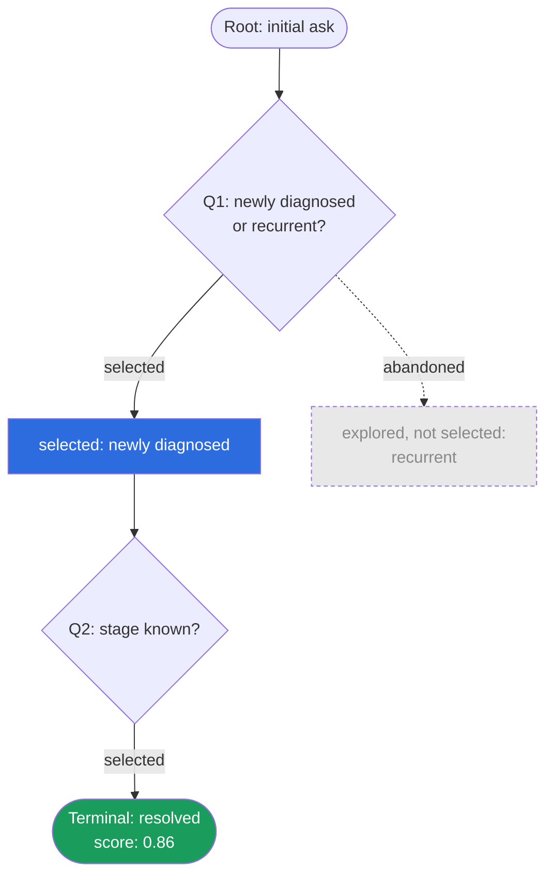

# Knowgrph Probe-Tree — Combined PRD/TAD

## Scope & Neutrality Note

This document is written per the Scope & Neutrality Contract in `prd-tad-guidelines.md`: capabilities and roles are named by function, not brand. Where a concrete tool appears (in parentheses, marked "reference implementation"), it is a non-binding example and may be swapped for any functionally equivalent component without changing this specification.

---

## Overview

**From** a single unstructured help-seeking turn **to** a branching, self-improving question tree: the system generates candidate probing questions, lets the user select a path, persists the selection as a graph edge, publishes one separate Rich Media branch ledger, and — once a thread resolves — writes a score back so future generations on similar topics are informed by what previously worked. No new persistent datastore, orchestration engine, sync layer, or provider-only Canvas path is introduced.

---

## Journey: Help-Seeker — Reach a Resolved Outcome Through Guided Branching

| Stage | Action | Touchpoint | Pain Point | Opportunity |
|---|---|---|---|---|
| Trigger | User states an underspecified need | Chat surface | Vague asks produce vague answers | Structured disambiguation without a rigid scripted form |
| Discover | System proposes 2–4 candidate next questions with bounded answer choices | Branch Selection Surface (card list) | Free-text follow-ups are slow on mobile | Numbered multi-select plus Other narrows scope in one action |
| Engage | User selects a branch; a new question set generates from the narrowed context | Branch Selection Surface | Static dialogue trees don't adapt to what actually works | Generation is informed by previously successful paths |
| Complete | Thread reaches a terminal node with enough structured context to hand off to a downstream capability | Thread resolution event | No feedback loop — good and bad threads are indistinguishable | Resolved threads write a score back, improving future generation |
| Return | User starts a new thread on a similar topic | Chat surface | System repeats the same generic first questions every time | Prior high-scoring exemplars bias new generation toward better first questions |

---

## Feature: Probe-Tree

### Problem Statement

Free-text, single-shot prompting under-elicits the structured context a downstream capability needs (for example, a matching or retrieval pipeline). Fully scripted decision trees solve this but don't adapt and are expensive to author by hand. The opportunity is a **generated, branching, user-steered question sequence that gets better at asking the right next question over time**, without introducing a bespoke dialogue-authoring system or a reward-model training loop.

### Personas

- **Solo builder** (jobs-to-be-done: ship a disambiguation layer in front of an existing capability without authoring static dialogue trees or standing up new infrastructure)
- **End user / help-seeker** (jobs-to-be-done: get to a useful outcome in as few taps as possible, ideally on a phone)

### User Journey Stage

Discover → Engage stages of the Journey above: this feature *is* the branching mechanism between an initial ask and a resolved, structured outcome.

### User Stories

**As a** help-seeker, **I want** the system to propose a short list of next-questions instead of an open text box, **so that** I can steer the conversation with a tap, especially on mobile.

**As a** help-seeker, **I want** the questions I'm asked to improve over repeated use, **so that** the system stops asking things that didn't help last time.

**As a** solo builder, **I want** the branching tree, the generation calls, and the scoring loop to run on infrastructure already deployed, **so that** this feature adds no new monthly cost or new component to operate.

#### Widget Card entrypoint coexistence

- Every generated multi-selection option is accepted or rejected independently at the shared semantic validator. A single bare range, unit, named entity, thin phrase, or recycled selected-child answer invalidates its complete card even if the other options are valid. Every surviving option must express a context-relevant preference, tradeoff, or consequence; number-bearing options must also explain what that quantity means for the active decision.
- The Widget Card bubble-toolbar **Probe-Tree** action reveals already accepted model-backed branches. If none exist, it stops with an actionable Run instruction; it never creates heuristic preview cards, rewrites authored text, or calls MCP/provider by itself.
- `/knowgrph.probe-tree` remains editable, non-navigating invocation metadata inside the Widget Card. Selecting its chip never opens or leaves the active Canvas; branch materialization begins only when the Widget Card **Run** action executes.
- Widget Card Run resolves the card's `/`, `@`, and `#` metadata and authored context, invokes local stdio `knowgrph.probe.generate` through one shared 20-second Dev-bridge deadline, and always asks the active Chat LLM to author the 2–4 typed clarification cards from that context and the literal MCP result. The active Chat provider, endpoint, and selected model own the Probe-Tree transport rather than stale card-local routing fields. The selected model is also the final provider-family signal when generic TextGeneration metadata disagrees, preventing a GPT model and OpenAI credential from being sent to a stale BytePlus endpoint; transport failures remain distinct from semantic card rejection. Representative invocation evidence resolves in parallel under a shorter sub-budget so it cannot serialize three full timeouts ahead of generation. The zero-model MCP path emits no cards; source-query restatements, extracted named-entity lists presented as choices, generic wrappers, and context-mismatched provider output are rejected.
- A Probe-Tree Card answer follows one canonical continuation path: **Add output** opens the shared Viewer editor, the Run toolbar commits that Output before dispatch, and the next 2–4 cards attach to the answered card. Every turn preserves the original thread root, increments `probeTreeDepth` exactly once, and stops visibly at depth 8 before MCP or provider spend.
- Widget Run owns generation, depth enforcement, and active-graph publication. It binds terminal persistence to the Markdown source that originated the run, so a generated artifact or another Source File becoming active cannot receive or reject that graph; an inactive owner is updated without changing the user's editor selection. A multi-source composed Canvas is projected back to the originating source layer before serialization, retaining newly authored unscoped branch/output entities while excluding other sources; a blank Markdown owner materializes canonical `flow:` frontmatter on its first publication. An accepted Run result replaces the stale direct candidates and their full descendant closure for that source, infers exactly one canonical `candidateOption` edge from each accepted card's declared parent, and atomically publishes the accepted cards into one thread-scoped Rich Media ledger. Continuations reuse that ledger through `workflowOutputGroupId`, remove legacy duplicate ledgers and their output edges, and normalize the entire thread through the runtime-owned balanced, grid-snapped left-to-right/top-down waterfall. The bounded two-dimensional placement scorer spreads siblings and independently expanded subtrees across additional rows and columns before a depth becomes one long horizontal or vertical block, keeps card rectangles disjoint, and repairs duplicate, mismatched, or backward candidate routes from node ancestry.

### Acceptance Criteria

**Given** an active thread with a current node, **When** `probe.generate` is called, **Then** it returns 2–4 typed candidate next-questions, generated with the top-N recalled prior successful branches on a similar topic included as context, within the stated token budget, plus a Canvas-ready `response.structuredContent` containing the source Widget, cards, Rich Media branch ledger, and non-candidate summary edge.

> **VCC translation**: `Verify probe.generate response contains ≤ k typed option objects each with {id, text, rationale}, request completes within token budget, and no existing thread node is modified`

**Given** an LLM or connected `knowgrph` MCP host handles a Probe-Tree invocation, **When** it returns `probe-tree-llm-response/v5`, **Then** the configured provider emits only 2–4 semantic card records under `response.structuredContent.cards`: `question`, 2–4 suggested clarification answers, `rationale`, and `evidenceNeeded`. The runtime derives source-verbatim `contextAnchors` from semantic question/request overlap and owns the selected-child parent, candidate ids and edges, bounded depth, multi-selection plus Other, empty user Output, source Widget, and Rich Media ledger. Literal MCP results retain the complete Widget/Card/Panel envelope. The shared gate retains the largest mutually distinct provider subset only when at least two cards survive, so one malformed sibling cannot discard two valid query-grounded cards; bare focus splits, generic wrappers, restated queries, and entity-list echoes remain invalid.

> **VCC translation**: `Verify generic process cards never appear, every Type 2 Summary shows 2-4 numbered choices plus Other, multi-selection commits one canonical numbered Output, and no duplicate explicit edge list is required`

**Given** a projected Storyboard card, **When** it is a regular Widget Card (Type 0), **Then** its right pane remains the shared media drop slot; **When** it is a Probe-Tree Type 1 card, **Then** Summary plus free-form **Add output** remain visible; **When** it is Type 2, **Then** Summary owns 2–4 numbered checkboxes plus Other while the same Output pane shows and edits their canonical numbered continuation answer.

> **VCC translation**: `Verify Type 0 keeps media drop, Type 1 keeps free-form Summary plus Output, Type 2 supports multiple numbered choices plus Other, and Run context contains the committed canonical Output`

**Given** an answered Probe-Tree Card below depth 8, **When** the user presses **Run**, **Then** the committed Output leads the continuation context, the current card id, original `probeTreeThreadRootId`, bounded ancestor questions/answers as lineage-only context, and incremented `probeTreeDepth` are sent through the same bounded Dev bridge with `recall_top_k: 0`; accepted descendants use the answered card as `parentNodeId`. A same-ID stale writeback/root alias is replaced by the selected child before materialization, so it cannot own or overwrite the continuation. Existing cards without root/depth metadata recover the root from their parent chain and advance from depth 0. At depth 8, Run returns a visible warning and makes zero MCP/provider calls.

> **VCC translation**: `Verify Output -> Run leads with canonical Output, disables sibling recall, preserves or recovers the root, increments depth N to N+1, infers 2-4 child edges from the answered card, and depth 8 records zero downstream calls`

Provider generation is fail-closed and owned by the explicit Widget Run gesture. Run invokes the bounded local MCP first, then sends the selected context and literal MCP result to the configured chat LLM; no hidden per-card approval property suppresses that handoff. For a continuation, canonical Output leads the next context and concrete Output entities/topics outrank request verbs, workflow roles, root aliases, and evidence mechanics; bounded ancestor text may shape suggestions only as lineage. Every accepted model response must introduce a missing request-specific decision variable, derive each question and numbered suggestion from that selected-child context, and prove the relationship with 2–6 verbatim anchors. Copying or paraphrasing the source query, treating its named entities as a ready-made answer list, scope/priority/constraint wrappers, pairwise relationship questions, evidence/decision-basis/deliverable templates, dependency/decision-order choices, bare phrase fragments, answer sets made only of numeric/range/unit buckets, and use-case-specific fixtures are invalid. Number-bearing answers remain valid when each choice expresses a semantic preference, tradeoff, or consequence. The no-model MCP path never synthesizes clarification cards: it returns `insufficient_user_input_context`, and the Canvas fails closed instead of filling the quota, restating the query, or converting named entities into templates. Recalled exemplars may guide structure but never supply response content.

**Given** a Probe-Tree thread has multiple answered branches or a long branch ledger, **When** another Run publishes its result, **Then** the Canvas retains exactly one `Probe-Tree Branches` Rich Media Panel for the thread, replaces its current workflow-output edge, keeps the panel strictly after the rightmost branch column, and renders Markdown in the canonical panel viewport with media-owned internal scrolling. The runtime-owned layout snaps authored branch positions to the configured Canvas grid, places each bounded sibling batch around its actual parent, cascades left-to-right and top-down, and uses a footprint-aware collision search with tightly bounded vertical displacement before adding another waterfall column. Its vertical collision envelope uses the tallest supported 9:16 card footprint, which also keeps the shorter 16:9 cards disjoint and avoids nearby fixed cards outside the active Probe thread. Every retained `candidateOption` target has one declared parent rooted in the thread and sits to the right of that source; parentless, cyclic, duplicate, mismatched, and backtracking routes fail closed.

> **VCC translation**: `Verify one thread ledger, one current output edge, ledger x > rightmost branch x, every card position is grid-aligned, bounded rows and columns avoid one long horizontal or vertical block, zero card-rectangle overlaps, and every candidate edge target.x > source.x`

**Given** a Probe-Tree thread is first materialized or reopened without an explicit pin value, **When** Storyboard projection resolves its cards and owned Rich Media ledger, **Then** the runtime seeds them pinned to the Canvas grid by default. An explicit user unpin remains authoritative across later generations and source reparses; generation must not force that node back to pinned.

> **VCC translation**: `Verify missing pin state resolves pinned, explicit false remains false after Run and reopen, and generated grid positions remain the authored placement authority`

**Given** the user runs a Probe-Tree card from a settled Canvas viewport, **When** accepted descendants and the thread ledger publish, **Then** the active document and viewport update in place. The Run path performs no browser-page refresh, document navigation, or whole-canvas Fit-to-View request, so zoom and pan remain unchanged while the balanced layout is committed.

**Given** one or more Probe-Tree threads have stale outputs or scattered legacy coordinates, **When** the user presses toolbar **Reset all**, **Then** one canonical graph transaction clears generated output fields, force-reapplies the current balanced grid-snapped heuristic to every discovered thread (including a ledger-less thread), persists the normalized graph source, and refreshes only overlay edges. Layout-only repair remains valid when outputs are already empty; the command does not navigate, reload the page, or change zoom/pan.

**Given** a runnable Storyboard node and an active card or Widget surface, **When** the user presses card **Run** or toolbar **Run all**, **Then** both controls retain one stable shared runner across the toolbar pointer-down layout lock and dispatch the same current provider route. Registered agent slash invocations request minimal provider reasoning for their bounded final-output stage so the visible deliverable is not starved by hidden reasoning, while ordinary non-agent text and video workflows preserve their configured reasoning policy. No query-specific response, prompt echo, or synthetic fallback content is allowed.

> **VCC translation**: `Verify the page lifecycle and URL remain unchanged, the pre-Run viewport transform equals the post-Run transform, and the accepted cards plus ledger appear without a global fit request`

**Given** a selected Card, Widget, or Rich Media Panel while Editor Workspace is open, source indexing is active, or a graph mutation guard is held, **When** the user toggles its pin control, **Then** graph-scoped pin state changes immediately and the control label/pressed state follows. Pin state is view-local and is not blocked by graph-content mutation guards.

> **VCC translation**: `Verify Unpin from canvas becomes Pin to canvas and back during Editor/Indexing and graph-mutation guard states`

**Given** the FloatingPanel Widgets palette, **When** it renders the available choices, **Then** it shows one canonical **Widget Card Type 0**, one open-answer **Probe-Tree Type 1**, one bounded multi-select **Probe-Tree Type 2**, one consolidated **Rich Media Panel**, and genuinely distinct enabled custom flow editors. Type 2 seeds 2–4 answer choices, multi-selection, Other, the Probe-Tree invocation, and the canonical Output owner when dropped.

> **VCC translation**: `Verify Type 0, Type 1, and Type 2 visual layouts exist; Type 2 previews and seeds numbered multi-select plus Other without duplicating the registry entry`

**Given** a user selects one candidate option, **When** `probe.select` is called, **Then** a new `type: probe` node and a `branches-to` edge are persisted to the graph store and become visible through the existing sync layer without a separate save step.

> **VCC translation**: `Verify a new node file and edge reference exist in the graph store after the call, the parent node is unchanged, and the sync layer reflects the new node without manual refresh`

**Given** a thread reaches a terminal/resolved node, **When** `probe.evolve` is invoked, **Then** every traversed node's frontmatter score is updated and the full path is written to the recall layer as a reusable exemplar for future `probe.generate` calls on similar root topics.

> **VCC translation**: `Verify score field is present and updated on every node along the resolved path, and a new exemplar record is retrievable from the recall layer keyed to the thread's topic`

**Given** a Storyboard Widget Card containing `/knowgrph.probe-tree`, `@knowgrph.probe-tree`, or `#knowgrph.probe-tree` in an authored Prompt, Summary, or Action field, including typed frontmatter cells, **When** the user runs the card, **Then** the native Canvas handler invokes bounded local `knowgrph.probe.generate`, accepts only relevant `probe-tree-llm-response/v5`, derives source-verbatim anchors and all graph-owned fields in the runtime, replaces the stale descendant closure, materializes 2–4 Type 2 cards with canonical inferred `candidateOption` edges, preserves the viewport, and atomically publishes their evidence ledger.

**Given** a Widget Card backed by the internal `TextGeneration` runtime type or persisted legacy `Text Generation` lane/type metadata, **When** Storyboard projection renders the card, **Then** its public lane and type identity is `Widget Card`; the runtime type remains internal and duplicate `Widget Card` metadata chrome is omitted.

**Given** the invocation trio rendered in a Storyboard card's metadata rail, **When** the user clicks a token chip, **Then** the canvas remains active and no browser navigation occurs; the card toolbar **Run** action is the sole execution boundary, while each chip retains source provenance in its hover title.

**Given** a selected Probe-Tree child has produced its terminal workspace output artifact, **When** publication completes or the Canvas reopens a stale partial stream, **Then** the selected child, owned `Generated Result` Rich Media Panel, and typed connecting edge are committed as one published graph revision; a stale local artifact may complete or repair that revision without another provider call.

> **VCC translation**: `Verify the source Widget Card remains unchanged, an accepted configured-model response produces 2-4 child cards and one connected Rich Media branch ledger, every child can continue the tree, a zero-model run produces no fallback cards, and depth 8 stops visibly`

### Success Metrics

| Metric | Baseline | Target | Timeline |
|---|---|---|---|
| Median taps to resolved thread | N/A (no branching today) | ≤ 4 taps | first live sprint |
| Time-to-value (TTV steps) | — | ≤ 3 steps (paste initial ask → tap first option → reach terminal) | Phase 0 estimate |
| Time-to-value (TTV elapsed) | — | ≤ 90 seconds first-run | Phase 0 estimate |
| Token cost / month | — | ≤ target load × avg cost/call (see Orchestration/Harness Flow below) | ongoing |
| Monthly TCO | — | $0 (existing Local Inference Runtime + existing stores) | ongoing |
| ROI Score | — | Impact 4 × Reach [solo-dev scale] ÷ (Build Hours + $0 TCO + Token Cost/Month) — favorable given $0 infra denominator | first sprint review |

### MoSCoW Priority

- **Must** — `probe.generate`, `probe.select`, `type: probe` KGC schema, MCP tool registration, rendering new nodes on canvas via existing sync layer. ROI: high (zero new infra, directly shortens time-to-value on every existing conversational entry point).
- **Should** — `probe.evolve` scoring + recall-layer exemplar write-back. ROI: high but slightly deferred — the tree is usable and demoable without self-improvement; self-improvement compounds value over multiple sessions rather than in a single demo.
- **Could** — polished mobile card UI for branch selection beyond a plain option list; per-thread max-depth configuration exposed to the user.
- **Won't (this increment)** — a trained reward/bandit model in place of heuristic scoring; multi-session resume via the Graph Orchestration Engine's native checkpoint/replay mechanism (see ADR-2 for why this is deferred, not rejected).

### Min-Viable Scope

`probe.generate` + `probe.select`, backed by the existing graph store and sync layer, rendered on the existing canvas. `probe.evolve` and its recall write-back are the smallest Should-tier addition and can ship in the same sprint if time allows, but the Must-tier slice is independently demoable and valuable without it.

### Out of Scope

- A dedicated dialogue-authoring UI for hand-scripting question trees (defeats the purpose — this feature exists to avoid hand-authoring).
- A trained reward model or gradient-based policy update over branch selections.
- Cross-session checkpoint replay/time-travel (deferred — see ADR-2).

### Dependencies

- An existing graph/node-edge store with markdown + YAML frontmatter as source of truth.
- An existing local model-serving runtime capable of prompted generation.
- An existing recall/retrieval layer for prior exemplars.
- An existing local-first sync layer for the store.
- An existing MCP tool-serving process to expose the three verbs below.

### Open Questions

- What heuristic best approximates "this thread resolved well" when no explicit user rating is given — thread termination at a designated node type, or an explicit thumbs-up affordance?
- Should max-depth be a fixed default or configurable per thread topic?

---

## Architecture: Probe-Tree

### Overview

**From** a thread-root node and a current position in that thread **to** a persisted, growing subgraph of question/selection nodes, plus a scoring write-back on resolution: a Dispatcher validates each MCP call, an Executor pairs the existing local model runtime with recalled prior exemplars to generate or route, and every node/edge write lands directly in the existing graph store — no parallel state store is introduced.

### Journey → System Mapping

| Journey Stage | Workflow | Data Flow | Orchestration/Harness Flow | Topology Node(s) | Component |
|---|---|---|---|---|---|
| Discover | Generate candidates | Thread context → Executor → typed options | `probe.generate` | Graph Orchestration Engine, Local Inference Runtime | Generation Harness |
| Engage | Select and persist | Selected option → new node/edge → store | `probe.select` | Graph Markdown Store, Sync Layer | Selection Handler |
| Complete → Return | Score and recall | Resolved path → score write-back → exemplar store | `probe.evolve` | Memory Recall Layer | Evolution Harness |

### Topology

**Version**: 1 — 2026-07-07
**Boundaries**: solo-dev runtime (existing always-free ARM host), GitHub SSOT (remote), client (chat/canvas surface)

| Node | Role | Type | Connects to | Connection type | Data residency |
|---|---|---|---|---|---|
| Branch Selection Surface | Consumer | Chat/canvas UI | MCP stdio Server | Sync REST | Client |
| MCP stdio Server | Gateway | Tool-serving process | Graph Orchestration Engine | Sync (in-process) | Runtime host |
| Graph Orchestration Engine | Dispatcher/Executor | In-process graph library | Local Inference Runtime, Memory Recall Layer, Graph Markdown Store | Sync (model call), Async (store write) | Runtime host |
| Local Inference Runtime | Executor (model) | Local model server | Graph Orchestration Engine | Sync | Runtime host |
| Memory Recall Layer | Store + recall | Embedded recall index | Graph Orchestration Engine | Async | Runtime host |
| Graph Markdown Store | Store (SSOT) | Versioned markdown files | Sync Layer | Async (git write) | Remote (GitHub) |
| Sync Layer | CRDT sync | Local-first sync + local persistence | Branch Selection Surface | Stream | Client + runtime host |

**Version notes**: initial topology; no prior version to diff against.

### Orchestration/Harness Flows

#### Pipeline: `probe.generate`

**Topology pattern**: Sequential | **Max iterations**: N/A (single call; the outer conversation loop is bounded separately below) | **Circuit-breaker**: N/A
**Token budget**: [avg prompt tokens incl. recalled exemplars] + [avg completion tokens for k options] @ [cache hit rate] = [est. cost/call — to be measured against target load in Phase 1 review]

| Role | Component | Input schema | Output schema | Cost log | Fallback |
|---|---|---|---|---|---|
| Dispatcher | MCP tool entry | `{thread_root_id, current_node_id, k}` | Routed payload | — | Typed error on malformed input; reject before token spend |
| Executor | Generation Harness (Graph Orchestration Engine + Local Inference Runtime) | `{context_text, recalled_exemplars[]}` | `{options: [{id, text, rationale}]}` | ✓ required | Degraded mode: return fewer than `k` options with a flag, rather than fail closed |
| Observer | Cost logger | Cost log stream | Metric/alert | — | Silent fail; log gap |
| Consumer | Branch Selection Surface | `{options[]}` | Rendered card list | — | Upstream error propagation |

**Postconditions**: cost log persisted; typed options delivered or typed error returned; no thread node mutated by this call (generate is read-plus-propose, not a write).

#### Pipeline: `probe.select`

**Topology pattern**: Sequential | **Max iterations**: N/A | **Circuit-breaker**: N/A
**Token budget**: 0 prompt + 0 completion = $0.00/call — this is a pure write, no model call

| Role | Component | Input schema | Output schema | Cost log | Fallback |
|---|---|---|---|---|---|
| Dispatcher | MCP tool entry | `{parent_node_id, chosen_option}` | Routed payload | — | Typed error on malformed input |
| Executor | Selection Handler | `{parent_node_id, chosen_option}` | `{new_node_id, edge_id, cost_log}` | `{model:"probe-tree-select", prompt_tokens:0, completion_tokens:0, cache_hits:0, estimated_cost_usd:0}` | Write failure returns typed error; no partial node/edge pair persisted |
| Consumer | Sync Layer → Branch Selection Surface | `{new_node_id}` | Rendered new branch | — | Retry sync on next tick |

**Postconditions**: new `type: probe` node and `branches-to` edge exist in the Graph Markdown Store; parent node unchanged; new node visible via Sync Layer without manual refresh; local-zero token economics are returned in the tool response.

#### Pipeline: `probe.evolve`

**Topology pattern**: Sequential (triggered once per thread, on resolution) | **Max iterations**: 1 pass over the resolved path per invocation | **Circuit-breaker**: exits after scoring the traversed path once; re-invocation on the same resolved thread is non-idempotent because scoring timestamps and memory-store metadata can be rewritten
**Token budget**: 0 prompt + 0 completion = $0.00/call — scoring is a deterministic heuristic (path length, terminal-node type reached), not a model call; recall-layer write is an embedding/index operation, not a generation call

| Role | Component | Input schema | Output schema | Cost log | Fallback |
|---|---|---|---|---|---|
| Dispatcher | MCP tool entry / resolution-event listener | `{thread_root_id}` | Routed payload | — | Typed error if thread not in resolved state |
| Executor | Evolution Harness | `{path_nodes[]}` | `{updated_scores[], exemplar_id}` | — (zero-token; log write-count instead of cost) | If recall-layer write fails, score update still commits; exemplar write retried async |
| Observer | Logger | Write-count stream | Metric/alert | — | Silent fail; log gap |
| Consumer | Memory Recall Layer | `{exemplar_id}` | Available to future `probe.generate` recalls | — | — |

**Postconditions**: every traversed node's `score` frontmatter field updated; one new exemplar retrievable from the Memory Recall Layer keyed to the thread's topic.

#### The outer conversational loop (agentic-loop bound)

The generate → select → generate cycle across a full thread is the actual agentic loop, distinct from any single pipeline above.

**Max iterations**: default 8 branch selections per thread (configurable) | **Circuit-breaker**: exit when a `type: probe` node marked terminal is reached, when the user ends the thread explicitly, or when max iterations is hit — whichever comes first, with a partial-result state surfaced (not silently dropped) if the iteration cap is hit before resolution.

### Component Specifications

**Component**: Generation Harness
**Responsibility**: Validates a thread-generation request, retrieves recalled exemplars, prompts the Local Inference Runtime, and returns typed candidate options.
**Interfaces**: `probe.generate(thread_root_id, current_node_id, k) → {options[]}`
**Dependencies**: Local Inference Runtime, Memory Recall Layer
**Configuration**: `k` (default 3), token budget ceiling, recall top-N, optional host-owned local model env (`KNOWGRPH_PROBE_TREE_MODEL`, `KNOWGRPH_PROBE_TREE_MODEL_URL`, `KNOWGRPH_PROBE_TREE_MODEL_TIMEOUT_MS`)
**FOSS / Vendor**: FOSS (Local Inference Runtime reference: Ollama qwen2.5:14b, MIT-compatible deployment already running on existing always-free ARM host)
**Harness Contract**:
  - Input schema: `{thread_root_id: string, current_node_id: string, k: int}`
  - Output schema: `{options: [{id: string, text: string, rationale: string}]}`
  - Cost log fields: `{ model, prompt_tokens, completion_tokens, cache_hits, estimated_cost_usd }`
  - Fallback path: degraded response (fewer than `k` options, flagged) rather than hard failure
**Token Budget**: [avg prompt] + [avg completion] @ [cache hit rate] = [est. cost/call] — measured in Phase 1 review against target load
**Orchestration Topology**: Sequential, no loop at this component's level
**VCC Conditions**: `Verify response contains ≤ k typed options and no existing node is mutated`

**Component**: Selection Handler
**Responsibility**: Persists a user's chosen branch as a new node and edge in the graph store.
**Interfaces**: `probe.select(parent_node_id, chosen_option) → {new_node_id, edge_id, cost_log}`
**Dependencies**: Graph Markdown Store, Sync Layer
**Configuration**: node/edge schema version (`kgc-computing-flow/v1`)
**FOSS / Vendor**: FOSS (existing store + sync stack)
**Harness Contract**: not applicable — zero-token, deterministic write path
**VCC Conditions**: `Verify new node file and edge reference exist, parent node unchanged, and sync reflects the new node`

**Component**: Evolution Harness
**Responsibility**: Scores a resolved thread's traversed path and writes a reusable exemplar to the recall layer.
**Interfaces**: `probe.evolve(thread_root_id) → {updated_scores[], exemplar_id}`
**Dependencies**: Graph Markdown Store, Memory Recall Layer
**Configuration**: scoring heuristic (path length, terminal-node type, optional explicit user signal)
**FOSS / Vendor**: FOSS (Memory Recall Layer reference: mem0, MIT, already adopted)
**Harness Contract**: not applicable — deterministic heuristic scoring, not a model call
**VCC Conditions**: `Verify every traversed node has an updated score field and one new exemplar is retrievable keyed to the thread topic`

**Component**: Graph Orchestration Engine (routing substrate)
**Responsibility**: Provides the state-graph execution substrate (nodes, edges, conditional routing) shared by the three harnesses above.
**Interfaces**: internal — not exposed as an MCP verb itself
**Dependencies**: none new — already a transitive dependency of the existing Deep-Research Orchestration Kernel (reference: DeerFlow v2, MIT, which vendors LangGraph, MIT)
**Configuration**: a second, independent state-graph definition alongside the kernel's existing research-pipeline graph; same process, same runtime host
**FOSS / Vendor**: FOSS, zero new dependency (see ADR-1)
**VCC Conditions**: `Verify the probe-tree graph definition loads and executes independently of the kernel's existing research-pipeline graph, with no shared mutable state between them`

### Integration Contracts

**Interface**: `probe.generate` | **Protocol**: MCP (stdio) | **Format**: JSON | **Errors**: typed error object on schema validation failure, degraded-mode partial result on generation shortfall

**Interface**: `probe.select` | **Protocol**: MCP (stdio) | **Format**: JSON | **Errors**: typed error object; no partial node/edge pair ever persisted

**Interface**: `probe.evolve` | **Protocol**: MCP (stdio), invoked on thread-resolution event or explicit call | **Format**: JSON | **Errors**: typed error if thread is not in a resolved state; mutation descriptor is non-idempotent because scoring timestamps and memory-store metadata can be rewritten on re-invocation

### Architectural Decisions

See ADR-1 and ADR-2 below.

### Quality Attributes

| Attribute | Scenario | Pattern | Validation |
|---|---|---|---|
| Performance | Target load → `probe.generate` p95 latency bounded by local model inference time | Local inference runtime already sized for existing pipelines; no network round-trip to a remote model | Timed call under representative load |
| Scalability | Growth in concurrent threads → graph store write contention | Existing CRDT sync layer already handles concurrent node writes | Load test against existing sync layer benchmarks |
| Security | Untrusted client input → malformed `probe.select` payload | Dispatcher schema validation before any store write | Fuzz malformed payloads; confirm typed rejection |
| Observability | Silent generation failures → undiagnosed empty option lists | Cost log + degraded-mode flag surfaced to Observer on every Executor call | Inspect cost log stream for degraded-mode rate |
| Token Cost | Target load → max tokens/request budget | Recalled-exemplar context capped; prompt compression on long threads | Cost log sampling; alert on p95 overrun |
| TCO | 12-month projected spend vs zero-TCO target | No new managed service; reuses existing always-free ARM host, existing model runtime, existing store, existing sync layer | Monthly cost audit; ADR review |

### Deployment Strategy

No new deployment unit. `probe.generate`/`probe.select`/`probe.evolve` ship as new MCP tool registrations plus a new state-graph definition on the existing runtime host and existing MCP stdio process. Rollback is a tool-registration revert; no data migration, since the graph schema is additive (`type: probe` is a new node type alongside existing ones).

### Architecture Diagrams

See Topology and Orchestration/Harness Flow diagrams above, plus the worked example below.

#### Worked Example: Resolved Thread as `flowchart TB`

A resolved probe-tree thread is rendered as a `flowchart TB`, not a `gitGraph`: probe-tree is a pure fan-out tree with no merges, and `gitGraph` cannot label edges with the option text or rationale that makes a thread legible. `flowchart TB` stays inside the diagram-type mapping already established in Architecture Diagram Standards (topology and orchestration flows both use `flowchart`/`sequenceDiagram`) — no new diagram type is introduced for probe-tree.

**Reading the diagram**:
- Solid edges + `selected` styling mark the traversed path — what `probe.select` actually persisted as `type: probe` nodes and `branches-to` edges.
- Dashed edges + `abandoned` styling mark candidates `probe.generate` offered but the user did not pick. These stay visible deliberately: they are exactly the signal `probe.evolve` should learn not to resurface for similar future threads.
- The terminal node's `score` is the value `probe.evolve` writes back to frontmatter on resolution, and is what gets referenced when this path is later recalled as an exemplar.

**Runtime mapping contract**: this document declares `kgCanvas2dRenderer: "storyboard"` and an `index.mermaid` `flowchart TB` seed in frontmatter so opening the PRD/TAD through the existing frontmatter-flow path lands on **2D Renderer: Storyboard** without a custom document renderer. Runtime Probe-Tree toolbar materialization uses `storyboardProbeTreeMermaidFlowchart.ts` to serialize the selected Storyboard graph to the same `flowchart TB` subset, store it in graph metadata, and parse it back through the shared frontmatter-flow parser. The mappable subset is intentionally small: stable node IDs, quoted node labels, `-->|label|` edges, and class styling for visual emphasis. This keeps Storyboard ↔ Mermaid bidirectional without a second canvas format, downstream aliases, or provider calls.

**Scope note**: `flowchart TB` is the canonical diagram shape for probe-tree documentation and the Mermaid bridge. `gitGraph` is intentionally not used for probe-tree; it remains the correct diagram type elsewhere in the system (KGC-Provenance's per-node version history: `parent_sha`/`branch`/`author`/`ts`), which is genuine file-revision history rather than turn-to-turn branching, and the two should not be visually conflated.

### Component Inventory

| Layer | Component | File / Module | Status |
|---|---|---|---|
| Harness | Generation Harness | `mcp/probe-tree-runtime.js`, `mcp/probe-tree-model-adapter.js` | Implemented — `knowgrph.probe.generate` with optional local Ollama adapter |
| Harness | Selection Handler | `mcp/probe-tree-runtime.js` | Implemented — `knowgrph.probe.select` |
| Harness | Evolution Harness | `mcp/probe-tree-runtime.js` | Implemented — `knowgrph.probe.evolve` |
| Substrate | Graph Orchestration Engine (probe-tree graph def) | `mcp/probe-tree-runtime.js` | Implemented — independent probe-tree state graph definition with markdown checkpoint metadata |
| Schema | `type: probe` node + `branches-to` edge | `canvas/src/features/agent-ready/probeTreeContract.mjs` | Implemented — selected branches persist as markdown graph nodes under `data/probe-tree` |
| Integration | MCP tool registration | `mcp/local-tool-contract.js`, `mcp/probe-tree-tool-contract.js`, `mcp/server.js` | Implemented — local stdio only |
| Canvas bridge | Storyboard ↔ Mermaid flowchart mapping | `canvas/src/components/StoryboardCanvas/storyboardProbeTreeMermaidFlowchart.ts` | Implemented — selected Storyboard graph serializes to `flowchart TB` and parses back through frontmatter-flow |
| Canvas runtime | Widget Card → MCP/provider response → branch cards + Rich Media ledger | `canvas/viteProbeTreeMcpBridge.ts`, `canvas/src/components/StoryboardWidgetCanvas/runtime/storyboardWidgetWorkflowProbeTreeRun.ts`, `canvas/src/components/StoryboardWidgetCanvas/runtime/storyboardWidgetProbeTreeStructuredResponse.ts`, `canvas/src/components/StoryboardWidgetCanvas/runtime/storyboardWidgetProbeTreeLayout.ts` | Implemented — local stdio MCP under one 20-second deadline, parallel bounded invocation-evidence lookup, Run-owned configured-LLM handoff, relevance-validated projection, collision-free branch bands, one thread-grouped internally scrolling ledger, atomic active-graph projection, depth limit 8 |
| Prompt catalog | Source-backed Probe-Tree preset | `agentic-canvas-os/docs/PROMPT-PRESETS.md` | Implemented — one card-inline preset expands to the canonical `/`, `@`, and `#` trio |

---

## ADR-1: Reuse the Existing Graph Orchestration Engine Dependency Instead of Introducing a Dedicated Conversation-Tree Engine

**Status**: Accepted
**Date**: 2026-07-07

### Context
Probe-tree needs a state-graph execution substrate: nodes as turns, edges as user-selected transitions, with the ability to route conditionally and (later) resume from a checkpoint. A dedicated conversation-tree or dialogue-authoring engine could be introduced for this purpose.

### Decision
Author probe-tree as a second, independent state-graph definition on the graph-orchestration library already vendored transitively by the existing Deep-Research Orchestration Kernel (reference: DeerFlow v2, MIT, itself built on LangGraph, MIT). No new engine is installed.

### Alternatives Considered
1. Authored-dialogue engines (reference: ink, Yarn Spinner — both MIT): well-suited to static, hand-authored branching narrative, not to dynamically LLM-generated branches informed by a recall layer. Wrong domain fit.
2. Visual flow-builder platforms (reference: Flowise/Langflow-class tools, Apache 2.0/MIT): graph-based and generative-friendly, but require a new hosted UI and runtime, duplicating canvas rendering the product already owns.
3. Workflow-automation platforms (reference: fair-code-licensed automation tools): disqualified outright — fair-code/BSL-style licenses fail the hard FOSS gate regardless of feature fit.
4. **Reuse existing graph-orchestration dependency (chosen)**: zero new install, zero new hosting, same process and runtime host as the existing kernel.

### Rationale
The existing kernel already pays the integration cost of this dependency. A second state-graph definition on the same library costs one import and one graph-definition file; every alternative costs a new dependency, a new runtime surface, or fails the FOSS gate outright.

### TCO Impact

| Dimension | Chosen Option [reuse, in-process] | Best FOSS Alternative [authored-dialogue engine] | Best FOSS Alternative [visual flow-builder, self-hosted] | Delta / 12 months |
|---|---|---|---|---|
| Infra cost | $0/mo | $0/mo (library only) | $0/mo self-hosted, but new hosting surface | $0 vs $0 vs new ops burden |
| Egress cost | $0/mo | $0/mo | $0/mo | — |
| Token cost | unchanged — same generation calls regardless of substrate | unchanged | unchanged | — |
| Ops burden | None — no new process | Low — new dependency, but static-authoring paradigm mismatch requires rework anyway | Medium — new UI service to run, patch, and back up | favors chosen option |
| Vendor risk | Low (already in production use via kernel) | Low | Low | — |

### Consequences
- **Positive**: zero new dependency, zero new hosting surface, immediate compatibility with the existing checkpoint/replay semantics if adopted later (see ADR-2).
- **Negative**: probe-tree's graph definition must be kept clearly separate from the kernel's research-pipeline graph to avoid accidental coupling or shared mutable state.
- **Neutral**: both graphs run in the same process; resource contention under heavy concurrent load is a scalability question to monitor, not an architectural blocker today.

---

## ADR-2: Custom Checkpoint Persistence Over the Existing Graph Markdown Store, Deferring the Native Checkpoint/Replay Mechanism

**Status**: Accepted
**Date**: 2026-07-07

### Context
The graph-orchestration library's default checkpoint mechanism (e.g. a SQLite-backed saver) supports resuming execution from any historical state, which is a natural fit for "branch from an earlier point in the thread." Adopting it as-is would introduce a new persistent datastore separate from the existing GitHub-backed markdown store that is the product's single source of truth.

### Decision
For this increment, skip the graph-orchestration library's native checkpointer. Write probe-tree state directly as `type: probe` nodes and `branches-to` edges in the existing Graph Markdown Store via `probe.select`/`probe.evolve`, keeping the existing store as the only source of truth for the tree. A custom checkpoint-saver adapter that reads/writes the same markdown store — giving the native checkpoint/replay semantics without a second datastore — is scoped as a Follow-on track, not rejected.

### Alternatives Considered
1. Adopt the native checkpoint saver as-is (default embedded database): gives built-in time-travel/replay for free, but creates a second source of truth that must stay synchronized with the markdown store — directly conflicts with the existing GitHub-SSOT principle.
2. **Direct writes to the existing Graph Markdown Store via harness calls (chosen for this increment)**: no new datastore, consistent with existing provenance/versioning; loses built-in replay semantics, which are reimplemented manually as needed (traversal + score fields) rather than provided by the library.
3. Custom `BaseCheckpointSaver`-style adapter against the markdown store (Follow-on): gets native replay semantics with no second datastore, but is nontrivial engineering — deferred rather than blocking this increment.

### Rationale
Min-viable-max-value favors the option that ships this sprint without violating the SSOT principle. Full checkpoint/replay is valuable but is a Follow-on enhancement, not a blocker for a usable, self-evolving probe-tree.

### TCO Impact

| Dimension | Chosen Option [direct writes, in-process] | Best FOSS Alternative [native saver, default embedded DB] | Best FOSS Alternative [custom adapter, Follow-on] | Delta / 12 months |
|---|---|---|---|---|
| Infra cost | $0/mo | $0/mo (embedded, but a second datastore to back up) | $0/mo | — |
| Egress cost | $0/mo | $0/mo | $0/mo | — |
| Token cost | unchanged | unchanged | unchanged | — |
| Ops burden | Low — no second datastore | Medium — second datastore to keep consistent with SSOT | Medium initially (build cost), Low thereafter | favors chosen option now, adapter later |
| Vendor risk | Low | Low | Low | — |

### Consequences
- **Positive**: single source of truth preserved; ships this increment without new persistence infrastructure.
- **Negative**: no built-in time-travel/replay across sessions; multi-session resume must be handled by walking the existing graph manually if needed.
- **Neutral**: the Follow-on adapter path remains open and is not precluded by this decision — it is explicitly the next increment, not a discarded option.

---

## Validation Checklist Snapshot

- [x] User journey mapped before stories written; stories anchored to journey stages
- [x] Given-When-Then acceptance criteria written with VCC translations
- [x] MoSCoW applied with ROI rationale per tier; min-viable scope stated for Must-tier
- [x] Token budget and monthly TCO estimated for every AI-powered pipeline (`probe.generate`); zero-token pipelines (`probe.select`, `probe.evolve`) stated explicitly as $0
- [x] Orchestration/Harness Flow documented for all three pipelines with dispatcher/executor/observer/consumer roles, cost log fields, and fallback paths
- [x] Outer agentic loop (generate↔select cycle) carries a max-iteration bound and circuit-breaker condition
- [x] Topology documented (≥3 components) with every connection type labelled and data residency stated for every storage node
- [x] Both ADRs include a FOSS alternative and an explicit TCO comparison, including deployment-model variants where relevant
- [x] PRD-to-TAD traceability: `PRD-ProbeTree-Generate ↔ TAD-GenerationHarness-probe.generate`, `PRD-ProbeTree-Select ↔ TAD-SelectionHandler-probe.select`, `PRD-ProbeTree-Evolve ↔ TAD-EvolutionHarness-probe.evolve`
- [x] First implementation pass: local stdio MCP tools, markdown graph persistence, checkpoint fork metadata, scoped memory exemplar write-back
- [x] Runtime parser proof: selected `type: probe` markdown nodes parse through the existing frontmatter-flow canvas path with a `branches-to` edge
- [x] Neutral frontmatter key proof: probe markdown parsing preserves semantic keys containing hyphens or dots instead of dropping them as stale local-only fields
- [x] Token-budget guard proof: `probe.generate` enforces the request budget before local model invocation and degrades locally instead of overspending tokens
- [x] Explicit zero-recall proof: `recall_top_k: 0` bypasses the scoped memory search even when matching exemplars exist
- [x] Full-path scoring proof: `probe.evolve` scores every persisted traversed checkpoint and reports missing parent checkpoints instead of silently accepting partial paths
- [x] Mutation descriptor proof: `probe.select` and `probe.evolve` are advertised as non-idempotent process tools so client retries cannot silently duplicate branches or rewrite scores under an idempotent contract
- [x] Observable local economics proof: `probe.generate`, `probe.select`, and `probe.evolve` return cost logs, with zero-token local paths reporting `$0`
- [x] Invocation routing proof: `/knowgrph.probe-tree`, `#knowgrph.probe-tree`, and `@knowgrph.probe-tree` resolve through the shared FloatingPanel Chat invocation catalog to this source document
- [x] AI/LLM and MCP response projection proof: `probe-tree-llm-response/v5` limits the configured provider to semantic card content while the runtime derives source-verbatim context anchors, the selected-child parent, candidate ids and edges, bounded depth, multi-selection plus Other, empty user Output, source Widget, and Rich Media ledger. Literal MCP responses retain their complete envelope. From a bounded 2–4-card provider batch, the projector keeps the largest query-relevant mutually distinct subset only when at least two survive; repeated questions, bare focus fragments, entity echoes, reused choice labels, and reused/subset/superset choice sets fail closed.
- [x] Type-specific Output pane proof: regular Widget Cards retain the right-hand media drop slot, while Probe-Tree Cards replace it with a full-height **Add output** shared Viewer; Summary stays visible, canonical Output commits remain durable, and Run carries the user answer into the bounded MCP/provider response context
- [x] Individual Storyboard card Run proof: a selected card toolbar Run resolves Probe-Tree tokens from authored Prompt, Summary, or Action fields, including typed frontmatter cells with an empty Prompt, then materializes branch cards and a source-backed Rich Media Panel without falling through to generic empty-prompt validation
- [x] Storyboard ↔ Mermaid proof: Probe-Tree Storyboard materialization stores a deterministic `flowchart TB`, and the same Mermaid subset parses back to canvas graph data with stable node IDs and `candidateOption` edges
- [x] Multi-turn card proof: every materialized branch uses only the canonical `/knowgrph.probe-tree` prompt, retains the `@` and `#` aliases as metadata rather than auto-inserting them, and increments a bounded depth that stops visibly at 8
- [x] Rich Media output proof: native Widget Run leaves the source card unchanged, calls bounded local MCP before the configured chat LLM, rejects restated or unrelated output, and publishes accepted cards plus the branch ledger through the shared terminal graph transaction
- [x] Probe-Tree output layout proof: the runtime normalizes each thread into a balanced grid-snapped left-to-right/top-down waterfall with bounded rows and columns, zero card overlaps, and forward-only `candidateOption` routes; all turns reuse one `workflowOutputGroupId` ledger beyond the rightmost branch, while legacy duplicate panels/output edges collapse on the next Run and Markdown scrolls inside the canonical panel viewport instead of expanding its world rectangle
- [x] Probe-Tree fixed-card edge proof: source round trips may omit derived candidate edge records, but fixed Storyboard cards and their SVG edge renderer share the normalized display graph so declared parent/child routes remain visible; interactive editor surfaces keep live draft-first authority for user-authored edges
- [x] Probe-Tree pin and viewport proof: missing pin state defaults branch cards and the owned ledger to pinned without overwriting an explicit unpin, and generation commits in the active document without a whole-canvas fit, navigation, or browser-page refresh
- [x] Probe-Tree Reset-all proof: the toolbar action atomically clears stale output and force-rebalances every discovered Probe thread through the canonical source commit, including layout-only and ledger-less repair, without navigation, reload, or viewport mutation
- [x] Canvas navigation safety proof: Storyboard invocation chips retain shared `/`, `@`, and `#` metadata and source provenance without rendering navigation anchors; the card Run action remains the execution owner
- [x] Explicit text-publication proof: a selected child's terminal output publishes to a standalone Rich Media Panel without an inferred edge; user-authored multi-edges may independently target Widget Cards for further action and one or more Rich Media Panels for output, and a stale partial stream can recover from its existing workspace artifact without a second provider run
- [x] Prompt-library proof: the centralized Agentic Canvas OS catalog exposes one zero-submit Probe-Tree preset whose runtime route resolves to this document contract
- [x] TTV validated on a clean environment: the MCP runtime suite runs a temp-root generate→select→evolve smoke without seeded repo state, deployment, or paid calls
- [x] Token budget actuals vs. estimates: Dev-local proof covers request budget estimates, returned prompt/completion actuals from the optional local Ollama adapter, and `$0` local select/evolve cost logs; production usage actuals remain an operating metric outside this Dev-only contract

The selected child and its committed Output are the continuation authority. The root and bounded ancestors provide lineage only; a same-ID root alias cannot replace the selected child. For clarification turns, provider transport reads the provider, endpoint, and model only from active Chat runtime state, never from stale card-local routing, and fails closed when that route cannot produce at least two accepted cards. An explicit Probe-Tree invocation remains a request for clarification cards when its topic begins with an action verb such as **recommend**, **compare**, **assess**, or **plan**; the provider cannot reinterpret that phrasing as a terminal generation request. Imperative **Other** turns are resolved before clarification and use the same active route to return the selected-child terminal deliverable without creating clarification cards. Neither path fills rejected output with hardcoded or zero-model cards. The Probe-specific transport reserves at least 2,400 output tokens with minimal reasoning for both clarification-card requests and selected-child terminal deliverables; an incomplete Responses payload is a transport error even when it contains partial text.

## Implementation Snapshot — 2026-07-07

The first runtime-ready Dev slice is implemented in the local stdio MCP server only. `knowgrph.probe.generate` recalls prior resolved paths from the existing memory layer and returns bounded typed options without graph mutation. A request-level `token_budget` is enforced before local model invocation; recalled exemplars are trimmed first and `recall_top_k: 0` disables recall explicitly. When `KNOWGRPH_PROBE_TREE_MODEL` is configured, generation calls the host-owned local Ollama `/api/chat` endpoint with `stream:false` and a structured JSON format. If the adapter is unconfigured, over budget, fails, or cannot produce 2–4 relevant cards, the tool returns `ok: false` with a degraded reason; it never synthesizes heuristic relationship/evidence/dependency wrappers. `knowgrph.probe.select` writes a new `type: probe` markdown node containing the selected option, `branches-to` edge, checkpoint fork metadata, and a local-zero cost log while leaving the parent node unchanged; that node parses through the existing frontmatter-flow canvas path. `knowgrph.probe.evolve` walks the selected path, updates deterministic frontmatter scores, reports missing parent checkpoints, returns a local-zero cost log, and writes one scoped exemplar back to memory for future generation. The MCP descriptor marks `probe.select` and `probe.evolve` as non-idempotent process tools so host retry behavior matches their mutation semantics.

The native LangGraph/StateGraph checkpointer is still intentionally deferred per ADR-2. The runtime exposes an independent probe-tree state graph definition and keeps markdown as the only persistent graph SSOT; no second datastore or deployment unit was added. The document is now invokable from the shared FloatingPanel Chat grammar through `/knowgrph.probe-tree`, `#knowgrph.probe-tree`, and `@knowgrph.probe-tree`; those routes are Dev-local reference context and do not authorize Prod mirror or Cloudflare deployment.

The Storyboard clean-canvas surface is run-ready at individual-card granularity: selected fixed Storyboard cards reuse the same workflow runner as Storyboard Widget and Run All. If the selected node has a provider, inline compute, or downstream runnable target, the runner follows that shared path; if it is a source/proof card with no configured compute handler, it generates a local-zero-cost, source-backed Rich Media Panel output from the node's authored frontmatter fields. This keeps Care Source and similar cards demoable without hardcoded fixtures, browser-only state, provider calls, or a second execution path.

The AI/LLM response path is source-backed at the shared response-projector layer: `/knowgrph.probe-tree`, `#knowgrph.probe-tree`, and `@knowgrph.probe-tree` prompt for `probe-tree-llm-response/v5` under `response.structuredContent`. The configured provider returns only semantic card content: a generated question about a different missing selected-child decision variable, 2–4 concise suggested clarification answers, rationale, and evidence need. The runtime derives source-verbatim anchors from semantic overlap between each accepted question and the selected child or bounded ancestor lineage, including conservative morphological matching such as `invest` and `investment`; it also derives `selectionMode: multiple`, `allowOther: true`, empty user-owned Output, bounded depth, next action, selected-child `parentNodeId`, candidate ids and edges, the source Widget, and the Rich Media ledger. Literal MCP results keep their complete structured envelope. The Storyboard Type 2 surface renders numbered checkboxes plus Other and serializes all selections into the canonical Output used by the selected child's next Run. The selected child replaces any same-ID stale graph alias before materialization; the thread root remains lineage metadata only. The shared relevance validator rejects source-query restatements, copied entity lists, stock content, bare focus fragments, generic scope/priority/constraint wrappers, relationship/evidence/dependency/decision-order templates, and generated text nested back into later questions. Suggested answers may introduce plausible user preferences for a new decision variable but may not assert invented facts. The projector selects the largest mutually distinct subset from the bounded provider batch and requires at least two survivors; repeated questions, reused choice labels, and reused/subset/superset choice sets are excluded rather than causing unrelated valid siblings to be discarded. A no-model continuation stops visibly instead of inventing new clarification axes.

The 2026-07-16 Canvas enhancement adds the same contract to the centralized Prompt Presets library and the native Widget Run boundary. Selecting the preset loads the canonical `/`, `@`, and `#` trio without submitting. Running the Widget sends the selected context and bounded invocation metadata through the Dev-only same-origin bridge to the actual local stdio server, resolves the three sigils through the read-only Agentic Canvas OS docs tool, and calls exactly `knowgrph.probe.generate`; the same Run then sends the selected context and literal MCP result to the configured chat LLM. Only a bounded, context-relevant contract that introduces new decision variables is accepted; unrelated or restated output may fall back only to a separately accepted model-backed MCP result. When neither source yields 2–4 relevant model cards, the run fails closed with an actionable configured-model message rather than materializing generic local-zero cards. One shared projector replaces stale candidates and atomically publishes the accepted editable descendants, inferred edges, Mermaid metadata, and owned Rich Media ledger. The bubble-toolbar action only reveals accepted response-backed branches and otherwise directs the user to Widget Run; no deterministic preview response remains.

The 2026-07-17 transport hardening makes Widget Run itself the provider approval boundary. The bounded MCP envelope remains context only when its cost log reports model `none`; it cannot become a fallback card batch. The provider call uses the active Chat provider, endpoint, and selected model even when the source card contains a contradictory persisted tuple, and a missing active route does not reactivate those stale values. Query-specific card prompts and selected-child terminal deliverables share the larger Probe-specific output budget and minimal reasoning policy. Registered final-output agent slash invocations use the same minimal-reasoning safeguard; ordinary non-agent, non-Probe generation preserves the user's configured settings. Mixed multi-selection Output remains a continuation unless its authored **Other** value is an imperative deliverable request, in which case only that exact command reaches terminal generation. The 2026-07-18 clarification contract removes the conflicting instruction that treated every imperative-looking root topic as terminal: explicit Probe-Tree action topics now stay in the 2–4-card semantic path, while runtime-recognized terminal continuations still bypass MCP/card generation.

Provider-visible clarification context contains only the active authored request or selected-child Output plus its bounded preceding question and lineage. Invocation tokens, route labels and summaries, prompt-preset descriptions, Agentic OS directives, source Widget prompt/output, panels, edges, and recalled exemplars remain available to their owning routing or MCP layers but are excluded from the Chat provider topic. A real MCP model may contribute projected semantic card candidates only; zero-model metadata contributes no cards. This prevents an unrelated agent preset or same-id root alias from steering questions while preserving the active Chat provider, endpoint, and model as the sole clarification generator.

Text workflow publication now commits the selected child's output and its standalone owned Rich Media Panel as one terminal graph transaction without synthesizing an edge. Run All's global no-auto-panel gate does not suppress this selected-child terminal deliverable: it may create exactly one standalone manual-output panel, while ordinary workflow stages remain unable to create panels implicitly. Repeated Run All reconciles the same selected-child panel by its exact anchor and output key even when the canonical live graph stores its properties in typed `{key,type,value}` cells; it does not append a duplicate when the run snapshot lags that graph. An authored edge to a Rich Media Panel publishes into that explicit target instead, multiple authored Rich Media targets receive the same output independently, and authored Widget Card targets remain intact for downstream action. Probe-Tree Run stages its materialized branches and grouped Rich Media ledger in that single commit. Streaming updates remain draft-only. If a prior run wrote its workspace output artifact but the document retained a stale loading revision, the Canvas reads that same artifact and completes the terminal transaction locally after the staleness guard; it does not repeat the provider request.

If the selected child's Run graph lags the canonical live graph, publication reconciles only exact outgoing user-authored edges from that selected child before resolving targets. Exact panel ownership may identify that child's already-standalone result, but root aliases, ownership metadata from another anchor or output key, candidate lineage, and generated workflow edges never grant permission to connect or merge output into a different panel.

Probe-Tree publication is a same-document source write, not a document switch. It therefore preserves the active zoom/pan transform and published draft while frontmatter reparses; generation does not request whole-canvas Fit-to-View, navigate, or refresh the browser page. Any delayed stale-output artifact recovery is reconciled into the latest draft instead of replacing newly materialized branch cards with the previously scanned one-node graph.

Toolbar **Reset all** uses that same document authority. It clears generated media/text output and explicitly force-runs the current thread layout version before one canonical persisted graph commit. Thread discovery reads both owned ledgers and branch ancestry, so missing ledger metadata cannot strand an old vertical strip. Reset remains useful as a layout-only repair when no stale output exists and never uses page-refresh, navigation, or Fit-to-View behavior.

Probe-Tree output layout is thread-scoped rather than turn-scoped. `storyboardWidgetProbeTreeLayout.ts` is the runtime authority for a balanced, grid-snapped left-to-right/top-down waterfall: each square-root-shaped sibling batch originates at its actual parent, while a whole-thread footprint score chooses a nearby collision-free stagger. Vertical search is bounded to two card steps before placement spills rightward, preventing depth-global allocation from creating multi-thousand-pixel parent/child arcs or one long vertical strip while the footprint score prevents a single long horizontal block. Layout authority is stored per canonical thread root together with the layout version and grid size, so one settled thread cannot authorize a stale layout in another thread. The collision envelope uses the tallest supported 9:16 card footprint, so card rectangles remain disjoint at both 9:16 and the shorter 16:9 size; node ancestry rebuilds exactly one candidate edge per branch and removes duplicate or mismatched routes, so edge routing never backtracks. Structured replacement removes the replaced direct candidates' complete descendant closure and incident edges while retaining unrelated parent subtrees. The fixed-card SVG renderer consumes that same normalized Storyboard display graph, so a source round trip that retains semantic `parentNodeId` lineage while omitting derived candidate edge records cannot leave visible cards disconnected; interactive editor surfaces keep draft-first graph authority so user-authored edge changes remain live. The same owner groups the ledger by the recovered thread root, collapses older per-turn `Probe-Tree Branches` panels and edges during the next terminal publication, and keeps the canonical ledger strictly beyond the rightmost branch column as the tree grows. New layout-owned cards and the ledger default to pinned when pin state is missing, while an explicit unpin survives later generation and reopen. Generated Markdown explicitly requests media-owned scrolling, so content height cannot inflate the panel world size or push sibling cards out of view. Storyboard toolbar publication versions one canonical graph before updating its run ref, live store, and source, so the ledger follows a growing rightmost column in place. Storyboard graph authority applies the same normalization when reopening an older document, while a full hybrid Strybldr commit reconciles the Rich Media topology into both the serialized editor blocks and canonical `flow.nodes`; the `knowgrph` runtime remains authoritative if either projection conflicts with this document.

Storyboard card invocation chips are deliberately non-navigating metadata. They keep the shared invocation token and source-title attributes for inspection, but only the card toolbar Run control starts Probe-Tree execution. This prevents embedded-browser navigation or new-tab failure from being coupled to the canvas command surface.
